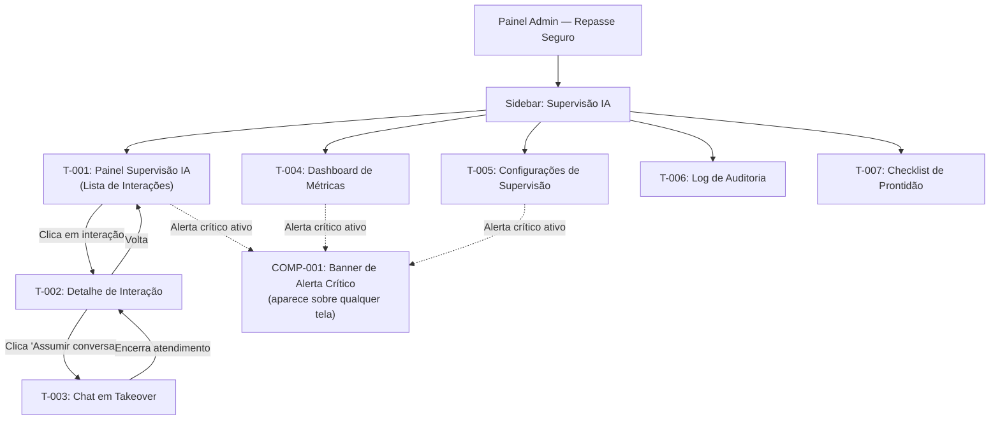

# Mapa de Telas — AI-Dani-Admin

## Módulo de Supervisão Operacional

| Campo | Valor |
|---|---|
| Destinatário | Produto, Design e Engenharia |
| Escopo | Inventário completo de telas, estados e fluxos de navegação do módulo AI-Dani-Admin |
| Módulo | AI-Dani-Admin |
| Versão | v1.0 |
| Responsável | Claude Code Desktop |
| Data da versão | 2026-03-23 (America/Fortaleza) |
| Inputs | D01 (RN-DA-030 a RN-DA-039), D05 (RF-001 a RF-026) |

---

> **📌 TL;DR**
>
> - **7 telas principais** no módulo AI-Dani-Admin, todas exclusivas do perfil Admin.
> - **Acesso:** via sidebar do painel Admin da plataforma Repasse Seguro. Cessionário e Cedente não veem estas telas.
> - **Telas:** T-001 Painel Supervisão IA (listagem), T-002 Detalhe de Interação, T-003 Chat em Takeover, T-004 Dashboard de Métricas, T-005 Configurações de Supervisão, T-006 Log de Auditoria, T-007 Checklist de Prontidão para Lançamento.
> - **Alerta crítico:** banner global que aparece sobre qualquer tela quando há incidente crítico (desligamento automático, taxa de erro elevada).
> - **Sem tela de login própria** — autenticação gerida pela plataforma Repasse Seguro.

---

## 1. Inventário de Telas

| ID | Tela | RFs de Origem | Módulo | Acesso |
|---|---|---|---|---|
| T-001 | Painel Supervisão IA — Lista de Interações | RF-001, RF-002, RF-003, RF-004, RF-007, RF-026 | Supervisão de Interações | Admin |
| T-002 | Detalhe de Interação | RF-001, RF-007, RF-008, RF-010 | Supervisão + Takeover | Admin |
| T-003 | Chat em Takeover (Admin View) | RF-008, RF-009, RF-011 | Takeover Manual | Admin |
| T-004 | Dashboard de Métricas | RF-012, RF-013 | Métricas | Admin |
| T-005 | Configurações de Supervisão (Threshold) | RF-014, RF-015, RF-016 | Configuração | Admin |
| T-006 | Log de Auditoria | RF-004, RF-005, RNF-005 | Auditoria | Admin |
| T-007 | Checklist de Prontidão para Lançamento | RF-020, RF-021, RF-022, RF-023, RF-024, RF-025 | Prontidão | Admin |
| COMP-001 | Banner de Alerta Crítico (Global) | RF-005, RF-006 | Alertas | Admin |
| COMP-002 | Separador Visual de Takeover (no chat do usuário) | RF-008, RF-009 | Takeover | N/A (exibido para usuário) |
| MODAL-001 | Modal de Confirmação de Takeover | RF-008 | Takeover Manual | Admin |
| MODAL-002 | Modal de Encerramento de Takeover | RF-009 | Takeover Manual | Admin |
| MODAL-003 | Modal de Reativação de Agente | RF-005 | Alertas | Admin |

[CORRIGIDO: PROBLEMA-003] — Modais de confirmação adicionados ao inventário de componentes. Documentados em D07 seções 11.1, 11.2 e 11.3 e em D09 seções 11.1, 11.2 e 11.3.

---

## 2. Fluxo de Navegação Principal



---

## 3. Detalhamento por Tela

### T-001 — Painel Supervisão IA (Lista de Interações)

**Descrição:** Tela principal do módulo. Exibe a lista paginada de todas as interações dos agentes, com filtros, badges de status e acesso rápido ao takeover.

**Rota:** `/admin/supervisao-ia`

**Seções da tela:**

| Seção | Conteúdo | RF de Origem |
|---|---|---|
| Header | Título "Supervisão IA", contador de interações sinalizadas, botão de filtros | RF-001 |
| Barra de filtros | Chips de filtros ativos (data, usuário, confiança, agente) + botão "Limpar filtros" | RF-003 |
| Lista de interações | Tabela/lista com 8 campos por interação (RF-001) | RF-001 |
| Estado vazio | Ícone + "Nenhuma interação registrada no período selecionado." + sugestão | RF-002 |
| Skeleton loading | 8 linhas skeleton durante carregamento inicial / 5 linhas durante filtro | D04 |

**Estados da tela:**

| Estado | Trigger | Comportamento |
|---|---|---|
| Loading inicial | Primeiro acesso à tela | Skeleton de 8 linhas |
| Loading de filtro | Admin aplica ou remove filtro | Skeleton inline de 5 linhas (lista não desaparece) |
| Lista populada | Dados disponíveis | Tabela com interações |
| Estado vazio | Nenhuma interação no período/filtro | Ícone + texto + sugestão |
| Interação sinalizada | Confiança < threshold | Linha com background warning + badge "Sinalizada" + border-left warning |
| Interação em takeover | Admin assumiu conversa | Linha com background takeover-subtle + badge "Em takeover" |
| Alerta crítico ativo | Desligamento automático ou outro alerta P0 | Banner COMP-001 aparece no topo |

**Ações disponíveis:**

| Ação | Elemento | Destino |
|---|---|---|
| Ver detalhe | Clique na linha de interação | T-002 |
| Filtrar por data | Dropdown/datepicker no header | Atualiza lista inline |
| Filtrar por agente | Dropdown no header | Atualiza lista inline |
| Filtrar por confiança | Input de range | Atualiza lista inline |
| Remover filtro individual | x no chip | Remove filtro, atualiza lista |
| Limpar todos filtros | Botão "Limpar filtros" | Remove todos os chips, restaura lista |

---

### T-002 — Detalhe de Interação

**Descrição:** Exibe todos os dados de uma interação específica, incluindo histórico completo do chat, nível de confiança, dados utilizados e opção de takeover.

**Rota:** `/admin/supervisao-ia/interacoes/:id`

**Seções da tela:**

| Seção | Conteúdo | RF de Origem |
|---|---|---|
| Header | Botão Voltar + ID da interação + badge de status | RF-001 |
| Identidade do usuário | ID anonimizado + agente atendente + data/hora | RF-001 |
| Métricas da interação | Nível de confiança (percentual), latência (segundos), dados utilizados | RF-001 |
| Histórico do chat | Mensagens do usuário e respostas do agente em ordem cronológica | RF-001 |
| Botão de ação | "Assumir conversa" (sempre visível; habilitado se conversa não encerrada) | RF-007, RF-008 |

**Estados da tela:**

| Estado | Trigger | Comportamento |
|---|---|---|
| Loading | Acesso via T-001 | Skeleton dos campos de métricas e chat |
| Interação respondida | Confiança >= threshold | Badge verde "Respondida pela IA" |
| Interação sinalizada | Confiança < threshold | Badge amarelo "Aguardando revisão". Botão "Assumir conversa" com destaque visual |
| Interação em takeover | Admin assumiu | Badge azul "Em atendimento humano". Botão muda para "Encerrar atendimento" |
| Interação encerrada | Conversa encerrada | Badge cinza "Encerrada". Botão "Assumir conversa" desabilitado com tooltip "Conversa encerrada" |

**Ações disponíveis:**

| Ação | Elemento | Destino/Efeito |
|---|---|---|
| Voltar | Botão Voltar no header | T-001 |
| Assumir conversa | Botão primary | Modal de confirmação → T-003 |
| Encerrar atendimento | Botão (quando em takeover) | Modal de confirmação → retorno ao agente |

---

### T-003 — Chat em Takeover (Admin View)

**Descrição:** Interface de chat ativa para o Admin enviar mensagens diretamente ao usuário durante o takeover. Visão espelhada do chat do usuário, com campo de digitação para o Admin.

**Rota:** `/admin/supervisao-ia/interacoes/:id/takeover`

**Seções da tela:**

| Seção | Conteúdo | RF de Origem |
|---|---|---|
| Header | "Atendimento humano ativo" + nome do usuário (anonimizado) + botão "Encerrar atendimento" | RF-008 |
| Histórico do chat | Mensagens anteriores (IA + usuário) + mensagens do takeover | RF-008 |
| Separador visual | Linha com texto "Atendimento humano" — divide histórico de IA do atendimento humano | RF-008 |
| Campo de digitação | Área de texto para o Admin digitar e enviar mensagens | RF-008 |
| Status | Indicador "Agente pausado — você está respondendo" | RF-008 |

**Estados da tela:**

| Estado | Trigger | Comportamento |
|---|---|---|
| Takeover ativo | Admin confirma takeover | Separador visual exibido. Campo de digitação habilitado. Agente pausado. |
| Mensagem do usuário recebida | Usuário envia mensagem durante takeover | Mensagem aparece em tempo real no chat |
| Mensagem Admin enviada | Admin digita e envia | Mensagem aparece com avatar diferenciado "Equipe Repasse Seguro" |
| Encerramento confirmado | Admin encerra | Mensagem de retorno ao agente enviada ao usuário. Redirect para T-002. |
| Conflito de takeover | Segundo Admin tenta assumir a mesma conversa | Toast de aviso: "Esta conversa já está em atendimento por outro analista." |

**Ações disponíveis:**

| Ação | Elemento | Efeito |
|---|---|---|
| Enviar mensagem | Campo de texto + Enter/botão Enviar | Mensagem entregue ao usuário em tempo real |
| Encerrar atendimento | Botão no header | Modal de confirmação → agente retoma → redirect T-002 |

---

### T-004 — Dashboard de Métricas

**Descrição:** Visão consolidada de desempenho dos agentes com indicadores em tempo real e histórico. Filtrável por período e agente.

**Rota:** `/admin/supervisao-ia/metricas`

**Seções da tela:**

| Seção | Conteúdo | RF de Origem |
|---|---|---|
| Header | "Dashboard de Métricas" + seletores de período (dia/semana/mês) + seletor de agente | RF-012 |
| Cards de indicadores | 5 cards: Volume de interações, Top 10 perguntas, Taxa de recusa, CSAT médio, Tempo médio de resposta | RF-012 |
| Gráfico de volume | Gráfico de barras/linha com volume por período (chart-1 e chart-2) | RF-012 |
| Top perguntas | Lista das 10 perguntas mais frequentes com contador | RF-012 |

**Estados dos cards:**

| Estado | Trigger | Comportamento |
|---|---|---|
| Loading | Troca de filtro / carregamento inicial | Skeleton do card inteiro com shimmer |
| Com dados | Dados disponíveis | Valor + label + trend indicator |
| Sem dados | Período sem interações | "Dados insuficientes para o período selecionado" + ícone ℹ️. Nunca zero ou 0%. |
| Atualização em tempo real | Nova interação registrada | Flash de valor (opacity transition 80ms + 150ms) |

**Ações disponíveis:**

| Ação | Elemento | Efeito |
|---|---|---|
| Trocar período | Seletor dia/semana/mês | Cards atualizam com skeleton inline |
| Filtrar por agente | Dropdown de agente | Cards atualizam para o agente selecionado |

---

### T-005 — Configurações de Supervisão

**Descrição:** Permite ao Admin ajustar o threshold de confiança para sinalização automática de interações e outros parâmetros operacionais do módulo.

**Rota:** `/admin/supervisao-ia/configuracoes`

**Seções da tela:**

| Seção | Conteúdo | RF de Origem |
|---|---|---|
| Header | "Configurações de Supervisão" | — |
| Threshold de confiança | Label + valor atual + input/slider + range informativo (50%–95%) + botão Salvar | RF-014, RF-015, RF-016 |
| Rate limit do webchat | Campo com valor atual (30 msg/h) + botão Salvar | RF-019 |
| Histórico de alterações | Tabela com últimas 10 alterações de configuração (quem alterou, de qual valor para qual, quando) | RF-015, RNF-005 |

**Estados da tela:**

| Estado | Trigger | Comportamento |
|---|---|---|
| Valor padrão | Primeira vez | Threshold exibido como 80% |
| Edição | Admin clica no campo/slider | Campo habilitado para edição |
| Validação inválida | Valor < 50% ou > 95% | Erro inline abaixo do campo. Campo mantém valor inválido. Modal não fecha. |
| Salvo com sucesso | Valor válido + confirmar | Toast "Nível de supervisão atualizado para [X]%." Log registrado. |
| Loading de salvar | Enquanto salva | Botão exibe loading state (spinner interno). Campo desabilitado. |

**Ações disponíveis:**

| Ação | Elemento | Efeito |
|---|---|---|
| Ajustar threshold | Input/slider | Preview do novo valor |
| Salvar threshold | Botão Salvar | Validação → sucesso/erro |
| Ver histórico | Tabela de alterações | Abre expandido abaixo da configuração |

---

### T-006 — Log de Auditoria

**Descrição:** Registro imutável de todas as ações críticas do Admin: takeovers, alterações de threshold, reativações de agente, acessos ao painel.

**Rota:** `/admin/supervisao-ia/auditoria`

**Seções da tela:**

| Seção | Conteúdo | RF de Origem |
|---|---|---|
| Header | "Log de Auditoria" + filtros de data e tipo de ação | RNF-005 |
| Lista de eventos | Tabela com: tipo de ação, Admin ID, timestamp, detalhes da ação | RNF-005, RF-004 |
| Filtros | Por data, por Admin, por tipo de ação (takeover/threshold/reativação/acesso) | RNF-005 |

**Estados da tela:** [CORRIGIDO: PROBLEMA-002]

| Estado | Trigger | Comportamento |
|---|---|---|
| Loading inicial | Primeiro acesso ou troca de filtro | Skeleton da tabela (8 linhas) com shimmer |
| Com dados | Eventos disponíveis no período | Tabela com eventos paginados |
| Estado vazio | Nenhum evento no período/filtro | Ícone de documento vazio + "Nenhum evento registrado neste período." (D08 seção 4.3) |
| Filtro ativo | Admin aplica filtro de data, Admin ou tipo | Chips de filtro acima da tabela (mesmo padrão de T-001) + skeleton inline ao aplicar |

**Tipos de eventos registrados:**

| Tipo de Evento | Detalhes exibidos |
|---|---|
| Acesso ao painel | Admin ID + timestamp + filtros aplicados |
| Takeover iniciado | Admin ID + ID da interação + timestamp + motivo |
| Takeover encerrado | Admin ID + ID da interação + timestamp |
| Threshold alterado | Admin ID + valor anterior + valor novo + timestamp |
| Agente reativado | Admin ID + nome do agente + timestamp |
| Alerta disparado | Tipo de alerta + condição + timestamp |

---

### T-007 — Checklist de Prontidão para Lançamento

**Descrição:** Interface para verificação e aprovação dos critérios de prontidão antes do lançamento de qualquer agente em produção.

**Rota:** `/admin/supervisao-ia/checklist-lancamento`

**Seções da tela:**

| Seção | Conteúdo | RF de Origem |
|---|---|---|
| Header | "Checklist de Prontidão para Lançamento" + agente alvo (selecionável) | RF-020 |
| Grupo 1: Isolamento de Acesso | 3 itens verificáveis (filtro de escopo, filtro de contexto, teste de penetração) | RF-020, RF-021 |
| Grupo 2: Cobertura de Recusa | 4 itens verificáveis (identidade/tom, dados bloqueados, exemplos de recusa, formato de resposta) + campo de resultado dos testes adversariais | RF-022, RF-023 |
| Grupo 3: Supervisão Funcional | 4 itens verificáveis (registro de interações, dashboard, alerta, takeover) | RF-024, RF-025 |
| Status geral | Indicador de prontidão: "Pronto para lançamento" ou "Bloqueado — X itens pendentes" | RF-020, RF-024 |
| Botão de autorização | "Autorizar lançamento" — habilitado apenas quando 100% dos itens aprovados | RF-020, RF-024 |

**Estados da tela:**

| Estado | Trigger | Comportamento |
|---|---|---|
| Itens pendentes | Um ou mais itens não verificados | Botão "Autorizar lançamento" desabilitado. Badge "Bloqueado" no header. |
| Todos aprovados | 100% dos itens verificados | Botão "Autorizar lançamento" habilitado. Badge "Pronto para lançamento". |
| Item falhou | Engenharia marca item como falhou | Item em vermelho. Mensagem de bloqueio. |

---

### COMP-001 — Banner de Alerta Crítico (Global)

**Descrição:** Componente de alerta que aparece no topo de qualquer tela do módulo Admin quando uma condição crítica é detectada. Persiste até que o Admin tome ação.

**Trigger de exibição:**

| Alerta | Condição |
|---|---|
| Desligamento automático | Taxa de erro > 30% em 15 min — aparece instantaneamente (`--duration-instant` 100ms) |
| Latência alta | > SLA por 5 min consecutivos |
| Taxa de erro elevada | > 10% em 15 min |

**Conteúdo do banner:**

| Elemento | Conteúdo |
|---|---|
| Ícone | `bell-ring` Lucide, cor destrutiva |
| Título | Tipo do alerta em bold |
| Descrição | Condição que gerou o alerta + valor medido |
| CTA | Botão de ação relevante (ex: "Reativar agente", "Investigar") |
| Fechar | Apenas após ação tomada ou confirmação manual pelo Admin |

---

### COMP-002 — Separador Visual de Takeover (no chat do usuário)

**Descrição:** Componente exibido na interface do chat do usuário (Cessionário/Cedente) quando o Admin inicia ou encerra um takeover.

**Conteúdo:**

| Estado | Mensagem | Elementos visuais |
|---|---|---|
| Início do takeover | "Um analista da equipe Repasse Seguro assumiu essa conversa para ajudá-lo. Como posso ajudar?" | Avatar de pessoa (não IA) + nome "Equipe Repasse Seguro" + linha divisória "Atendimento humano" |
| Retorno ao agente | "Você está novamente em atendimento com [nome do agente]." | Avatar padrão do agente + linha divisória "Retorno ao atendimento automatizado" |

---

## 4. Matriz de Telas por Fluxo

### Fluxo 1: Monitoramento e Takeover

```
Admin acessa painel
  → T-001: Lista de Interações
    → [interação sinalizada] → T-002: Detalhe
      → [inicia takeover] → T-003: Chat em Takeover
        → [encerra takeover] → T-002: Detalhe
          → [volta] → T-001: Lista
```

### Fluxo 2: Configuração de Threshold

```
Admin acessa configurações
  → T-005: Configurações de Supervisão
    → [ajusta threshold] → validação inline
      → [sucesso] → toast + log registrado
      → [erro] → mensagem inline
```

### Fluxo 3: Alerta Crítico

```
Sistema detecta condição crítica
  → COMP-001 aparece sobre tela atual
    → [Admin clica "Reativar agente"] → ação executada → COMP-001 desaparece
    → [Admin ignora] → COMP-001 persiste
```

### Fluxo 4: Checklist de Lançamento

```
Admin acessa checklist
  → T-007: Checklist de Prontidão
    → [itens verificados] → progresso visual
      → [100% aprovados] → botão "Autorizar lançamento" habilitado
        → [Admin autoriza] → lançamento registrado
      → [item falhou] → botão desabilitado + alerta de bloqueio
```

---

## 5. Rastreabilidade Telas → RFs

| Tela | RFs Cobertos |
|---|---|
| T-001 | RF-001, RF-002, RF-003, RF-004, RF-007, RF-026 |
| T-002 | RF-001, RF-007, RF-008, RF-010 |
| T-003 | RF-008, RF-009, RF-011 |
| T-004 | RF-012, RF-013 |
| T-005 | RF-014, RF-015, RF-016, RF-019 |
| T-006 | RF-004, RF-005, RNF-005 |
| T-007 | RF-020, RF-021, RF-022, RF-023, RF-024, RF-025 |
| COMP-001 | RF-005, RF-006 |
| COMP-002 | RF-008, RF-009 |

---

## 6. Changelog

| Data | Versão | Descrição |
|---|---|---|
| 2026-03-23 | v1.0 | Versão inicial. 7 telas + 2 componentes globais. Cobertura de todos os RFs do D05. |
