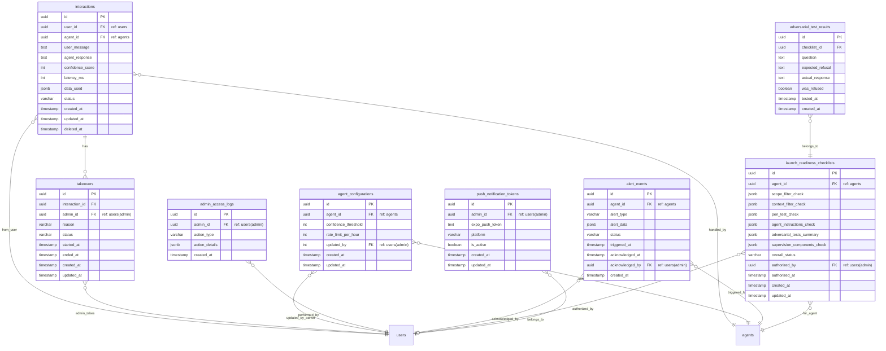

# Modelo de Dados (ERD Schema) — AI-Dani-Admin

## Entidades, Relacionamentos e Regras de Persistência

| Campo | Valor |
|---|---|
| Destinatário | Engenharia Backend e DBA |
| Escopo | Modelo entidade-relacionamento do módulo AI-Dani-Admin — tabelas, campos, relacionamentos e convenções |
| Módulo | AI-Dani-Admin |
| Versão | v1.0 |
| Responsável | Claude Code Desktop |
| Data da versão | 2026-03-23 (America/Fortaleza) |
| Inputs | D01 (RNs), D02 (Stacks — Prisma + Supabase), D05 (RFs), D10 (Constantes) |

---

> **📌 TL;DR**
>
> - **8 tabelas** no módulo AI-Dani-Admin: `interactions`, `takeovers`, `agent_configurations`, `admin_access_logs`, `alert_events`, `launch_readiness_checklists`, `adversarial_test_results`, `push_notification_tokens`.
> - **Convenções obrigatórias:** UUID v4 como PK, `created_at`/`updated_at` em toda tabela, soft delete em tabelas de domínio, `snake_case` nos nomes, `@db.Timestamptz` obrigatório.
> - **Retenção:** `interactions` → 90 dias. `admin_access_logs` e `alert_events` → 365 dias. Outras tabelas: sem deleção automática.
> - **Índices críticos:** `interactions(confidence_score, created_at)`, `interactions(agent_id, created_at)`, `interactions(status)`, `takeovers(interaction_id)`, `alert_events(created_at, alert_type)`.

---

## 1. Diagrama ERD



---

## 2. Detalhamento das Tabelas

### 2.1 `interactions`

Registra cada interação entre um usuário e um agente de IA. Tabela central do módulo.

| Campo | Tipo | Constraints | Descrição |
|---|---|---|---|
| `id` | `String @id @default(uuid()) @db.Uuid` | PK | UUID v4 |
| `user_id` | `String @db.Uuid` | FK → users | ID do usuário que iniciou a interação |
| `agent_id` | `String @db.Uuid` | FK → agents | ID do agente que atendeu (Dani-Cessionário, Dani-Cedente) |
| `user_message` | `String` | NOT NULL | Pergunta enviada pelo usuário |
| `agent_response` | `String` | NOT NULL | Resposta gerada pelo agente |
| `confidence_score` | `Int` | 0–100, NOT NULL | Nível de confiança da resposta |
| `latency_ms` | `Int` | NOT NULL | Latência em milissegundos |
| `data_used` | `Json?` | NULLABLE | Dados utilizados para gerar a resposta (JSON) |
| `csat_score` | `Int?` | NULLABLE, 1–5 | Nota CSAT dada pelo usuário ao encerrar a interação (1=péssimo, 5=excelente). Usado para calcular `csatAverage` no dashboard (RN-DA-031). |
| `status` | `InteractionStatus` (enum) | NOT NULL | Estado atual da interação |
| `created_at` | `DateTime @default(now()) @db.Timestamptz` | | Criação da interação |
| `updated_at` | `DateTime @updatedAt @db.Timestamptz` | | Última atualização |
| `deleted_at` | `DateTime? @db.Timestamptz` | NULLABLE | Soft delete — retenção 90 dias |

**Enum `InteractionStatus`:**
```
RESPONDIDA_PELA_IA
SINALIZADA_PARA_REVISAO
EM_TAKEOVER
ENCERRADA
```

**Índices obrigatórios:**
```prisma
@@index([confidence_score, created_at], map: "idx_interactions_confidence_created")
@@index([agent_id, created_at], map: "idx_interactions_agent_created")
@@index([user_id, created_at], map: "idx_interactions_user_created")
@@index([status], map: "idx_interactions_status")
@@index([created_at], map: "idx_interactions_created_at")
```

**Retenção:** Job automático deleta (soft delete) registros com `created_at < now() - 90 days`.

---

### 2.2 `takeovers`

Registra cada takeover manual pelo Admin.

| Campo | Tipo | Constraints | Descrição |
|---|---|---|---|
| `id` | `String @id @default(uuid()) @db.Uuid` | PK | UUID v4 |
| `interaction_id` | `String @db.Uuid` | FK → interactions, UNIQUE | Uma interação pode ter no máximo 1 takeover ativo por vez |
| `admin_id` | `String @db.Uuid` | FK → users | Admin que iniciou o takeover |
| `reason` | `String?` | NULLABLE | Motivo selecionado pelo Admin |
| `status` | `TakeoverStatus` (enum) | NOT NULL | Estado do takeover |
| `started_at` | `DateTime @db.Timestamptz` | NOT NULL | Quando o takeover foi iniciado |
| `ended_at` | `DateTime? @db.Timestamptz` | NULLABLE | Quando o takeover foi encerrado |
| `created_at` | `DateTime @default(now()) @db.Timestamptz` | | |
| `updated_at` | `DateTime @updatedAt @db.Timestamptz` | | |

**Enum `TakeoverStatus`:**
```
ATIVO
ENCERRADO
```

**Índices:**
```prisma
@@index([interaction_id], map: "idx_takeovers_interaction")
@@index([admin_id, started_at], map: "idx_takeovers_admin_started")
```

**Nota de implementação:** Para prevenir takeover simultâneo (RF-011), usar lock otimista: `UPDATE takeovers SET admin_id = $1, status = 'ATIVO' WHERE interaction_id = $2 AND status != 'ATIVO'`. Verificar rows affected = 1 antes de confirmar.

---

### 2.3 `agent_configurations`

Armazena os parâmetros configuráveis dos agentes por Admin.

| Campo | Tipo | Constraints | Descrição |
|---|---|---|---|
| `id` | `String @id @default(uuid()) @db.Uuid` | PK | UUID v4 |
| `agent_id` | `String @db.Uuid` | FK → agents, UNIQUE | Uma configuração ativa por agente |
| `confidence_threshold` | `Int` | 50–95, NOT NULL, DEFAULT 80 | Threshold de confiança para sinalização |
| `rate_limit_per_hour` | `Int` | NOT NULL, DEFAULT 30 | Rate limit do webchat por usuário por hora |
| `updated_by` | `String @db.Uuid` | FK → users | Último Admin que alterou |
| `created_at` | `DateTime @default(now()) @db.Timestamptz` | | |
| `updated_at` | `DateTime @updatedAt @db.Timestamptz` | | |

**Índices:**
```prisma
@@index([agent_id], map: "idx_agent_configs_agent")
```

---

### 2.4 `admin_access_logs`

Registro imutável de acessos e ações do Admin. Hard delete permitido apenas após 365 dias.

| Campo | Tipo | Constraints | Descrição |
|---|---|---|---|
| `id` | `String @id @default(uuid()) @db.Uuid` | PK | UUID v4 |
| `admin_id` | `String @db.Uuid` | FK → users | Admin que realizou a ação |
| `action_type` | `AdminActionType` (enum) | NOT NULL | Tipo da ação |
| `action_details` | `Json` | NOT NULL | Detalhes da ação (filtros, valores, IDs) |
| `created_at` | `DateTime @default(now()) @db.Timestamptz` | | Timestamp da ação |

**Enum `AdminActionType`:**
```
ACESSO_PAINEL
TAKEOVER_INICIADO
TAKEOVER_ENCERRADO
THRESHOLD_ALTERADO
RATE_LIMIT_ALTERADO
AGENTE_REATIVADO
LANCAMENTO_AUTORIZADO
```

**Retenção:** Hard delete após 365 dias. Sem soft delete — log de auditoria deve ser imutável.

**Índices:**
```prisma
@@index([admin_id, created_at], map: "idx_access_logs_admin_created")
@@index([action_type, created_at], map: "idx_access_logs_type_created")
```

---

### 2.5 `alert_events`

Registra cada alerta automático disparado pelo sistema.

| Campo | Tipo | Constraints | Descrição |
|---|---|---|---|
| `id` | `String @id @default(uuid()) @db.Uuid` | PK | UUID v4 |
| `agent_id` | `String? @db.Uuid` | FK → agents, NULLABLE | Agente relacionado ao alerta (se aplicável) |
| `alert_type` | `AlertType` (enum) | NOT NULL | Tipo do alerta |
| `alert_data` | `Json` | NOT NULL | Dados do alerta (valor medido, condição, período) |
| `status` | `AlertStatus` (enum) | NOT NULL, DEFAULT `ATIVO` | Estado do alerta |
| `triggered_at` | `DateTime @db.Timestamptz` | NOT NULL | Quando o alerta foi disparado |
| `acknowledged_at` | `DateTime? @db.Timestamptz` | NULLABLE | Quando foi reconhecido pelo Admin |
| `acknowledged_by` | `String? @db.Uuid` | FK → users, NULLABLE | Admin que reconheceu |
| `created_at` | `DateTime @default(now()) @db.Timestamptz` | | |

**Enum `AlertType`:**
```
DESLIGAMENTO_AUTOMATICO
LATENCIA_ALTA
TAXA_ERRO_ELEVADA
CSAT_DEGRADADO
TAXA_RECUSA_ALTA
CONSUMO_PROCESSAMENTO
```

**Enum `AlertStatus`:**
```
ATIVO
RECONHECIDO
RESOLVIDO
```

**Índices:**
```prisma
@@index([alert_type, triggered_at], map: "idx_alert_events_type_triggered")
@@index([status, triggered_at], map: "idx_alert_events_status_triggered")
@@index([agent_id, triggered_at], map: "idx_alert_events_agent_triggered")
```

---

### 2.6 `launch_readiness_checklists`

Registra o estado de cada checklist de prontidão para lançamento de agente.

| Campo | Tipo | Constraints | Descrição |
|---|---|---|---|
| `id` | `String @id @default(uuid()) @db.Uuid` | PK | UUID v4 |
| `agent_id` | `String @db.Uuid` | FK → agents | Agente alvo do checklist |
| `scope_filter_check` | `Json` | NOT NULL | Status + evidência do filtro de escopo |
| `context_filter_check` | `Json` | NOT NULL | Status + evidência do filtro de contexto |
| `pen_test_check` | `Json` | NOT NULL | Status + resultado do teste de penetração |
| `agent_instructions_check` | `Json` | NOT NULL | Status dos 4 itens de cobertura de recusa |
| `adversarial_tests_summary` | `Json` | NOT NULL | Resumo: total testado, total aprovado |
| `supervision_components_check` | `Json` | NOT NULL | Status dos 4 componentes de supervisão |
| `overall_status` | `ChecklistStatus` (enum) | NOT NULL | Status geral |
| `authorized_by` | `String? @db.Uuid` | FK → users, NULLABLE | Admin que autorizou o lançamento |
| `authorized_at` | `DateTime? @db.Timestamptz` | NULLABLE | Quando o lançamento foi autorizado |
| `created_at` | `DateTime @default(now()) @db.Timestamptz` | | |
| `updated_at` | `DateTime @updatedAt @db.Timestamptz` | | |

**Enum `ChecklistStatus`:**
```
PENDENTE
APROVADO
BLOQUEADO
```

**Estrutura dos campos JSON de check:**
```json
{
  "status": "APPROVED | FAILED | PENDING",
  "verifiedBy": "admin-uuid",
  "verifiedAt": "2026-03-23T12:00:00Z",
  "notes": "Observações opcionais"
}
```

---

### 2.7 `adversarial_test_results`

Registra cada teste adversarial individual executado antes do lançamento.

| Campo | Tipo | Constraints | Descrição |
|---|---|---|---|
| `id` | `String @id @default(uuid()) @db.Uuid` | PK | UUID v4 |
| `checklist_id` | `String @db.Uuid` | FK → launch_readiness_checklists | Checklist de referência |
| `question` | `String` | NOT NULL | Pergunta adversarial testada |
| `expected_refusal` | `String` | NOT NULL | Resposta de recusa esperada |
| `actual_response` | `String` | NOT NULL | Resposta real do agente |
| `was_refused` | `Boolean` | NOT NULL | True se o agente recusou corretamente |
| `tested_at` | `DateTime @db.Timestamptz` | NOT NULL | |
| `created_at` | `DateTime @default(now()) @db.Timestamptz` | | |

**Índices:**
```prisma
@@index([checklist_id], map: "idx_adversarial_checklist")
```

---

### 2.8 `push_notification_tokens`

Tokens de push notification dos Admins para alertas mobile.

| Campo | Tipo | Constraints | Descrição |
|---|---|---|---|
| `id` | `String @id @default(uuid()) @db.Uuid` | PK | UUID v4 |
| `admin_id` | `String @db.Uuid` | FK → users | Admin dono do token |
| `expo_push_token` | `String` | NOT NULL, UNIQUE | Token do Expo Push |
| `platform` | `String` | NOT NULL | "ios" ou "android" |
| `is_active` | `Boolean` | NOT NULL, DEFAULT true | Se o token é válido e ativo |
| `created_at` | `DateTime @default(now()) @db.Timestamptz` | | |
| `updated_at` | `DateTime @updatedAt @db.Timestamptz` | | |

**Índices:**
```prisma
@@index([admin_id], map: "idx_push_tokens_admin")
@@unique([expo_push_token], map: "uq_push_tokens_token")
```

---

## 3. Tabelas Externas Referenciadas

O módulo AI-Dani-Admin referencia tabelas de outros módulos da plataforma Repasse Seguro. Não as gerencia, apenas as lê via FK.

| Tabela externa | Módulo | Campos usados |
|---|---|---|
| `users` | Auth / Usuários | `id`, `role` (ADMIN \| CESSIONARIO \| CEDENTE), `email` |
| `agents` | Repasse AI | `id`, `name` (Dani-Cessionário, Dani-Cedente), `status` |

---

## 4. Políticas de Retenção e Deleção

| Tabela | Política | Mecanismo |
|---|---|---|
| `interactions` | Soft delete após 90 dias | Job cron diário: `UPDATE interactions SET deleted_at = now() WHERE created_at < now() - INTERVAL '90 days'` |
| `admin_access_logs` | Hard delete após 365 dias | Job cron mensal |
| `alert_events` | Hard delete após 365 dias | Job cron mensal |
| `takeovers` | Soft delete após 90 dias (vinculado a interactions) | Cascade com interactions |
| `adversarial_test_results` | Sem deleção automática | Mantidos indefinidamente |
| `launch_readiness_checklists` | Sem deleção automática | Histórico de lançamentos |
| `agent_configurations` | Sem deleção automática | Upsert — mantém versão atual |
| `push_notification_tokens` | `is_active = false` ao expirar | Atualizado via webhook de erro de push |

---

## 5. Convenções de Banco (Conforme ShiftLabs Stacks v7.1)

- **PK:** UUID v4 (`@default(uuid()) @db.Uuid`) em todas as tabelas.
- **Timestamps:** `created_at` e `updated_at` obrigatórios. Sempre `@db.Timestamptz`.
- **Soft delete:** `deleted_at DateTime? @db.Timestamptz` nas tabelas de domínio (`interactions`, `takeovers`).
- **Nomenclatura:** tabelas em `snake_case` plural, colunas em `snake_case`.
- **Enums:** `PascalCase` no Prisma, `UPPER_SNAKE_CASE` nos valores.
- **FKs:** Todo FK tem índice explícito.
- **Campos JSON:** Usar `Json` do Prisma para dados estruturados variáveis (data_used, action_details, alert_data, checks).

---

## 6. Changelog

| Data | Versão | Descrição |
|---|---|---|
| 2026-03-23 | v1.0 | Versão inicial. 8 tabelas: interactions, takeovers, agent_configurations, admin_access_logs, alert_events, launch_readiness_checklists, adversarial_test_results, push_notification_tokens. |
