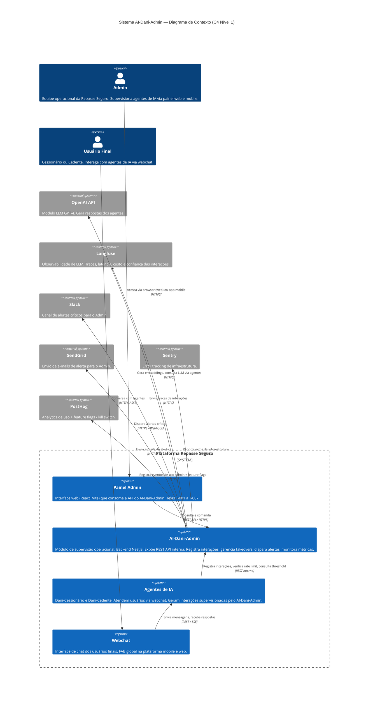
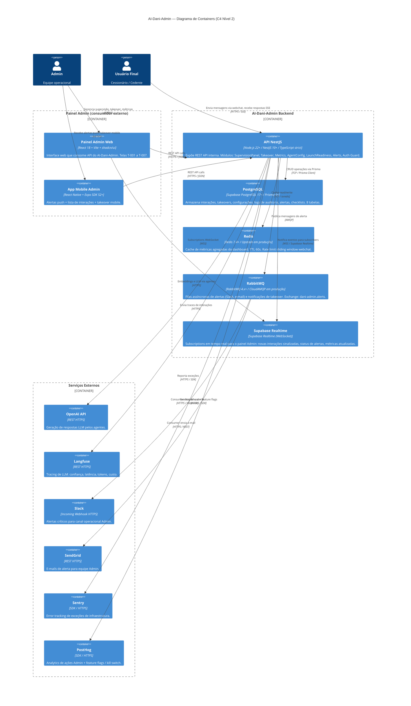
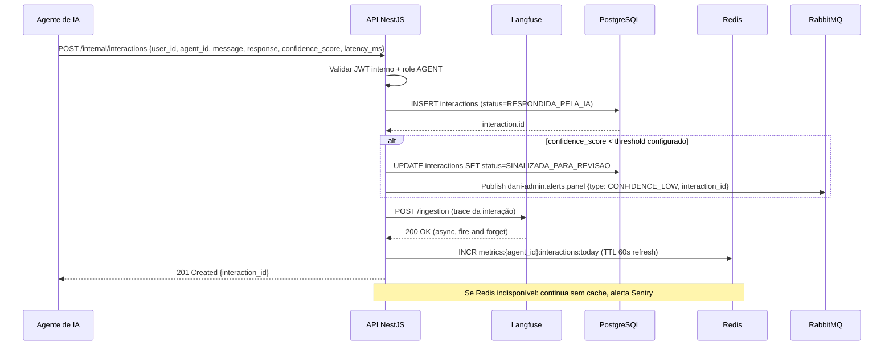
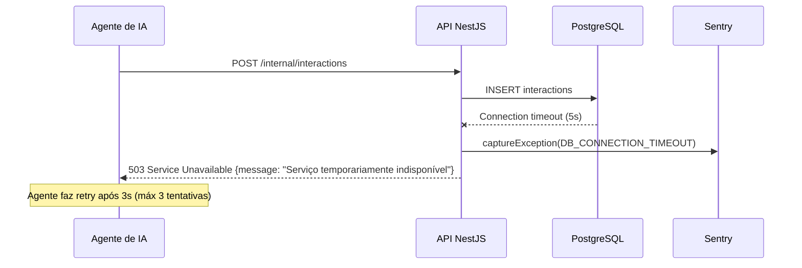
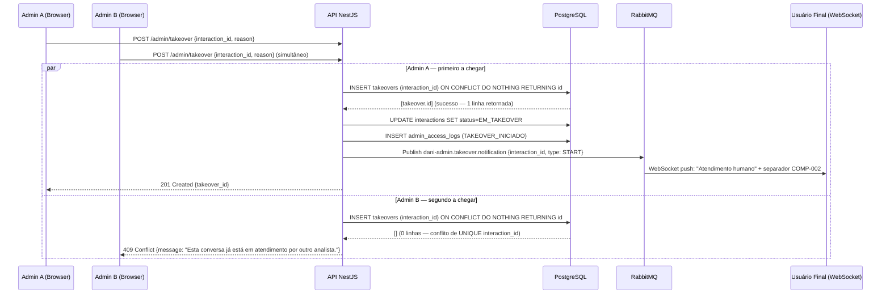
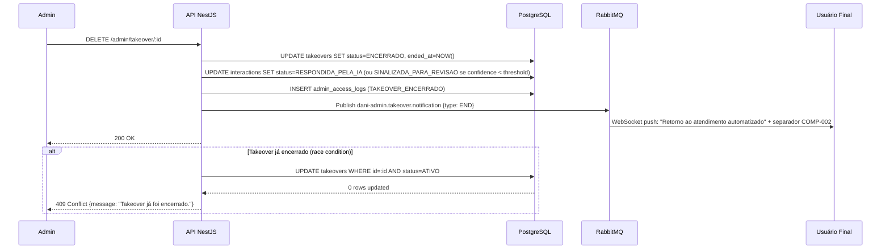
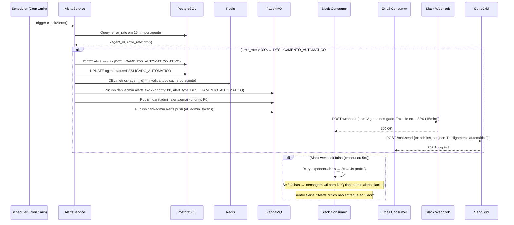
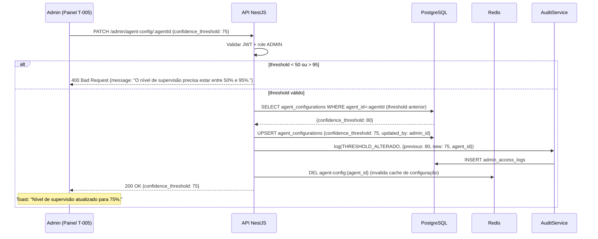
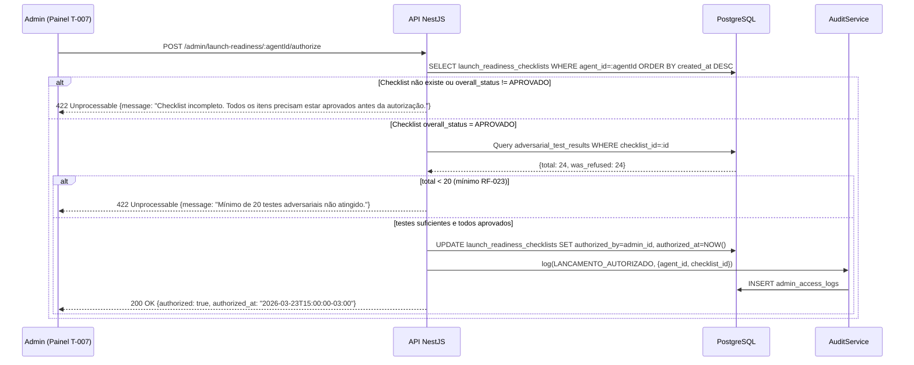

# Especificações Técnicas — AI-Dani-Admin

## Arquitetura Técnica do Módulo de Supervisão Operacional

| Campo | Valor |
|---|---|
| Destinatário | Arquitetura e Engenharia |
| Escopo | Documento de arquitetura interna com módulos, fluxos, containers, filas e decisões arquiteturais |
| Módulo | AI-Dani-Admin |
| Versão | v1.0 |
| Responsável | Claude Code Desktop |
| Data da versão | 2026-03-23 (America/Fortaleza) |
| Inputs | D01 (Regras de Negócio), D02 (Stacks), D05 (PRD), D06 (Mapa de Telas), D10 (Glossário Técnico), D11 (Mobile), D12 (ERD Schema) |

---

> **📌 TL;DR**
>
> - **Padrão arquitetural:** Módulo backend NestJS (DDD por domínio) sem frontend próprio — expõe REST API interna consumida pelo painel Admin da plataforma Repasse Seguro.
> - **Containers:** 6 containers principais — Backend NestJS, PostgreSQL (Supabase), Redis, RabbitMQ, Supabase Realtime, serviços externos (Langfuse, Slack, SendGrid, OpenAI, PostHog, Sentry).
> - **Fluxos críticos documentados:** 5 — Registro de Interação, Takeover Manual (com lock otimista), Disparo de Alerta Automático, Configuração de Threshold, Checklist de Prontidão para Lançamento.
> - **Cache:** Redis com TTL 60s para métricas de dashboard. Chave padrão `metrics:{agent_id}:{period}`. Fallback: consulta direta ao PostgreSQL.
> - **Filas:** RabbitMQ com exchange `dani-admin.alerts`, DLQ obrigatória em todas as filas, retry exponencial máx 3 tentativas.
> - **ADRs mais impactantes:** ADR-001 (lock otimista para takeover), ADR-002 (RabbitMQ para alertas), ADR-003 (Langfuse como fonte primária de métricas), ADR-004 (Supabase Realtime para notificações ao painel).
> - **Pendências:** 1 item `[DEFINIÇÃO PENDENTE]` — SLA de latência em segundos (impacta trigger de alerta RF-005).

---

## 1. Arquitetura Geral (C4 Nível 1)

### 1.1 Diagrama de Contexto



### 1.2 Escopo e Limites do Sistema

| Componente | Dentro do escopo AI-Dani-Admin | Fora do escopo |
|---|---|---|
| Registro de interações de agentes | ✅ | — |
| Takeover manual pelo Admin | ✅ | — |
| Dashboard de métricas de agentes | ✅ | — |
| Configuração de threshold de confiança | ✅ | — |
| Alertas automáticos (Slack, e-mail) | ✅ | — |
| Checklist de prontidão para lançamento | ✅ | — |
| Interface web do painel Admin | ❌ | Painel Admin (React+Vite) |
| Interface mobile | ❌ | App mobile Repasse Seguro |
| Lógica de resposta dos agentes (LLM) | ❌ | Módulo de Agentes |
| Autenticação e gestão de usuários | ❌ | Módulo Auth (Supabase Auth) |
| Calculadora de Comissão | ❌ | Módulo Financeiro |

---

## 2. Diagrama de Containers (C4 Nível 2)



### 2.1 Decisões de Protocolo

| Comunicação | Protocolo | Justificativa |
|---|---|---|
| Painel Admin → API | REST / HTTPS | Padrão ShiftLabs. Stateless, cacheável, compatível com qualquer cliente. |
| Painel Admin → Supabase Realtime | WebSocket (WSS) | Atualizações em tempo real sem polling. Necessário para dashboard ao vivo (RF-012) e alertas (RF-005). |
| API → PostgreSQL | TCP via Prisma Client | Prisma como único ORM aprovado (D02). |
| API → Redis | TCP via ioredis | Biblioteca oficial Redis para Node.js com suporte a cluster e TLS. |
| API → RabbitMQ | AMQP 0-9-1 | Protocolo nativo RabbitMQ. Consumer separado para cada tipo de alerta. |
| RabbitMQ → Slack | HTTPS / Incoming Webhook | [DECISÃO AUTÔNOMA] Webhook Slack em vez de API Bot — justificativa: menor complexidade de autenticação para notificações unidirecionais, sem necessidade de ler mensagens; alternativa descartada: Slack Bot API (oauth mais complexo, necessário apenas para interatividade). |
| App Mobile → API | REST / HTTPS | Mesma API REST do web. Sem protocolo mobile-específico. |

---

## 3. Estrutura de Módulos do Backend

### 3.1 Organização por Domínio

```
src/
├── main.ts                         # Bootstrap NestJS
├── app.module.ts                   # Root module
│
├── supervision/                    # Módulo 1 — Supervisão de Interações
│   ├── supervision.module.ts
│   ├── supervision.controller.ts   # GET /admin/interactions, GET /admin/interactions/:id
│   ├── supervision.service.ts      # Lógica de filtros, paginação, sinalização
│   ├── supervision.repository.ts   # Queries Prisma (interactions, soft delete)
│   └── dto/
│       ├── get-interactions.dto.ts
│       └── interaction-response.dto.ts
│
├── takeover/                       # Módulo 2 — Takeover Manual
│   ├── takeover.module.ts
│   ├── takeover.controller.ts      # POST /admin/takeover, DELETE /admin/takeover/:id
│   ├── takeover.service.ts         # Lock otimista, notificação ao usuário, log de auditoria
│   ├── takeover.repository.ts      # Queries Prisma (takeovers, interactions)
│   ├── takeover.gateway.ts         # WebSocket gateway para chat em tempo real
│   └── dto/
│       ├── start-takeover.dto.ts
│       └── end-takeover.dto.ts
│
├── metrics/                        # Módulo 3 — Dashboard de Métricas
│   ├── metrics.module.ts
│   ├── metrics.controller.ts       # GET /admin/metrics
│   ├── metrics.service.ts          # Agregações, cache Redis, Langfuse queries
│   ├── metrics.repository.ts       # Queries Prisma (interactions, takeovers)
│   └── dto/
│       └── metrics-response.dto.ts
│
├── agent-config/                   # Módulo 4 — Configuração do Agente
│   ├── agent-config.module.ts
│   ├── agent-config.controller.ts  # GET/PATCH /admin/agent-config/:agentId
│   ├── agent-config.service.ts     # Validação threshold 50-95, log de auditoria
│   ├── agent-config.repository.ts  # Queries Prisma (agent_configurations)
│   └── dto/
│       ├── get-agent-config.dto.ts
│       └── update-agent-config.dto.ts
│
├── alerts/                         # Módulo de Alertas Automáticos (RF-005, RF-006)
│   ├── alerts.module.ts
│   ├── alerts.controller.ts        # GET /admin/alerts, PATCH /admin/alerts/:id/acknowledge
│   ├── alerts.service.ts           # Detecção de condições, publicação RabbitMQ
│   ├── alerts.repository.ts        # Queries Prisma (alert_events)
│   ├── alerts.scheduler.ts         # Cron jobs para monitoramento periódico
│   ├── consumers/
│   │   ├── slack.consumer.ts       # Consome fila dani-admin.alerts.slack
│   │   └── email.consumer.ts       # Consome fila dani-admin.alerts.email
│   └── dto/
│       └── alert-event.dto.ts
│
├── launch-readiness/               # Módulo 5 — Checklist de Prontidão (RF-020 a RF-025)
│   ├── launch-readiness.module.ts
│   ├── launch-readiness.controller.ts  # GET/POST /admin/launch-readiness/:agentId
│   ├── launch-readiness.service.ts     # Execução e validação do checklist
│   ├── launch-readiness.repository.ts  # Queries Prisma (launch_readiness_checklists, adversarial_test_results)
│   └── dto/
│       └── checklist-response.dto.ts
│
├── push-tokens/                    # Push Notification Tokens (mobile Admin)
│   ├── push-tokens.module.ts
│   ├── push-tokens.controller.ts   # POST/DELETE /admin/push-tokens
│   └── push-tokens.service.ts
│
├── audit/                          # Log de Auditoria (RF-004, RF-015, RF-026)
│   ├── audit.module.ts
│   └── audit.service.ts            # Gravação de admin_access_logs — injetado por outros módulos
│
└── common/
    ├── guards/
    │   └── admin-auth.guard.ts     # JWT guard com verificação de role ADMIN
    ├── interceptors/
    │   └── audit-log.interceptor.ts  # Interceptor automático para log de acesso
    ├── filters/
    │   └── http-exception.filter.ts
    ├── pipes/
    │   └── validation.pipe.ts
    └── constants/
        └── business.constants.ts   # DEFAULT_CONFIDENCE_THRESHOLD=80, etc.
```

### 3.2 Padrão por Módulo

Cada módulo segue o padrão NestJS com camadas bem definidas:

| Camada | Responsabilidade | Regra |
|---|---|---|
| **Controller** | Receber HTTP request, validar DTOs via pipes, retornar response | Sem lógica de negócio. Apenas orquestração. |
| **Service** | Lógica de negócio, orquestração entre repositórios, validações de domínio | Injetável via DI. Testável unitariamente via mock. |
| **Repository** | Queries Prisma. Isolamento do banco de dados. | Sem lógica de negócio. Apenas acesso a dados. |
| **DTO** | Shapes de entrada (request) e saída (response). Validação com class-validator. | `@IsUUID()`, `@IsInt()`, `@Min()`, `@Max()` em todo DTO. |
| **Gateway** (Takeover) | WebSocket para chat em tempo real durante takeover | Apenas no módulo Takeover. |

### 3.3 Injeção de Dependências

```typescript
// Exemplo: TakeoverModule injeta AuditService e AlertsService
@Module({
  imports: [PrismaModule, AuditModule, AlertsModule, PushTokensModule],
  controllers: [TakeoverController],
  providers: [TakeoverService, TakeoverRepository, TakeoverGateway],
  exports: [TakeoverService],
})
export class TakeoverModule {}
```

**Regra de DI:** Módulos não se importam circularmente. `AuditModule` e `AlertsModule` são módulos de suporte exportados globalmente via `@Global()`.

---

## 4. Fluxos Internos Críticos

### 4.1 Fluxo 1 — Registro de Interação



**Cenário de erro — DB indisponível:**



---

### 4.2 Fluxo 2 — Takeover Manual (com Lock Otimista)



**Cenário de erro — encerramento de takeover:**



---

### 4.3 Fluxo 3 — Disparo de Alerta Automático



**Hierarquia de prioridade de alertas (RF-006):**

| Prioridade | Tipo | Canal |
|---|---|---|
| P0 | DESLIGAMENTO_AUTOMATICO | Slack + e-mail + push + painel |
| P1 | LATENCIA_ALTA | Slack + painel |
| P2 | TAXA_ERRO_ELEVADA | Slack + e-mail |
| P3 | CSAT_DEGRADADO | Painel + e-mail |
| P4 | TAXA_RECUSA_ALTA | Painel |
| P5 | CONSUMO_PROCESSAMENTO | E-mail |

---

### 4.4 Fluxo 4 — Configuração de Threshold



---

### 4.5 Fluxo 5 — Checklist de Prontidão para Lançamento



---

## 5. Estratégia de Cache

### 5.1 Tecnologia

Redis 7.4+ (Docker em desenvolvimento, Upstash em produção). Cliente: `ioredis` com suporte a cluster e TLS.

### 5.2 Tabela de Cache

| Recurso | Chave | TTL | Invalidação | Critério de cache | Cache miss | Cache indisponível |
|---|---|---|---|---|---|---|
| Métricas de dashboard | `metrics:{agent_id}:{period}` | 60s | Nova interação registrada, alteração de threshold, reinício do agente | Toda consulta ao dashboard T-004 | Consulta direta ao PostgreSQL, resultado não cacheado | Consulta direta ao PostgreSQL, alerta Sentry P2 |
| Configuração de agente (threshold) | `agent-config:{agent_id}` | 300s (5min) | UPSERT em `agent_configurations` | Toda verificação de threshold no registro de interação | Consulta direta ao PostgreSQL, resultado cacheado | Consulta direta ao PostgreSQL, log de warning |
| Rate limit do webchat | `rate-limit:webchat:{user_id}` | 3600s (1h, janela deslizante) | Expiração automática da janela | Toda mensagem enviada pelo usuário no webchat | Contagem começa do zero (seguro por design) | Bloqueia request com 429 preventivo + alerta Sentry P1 |
| Top perguntas | `metrics:top-questions:{agent_id}:{period}` | 300s (5min) | Expiração automática | Consulta ao card "Top 10 perguntas" do dashboard | Consulta direta ao PostgreSQL | Retorna dados do PostgreSQL sem cache |

### 5.3 Regras Gerais

- **Chave nunca armazena PII.** `user_id` em chaves de rate limit é UUID — não nome/CPF.
- **Prefixo por módulo** obrigatório: `metrics:`, `agent-config:`, `rate-limit:`.
- **TTL sempre explícito** — nunca `SET` sem `EX`. Cache sem TTL é bug.
- **Serialização JSON** para objetos complexos. Tipos primitivos diretos.
- **Cache indisponível nunca bloqueia operações críticas** (exceto rate limit por razão de segurança).

---

## 6. Estratégia de Filas

### 6.1 Tecnologia

RabbitMQ 4.x+ (Docker em desenvolvimento, CloudAMQP em produção). Cliente: `amqplib` via `@golevelup/nestjs-rabbitmq`.

### 6.2 Topologia de Exchanges e Filas

```
Exchange: dani-admin.alerts (type: direct, durable: true)
│
├── Routing key: slack      → Queue: dani-admin.alerts.slack      (DLQ: dani-admin.alerts.slack.dlq)
├── Routing key: email      → Queue: dani-admin.alerts.email      (DLQ: dani-admin.alerts.email.dlq)
├── Routing key: push       → Queue: dani-admin.alerts.push       (DLQ: dani-admin.alerts.push.dlq)
└── Routing key: panel      → Queue: dani-admin.alerts.panel      (DLQ: dani-admin.alerts.panel.dlq)

Exchange: dani-admin.takeover (type: fanout, durable: true)
│
├── Queue: dani-admin.takeover.notification (DLQ: dani-admin.takeover.notification.dlq)
└── Queue: dani-admin.takeover.push         (DLQ: dani-admin.takeover.push.dlq)
```

### 6.3 Tabela de Filas

| Job / Evento | Exchange | Queue | Retry | DLQ | Idempotência |
|---|---|---|---|---|---|
| Alerta Slack | dani-admin.alerts | dani-admin.alerts.slack | 3x (exponencial: 1s→2s→4s) | dani-admin.alerts.slack.dlq | `alert_event_id` único no payload |
| Alerta e-mail | dani-admin.alerts | dani-admin.alerts.email | 3x (exponencial: 1s→2s→4s) | dani-admin.alerts.email.dlq | `alert_event_id` único no payload |
| Push notification Admin | dani-admin.alerts | dani-admin.alerts.push | 3x (exponencial: 1s→2s→4s) | dani-admin.alerts.push.dlq | `alert_event_id` + `admin_id` |
| Notificação painel (alerta) | dani-admin.alerts | dani-admin.alerts.panel | 2x (1s→2s) | dani-admin.alerts.panel.dlq | `alert_event_id` |
| Notificação takeover (usuário) | dani-admin.takeover | dani-admin.takeover.notification | 3x (1s→2s→4s) | dani-admin.takeover.notification.dlq | `takeover_id` + `type` (START/END) |
| Push takeover (Admin mobile) | dani-admin.takeover | dani-admin.takeover.push | 2x (1s→2s) | dani-admin.takeover.push.dlq | `takeover_id` + `admin_id` |

### 6.4 Processamento Assíncrono

```typescript
// Exemplo de consumer com idempotência
@RabbitSubscribe({
  exchange: 'dani-admin.alerts',
  routingKey: 'slack',
  queue: 'dani-admin.alerts.slack',
})
async handleSlackAlert(payload: AlertSlackPayload): Promise<void> {
  // Idempotência: verificar se alerta já foi enviado
  const alreadySent = await this.redis.get(`sent:slack:${payload.alert_event_id}`)
  if (alreadySent) return

  await this.slackService.sendWebhook(payload)
  await this.redis.set(`sent:slack:${payload.alert_event_id}`, '1', 'EX', 86400)
}
```

### 6.5 Monitoramento de Filas

- **Dead-letter queues** monitoradas via RabbitMQ Management UI em desenvolvimento e CloudAMQP dashboard em produção.
- **Alerta Sentry** disparado quando mensagem entra na DLQ: `slack consumer failed after 3 retries`.
- **Métrica PostHog** `alert_delivery_failed` registrada para qualquer falha de entrega de alerta crítico.
- **Mensagens na DLQ** devem ser revisadas manualmente e republicadas ou arquivadas em até 24h.

---

## 7. ADRs (Architecture Decision Records)

### 💡 ADR-001 — Lock Otimista para Takeover Simultâneo

- **Contexto:** RF-011 exige que dois Admins não possam fazer takeover da mesma conversa simultaneamente. A solução precisa ser atômica sem criar gargalo de performance.
- **Decisão:** `INSERT INTO takeovers ... ON CONFLICT (interaction_id) DO NOTHING RETURNING id` — lock via constraint UNIQUE no banco.
- **Alternativas avaliadas:**
  - (A) Lock pessimista com `SELECT FOR UPDATE`: bloqueia a linha durante a transação, causando espera ativa e possível deadlock sob carga.
  - (B) Lock otimista via constraint UNIQUE (escolhido): operação atômica, sem bloqueio, retorno imediato para o segundo Admin com 0 rows.
  - (C) Lock em Redis (`SET NX`): dependência adicional de Redis para controle de concorrência — fail single point se Redis indisponível.
- **Justificativa:** Constraint UNIQUE no PostgreSQL é atomicamente garantida pelo MVCC, sem dependência externa, e com comportamento determinístico.
- **Consequências:** Apenas um takeover ativo por interação. O Admin B recebe 409 imediatamente. Sem degradação de performance. Migração: `UNIQUE(interaction_id)` na tabela `takeovers` (já definido no D13).

---

### 💡 ADR-002 — RabbitMQ para Alertas Assíncronos

- **Contexto:** Alertas críticos (DESLIGAMENTO_AUTOMATICO) precisam ser entregues ao Slack e e-mail com retry e DLQ. O processamento não pode bloquear o fluxo principal de registro de interações.
- **Decisão:** RabbitMQ com exchanges diretas, consumers separados por canal (Slack, e-mail, push).
- **Alternativas avaliadas:**
  - (A) BullMQ (Redis-backed): reutiliza Redis existente, menor infra. Mas Redis já cumpre papel de cache — duplicar responsabilidades aumenta risco de single point of failure.
  - (B) RabbitMQ (escolhido): infraestrutura dedicada para mensageria, padrão ShiftLabs v7.1, suporte nativo a dead-letter exchanges, múltiplos consumers independentes.
  - (C) Disparo síncrono (HTTP call direto ao Slack/SendGrid): sem retry nativo, bloqueia o thread principal, sem isolamento de falha.
- **Justificativa:** RabbitMQ é o padrão ShiftLabs v7.1 para filas. Separação de responsabilidades: Redis = cache/rate-limit, RabbitMQ = mensageria assíncrona.
- **Consequências:** Duas infraestruturas de dados (Redis + RabbitMQ). Mitigação: ambas disponíveis como serviços gerenciados (Upstash + CloudAMQP) sem operação manual.

---

### 💡 ADR-003 — Langfuse como Fonte Primária de Métricas de IA

- **Contexto:** O dashboard de métricas (RF-012) precisa de dados de latência, confiança, CSAT e top perguntas. Esses dados podem vir do banco interno (tabela `interactions`) ou do Langfuse (que coleta traces em tempo real).
- **Decisão:** Langfuse como fonte primária para métricas de LLM (latência, tokens, custo). Banco interno `interactions` como fonte primária para métricas de negócio (volume, CSAT, top perguntas, confiança).
- **Alternativas avaliadas:**
  - (A) Apenas banco interno: sem visibilidade de custo de tokens, latência do modelo (vs. latência total), traces por request.
  - (B) Apenas Langfuse: acopla métricas de negócio à disponibilidade de um serviço externo.
  - (C) Híbrido (escolhido): banco interno para métricas de negócio (independente de terceiro), Langfuse para observabilidade de LLM.
- **Justificativa:** Separação de concerns — banco interno nunca fica indisponível para métricas críticas de negócio. Langfuse complementa com dados de LLM que o banco interno não captura (custo de tokens, trace completo).
- **Consequências:** Consultas ao dashboard fazem JOIN lógico entre dados do banco e Langfuse API. Cache Redis de 60s mitiga latência adicional.

---

### 💡 ADR-004 — Supabase Realtime para Notificações ao Painel Admin

- **Contexto:** O painel Admin precisa atualizar em tempo real quando: nova interação é sinalizada (RF-007), alerta é disparado (RF-005), métricas mudam (RF-012). Polling seria ineficiente.
- **Decisão:** Supabase Realtime (WebSocket gerenciado) para subscriptions do painel Admin.
- **Alternativas avaliadas:**
  - (A) Polling HTTP (GET a cada 5s): simples, mas gera carga desnecessária no banco e latência de 5s para eventos críticos como DESLIGAMENTO_AUTOMATICO.
  - (B) WebSocket custom (NestJS Gateway): controle total, mas exige gerenciamento de conexões, reconnect, autenticação WebSocket custom.
  - (C) Supabase Realtime (escolhido): WebSocket gerenciado, autenticação via JWT do Supabase, reconnect automático, sem infra adicional.
- **Justificativa:** Supabase Realtime já faz parte da infraestrutura Supabase aprovada no D02. Zero overhead operacional. Reconexão automática em caso de queda.
- **Consequências:** Dependência do Supabase Realtime como canal de notificação. Se Supabase Realtime cair: painel Admin perde atualizações em tempo real, mas API REST continua funcional. Fallback: refresh manual pelo Admin (F5 ou botão "Atualizar" na interface).

---

## 8. Requisitos Não Funcionais

### 8.1 Performance

| Métrica | Target | Medição | Alerta |
|---|---|---|---|
| Latência API REST (p95) | < 200ms | Langfuse + Sentry | Sentry alert se p95 > 500ms |
| Latência de registro de interação | < 100ms | DB query time | Pino log se > 200ms |
| Latência de disparo de alerta (detecção → fila) | < 60s | Cron job 1min + RabbitMQ publish time | Sentry se > 90s |
| Latência de entrega de alerta Slack (fila → webhook) | < 10s | Consumer processing time | Sentry se > 30s |
| Cache hit rate (métricas dashboard) | > 80% | Redis metrics via ioredis | PostHog event `cache_miss_high` se < 60% |
| SLA de latência de resposta do agente | [DEFINIÇÃO PENDENTE — RNF-001 define SLA mas não especifica valor em segundos. Opções: (A) 3s para 95% das respostas — adequado para LLM GPT-4 em condições normais; (B) 5s para 95% — mais conservador, menos alertas falsos positivos. Impacto: valor define o trigger do alerta LATENCIA_ALTA (RF-005). Recomendado: decidir antes da implementação do AlertsService.] | — | — |

### 8.2 Escalabilidade

- **Horizontal:** API NestJS stateless — escalável horizontalmente. Redis e RabbitMQ como serviços gerenciados (Upstash + CloudAMQP) escalam independentemente.
- **Vertical:** PostgreSQL Supabase escala automaticamente. Índices definidos no D12/D13 garantem performance até 10M de interações.
- **Sharding de filas:** Cada tipo de alerta tem queue dedicada — consumers escalam independentemente sem afetar uns aos outros.

### 8.3 Disponibilidade

| Componente | SLA Target | Estratégia de Resiliência |
|---|---|---|
| API NestJS | 99,5% | Múltiplas instâncias atrás de load balancer |
| PostgreSQL (Supabase) | 99,9% (SLA Supabase) | Gerenciado Supabase — sem operação manual |
| Redis (Upstash) | 99,9% (SLA Upstash) | Fallback: operação sem cache |
| RabbitMQ (CloudAMQP) | 99,95% (SLA CloudAMQP) | DLQ garante mensagens não perdidas |
| Supabase Realtime | 99,9% (SLA Supabase) | Fallback: refresh manual no painel |
| Agente IA (OpenAI) | Variável | FallbackAtivo: Calculadora de Comissão assume (RF-018) |

### 8.4 Segurança

| Requisito | Implementação | Regra |
|---|---|---|
| Autenticação | JWT (access token curto + refresh token longo) via Supabase Auth | Verificado em todos os endpoints via `AdminAuthGuard` |
| Autorização | Role `ADMIN` verificada em cada request | Cessionário/Cedente recebem 403 em qualquer endpoint do AI-Dani-Admin |
| Isolamento de dados | Filtro de escopo obrigatório antes de qualquer processamento (RN-DA-037) | Gate de lançamento — bloqueante |
| Filtro de contexto | Dados fornecidos ao agente contêm apenas informações do usuário autenticado (RN-DA-037) | Gate de lançamento — bloqueante |
| Prompt injection | Testes adversariais mínimos 20 antes de qualquer lançamento (RN-DA-038) | Checklist obrigatório no AI-Dani-Admin |
| PII em logs | Proibido — dados de usuário sempre anonimizados nos logs (RNF-003) | Pino configurado com redact de campos sensíveis |
| Retenção de dados | Interações: soft delete após 90 dias. Logs de auditoria: hard delete após 365 dias | Jobs de limpeza agendados via cron |
| HTTPS obrigatório | TLS 1.2+ em todas as comunicações externas | Helmet + configuração de proxy reverso |
| Secrets management | Variáveis de ambiente via `.env` (dev) / Vault/Doppler (prod) | Nunca hardcoded. `.env` no `.gitignore`. |

---

## 9. Changelog

| Data | Versão | Descrição |
|---|---|---|
| 2026-03-23 | v1.0 | Versão inicial. Arquitetura completa: C4 L1+L2, 6 módulos backend, 5 fluxos críticos com error paths, cache Redis completo, filas RabbitMQ com DLQ, 4 ADRs, RNFs. |

---

## 10. Backlog de Pendências

| Item | Marcador | Seção | Justificativa / Trade-off | Impacto | Status |
|---|---|---|---|---|---|
| SLA de latência de resposta do agente em segundos | `[DEFINIÇÃO PENDENTE]` | 8.1 Performance / RF-005 | Alto impacto em segurança e performance. Opção A: 3s (adequado para GPT-4, mais alertas). Opção B: 5s (conservador, menos falsos positivos). Decisão afeta trigger do alerta LATENCIA_ALTA. | Alto — define threshold de alerta crítico RF-005 | Pendente — decisão pelo Tech Lead antes de implementar AlertsService |
