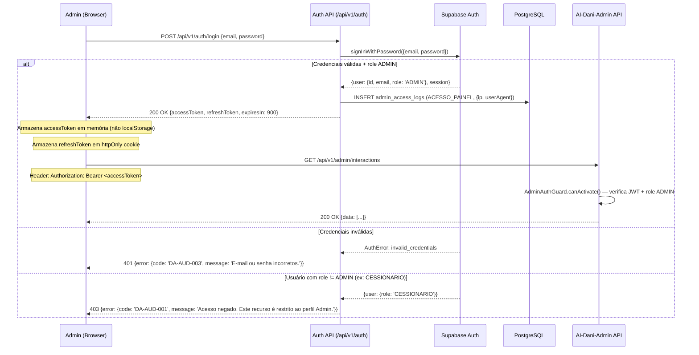
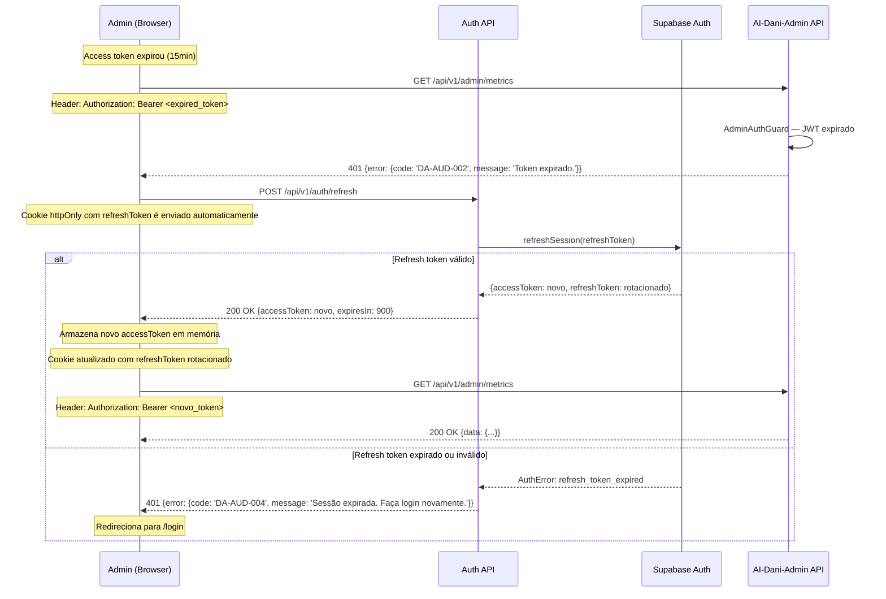
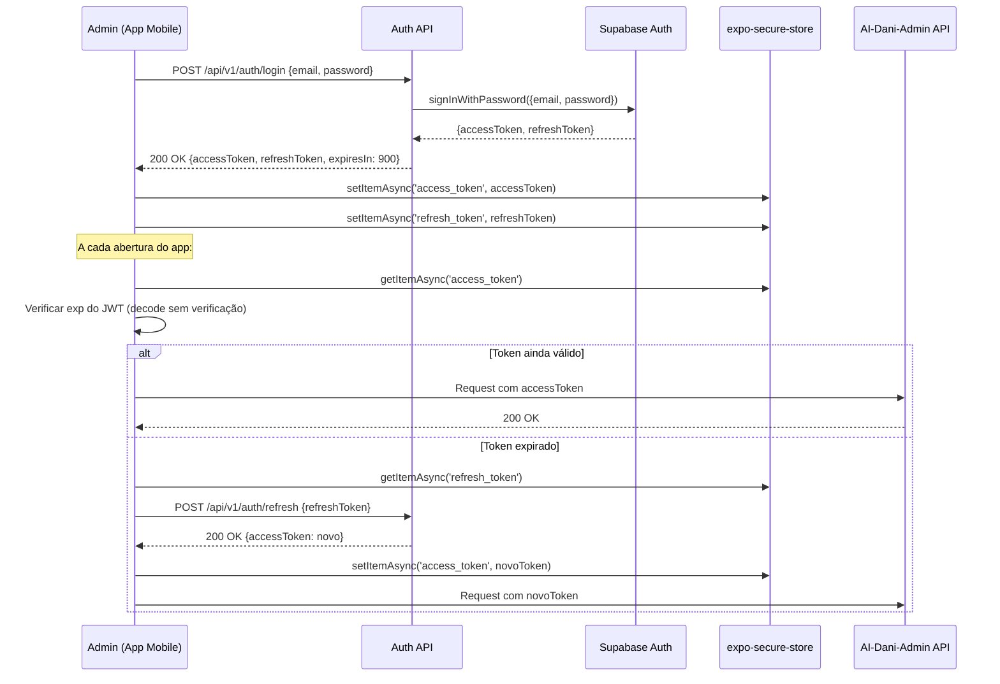

# Fluxos de Autenticação — AI-Dani-Admin

## Especificação de Autenticação e Autorização do Módulo de Supervisão

| Campo | Valor |
|---|---|
| Destinatário | Engenharia Backend e Segurança |
| Escopo | Fluxos de autenticação JWT, autorização por role, refresh token e segurança de acesso do módulo AI-Dani-Admin |
| Módulo | AI-Dani-Admin |
| Versão | v1.0 |
| Responsável | Claude Code Desktop |
| Data da versão | 2026-03-23 (America/Fortaleza) |
| Inputs | D02 (Stacks — Supabase Auth, JWT), D05 (PRD — RF-026, RNF-006, RNF-007), D14 (Especificações Técnicas) |

---

> **📌 TL;DR**
>
> - **Autenticação:** JWT stateless via Supabase Auth. Access token (15min) + refresh token (7 dias). Herdado da plataforma Repasse Seguro — AI-Dani-Admin não implementa auth próprio.
> - **Autorização:** Role `ADMIN` obrigatória em 100% dos endpoints `/api/v1/admin/*`. Verificação em `AdminAuthGuard` via decorator `@UseGuards(AdminAuthGuard)` no controller.
> - **Isolamento total:** Cessionário e Cedente recebem 403 em qualquer endpoint do módulo. Sem exceção.
> - **Sem OAuth externo:** o módulo não implementa OAuth com provedores externos (Google, GitHub etc.) — autenticação é exclusivamente via e-mail + senha ou SSO da plataforma Repasse Seguro (implementado no módulo Auth central).
> - **Mobile Admin:** JWT armazenado em `expo-secure-store`. Verificação de validade a cada abertura do app e a cada request.

---

## 1. Contexto de Autenticação

O AI-Dani-Admin **herda o sistema de autenticação central** da plataforma Repasse Seguro. Não há login exclusivo para o módulo Admin — o Admin usa o mesmo fluxo de login da plataforma, e o JWT emitido carrega a role `ADMIN`.

```
Plataforma Repasse Seguro
│
├── Módulo Auth Central (Supabase Auth)  ← gerencia login, sessão, JWT, refresh
│   ├── Login Admin: POST /api/v1/auth/login
│   ├── Refresh: POST /api/v1/auth/refresh
│   └── Logout: POST /api/v1/auth/logout
│
└── AI-Dani-Admin                        ← consome JWT, verifica role
    ├── AdminAuthGuard → verifica JWT + role ADMIN
    └── Todos os endpoints /api/v1/admin/*
```

O AI-Dani-Admin **não emite tokens**. Apenas os valida.

---

## 2. Estrutura do JWT

### 2.1 Payload do Access Token

```json
{
  "sub": "admin-uuid-v4",
  "email": "admin@repasseseguro.com.br",
  "role": "ADMIN",
  "iat": 1711234500,
  "exp": 1711235400,
  "iss": "repasse-seguro",
  "aud": "repasse-seguro-api"
}
```

### 2.2 Payload do Refresh Token

```json
{
  "sub": "admin-uuid-v4",
  "type": "refresh",
  "iat": 1711234500,
  "exp": 1711839300,
  "jti": "unique-token-id-v4"
}
```

### 2.3 Durações

| Token | Duração | Justificativa |
|---|---|---|
| Access token | 15 minutos | Curto para minimizar janela de exploração em caso de vazamento |
| Refresh token | 7 dias | Balanceia segurança vs. UX do Admin (não obriga re-login diário) |
| Sessão web (cookie) | 24h (inatividade) | Sessão de trabalho razoável para equipe operacional |
| Sessão mobile | 7 dias | Alinhado com o refresh token |

---

## 3. Fluxo 1 — Autenticação do Admin (Web)



---

## 4. Fluxo 2 — Refresh de Token



**Rotação de refresh token:** a cada refresh bem-sucedido, o refresh token anterior é invalidado e um novo é emitido (Supabase Auth com `autoRefreshToken: true`).

---

## 5. Fluxo 3 — Autenticação Mobile Admin



**Segurança mobile:**
- `expo-secure-store`: usa Keychain (iOS) e Keystore (Android). Tokens não acessíveis por outros apps.
- `AsyncStorage` proibido para tokens JWT (não criptografado, acessível por outros apps em dispositivos com root).
- Screenshot protection: considerar `expo-screen-capture` para telas com dados operacionais sensíveis (D11 seção 8).

---

## 6. AdminAuthGuard — Implementação

```typescript
// src/common/guards/admin-auth.guard.ts

import { Injectable, CanActivate, ExecutionContext, UnauthorizedException, ForbiddenException } from '@nestjs/common'
import { JwtService } from '@nestjs/jwt'
import { Reflector } from '@nestjs/core'
import { IS_PUBLIC_KEY } from '../decorators/public.decorator'

@Injectable()
export class AdminAuthGuard implements CanActivate {
  constructor(
    private jwtService: JwtService,
    private reflector: Reflector,
  ) {}

  async canActivate(context: ExecutionContext): Promise<boolean> {
    // Endpoints marcados com @Public() ignoram o guard
    const isPublic = this.reflector.getAllAndOverride<boolean>(IS_PUBLIC_KEY, [
      context.getHandler(),
      context.getClass(),
    ])
    if (isPublic) return true

    const request = context.switchToHttp().getRequest()
    const token = this.extractTokenFromHeader(request)

    if (!token) {
      throw new UnauthorizedException({
        error: { code: 'DA-AUD-002', message: 'Token de autenticação não fornecido.' }
      })
    }

    try {
      const payload = await this.jwtService.verifyAsync(token, {
        secret: process.env.JWT_SECRET,
      })

      // Verificação de role obrigatória
      if (payload.role !== 'ADMIN') {
        throw new ForbiddenException({
          error: { code: 'DA-AUD-001', message: 'Acesso negado. Este recurso é restrito ao perfil Admin.' }
        })
      }

      // Injetar payload no request para uso nos controllers
      request['adminUser'] = {
        adminId: payload.sub,
        email: payload.email,
        role: payload.role,
      }

      return true
    } catch (error) {
      if (error instanceof ForbiddenException) throw error

      throw new UnauthorizedException({
        error: { code: 'DA-AUD-002', message: 'Token expirado ou inválido. Faça login novamente.' }
      })
    }
  }

  private extractTokenFromHeader(request: any): string | undefined {
    const [type, token] = request.headers.authorization?.split(' ') ?? []
    return type === 'Bearer' ? token : undefined
  }
}
```

### 6.1 Decorator `@AdminId()`

```typescript
// src/common/decorators/admin-id.decorator.ts

import { createParamDecorator, ExecutionContext } from '@nestjs/common'

export const AdminId = createParamDecorator(
  (data: unknown, ctx: ExecutionContext): string => {
    const request = ctx.switchToHttp().getRequest()
    return request.adminUser.adminId
  },
)

// Uso no controller:
@Post('takeover')
async startTakeover(
  @AdminId() adminId: string,
  @Body() dto: StartTakeoverDto,
) {
  return this.takeoverService.startTakeover(adminId, dto)
}
```

### 6.2 Aplicação Global do Guard

```typescript
// app.module.ts
import { APP_GUARD } from '@nestjs/core'

@Module({
  providers: [
    {
      provide: APP_GUARD,
      useClass: AdminAuthGuard,
    },
  ],
})
export class AppModule {}
```

**Consequência:** TodoS os endpoints são protegidos por padrão. Endpoints sem autenticação devem usar `@Public()` explicitamente.

---

## 7. Fluxo 4 — Logout

```mermaid
sequenceDiagram
    participant Admin as Admin
    participant AuthAPI as Auth API
    participant Supabase as Supabase Auth
    participant DB as PostgreSQL

    Admin->>AuthAPI: POST /api/v1/auth/logout
    Note over Admin: Cookie httpOnly com refreshToken enviado automaticamente
    AuthAPI->>Supabase: signOut() — invalida sessão no Supabase
    AuthAPI->>DB: INSERT admin_access_logs (ACESSO_PAINEL, {action: 'logout'})
    AuthAPI-->>Admin: 200 OK + Set-Cookie: refreshToken=; expires=Thu, 01 Jan 1970
    Note over Admin: Access token em memória descartado pelo frontend
    Note over Admin: Cookie do refreshToken removido pelo servidor
```

---

## 8. Cenários de Segurança e Mitigações

| Cenário | Risco | Mitigação |
|---|---|---|
| Access token interceptado | Uso por atacante por até 15min | Access token em memória (não localStorage), HTTPS obrigatório, TTL curto |
| Refresh token comprometido | Sessão longa comprometida | httpOnly cookie (XSS não consegue ler), rotação a cada refresh, revogação no Supabase |
| Força bruta em login | Descoberta de senha Admin | Rate limiting no endpoint de login (Supabase Auth nativo: 5 tentativas/h) |
| Cessionário tenta acessar API Admin | Escalonamento de privilégio | AdminAuthGuard verifica role em TODOS os endpoints. 403 imediato. Sem exceção. |
| Token expirado usado em request | Request não autorizado | JwtService.verifyAsync() lança UnauthorizedException. Frontend deve tratar 401 e fazer refresh. |
| Admin mobile com dispositivo perdido | Acesso indevido | Token em expo-secure-store (Keychain/Keystore). Admin pode revogar sessão remotamente via Supabase Dashboard. |
| Replay attack com token válido | Request duplicado | JWT com `jti` (JWT ID) único — validado pelo Supabase. Idempotência por design nos endpoints críticos (takeover). |

---

## 9. Configuração NestJS

```typescript
// app.module.ts — configuração do JwtModule

JwtModule.registerAsync({
  useFactory: () => ({
    secret: process.env.JWT_SECRET,
    signOptions: {
      expiresIn: process.env.JWT_EXPIRES_IN || '15m',
      issuer: 'repasse-seguro',
      audience: 'repasse-seguro-api',
    },
    verifyOptions: {
      issuer: 'repasse-seguro',
      audience: 'repasse-seguro-api',
    },
  }),
})
```

---

## 10. Changelog

| Data | Versão | Descrição |
|---|---|---|
| 2026-03-23 | v1.0 | Versão inicial. 4 fluxos de autenticação (login web, refresh, mobile, logout), AdminAuthGuard completo, cenários de segurança e mitigações. |
