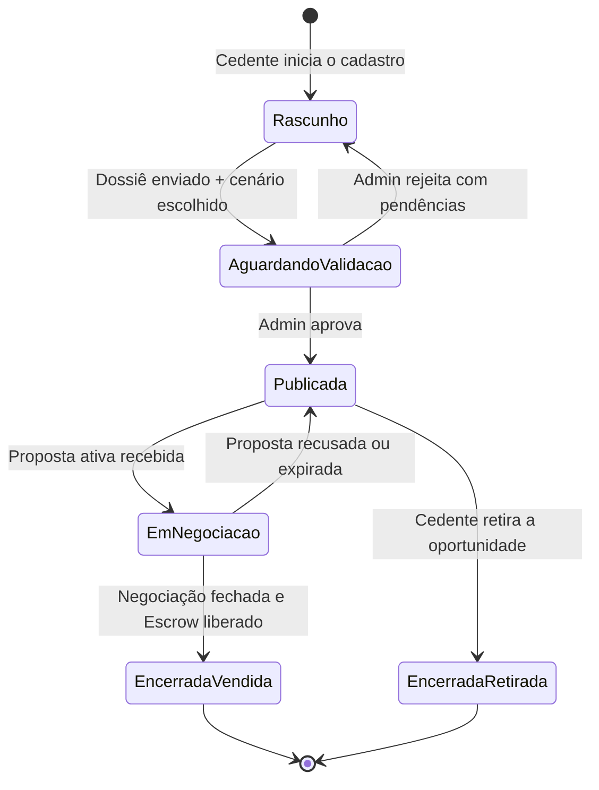

# 05.2 - PRD — AI-Dani-Cedente
## Parte 2 de 5: Módulos Core — Isolamento de Dados, Primeiro Uso e Oportunidade

| Campo | Valor |
|---|---|
| Destinatário | Time de Produto, Engenharia e Design |
| Escopo | PRD completo do agente AI-Dani-Cedente — Parte 2: Isolamento de Dados, Primeiro Uso, Oportunidade |
| Módulo | AI-Dani-Cedente |
| Versão | v1.0 |
| Responsável | Claude Code Desktop |
| Data da versão | 23/03/2026 (America/Fortaleza) |
| Partes | 05.1 · 05.2 (esta) · 05.3 · 05.4 · 05.5 |
| Dependências | D01 — Regras de Negócio AI-Dani-Cedente |

---

> **📌 TL;DR**
>
> - **RF-DCE-001 a RF-DCE-004:** isolamento total de dados — controle de escopo, mensagens de bloqueio, matriz de permissões.
> - **RF-DCE-005 a RF-DCE-009:** primeiro uso — boas-vindas por estado (KYC, oportunidade), pontos de entrada, sugestões de conversa.
> - **RF-DCE-010 a RF-DCE-012:** módulo de oportunidade — cadastro, escolha de cenário (A/B/C/D), retirada do marketplace.
> - Cada RF rastreia para sua RN correspondente no D01.
> - Campos sem dados do D01 estão marcados [DADO PENDENTE].

---

## RF-DCE-001: Controle de Escopo de Dados — Isolamento Total

**Origem:** RN-DCE-001 (D01 seção 3)

**Descrição:** O sistema verifica o escopo autorizado para o Cedente autenticado antes de processar qualquer consulta à Dani.

**Fluxo principal:**
1. Cedente envia consulta à Dani.
2. Sistema verifica se os dados solicitados estão no escopo do perfil Cedente autenticado (validação via `cedente_id` do JWT).
3. **Se dentro do escopo:** Dani responde usando exclusivamente dados do próprio Cedente.
4. **Se fora do escopo:** Dani recusa conforme RF-DCE-002.

**Dados acessíveis ao Cedente:**

| Dado | Acesso |
|---|---|
| Próprio contrato imobiliário | ✅ Completo |
| Cenários A/B/C/D do próprio repasse | ✅ Completo |
| Tabela Atual e Tabela Contrato da própria oportunidade | ✅ Completo |
| Valor Pago pelo Cedente (próprio) | ✅ Completo |
| Propostas recebidas (valores e status) | ✅ Sem identidade do Cessionário |
| Histórico de negociações do próprio Cedente | ✅ Completo |
| Status do dossiê | ✅ Completo |
| Dados pessoais do Cessionário | ❌ Bloqueado |
| Propostas feitas por outros Cedentes | ❌ Bloqueado |
| Logs e decisões internas do Admin | ❌ Bloqueado |
| Dados de valorização de outros contratos | ❌ Bloqueado |

**Critérios de aceite:**
- Middleware de autorização valida `cedente_id` do JWT antes de qualquer chamada ao LLM.
- Nenhuma query ao banco retorna dados de outros Cedentes.
- PII do Cessionário nunca entra no contexto do LLM.
- Testes automatizados verificam isolamento: Cedente A não acessa dados do Cedente B.

---

## RF-DCE-002: Mensagens Padrão para Dados Bloqueados

**Origem:** RN-DCE-002 (D01 seção 3)

**Descrição:** Quando o Cedente solicita dado fora do escopo, a Dani exibe mensagem padronizada e redireciona.

**Mapeamento de mensagens:**

| Dado solicitado | Mensagem da Dani |
|---|---|
| Dados pessoais do Cessionário (nome, CPF, contato) | "Os dados do comprador são confidenciais para proteger a privacidade de ambas as partes. Para questões sobre a negociação, utilize o chat de negociação da plataforma." |
| Propostas ou histórico de outros Cedentes | "Só tenho acesso às suas oportunidades e negociações. Quer que eu verifique o andamento da sua?" |
| Estratégia de negociação do Cessionário | "Não tenho acesso às estratégias de negociação do comprador. Posso ajudá-lo a avaliar se a proposta recebida é compatível com o seu cenário." |
| Conselho jurídico ou fiscal | "Para questões jurídicas ou fiscais, recomendo consultar um profissional especializado. Posso explicar o funcionamento da plataforma se ajudar." |
| Garantia de resultado financeiro | "O valor de venda depende das negociações. Posso mostrar seus cenários disponíveis e a faixa de retorno esperada para cada um." |

**Critérios de aceite:**
- Cada tipo de dado bloqueado dispara a mensagem exata acima.
- Todas as mensagens de bloqueio encerram com um próximo passo alternativo para o Cedente.

---

## RF-DCE-003: Isolamento no Contexto do LLM

**Origem:** RN-DCE-001, RN-DCE-002 (D01 seção 3)

**Descrição:** Garante que o contexto enviado ao LLM nunca contém dados fora do escopo do Cedente.

**Requisitos técnicos:**
- System prompt inclui instrução explícita: "Você tem acesso apenas aos dados do Cedente autenticado. Nunca revele nome, CPF, e-mail ou qualquer dado pessoal do Cessionário."
- Dados do Cessionário são mascarados antes de qualquer inserção no contexto: `cessionario_nome → "[Comprador]"`, `cessionario_cpf → "[REDACTED]"`.
- Inputs do Cedente são sanitizados antes de inserção no prompt (proteção contra prompt injection).

---

## RF-DCE-004: Matriz de Permissões

**Origem:** D01 seção 14

**Descrição:** Controle de permissões por operação e perfil.

| Operação | Cedente | Admin | Cessionário |
|---|---|---|---|
| Cadastrar oportunidade | ✅ Própria | ✅ Qualquer | ❌ |
| Escolher cenário (A/B/C/D) | ✅ Próprio | ✅ Todos | ❌ Bloqueado |
| Ver cenário escolhido | ✅ Próprio | ✅ Todos | ❌ Bloqueado |
| Publicar/retirar oportunidade | ✅ Própria (com confirmação) | ✅ Qualquer | ❌ |
| Ver propostas recebidas | ✅ Próprias (sem identidade do Cessionário) | ✅ Todas | ❌ |
| Aceitar/recusar proposta | ✅ Ação direta na plataforma | ✅ Qualquer | ❌ |
| Enviar contraproposta | ✅ Própria negociação | ✅ Qualquer | ❌ |
| Acompanhar status do Escrow | ✅ Próprias negociações | ✅ Todas | ✅ Próprias |
| Acompanhar dossiê | ✅ Próprio | ✅ Qualquer | ❌ |
| Assinar contrato via ZapSign | ✅ Próprios contratos | ✅ Supervisão | ✅ Próprios |
| Ver dados pessoais do Cessionário | ❌ Bloqueado | ✅ Permitido | ❌ Próprios apenas |
| Receber notificações proativas | ✅ Próprias oportunidades | ✅ Via painel | ❌ |

---

## RF-DCE-005: Mensagem de Boas-Vindas no Primeiro Acesso

**Origem:** RN-DCE-005 (D01 seção 4)

**Descrição:** Experiência de primeiro acesso ao chat da Dani, personalizada pelo estado do KYC e das oportunidades do Cedente.

**Fluxo:**
1. Cedente abre o chat pela primeira vez (sem histórico de conversas).
2. Sistema verifica: status de KYC do Cedente + se há oportunidade cadastrada.

**Cenários:**

| Cenário | Mensagem exibida |
|---|---|
| KYC aprovado + oportunidade ativa | "Olá! Sou a Dani, sua Guardiã do Retorno. Estou aqui para ajudá-lo a acompanhar sua oportunidade, entender as propostas recebidas e garantir que o processo de repasse seja tranquilo. Como posso ajudar?" + sugestões (RF-DCE-008) |
| KYC pendente | Boas-vindas + "Para ativar sua oportunidade no marketplace, você precisa concluir sua verificação de identidade. [Acessar Meu Perfil > Verificação de Identidade →]" |
| Sem oportunidade cadastrada | "Você ainda não tem uma oportunidade publicada. Posso te guiar no cadastro da sua oportunidade agora. Quer começar?" |

**Critérios de aceite:**
- O sistema lê corretamente o estado do KYC e das oportunidades do Cedente antes de renderizar a mensagem.
- Link para verificação de identidade é clicável e direciona para a tela correta.
- Sugestões de conversa aparecem apenas quando KYC está aprovado e há oportunidade ativa.

---

## RF-DCE-006: Pontos de Entrada do Chat

**Origem:** RN-DCE-006 (D01 seção 4)

**Descrição:** Três pontos de entrada distintos para o chat da Dani, cada um com contexto pré-carregado diferente.

| Ponto de Entrada | Localização | Contexto pré-carregado |
|---|---|---|
| **PE-1 — Painel do Cedente** | Ícone da Dani na barra lateral do painel | Visão geral de todas as oportunidades ativas do Cedente |
| **PE-2 — Tela de Oportunidade** | Botão "Consultar Dani" na página da oportunidade | Dados da oportunidade específica (OPR, Δ, cenário, status) |
| **PE-3 — Tela de Negociação** | Chat abre a partir de uma proposta recebida | Dados da proposta (valor, status) + cenário correspondente |

**Critérios de aceite:**
- PE-1: Dani abre com visão geral, sem oportunidade específica pré-selecionada.
- PE-2: Dani recebe automaticamente como contexto o `opportunity_id` da tela.
- PE-3: Dani recebe como contexto o `proposal_id` e o `opportunity_id` associado.
- Contexto pré-carregado não é exibido ao Cedente na tela do chat — é apenas parte do system message.

---

## RF-DCE-007: Histórico de Conversas

**Origem:** RN-DCE-022 (D01 seção 13)

**Descrição:** O histórico de conversas do Cedente com a Dani é mantido e acessível.

**Regras:**
- Histórico mantido por 90 dias (parâmetro configurável pelo Admin).
- Rate limit: 30 mensagens por hora por Cedente (janela deslizante via Redis).
- Quando o rate limit é atingido: campo de entrada desabilitado com contador regressivo até liberar a quota.
- Histórico não contém PII do Cessionário — dados mascarados antes do armazenamento.

---

## RF-DCE-008: Sugestões de Conversa (Conversation Starters)

**Origem:** RN-DCE-008 (D01 seção 4)

**Descrição:** Quando o chat abre sem contexto específico, a Dani exibe 4 sugestões de conversa.

**Sugestões padrão:**
1. "Qual o retorno esperado para a minha oportunidade?"
2. "Tenho uma proposta recebida. Vale a pena aceitar?"
3. "O que ainda falta no meu dossiê?"
4. "Quanto tempo demora para concluir o repasse?"

**Critérios de aceite:**
- Sugestões aparecem somente quando chat abre sem contexto específico de oportunidade ou proposta.
- Ao clicar em uma sugestão, o texto é inserido no campo de mensagem e enviado automaticamente.
- Sugestões desaparecem após o Cedente enviar a primeira mensagem.

---

## RF-DCE-009: SLA de Resposta

**Origem:** D01 seção 13

**Descrição:** Tempo máximo de resposta da Dani por tipo de interação.

| Tipo de interação | Tempo máximo |
|---|---|
| Consulta de status da oportunidade | ≤ 5 segundos |
| Análise de proposta recebida | ≤ 5 segundos |
| Simulação de retorno líquido | ≤ 5 segundos |
| Resposta a dúvida operacional | ≤ 5 segundos |

**Comportamento em latência acima do SLA (RN-DCE-022):**
- Exibe indicador visual de "digitando" (animação de três pontos pulsando).
- Se após 2× o SLA a resposta não foi entregue: exibe "A Dani está demorando mais que o esperado. Você pode aguardar ou tentar novamente em instantes." Botões: "Aguardar" / "Tentar novamente".
- Se latência alta persiste por 5 minutos consecutivos: alerta automático ao Admin.

---

## RF-DCE-010: Cadastro da Oportunidade pelo Cedente

**Origem:** RN-DCE-010 (D01 seção 5)

**Descrição:** A Dani orienta o Cedente no cadastro de sua oportunidade de repasse.

**Dados obrigatórios que a Dani coleta:**
1. **Empreendimento:** nome, incorporadora, endereço, tipologia (ex: apartamento 2 quartos), área.
2. **Dados financeiros:** Tabela Contrato (preço na data da compra), Valor Pago pelo Cedente até a data, parcelas restantes.
3. **Tabela Atual:** preço vigente do imóvel na tabela da incorporadora.

**Fluxo:**
1. Cedente solicita ajuda para cadastrar oportunidade.
2. Dani coleta os dados acima em diálogo guiado.
3. **Se todos os dados presentes:** Dani calcula o Δ (= Tabela Atual − Tabela Contrato) e exibe resumo antes de prosseguir para escolha de cenário.
4. **Se dados ausentes ou inválidos:** Dani informa qual campo precisa de correção e aguarda. Não avança com dados incompletos.
5. **Efeito:** oportunidade criada em estado "Rascunho".

**Fórmula do Δ:**
- Δ = Tabela Atual − Tabela Contrato
- Se Δ > 0: comissão = 20% × Δ (cobrada do Cessionário)
- Se Δ ≤ 0: comissão = 20% × Valor Pago pelo Cedente (fallback)

**Critérios de aceite:**
- Dani não cria a oportunidade diretamente — orienta o Cedente, que confirma na plataforma.
- Cálculo do Δ é exibido com explicação em linguagem acessível.
- Estado inicial da oportunidade é sempre "Rascunho".

---

## RF-DCE-011: Escolha de Cenário pelo Cedente (A/B/C/D)

**Origem:** RN-DCE-011 (D01 seção 5)

**Descrição:** Com a oportunidade em Rascunho, a Dani apresenta os cenários calculados pela plataforma.

**Dados de cada cenário apresentado:**
- Valor de repasse sugerido.
- Retorno líquido estimado para o Cedente (após deduções).
- Condições de pagamento.

**Regras:**
- Cenários são **confidenciais**: nunca revelados ao Cessionário ou à Dani-Cessionário.
- Dani orienta qual cenário favorece os objetivos do Cedente (maior retorno, menor prazo, menor saldo devedor).
- Se o Cedente escolhe um cenário: Dani confirma e orienta para a etapa de dossiê.
- Se o Cedente solicita alterar cenário após publicação: Dani informa que requer contato com o suporte Admin.

**Critérios de aceite:**
- Dani exibe cenários apenas para o Cedente autenticado daquela oportunidade.
- Nenhum dado de cenário aparece em logs ou contexto acessível ao Cessionário.
- Alteração de cenário pós-publicação bloqueia o fluxo e redireciona ao Admin.

---

## RF-DCE-012: Estados da Oportunidade

**Origem:** RN-DCE-010 (D01 seção 5)

**Descrição:** Ciclo de vida da oportunidade do Cedente.

| Estado | Descrição |
|---|---|
| **Rascunho** | Cadastrada, não publicada — documentação pendente ou cenário não escolhido |
| **Aguardando validação** | Dossiê enviado para análise pelo Admin |
| **Publicada** | Visível no marketplace para Cessionários |
| **Em negociação** | Com proposta ativa de um Cessionário |
| **Encerrada — Vendida** | Negociação concluída com sucesso |
| **Encerrada — Retirada** | Cedente retirou a oportunidade do marketplace |

---

## RF-DCE-013: Retirada da Oportunidade do Marketplace

**Origem:** RN-DCE-012 (D01 seção 5)

**Descrição:** Fluxo de retirada da oportunidade pelo Cedente via orientação da Dani.

**Fluxo por estado:**

| Estado da oportunidade | Comportamento da Dani |
|---|---|
| **Publicada (sem proposta ativa)** | Exibe modal de confirmação: "Ao retirar sua oportunidade, ela não estará mais visível para compradores. Você pode republicá-la depois. Deseja continuar?" [Cancelar] [Retirar oportunidade] |
| **Em negociação (com proposta ativa)** | "Sua oportunidade tem uma proposta ativa no momento. Para retirá-la, você precisa primeiro recusar a proposta em andamento. Quer que eu te ajude com isso?" |

**Efeito:** estado passa de Publicada para EncerradaRetirada.

**Critérios de aceite:**
- Dani não retira a oportunidade diretamente — orienta o Cedente que confirma na plataforma.
- Modal de confirmação exibido antes da ação destrutiva.
- Oportunidade Em negociação não pode ser retirada sem recusar proposta ativa primeiro.

---

## 7. Changelog

| Data | Versão | Descrição |
|---|---|---|
| 23/03/2026 | v1.0 | Versão inicial — Parte 2 do PRD. Isolamento de dados (RF-DCE-001 a RF-DCE-004), primeiro uso (RF-DCE-005 a RF-DCE-009), oportunidade (RF-DCE-010 a RF-DCE-013). |
