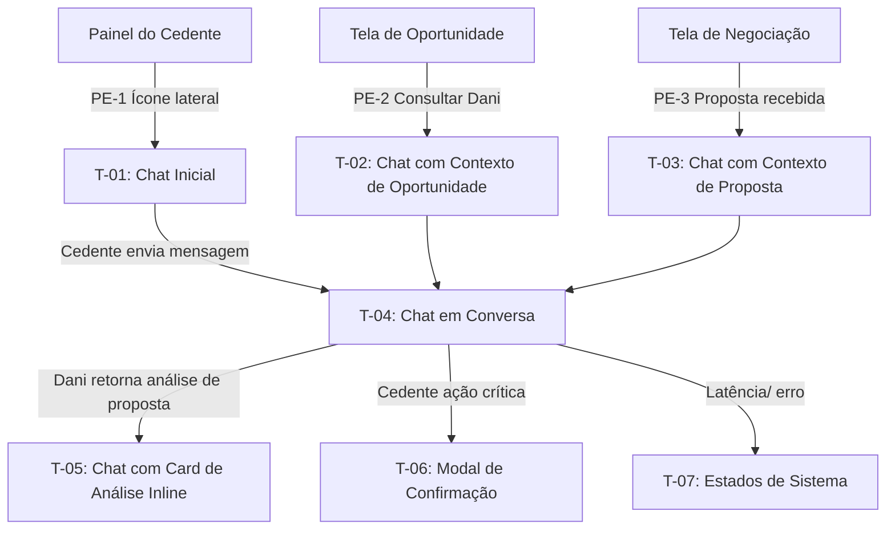
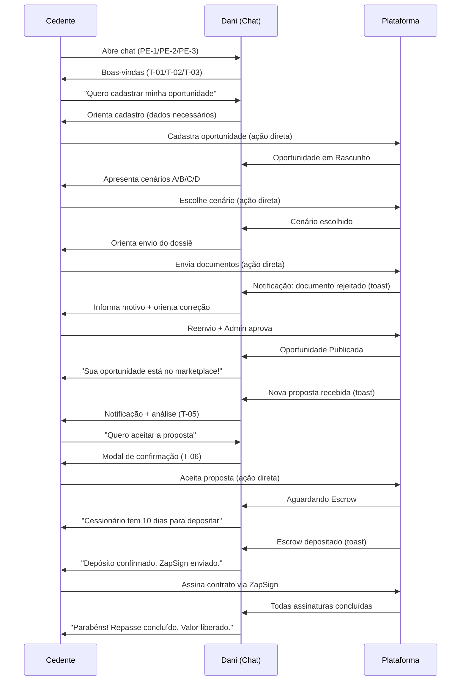

# 06 - Mapa de Telas — AI-Dani-Cedente

## Mapa de Telas do Chat da Dani (Perspectiva do Cedente)

| Campo | Valor |
|---|---|
| Destinatário | Time de Design e Frontend |
| Escopo | Mapa completo de telas, estados e fluxos do agente AI-Dani-Cedente |
| Módulo | AI-Dani-Cedente |
| Versão | v1.0 |
| Responsável | Claude Code Desktop |
| Data da versão | 23/03/2026 (America/Fortaleza) |
| Dependências | D01 (Regras de Negócio), D03 (Brand Guide), D05.1–D05.5 (PRD) |

---

> **📌 TL;DR**
>
> - **7 telas principais** do chat da Dani-Cedente, cada uma com estados e transições documentados.
> - **3 pontos de entrada** distintos com contexto pré-carregado diferente (RF-DCE-006).
> - **Componentes transversais:** header do chat, bolhas de mensagem, sugestões, indicador de digitando, notificações proativas.
> - **Telas de estado especial:** indisponibilidade, rate limit, takeover do Admin.
> - Todas as telas derivam dos RFs do PRD (D05.x) e das RNs do D01.

---

## 1. Arquitetura de Telas



---

## 2. Telas

### T-01: Chat Inicial (Primeiro Acesso)

**Origem:** RF-DCE-005 (D05.2), RN-DCE-005 (D01 seção 4)

**Descrição:** Tela do chat quando o Cedente o abre pela primeira vez, sem histórico de conversas.

**Componentes presentes:**
- Header do chat: avatar da Dani, nome "Dani", badge "Guardiã do Retorno", indicador de status (disponível)
- Área de mensagens: vazia, fundo `--background`
- Mensagem de boas-vindas da Dani (conforme estado do Cedente — ver RF-DCE-005)
- Sugestões de conversa (4 chips) — apenas se KYC aprovado + oportunidade ativa (RF-DCE-008)
- Campo de mensagem: "Digite sua mensagem..."
- Botão de envio

**Estados da mensagem de boas-vindas:**

| Estado do Cedente | Mensagem de boas-vindas |
|---|---|
| KYC aprovado + oportunidade ativa | "Olá! Sou a Dani, sua Guardiã do Retorno..." + 4 sugestões |
| KYC pendente | "Olá! Sou a Dani..." + CTA para verificação de identidade |
| Sem oportunidade cadastrada | "Você ainda não tem uma oportunidade publicada. Quer começar?" |

**Transições:**
- Cedente clica em sugestão → envia mensagem → vai para T-04
- Cedente digita mensagem e envia → vai para T-04
- Cedente clica no link de KYC → sai do chat para tela de verificação

---

### T-02: Chat com Contexto de Oportunidade (PE-2)

**Origem:** RF-DCE-006 (D05.2), RN-DCE-006 (D01 seção 4), ponto de entrada PE-2

**Descrição:** Chat abre a partir da Tela de Oportunidade. Contexto pré-carregado com dados da oportunidade específica.

**Componentes adicionais vs T-01:**
- Banner de contexto: "Você está consultando sobre a oportunidade [OPR-XXXX-XXXX]" (removido após primeira interação)
- Mensagem inicial da Dani pode já incluir resumo da oportunidade (OPR, Δ atual, estado)

**Contexto injetado no system message (não visível ao Cedente):**
```
opportunity_id: [UUID da oportunidade]
opportunity_code: OPR-XXXX-XXXX
opportunity_state: [estado atual]
delta: R$ [valor]
scenario_chosen: [A/B/C/D]
```

**Transições:**
- Cedente envia mensagem → vai para T-04 com contexto da oportunidade mantido

---

### T-03: Chat com Contexto de Proposta (PE-3)

**Origem:** RF-DCE-006 (D05.2), RN-DCE-006 (D01 seção 4), ponto de entrada PE-3

**Descrição:** Chat abre a partir da Tela de Negociação, com contexto de uma proposta específica.

**Componentes adicionais vs T-01:**
- Banner de contexto: "Você está consultando sobre a proposta de R$ [valor]" (removido após primeira interação)
- Mensagem inicial pode incluir análise preliminar da proposta

**Contexto injetado no system message (não visível ao Cedente):**
```
proposal_id: [UUID da proposta]
proposal_value: R$ [valor]
proposal_state: [estado]
opportunity_id: [UUID associado]
estimated_net_return: R$ [calculado]
```

**Transições:**
- Cedente envia mensagem → vai para T-04 com contexto da proposta mantido

---

### T-04: Chat em Conversa

**Origem:** RF-DCE-004 a RF-DCE-033 (todos os RFs do chat ativo)

**Descrição:** Estado principal do chat durante uma conversa ativa entre o Cedente e a Dani.

**Layout:**

```
┌────────────────────────────────────────┐
│  [Avatar] Dani • Guardiã do Retorno    │  Header fixo
│  ● Disponível                          │
├────────────────────────────────────────┤
│                                        │  Área de mensagens
│  [Bolha Dani] Mensagem da Dani         │  com scroll
│               timestamp                │
│                                        │
│                [Bolha Cedente] Msg     │
│                         timestamp      │
│                                        │
│  [Bolha Dani] Resposta da Dani         │
│                                        │
├────────────────────────────────────────┤
│  [Campo de mensagem...]      [Enviar]  │  Footer fixo
└────────────────────────────────────────┘
```

**Estados das bolhas:**
- Bolha da Dani: `--primary` (#0069A8), canto inferior esquerdo arredondado diferente
- Bolha do Cedente: `--secondary` (#F4F4F5), canto inferior direito arredondado diferente
- Bolha "enviando" (Cedente): `opacity: 0.6` enquanto aguarda confirmação
- Indicador de digitando (Dani): 3 pontos bounce quando Dani está processando

**Dados visíveis ao Cedente:**
- Mensagens de texto
- Cards de análise inline (quando Dani retorna análise — ver T-05)
- Timestamps de cada mensagem
- Status "Disponível" / "Processando" no header

**Dados nunca visíveis:**
- Identidade do Cessionário
- Cenários de outros Cedentes
- Logs do Admin

**Transições:**
- Dani retorna análise de proposta/dossiê/simulação → vai para T-05
- Cedente solicita ação crítica (aceitar proposta, retirar oportunidade) → vai para T-06
- Erro / latência extrema → vai para T-07
- Rate limit atingido → substate de T-04 (campo desabilitado)

---

### T-05: Chat com Card de Análise Inline

**Origem:** RF-DCE-017 (análise proposta), RF-DCE-018 (simulação retorno), RF-DCE-015 (status dossiê), RF-DCE-023 (Escrow)

**Descrição:** T-04 com card de análise embutido em uma bolha da Dani.

**Tipos de card de análise:**

#### Card: Análise de Proposta (RF-DCE-017)
```
┌──────────────────────────────────────┐
│ Análise da Proposta                  │
│ Valor proposto: R$ 320.000           │
│ Variação vs tabela: −5% abaixo       │
│ ─────────────────────────────────── │
│ Retorno líquido estimado:            │
│ R$ 85.000                            │
│ (baseado no Cenário B)               │
│ ─────────────────────────────────── │
│ Prazo para resposta: 3 dias úteis    │
│ [Aceitar]  [Recusar]  [Contraproposta] │
└──────────────────────────────────────┘
```

#### Card: Simulação de Retorno Líquido (RF-DCE-018)
```
┌──────────────────────────────────────┐
│ Simulação de Retorno                 │
│ Valor simulado: R$ 350.000           │
│ Saldo devedor: R$ 180.000            │
│ ─────────────────────────────────── │
│ Retorno líquido estimado:            │
│ R$ 170.000                           │
│ ─────────────────────────────────── │
│ ⚠️ Estimativa. Deduções adicionais   │
│ podem variar.                        │
└──────────────────────────────────────┘
```

#### Card: Status do Dossiê (RF-DCE-015)
```
┌──────────────────────────────────────┐
│ Seu Dossiê — 83% completo            │
│ ✅ Contrato original                 │
│ ✅ Matrícula do imóvel               │
│ ✅ Certidão negativa de ônus reais   │
│ ✅ Comprovante de pagamentos         │
│ ❌ Certidão negativa de débitos      │
│    Motivo: doc rejeitado. [Saiba +]  │
│ 📎 Procuração (se aplicável)         │
└──────────────────────────────────────┘
```

#### Card: Status do Escrow (RF-DCE-023)
```
┌──────────────────────────────────────┐
│ Status do Escrow                     │
│ Estado: Aguardando depósito          │
│ Prazo: 7 dias úteis restantes        │
│ Valor: R$ 350.000                    │
│ ─────────────────────────────────── │
│ Cessionário tem até [data] para      │
│ depositar.                           │
└──────────────────────────────────────┘
```

**Transições:**
- Cedente clica em "Aceitar" no card de proposta → vai para T-06 (Modal de Confirmação de Aceite)
- Cedente clica em "Recusar" no card de proposta → vai para T-06 (Modal de Confirmação de Recusa)
- Cedente clica em "Contraproposta" → vai para T-04 (Dani inicia fluxo guiado de contraproposta)

---

### T-06: Modal de Confirmação

**Origem:** RF-DCE-020 (aceite proposta), RF-DCE-021 (recusa), RF-DCE-013 (retirada oportunidade)

**Descrição:** Modal sobreposto ao chat para confirmação de ações críticas e irreversíveis.

**Tipos de modal:**

#### Modal: Aceitar Proposta (RF-DCE-020)
```
┌──────────────────────────────────────┐
│ Confirmar aceite da proposta         │
│                                      │
│ Valor: R$ 320.000                    │
│ Retorno líquido estimado: R$ 85.000  │
│                                      │
│ Próximos passos:                     │
│ • Cessionário deposita Escrow        │
│   (prazo: 10 dias úteis)             │
│ • Assinatura do contrato via ZapSign │
│                                      │
│ [Cancelar]        [Aceitar proposta] │
└──────────────────────────────────────┘
```

#### Modal: Retirar Oportunidade (RF-DCE-013)
```
┌──────────────────────────────────────┐
│ Retirar oportunidade do marketplace  │
│                                      │
│ Ao retirar, sua oportunidade não     │
│ estará mais visível para compradores.│
│ Você pode republicá-la depois.       │
│                                      │
│ [Cancelar]     [Retirar oportunidade]│
└──────────────────────────────────────┘
```

**Componentes do modal:**
- Overlay escuro `opacity: 0.4` sobre o chat
- Container modal: `--card`, `--radius-xl`, `box-shadow`
- Botão destrutivo/confirmação: `--primary` ou `--destructive` conforme ação
- Botão cancelar: `--secondary`

**Transições:**
- Cedente confirma → ação executada na plataforma + Dani confirma em bolha
- Cedente cancela → modal fecha, volta para T-04

---

### T-07: Estados de Sistema

**Origem:** RF-DCE-029 (indisponibilidade), RF-DCE-031 (latência), RF-DCE-032 (rate limit) — D05.5

**Descrição:** Telas/estados de sistema quando o chat não está operando normalmente.

#### T-07a: Dani Digitando / Processando

| Componente | Especificação |
|---|---|
| Indicador | 3 pontos bounce na posição da próxima bolha da Dani |
| Aparece | Imediatamente após o Cedente enviar mensagem |
| Desaparece | Quando a primeira bolha da Dani aparece |

#### T-07b: Resposta Lenta (> 2× SLA)

| Componente | Especificação |
|---|---|
| Mensagem exibida | "A Dani está demorando mais que o esperado. Você pode aguardar ou tentar novamente." |
| Botões | [Aguardar] [Tentar novamente] |
| Trigger | Resposta não entregue após 10 segundos |

#### T-07c: Rate Limit Atingido

| Componente | Especificação |
|---|---|
| Campo de mensagem | Desabilitado (`opacity: 0.5`, cursor not-allowed) |
| Contador | "Disponível novamente em [MM:SS]" abaixo do campo |
| Trigger | Cedente atinge 30 mensagens na hora |

#### T-07d: Dani Indisponível (Desligamento Automático)

| Componente | Especificação |
|---|---|
| Mensagem | "A Dani está temporariamente indisponível. Para urgências, entre em contato com o suporte." |
| CTA | [Contatar suporte →] |
| Toda a interface do chat | Visualmente opaca: `opacity: 0.6`, sem campo de entrada |

---

## 3. Componentes Transversais

### 3.1 Header do Chat

Presente em todas as telas T-01 a T-07.

| Elemento | Especificação |
|---|---|
| Avatar | Círculo 40px, `--primary` (#0069A8), inicial "D" branca |
| Nome | "Dani", Inter Variable 600, `text-base` |
| Subtítulo | "Guardiã do Retorno", `text-xs`, `--muted-foreground` |
| Indicador de status | Círculo 10px: verde = disponível, amarelo = processando, vermelho = indisponível |
| Botão fechar | `×` no canto superior direito, fecha o chat |

### 3.2 Notificação Proativa (Toast)

Aparece nos 10 eventos do RF-DCE-028. Pode surgir enquanto o Cedente está em qualquer tela da plataforma, não apenas no chat.

| Elemento | Especificação |
|---|---|
| Posição | Canto superior direito (desktop) / inferior (mobile) |
| Background | `--card`, border `--border` |
| Ícone | Específico por tipo de evento (proposta = 📄, Escrow = 🏦, ZapSign = ✍️, dossiê = 📁) |
| Texto | Mensagem do evento (RF-DCE-028) |
| CTA | "Ver detalhes →" abre o chat no contexto correspondente |
| Auto-dismiss | 5 segundos para eventos informativos; alertas críticos ficam até o Cedente fechar |

---

## 4. Fluxo Completo — Ciclo de Vida do Cedente



---

## 5. Changelog

| Data | Versão | Descrição |
|---|---|---|
| 23/03/2026 | v1.0 | Versão inicial — Mapa de Telas completo do AI-Dani-Cedente: T-01 a T-07 + componentes transversais + fluxo de ciclo de vida. |
