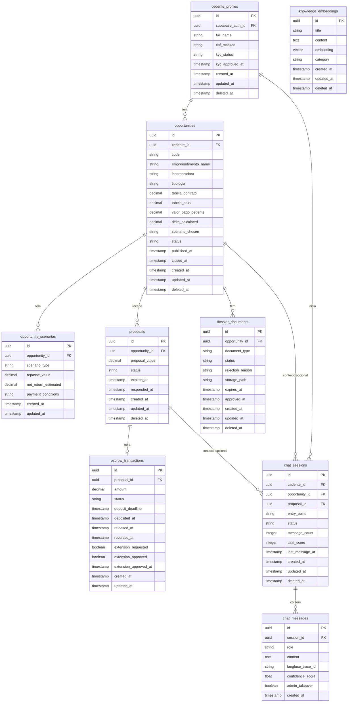

# 12 - Modelo de Dados (ERD Schema) — AI-Dani-Cedente

## Modelo de Dados do Agente AI-Dani-Cedente

| Campo | Valor |
|---|---|
| Destinatário | Tech Lead / Backend Engineers |
| Escopo | Modelo de dados completo do agente AI-Dani-Cedente — entidades, relacionamentos, atributos e convenções |
| Módulo | AI-Dani-Cedente |
| Versão | v1.0 |
| Responsável | Claude Code Desktop |
| Data da versão | 23/03/2026 (America/Fortaleza) |
| Dependências | D01 (Regras de Negócio), D02 (Stacks — Prisma, Supabase PostgreSQL 17+), D05.1–D05.5 (PRD) |

---

> **📌 TL;DR**
>
> - **7 entidades principais:** cedente_profiles, opportunities, opportunity_scenarios, proposals, dossier_documents, escrow_transactions, chat_sessions + chat_messages.
> - **Convenções:** UUID v4 como PK, soft delete, `created_at`/`updated_at` obrigatórios, `snake_case`, `@db.Timestamptz`.
> - **Isolamento de dados:** Row Level Security (RLS) no Supabase em todas as tabelas de domínio do Cedente.
> - **Sem dados do Cessionário:** o módulo Dani-Cedente não armazena PII de Cessionários — apenas `proposal_value` e `proposal_status`.
> - **RAG:** tabela `knowledge_embeddings` para base de conhecimento do agente (regras da plataforma, FAQ).
> - Conforme ShiftLabs Stacks v7.1 seção 1.5.

---

## 1. Diagrama ERD

---

## 2. Entidades — Detalhamento

### 2.1 cedente_profiles

**Descrição:** Perfil do Cedente no módulo AI-Dani-Cedente. Sincronizado com a autenticação Supabase Auth da plataforma principal.

| Coluna | Tipo | Nullable | Default | Descrição |
|---|---|---|---|---|
| `id` | UUID | NOT NULL | `gen_random_uuid()` | PK |
| `supabase_auth_id` | UUID | NOT NULL | — | FK para Supabase Auth users.id |
| `full_name` | VARCHAR(255) | NOT NULL | — | Nome completo do Cedente |
| `cpf_masked` | VARCHAR(14) | NOT NULL | — | CPF mascarado: `***.***.***-XX` — nunca CPF completo |
| `kyc_status` | ENUM | NOT NULL | `'PENDING'` | `PENDING`, `IN_REVIEW`, `APPROVED`, `REJECTED` |
| `kyc_approved_at` | TIMESTAMPTZ | NULL | — | Quando o KYC foi aprovado |
| `created_at` | TIMESTAMPTZ | NOT NULL | `now()` | Auditoria |
| `updated_at` | TIMESTAMPTZ | NOT NULL | `now()` | Auditoria (auto-updated) |
| `deleted_at` | TIMESTAMPTZ | NULL | — | Soft delete |

**Índices:**
- `uq_cedente_supabase_auth_id` ON `supabase_auth_id` (UNIQUE)
- `idx_cedente_kyc_status` ON `kyc_status`
- `idx_cedente_deleted_at` ON `deleted_at`

---

### 2.2 opportunities

**Descrição:** Oportunidade de repasse criada pelo Cedente. Contém todos os dados financeiros da oportunidade.

| Coluna | Tipo | Nullable | Default | Descrição |
|---|---|---|---|---|
| `id` | UUID | NOT NULL | `gen_random_uuid()` | PK |
| `cedente_id` | UUID | NOT NULL | — | FK → cedente_profiles.id |
| `code` | VARCHAR(20) | NOT NULL | — | OPR-XXXX-XXXX (gerado pela plataforma) |
| `empreendimento_name` | VARCHAR(255) | NOT NULL | — | Nome do empreendimento |
| `incorporadora` | VARCHAR(255) | NOT NULL | — | Nome da incorporadora |
| `tipologia` | VARCHAR(100) | NOT NULL | — | Ex: "Apartamento 2 quartos" |
| `area_m2` | DECIMAL(8,2) | NULL | — | Área em m² |
| `tabela_contrato` | DECIMAL(14,2) | NOT NULL | — | Preço na data do contrato original |
| `tabela_atual` | DECIMAL(14,2) | NOT NULL | — | Preço vigente na tabela da incorporadora |
| `valor_pago_cedente` | DECIMAL(14,2) | NOT NULL | — | Total já pago à incorporadora |
| `saldo_devedor` | DECIMAL(14,2) | NOT NULL | — | Saldo devedor restante à incorporadora |
| `delta_calculated` | DECIMAL(14,2) | NOT NULL | — | Δ = tabela_atual − tabela_contrato |
| `scenario_chosen` | ENUM | NULL | — | `A`, `B`, `C`, `D` — confidencial |
| `status` | ENUM | NOT NULL | `'DRAFT'` | `DRAFT`, `PENDING_VALIDATION`, `PUBLISHED`, `IN_NEGOTIATION`, `CLOSED_SOLD`, `CLOSED_WITHDRAWN` |
| `published_at` | TIMESTAMPTZ | NULL | — | Quando foi publicada no marketplace |
| `closed_at` | TIMESTAMPTZ | NULL | — | Quando foi encerrada |
| `created_at` | TIMESTAMPTZ | NOT NULL | `now()` | — |
| `updated_at` | TIMESTAMPTZ | NOT NULL | `now()` | — |
| `deleted_at` | TIMESTAMPTZ | NULL | — | Soft delete |

**Índices:**
- `uq_opportunity_code` ON `code` (UNIQUE)
- `idx_opportunity_cedente_id` ON `cedente_id`
- `idx_opportunity_status` ON `status`
- `idx_opportunity_deleted_at` ON `deleted_at`

**RLS Policy:** Cedente vê apenas `WHERE cedente_id = auth.uid()`.

---

### 2.3 opportunity_scenarios

**Descrição:** Cenários A/B/C/D calculados pela plataforma para cada oportunidade. Dado **confidencial** — nunca exposto ao Cessionário.

| Coluna | Tipo | Nullable | Default | Descrição |
|---|---|---|---|---|
| `id` | UUID | NOT NULL | `gen_random_uuid()` | PK |
| `opportunity_id` | UUID | NOT NULL | — | FK → opportunities.id |
| `scenario_type` | ENUM | NOT NULL | — | `A`, `B`, `C`, `D` |
| `repasse_value` | DECIMAL(14,2) | NOT NULL | — | Valor de repasse sugerido |
| `net_return_estimated` | DECIMAL(14,2) | NOT NULL | — | Retorno líquido estimado para o Cedente |
| `payment_conditions` | TEXT | NOT NULL | — | Condições de pagamento em texto |
| `created_at` | TIMESTAMPTZ | NOT NULL | `now()` | — |
| `updated_at` | TIMESTAMPTZ | NOT NULL | `now()` | — |

**RLS Policy:** Cedente vê apenas cenários da própria oportunidade. Cessionário nunca acessa.

---

### 2.4 proposals

**Descrição:** Proposta recebida de um Cessionário para uma oportunidade do Cedente. **Sem PII do Cessionário** — apenas valor e status.

| Coluna | Tipo | Nullable | Default | Descrição |
|---|---|---|---|---|
| `id` | UUID | NOT NULL | `gen_random_uuid()` | PK |
| `opportunity_id` | UUID | NOT NULL | — | FK → opportunities.id |
| `proposal_value` | DECIMAL(14,2) | NOT NULL | — | Valor da proposta |
| `status` | ENUM | NOT NULL | `'RECEIVED'` | `RECEIVED`, `IN_ANALYSIS`, `ACCEPTED`, `REJECTED`, `COUNTER_SENT`, `EXPIRED` |
| `counter_value` | DECIMAL(14,2) | NULL | — | Valor da contraproposta enviada pelo Cedente |
| `expires_at` | TIMESTAMPTZ | NOT NULL | — | Prazo de resposta da proposta |
| `responded_at` | TIMESTAMPTZ | NULL | — | Quando o Cedente respondeu |
| `created_at` | TIMESTAMPTZ | NOT NULL | `now()` | — |
| `updated_at` | TIMESTAMPTZ | NOT NULL | `now()` | — |
| `deleted_at` | TIMESTAMPTZ | NULL | — | Soft delete |

**Observação:** `cessionario_id` não é armazenado nesta tabela. O vínculo com o Cessionário existe apenas na plataforma principal, fora do escopo da Dani-Cedente.

---

### 2.5 dossier_documents

**Descrição:** Documentos do dossiê da oportunidade do Cedente.

| Coluna | Tipo | Nullable | Default | Descrição |
|---|---|---|---|---|
| `id` | UUID | NOT NULL | `gen_random_uuid()` | PK |
| `opportunity_id` | UUID | NOT NULL | — | FK → opportunities.id |
| `document_type` | ENUM | NOT NULL | — | `CONTRACT_ORIGINAL`, `PROPERTY_REGISTRATION`, `NEGATIVE_ÔNUS`, `NEGATIVE_DEBTS`, `PAYMENT_PROOF`, `POWER_OF_ATTORNEY` |
| `status` | ENUM | NOT NULL | `'PENDING'` | `PENDING`, `IN_REVIEW`, `APPROVED`, `REJECTED` |
| `rejection_reason` | TEXT | NULL | — | Motivo de rejeição (preenchido pelo Admin) |
| `storage_path` | VARCHAR(500) | NULL | — | Path no Supabase Storage |
| `document_date` | DATE | NULL | — | Data de emissão do documento |
| `expires_at` | DATE | NULL | — | Data de expiração (certidões: 90 dias) |
| `approved_at` | TIMESTAMPTZ | NULL | — | Quando foi aprovado pelo Admin |
| `created_at` | TIMESTAMPTZ | NOT NULL | `now()` | — |
| `updated_at` | TIMESTAMPTZ | NOT NULL | `now()` | — |
| `deleted_at` | TIMESTAMPTZ | NULL | — | Soft delete |

---

### 2.6 escrow_transactions

**Descrição:** Transação de Escrow vinculada a uma proposta aceita.

| Coluna | Tipo | Nullable | Default | Descrição |
|---|---|---|---|---|
| `id` | UUID | NOT NULL | `gen_random_uuid()` | PK |
| `proposal_id` | UUID | NOT NULL | — | FK → proposals.id (UNIQUE — 1 Escrow por proposta) |
| `amount` | DECIMAL(14,2) | NOT NULL | — | Valor depositado em Escrow |
| `status` | ENUM | NOT NULL | `'AWAITING_DEPOSIT'` | `AWAITING_DEPOSIT`, `DEPOSITED`, `RELEASED`, `REVERSED` |
| `deposit_deadline` | TIMESTAMPTZ | NOT NULL | — | Prazo para depósito (10 dias úteis após aceite) |
| `extension_deadline` | TIMESTAMPTZ | NULL | — | Novo prazo após extensão (+5 dias úteis) |
| `deposited_at` | TIMESTAMPTZ | NULL | — | Quando o depósito foi confirmado |
| `released_at` | TIMESTAMPTZ | NULL | — | Quando o valor foi liberado ao Cedente |
| `reversed_at` | TIMESTAMPTZ | NULL | — | Quando o Escrow foi revertido |
| `extension_requested` | BOOLEAN | NOT NULL | `false` | Se o Cessionário solicitou extensão |
| `extension_approved` | BOOLEAN | NULL | — | Se o Cedente aprovou (true/false/null=silêncio) |
| `extension_requested_at` | TIMESTAMPTZ | NULL | — | Quando a extensão foi solicitada |
| `extension_responded_at` | TIMESTAMPTZ | NULL | — | Quando o Cedente respondeu (ou aprovação automática) |
| `created_at` | TIMESTAMPTZ | NOT NULL | `now()` | — |
| `updated_at` | TIMESTAMPTZ | NOT NULL | `now()` | — |

**Índices:**
- `uq_escrow_proposal_id` ON `proposal_id` (UNIQUE)
- `idx_escrow_status` ON `status`
- `idx_escrow_deposit_deadline` ON `deposit_deadline` (para jobs de alerta)

---

### 2.7 chat_sessions

**Descrição:** Sessão de chat entre o Cedente e a Dani. Cada abertura do chat cria uma nova sessão.

| Coluna | Tipo | Nullable | Default | Descrição |
|---|---|---|---|---|
| `id` | UUID | NOT NULL | `gen_random_uuid()` | PK |
| `cedente_id` | UUID | NOT NULL | — | FK → cedente_profiles.id |
| `opportunity_id` | UUID | NULL | — | FK → opportunities.id (se PE-2) |
| `proposal_id` | UUID | NULL | — | FK → proposals.id (se PE-3) |
| `entry_point` | ENUM | NOT NULL | — | `PANEL`, `OPPORTUNITY`, `PROPOSAL` |
| `status` | ENUM | NOT NULL | `'ACTIVE'` | `ACTIVE`, `CLOSED`, `TAKEOVER` |
| `message_count` | INTEGER | NOT NULL | `0` | Total de mensagens na sessão |
| `csat_score` | SMALLINT | NULL | — | 1–5; null se não respondido |
| `admin_takeover_at` | TIMESTAMPTZ | NULL | — | Quando o Admin iniciou o takeover |
| `last_message_at` | TIMESTAMPTZ | NULL | — | Timestamp da última mensagem |
| `created_at` | TIMESTAMPTZ | NOT NULL | `now()` | — |
| `updated_at` | TIMESTAMPTZ | NOT NULL | `now()` | — |
| `deleted_at` | TIMESTAMPTZ | NULL | — | Soft delete (após 90 dias) |

**Retenção:** `deleted_at` preenchido automaticamente após 90 dias da última mensagem (job scheduler).

---

### 2.8 chat_messages

**Descrição:** Mensagens individuais de uma sessão de chat. Hard delete permitido após 90 dias (tabela de log sem significado de domínio após retenção).

| Coluna | Tipo | Nullable | Default | Descrição |
|---|---|---|---|---|
| `id` | UUID | NOT NULL | `gen_random_uuid()` | PK |
| `session_id` | UUID | NOT NULL | — | FK → chat_sessions.id |
| `role` | ENUM | NOT NULL | — | `USER`, `ASSISTANT`, `SYSTEM` |
| `content` | TEXT | NOT NULL | — | Conteúdo da mensagem (PII mascarado antes do armazenamento) |
| `langfuse_trace_id` | VARCHAR(100) | NULL | — | ID do trace no Langfuse para observabilidade |
| `confidence_score` | FLOAT | NULL | — | Score de confiança da resposta da Dani (0.0–1.0) |
| `admin_takeover` | BOOLEAN | NOT NULL | `false` | Se esta mensagem foi enviada pelo Admin em modo takeover |
| `created_at` | TIMESTAMPTZ | NOT NULL | `now()` | — |

**Observação:** Não tem `updated_at` — mensagens são imutáveis. Não tem `deleted_at` — hard delete após 90 dias via job.

---

### 2.9 knowledge_embeddings

**Descrição:** Base de conhecimento da Dani para RAG — regras da plataforma, FAQ do Cedente, modelos de cenários. Usa pgvector para busca semântica.

| Coluna | Tipo | Nullable | Default | Descrição |
|---|---|---|---|---|
| `id` | UUID | NOT NULL | `gen_random_uuid()` | PK |
| `title` | VARCHAR(255) | NOT NULL | — | Título do chunk de conhecimento |
| `content` | TEXT | NOT NULL | — | Conteúdo em texto |
| `embedding` | VECTOR(1536) | NOT NULL | — | Embedding gerado por `text-embedding-3-small` (dimensão 1536) |
| `category` | ENUM | NOT NULL | — | `PLATFORM_RULES`, `FAQ_CEDENTE`, `ESCROW_PROCESS`, `KYC_PROCESS`, `DOSSIER_RULES`, `SCENARIOS_GUIDE` |
| `source_version` | VARCHAR(50) | NOT NULL | — | Versão do documento fonte (ex: "D01-v1.0") |
| `created_at` | TIMESTAMPTZ | NOT NULL | `now()` | — |
| `updated_at` | TIMESTAMPTZ | NOT NULL | `now()` | — |
| `deleted_at` | TIMESTAMPTZ | NULL | — | Soft delete |

**Índices:**
- `idx_knowledge_embedding` ON `embedding` USING `ivfflat (embedding vector_cosine_ops)` WITH `(lists = 100)` — para busca semântica eficiente.
- `idx_knowledge_category` ON `category`

---

## 3. Rastreabilidade RN → Entidade

| RN (D01) | Entidades afetadas |
|---|---|
| RN-DCE-001 (isolamento de dados) | Todas — RLS em todas as tabelas do Cedente |
| RN-DCE-010 (cadastro oportunidade) | `opportunities` |
| RN-DCE-011 (cenários A/B/C/D) | `opportunity_scenarios` |
| RN-DCE-013 (dossiê) | `dossier_documents` |
| RN-DCE-014, RN-DCE-016, RN-DCE-017 (propostas) | `proposals` |
| RN-DCE-015 (simulação retorno) | `proposals` + `opportunities` (saldo_devedor) |
| RN-DCE-018 (Escrow) | `escrow_transactions` |
| RN-DCE-019 (ZapSign) | `proposals` (status) |
| RN-DCE-020 (notificações) | `chat_sessions` (disparo por eventos de domínio) |
| RN-DCE-022 (histórico 90 dias) | `chat_sessions.deleted_at` (job scheduler) |
| RN-DCE-024 (CSAT) | `chat_sessions.csat_score` |
| RN-DCE-023 (takeover) | `chat_sessions.status = TAKEOVER` + `chat_messages.admin_takeover` |

---

## 4. Changelog

| Data | Versão | Descrição |
|---|---|---|
| 23/03/2026 | v1.0 | Versão inicial — ERD completo com 9 entidades: cedente_profiles, opportunities, opportunity_scenarios, proposals, dossier_documents, escrow_transactions, chat_sessions, chat_messages, knowledge_embeddings. RLS, soft delete, rastreabilidade. |
