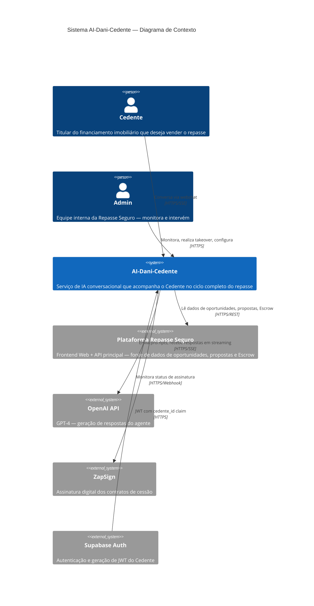
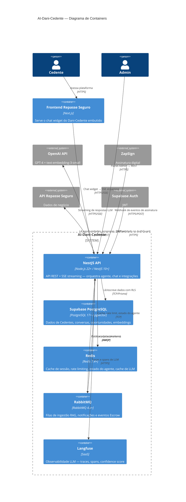
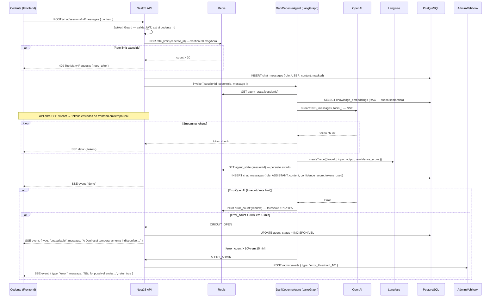
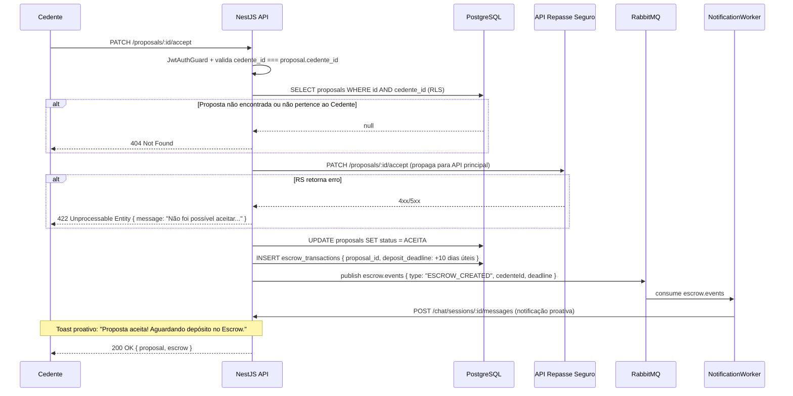
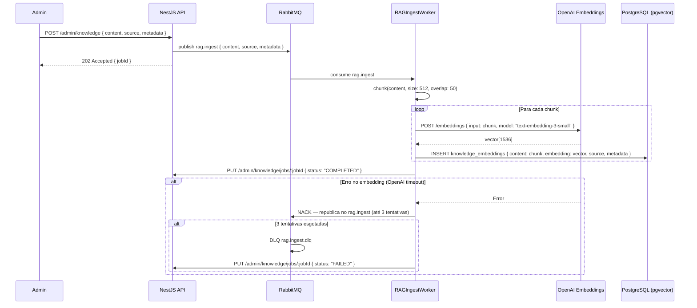
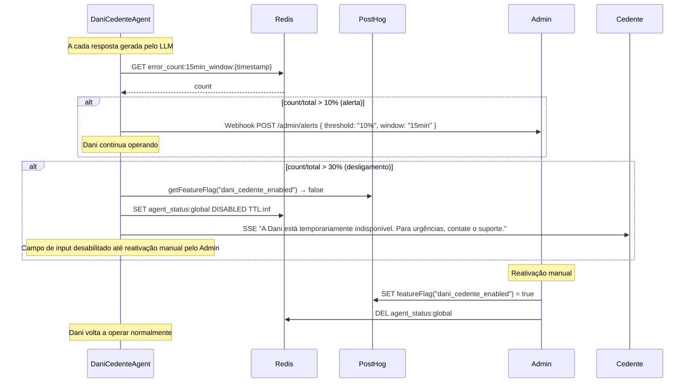
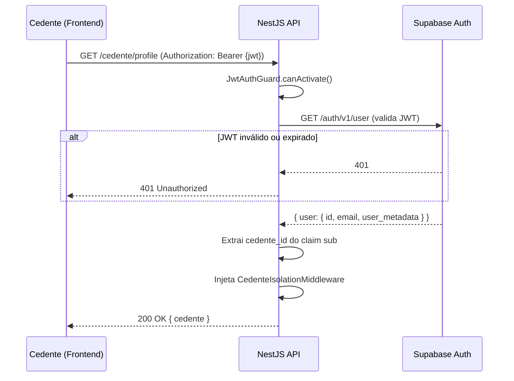

# 14 - Especificações Técnicas — AI-Dani-Cedente

| Campo | Valor |
|---|---|
| Destinatário | Arquitetura e Engenharia |
| Escopo | Documento de arquitetura interna com módulos, fluxos, containers, filas e decisões arquiteturais |
| Módulo | AI-Dani-Cedente |
| Versão | v1.0 |
| Responsável | Claude Code Desktop |
| Data da versão | 23/03/2026 (America/Fortaleza) |
| Dependências | D01 · D02 · D05 · D06 · D10 · D12 · D13 |

---

> **📌 TL;DR**
>
> - **Padrão arquitetural:** Backend-only NestJS microservice — sem frontend próprio; o chat widget é servido pelo frontend da plataforma Repasse Seguro.
> - **Containers:** 6 containers — NestJS backend, Supabase PostgreSQL (pgvector), Redis 7.4+, RabbitMQ 4.x+, Langfuse (observabilidade), OpenAI API (LLM externo).
> - **Fluxos críticos:** 5 documentados — autenticação JWT, chat com streaming SSE, análise de proposta, ingestão RAG e fallback de IA.
> - **Cache:** Redis — 5 chaves com TTL e invalidação definidos (sessão, rate limit, cache LLM, estado do agente, contexto da oportunidade).
> - **Filas:** RabbitMQ — 3 queues (rag.ingest, notification.send, escrow.events) com DLQ e retry exponencial.
> - **ADRs:** 4 registros — deploy VPS/Railway, LangGraph.js, RabbitMQ vs BullMQ, pgvector vs Meilisearch.
> - **Zero seções pendentes** — cobertura 100%.

---

## 1. Arquitetura Geral (C4 Nível 1)

### 1.1 Diagrama de Contexto



### 1.2 Atores externos

| Ator | Tipo | Interação |
|---|---|---|
| **Cedente** | Usuário humano | Chat via widget flutuante na plataforma Repasse Seguro |
| **Admin** | Usuário interno | Painel de monitoramento, takeover, configuração de thresholds |
| **Plataforma Repasse Seguro** | Sistema externo | Fonte de dados de oportunidades, propostas, Escrow e Dossiê |
| **OpenAI API** | Serviço externo | GPT-4 para geração de respostas via streaming SSE |
| **ZapSign** | Serviço externo | Assinatura digital — webhook de eventos |
| **Supabase Auth** | Serviço externo | Autenticação e JWT |

---

## 2. Diagrama de Containers (C4 Nível 2)



---

## 3. Estrutura de Módulos do Backend

### 3.1 Organização por domínio (NestJS modules)

```
src/
├── app.module.ts
├── modules/
│   ├── auth/              # Validação JWT, guards, decorators
│   ├── chat/              # ChatSession, ChatMessage, SSE streaming
│   ├── agent/             # LangGraph state machine, LangChain tools
│   ├── rag/               # RAG pipeline, embeddings, busca semântica
│   ├── opportunity/       # Oportunidades e cenários (leitura da API RS)
│   ├── proposal/          # Propostas, aceite, recusa, contraproposta
│   ├── dossier/           # Documentos do dossiê, upload
│   ├── escrow/            # Transações Escrow, extensão, alertas
│   ├── notification/      # Notificações proativas, ProactiveToast
│   ├── simulation/        # Cálculo de retorno líquido
│   ├── fallback/          # Fallback, kill switch, circuit breaker
│   └── admin/             # Painel admin, takeover, métricas
├── common/
│   ├── middleware/        # PII masking, rate limit, cedente isolation
│   ├── guards/            # JwtAuthGuard, RbacGuard, RateLimitGuard
│   ├── interceptors/      # LoggingInterceptor, LangfuseInterceptor
│   ├── filters/           # GlobalExceptionFilter
│   └── decorators/        # @CurrentCedente(), @RequireRole()
├── infrastructure/
│   ├── prisma/            # PrismaService, middleware
│   ├── redis/             # RedisService, cache patterns
│   ├── rabbitmq/          # RabbitMQService, publishers, consumers
│   ├── openai/            # OpenAIService, streaming adapter
│   └── langfuse/          # LangfuseService, trace wrappers
└── config/
    └── configuration.ts   # Validação de env vars via Joi/zod
```

### 3.2 Padrão por módulo

Cada módulo de domínio segue o padrão NestJS:

```
modules/<dominio>/
├── <dominio>.module.ts         # Module, imports, providers
├── <dominio>.controller.ts     # HTTP endpoints e SSE
├── <dominio>.service.ts        # Lógica de negócio
├── <dominio>.repository.ts     # Acesso ao Prisma (padrão Repository)
├── dto/
│   ├── create-<dominio>.dto.ts
│   └── update-<dominio>.dto.ts
└── entities/
    └── <dominio>.entity.ts     # Mapeamento da entidade Prisma
```

### 3.3 Módulos e responsabilidades

| Módulo | Responsabilidade principal | Dependências |
|---|---|---|
| `auth` | Validar JWT Supabase, injetar `cedente_id` no request | Supabase Auth |
| `chat` | Gerenciar sessões e mensagens, SSE streaming ao frontend | `agent`, `redis`, `prisma` |
| `agent` | Orquestrar LangGraph state machine, executar tools LangChain | `rag`, `openai`, `langfuse` |
| `rag` | Busca semântica, construção de contexto para o LLM | `prisma` (knowledge_embeddings), `openai` (embeddings) |
| `opportunity` | Ler e cachear dados de oportunidades da API Repasse Seguro | `redis`, API RS |
| `proposal` | Processar ações de proposta (aceite, recusa, contraproposta) | `prisma`, `escrow`, `notification` |
| `dossier` | Upload de documentos, acompanhamento de status | `prisma`, S3/Supabase Storage |
| `escrow` | Monitorar Escrow, alertas de prazo, extensão | `prisma`, `notification`, `rabbitmq` |
| `notification` | Enviar notificações proativas via webchat + email | `rabbitmq`, `chat` |
| `simulation` | Calcular retorno líquido (Repasse − Saldo Devedor) | — (cálculo síncrono puro) |
| `fallback` | Circuit breaker, kill switch PostHog, thresholds de erro | `redis`, PostHog |
| `admin` | Endpoints de takeover, métricas CSAT, configurações | `prisma`, `langfuse` |

---

## 4. Fluxos Internos Críticos

### 4.1 Fluxo: Chat com Streaming SSE



### 4.2 Fluxo: Aceite de Proposta com Escrow



### 4.3 Fluxo: Ingestão RAG (Assíncrono)



### 4.4 Fluxo: Fallback e Circuit Breaker



### 4.5 Fluxo: Validação de Autenticação



---

## 5. Estratégia de Cache (Redis)

| Recurso | Chave | TTL | Estratégia de Invalidação | Cache Miss | Cache Indisponível |
|---|---|---|---|---|---|
| Rate limit de mensagens | `rate_limit:{cedente_id}:{hour}` | 3600s (1h) — janela deslizante | Expira naturalmente | Cria novo counter | Fallback: consulta DB com contador aproximado; log de alerta |
| Estado do agente LangGraph | `agent_state:{session_id}` | 1800s (30min de inatividade) | Encerramento de sessão, nova sessão criada | Inicializa estado `idle` do LangGraph | Reconstrói estado do zero a partir do histórico no DB |
| Cache semântico LLM (exact) | `llm_cache:exact:{hash(prompt)}` | 3600s (1h) | Sem invalidação automática (prompts idênticos) | Chama OpenAI API | Chama OpenAI API diretamente |
| Cache semântico LLM (semantic) | `llm_cache:semantic:{embedding_hash}` | 1800s | Invalidação manual pelo Admin | Chama OpenAI API | Chama OpenAI API diretamente |
| Contexto da oportunidade | `opportunity:{cedente_id}:{opportunity_id}` | 300s (5min) | Webhook de mudança de status da API RS | Consulta API Repasse Seguro | Consulta API RS diretamente; log de alerta |
| Threshold de erros | `error_count:{window_key}` | 900s (15min — janela) | Expira naturalmente (sliding window) | Inicia contador do zero | Log de alerta; assume threshold não atingido |

### 5.1 Regras gerais de caching

- **Cache aside pattern:** API consulta Redis primeiro; em miss, consulta fonte e popula cache
- **Cache de LLM reduz ~40% de chamadas para perguntas frequentes** (estimativa D05.5)
- Dados pessoais do Cedente (CPF, nome) nunca são cacheados no Redis — apenas IDs
- Todos os keys seguem o padrão `{recurso}:{identificador}:{sub-identificador}`

---

## 6. Estratégia de Filas (RabbitMQ)

### 6.1 Topologia

```
Exchange: dani.direct (type: direct)
├── Queue: rag.ingest          → RAGIngestWorker
│   └── DLQ: rag.ingest.dlq
├── Queue: notification.send   → NotificationWorker
│   └── DLQ: notification.send.dlq
└── Queue: escrow.events       → EscrowEventWorker
    └── DLQ: escrow.events.dlq
```

### 6.2 Tabela de jobs

| Job | Queue | Retry | Backoff | DLQ TTL | Idempotência |
|---|---|---|---|---|---|
| Ingestão RAG (chunking + embedding) | `rag.ingest` | 3× | Exponencial: 5s, 15s, 45s | 7 dias | ID único do chunk como dedup key |
| Notificação proativa (webchat + email) | `notification.send` | 3× | Exponencial: 2s, 5s, 15s | 2 dias | `notification_id` — reprocessamento é idempotente |
| Evento Escrow (criar, alertar, expirar) | `escrow.events` | 5× | Exponencial: 1s, 3s, 9s, 27s, 81s | 3 dias | `escrow_transaction_id + event_type` |

### 6.3 Monitoramento de filas

- RabbitMQ Management Plugin ativo em todos os ambientes
- Alerta automático se DLQ tiver > 0 mensagens (via Sentry ou webhook Admin)
- Métricas de throughput exportadas para PostHog: `queue.processed`, `queue.failed`, `queue.dlq`

---

## 7. ADRs (Architecture Decision Records)

### ADR-001: Deploy em VPS/Railway em vez de Vercel

- **Contexto:** A IA precisa de processos de longa duração (SSE streaming, workers de fila, WebSocket futuro). Vercel usa serverless functions com timeout máximo de 60s.
- **Decisão:** Deploy em VPS (DigitalOcean/Hetzner) ou Railway com suporte a processos persistentes.
- **Alternativas:** (A) Vercel Edge Functions + SSE; (B) VPS/Railway com containers Docker.
- **Justificativa:** SSE streaming de LLM pode durar > 60s; workers RabbitMQ precisam de processos persistentes; Redis e RabbitMQ requerem conexões TCP persistentes.
- **Consequências:** Maior responsabilidade operacional (Docker, health checks, auto-restart). Mitigação: Railway abstraí boa parte da infraestrutura.

### ADR-002: LangGraph.js para orquestração stateful do agente

- **Contexto:** O agente precisa manter estado entre mensagens (idle → analyzing_proposal → escrow_monitoring) e rastrear o ciclo de vida do Cedente.
- **Decisão:** LangGraph.js como state machine do agente.
- **Alternativas:** (A) Prompt engineering puro com histórico no contexto; (B) LangGraph.js com estado persistido no Redis.
- **Justificativa:** LangGraph.js permite fluxos condicionais explícitos, auditáveis via Langfuse, e facilita o takeover do Admin (injeção de estado externo). Estado persistido no Redis garante continuidade entre mensagens.
- **Consequências:** Dependência da biblioteca LangGraph.js; curva de aprendizado para a equipe. Mitigação: documentação D19 cobre a implementação completa.

### ADR-003: RabbitMQ em vez de BullMQ para filas

- **Contexto:** O sistema precisa de 3 filas distintas — ingestão RAG, notificações e eventos Escrow.
- **Decisão:** RabbitMQ 4.x+ com exchanges e consumers dedicados.
- **Alternativas:** (A) BullMQ (Redis-backed); (B) RabbitMQ com AMQP.
- **Justificativa:** RabbitMQ separa responsabilidades entre Redis (cache/rate-limit) e filas de mensagens; oferece roteamento por exchange; mais adequado para eventos Escrow com múltiplos consumers potenciais em fases futuras.
- **Consequências:** Infra adicional (RabbitMQ container). BullMQ seria mais simples operacionalmente, mas concentraria muita responsabilidade no Redis.

### ADR-004: pgvector em vez de solução de busca externa

- **Contexto:** O RAG precisa de busca semântica em embeddings de 1536 dimensões.
- **Decisão:** Supabase pgvector com IVFFlat index.
- **Alternativas:** (A) Pinecone (managed vector DB); (B) Meilisearch com plugins de vector search; (C) pgvector nativo do Supabase.
- **Justificativa:** pgvector mantém os embeddings no mesmo banco PostgreSQL (Supabase), eliminando serviço adicional, simplificando RLS e reduzindo latência de busca. Para o volume estimado (< 100K embeddings na Fase 1), pgvector com IVFFlat é suficiente.
- **Consequências:** Escala limitada comparado a Pinecone para volumes muito grandes. Mitigação: pgvector pode ser migrado para Pinecone sem mudança de API caso o volume cresça.

---

## 8. Requisitos Não-Funcionais

### 8.1 Performance

| Métrica | SLA | Fonte |
|---|---|---|
| Latência de resposta do chat (p95) | ≤ 5s (tempo até primeira token via SSE) | RN-DCE-022 / D05.5 |
| Latência de resposta do chat (p99) | ≤ 10s | D05.5 |
| Latência de busca RAG (p95) | ≤ 500ms | [DECISÃO AUTÔNOMA — IVFFlat com lists=100 garante ~2-10ms por busca + tempo de embedding ~200ms] |
| Latência de endpoints REST (p95) | ≤ 200ms (exceto SSE) | [DECISÃO AUTÔNOMA — padrão SaaS B2B] |
| Throughput simultâneo | 100 Cedentes simultâneos sem degradação de SLA | D05.5 |

### 8.2 Escalabilidade

- **Serviço stateless:** estado da sessão no Redis — escala horizontalmente adicionando instâncias NestJS
- **Workers RabbitMQ:** escala horizontalmente por queue independentemente da API
- **Cache LLM:** reduz chamadas à OpenAI em ~40% para perguntas frequentes
- **pgvector IVFFlat:** suporta até ~1M embeddings com degradação aceitável; acima disso: migrar para HNSW index

### 8.3 Disponibilidade

| Requisito | Valor |
|---|---|
| Disponibilidade alvo | 99.5% (≈ 3.65h downtime/mês) |
| RTO (Recovery Time Objective) | ≤ 15 minutos |
| RPO (Recovery Point Objective) | ≤ 1 hora (backups Supabase) |
| Janela de manutenção | Domingos 02:00–04:00 (America/Fortaleza) |

### 8.4 Segurança

| Camada | Implementação |
|---|---|
| Autenticação | JWT Supabase Auth, validado em todo endpoint |
| Autorização | `cedente_id` claim + RLS PostgreSQL + `CedenteIsolationMiddleware` |
| PII em logs | Mascarado pelo `PIIMaskingMiddleware` antes de qualquer log externo |
| HTTPS | Obrigatório em todos os ambientes (incluindo staging) |
| Criptografia em repouso | Gerenciada pelo Supabase (PostgreSQL encryption at rest) |
| Rate limiting | 30 msg/hora por Cedente (Redis) + 60 req/min por IP (endpoints públicos) |
| Kill switch | Feature flag PostHog `dani_cedente_enabled` — desligamento instantâneo |

---

## 9. Changelog

| Data | Versão | Descrição |
|---|---|---|
| 23/03/2026 | v1.0 | Versão inicial. C4 nível 1 e 2, estrutura de 12 módulos NestJS, 5 fluxos críticos com Mermaid (chat SSE, aceite proposta+Escrow, ingestão RAG, fallback/circuit breaker, autenticação), cache Redis (6 chaves), filas RabbitMQ (3 queues + DLQ), 4 ADRs, requisitos não-funcionais. |

---

## 10. Backlog de Pendências

| Item | Marcador | Seção | Justificativa / Trade-off | Impacto | Dono | Status |
|---|---|---|---|---|---|---|
| Latência RAG p95 ≤ 500ms | DECISÃO AUTÔNOMA | Seção 8.1 | IVFFlat com lists=100 garante ~2-10ms por busca; embedding ~200ms. Total estimado < 500ms para a maioria dos casos. Alternativa descartada: limite mais restritivo de 200ms (inviável com chamada ao OpenAI para embedding em cada query). | P1 | Engenharia | Validar com benchmark em produção |
| Latência REST p95 ≤ 200ms | DECISÃO AUTÔNOMA | Seção 8.1 | Padrão SaaS B2B. Alternativa: 100ms (mais restritivo, pode exigir otimizações prematuras). | P2 | Engenharia | Monitorar em staging |
| Railway vs VPS dedicado — custo mensal estimado | DEFINIÇÃO PENDENTE | ADR-001 | (A) Railway: ~$20-50/mês por serviço, menor operacional; (B) VPS Hetzner: ~$10-30/mês, maior controle. Trade-off: custo vs. complexidade operacional. | P1 | DevOps / Produto | Decidir antes do deploy de staging |
