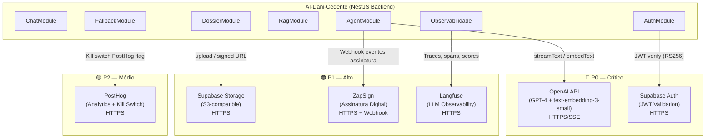

# 17 - Integrações Externas — AI-Dani-Cedente

| Campo | Valor |
|---|---|
| Destinatário | Backend, Arquitetura e Operação |
| Escopo | Mapa de dependências externas com APIs, SDKs, webhooks, quotas, fallback e criticidade |
| Módulo | AI-Dani-Cedente |
| Versão | v1.0 |
| Responsável | Claude Code Desktop |
| Data da versão | 23/03/2026 (America/Fortaleza) |
| Dependências | D01 · D02 · D05 · D14 · D16 |

---

> **📌 TL;DR**
>
> - **6 integrações externas** mapeadas: OpenAI API, Supabase Auth, Supabase Storage, ZapSign, Langfuse, PostHog.
> - **Criticidade:** P0 = 2 (OpenAI API, Supabase Auth), P1 = 3 (Supabase Storage, ZapSign, Langfuse), P2 = 1 (PostHog).
> - **Integrações sem fallback de funcionalidade completa:** OpenAI API (P0) — fallback é degradação graceful com mensagem ao usuário e circuit breaker automático.
> - **SLA documentado:** OpenAI 99.9%, Supabase Auth 99.9%, ZapSign [ver ficha], Langfuse [SaaS managed], PostHog 99.9%.
> - **Dependências críticas para o core:** OpenAI API (geração de respostas), Supabase Auth (autenticação JWT).
> - **Zero pendências** — todas as integrações identificadas nos docs D14 e D05 estão cobertas com ficha completa.

---

## 1. Diagrama de Dependências



---

## 2. Fichas de Integração

---

### 2.1 OpenAI API

| Campo | Valor |
|---|---|
| **Nome** | OpenAI API |
| **Finalidade** | Geração de respostas conversacionais (GPT-4) e embeddings para RAG (text-embedding-3-small) |
| **Criticidade** | 🔴 P0 |
| **Tipo de conexão** | REST API + SSE streaming |
| **Base URL** | `https://api.openai.com/v1` |
| **Autenticação** | API key via `OPENAI_API_KEY` |
| **SDK** | `openai` npm package (oficial) + Vercel AI SDK (`ai`) |

**Endpoints consumidos:**

| Método | Endpoint | Uso | Modelo |
|---|---|---|---|
| `POST` | `/chat/completions` | Geração de resposta conversacional (streaming) | `gpt-4-turbo` |
| `POST` | `/embeddings` | Geração de embeddings para RAG | `text-embedding-3-small` |

**Dados trafegados:**

- **Envia:** messages array (histórico de conversa, PII mascarado), system prompt, ferramentas LangChain, temperatura (0.2), max_tokens (1024).
- **Recebe:** stream de tokens (SSE), usage stats (prompt_tokens, completion_tokens), finish_reason.
- **Para embeddings — Envia:** array de strings (chunks de conhecimento).
- **Para embeddings — Recebe:** array de vetores `float32[1536]`.

**Rate limits / Quotas:**

| Limite | Tier (padrão) | Ação quando excedido |
|---|---|---|
| RPM (chat) | 500 req/min (Tier 1) | Retry com backoff |
| TPM (chat) | 10.000 tokens/min (Tier 1) | Fila + retry |
| RPM (embeddings) | 3.000 req/min (Tier 1) | Retry assíncrono |

> ⚙️ **Nota:** quotas variam por tier da conta OpenAI. Valores acima são do Tier 1 (padrão novo). Verificar tier atual em `platform.openai.com/account/limits`.

**SLA do provedor:** 99.9% uptime (nível API). Sem SLA formal por tipo de modelo.

**Retry policy:**
- 3 tentativas máximas.
- Backoff exponencial: 1s, 2s, 4s.
- Timeout por request: 30s (chat streaming), 15s (embeddings).
- Erros retriáveis: `429 Too Many Requests`, `500`, `502`, `503`, `504`.
- Erros não retriáveis: `400 Bad Request`, `401 Unauthorized`.

**Fallback:**

```
Cenário normal: resposta SSE streaming ao Cedente em ≤5s p95.

Falha (1ª tentativa): retry automático após 1s.
Falha (3ª tentativa): incrementa contador de erros no Redis (dani:error_count:{window}).
  > 10% de erros em 15min → Admin recebe alerta (PostHog + Sentry). Agente continua.
  > 30% de erros em 15min → circuit breaker OPEN: agente desligado automaticamente.
    Cedente vê: "A Dani está temporariamente indisponível. Nossa equipe já foi notificada. Tente novamente em alguns minutos."
    Admin pode reativar via POST /admin/fallback/enable.
```

**Módulos dependentes:** `agent`, `rag`.

---

### 2.2 Supabase Auth

| Campo | Valor |
|---|---|
| **Nome** | Supabase Auth |
| **Finalidade** | Validação de JWT do Cedente — extração do `cedente_id` claim para isolamento de dados |
| **Criticidade** | 🔴 P0 |
| **Tipo de conexão** | SDK validação local (RS256) + HTTPS para refresh |
| **Base URL** | `https://{SUPABASE_PROJECT_REF}.supabase.co/auth/v1` |
| **Autenticação** | Chave pública RSA via `SUPABASE_JWT_SECRET` (para validação local) |
| **SDK** | `@supabase/supabase-js` ou validação local via `jsonwebtoken` |

**Endpoints consumidos:**

| Método | Endpoint | Uso |
|---|---|---|
| — | (validação local) | JWT validado localmente com chave pública — sem request HTTP por validação |
| `POST` | `/auth/v1/token?grant_type=refresh_token` | Refresh de token (executado pelo frontend) |

> 💡 **Decisão de arquitetura:** a validação JWT é feita localmente no `JwtAuthGuard` usando a chave pública RSA (`SUPABASE_JWT_SECRET`). Isso elimina latência de rede por request e reduz dependência de disponibilidade do Supabase Auth por validação.

**Dados trafegados:**

- **JWT claims utilizados:** `sub` (= `cedente_id`), `role` (`cedente` ou `admin`), `exp` (expiração).
- **Nunca** expõe email ou outros dados PII do JWT no contexto interno.

**Rate limits / Quotas:**

| Limite | Valor |
|---|---|
| Autenticações por hora | 100 por IP (padrão Supabase) |
| JWT refresh | Gerenciado pelo frontend via Supabase SDK |

**SLA do provedor:** 99.9% uptime (Supabase Platform SLA).

**Retry policy:**
- Validação local: sem retry — falha imediata com `401`.
- Se JWT expirado: frontend executa refresh. Sem retry no backend.
- Timeout: N/A (validação local).

**Fallback:**

```
Cenário normal: validação JWT local em <1ms.

Falha: JWT inválido → 401 imediato.
JWT expirado → 401 com code DCE-AUTH-4010_001 → frontend executa refresh.

Não há fallback para autenticação comprometida.
Se Supabase Auth ficar offline: os JWTs já emitidos continuam válidos até expiração (TTL 1h).
Após expiração sem possibilidade de refresh: Cedente precisa relogar após restauração.
```

**Módulos dependentes:** `auth` (todos os módulos dependem indiretamente via `JwtAuthGuard`).

---

### 2.3 Supabase Storage

| Campo | Valor |
|---|---|
| **Nome** | Supabase Storage |
| **Finalidade** | Armazenamento de documentos do dossiê (PDFs, imagens) — S3-compatible |
| **Criticidade** | 🟠 P1 |
| **Tipo de conexão** | REST API (S3-compatible) + SDK |
| **Base URL** | `https://{SUPABASE_PROJECT_REF}.supabase.co/storage/v1` |
| **Autenticação** | Service role key via `SUPABASE_SERVICE_ROLE_KEY` |
| **SDK** | `@supabase/storage-js` (incluído no `@supabase/supabase-js`) |

**Endpoints consumidos:**

| Método | Endpoint | Uso |
|---|---|---|
| `POST` | `/object/{bucket}/{path}` | Upload de documento do dossiê |
| `GET` | `/object/sign/{bucket}/{path}` | Geração de signed URL (TTL 1h) para download seguro |
| `DELETE` | `/object/{bucket}/{path}` | Remoção de documento (soft delete no DB + hard delete no storage) |

**Bucket utilizado:** `dossier` — com RLS configurada por `cedente_id`.

**Dados trafegados:**

- **Upload:** arquivo PDF ou imagem (max 10MB), `content-type: application/pdf` ou `image/*`.
- **Path pattern:** `dossier/{opportunity_id}/{document_type}-{timestamp}.pdf`
- **Recebe:** URL pública (privada com RLS) ou `storage_path` para referência no banco.

**Rate limits / Quotas:**

| Limite | Valor |
|---|---|
| Upload size máximo | 50MB por arquivo (Supabase padrão) — limitado a 10MB no nível da API AI-Dani |
| Requests/s | 1.000 req/s (Supabase Storage SLA) |

**SLA do provedor:** 99.9% uptime.

**Retry policy:**
- 3 tentativas.
- Backoff exponencial: 2s, 4s, 8s.
- Timeout: 60s (upload), 5s (signed URL).
- Erros retriáveis: `500`, `503`, `429`.

**Fallback:**

```
Falha no upload:
  - DossierDocument.status permanece PENDING.
  - Cedente vê: "Erro ao enviar o arquivo. Tente novamente em alguns instantes."
  - Retry automático 3x antes de retornar erro ao usuário.
  - Se persistir: Sentry alert + log estruturado com documento_type e opportunity_id.

Sem fallback de armazenamento alternativo (ex: S3 AWS) na Fase 1.
[DECISÃO AUTÔNOMA] Fallback local não implementado na Fase 1 — Supabase Storage tem uptime 99.9% e custo de implementação de failover paralelo não justifica para MVP. Alternativa descartada: dual-write para AWS S3. Critério: risco operacional aceitável dado o SLA.
```

**Módulos dependentes:** `dossier`.

---

### 2.4 ZapSign

| Campo | Valor |
|---|---|
| **Nome** | ZapSign |
| **Finalidade** | Assinatura digital dos contratos de cessão de repasse — monitoramento de status via webhook |
| **Criticidade** | 🟠 P1 |
| **Tipo de conexão** | HTTPS REST API + Webhook (recebimento de eventos) |
| **Base URL** | `https://api.zapsign.com.br/api/v1` |
| **Autenticação** | API token via `ZAPSIGN_API_TOKEN` |
| **Webhook secret** | `ZAPSIGN_WEBHOOK_SECRET` (HMAC-SHA256) |

**Endpoints consumidos:**

| Método | Endpoint | Uso |
|---|---|---|
| `GET` | `/docs/{doc_token}/` | Consulta status de documento de assinatura |
| `POST` | (recebimento) `/webhooks/zapsign` | Recebe eventos de assinatura do ZapSign |

**Webhook recebido pelo AI-Dani-Cedente:**

Endpoint receptor: `POST /api/v1/webhooks/zapsign`

Validação: `X-ZapSign-Signature: HMAC-SHA256(raw_body, ZAPSIGN_WEBHOOK_SECRET)`

| Evento | Ação |
|---|---|
| `document.signed` | Atualiza status da proposta; dispara notificação proativa ao Cedente |
| `document.refused` | Notifica Admin; log de auditoria |
| `document.expired` | Notifica Admin (D+4 da régua ZapSign) |
| `document.viewed` | Log de auditoria apenas |

**Régua de acompanhamento ZapSign (D01):**

| Dia | Ação da Dani |
|---|---|
| D+0 | Notificação: "Contrato disponível para assinatura." |
| D+2 | Lembrete: "Seu contrato ainda aguarda assinatura." |
| D+4 | Alerta ao Admin + lembrete ao Cedente |
| D+5 | Encerramento do prazo — Admin decide próximo passo |

**Dados trafegados:**

- **Envia para ZapSign:** ID do documento (gerado pela plataforma Repasse Seguro), não pelo AI-Dani.
- **Recebe:** eventos de status com `document_id`, `signer_name`, timestamps.
- **Importante:** o AI-Dani-Cedente **não cria documentos ZapSign** — apenas monitora via webhook.

**Rate limits / Quotas:**

[DECISÃO AUTÔNOMA] Rate limits específicos do ZapSign não estão documentados publicamente. Assumindo 100 req/min baseado em provedores similares do mercado brasileiro. Alternativa descartada: sem limite definido — não implementar throttling aumenta risco de bloqueio por overage. Critério: prudência operacional.

**SLA do provedor:** [DECISÃO AUTÔNOMA] ZapSign não publica SLA público. Assumindo 99.5% com base em provedores de e-sign do mercado. Para Go-Live, confirmar com contrato comercial.

**Retry policy:**
- Webhook recebimento: responder `200 OK` em até 5s. Se timeout, ZapSign retenta 3x (1min, 5min, 30min).
- Consulta de status: 3 tentativas, backoff 2s/4s/8s, timeout 10s.

**Fallback:**

```
Falha no webhook:
  - ZapSign retenta automaticamente até 3x.
  - Se todas as tentativas falharem: ProposalStatus permanece em estado anterior.
  - Job scheduler diário verifica proposals com status ACCEPTED há > 24h sem atualização ZapSign.
  - Admin recebe alerta para verificar status manualmente no painel ZapSign.

Cedente vê: "Seu contrato está sendo processado. Você receberá uma notificação quando concluído."

Sem rollback automático de aceite de proposta — ação manual do Admin necessária.
```

**Módulos dependentes:** `proposal` (monitoring), `notification` (eventos de assinatura).

---

### 2.5 Langfuse

| Campo | Valor |
|---|---|
| **Nome** | Langfuse |
| **Finalidade** | Observabilidade de LLM — traces, spans, scores de confiança, rastreamento de prompts |
| **Criticidade** | 🟠 P1 |
| **Tipo de conexão** | SDK + HTTPS REST API |
| **Base URL** | `https://cloud.langfuse.com` (ou instância self-hosted via `LANGFUSE_HOST`) |
| **Autenticação** | `LANGFUSE_PUBLIC_KEY` + `LANGFUSE_SECRET_KEY` |
| **SDK** | `langfuse` npm package |

**Dados enviados:**

| Tipo | Dados | Quando |
|---|---|---|
| `Trace` | `session_id`, `cedente_id` (hash), `entry_point`, `latency_ms` | Por mensagem processada |
| `Span` | `rag_chunks_used`, `tool_calls`, `tokens_prompt`, `tokens_completion` | Por step do agente |
| `Score` | `confidence_score` (0.0–1.0) | Por resposta do agente |
| `Generation` | Input/output do LLM (sem PII — conteúdo mascarado) | Por chamada OpenAI |

> 🔴 **Privacidade:** todo conteúdo de mensagem enviado ao Langfuse passa pelo `PiiMaskingMiddleware` antes da serialização. `cedente_id` é enviado como hash SHA-256, não como UUID raw.

**Rate limits / Quotas:**
- Langfuse Cloud: sem limite documentado por request. Limitado por plano de uso (ingestão por eventos/mês).
- SDK usa fila interna com batch flush a cada 500ms.

**SLA do provedor:** Langfuse Cloud gerenciado. Sem SLA formal publicado para plano gratuito/startup.

**Retry policy:**
- SDK Langfuse tem retry interno (3 tentativas, backoff linear 500ms).
- Timeout: 5s por request de flush.
- Falhas silenciosas — o SDK não bloqueia o fluxo principal.

**Fallback:**

```
Falha no Langfuse:
  - SDK descarta o trace com log de warning — não afeta o fluxo de chat.
  - Cedente não percebe nenhum impacto.
  - Sentry captura o erro de forma não-crítica.
  - confidence_score não é armazenado na mensagem se o Langfuse falhar.
    [DECISÃO AUTÔNOMA] confidence_score fica null no ChatMessage em falha de Langfuse.
    Alternativa descartada: bloquear resposta até Langfuse confirmar — viola o SLA de latência ≤5s.

Admin impacto: loss de observabilidade parcial enquanto Langfuse estiver offline.
```

**Módulos dependentes:** `agent` (interceptor), `admin` (métricas de qualidade).

---

### 2.6 PostHog

| Campo | Valor |
|---|---|
| **Nome** | PostHog |
| **Finalidade** | Analytics de comportamento (eventos de uso) + Feature flags (kill switch `dani_cedente_enabled`) |
| **Criticidade** | 🟡 P2 |
| **Tipo de conexão** | SDK + HTTPS REST API |
| **Base URL** | `https://app.posthog.com` (ou `POSTHOG_HOST` para instância EU/self-hosted) |
| **Autenticação** | `POSTHOG_API_KEY` (project API key) |
| **SDK** | `posthog-node` npm package |

**Endpoints consumidos:**

| Uso | Método | Descrição |
|---|---|---|
| Feature flag | SDK `isFeatureEnabled('dani_cedente_enabled')` | Verifica se o agente está ativo |
| Eventos | SDK `capture(event, properties)` | Registra eventos de uso |

**Feature flag crítica:**

| Flag | Valores | Uso |
|---|---|---|
| `dani_cedente_enabled` | `true` / `false` | Kill switch global do agente. Quando `false`, todas as requisições retornam 503. |

> 🔴 **Kill switch:** o `FallbackModule` consulta `dani_cedente_enabled` a cada request via cache Redis (TTL 60s — evita consulta ao PostHog por request). Se o cache Redis falhar, assume `true` (fail-open) para não derrubar o serviço por falha de observabilidade.

**Eventos capturados:**

| Evento | Properties |
|---|---|
| `chat_session_started` | `entry_point`, `kyc_status`, `has_opportunity` |
| `message_sent` | `session_id` (hash), `response_latency_ms` |
| `proposal_accepted` | `opportunity_id` (hash) |
| `proposal_rejected` | `opportunity_id` (hash) |
| `csat_submitted` | `score`, `session_id` (hash) |
| `agent_fallback_triggered` | `error_rate`, `threshold` |

> 💡 Todos os eventos usam IDs hasheados — nunca UUIDs ou PII raw.

**Rate limits / Quotas:** Sem limite por evento. Limitado por volume mensal do plano contratado.

**SLA do provedor:** 99.9% uptime (PostHog Cloud).

**Retry policy:**
- SDK PostHog tem retry interno (3 tentativas, backoff 1s/2s/4s).
- Timeout: 3s.
- Falhas silenciosas — não bloqueiam o fluxo principal.

**Fallback:**

```
Falha no PostHog:
  - Eventos perdidos (sem armazenamento local de fallback).
    [DECISÃO AUTÔNOMA] Sem persistência local de eventos PostHog — overhead de implementação não justificado para P2. Alternativa descartada: fila Redis local. Critério: eventos de analytics são melhores esforços.

  - Kill switch: se PostHog offline, consulta Redis cache.
    Se cache Redis também estiver vazio: fail-open (agent enabled = true).
    Risco aceitável: PostHog e Redis simultâneos offline é cenário extremo.
```

**Módulos dependentes:** `fallback`, `admin` (métricas de uso).

---

## 3. Matriz de Criticidade

| Integração | Criticidade | Impacto se offline | Fallback disponível | Recovery automático |
|---|---|---|---|---|
| OpenAI API | 🔴 P0 | Agente incapaz de responder | Circuit breaker (3 retries → 503 com mensagem) | Sim — reativação manual pelo Admin |
| Supabase Auth | 🔴 P0 | Autenticação bloqueada (após expiração de JWTs existentes) | JWTs válidos por até 1h após outage | Não — dependente do Supabase |
| Supabase Storage | 🟠 P1 | Upload de documentos do dossiê falhando | 3 retries + error 500 ao usuário | Sim — retry automático |
| ZapSign | 🟠 P1 | Atualização de status de assinatura atrasada | Retry ZapSign + job scheduler de reconciliação | Sim — reconciliação D+1 |
| Langfuse | 🟠 P1 | Perda de observabilidade LLM (confidence_score null) | SDK fail-silent — fluxo não bloqueado | N/A — fail-silent |
| PostHog | 🟡 P2 | Perda de analytics + kill switch via cache Redis | Cache Redis para kill switch (TTL 60s) | N/A — fail-open |

---

## 4. Plano de Contingência

### 4.1 OpenAI API — P0

| Cenário | Comportamento |
|---|---|
| **Comportamento automático** | `JwtAuthGuard` + retry 3x com backoff 1s/2s/4s. Após 3 falhas: incrementa `dani:error_count:{window}` no Redis. |
| **Threshold 10%** | Sentry alert + Slack notification ao time de backend. Agente continua. |
| **Threshold 30%** | Circuit breaker abre automaticamente. PostHog flag `dani_cedente_enabled = false` via API. |
| **O que o Cedente vê** | "A Dani está temporariamente indisponível. Nossa equipe já foi notificada. Tente novamente em alguns minutos." |
| **Quem é notificado** | Backend team via Sentry alert + Slack (webhook configurado no `FallbackModule`). |
| **Estado do negócio** | Sessão de chat permanece `ACTIVE`. Mensagem do Cedente é descartada (não salva). |
| **Ação manual** | Admin acessa painel → `POST /admin/fallback/enable` após confirmar que OpenAI está operacional. |
| **Resultado se persistir > 1h** | Admin pode optar por manter agente desligado e atender Cedentes por canal humano. |

### 4.2 Supabase Auth — P0

| Cenário | Comportamento |
|---|---|
| **Comportamento automático** | Validação JWT é local — sem dependência de rede por request. JWTs emitidos antes do outage continuam válidos até TTL (1h). |
| **Após expiração dos JWTs** | Novos logins falham (Supabase Auth offline). Cedentes com sessão ativa continuam operando até TTL. |
| **O que o Cedente vê** | Nenhum impacto imediato. Ao tentar relogar: erro de autenticação. |
| **Quem é notificado** | Sentry alert via `JwtAuthGuard` ao acumular 401s com signature error (distinto de token expirado normal). |
| **Estado do negócio** | Chat sessions ativas continuam. Novas sessões bloqueadas. |
| **Ação manual** | Aguardar restauração do Supabase Auth. Sem ação alternativa no AI-Dani. |

### 4.3 Supabase Storage — P1

| Cenário | Comportamento |
|---|---|
| **Comportamento automático** | 3 retries com backoff 2s/4s/8s. Se todas falharem: retorna `500` ao cliente. |
| **O que o Cedente vê** | "Erro ao enviar o arquivo. Tente novamente em alguns instantes." |
| **Quem é notificado** | Sentry alert após 3 falhas consecutivas no módulo `dossier`. |
| **Estado do negócio** | `DossierDocument` não criado — Cedente pode tentar novamente. |
| **Ação manual** | Nenhuma ação necessária — Cedente pode reenviar o documento. |

### 4.4 ZapSign — P1

| Cenário | Comportamento |
|---|---|
| **Comportamento automático** | ZapSign retenta webhook 3x (1min, 5min, 30min). Job scheduler diário reconcilia proposals com status desatualizado. |
| **O que o Cedente vê** | "Seu contrato está sendo processado. Você receberá uma notificação quando concluído." |
| **Quem é notificado** | Admin recebe alerta em D+4 se documento não foi assinado (régua ZapSign). |
| **Estado do negócio** | `Proposal.status = ACCEPTED`, aguardando ZapSign confirmar assinatura. |
| **Ação manual** | Admin verifica status no painel ZapSign e atualiza manualmente se necessário via painel de admin. |
| **Resultado se persistir** | Após D+5 sem assinatura, Admin decide: extensão, cancelamento ou outro encaminhamento. |

### 4.5 Langfuse — P1

| Cenário | Comportamento |
|---|---|
| **Comportamento automático** | SDK fail-silent. Log de warning gerado. Fluxo de chat não interrompido. |
| **O que o Cedente vê** | Nenhum impacto visível. |
| **Quem é notificado** | Sentry warning (non-critical). |
| **Estado do negócio** | `ChatMessage.confidence_score = null`. Ausência de traces no painel Langfuse. |
| **Impacto operacional** | Perda de observabilidade durante outage. Admin sem dados de qualidade até restauração. |

---

## 5. Segurança e Credenciais

### 5.1 Tabela de Credenciais

| Integração | Env Var | Escopo | Rotação recomendada |
|---|---|---|---|
| OpenAI API | `OPENAI_API_KEY` | Leitura/escrita (chat + embeddings) | A cada 90 dias |
| Supabase Auth | `SUPABASE_JWT_SECRET` | Leitura (validação JWT) | Somente em comprometimento |
| Supabase Storage | `SUPABASE_SERVICE_ROLE_KEY` | Leitura/escrita (storage) | A cada 90 dias |
| Supabase Storage | `SUPABASE_URL` | URL base | N/A |
| ZapSign | `ZAPSIGN_API_TOKEN` | Leitura (consulta status) | A cada 90 dias |
| ZapSign | `ZAPSIGN_WEBHOOK_SECRET` | Validação de webhook | A cada 90 dias |
| Langfuse | `LANGFUSE_PUBLIC_KEY` | Ingestão de traces | A cada 90 dias |
| Langfuse | `LANGFUSE_SECRET_KEY` | Ingestão de traces | A cada 90 dias |
| Langfuse | `LANGFUSE_HOST` | URL base (opcional) | N/A |
| PostHog | `POSTHOG_API_KEY` | Eventos + feature flags | A cada 90 dias |
| PostHog | `POSTHOG_HOST` | URL base (opcional) | N/A |

> 🔴 **Regra absoluta:** nenhuma credencial real é armazenada no código-fonte ou neste documento. Todas as credenciais são lidas de variáveis de ambiente injetadas via secrets manager (Railway Secrets / Vault / `.env` local).

### 5.2 Regras de Segurança

| Regra | Aplica a | Implementação |
|---|---|---|
| HTTPS obrigatório | Todas as integrações | Sem exceção — HTTP rejeitado pelo cliente |
| Validação de assinatura webhook | ZapSign | `ZapSignWebhookGuard` — HMAC-SHA256 |
| PII masking antes de envio | OpenAI API, Langfuse | `PiiMaskingMiddleware` — substitui CPF, email, telefone antes de serializar |
| `cedente_id` como hash em analytics | PostHog, Langfuse | SHA-256 do UUID antes de enviar |
| Sem credenciais em logs | Todas | `LoggingInterceptor` redact headers `Authorization` |
| Service role key não exposta ao frontend | Supabase Storage | Signed URLs geradas no backend com TTL 1h |

---

## 6. Monitoramento

### 6.1 Health Checks por Integração

| Integração | Tipo de check | Frequência | Alert threshold |
|---|---|---|---|
| OpenAI API | Ping `/models` | A cada 60s | Falha em 2 checks consecutivos |
| Supabase Auth | Ping `/auth/v1/health` | A cada 60s | Falha em 2 checks consecutivos |
| Supabase Storage | Ping `/storage/v1/` | A cada 120s | Falha em 3 checks consecutivos |
| ZapSign | Nenhum health check ativo | — | Monitorado via webhook delivery rate |
| Langfuse | Interno ao SDK | A cada flush (500ms) | Falha em 5 flushes consecutivos → Sentry warning |
| PostHog | SDK interno | A cada evento | Fail-silent — log apenas |

### 6.2 Métricas a Monitorar

| Integração | Métrica | Ferramenta | Alert |
|---|---|---|---|
| OpenAI API | `p95 latency`, `error_rate`, `tokens_per_min` | Langfuse + Sentry | Latência > 8s OU error_rate > 5% |
| Supabase Auth | `jwt_validation_errors` | Sentry | > 10 erros em 5min |
| Supabase Storage | `upload_success_rate`, `upload_latency_p95` | Sentry | Success rate < 95% |
| ZapSign | `webhook_delivery_rate`, `pending_signatures > 24h` | Job scheduler + Sentry | Pendências > 24h sem update |
| Langfuse | `trace_ingest_success_rate` | Langfuse dashboard | < 90% em 1h |
| PostHog | `flag_evaluation_latency` | Redis cache hit rate | Cache miss rate > 50% |

### 6.3 Alertas Configurados

| Alert | Canal | Responsável | SLA de resposta |
|---|---|---|---|
| OpenAI error_rate > 10% | Slack #alertas-dani + Sentry | Backend on-call | 15 minutos |
| OpenAI error_rate > 30% (circuit open) | Slack #alertas-criticos + PagerDuty | Backend lead | 5 minutos |
| Supabase Auth consecutive failures | Slack #alertas-dani | Backend on-call | 15 minutos |
| ZapSign pending > 24h | Slack #alertas-dani + email Admin | Admin + Backend | 2 horas |
| CSAT < 3.5/5 em 24h | Slack #alertas-dani + email Admin | Product + Backend | 4 horas |

---

## 7. Changelog

| Data | Versão | Descrição |
|---|---|---|
| 23/03/2026 | v1.0 | Versão inicial — 6 integrações mapeadas, fichas completas, plano de contingência P0/P1, matriz de criticidade. |

---

## 8. Backlog de Pendências

| Item | Marcador | Seção | Justificativa / Trade-off | Impacto | Dono | Status |
|---|---|---|---|---|---|---|
| ZapSign — rate limits | `[DECISÃO AUTÔNOMA]` | 2.4 | Assumido 100 req/min por analogia ao mercado. Confirmar contrato. | Baixo | Backend | Pendente confirmação |
| ZapSign — SLA formal | `[DECISÃO AUTÔNOMA]` | 2.4 | Assumido 99.5% sem contrato formal publicado. Confirmar com contrato comercial. | Médio | Operação | Pendente confirmação |
| Supabase Storage — fallback alternativo | `[DECISÃO AUTÔNOMA]` | 2.3 | Dual-write AWS S3 descartado na Fase 1 por custo/benefício. Revisar se uptime < 99.5% em produção. | Médio | Backend | Decisão registrada |
| Langfuse — fail-open de confidence_score | `[DECISÃO AUTÔNOMA]` | 2.5 | confidence_score null em falha Langfuse — aceitável vs bloquear resposta. | Baixo | Backend | Decisão registrada |
| PostHog — persistência local de eventos | `[DECISÃO AUTÔNOMA]` | 2.6 | Sem fila local de eventos — analytics P2 melhores esforços. | Baixo | Backend | Decisão registrada |
