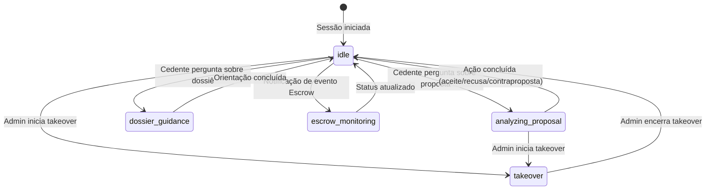
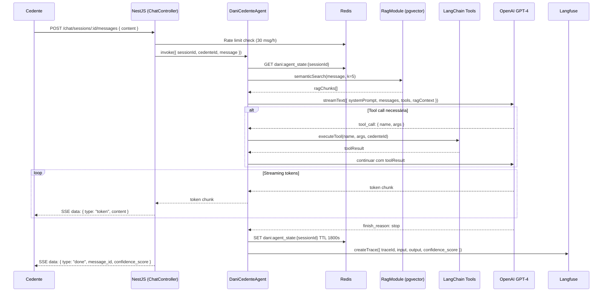

# 19 - Criação de Agentes de IA — AI-Dani-Cedente

| Campo | Valor |
|---|---|
| Destinatário | Arquitetura e Engenharia de IA |
| Escopo | Guia de decisão para arquitetura do agente Dani-Cedente: tools, memória, RAG, guardrails e contratos de saída |
| Módulo | AI-Dani-Cedente |
| Versão | v1.0 |
| Responsável | Claude Code Desktop |
| Data da versão | 23/03/2026 (America/Fortaleza) |
| Dependências | D01 · D02 · D05 · D14 |

---

> **📌 TL;DR**
>
> - **Tipo de agente:** executor com RAG, memória de sessão e aprovação humana em ações financeiras (aceite de proposta, extensão de Escrow).
> - **Stack obrigatória:** NestJS/TypeScript (backend), GPT-4 via OpenAI SDK + Vercel AI SDK (streaming SSE), LangChain.js (tools), LangGraph.js (state machine stateful).
> - **5 tools** documentadas: `get-opportunity`, `get-proposal`, `get-dossier`, `get-escrow`, `simulate-return`.
> - **Memória de sessão:** Redis TTL 1800s por `session_id`. Sem memória de longo prazo na Fase 1.
> - **RAG:** pgvector (text-embedding-3-small, 1536 dims, IVFFlat cosine, k=5 chunks). Ingestão assíncrona via RabbitMQ.
> - **Guardrails críticos:** isolamento por cedente_id, PII masking, confirmação obrigatória em ações financeiras, circuit breaker automático.
> - **Zero seções pendentes** — cobertura 100% da arquitetura do agente Dani-Cedente.

---

## 1. Critérios de Decisão: Tipo de Agente

| Cenário | Tipo de agente | Justificativa |
|---|---|---|
| Responder perguntas do Cedente sobre oportunidade | Agente informacional com RAG | Consulta base de conhecimento + contexto da oportunidade — sem ação externa |
| Analisar proposta recebida e simular retorno | Agente executor com tools | Precisa chamar tool `get-proposal` + `simulate-return` para dados reais |
| Orientar envio de documentos do dossiê | Agente informacional com RAG + tools | Lê status do dossiê via `get-dossier`, orienta mas não faz upload |
| Monitorar status do Escrow | Agente executor com tools | Chama `get-escrow`, dispara alerta proativo se necessário |
| Aceitar ou recusar proposta | Agente executor com aprovação humana obrigatória | Ação financeira irreversível — confirmação explícita do Cedente obrigatória |
| Decidir extensão de prazo de Escrow | Agente executor com aprovação humana | Ação com implicação jurídica — Cedente decide, Dani orienta |
| Responder fora do escopo (dados de Cessionário, jurídico) | Agente bloqueado (guardrail) | RN-DCE-001: isolamento total — resposta de bloqueio padrão |

> ⚙️ **Regra binária:** se a resposta exige dados de domínio (oportunidade, proposta, dossiê, Escrow) → use tool. Se exige apenas orientação geral → use RAG. Se exige ação financeira ou jurídica → obrigatório confirmação humana.

---

## 2. Arquitetura Base do Agente (DaniCedenteAgent)

### 2.1 Componentes Obrigatórios

| Componente | Tecnologia | Responsabilidade |
|---|---|---|
| **State Machine** | LangGraph.js | Gerencia estados do agente (idle, analyzing_proposal, escrow_monitoring, dossier_guidance, takeover) |
| **Tools** | LangChain.js | 5 ferramentas de acesso a dados de domínio |
| **LLM** | GPT-4 (OpenAI SDK + Vercel AI SDK) | Geração de respostas em streaming SSE |
| **RAG Context** | pgvector (Supabase) | Base de conhecimento — regras da plataforma, FAQ Cedente |
| **Session State** | Redis | Estado do agente por sessão (TTL 1800s) |
| **Observabilidade** | Langfuse | Traces, spans, confidence_score |

### 2.2 Estados do LangGraph State Machine

```typescript
// Estados do DaniCedenteAgent

type AgentState = {
  sessionId: string
  cedenteId: string
  currentState: 'idle' | 'analyzing_proposal' | 'escrow_monitoring' | 'dossier_guidance' | 'takeover'
  context: {
    opportunityId?: string
    proposalId?: string
    escrowId?: string
  }
  messages: ChatMessage[]
  ragContext: string[]
  pendingConfirmation?: 'accept_proposal' | 'reject_proposal' | 'approve_extension' | 'reject_extension'
}
```

**Transições de estado:**



### 2.3 Fluxo Completo do Agente



---

## 3. Tools e Capacidades Externas

### 3.1 Tabela de Tools

| Tool | Objetivo | Input | Output | Quando chamar |
|---|---|---|---|---|
| `get-opportunity` | Ler dados da oportunidade do Cedente | `opportunity_id: string` | `Opportunity` completo | Cedente pergunta sobre oportunidade, valores, cenários |
| `get-proposal` | Ler proposta recebida | `proposal_id: string` | `Proposal` + `simulated_return` | Cedente pergunta sobre proposta, valor, prazo |
| `get-dossier` | Ler status dos documentos do dossiê | `opportunity_id: string` | `DossierDocument[]` com status | Cedente pergunta sobre documentos necessários |
| `get-escrow` | Ler status do Escrow | `proposal_id: string` | `EscrowTransaction` | Cedente pergunta sobre Escrow, prazo, depósito |
| `simulate-return` | Calcular retorno líquido | `opportunity_id: string`, `proposal_value: number` | `{ net_return, calculation, label }` | Cedente quer saber quanto vai receber |

### 3.2 Especificação de Cada Tool

```typescript
// Tool: get-opportunity
{
  name: 'get-opportunity',
  description: 'Retorna dados completos de uma oportunidade de repasse do Cedente, incluindo valores financeiros e cenários. Nunca retorna dados de outros Cedentes.',
  parameters: {
    opportunity_id: z.string().uuid()
  },
  execute: async ({ opportunity_id }, { cedenteId }) => {
    // Sempre enforça cedente_id — sem exceção
    const opportunity = await opportunityRepository.findByCedenteId(opportunity_id, cedenteId)
    if (!opportunity) throw new ToolError('Oportunidade não encontrada.')
    return opportunity
  },
  timeout: 5000,         // 5s
  retries: 2,            // 2 tentativas
  fallback: 'Não consegui carregar os dados da sua oportunidade. Tente novamente.'
}

// Tool: simulate-return
{
  name: 'simulate-return',
  description: 'Calcula o retorno líquido estimado para o Cedente com base no valor da proposta e saldo devedor. Fórmula: net_return = proposal_value - saldo_devedor.',
  parameters: {
    opportunity_id: z.string().uuid(),
    proposal_value: z.number().positive()
  },
  execute: async ({ opportunity_id, proposal_value }, { cedenteId }) => {
    const opportunity = await opportunityRepository.findByCedenteId(opportunity_id, cedenteId)
    const net_return = proposal_value - opportunity.saldo_devedor
    return {
      net_return,
      proposal_value,
      saldo_devedor: opportunity.saldo_devedor,
      calculation: `R$ ${fmt(proposal_value)} - R$ ${fmt(opportunity.saldo_devedor)} = R$ ${fmt(net_return)}`,
      label: net_return >= 0 ? 'Retorno positivo.' : 'Retorno negativo — proposta não cobre o saldo devedor.'
    }
  },
  timeout: 3000,
  retries: 1,
  fallback: 'Não consegui calcular a simulação. Verifique os dados da oportunidade.'
}
```

### 3.3 Tratamento de Erro em Tools

| Cenário | Comportamento | Mensagem ao Cedente |
|---|---|---|
| Tool timeout (> 5s) | Retry 1x. Se persistir: retorna erro | "Estou com dificuldade para carregar seus dados agora. Tente novamente em alguns instantes." |
| Tool retorna 404 (isolamento) | Sem retry. Retorna mensagem de bloqueio | "Não encontrei esta informação. Verifique se está consultando a oportunidade correta." |
| Tool retorna 500 (erro interno) | Retry 2x com backoff 1s/2s | "Houve um erro ao buscar seus dados. Já registrei o problema." |
| Todas as tentativas falharam | Log Sentry + continuar sem tool result | "Não consegui acessar os dados agora. Posso te ajudar com uma pergunta mais geral?" |

> 🔴 **Regra crítica:** tools **nunca** recebem `cedenteId` vindo do LLM. O `cedenteId` é sempre injetado do request context (`req.user.cedenteId`) — o LLM não tem permissão para especificar de qual Cedente quer dados.

---

## 4. LLM Padrão (GPT-4 via OpenAI SDK + Vercel AI SDK)

### 4.1 Parâmetros de Configuração

| Parâmetro | Valor | Justificativa |
|---|---|---|
| `model` | `gpt-4-turbo` | Melhor equilíbrio custo/capacidade para conversação contextual |
| `temperature` | `0.2` | Baixa para respostas previsíveis e fiéis ao contexto do Cedente |
| `max_tokens` | `1024` | Respostas concisas — evita verbosidade excessiva |
| `stream` | `true` | SSE streaming obrigatório para UX responsiva (SLA ≤5s primeiro token) |
| `tool_choice` | `auto` | LLM decide quando usar tools — não forçado |

### 4.2 Estrutura do System Prompt

```
SYSTEM PROMPT — AI-Dani-Cedente (versão 1.0)

Você é a Dani, assistente da plataforma Repasse Seguro.
Sua missão é acompanhar o Cedente {cedente_name} no ciclo completo do repasse.

PRINCÍPIOS OBRIGATÓRIOS:
1. Você fala APENAS sobre o repasse do Cedente atual. Nunca sobre outros Cedentes ou Cessionários.
2. Sempre encerre sua mensagem com um próximo passo claro e acionável.
3. Nunca tome ação financeira (aceite, recusa, contraproposta) sem confirmação explícita do Cedente.
4. Se a pergunta estiver fora do escopo do repasse, responda: "[MENSAGEM DE BLOQUEIO]"
5. Tom: acolhedor, direto, seguro, orientado a ação.

CONTEXTO DA SESSÃO:
- Oportunidade: {opportunity_summary}
- Status atual: {opportunity_status}
- Propostas pendentes: {pending_proposals_count}

BASE DE CONHECIMENTO (RAG):
{rag_chunks}
```

### 4.3 Versionamento de Prompts

| Campo | Valor |
|---|---|
| Versão atual | `v1.0` |
| Localização | `src/modules/agent/prompts/system-prompt.v1.0.ts` |
| Formato de versionamento | `system-prompt.v{MAJOR}.{MINOR}.ts` |
| Critério para nova versão major | Mudança de comportamento fundamental (princípios, escopo, tom) |
| Critério para nova versão minor | Ajuste de instrução, adição de contexto, correção de comportamento |
| Testes de regressão | Suite de 20 cenários em `test/agent/prompt-regression.spec.ts` |

### 4.4 Contratos de Saída

| Caso | Output esperado | Formato |
|---|---|---|
| Resposta conversacional | Texto em linguagem natural | `string` (streaming) |
| Análise de proposta | Texto + sugestão de próximo passo | `string` (streaming) |
| Simulação de retorno | Texto com cálculo inline | `string` com valores formatados |
| Ação pendente de confirmação | Pergunta direta com opções | `string` com CTA explícito |
| Mensagem de bloqueio | Template fixo de bloqueio | `string` (não streaming — template) |

> ⚙️ **Output estruturado:** não usado para respostas conversacionais. Usado apenas para tool calls (LangChain schema) e events SSE (`{ type, content/message_id/confidence_score }`).

---

## 5. Memória, Contexto e Estado

### 5.1 Tipos de Memória

| Tipo | Tecnologia | TTL | Escrita | Leitura | Uso |
|---|---|---|---|---|---|
| **Sessão (curta)** | Redis (`dani:agent_state:{session_id}`) | 1800s (30min) | A cada turno completo | No início de cada turno | Estado LangGraph, histórico recente (últimas 10 msgs) |
| **Histórico de chat** | PostgreSQL (`chat_messages`) | 90 dias (soft delete) | Append-only por mensagem | GET /chat/sessions/:id/messages | Histórico completo da sessão |
| **Longo prazo** | Não implementado na Fase 1 | — | — | — | Revisado na Fase 2 |

### 5.2 Política de Estado no Redis

```typescript
// Estrutura do estado salvo no Redis
interface AgentStateCache {
  sessionId: string
  cedenteId: string
  currentState: AgentState
  recentMessages: { role: 'user' | 'assistant', content: string }[]  // últimas 10
  context: {
    opportunityId?: string
    proposalId?: string
  }
  pendingConfirmation?: ConfirmationType
  updatedAt: string  // ISO 8601
}

// Política de atualização
// - Escrita: após cada turno completo (resposta do agente enviada)
// - Leitura: no início de cada invoke()
// - Expiração: TTL 1800s reset a cada escrita (30min de inatividade → limpa estado)
// - Se cache miss (expirado): recria estado inicial — sem erro, sem recuperação de histórico completo
```

### 5.3 Window de Contexto no LLM

| Item | Limite | Estratégia quando excede |
|---|---|---|
| Histórico de mensagens enviado ao LLM | Últimas 10 mensagens | Truncar as mais antigas — manter sempre a primeira (system prompt) |
| Chunks de RAG no contexto | 5 chunks (k=5) | Ranqueados por similarity score — menos relevantes descartados |
| Total de tokens por request | max 6.000 tokens de input | Truncar histórico primeiro, depois RAG se necessário |

---

## 6. RAG e Conhecimento Recuperável

### 6.1 Base de Conhecimento

| Categoria | Conteúdo | Volume estimado |
|---|---|---|
| `PLATFORM_RULES` | Regras da plataforma Repasse Seguro (D01) | ~50 chunks |
| `FAQ_CEDENTE` | Perguntas frequentes do Cedente | ~30 chunks |
| `ESCROW_PROCESS` | Fluxo completo do Escrow | ~20 chunks |
| `KYC_PROCESS` | Processo de verificação de identidade | ~15 chunks |
| `DOSSIER_RULES` | Documentos obrigatórios do dossiê | ~15 chunks |
| `SCENARIOS_GUIDE` | Explicação dos cenários A/B/C/D (sem valores confidenciais) | ~10 chunks |

### 6.2 Pipeline de Embeddings

| Etapa | Configuração | Tecnologia |
|---|---|---|
| **Modelo** | `text-embedding-3-small` | OpenAI Embeddings API |
| **Dimensões** | `1536` | pgvector `vector(1536)` |
| **Chunking** | ~800 tokens por chunk, overlap 100 tokens | LangChain `RecursiveCharacterTextSplitter` |
| **Separadores** | `["\n\n", "\n", ". ", " "]` | Padrão para documentos técnicos em português |
| **Índice** | IVFFlat (cosine similarity, lists=100) | pgvector |

### 6.3 Pipeline de Ingestão (Assíncrona)

```
[Admin faz POST /admin/rag/ingest]
         ↓
[RabbitMQ: fila rag.ingest]
         ↓
[RAGIngestWorker: consome mensagem]
         ↓
[Chunking: RecursiveCharacterTextSplitter]
         ↓
[Embedding: text-embedding-3-small (OpenAI)]
         ↓
[Upsert: knowledge_embeddings (pgvector)]
         ↓
[Log: Langfuse + resultado no job]
```

**Critério de atualização:** reingesta ao publicar nova versão de documento fonte (ex: D01-v2.0). Detectado por `source_version` na tabela `knowledge_embeddings`.

### 6.4 Estratégia de Retrieval

```typescript
// RAGModule.semanticSearch()

async semanticSearch(query: string, cedenteId: string, k: number = 5): Promise<string[]> {
  // 1. Gerar embedding da query
  const queryEmbedding = await openai.embeddings.create({
    model: 'text-embedding-3-small',
    input: query
  })

  // 2. Busca por similaridade cosine (pgvector)
  const chunks = await prisma.$queryRaw`
    SELECT content, title, category,
           1 - (embedding <=> ${queryEmbedding.data[0].embedding}::vector) AS similarity
    FROM knowledge_embeddings
    WHERE deleted_at IS NULL
    ORDER BY embedding <=> ${queryEmbedding.data[0].embedding}::vector
    LIMIT ${k}
  `

  // 3. Filtrar chunks com similarity < 0.7 (limiar mínimo de relevância)
  const relevantChunks = chunks.filter(c => c.similarity >= 0.7)

  // 4. Fallback: se nenhum chunk com threshold, retorna os k mais próximos sem filtro
  return relevantChunks.length > 0 ? relevantChunks : chunks
}
```

**Fallback RAG:** se a busca semântica não retornar chunks relevantes (similarity < 0.7 em todos), o agente responde com base no histórico de conversa + system prompt — sem fabricar informação.

---

## 7. Guardrails e Aprovação Humana

### 7.1 Guardrails por Categoria

| Guardrail | Trigger | Comportamento |
|---|---|---|
| **Isolamento de Cedente** | Qualquer request | `cedenteId` injetado — LLM nunca especifica qual Cedente. Tool enforça cedente_id. |
| **PII masking** | Toda mensagem armazenada/enviada ao LLM | `PiiMaskingMiddleware` — CPF, email, telefone mascarados |
| **Bloqueio de escopo** | Pergunta sobre Cessionário, concorrentes, jurídico, valores não relacionados | Template fixo: "Posso te ajudar apenas com o seu repasse na plataforma Repasse Seguro." |
| **Confirmação obrigatória** | Aceite de proposta, recusa, contraproposta, extensão de Escrow | Pergunta direta antes de chamar endpoint de ação |
| **Rate limit** | > 30 mensagens/hora por Cedente | 429 com retry_after |
| **Circuit breaker** | > 30% erros OpenAI em 15min | Agente desligado automaticamente — `POST /admin/fallback/enable` para reativar |
| **Admin takeover** | Admin acessa `POST /admin/sessions/:id/takeover` | Estado muda para `TAKEOVER` — mensagens do Admin marcadas com `admin_takeover: true` |

### 7.2 Fluxo de Confirmação Obrigatória

```typescript
// Exemplo: aceite de proposta

// Turno 1 — Cedente pede para aceitar
// Dani: "Você está prestes a aceitar a proposta de R$ 158.000,00.
//        Após o aceite, o Cessionário terá 10 dias úteis para depositar o Escrow.
//        Confirma o aceite? Responda com 'Sim, confirmo' para prosseguir."

// Estado Redis: pendingConfirmation = 'accept_proposal'

// Turno 2 — Cedente confirma
// Dani detecta confirmação → chama endpoint POST /proposals/:id/accept
// Dani: "Proposta aceita com sucesso! O Cessionário tem até {data} para depositar o valor."

// Se Cedente não confirmar ou disser "não"
// Dani: "Entendido. O aceite foi cancelado. A proposta permanece disponível para análise."
// Estado Redis: pendingConfirmation = undefined
```

### 7.3 Mensagens de Bloqueio Padrão

| Tipo de bloqueio | Mensagem |
|---|---|
| Pergunta sobre Cessionário | "Por questões de privacidade, não tenho acesso a dados do Cessionário. Posso te ajudar com as próximas etapas do seu repasse." |
| Pedido de orientação jurídica | "Para questões jurídicas, recomendo consultar um advogado especializado em direito imobiliário. Posso te ajudar com os processos da plataforma." |
| Dados de outro Cedente | "Não encontrei essa informação. Você está consultando dados relacionados à sua oportunidade?" |
| Fora do escopo da plataforma | "Posso te ajudar apenas com o processo de repasse na plataforma Repasse Seguro. Para outras dúvidas, entre em contato com nosso suporte." |

---

## 8. Prompts e Versionamento

### 8.1 Estrutura do Prompt (4 camadas)

```typescript
// Camada 1: System (imutável por sessão)
const systemPrompt = buildSystemPrompt({
  cedenteName: session.cedenteName,
  opportunitySummary: opportunity?.summary,
  currentDate: new Date().toLocaleDateString('pt-BR')
})

// Camada 2: RAG Context (dinâmico por turno)
const ragContext = await ragModule.semanticSearch(userMessage, cedenteId, 5)
const ragSection = formatRagContext(ragContext)

// Camada 3: Histórico (últimas 10 mensagens)
const history = getRecentMessages(agentState.messages, 10)

// Camada 4: Mensagem atual do usuário
const userTurn = { role: 'user', content: maskPii(userMessage) }

// Envio ao LLM
streamText({
  model: openai('gpt-4-turbo'),
  system: `${systemPrompt}\n\n${ragSection}`,
  messages: [...history, userTurn],
  tools: langChainTools,
  temperature: 0.2,
  maxTokens: 1024
})
```

### 8.2 Testes de Regressão de Prompt

```typescript
// Exemplo de test case em test/agent/prompt-regression.spec.ts

const regressionCases = [
  {
    name: 'Bloqueio de escopo — dados de Cessionário',
    input: 'Quem é o comprador da minha oportunidade?',
    assertContains: 'privacidade',
    assertNotContains: ['cessionário', 'comprador']
  },
  {
    name: 'Simulação de retorno — valor negativo',
    input: 'Se eu aceitar uma proposta de R$ 100.000, quanto vou receber?',
    context: { saldo_devedor: 150000 },
    assertContains: ['R$ -50.000', 'negativo', 'não cobre']
  },
  {
    name: 'Confirmação obrigatória — aceite de proposta',
    input: 'Quero aceitar a proposta',
    assertContains: ['confirma', 'Sim, confirmo'],
    assertNotCallsEndpoint: '/proposals/:id/accept'
  }
]
```

---

## 9. Observabilidade e Auditoria

### 9.1 Traces no Langfuse

| Campo | Valor | Quando |
|---|---|---|
| `trace_id` | UUID gerado por turno | Por mensagem processada |
| `session_id` | `session_id` da chat session | Por sessão |
| `user_id` | SHA-256 do `cedente_id` | Por sessão (privacidade) |
| `input` | Mensagem do Cedente (PII mascarada) | Por turno |
| `output` | Resposta do agente (PII mascarada) | Por turno |
| `latency_ms` | Tempo total do turno | Por turno |
| `confidence_score` | Score 0.0–1.0 | Por resposta |
| `tokens_prompt` | Tokens do input | Por chamada LLM |
| `tokens_completion` | Tokens do output | Por chamada LLM |
| `tools_called` | Lista de tools invocadas | Por turno |
| `rag_chunks_used` | Número de chunks RAG | Por turno |

### 9.2 Custo por Execução

| Modelo | Custo input | Custo output | Custo médio estimado por turno |
|---|---|---|---|
| `gpt-4-turbo` | $0.01/1K tokens | $0.03/1K tokens | ~$0.04–$0.08 por turno |
| `text-embedding-3-small` | $0.00002/1K tokens | — | ~$0.0001 por query RAG |

> 💡 **Monitoramento de custo:** Langfuse registra `tokens_prompt` + `tokens_completion` por turno. Alert configurado se custo diário > $50 (threshold configurável).

### 9.3 Métricas do Agente

| Métrica | Ferramenta | Alert |
|---|---|---|
| Latência p95 (primeiro token) | Langfuse | > 8s |
| Taxa de erro de tools | Sentry | > 5% em 5min |
| Confidence score médio | Langfuse | < 0.70 em 1h |
| Taxa de mensagens de bloqueio | PostHog | > 20% de todas as mensagens |
| Rate limit atingido | Redis + PostHog | > 10% dos Cedentes ativos em 1h |

---

## 10. Anti-Patterns

| Anti-pattern | Por que é proibido | Alternativa correta |
|---|---|---|
| Tratar a Dani como chatbot com prompt genérico | Sem objetivo, tools ou guardrails → resposta imprevisível e fora do escopo | Agente com state machine LangGraph, 5 tools e system prompt estruturado |
| Passar `cedente_id` no prompt para o LLM escolher | LLM pode ser manipulado para acessar dados de outro Cedente | `cedenteId` sempre injetado do JWT via middleware — nunca do input do usuário |
| Aceitar proposta sem confirmação explícita | Ação financeira irreversível sem consent do Cedente | `pendingConfirmation` no estado + pergunta direta antes de chamar endpoint |
| Armazenar mensagens sem PII masking | Viola LGPD — CPF/email em texto claro no banco | `PiiMaskingMiddleware` antes de qualquer INSERT em `chat_messages` |
| Usar temperatura alta (> 0.7) | Respostas criativas mas incorretas sobre dados financeiros | `temperature: 0.2` — previsibilidade acima de criatividade |
| Ignorar circuit breaker e continuar chamando OpenAI | Amplifica falhas em cascata, gera custos sem valor | Circuit breaker automático (30% threshold) + desligamento do agente |
| Prompt sem versionamento | Impossível fazer rollback de comportamento indesejado | Versionamento semântico em `system-prompt.v{X}.{Y}.ts` |
| Tool que acessa dados sem enforçar `cedente_id` | Vazamento de dados cross-cedente | Toda tool recebe `cedenteId` do context e faz WHERE cedente_id no Repository |
| Enviar histórico completo (>100 msgs) ao LLM | Custo excessivo + risco de context overflow | Máximo 10 mensagens recentes no contexto do LLM |
| Usar OpenAI sem Langfuse | Sem rastreabilidade, sem debug, sem custo por execução | `LangfuseInterceptor` obrigatório em toda chamada LLM |

---

## 11. Changelog

| Data | Versão | Descrição |
|---|---|---|
| 23/03/2026 | v1.0 | Versão inicial — arquitetura completa DaniCedenteAgent: LangGraph state machine (5 estados), 5 tools LangChain, RAG pgvector, memória de sessão Redis TTL 1800s, guardrails, GPT-4 com temperature 0.2, observabilidade Langfuse. |

---

## 12. Backlog de Pendências

| Item | Marcador | Seção | Justificativa / Trade-off | Impacto | Dono | Status |
|---|---|---|---|---|---|---|
| Memória de longo prazo entre sessões | `[DECISÃO AUTÔNOMA]` | 5.1 | Não implementado na Fase 1 — memória de sessão Redis (TTL 1800s) suficiente para o ciclo de repasse. Alternativa descartada: memória por entidade persistida no banco — overhead de implementação desnecessário no lançamento. Revisão na Fase 2. | Médio | AI Lead | Fase 2 |
| Reranking de RAG chunks | `[DECISÃO AUTÔNOMA]` | 6.4 | Similaridade cosine simples com threshold 0.7 suficiente para k=5 chunks. Alternativa descartada: cross-encoder reranking (ex: Cohere Rerank) — latência adicional e custo extra sem benefício comprovado na Fase 1. Revisão se confidence_score médio < 0.7 em produção. | Baixo | AI Lead | Monitorar |
| Alert de custo diário OpenAI | `[DECISÃO AUTÔNOMA]` | 9.2 | Threshold $50/dia definido como estimativa conservadora. Ajustar após 30 dias em produção com dados reais de uso. | Baixo | DevOps | Revisar em 30 dias |
