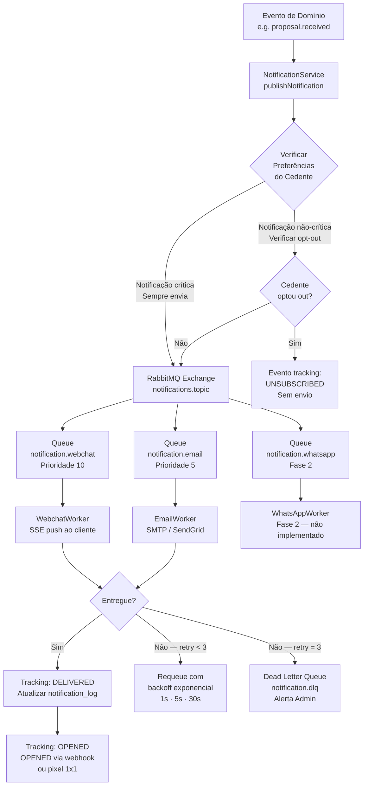

# 21 - Notificações, Templates e Implementação — AI-Dani-Cedente

| Campo | Valor |
|---|---|
| **Nome do Documento** | Notificações, Templates e Implementação — AI-Dani-Cedente |
| **Versão** | v1.0 |
| **Data** | 23/03/2026 |
| **Autor** | Claude Code Desktop |
| **Status** | Rascunho |
| **Bloco** | 4 — Arquitetura |
| **Dependências** | D01, D05.4, D08, D11, D14, D16, D17 |

---

> **📌 TL;DR**
>
> - **Canais suportados (Fase 1):** Webchat (in-app SSE) + E-mail. WhatsApp planejado para Fase 2.
> - **Total de templates:** 12 templates cobrindo todos os 10 eventos de RF-DCE-028 + régua ZapSign + extensão Escrow.
> - **Arquitetura de envio:** event-driven assíncrono via fila RabbitMQ `notification.send`. Nunca síncrono na request principal.
> - **Opt-out:** diferencia notificações críticas (não desativáveis) de não-críticas (opt-out disponível). WhatsApp opt-out em ≤1s.
> - **Tracking:** 6 eventos por notificação — `sent`, `delivered`, `opened`, `clicked`, `failed`, `unsubscribed`.
> - **Compliance LGPD:** dados de notificação retidos por 90 dias. Opt-out processado imediatamente. Nenhum dado PII em payloads de fila.
> - **DLQ + retry:** max 3 tentativas com backoff exponencial. Dead Letter Queue para análise de falhas.

---

## 1. Arquitetura de Notificações

O sistema de notificações da AI-Dani-Cedente opera exclusivamente no modelo event-driven assíncrono. Todo evento de domínio que requer notificação ao Cedente é publicado no RabbitMQ e processado de forma desacoplada do fluxo principal. Isso garante que falhas de entrega não impactem a operação do agente e que picos de volume sejam absorvidos pela fila.



### 1.1 Fluxo Resumido

| Etapa | Responsável | Descrição |
|---|---|---|
| **Trigger** | Módulo de domínio | Evento emitido após ação de negócio (ex: proposta recebida) |
| **NotificationService** | `src/modules/notification/` | Valida preferências, monta payload, publica no exchange |
| **Exchange** | RabbitMQ `notifications.topic` | Roteia por routing key para filas de canal |
| **Worker por canal** | `WebchatWorker`, `EmailWorker` | Consome fila, executa envio, registra tracking |
| **Tracking** | `notification_log` tabela | Persiste estado de cada tentativa de entrega |
| **DLQ** | `notification.dlq` | Mensagens com 3 falhas — análise manual pelo Admin |

### 1.2 Regra Inegociável de Envio Assíncrono

> ⚙️ **Obrigatório:** Todo envio de notificação DEVE ser feito via fila RabbitMQ. É proibido chamar diretamente qualquer serviço de e-mail, SSE push ou WhatsApp dentro do ciclo request-response da API. O `NotificationService.publishNotification()` é o único ponto de entrada para disparar notificações.

---

## 2. Canais

### 2.1 Webchat (In-App SSE)

O canal webchat é o canal primário da Dani-Cedente. Notificações chegam como eventos SSE ao cliente conectado, exibidas como `ProactiveToast` no widget de chat conforme D06 e D07.

| Atributo | Valor |
|---|---|
| **Mecanismo** | Server-Sent Events (SSE) via `GET /api/v1/notifications/stream` |
| **Prioridade na fila** | 10 (mais alta) |
| **Rate limiting** | 30 notificações/hora por `cedente_id` (compartilha limite com chat) |
| **Fallback** | Se Cedente offline → persistir como notificação não lida no banco. Exibir ao reconectar. |
| **Retry** | N/A — SSE é entregue ao conectar. Notificações offline ficam em `notification_log.status = PENDING` |
| **Deep link** | Obrigatório. Todo toast inclui `action_url` para navegar ao contexto. |
| **Expiração** | Notificações não lidas expiram em 7 dias |

**Payload SSE:**
```json
{
  "type": "notification",
  "id": "notif_01HX4K8...",
  "event_type": "NOVA_PROPOSTA",
  "priority": "high",
  "title": "Nova proposta recebida",
  "body": "Você recebeu uma nova proposta de R$ 85.000 para sua oportunidade OPR-2024-001.",
  "action_label": "Ver proposta",
  "action_url": "/oportunidades/opr-2024-001/propostas",
  "created_at": "2026-03-23T14:30:00Z",
  "expires_at": "2026-03-30T14:30:00Z"
}
```

**Evento de tracking SSE:**
```json
{
  "type": "tracking",
  "notification_id": "notif_01HX4K8...",
  "event": "delivered",
  "timestamp": "2026-03-23T14:30:01Z"
}
```

### 2.2 E-mail

Canal secundário. Todos os 10 eventos de RF-DCE-028 têm template de e-mail. Envio via SendGrid (ou SMTP configurado em `EMAIL_PROVIDER` env var).

| Atributo | Valor |
|---|---|
| **Mecanismo** | SMTP / SendGrid SDK |
| **Prioridade na fila** | 5 |
| **Rate limiting** | 10 e-mails/hora por `cedente_id` para evitar spam |
| **Fallback** | Bounce → registrar em `notification_log.status = BOUNCED`, alertar Admin se bounce rate > 5% |
| **Retry** | 3 tentativas: 1s → 5s → 30s. Após 3 falhas: DLQ |
| **Formato** | HTML responsivo + plaintext alternativo |
| **Rastreamento de abertura** | Pixel 1×1 + tracking de clique em links |
| **Unsubscribe** | Link de unsubscribe em todo e-mail não-crítico (One-Click Unsubscribe RFC 8058) |

**Payload de fila (e-mail):**
```json
{
  "notification_id": "notif_01HX4K8...",
  "channel": "email",
  "to": "cedente@email.com",
  "template_id": "NOVA_PROPOSTA_EMAIL",
  "variables": {
    "cedente_nome": "João Silva",
    "proposta_valor": "R$ 85.000",
    "oportunidade_id": "OPR-2024-001",
    "action_url": "https://app.repasseseguro.com/oportunidades/opr-2024-001/propostas"
  },
  "priority": "high",
  "retry_count": 0,
  "created_at": "2026-03-23T14:30:00Z"
}
```

> 🔴 **LGPD — E-mail:** O endereço de e-mail do Cedente NÃO deve ser incluído no payload da fila de notificação. Ele deve ser resolvido pelo `EmailWorker` no momento do envio via `cedente_id → CedenteProfile.email`. Isso evita que dados PII trafeguem no RabbitMQ.

### 2.3 WhatsApp (Fase 2 — Planejado)

| Atributo | Valor |
|---|---|
| **Status** | Não implementado — Fase 2 |
| **Mecanismo** | Canal de saída apenas. Cedente responde via webchat através de link na mensagem. |
| **Opt-out** | Via "PARAR" ou configurações de perfil. Processado em ≤1 segundo. |
| **Regras** | Definidas em RN-DCE-WhatsApp (Fase 2 — pendente de especificação) |
| **Worker** | `WhatsAppWorker` — registrado mas não ativo em Fase 1 |

### 2.4 Push Nativo Mobile (Fase 2 — Planejado)

| Atributo | Valor |
|---|---|
| **Status** | Não implementado — Fase 2 (junto com React Native, D11) |
| **Mecanismo** | APNs (iOS) + FCM (Android) via Expo Notifications SDK |
| **Deep link** | Obrigatório — navegar à tela de contexto (proposta, escrow, dossiê) |
| **Payload** | `{ title, body, data: { screen, params } }` |

---

## 3. Templates

Inventário completo de templates. Todos os templates são definidos em `src/modules/notification/templates/` — nunca hardcoded em lógica de negócio.

| # | Nome do Template | Evento Gatilho | Canais | Variáveis | Prioridade | Pode Desativar? |
|---|---|---|---|---|---|---|
| T-NTF-001 | `NOVA_PROPOSTA` | `proposal.received` | Webchat + E-mail | `cedente_nome`, `proposta_valor`, `oportunidade_id`, `action_url` | **high** | Não (crítico) |
| T-NTF-002 | `PROPOSTA_VENCENDO` | `proposal.expiring_24h` | Webchat + E-mail | `cedente_nome`, `proposta_valor`, `horas_restantes`, `action_url` | **high** | Não (crítico) |
| T-NTF-003 | `EXTENSAO_ESCROW_SOLICITADA` | `escrow.extension_requested` | Webchat + E-mail | `cedente_nome`, `dias_extensao`, `prazo_resposta`, `action_url` | **critical** | Não |
| T-NTF-004 | `DEPOSITO_ESCROW_CONFIRMADO` | `escrow.deposit_confirmed` | Webchat + E-mail | `cedente_nome`, `oportunidade_id`, `action_url` | **high** | Não (crítico) |
| T-NTF-005 | `ESCROW_VENCENDO` | `escrow.expiring_2d` | Webchat + E-mail | `cedente_nome`, `dias_restantes`, `prazo_vencimento`, `action_url` | **critical** | Não |
| T-NTF-006 | `ZAPSIGN_ENVIADO` | `zapsign.contract_sent` | Webchat + E-mail | `cedente_nome`, `prazo_assinatura`, `link_assinatura`, `action_url` | **high** | Não (crítico) |
| T-NTF-007 | `ZAPSIGN_LEMBRETE_D2` | `zapsign.reminder_d2` | Webchat + E-mail | `cedente_nome`, `data_vencimento`, `link_assinatura`, `action_url` | **high** | Não (crítico) |
| T-NTF-008 | `ZAPSIGN_LEMBRETE_D4_URGENTE` | `zapsign.reminder_d4` | Webchat + E-mail | `cedente_nome`, `data_vencimento`, `link_assinatura`, `action_url` | **critical** | Não |
| T-NTF-009 | `DOCUMENTO_DOSSIE_REJEITADO` | `dossier.document_rejected` | Webchat + E-mail | `cedente_nome`, `documento_nome`, `motivo_rejeicao`, `action_url` | **high** | Sim (preferência) |
| T-NTF-010 | `OPORTUNIDADE_PUBLICADA` | `opportunity.published` | Webchat + E-mail | `cedente_nome`, `oportunidade_id`, `action_url` | **normal** | Sim (preferência) |
| T-NTF-011 | `NEGOCIACAO_CONCLUIDA` | `escrow.released` | Webchat + E-mail | `cedente_nome`, `valor_liberado`, `oportunidade_id`, `action_url` | **high** | Não (crítico) |
| T-NTF-012 | `EXTENSAO_ESCROW_APROVADA_AUTO` | `escrow.extension_auto_approved` | Webchat + E-mail | `cedente_nome`, `novo_prazo`, `action_url` | **normal** | Não (crítico) |

### 3.1 Exemplos de Template

**T-NTF-001 — Webchat (SSE Toast):**
```
Título: "Nova proposta recebida"
Corpo: "Você recebeu uma nova proposta de {{proposta_valor}} para sua oportunidade {{oportunidade_id}}. Quer que eu analise?"
CTA: "Ver proposta" → {{action_url}}
```

**T-NTF-001 — E-mail (HTML resumido):**
```
Assunto: "[Repasse Seguro] Nova proposta para {{oportunidade_id}}"
Corpo:
  Olá, {{cedente_nome}}!

  Você recebeu uma nova proposta de {{proposta_valor}} para sua oportunidade {{oportunidade_id}}.

  A Dani está pronta para analisar os detalhes com você.

  [Ver proposta] → {{action_url}}

  ——
  Para deixar de receber e-mails de atualizações de proposta, clique aqui: {{unsubscribe_url}}
```

**T-NTF-005 — E-mail (crítico — sem unsubscribe):**
```
Assunto: "[URGENTE] Prazo do Escrow vence em {{dias_restantes}} dias"
Corpo:
  Olá, {{cedente_nome}}!

  O prazo para o depósito em Escrow da sua negociação vence em {{dias_restantes}} dias úteis ({{prazo_vencimento}}).

  Se o depósito não for realizado até esta data, a proposta será cancelada automaticamente e sua oportunidade voltará ao marketplace.

  [Ver detalhes do Escrow] → {{action_url}}

  Esta é uma notificação crítica do processo de negociação — não pode ser desativada.
```

### 3.2 Regra de Carregamento de Templates

> ⚙️ **Obrigatório:** Templates são carregados em runtime do banco de dados ou de arquivos `.hbs` (Handlebars) em `src/modules/notification/templates/`. O `NotificationService` NÃO pode conter strings de template hardcoded. O ID do template é passado no payload da fila, e o worker resolve o template antes do envio.

---

## 4. Preferências do Usuário (Opt-out)

### 4.1 Modelo de Preferências

Cada Cedente possui um registro `notification_preferences` que controla quais notificações recebe por canal. Notificações críticas não podem ser desativadas.

**Schema de preferências:**
```typescript
interface NotificationPreferences {
  cedente_id: string;           // UUID — chave primária
  email_enabled: boolean;       // E-mail global on/off
  webchat_enabled: boolean;     // In-app global on/off
  whatsapp_enabled: boolean;    // Fase 2

  // Preferências por tipo (granular)
  preferences: {
    NOVA_PROPOSTA: { email: boolean; webchat: boolean };         // Critical — ignorado (sempre true)
    PROPOSTA_VENCENDO: { email: boolean; webchat: boolean };     // Critical — ignorado
    EXTENSAO_ESCROW_SOLICITADA: { email: boolean; webchat: boolean }; // Critical — ignorado
    DEPOSITO_ESCROW_CONFIRMADO: { email: boolean; webchat: boolean }; // Critical — ignorado
    ESCROW_VENCENDO: { email: boolean; webchat: boolean };        // Critical — ignorado
    ZAPSIGN_ENVIADO: { email: boolean; webchat: boolean };        // Critical — ignorado
    ZAPSIGN_LEMBRETE_D2: { email: boolean; webchat: boolean };    // Critical — ignorado
    ZAPSIGN_LEMBRETE_D4_URGENTE: { email: boolean; webchat: boolean }; // Critical — ignorado
    NEGOCIACAO_CONCLUIDA: { email: boolean; webchat: boolean };   // Critical — ignorado
    EXTENSAO_ESCROW_APROVADA_AUTO: { email: boolean; webchat: boolean }; // Critical — ignorado
    DOCUMENTO_DOSSIE_REJEITADO: { email: boolean; webchat: boolean }; // Configurável
    OPORTUNIDADE_PUBLICADA: { email: boolean; webchat: boolean }; // Configurável
  };

  updated_at: string; // ISO 8601
}
```

### 4.2 Regra de Notificações Críticas

> 🔴 **Regra inegociável:** Os seguintes tipos de notificação são **críticos** e NÃO podem ser desativados pelo Cedente, independentemente das preferências configuradas:
>
> `NOVA_PROPOSTA`, `PROPOSTA_VENCENDO`, `EXTENSAO_ESCROW_SOLICITADA`, `DEPOSITO_ESCROW_CONFIRMADO`, `ESCROW_VENCENDO`, `ZAPSIGN_ENVIADO`, `ZAPSIGN_LEMBRETE_D2`, `ZAPSIGN_LEMBRETE_D4_URGENTE`, `NEGOCIACAO_CONCLUIDA`, `EXTENSAO_ESCROW_APROVADA_AUTO`
>
> Justificativa: todas envolvem prazos financeiros e jurídicos com consequências irreversíveis para o Cedente (perda de proposta, cancelamento de negociação, expiração de contrato).

### 4.3 API de Preferências

```
GET    /api/v1/notifications/preferences        → Retorna preferências do Cedente autenticado
PATCH  /api/v1/notifications/preferences        → Atualiza preferências (apenas tipos configuráveis)
POST   /api/v1/notifications/unsubscribe        → One-click unsubscribe via token no e-mail
```

**Exemplo PATCH:**
```json
// PATCH /api/v1/notifications/preferences
{
  "preferences": {
    "DOCUMENTO_DOSSIE_REJEITADO": { "email": false, "webchat": true },
    "OPORTUNIDADE_PUBLICADA": { "email": false, "webchat": false }
  }
}
```

**Resposta:**
```json
{
  "data": {
    "updated": ["DOCUMENTO_DOSSIE_REJEITADO", "OPORTUNIDADE_PUBLICADA"],
    "ignored_critical": [],
    "updated_at": "2026-03-23T15:00:00Z"
  }
}
```

Se o Cedente tentar desativar uma notificação crítica:
```json
{
  "data": {
    "updated": [],
    "ignored_critical": ["NOVA_PROPOSTA"],
    "message": "Notificações críticas não podem ser desativadas pois envolvem prazos financeiros da sua negociação.",
    "updated_at": "2026-03-23T15:00:00Z"
  }
}
```

---

## 5. Fila e Processamento

### 5.1 Configuração RabbitMQ

| Recurso | Nome | Tipo | Parâmetros |
|---|---|---|---|
| Exchange | `notifications.topic` | Topic | durable: true, auto-delete: false |
| Fila Webchat | `notification.webchat` | Classic | durable: true, priority: 10, x-max-priority: 10 |
| Fila E-mail | `notification.email` | Classic | durable: true, priority: 5 |
| Fila WhatsApp | `notification.whatsapp` | Classic | durable: true — Fase 2 |
| Dead Letter Exchange | `notifications.dlx` | Direct | durable: true |
| Dead Letter Queue | `notification.dlq` | Classic | durable: true |

**Routing keys:**
| Routing Key | Destino |
|---|---|
| `notification.webchat.*` | `notification.webchat` |
| `notification.email.*` | `notification.email` |
| `notification.whatsapp.*` | `notification.whatsapp` |

### 5.2 Retry Policy

```typescript
const RETRY_POLICY = {
  maxRetries: 3,
  backoff: [1_000, 5_000, 30_000], // ms — 1s, 5s, 30s
  deadLetterExchange: 'notifications.dlx',
  deadLetterRoutingKey: 'notification.failed',
};
```

**Fluxo de retry:**
1. Worker consome mensagem da fila.
2. Tentativa falha → incrementa `x-retry-count` no header da mensagem.
3. Se `x-retry-count < 3` → republica com delay (via `x-delay` ou TTL de fila temporária).
4. Se `x-retry-count >= 3` → roteia para `notification.dlq` + registra `notification_log.status = FAILED`.
5. Alert: se DLQ acumular > 10 mensagens em 1 hora → alerta Admin via Sentry/Slack.

### 5.3 Rate Limiting por Canal

| Canal | Limite | Janela | Estratégia |
|---|---|---|---|
| Webchat | 30 notificações/hora | 1 hora | Sliding window Redis `dani:notif_rate:{cedente_id}:webchat` |
| E-mail | 10 e-mails/hora | 1 hora | Sliding window Redis `dani:notif_rate:{cedente_id}:email` |
| WhatsApp | 5 mensagens/dia | 24 horas | Fase 2 — a definir |

> ⚙️ **Exceção crítica:** Notificações com prioridade `critical` (T-NTF-003, T-NTF-005, T-NTF-008) ignoram o rate limit para garantir entrega de prazos urgentes.

### 5.4 Schema da Tabela `notification_log`

```sql
CREATE TABLE notification_log (
  id              UUID PRIMARY KEY DEFAULT gen_random_uuid(),
  cedente_id      UUID NOT NULL REFERENCES cedente_profiles(id),
  notification_id VARCHAR(50) NOT NULL UNIQUE,  -- ID gerado pelo NotificationService
  event_type      VARCHAR(60) NOT NULL,          -- e.g. NOVA_PROPOSTA
  channel         VARCHAR(20) NOT NULL,          -- webchat | email | whatsapp
  template_id     VARCHAR(60) NOT NULL,
  status          VARCHAR(20) NOT NULL DEFAULT 'PENDING',
  -- PENDING | SENT | DELIVERED | OPENED | CLICKED | FAILED | BOUNCED | UNSUBSCRIBED
  retry_count     SMALLINT NOT NULL DEFAULT 0,
  sent_at         TIMESTAMPTZ,
  delivered_at    TIMESTAMPTZ,
  opened_at       TIMESTAMPTZ,
  clicked_at      TIMESTAMPTZ,
  failed_at       TIMESTAMPTZ,
  failure_reason  TEXT,
  created_at      TIMESTAMPTZ NOT NULL DEFAULT NOW()
);

-- Índices
CREATE INDEX idx_notification_log_cedente ON notification_log(cedente_id, created_at DESC);
CREATE INDEX idx_notification_log_status  ON notification_log(status, created_at DESC);
```

---

## 6. Tracking e Métricas

### 6.1 Eventos de Tracking

| Evento | Quando | Como Capturar |
|---|---|---|
| `sent` | Mensagem entregue ao provedor (SendGrid / SSE) | Callback do SDK após envio bem-sucedido |
| `delivered` | Confirmação de entrega ao destinatário | Webhook SendGrid `delivery` / SSE `delivered` event |
| `opened` | E-mail aberto / Toast exibido em tela | Pixel 1×1 em e-mail / evento SSE `displayed` |
| `clicked` | CTA clicado | Link com parâmetro UTM `?notif_id=...` rastreado na API |
| `failed` | Falha de entrega após retries | Worker registra após 3 tentativas |
| `unsubscribed` | Cedente optou out | One-click unsubscribe ou PATCH preferences |

### 6.2 Schema de Evento de Tracking

```typescript
interface NotificationTrackingEvent {
  notification_id: string;        // Referência ao notification_log
  cedente_id: string;             // Para validação de autorização
  event: 'sent' | 'delivered' | 'opened' | 'clicked' | 'failed' | 'unsubscribed';
  channel: 'webchat' | 'email' | 'whatsapp';
  timestamp: string;              // ISO 8601
  metadata?: {
    click_url?: string;           // URL clicada (sem PII)
    failure_reason?: string;      // Motivo de falha
    ip_hash?: string;             // Hash do IP — nunca IP raw (LGPD)
  };
}
```

### 6.3 Dashboard Mínimo de Métricas por Canal

| Métrica | Descrição | Alerta |
|---|---|---|
| **Taxa de entrega** | `delivered / sent` por canal | < 95% em 1h → alerta Admin |
| **Taxa de abertura (e-mail)** | `opened / delivered` | < 20% em 24h → revisar templates |
| **Taxa de clique** | `clicked / delivered` | Informativa |
| **Taxa de falha** | `failed / sent` | > 5% em 1h → alerta imediato |
| **DLQ size** | Mensagens na dead letter queue | > 10 em 1h → alerta crítico |
| **Bounce rate (e-mail)** | Bounces / e-mails enviados | > 5% → pausar envios + investigar |
| **Taxa de opt-out** | Unsubscribes / enviados | > 2% em 24h → revisar frequência |

**Consulta de métricas:**
```
GET /api/v1/admin/notifications/metrics?channel=email&from=2026-03-23&to=2026-03-23
```

---

## 7. Testes

### 7.1 Sandbox e Interceptors

**Modo de teste local:**

```typescript
// Variável de ambiente
NOTIFICATION_MODE=sandbox  // sandbox | production

// No NotificationService:
if (process.env.NOTIFICATION_MODE === 'sandbox') {
  // Não envia e-mail real — registra em notification_log com status SANDBOX
  // SSE ainda funciona normalmente para testes de UI
  logger.info('[SANDBOX] Notificação interceptada', { template_id, cedente_id });
  return;
}
```

**Preview de templates:**
```
GET /api/v1/admin/notifications/preview?template=NOVA_PROPOSTA&channel=email
```
Retorna HTML renderizado com variáveis de exemplo preenchidas.

### 7.2 Cenários de Teste por Canal

| Cenário | Canal | Resultado Esperado |
|---|---|---|
| `proposal.received` disparado | Webchat + E-mail | Toast exibido em ≤2s + e-mail entregue |
| Cedente offline ao receber notificação | Webchat | Status `PENDING` no banco; exibido ao reconectar |
| Cedente com opt-out em `OPORTUNIDADE_PUBLICADA` | E-mail | Tracking `UNSUBSCRIBED` — e-mail não enviado |
| Tentativa de opt-out em `NOVA_PROPOSTA` (crítico) | API | 200 OK com `ignored_critical: ["NOVA_PROPOSTA"]` |
| 3 falhas consecutivas de e-mail | E-mail | Mensagem na DLQ + `notification_log.status = FAILED` |
| Rate limit de 10 e-mails/hora atingido | E-mail | 11º e-mail não-crítico bloqueado; crítico passa |
| One-click unsubscribe via link | E-mail | `notification_log.status = UNSUBSCRIBED` em ≤1s |
| Preview de template | Admin API | HTML renderizado com variáveis de exemplo |

### 7.3 Testes de Integração — Exemplo

```typescript
describe('NotificationService', () => {
  it('deve publicar notificação crítica mesmo com opt-out global ativo', async () => {
    // Cedente com email_enabled: false
    await cedentePrefs.update({ email_enabled: false });

    await notificationService.publishNotification({
      cedente_id: TEST_CEDENTE_ID,
      event_type: 'NOVA_PROPOSTA',
      variables: { proposta_valor: 'R$ 50.000', ... }
    });

    // Notificação crítica DEVE ser enfileirada
    const queued = await rabbitmq.getQueueSize('notification.email');
    expect(queued).toBe(1);
  });

  it('não deve enfileirar notificação não-crítica com opt-out ativo', async () => {
    await cedentePrefs.update({
      preferences: { OPORTUNIDADE_PUBLICADA: { email: false, webchat: false } }
    });

    await notificationService.publishNotification({
      cedente_id: TEST_CEDENTE_ID,
      event_type: 'OPORTUNIDADE_PUBLICADA',
      variables: { oportunidade_id: 'OPR-001', ... }
    });

    const log = await notificationLog.findLatest(TEST_CEDENTE_ID);
    expect(log.status).toBe('UNSUBSCRIBED');
    const queued = await rabbitmq.getQueueSize('notification.email');
    expect(queued).toBe(0);
  });
});
```

---

## 8. LGPD e Compliance

| Requisito | Implementação |
|---|---|
| **Dados PII em fila** | Proibido. E-mail do Cedente nunca trafega no payload RabbitMQ — resolvido em runtime pelo worker via `cedente_id` |
| **Retenção de dados** | `notification_log` retido por 90 dias. Após isso, purge automático via job scheduled |
| **Opt-out WhatsApp** | Processado em ≤1 segundo após solicitação (RF-DCE-028). Registro imediato em `notification_preferences` |
| **One-click Unsubscribe** | Implementado conforme RFC 8058. Token de unsubscribe com TTL 72h, uso único |
| **Direito de acesso** | `GET /api/v1/notifications/preferences` retorna todas as preferências do Cedente |
| **Direito de exclusão** | Soft delete + anonimização de `notification_log` ao deletar conta do Cedente |
| **Logs de auditoria** | Todo opt-out e opt-in registrado com timestamp e origem (API / e-mail / perfil) |

> 🔴 **Notificações críticas e LGPD:** Mesmo quando a LGPD garante o direito de opt-out, notificações críticas vinculadas a obrigações contratuais e financeiras (prazos de Escrow, ZapSign) podem ser mantidas com base no **legítimo interesse** e na necessidade de execução de contrato. Isso deve ser documentado nos Termos de Uso da plataforma. [DEFINIÇÃO PENDENTE — Jurídico deve confirmar base legal para manutenção de notificações críticas]

---

## 9. Anti-Exemplos

### ❌ Anti-exemplo 1 — Template hardcoded no código

```typescript
// ❌ ERRADO — template hardcoded no service
async notifyNovaProposta(cedente_id: string, valor: number) {
  await this.emailService.send({
    to: cedente.email,
    subject: `Nova proposta de R$ ${valor}`,
    body: `<p>Você recebeu uma proposta de R$ ${valor}.</p>` // ← PROIBIDO
  });
}
```

```typescript
// ✅ CORRETO — template resolvido por ID
async notifyNovaProposta(cedente_id: string, valor: number) {
  await this.notificationService.publishNotification({
    cedente_id,
    event_type: 'NOVA_PROPOSTA',
    variables: { proposta_valor: formatCurrency(valor), ... }
  });
  // O EmailWorker resolve T-NTF-001 do banco/arquivo em runtime
}
```

### ❌ Anti-exemplo 2 — Push sem deep link contextual

```typescript
// ❌ ERRADO — notificação sem contexto
await pushService.send({
  token: deviceToken,
  title: 'Nova proposta!',
  body: 'Você tem uma nova proposta.'
  // ← Sem data, sem deep link — usuário não sabe onde ir
});
```

```typescript
// ✅ CORRETO — deep link contextual obrigatório
await pushService.send({
  token: deviceToken,
  title: 'Nova proposta recebida',
  body: `Proposta de R$ 85.000 para OPR-2024-001`,
  data: {
    screen: 'ProposalDetail',
    params: { oportunidade_id: 'OPR-2024-001', proposta_id: 'PRP-001' }
  }
});
```

### ❌ Anti-exemplo 3 — Envio síncrono na request principal

```typescript
// ❌ ERRADO — envio síncrono bloqueia a response
@Post('/propostas/:id/aceitar')
async aceitarProposta(@Param('id') id: string) {
  await this.propostaService.aceitar(id);
  await this.emailService.sendEmail('PROPOSTA_ACEITA', cedente); // ← BLOQUEIA AQUI
  return { success: true };
}
```

```typescript
// ✅ CORRETO — publicar evento na fila, nunca bloquear
@Post('/propostas/:id/aceitar')
async aceitarProposta(@Param('id') id: string) {
  await this.propostaService.aceitar(id);
  // Publica assincronamente — não aguarda entrega
  this.notificationService.publishNotification({
    cedente_id: request.user.cedenteId,
    event_type: 'DEPOSITO_ESCROW_CONFIRMADO',
    variables: { ... }
  }).catch(err => logger.error('Falha ao enfileirar notificação', { err }));
  return { success: true };
}
```

### ❌ Anti-exemplo 4 — Ausência de opt-out em notificação configurável

```typescript
// ❌ ERRADO — e-mail sem unsubscribe para notificação não-crítica
const emailHtml = `
  <p>Sua oportunidade foi publicada no marketplace!</p>
  <!-- Sem link de unsubscribe — viola LGPD e RFC 8058 -->
`;
```

```typescript
// ✅ CORRETO — unsubscribe obrigatório em não-críticas
const emailHtml = `
  <p>Sua oportunidade foi publicada no marketplace!</p>
  <hr />
  <small>
    Para deixar de receber este tipo de notificação:
    <a href="{{unsubscribe_url}}">clique aqui</a>
  </small>
`;
// unsubscribe_url é gerado pelo NotificationService com token único TTL 72h
```

---

## 10. Glossário

| Termo | Definição |
|---|---|
| **Canal crítico** | Tipo de notificação que não pode ser desativado pelo Cedente (envolve prazos financeiros/jurídicos) |
| **DLQ** | Dead Letter Queue — fila de mensagens que falharam após todos os retries |
| **Event-driven** | Arquitetura onde notificações são disparadas por eventos de domínio, não por chamadas diretas |
| **One-click Unsubscribe** | Mecanismo RFC 8058 para cancelamento de e-mail com um único clique, sem confirmação adicional |
| **Pixel 1×1** | Imagem transparente de 1px×1px embutida em e-mail HTML para rastrear abertura |
| **ProactiveToast** | Componente de UI (D06/D07) que exibe notificação proativa no widget de chat |
| **Routing key** | Chave de roteamento RabbitMQ que direciona mensagens para a fila correta |
| **SSE** | Server-Sent Events — protocolo HTTP unidirecional para push de eventos do servidor ao cliente |
| **Template ID** | Identificador único de template (ex: `T-NTF-001`) resolvido em runtime pelo worker |
| **Tracking event** | Registro do ciclo de vida de uma notificação (`sent`, `delivered`, `opened`, `clicked`, `failed`) |

---

## 11. Backlog de Pendências

| # | Item | Tipo | Prioridade |
|---|---|---|---|
| P-NTF-001 | Confirmar base legal LGPD para notificações críticas (legítimo interesse vs. execução de contrato) | [DEFINIÇÃO PENDENTE] | Alta |
| P-NTF-002 | Definir provedor de e-mail: SendGrid vs. AWS SES (variável `EMAIL_PROVIDER`) | [DECISÃO AUTÔNOMA: SendGrid] — confirmar antes do Go-Live | Média |
| P-NTF-003 | Especificar RN-DCE-WhatsApp para Fase 2 (vinculação de número, OTP, régua de mensagens) | [SEÇÃO PENDENTE] | Baixa (Fase 2) |
| P-NTF-004 | Definir ferramenta de dashboard de métricas: Grafana + PostgreSQL vs. PostHog Events | [DECISÃO AUTÔNOMA: PostHog Events] por consistência com stack D02 | Média |
| P-NTF-005 | Push nativo mobile (APNs/FCM) — requisitos de token e permissão de notificação | [SEÇÃO PENDENTE] | Baixa (Fase 2) |

---

## 12. Changelog

| Data | Versão | Descrição |
|---|---|---|
| 23/03/2026 | v1.0 | Versão inicial — 4 canais documentados (2 ativos Fase 1), 12 templates cobrindo 10 eventos RF-DCE-028 + régua ZapSign. Arquitetura event-driven via RabbitMQ. Retry policy 3x com backoff exponencial. Opt-out diferenciado (crítico vs. configurável). 6 eventos de tracking. |
