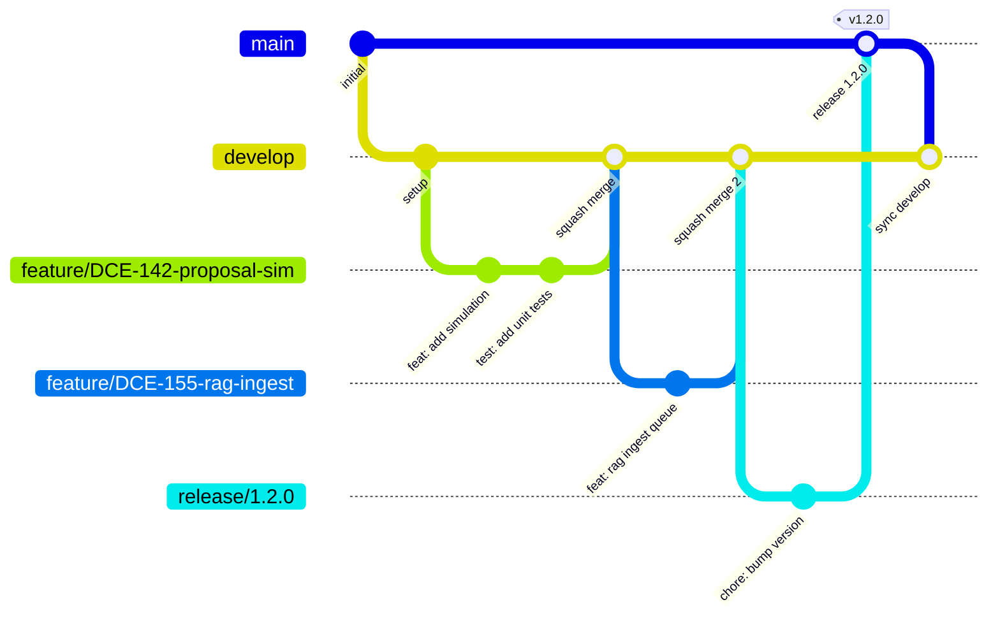

# 23 - Guia de Contribuição — AI-Dani-Cedente

| Campo | Valor |
|---|---|
| **Nome do Documento** | Guia de Contribuição — AI-Dani-Cedente |
| **Versão** | v1.0 |
| **Data** | 23/03/2026 |
| **Autor** | Claude Code Desktop |
| **Status** | Rascunho |
| **Bloco** | 5 — Ambiente e Processo |
| **Dependências** | D02, D22 |

---

> **📌 TL;DR**
>
> - **Branching:** trunk-based com branches de curta duração. Branches protegidas: `main` (produção) e `develop` (staging).
> - **Commits:** Conventional Commits obrigatório. Mínimo 8 tipos permitidos. Mensagens genéricas são rejeitadas por hook.
> - **PR:** template obrigatório, máx 400 linhas, mínimo 1 aprovação (2 para mudanças em módulos críticos: agent, auth, fallback).
> - **Merge:** Squash merge obrigatório para feature/bugfix. Merge commit apenas para releases.
> - **Hotfix:** fluxo acelerado direto de `main`, 1 aprovação, deploy imediato via pipeline acelerado.
> - **CI gates:** lint + type-check + testes + build DEVEM passar antes de qualquer merge.
> - Todo PR de módulo crítico (agent, auth, escrow) exige revisão de segurança no checklist.

---

## 1. Branching Strategy

O serviço AI-Dani-Cedente adota **trunk-based development** com branches de curta duração (máx 3 dias). O objetivo é manter o trunk (`develop`) sempre integrável e `main` sempre deployável.

### 1.1 Branches Protegidas

| Branch | Propósito | Proteção |
|---|---|---|
| `main` | Código em produção | Push direto proibido. Merge apenas via PR com ≥1 aprovação + CI verde + tag de release |
| `develop` | Código de integração / staging | Push direto proibido. Merge apenas via PR com ≥1 aprovação + CI verde |

> 🔴 **Proibido:** Nunca fazer push direto em `main` ou `develop`. Toda mudança passa por PR — sem exceções. Hotfixes também seguem PR (fluxo acelerado).

### 1.2 Nomenclatura de Branches

| Tipo | Formato | Exemplo |
|---|---|---|
| Feature | `feature/<ticket>-<descricao-curta>` | `feature/DCE-142-add-proposal-simulation` |
| Bugfix | `bugfix/<ticket>-<descricao-curta>` | `bugfix/DCE-198-fix-escrow-state-transition` |
| Hotfix | `hotfix/<ticket>-<descricao-curta>` | `hotfix/DCE-211-fix-circuit-breaker-threshold` |
| Chore | `chore/<descricao-curta>` | `chore/update-dependencies-march` |
| Release | `release/<versao>` | `release/1.3.0` |

**Regras:**
- Use kebab-case. Nunca espaços, underscores ou caracteres especiais.
- Inclua o ID do ticket quando existir.
- Descrição máxima de 40 caracteres.
- Delete a branch após o merge.

### 1.3 Diagrama de Fluxo



---

## 2. Convenção de Commits

O projeto segue **Conventional Commits v1.0** ([conventionalcommits.org](https://www.conventionalcommits.org)). O formato é validado por `commitlint` como hook pre-commit.

### 2.1 Formato

```
<tipo>(<escopo>): <descrição curta em imperativo>

[corpo opcional — contexto, motivo da mudança]

[rodapé opcional — BREAKING CHANGE, closes #ticket]
```

### 2.2 Tipos Permitidos

| Tipo | Quando Usar | Exemplo |
|---|---|---|
| `feat` | Nova funcionalidade | `feat(chat): add streaming response via SSE` |
| `fix` | Correção de bug | `fix(agent): resolve infinite loop in state machine` |
| `docs` | Documentação apenas | `docs(readme): add setup instructions` |
| `style` | Formatação, sem mudança de lógica | `style(chat): fix indentation in message handler` |
| `refactor` | Refatoração sem fix ou feat | `refactor(auth): extract JWT validation to helper` |
| `test` | Adição ou correção de testes | `test(proposal): add integration test for acceptance flow` |
| `chore` | Tarefas de build, deps, CI | `chore(deps): upgrade langchain to 0.3.5` |
| `ci` | Mudanças em pipelines CI/CD | `ci: add security scan to PR pipeline` |
| `perf` | Melhoria de performance | `perf(rag): optimize pgvector index parameters` |

### 2.3 Escopos Definidos

Escopos devem refletir os módulos de `src/modules/`:

`chat` | `agent` | `auth` | `rag` | `opportunity` | `proposal` | `dossier` | `escrow` | `notification` | `simulation` | `fallback` | `admin` | `infra` | `deps` | `ci`

### 2.4 Tabela Comparativa — Bons e Ruins

| ❌ Ruim | ✅ Bom |
|---|---|
| `fix stuff` | `fix(agent): prevent tool from using LLM-injected cedente_id` |
| `update` | `feat(escrow): add 2-day expiry alert notification` |
| `changes` | `refactor(auth): extract PII masking to dedicated middleware` |
| `wip` | `feat(rag): implement async ingest queue via RabbitMQ` |
| `fix bug in chat` | `fix(chat): resolve race condition in SSE connection handler` |
| `feat: add stuff to the agent module that handles proposals` | `feat(agent): add get-proposal tool with timeout and retry` |

### 2.5 Breaking Changes

```
feat(api)!: change pagination response format

BREAKING CHANGE: Response object `items` renamed to `data`.
Clients must update their response parsing.

Closes #DCE-200
```

---

## 3. Pull Request Flow

### 3.1 Quando Abrir um PR

- Branch com mudança concluída e testada localmente.
- CI local passou: `pnpm lint && pnpm type-check && pnpm test`.
- Não abrir PR de trabalho em progresso sem prefixo `[WIP]` no título.

### 3.2 Template de PR

```markdown
## Descrição
<!-- O que foi mudado e por quê? Qual problema resolve? -->

## Tipo de mudança
- [ ] Nova funcionalidade (feat)
- [ ] Correção de bug (fix)
- [ ] Refatoração (refactor)
- [ ] Documentação (docs)
- [ ] Chore / infra (chore, ci)

## Módulos afetados
<!-- Ex: agent, auth, notification -->

## Checklist
- [ ] Lint e type-check passando (`pnpm lint && pnpm type-check`)
- [ ] Testes escritos e passando (`pnpm test`)
- [ ] Sem `console.log` ou código de debug no PR
- [ ] Sem PII em logs (verificar campos de logger adicionados)
- [ ] Sem credenciais hardcoded
- [ ] Sem `any` em TypeScript (exceto com comentário justificado)
- [ ] Documentação atualizada se houver mudança de interface pública
- [ ] Para módulos críticos (agent, auth, escrow): revisão de segurança realizada

## Módulo crítico? (agent / auth / escrow / fallback)
- [ ] Não é módulo crítico
- [ ] É módulo crítico — revisor adicional notificado

## Como testar
<!-- Passos para reproduzir ou testar a mudança -->

## Screenshots / SSE output (se aplicável)

## Referências
<!-- Closes #DCE-XXX, link para doc de spec -->
```

### 3.3 Tamanho de PR

| Tamanho | Linhas alteradas | Aprovações necessárias | Observação |
|---|---|---|---|
| Pequeno | ≤ 150 linhas | 1 | Preferido |
| Médio | 151–400 linhas | 1 | Aceitável |
| Grande | > 400 linhas | 2 | Justificar no PR — dividir se possível |
| Módulo crítico | Qualquer tamanho | 2 | Sempre 2 aprovações |

> ⚙️ **Regra:** PRs com > 400 linhas sem justificativa no template são recusados no review sem serem lidos. Divida em PRs menores com dependência explícita.

### 3.4 SLA de Review

| Prioridade | SLA | Quando |
|---|---|---|
| Normal | 24h úteis | Features, refatorações, docs |
| Urgente | 4h | Marcado com label `priority:urgent` |
| Hotfix | 1h | Branch `hotfix/*` — ver seção 6 |

### 3.5 Labels de PR

| Label | Significado |
|---|---|
| `priority:urgent` | Review em 4h |
| `type:feature` | Nova funcionalidade |
| `type:bugfix` | Correção de bug |
| `type:hotfix` | Hotfix de produção |
| `module:critical` | Módulo crítico — 2 aprovações |
| `needs:security-review` | Revisão de segurança obrigatória |
| `blocked` | Aguardando dependência externa |

---

## 4. Code Review Guidelines

### 4.1 O que Verificar

| Categoria | Critérios |
|---|---|
| **Funcionalidade** | O código faz o que o PR descreve? Casos de borda tratados? |
| **Testes** | Há testes para o caminho feliz e cenários de erro? Cobertura dos módulos críticos? |
| **Segurança** | PII em logs? `cedenteId` injetado do contexto (nunca do LLM)? JWT validado corretamente? |
| **Legibilidade** | Nomes de variáveis/funções claros? Lógica complexa tem comentário? |
| **Performance** | Queries N+1? Chamadas síncronas onde deveria ser assíncrono? Cache utilizado? |
| **Padrões** | Segue convenções do projeto (error handling, logger, response format)? |

### 4.2 Como Dar Feedback

Use os prefixos para indicar urgência do comentário:

| Prefixo | Significado |
|---|---|
| `[blocking]` | Deve ser corrigido antes do merge — impede aprovação |
| `[suggest]` | Sugestão de melhoria — não impede aprovação |
| `[question]` | Dúvida de entendimento — resposta esperada mas não bloqueia |
| `[nit]` | Detalhe menor de estilo — autor decide |

**Exemplo de comentário útil:**
```
[blocking] O cedenteId está sendo extraído de req.body.cedenteId nas linhas 45-47.
Isso é uma vulnerabilidade crítica — permite que qualquer Cedente informe um ID
diferente do seu JWT. Deve ser extraído exclusivamente do AsyncLocalStorage via
CedenteIsolationMiddleware (ver D18, seção 3.2).
```

### 4.3 O que Bloqueia vs. O que é Sugestão

| Bloqueia Merge | Sugestão / Nit |
|---|---|
| Bug de segurança (PII, cedenteId, JWT) | Nomes de variável mais descritivos |
| Sem testes para código novo em módulo crítico | Extração de helper que não afeta comportamento |
| `any` em TypeScript sem justificativa | Ordem de imports |
| `console.log` esquecido | Comentário adicional explicativo |
| Credencial hardcoded | Uso de `const` vs `let` |
| Quebra de contrato de API sem documentação | Variante de nomenclatura de classe |

---

## 5. Merge Strategy

### 5.1 Regras por Tipo de Branch

| Branch de origem | Destino | Estratégia | Quem faz merge |
|---|---|---|---|
| `feature/*` → `develop` | Squash merge | 1 mensagem de commit consolidado | Autor do PR após aprovação |
| `bugfix/*` → `develop` | Squash merge | 1 mensagem de commit consolidado | Autor do PR após aprovação |
| `hotfix/*` → `main` + `develop` | Merge commit | Preserva histórico do hotfix | Tech Lead |
| `release/*` → `main` | Merge commit | Preservar histórico de release | Tech Lead |
| `main` → `develop` (sync) | Merge commit | Sincronização após hotfix | Automático via CI |

### 5.2 Squash Merge — Formato da Mensagem

Ao fazer squash merge, o GitHub/GitLab sugere uma mensagem. Edite para seguir Conventional Commits:

```
feat(agent): add confirmation flow for financial actions (#145)

Adds mandatory confirmation step before any financial action
(accept/reject proposal, approve escrow extension) via pendingConfirmation
state in LangGraph.

Co-authored-by: outro-dev <email@exemplo.com>
```

> 🔴 **Proibido:** Squash merge com mensagem gerada automaticamente `Merge pull request #145 from feature/...`. Sempre editar para Conventional Commits.

### 5.3 Rebase

- Rebase de branch de feature sobre `develop` é **recomendado** antes de abrir PR (histórico limpo).
- `git rebase -i` para limpar commits intermediários de WIP.
- **Nunca** fazer rebase de `develop` ou `main` — apenas features pessoais.

### 5.4 Resolução de Conflitos

1. Quem resolve: o autor da branch de feature é responsável por resolver conflitos com `develop`.
2. Se o conflito for em módulo crítico (agent, auth, escrow): notificar o Tech Lead antes de resolver.
3. Após resolver, re-executar testes e CI local.
4. Se o conflito for muito complexo: abrir discussão no PR antes de tentar resolver.

---

## 6. Hotfix Flow

Hotfix é para bugs críticos em produção que não podem aguardar o ciclo normal de release.

### 6.1 Critérios para Hotfix

- Bug afeta diretamente usuários em produção.
- Indisponibilidade total ou parcial do serviço.
- Vulnerabilidade de segurança descoberta em produção.
- Circuit breaker aberto por bug de código (não por instabilidade de dependência).

### 6.2 Fluxo de Hotfix

```mermaid
gitGraph
   commit id: "v1.2.0 em main"
   branch hotfix/DCE-211-fix-circuit-breaker
   checkout hotfix/DCE-211-fix-circuit-breaker
   commit id: "fix: correct threshold calculation"
   commit id: "test: add regression test"
   checkout main
   merge hotfix/DCE-211-fix-circuit-breaker id: "hotfix merge" tag: "v1.2.1"
   branch develop
   checkout develop
   merge main id: "sync hotfix to develop"
```

### 6.3 Passos do Hotfix

1. **Criar branch:** `git checkout main && git pull && git checkout -b hotfix/DCE-XXX-descricao`
2. **Implementar fix** com teste de regressão obrigatório.
3. **Abrir PR** com label `type:hotfix` + `priority:urgent`. Descrever: impacto em produção, root cause, fix aplicado.
4. **Review acelerado:** SLA de 1h. 1 aprovação do Tech Lead (ou segundo dev sênior disponível).
5. **CI obrigatório:** mesmo em hotfix, todos os gates de CI devem passar.
6. **Merge em `main`** via Merge Commit (preservar histórico). Tech Lead faz o merge.
7. **Tag de versão:** `git tag v1.X.Y && git push --tags`
8. **Deploy imediato** via pipeline de produção.
9. **Sync em `develop`:** `git checkout develop && git merge main`
10. **Comunicação:** post no #ops-incidents com correlation_id do incidente original, fix aplicado e link do PR.

> ⚙️ **Regra:** Nenhum hotfix sem teste de regressão. Um bug que voltou duas vezes é mais grave do que a demora de 30min para escrever um teste.

---

## 7. CI/CD Integration

Todos os checks abaixo são obrigatórios e bloqueantes antes de qualquer merge. Não existe opção de skip.

### 7.1 Gates de CI por Tipo de PR

| Check | feature/bugfix | hotfix | release |
|---|---|---|---|
| `pnpm lint` (ESLint + Prettier) | Obrigatório | Obrigatório | Obrigatório |
| `pnpm type-check` (TypeScript strict) | Obrigatório | Obrigatório | Obrigatório |
| `pnpm test` (Jest unit + integration) | Obrigatório | Obrigatório | Obrigatório |
| `pnpm build` (verificar build sem erro) | Obrigatório | Obrigatório | Obrigatório |
| Security scan (Snyk / Dependabot) | Obrigatório | Melhor esforço | Obrigatório |
| Cobertura mínima de testes (80%) | Obrigatório | N/A | Obrigatório |

### 7.2 Configuração dos Hooks Locais

O repositório usa `husky` + `commitlint` + `lint-staged` para garantir qualidade antes do push:

```json
// package.json hooks (gerenciados pelo husky)
{
  "pre-commit": "lint-staged",
  "commit-msg": "commitlint --edit $1",
  "pre-push": "pnpm test --passWithNoTests"
}
```

```json
// lint-staged — apenas arquivos alterados
{
  "*.ts": ["eslint --fix", "prettier --write"],
  "*.{json,md}": ["prettier --write"]
}
```

> ⚙️ **Setup inicial:** `pnpm prepare` após clonar o repositório instala os hooks automaticamente. Nunca usar `--no-verify` para pular hooks — se um hook falha, corrija a causa raiz.

---

## 8. Release Flow

### 8.1 Ciclo de Release

[DECISÃO AUTÔNOMA]: Versioning segue Semantic Versioning (semver) — Justificativa: padrão da indústria para serviços de API, facilita comunicação de breaking changes e compatibilidade para integradores da plataforma Repasse Seguro | Alternativa descartada: CalVer (data-based) — menos expressivo para indicar compatibilidade de API.

| Tipo de mudança | Versão | Quando |
|---|---|---|
| Hotfix / patch | PATCH (X.Y.**Z**) | Bug fix sem mudança de interface |
| Feature nova backward-compatible | MINOR (X.**Y**.0) | Nova funcionalidade, sem breaking change |
| Breaking change de API ou contrato | MAJOR (**X**.0.0) | Mudança incompatível com versão anterior |

### 8.2 Passos de Release

1. Criar branch `release/X.Y.Z` a partir de `develop`.
2. Atualizar `package.json` com nova versão + atualizar `CHANGELOG.md`.
3. Abrir PR para `main` com label `type:release`.
4. 2 aprovações obrigatórias (Tech Lead + 1 sênior).
5. Merge via Merge Commit em `main`.
6. Tag: `git tag vX.Y.Z -m "Release X.Y.Z" && git push --tags`
7. Pipeline de deploy aciona automaticamente na tag `v*`.
8. Sync `develop`: `git checkout develop && git merge main`.

---

## 9. Anti-Exemplos

### ❌ Anti-exemplo 1 — Commit com mensagem genérica

```bash
# ❌ ERRADO
git commit -m "fix stuff"
git commit -m "update"
git commit -m "changes"
git commit -m "wip - working on the agent"
```

```bash
# ✅ CORRETO
git commit -m "fix(agent): prevent cedenteId injection from LLM tool input"
git commit -m "feat(escrow): add proactive alert 2 days before expiry"
git commit -m "refactor(auth): extract JWT validation to JwtAuthGuard service"
```

### ❌ Anti-exemplo 2 — PR grande sem contexto

```markdown
# ❌ ERRADO
## Descrição
Fiz várias coisas no agente e na API.

## Checklist
(sem preencher)
```

```markdown
# ✅ CORRETO
## Descrição
Implementa o fluxo de confirmação obrigatória para ações financeiras (aceite
de proposta, extensão de Escrow). Sem confirmação explícita do Cedente via
`pendingConfirmation` no estado do LangGraph, o agente não executa a ação.

## Tipo de mudança
- [x] Nova funcionalidade (feat)

## Módulos afetados
agent, chat

## Checklist
- [x] Lint e type-check passando
- [x] Testes escritos e passando (12 novos testes de integração)
- [x] Sem PII em logs
- [x] Para módulos críticos: revisão de segurança realizada (cedenteId via context)

## Como testar
1. Enviar mensagem "aceitar proposta"
2. Verificar que Dani solicita confirmação antes de prosseguir
3. Confirmar com "sim" e verificar que endpoint é chamado apenas após confirmação
```

### ❌ Anti-exemplo 3 — Branch sem padrão de nome

```bash
# ❌ ERRADO
git checkout -b my-feature
git checkout -b fix
git checkout -b joao-task
git checkout -b new_feature_agent_2
```

```bash
# ✅ CORRETO
git checkout -b feature/DCE-142-add-proposal-confirmation
git checkout -b bugfix/DCE-198-fix-escrow-state-null
git checkout -b chore/upgrade-langchain-0.3.5
```

### ❌ Anti-exemplo 4 — Merge sem aprovação mínima

```bash
# ❌ ERRADO — fazer merge direto sem PR
git checkout develop
git merge feature/DCE-142-add-proposal-confirmation
git push origin develop
```

```bash
# ✅ CORRETO — sempre via PR com aprovação
# 1. Push da branch
git push origin feature/DCE-142-add-proposal-confirmation
# 2. Abrir PR via GitHub/GitLab
# 3. Aguardar CI verde + ≥1 aprovação
# 4. Squash merge pelo autor após aprovação
```

---

## 10. Glossário

| Termo | Definição |
|---|---|
| **Conventional Commits** | Especificação de formato de mensagem de commit (feat, fix, docs…) |
| **Squash Merge** | Condensa todos os commits de uma feature em um único commit no histórico principal |
| **Merge Commit** | Preserva todos os commits individuais com um commit de merge extra |
| **Trunk-based Development** | Estratégia onde todos desenvolvem em branches de curta duração a partir do trunk (develop) |
| **Gate de CI** | Check automatizado que deve passar antes de um PR ser mergeado |
| **Hotfix** | Correção de bug crítico em produção com fluxo acelerado |
| **BREAKING CHANGE** | Mudança incompatível com versão anterior — eleva versão MAJOR |
| **lint-staged** | Executa linters apenas nos arquivos alterados no stage do git |
| **commitlint** | Valida que a mensagem de commit segue Conventional Commits |
| **Módulo crítico** | `agent`, `auth`, `escrow`, `fallback` — exigem 2 aprovações em PR |

---

## 11. Backlog de Pendências

| # | Item | Tipo | Prioridade |
|---|---|---|---|
| P-CTB-001 | Configurar branch protection rules no repositório (GitHub/GitLab) para `main` e `develop` com os checks definidos neste documento | [SEÇÃO PENDENTE] — requer acesso admin ao repositório | Alta |
| P-CTB-002 | Definir ferramenta de repositório: GitHub vs GitLab (impacta configuração de CI/CD em D24) | [DECISÃO AUTÔNOMA: GitHub] por compatibilidade com Railway deploy | Média |
| P-CTB-003 | Configurar Dependabot ou Snyk para alertas de vulnerabilidade em dependências | [SEÇÃO PENDENTE] — requer integração com repositório | Média |
| P-CTB-004 | Definir CODEOWNERS para módulos críticos (agent, auth, escrow) — revisores automáticos em PRs | [SEÇÃO PENDENTE] — requer lista de membros do time | Baixa |

---

## 12. Changelog

| Data | Versão | Descrição |
|---|---|---|
| 23/03/2026 | v1.0 | Versão inicial — trunk-based development, Conventional Commits (9 tipos + escopos), template de PR completo, SLA de review, squash merge strategy, hotfix flow com diagrama, CI gates obrigatórios, semver release. |
