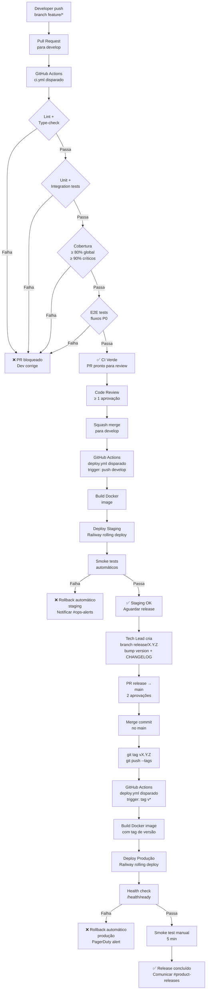
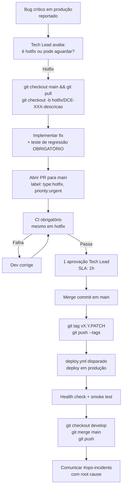

# 24 - Deploy, CI-CD e Versionamento — AI-Dani-Cedente

| Campo | Valor |
|---|---|
| **Nome do Documento** | Deploy, CI-CD e Versionamento — AI-Dani-Cedente |
| **Versão** | v1.0 |
| **Data** | 23/03/2026 |
| **Autor** | Claude Code Desktop |
| **Status** | Rascunho |
| **Bloco** | 5 — Ambiente e Processo |
| **Dependências** | D02, D14, D22, D23 |

---

> **📌 TL;DR**
>
> - **Plataforma de deploy:** Railway (VPS gerenciado) — conforme ADR em D14.
> - **3 ambientes:** Desenvolvimento (local), Staging (Railway — branch `develop`), Produção (Railway — tag `v*`).
> - **Pipeline:** GitHub Actions. 2 workflows principais: `ci.yml` (PR check) + `deploy.yml` (deploy automático).
> - **Estratégia de deploy:** Rolling deploy (zero-downtime). Railway gerencia automaticamente.
> - **Gates de promoção:** CI verde + smoke test + 1 aprovação humana para produção.
> - **Rollback:** `railway rollback` em < 2 minutos. Migrations com rollback explícito obrigatório.
> - **Semantic Versioning:** MAJOR.MINOR.PATCH. Tags Git `v*` disparam deploy em produção.
> - **Hotfix:** branch `hotfix/*` de `main`, 1 aprovação, deploy imediato com tag PATCH.

---

## 1. Matriz de Ambientes

| Ambiente | Objetivo | URL | Branch / Trigger | Tipo de Dados | Responsável pelo Promote | Critério de Uso |
|---|---|---|---|---|---|---|
| **Desenvolvimento** | Desenvolvimento e debug local | `localhost:3000` | Feature branches | Fictícios (factories) | Dev — self-serve | Desenvolvimento e testes locais |
| **Staging** | Validação pré-release, testes de integração e QA | `dani-cedente-staging.railway.app` | Push em `develop` | Mascarados — snapshot anônimo | Tech Lead | Toda feature antes de ir para produção |
| **Produção** | Serviço real — Cedentes reais | `dani-cedente.railway.app` | Tag `v*` no `main` | Dados reais do Cedente | Tech Lead + 1 aprovação adicional | Após aprovação de release |

> ⚙️ **Observação:** Preview environments por PR não estão configurados na fase inicial. [DECISÃO AUTÔNOMA: omitir preview environments para Fase 1] — Justificativa: overhead de configuração e custo Railway por ambiente temporário não justificado para time pequeno | Alternativa descartada: preview por PR — útil para QA visual mas requer Railway Teams e gestão de secrets por ambiente.

---

## 2. Diagrama do Pipeline



---

## 3. Workflows de CI/CD

### 3.1 Workflow `ci.yml` — Pull Request Check

| Atributo | Valor |
|---|---|
| **Trigger** | `pull_request` para `develop` e `main` |
| **Runner** | `ubuntu-latest` |
| **Tempo máximo** | 15 minutos |
| **Artefatos gerados** | Coverage report (HTML + JSON), test results (JUnit XML) |
| **Secrets consumidos** | `TEST_JWT_PRIVATE_KEY` (para testes de integração), `SUPABASE_TEST_URL` (se testcontainers não estiver configurado) |

```yaml
# .github/workflows/ci.yml
name: CI

on:
  pull_request:
    branches: [develop, main]

jobs:
  lint-typecheck:
    runs-on: ubuntu-latest
    steps:
      - uses: actions/checkout@v4
      - uses: pnpm/action-setup@v3
        with: { version: 9 }
      - uses: actions/setup-node@v4
        with: { node-version: '22', cache: 'pnpm' }
      - run: pnpm install --frozen-lockfile
      - run: pnpm lint
      - run: pnpm type-check

  test:
    runs-on: ubuntu-latest
    needs: lint-typecheck
    services:
      postgres:
        image: supabase/postgres:15.1.0.117
        env: { POSTGRES_PASSWORD: test_password }
        options: --health-cmd pg_isready
      redis:
        image: redis:7.4-alpine
        options: --health-cmd "redis-cli ping"
      rabbitmq:
        image: rabbitmq:4-management-alpine
        options: --health-cmd "rabbitmq-diagnostics -q ping"
    steps:
      - uses: actions/checkout@v4
      - uses: pnpm/action-setup@v3
        with: { version: 9 }
      - uses: actions/setup-node@v4
        with: { node-version: '22', cache: 'pnpm' }
      - run: pnpm install --frozen-lockfile
      - run: pnpm test:unit
      - run: pnpm test:integration
      - run: pnpm test:e2e
      - run: pnpm test:coverage
      - uses: actions/upload-artifact@v4
        with:
          name: coverage-report
          path: coverage/
          retention-days: 7

  security:
    runs-on: ubuntu-latest
    needs: lint-typecheck
    steps:
      - uses: actions/checkout@v4
      - uses: snyk/actions/node@master
        env: { SNYK_TOKEN: ${{ secrets.SNYK_TOKEN }} }
        with: { args: --severity-threshold=critical }
```

### 3.2 Workflow `deploy.yml` — Deploy Automático

| Atributo | Valor |
|---|---|
| **Trigger** | Push em `develop` (staging) + tag `v*` (produção) |
| **Runner** | `ubuntu-latest` |
| **Secrets consumidos** | `RAILWAY_TOKEN`, `RAILWAY_SERVICE_ID_STAGING`, `RAILWAY_SERVICE_ID_PROD` |
| **Artefatos gerados** | Docker image tagged no Railway Registry |
| **Notificação de falha** | Slack #ops-incidents via webhook |

```yaml
# .github/workflows/deploy.yml
name: Deploy

on:
  push:
    branches: [develop]
    tags: ['v*']

jobs:
  deploy-staging:
    if: github.ref == 'refs/heads/develop'
    runs-on: ubuntu-latest
    environment: staging
    steps:
      - uses: actions/checkout@v4
      - uses: railwayapp/railway-deploy@v1
        with:
          railway-token: ${{ secrets.RAILWAY_TOKEN }}
          service: ${{ secrets.RAILWAY_SERVICE_ID_STAGING }}
      - name: Smoke test staging
        run: |
          sleep 30  # Aguardar rolling deploy
          curl -f https://dani-cedente-staging.railway.app/health/ready || exit 1

  deploy-production:
    if: startsWith(github.ref, 'refs/tags/v')
    runs-on: ubuntu-latest
    environment: production  # Requer aprovação manual no GitHub Environments
    steps:
      - uses: actions/checkout@v4
      - uses: railwayapp/railway-deploy@v1
        with:
          railway-token: ${{ secrets.RAILWAY_TOKEN }}
          service: ${{ secrets.RAILWAY_SERVICE_ID_PROD }}
      - name: Health check produção
        run: |
          sleep 30
          curl -f https://dani-cedente.railway.app/health/ready || exit 1
```

---

## 4. Estratégia de Deploy

**Estratégia adotada:** Rolling Deploy gerenciado pelo Railway.

[DECISÃO AUTÔNOMA]: Rolling deploy via Railway — Justificativa: Railway gerencia o rolling deploy nativamente, sem configuração adicional; garante zero-downtime para um serviço stateless como o backend NestJS | Alternativa descartada: Blue-Green — requer dois ambientes Railway simultâneos, dobrando o custo, sem benefício adicional para o perfil de serviço atual.

| Atributo | Detalhe |
|---|---|
| **Zero-downtime** | Sim — Railway mantém a versão anterior ativa até a nova estar healthy |
| **Health check de promoção** | `/health/ready` com timeout de 60s |
| **Rollback automático** | Se `/health/ready` falhar após deploy, Railway reverte automaticamente |
| **Pré-condição** | Migrations de banco devem ser backward-compatible com versão anterior (tolerância de 1 versão) |
| **Quando NÃO usar** | Migrations que alteram estrutura de tabelas de forma incompatível — exige maintenance window |

### 4.1 Migrations — Regra de Backward Compatibility

Toda migration deve ser backward-compatible com a versão anterior do código:

1. **Adicionar coluna:** sempre com `DEFAULT` ou nullable → compatível.
2. **Renomear coluna:** criar nova coluna → deploy → remover antiga em PR separado.
3. **Remover coluna:** remover do código primeiro → deploy → migration para remover coluna.
4. **Alterar tipo:** criar nova coluna com tipo correto → migrar dados → deploy → remover antiga.

> 🔴 **Nunca remover ou renomear coluna em uso em uma única migration.** Isso causa crash do pod durante o rolling deploy.

---

## 5. Promoção entre Ambientes

### 5.1 Desenvolvimento → Staging

| Gate | Tipo | Obrigatório |
|---|---|---|
| CI verde (lint + type-check + testes + cobertura) | Automático | Sim |
| Sem vulnerabilidade CRITICAL no Snyk | Automático | Sim |
| ≥ 1 aprovação de code review | Humano | Sim |
| PR template completado | Humano | Sim |

**Trigger:** Squash merge em `develop` → deploy automático no staging.

### 5.2 Staging → Produção

| Gate | Tipo | Obrigatório |
|---|---|---|
| Smoke test de staging verde | Automático | Sim |
| `GET /health/ready` retornando 200 em staging | Automático | Sim |
| Regressão E2E passando em staging | Automático | Sim |
| Branch `release/X.Y.Z` revisada com 2 aprovações | Humano | Sim |
| Janela de deploy respeitada (ver 5.3) | Humano | Sim |
| CHANGELOG.md atualizado | Humano | Sim |
| `railway rollback` testado em staging para a versão atual | Humano | Recomendado |

**Trigger:** Tag `v*` no `main` → GitHub Environments pede aprovação → deploy automático em produção.

### 5.3 Janela de Deploy

| Tipo | Janela Permitida | Fora da Janela |
|---|---|---|
| Release normal | Seg–Sex, 09h–17h (horário de Fortaleza) | Requer aprovação explícita do Tech Lead |
| Hotfix | Qualquer horário | Segue fluxo de hotfix (seção 14) |
| Rollback emergencial | Qualquer horário | On-call pode executar sem aprovação adicional |

---

## 6. Build e Artefatos

### 6.1 Build Docker

```dockerfile
# Dockerfile — multi-stage build
FROM node:22-alpine AS builder
WORKDIR /app
COPY package.json pnpm-lock.yaml ./
RUN corepack enable && pnpm install --frozen-lockfile
COPY . .
RUN pnpm build

FROM node:22-alpine AS runner
WORKDIR /app
ENV NODE_ENV=production
COPY --from=builder /app/dist ./dist
COPY --from=builder /app/node_modules ./node_modules
COPY --from=builder /app/package.json ./package.json
EXPOSE 3000
CMD ["node", "dist/main.js"]
```

| Atributo | Valor |
|---|---|
| **Nome da imagem** | `ai-dani-cedente:<versao>` (Railway Registry) |
| **Versionamento** | `:<branch>-<sha7>` para staging / `:<semver>` para produção |
| **Checksum** | SHA256 do layer final — verificado pelo Railway |
| **Retenção** | Últimas 10 imagens por ambiente no Railway Registry |
| **Cache** | pnpm cache via `actions/cache` no CI — economiza ~2min por build |

---

## 7. Rollback

### 7.1 Quando Acionar

- Health check `/health/ready` falhando em produção após deploy.
- Taxa de erro > 5% nos primeiros 10 minutos pós-deploy (alerta A-002 do D25).
- Circuit breaker abrindo imediatamente após deploy (indica regressão).
- Feedback de Cedentes reportando funcionalidade quebrada.

### 7.2 Quem Pode Acionar

- Tech Lead (primário).
- Qualquer membro do time on-call (sem aprovação adicional em emergência).
- Nunca automaticamente por script sem supervisão humana — Railway pode fazer rollback automático no health check inicial.

### 7.3 Passos de Rollback

```bash
# Passo 1: Identificar deployment anterior
railway deployments list --service dani-cedente-prod

# Passo 2: Executar rollback para deployment anterior
railway rollback --deployment <deployment-id-anterior>

# Passo 3: Aguardar 30s e verificar health check
sleep 30
curl -f https://dani-cedente.railway.app/health/ready

# Passo 4: Verificar métricas (circuit breaker, taxa de erro)
# Abrir dashboard Grafana → Dashboard "Saúde Geral da Dani"

# Passo 5: Comunicar no #ops-incidents
# Template: "Rollback executado para vX.Y.Z-1 (deployment <id>).
# Motivo: <descrição>. Status: RESTORED. Próximos passos: <investigação>"
```

**Tempo esperado de rollback:** < 2 minutos (Railway mantém imagens anteriores).

### 7.4 Rollback de Migration

> 🔴 **Caso crítico:** Se a migration aplicada for incompatível e não houver rollback script, o rollback de código SEM reverter a migration pode causar erros de schema.

```bash
# Rollback de migration com Prisma
pnpm prisma migrate resolve --rolled-back <migration_name>

# Se a migration adicionou coluna que precisa ser removida
pnpm prisma db execute --file migrations/rollback/<migration_name>_down.sql
```

**Regra:** Todo PR que contém migration deve incluir arquivo `migrations/rollback/<nome>_down.sql`. Obrigatório no checklist de PR de módulos com schema change.

---

## 8. Semantic Versioning

| Tipo | Bump | Quando | Exemplo |
|---|---|---|---|
| **PATCH** | X.Y.**Z** | Hotfix, correção de bug, ajuste de config | 1.2.3 → 1.2.4 |
| **MINOR** | X.**Y**.0 | Nova funcionalidade backward-compatible | 1.2.3 → 1.3.0 |
| **MAJOR** | **X**.0.0 | Breaking change de API ou contrato | 1.2.3 → 2.0.0 |

**Regras adicionais:**
- Release Candidate: `v1.3.0-rc.1` — apenas para staging, nunca para produção.
- Pré-release: `v1.3.0-beta.1` — apenas para staging.
- Hotfix sempre é PATCH: `v1.2.3` → `v1.2.4`.
- Tags são imutáveis — nunca reutilizar uma tag existente.

---

## 9. Ciclo de Release

```
1. Desenvolvimento (feature branches → develop)
   ↓ CI verde + code review
2. Staging (push develop → deploy automático)
   ↓ smoke test + QA manual
3. Release Candidate (branch release/X.Y.Z)
   ↓ bump versão + CHANGELOG
4. Aprovação (2 code reviews no PR release → main)
   ↓ merge commit + tag vX.Y.Z
5. Produção (tag v* → deploy automático)
   ↓ health check + smoke test manual 5min
6. Estabilização (monitorar 30min após deploy)
   ↓ métricas normais → comunicar conclusão
```

**Freeze de deploy:** Não há freeze formal. Decisão do Tech Lead em períodos de alta demanda (ex: final de semana, feriados, datas de pagamento).

---

## 10. Changelog

### 10.1 Formato

O `CHANGELOG.md` segue o padrão [Keep a Changelog](https://keepachangelog.com) com seções: `Added`, `Changed`, `Fixed`, `Removed`, `Security`.

```markdown
## [1.3.0] - 2026-03-23

### Added
- Fluxo de confirmação obrigatória para aceite de proposta (RF-DCE-018)
- Alerta proativo 2 dias antes do vencimento do Escrow (RF-DCE-023)

### Fixed
- Correção de vazamento de sessão Redis após expiração (DCE-AGENT-5030)

### Security
- PiiMaskingMiddleware agora mascara telefone além de CPF e e-mail
```

**Anti-exemplo:**
```markdown
## [1.3.0] - 2026-03-23
- Várias melhorias no agente  ← ❌ Sem rastreabilidade
- Bug fixes gerais             ← ❌ Genérico demais
```

### 10.2 Quando Atualizar

- Em cada PR que cria ou modifica funcionalidade (seção `Added`, `Changed`).
- Em cada PR de bugfix (seção `Fixed`).
- Na branch `release/X.Y.Z` — revisão final e consolidação.
- **Responsável:** autor do PR para mudanças granulares; Tech Lead para consolidação de release.

---

## 11. Release Notes

Template mínimo para comunicação de release:

```markdown
## Release v1.3.0 — AI-Dani-Cedente

**Data:** 23/03/2026
**Responsável:** @tech-lead
**Ambiente:** Produção

### Resumo
Adiciona fluxo de confirmação obrigatória para ações financeiras e alertas
proativos de vencimento do Escrow.

### Escopo
- Módulo: agent (confirmação), escrow (alertas), notification (templates T-NTF-005)
- Arquivos de schema alterados: Não
- Migrations: Não

### Riscos Conhecidos
- Primeira versão do fluxo de confirmação — monitorar taxa de abandono nas
  sessões (métrica: dani_agent_state_transitions_total{state="pendingConfirmation"})

### Ações Pós-Release
- [ ] Monitorar CSAT por 24h
- [ ] Verificar taxa de confirmações vs. abandonos nas primeiras 2h
- [ ] Confirmar DLQ = 0 após 30min

### Impacto para o Usuário
Cedentes agora verão uma etapa de confirmação ao aceitar propostas. Mudança
intencional — não é um bug.

### Links
- PR: #145, #148
- CHANGELOG: v1.3.0
- Runbook atualizado: D26 seção RB-001
```

---

## 12. Tagging

| Tipo de Tag | Formato | Exemplo | Quando Criar |
|---|---|---|---|
| Release | `vX.Y.Z` | `v1.3.0` | Após merge do PR de release no `main` |
| Release Candidate | `vX.Y.Z-rc.N` | `v1.3.0-rc.1` | Durante testes de staging de release |
| Hotfix | `vX.Y.Z` (PATCH) | `v1.2.4` | Após merge do hotfix no `main` |
| Rollback marker | `rollback-vX.Y.Z-YYYYMMDD` | `rollback-v1.3.0-20260323` | Para documentar que houve rollback |

```bash
# Criar tag de release
git tag v1.3.0 -m "Release 1.3.0 — Confirmação financeira e alertas Escrow"
git push origin v1.3.0

# Criar rollback marker (apenas para rastreabilidade — não dispara deploy)
git tag rollback-v1.3.0-20260323 -m "Rollback de 1.3.0 — circuit breaker aberto"
git push origin rollback-v1.3.0-20260323
```

---

## 13. Comunicação de Release

| Momento | Canal | Quem Comunica | Template |
|---|---|---|---|
| **Antes do deploy produção** (30min antes) | Slack #product-releases | Tech Lead | `[DEPLOY AGENDADO] vX.Y.Z em 30min. Escopo: <resumo 1 linha>. Janela de monitoramento: 30min.` |
| **Deploy iniciado** | Slack #ops-incidents | GitHub Actions (automático) | `[DEPLOY INICIADO] vX.Y.Z em produção — <link do workflow>` |
| **Deploy concluído (sucesso)** | Slack #product-releases | Tech Lead | `[DEPLOY CONCLUÍDO] vX.Y.Z em produção. Health check: OK. Monitorando 30min. Release notes: <link>` |
| **Deploy falhou / rollback** | Slack #ops-incidents | Tech Lead | `[ROLLBACK] vX.Y.Z revertido para vX.Y.Z-1. Motivo: <descrição>. Status: RESTORED.` |
| **Estabilização concluída** (30min após) | Slack #product-releases | Tech Lead | `[RELEASE ESTÁVEL] vX.Y.Z estável. CSAT OK, erro < 1%, sem DLQ.` |

---

## 14. Hotfix Flow

Um hotfix é qualquer correção urgente que não pode aguardar o ciclo normal de release.



**Passos resumidos:**
1. Branch `hotfix/DCE-XXX` de `main`.
2. Fix + teste de regressão (obrigatório — sem exceção).
3. PR com label `type:hotfix` + `priority:urgent`.
4. CI obrigatório (sem skip de nenhum gate).
5. 1 aprovação do Tech Lead (SLA 1h).
6. Merge commit em `main` + tag PATCH.
7. Deploy automático via `deploy.yml`.
8. Sync em `develop`: `git checkout develop && git merge main`.
9. Post no `#ops-incidents` com root cause + link do PR.

---

## 15. Backlog de Pendências

| # | Item | Tipo | Prioridade |
|---|---|---|---|
| P-DEP-001 | Configurar GitHub Environments com proteção de branch e aprovação obrigatória para deploy em produção | [SEÇÃO PENDENTE] — requer configuração no repositório GitHub | Alta |
| P-DEP-002 | Configurar `RAILWAY_TOKEN` e `RAILWAY_SERVICE_ID_*` como secrets no GitHub Actions | [SEÇÃO PENDENTE] — requer criação da conta Railway e projetos | Alta |
| P-DEP-003 | Definir Slack webhook para notificações de deploy (GitHub Actions → Slack #ops-incidents) | [SEÇÃO PENDENTE] — requer Slack App no workspace | Média |
| P-DEP-004 | Configurar cache de pnpm no CI para otimizar tempo de build | [DECISÃO AUTÔNOMA: actions/cache com pnpm store] — implementar após primeiro setup | Baixa |
| P-DEP-005 | Avaliar Renovate Bot para atualização automática de dependências | [DECISÃO AUTÔNOMA: adiar para pós go-live] — gestão manual adequada para fase inicial | Baixa |

---

## 16. Changelog do Documento

| Data | Versão | Descrição |
|---|---|---|
| 23/03/2026 | v1.0 | Versão inicial — 3 ambientes (dev/staging/prod), 2 workflows GitHub Actions (ci.yml + deploy.yml), rolling deploy via Railway, matriz de promoção com gates humanos e automáticos, rollback em < 2min, semver com regras de backward compatibility para migrations, hotfix flow com diagrama, template de release notes e comunicação de deploy. |
