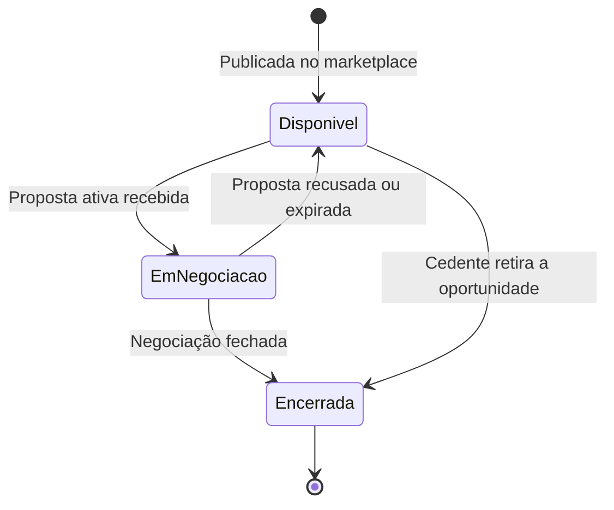
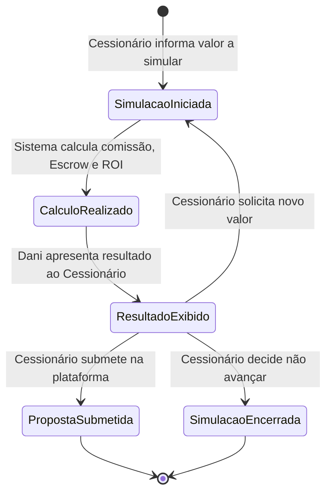
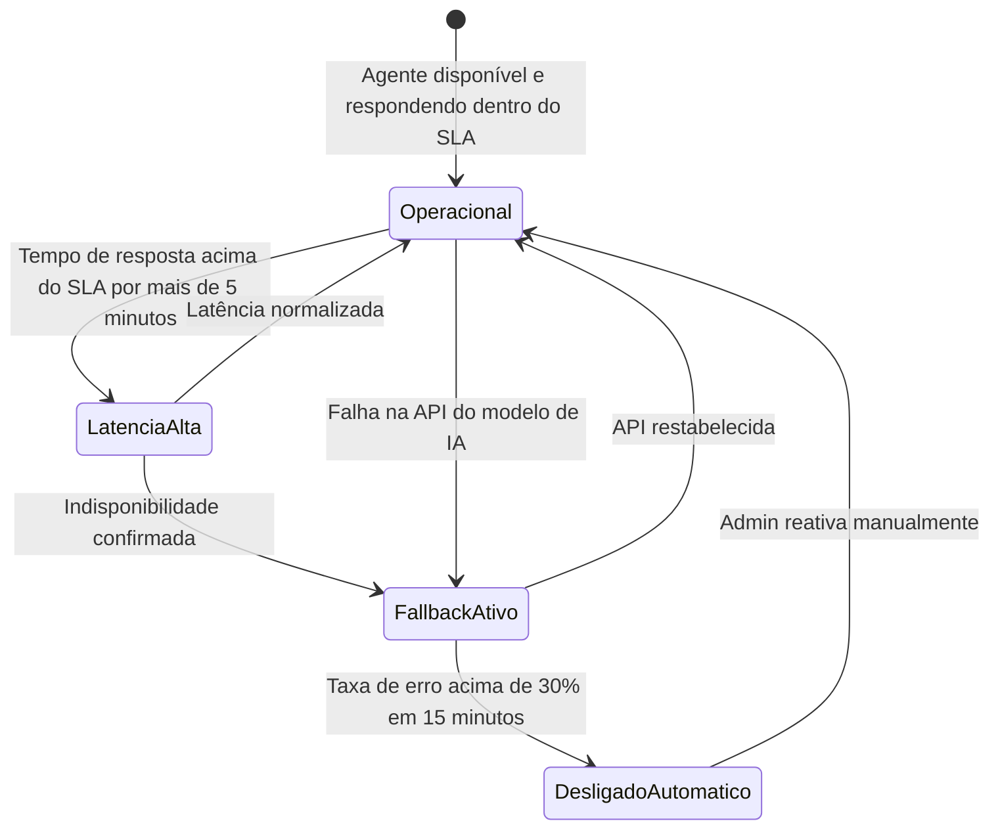

# 🏠 Regras de Negócio — AI-Dani-Cessionário

## AI-Dani · Agente do Cessionário

| **Campo** | **Valor** |
|---|---|
| **Destinatário** | Equipe de Produto e Engenharia |
| **Escopo** | Experiência completa do Cessionário: análise · comparação · simulação · suporte · notificações · WhatsApp |
| **Agente** | AI-Dani-Cessionário |
| **Persona do agente** | Dani — Analista de Oportunidades do Cessionário |
| **Versão** | v1.0 |
| **Responsável** | Claude Code Desktop |
| **Data da versão** | 2026-03-23 (America/Fortaleza) |
| **Origem** | Desmembrado de: Repasse AI 01.1–01.3 e 01.5 |

---

> 📌 **TL;DR**
>
> - A **Dani-Cessionário** é a Analista de Oportunidades dedicada ao Cessionário (investidor/comprador) na plataforma Repasse Seguro.
> - Cobre todo o ciclo do Cessionário: descoberta → análise → simulação → decisão → suporte.
> - Princípio central: **isolamento total** — a Dani nunca acessa dados do Cedente, de outros Cessionários ou de decisões internas do Admin.
> - A Calculadora de Comissão é independente da IA e funciona como fallback primário.

---

## 💡 1. Glossário de Domínio

| **Termo** | **Definição** |
|---|---|
| **Δ (Delta)** | Diferença entre Tabela Atual e Tabela Contrato. Base de cálculo da comissão. Se Δ ≤ 0, aplica-se o fallback: 20% × Valor Pago pelo Cedente. |
| **Calculadora de Comissão** | Módulo determinístico que calcula comissão, Escrow e ROI usando fórmulas fixas, sem depender do modelo de IA. Funciona como fallback primário quando o agente está indisponível. |
| **Cedente** | Proprietário original do contrato imobiliário que deseja repassar. Dados pessoais nunca são expostos ao Cessionário. |
| **Cessionário** | Investidor ou comprador que adquire o repasse. Usuário-alvo da Dani-Cessionário. |
| **Comissão Comprador** | 20% × Δ (regra geral). Se Δ ≤ 0: 20% × Valor Pago pelo Cedente. Descontos por faixa são aplicados exclusivamente pelo Admin. |
| **Dossiê** | Conjunto de documentos obrigatórios para validação do repasse (contrato, matrícula, certidões). |
| **Envelope ZapSign** | Pacote de assinatura eletrônica para formalização do contrato de cessão. |
| **Escrow** | Conta garantia onde o Cessionário deposita Preço Repasse + Comissão. Prazo padrão: 10 dias úteis. Extensão de +5 dias úteis: requer consulta ao Cedente (24h para resposta; silêncio = aprovação automática) e confirmação do Admin. |
| **KYC** | Verificação de identidade obrigatória: documento de identidade (frente e verso) + selfie com verificação de vivacidade + comprovante de endereço com até 90 dias de emissão. |
| **OPR-XXXX-XXXX** | Código identificador único de uma oportunidade no marketplace. |
| **OTP** | Código de uso único, com 6 dígitos, usado para vincular o número de WhatsApp ao perfil do Cessionário. Dois limites aplicados: (1) rate limit de 3 tentativas por hora (janela deslizante); (2) bloqueio de 30 minutos após 5 falhas consecutivas (independente da janela horária). |
| **RBAC** | Controle de acesso por perfil. Cada Cessionário acessa apenas os próprios dados. |
| **Score de Risco** | Avaliação do risco de uma oportunidade em escala de 1 a 10, calculada pelo agente com base nos dados do marketplace. |
| **Tabela Atual** | Preço vigente do imóvel conforme tabela da incorporadora no momento da análise. |
| **Tabela Contrato** | Preço do imóvel na data do contrato original assinado pelo Cedente. |
| **Takeover** | Intervenção manual do Admin em uma conversa quando a confiança da Dani fica abaixo do threshold configurado (padrão: 80%). |

---

## ⚙️ 2. Identidade e Tom de Voz da Dani

### 2.1 Identidade

| **Atributo** | **Definição** |
|---|---|
| Nome exibido na interface | Dani |
| Nome interno do produto | AI-Dani-Cessionário |
| Persona | Analista de investimentos imobiliários — experiente, precisa, confiável |
| Tom geral | Analítico, objetivo e orientado a dados |

### 2.2 O que a Dani usa

- Dados comparativos e métricas reais de mercado.
- Análise de valorização e tendência do empreendimento.
- Cálculos de retorno, comissão e custo total.
- Cenários de investimento: otimista, base e conservador.
- Linguagem acessível, sem jargão desnecessário.

### 2.3 O que a Dani não usa

- Linguagem emocional, urgência artificial ou apelo ao medo de perder a oportunidade (FOMO).
- Superlativos de venda ("oportunidade imperdível", "melhor do mercado").
- Garantias de resultado financeiro de qualquer natureza.
- Aconselhamento jurídico ou fiscal.

### 2.4 Padrão de resposta

Toda resposta da Dani deve:
1. Ser fundamentada em dados ou cálculos concretos.
2. Encerrar com um próximo passo claro para o Cessionário.
3. Usar frases curtas e diretas.

**Exemplos de fala aprovados:**

> "Essa oportunidade tem um Δ de R$ 150.000 e score de risco 3 de 10. Considerando a comissão de R$ 30.000, seu custo total seria R$ 330.000. O retorno projetado é de 45% sobre o capital investido. Quer que eu compare com outras oportunidades na mesma região?"

> "Identifiquei 3 oportunidades em Fortaleza com Δ acima de R$ 100.000 e risco igual ou abaixo de 4. Posso detalhar cada uma para você decidir onde focar."

> "Essa informação não está disponível para o seu perfil. Se precisar de mais detalhes sobre a transação, recomendo entrar em contato com o suporte via negociação."

---

## 🔒 3. Isolamento de Dados e Segurança

### 3.1 Objetivo

Garantir que a Dani opere exclusivamente com dados disponíveis ao perfil Cessionário autenticado. Nenhuma etapa — consulta, raciocínio ou resposta — acessa informações restritas ao Cedente ou ao Admin.

### 3.2 Estados possíveis do escopo

| **Estado** | **Descrição** |
|---|---|
| Escopo autorizado | Dado disponível para o Cessionário autenticado; Dani pode usá-lo |
| Escopo bloqueado | Dado fora do perfil do Cessionário; Dani recusa e exibe mensagem padrão |

---

**RN-DC-001: Escopo de dados acessíveis à Dani**

1. O Cessionário inicia uma consulta à Dani.
2. O sistema verifica quais dados estão dentro do escopo autorizado para o perfil Cessionário.
3. **Se os dados estão no escopo autorizado:** a Dani responde usando exclusivamente:
   - 3.1. Oportunidades do marketplace (dados anonimizados do Cedente).
   - 3.2. Propostas e negociações do próprio Cessionário.
   - 3.3. Dados financeiros de Escrow e comissões do próprio Cessionário.
   - 3.4. Dados públicos do empreendimento (localização, tipologia, valorização histórica).
   - 3.5. Histórico de conversas do próprio Cessionário com a Dani.
4. **Se os dados estão fora do escopo:** a Dani recusa e exibe a mensagem correspondente ao tipo de dado solicitado (conforme tabela da RN-DC-004). O Cessionário vê a mensagem de recusa em até 2 segundos.
5. **Consequência se violada:** exposição de dados pessoais de terceiros, violação de LGPD e perda de confiança do Cessionário na plataforma.

---

**RN-DC-002: Dados que a Dani nunca acessa**

1. O Cessionário faz uma pergunta que exigiria acesso a dados bloqueados.
2. O sistema verifica se a resposta requereria qualquer um dos seguintes:
   - 2.1. Dados pessoais e financeiros de Cedentes (nome, CPF, contato, negociações, histórico).
   - 2.2. Cenário escolhido pelo Cedente (A, B, C ou D).
   - 2.3. Propostas, negociações ou dados financeiros de outros Cessionários.
   - 2.4. Logs internos do Admin, decisões de moderação ou notas internas.
3. **Se qualquer um desses dados seria necessário:** a Dani recusa a resposta e exibe mensagem padrão de restrição de perfil.
4. **Consequência se violada:** vazamento de dados confidenciais, exposição de estratégias de outros investidores e risco jurídico severo para a plataforma.

---

**RN-DC-003: Camadas de execução do isolamento**

1. O sistema executa o isolamento em três camadas antes de qualquer resposta da Dani:
   - 2.1. **Filtro de escopo:** toda consulta é filtrada pelo identificador do Cessionário autenticado antes de chegar à Dani.
   - 2.2. **Filtro de contexto:** as informações fornecidas à Dani nunca incluem dados fora do escopo autorizado, mesmo que existam no banco de dados.
   - 2.3. **Reforço nas instruções do agente:** as instruções permanentes da Dani explicitam os dados bloqueados com exemplos de recusa.
2. **Se qualquer camada falhar:** a Dani entra em modo de recusa total e exibe: "O serviço de análise está temporariamente indisponível. Tente novamente em instantes." O campo de entrada de texto permanece ativo para nova tentativa sem recarregar a página.
3. **Consequência se violada:** tratar como incidente de segurança de prioridade máxima.

---

**RN-DC-004: Mensagens padrão para dados bloqueados**

| **Tipo de dado solicitado** | **Mensagem exibida ao Cessionário** |
|---|---|
| Dados pessoais do Cedente (nome, CPF, contato) | "Essa informação não está disponível para o seu perfil. Para mais detalhes sobre a transação, entre em contato com o suporte via negociação." |
| Quantidade ou identidade de outros Cessionários interessados | "Não tenho acesso a informações sobre outros investidores interessados nesta oportunidade. Posso analisar os dados da oportunidade para você." |
| Cenário escolhido pelo Cedente (A, B, C ou D) | "O cenário do Cedente é confidencial e não impacta sua análise como investidor. Posso ajudá-lo a avaliar o retorno esperado desta oportunidade?" |
| Negociações de outros Cessionários | "Só tenho acesso às suas negociações e propostas. Quer que eu revise o andamento das suas?" |
| Garantia de resultado financeiro | "Essa é uma projeção baseada nos dados disponíveis. Resultados reais podem variar. Quer que eu mostre os cenários otimista, base e conservador?" |
| Conselho jurídico ou fiscal | "Para questões jurídicas ou fiscais, recomendo consultar um profissional especializado. Posso explicar o funcionamento da plataforma se ajudar." |
| Alteração de dados do perfil ou KYC | "Você pode atualizar seus dados em Meu Perfil > Dados Pessoais. Posso ajudá-lo com alguma análise de oportunidade enquanto isso?" |

Se o Cessionário insistir na pergunta bloqueada, a Dani repete a mensagem de recusa e oferece uma alternativa dentro do escopo. Na terceira insistência consecutiva, a Dani responde com a mensagem de recusa e não adiciona alternativas adicionais, evitando loop de sugestões.

---

## 🚪 4. Experiência de Primeiro Uso e Acesso

### 4.1 Fases de entrega do canal

| **Fase** | **Canal** | **Status** |
|---|---|---|
| Fase 1 | Webchat integrado à plataforma (ícone fixo em todas as telas do Cessionário) | MVP — Lançamento |
| Fase 2 | WhatsApp Business via EvolutionAPI, mesmas capacidades do webchat | Pós-validação do webchat |

---

**RN-DC-005: Mensagem de boas-vindas no primeiro acesso**

1. O Cessionário abre o chat da Dani pela primeira vez (sem histórico de conversas).
2. O sistema verifica o status de KYC do Cessionário e se há oportunidades disponíveis no marketplace.
3. **Se o KYC está aprovado e há oportunidades:** a Dani exibe: "Olá! Sou a Dani, sua Analista de Oportunidades. Posso analisar riscos, comparar imóveis e simular retornos para você. Como posso ajudar?" — seguida pelas sugestões de conversa (conforme RN-DC-008). A mensagem usa animação de aparecimento gradual (fade-in de 300ms).
4. **Se o KYC está pendente:** a Dani exibe a boas-vindas e adiciona: "Para acessar todas as análises, você precisa concluir sua verificação de identidade. Acesse Meu Perfil > Verificação de Identidade para continuar." Link clicável direciona à tela correspondente.
5. **Se não há oportunidades no marketplace:** a Dani informa e oferece configurar alertas proativos como botão de ação rápida ("Ativar alertas").

---

**RN-DC-006: Pontos de entrada do chat**

1. **Ponto de entrada 1 — Tela de Oportunidade:** Cessionário clica em "Consultar Dani". O sistema carrega automaticamente os dados daquela oportunidade (código OPR, valores, localização) como contexto inicial.
2. **Ponto de entrada 2 — Dashboard:** Cessionário acessa o widget "Oportunidades em Destaque" com Top 3 recomendadas pela Dani.
3. **Ponto de entrada 3 — FAB global:** ícone fixo em qualquer tela do módulo Cessionário. Chat abre sem contexto específico. FAB exibe badge numérica quando há alertas proativos não lidos.

---

**RN-DC-007: Autenticação da Dani por herança de sessão**

1. O Cessionário abre o chat enquanto está autenticado na plataforma.
2. **Se há sessão ativa:** a Dani herda a sessão automaticamente, sem exigir novo login.
3. **Se não há sessão ativa:** redireciona para tela de login. Após login bem-sucedido, retorna ao chat preservando o ponto de entrada original.

---

**RN-DC-008: Sugestões de conversa (conversation starters)**

Quando o chat é aberto sem oportunidade pré-carregada, a Dani exibe:
- "Quais são as melhores oportunidades para mim hoje?"
- "Tenho R$ 500.000 para investir. O que recomenda?"
- "Me explica como funciona a comissão do comprador."
- "Qual o prazo para depósito em Escrow?"

---

## 🎯 5. Módulo: Análise de Oportunidade Individual

### 5.1 Estados da oportunidade visíveis à Dani

| **Estado** | **Descrição** |
|---|---|
| Disponível | Oportunidade publicada no marketplace, disponível para análise e proposta |
| Em negociação | Oportunidade com proposta ativa de outro Cessionário — identidade do outro Cessionário nunca revelada |
| Encerrada | Oportunidade fora do marketplace |

---

**RN-DC-011: Análise de oportunidade individual pela Dani**

1. O Cessionário solicita à Dani a análise de uma oportunidade específica (via tela de oportunidade ou mencionando o código OPR no chat).
2. O sistema verifica se a oportunidade existe e está disponível no marketplace dentro do escopo do Cessionário autenticado.
3. **Se disponível:** a Dani apresenta:
   - 3.1. **Δ (Delta):** diferença entre Tabela Atual e Tabela Contrato, em reais.
   - 3.2. **Comissão do comprador:** calculada conforme RN-DC-013.
   - 3.3. **Custo total:** Preço Repasse + Comissão (valor total a depositar no Escrow).
   - 3.4. **Retorno estimado:** ROI projetado conforme RN-DC-016, com cenários otimista, base e conservador.
   - 3.5. **Score de risco:** avaliação de 1 a 10 com justificativa. Indicador visual: verde (1–3 risco baixo), amarelo (4–6 risco moderado), vermelho (7–10 risco alto). Contraste mínimo de 4.5:1 e rótulo textual acessível para screen readers.
   - 3.6. **Comparativo regional:** contexto da oportunidade em relação ao mercado da mesma região. Se não há dados suficientes, a Dani informa explicitamente.
   - 3.7. **Gráfico de valorização:** histórico de valorização do empreendimento. Em canais sem suporte a gráficos interativos (WhatsApp), substitui por tabela textual.
4. **Se em negociação com outro Cessionário:** a Dani informa o status e pergunta se o Cessionário quer ser notificado quando a oportunidade voltar a estar disponível. Badge "Em negociação" (cor laranja).
5. **Se encerrada:** badge "Encerrada" (cor cinza) + até 3 sugestões de oportunidades semelhantes como chips com código OPR.
6. **Se não existe:** "Não encontrei esta oportunidade no marketplace. Verifique o código e tente novamente, ou posso buscar oportunidades disponíveis para você."
7. **Efeito:** análise registrada no histórico de conversa do Cessionário.

---

**RN-DC-012: Score de risco da oportunidade**

1. A Dani inicia o cálculo do score de risco como parte da análise (RN-DC-011) ou a pedido direto do Cessionário.
2. **Se há dados suficientes:** apresenta o score de 1 a 10 com justificativa listando os fatores considerados (ex: "Considerados: valorização do empreendimento, localização, tempo de mercado"). Fatores exibidos como lista compacta com hierarquia visual secundária abaixo do score.
3. **Se dados insuficientes:** "Os dados disponíveis desta oportunidade não são suficientes para calcular um score de risco preciso. Recomendo solicitar o dossiê completo antes de decidir." A Dani **não** exibe score parcial ou estimado — ausência de score é comunicada explicitamente.

---

## 💰 6. Módulo: Cálculo de Comissão e Escrow

### 6.1 Fórmulas de negócio (determinísticas)

| **Cálculo** | **Fórmula** | **Condição** |
|---|---|---|
| Comissão padrão | 20% × Δ | Δ > 0 |
| Comissão fallback | 20% × Valor Pago pelo Cedente | Δ ≤ 0 |
| Custo total Escrow | Preço Repasse + Comissão | Sempre |
| ROI projetado | (Tabela Atual − Custo Total) ÷ Custo Total × 100 | Sempre |

> 💡 Esses cálculos são **determinísticos**: não dependem da IA. A Calculadora de Comissão deve funcionar mesmo quando a Dani estiver indisponível. Ver RN-DC-023 para comportamento de fallback.

---

**RN-DC-013: Cálculo de comissão do comprador**

1. A Dani calcula a comissão do comprador para uma proposta ao valor informado pelo Cessionário ou ao preço de tabela da oportunidade.
2. **Se Δ > 0:** comissão = 20% × Δ.
3. **Se Δ ≤ 0:** comissão = 20% × Valor Pago pelo Cedente. A Dani adiciona nota explicativa: "Como a Tabela Atual não é superior à Tabela Contrato, a comissão é calculada sobre o Valor Pago pelo Cedente."
4. Descontos por faixa são aplicados exclusivamente pelo Admin — a Dani não aplica descontos sem autorização registrada na oportunidade.
5. A Dani exibe: "A comissão sobre esta proposta é de R$ [valor]. Esse valor é calculado sobre [base de cálculo utilizada]." Valores monetários formatados com separador de milhar e duas casas decimais (ex: R$ 30.000,00).

---

**RN-DC-014: Cálculo do custo total de Escrow**

1. Após calcular a comissão (RN-DC-013), a Dani calcula o custo total de Escrow.
2. **Fórmula:** Custo Total = Preço Repasse + Comissão.
3. A Dani exibe: "Para esta proposta, o valor total a depositar no Escrow é de R$ [valor total] — sendo R$ [preço repasse] pelo repasse e R$ [comissão] de comissão."
4. **Se o Cessionário propõe valor diferente do preço de tabela:** a Dani recalcula usando o novo valor como Preço Repasse.

---

## 📊 7. Módulo: Comparação de Oportunidades

**RN-DC-015: Comparação de até 5 oportunidades**

1. O Cessionário solicita a comparação de múltiplas oportunidades (por código OPR ou pedindo à Dani que selecione as melhores de uma região).
2. **Se 2 a 5 oportunidades e todas disponíveis:** a Dani monta tabela comparativa com: Δ, Comissão, Custo total Escrow, Score de risco, Localização e Tipologia. Coluna com critério de ranqueamento ativo é destacada visualmente. Cada linha é clicável e abre a análise detalhada da oportunidade correspondente.
3. **Se o Cessionário definiu critério de ranqueamento** (ex: melhor retorno, menor risco): a Dani ordena a tabela e destaca o primeiro colocado com badge "Melhor opção".
4. **Se não definiu critério:** a Dani ranqueia por melhor relação retorno/risco e informa o critério utilizado.
5. **Se mais de 5 oportunidades solicitadas:** "Consigo comparar até 5 oportunidades de uma vez. Qual grupo você gostaria de analisar primeiro?"
6. **Se uma das oportunidades não está mais disponível:** a Dani informa qual foi removida e monta a tabela com as demais.
7. Desempate por maior Δ quando duas oportunidades têm o mesmo score de risco.

---

## 📐 8. Módulo: Simulação de Propostas e Contrapropostas

---

**RN-DC-016: Simulação de custos para uma proposta**

1. O Cessionário informa à Dani o valor que pretende propor para uma oportunidade.
2. **Se o valor é válido (número positivo):** a Dani executa a simulação e apresenta:
   - 3.1. Comissão calculada sobre o valor proposto (conforme RN-DC-013).
   - 3.2. Depósito total no Escrow (conforme RN-DC-014).
   - 3.3. ROI projetado com cenários otimista, base e conservador (conforme RN-DC-017).
3. **Se o valor informado não é numérico ou é zero ou negativo:** "O valor informado não é válido. Por favor, informe um valor em reais maior que zero para a simulação." Campo de entrada permanece ativo para nova tentativa imediata.
4. A Dani encerra com próximos passos como botões de ação rápida: "Simular outro valor" e "Ir para a oportunidade".
5. **Efeito:** o Cessionário precisa acessar a plataforma para submeter a proposta real — a Dani **não submete** em nome do Cessionário.

---

**RN-DC-017: Cálculo de ROI com cenários de investimento**

1. A Dani aplica a fórmula: ROI = (Tabela Atual − Custo Total) ÷ Custo Total × 100.
2. Apresenta **três cenários** baseados em variações de ±20% da valorização estimada:
   - **Conservador:** valorização 20% abaixo da estimativa base. Ícone de escudo, cor neutra.
   - **Base:** valorização conforme estimativa disponível no marketplace. Ícone de alvo, cor padrão. Visualmente destacado como referência principal.
   - **Otimista:** valorização 20% acima da estimativa base. Ícone de tendência ascendente, cor de destaque.
3. A Dani adiciona **obrigatoriamente**: "Esses são valores projetados com base nos dados disponíveis. Resultados reais podem variar conforme condições de mercado." Exibido em corpo de texto menor com ícone de informação (i). **Não pode ser omitido ou ocultado.**

---

**RN-DC-018: Simulação de contraproposta**

1. O Cessionário está em negociação ativa e solicita à Dani simulação de um valor de contraproposta.
2. **Se há negociação ativa:** a Dani calcula e apresenta:
   - 3.1. Nova comissão sobre o valor de contraproposta.
   - 3.2. Novo depósito total no Escrow.
   - 3.3. Diferença em relação à proposta anterior (seta para baixo em verde se economia, seta para cima em vermelho se acréscimo, com valor absoluto e percentual).
   - 3.4. ROI ajustado com três cenários.
3. **Se não há negociação ativa:** "Não encontrei uma negociação ativa para simular a contraproposta. Quer que eu simule uma proposta inicial para alguma oportunidade disponível?"
4. A Dani encerra com próximo passo: "Quando decidir o valor, acesse a tela de negociação na plataforma para submeter a contraproposta."

---

## 📈 9. Módulo: Análise de Cenários de Investimento

**RN-DC-019: Simulação de portfólio com múltiplas oportunidades**

1. O Cessionário informa capital disponível e solicita análise de como distribuí-lo entre múltiplas oportunidades.
2. **Se todas as oportunidades estão disponíveis:** a Dani calcula o custo total de Escrow de cada uma e apresenta:
   - 3.1. Capital total necessário para cobrir todos os Escrows somados.
   - 3.2. Se o capital é suficiente, insuficiente ou excedente.
   - 3.3. ROI projetado para o portfólio completo e por oportunidade individual.
3. **Se o capital é insuficiente:** a Dani informa o déficit em destaque visual (negrito, cor de alerta) e sugere via botão de ação rápida "Ranquear por prioridade".
4. **Se alguma oportunidade não está mais disponível:** a Dani informa e recalcula com as oportunidades restantes.

---

**RN-DC-020: Simulação de impacto de variação de valorização**

1. O Cessionário pergunta qual o impacto de uma variação específica de valorização sobre o ROI.
2. **Se variação positiva:** a Dani mostra o ROI melhorado e novo lucro estimado.
3. **Se variação negativa:** se o resultado for negativo, informa claramente: "Com uma desvalorização de [X]%, o retorno desta oportunidade seria negativo. O investimento resultaria em uma perda estimada de R$ [valor]."
4. A Dani encerra com aviso obrigatório: "Esta é uma projeção baseada nos dados disponíveis. Resultados reais podem variar."

---

## ⭐ 10. Módulo: Recomendação Proativa de Oportunidades

**RN-DC-021: Geração do Top 3 de oportunidades em destaque**

1. O Cessionário acessa o Dashboard ou solicita "Quais são as melhores oportunidades para mim hoje?".
2. **Se há oportunidades e perfil completo:** a Dani seleciona as 3 oportunidades com melhor relação retorno/risco compatíveis com as preferências do Cessionário, apresentando: Δ, comissão estimada, score de risco e localização.
3. **Se perfil incompleto:** apresenta Top 3 pelos melhores retornos gerais e exibe banner: "Recomendações baseadas em dados gerais de mercado. Complete seu perfil para resultados personalizados." Link clicável para "Meu Perfil > Preferências".
4. **Se não há oportunidades disponíveis:** a Dani informa e oferece configurar alertas proativos.

---

## 🛠️ 11. Módulo: Suporte Operacional

**RN-DC-022: Resposta a perguntas sobre regras da plataforma**

1. O Cessionário faz pergunta sobre processo ou regra da plataforma.
2. **Se dentro do escopo:** a Dani responde com informação objetiva. Tópicos cobertos:
   - **KYC:** documentos exigidos, prazo de análise, motivos comuns de rejeição.
   - **Escrow:** o que é, como funciona, prazo padrão de 10 dias úteis, como solicitar extensão de +5 dias úteis (requer consulta ao Cedente e confirmação do Admin).
   - **Assinatura eletrônica:** o que é o Envelope ZapSign, como funciona, prazo de assinatura.
   - **Fechamento:** etapas do processo após aceite da proposta.
   - **Status de proposta e negociação:** o que significa cada status exibido na plataforma.
3. **Se fora do escopo (jurídica, fiscal ou específica de contrato individual):** a Dani exibe mensagem de redirecionamento com link clicável para o canal de suporte relevante.

**Prazos operacionais conhecidos:**
- Depósito em Escrow: 10 dias úteis após aceite da proposta.
- Extensão de Escrow: +5 dias úteis mediante consulta ao Cedente (24h para resposta; silêncio = aprovação automática) e confirmação do Admin.
- Reversão do Escrow: 15 dias corridos caso a negociação não seja concluída.
- Assinatura ZapSign: 5 dias úteis (régua de lembretes em D+2 e D+4; expiração em D+5).
- Análise de KYC: ≤ 30 minutos (processamento automatizado via bureau de identidade); ≤ 2 dias úteis (revisão manual, caso a análise automatizada não seja conclusiva). Durante a análise, o Cessionário pode navegar na plataforma mas fica bloqueado de enviar propostas.

---

## 🔄 12. Módulo: Fallback da Calculadora de Comissão

---

**RN-DC-023: Funcionamento da Calculadora de Comissão como fallback**

1. **Se a Dani está disponível:** a Calculadora executa o cálculo determinístico e a Dani enriquece a resposta com análise contextual.
2. **Se a Dani está indisponível:** a Calculadora executa o cálculo de forma independente e exibe ao Cessionário: "Cálculo realizado sem análise contextual da IA. Para análise completa, tente novamente em instantes." Resultado exibido com banner "Modo básico — sem análise da IA" em cor neutra (cinza/azul claro). O Cessionário pode interagir com o resultado (copiar valores, solicitar novo cálculo) normalmente.

---

**RN-DC-024: Desligamento automático da Dani por taxa de erro**

1. **Se a taxa de erro supera 10% das respostas em 15 minutos:** alerta ao Admin + Dani mantida operacional em modo de monitoramento elevado.
2. **Se a taxa de erro supera 30% das respostas em 15 minutos:** desligamento automático da Dani. O Cessionário recebe: "A Analista de Oportunidades está temporariamente indisponível. Os cálculos de comissão e Escrow continuam disponíveis. Tente novamente em alguns instantes."
3. A Calculadora de Comissão assume os cálculos. A Dani só é reativada manualmente pelo Admin.

---

## ⏱️ 13. Módulo: Rate Limit — Webchat

**RN-DC-025: Rate limit de mensagens no webchat**

1. O sistema conta as mensagens do Cessionário em uma janela deslizante de 1 hora.
2. **Se menos de 30 mensagens na última hora:** mensagem processada normalmente.
3. **Se atingiu 30 mensagens:** bloqueia o envio e exibe: "Você atingiu o limite de 30 mensagens por hora. Você poderá enviar a próxima mensagem em [tempo restante em minutos]." Campo de entrada desabilitado visualmente (fundo cinza, cursor bloqueado) + botão de envio inativo + contador regressivo (mm:ss) em tempo real.
4. **Após desbloqueio:** campo retorna ao estado normal com micro-animação (pulse sutil, 500ms).

---

## 💬 14. Fluxos Principais de Conversação

**RN-DC-026: Fluxo principal — análise de oportunidade individual**

1. O Cessionário abre o chat na tela de uma oportunidade específica.
2. A Dani carrega automaticamente o contexto da oportunidade (código OPR, dados do empreendimento).
3. O Cessionário solicita a análise.
4. A Dani retorna: Δ, comissão, custo total, score de risco, ROI projetado e comparativo regional.
5. **Se quer mais informações:** a Dani oferece comparação com as melhores oportunidades da mesma região.
6. **Se decidiu fazer proposta:** a Dani simula o valor (comissão, Escrow, ROI) e encerra: "Você pode submeter a proposta diretamente na tela da oportunidade."
7. **Se não decidiu:** a Dani oferece salvar preferência para alertas futuros.

---

**RN-DC-027: Fluxo de simulação de contraproposta em negociação ativa**

1. O Cessionário está em negociação ativa e abre o chat para simular contraproposta.
2. A Dani identifica a negociação ativa vinculada ao Cessionário.
3. O Cessionário informa o valor que pretende contrapropor.
4. A Dani calcula e apresenta: nova comissão, novo Escrow, diferença em relação à proposta anterior e ROI ajustado.
5. **Se aceitar a simulação:** a Dani encaminha com próximo passo: "Acesse a tela de negociação para submeter a contraproposta."
6. **Se quiser simular outro valor:** a Dani repete o cálculo sem limite de iterações.

---

**RN-DC-028: Comportamento da Dani ao recusar submissão de proposta em nome do Cessionário**

1. O Cessionário pede à Dani que submeta uma proposta diretamente em seu nome.
2. **A Dani recusa e responde:** "Posso preparar a análise completa, mas a submissão da proposta precisa ser feita por você. Acesse a tela da oportunidade para confirmar." Mensagem inclui botão "Ir para a oportunidade".
3. **A Dani não submete nem inicia nenhuma proposta** em nenhuma circunstância. Se o Cessionário insistir: "Entendo que seria mais prático, mas por segurança, apenas você pode confirmar a proposta na plataforma."

---

## ⚡ 15. SLA e Disponibilidade

| **Tipo de interação** | **Tempo máximo de resposta** |
|---|---|
| Análise de oportunidade individual | ≤ 5 segundos |
| Comparação de até 5 oportunidades | ≤ 10 segundos |
| Simulação de proposta ou contraproposta | ≤ 5 segundos |
| Resposta a dúvida operacional | ≤ 5 segundos |

> **Persistência do histórico:** o histórico de conversas do Cessionário com a Dani é mantido por **90 dias**, conforme parâmetro de configuração do webchat (RN-DA-036, AI-Dani-Admin).

**RN-DC-029: Comportamento em caso de latência acima do SLA**

1. **Se a resposta é entregue dentro do SLA:** a Dani responde normalmente.
2. **Se supera o SLA:** exibe indicador visual de "digitando" (animação de três pontos pulsando, streaming de resposta).
3. **Se após 2× o SLA a resposta ainda não foi entregue:** exibe: "A Dani está demorando mais que o esperado. Você pode aguardar ou tentar novamente em instantes." Botões de ação: "Aguardar" e "Tentar novamente" (reenvia automaticamente a última mensagem).
4. **Se latência alta persiste por 5 minutos consecutivos:** alerta automático ao Admin.

---

## 📱 16. Canal WhatsApp (Fase 2)

### 16.1 Critérios para iniciar a Fase 2

| **Critério** | **Meta** |
|---|---|
| Utilização semanal do webchat | ≥ 30% dos Cessionários ativos |
| CSAT do webchat | ≥ 4,0 / 5 |
| EvolutionAPI integrada e testada em staging | Concluído |
| Fluxo de vinculação WhatsApp↔perfil validado | Concluído |

---

**RN-DC-040: Vinculação do número de WhatsApp ao perfil do Cessionário**

1. O Cessionário acessa Meu Perfil > WhatsApp e informa seu número.
2. **Se número válido e não vinculado a outro perfil:** o sistema envia OTP de 6 dígitos por SMS. Prazo de 15 minutos para inserção. Campo com máscara automática (XX) XXXXX-XXXX.
3. **Se já vinculado a outro perfil:** "Este número já está associado a outra conta. Se acredita que há um erro, entre em contato com o suporte."
4. **Se número inválido:** "O número informado não parece ser válido. Verifique o DDD e tente novamente." Validação em tempo real após perda de foco do campo.

---

**RN-DC-041: Validação do OTP de vinculação (SMS)**

1. **Se OTP correto e dentro de 15 minutos:** avança para segunda etapa da vinculação.
2. **Se incorreto:** "O código informado não está correto." Campo de OTP limpo automaticamente. Contador de tentativas restantes exibido.
   - **Rate limit:** 3 tentativas por hora (janela deslizante de 1 hora). Se as 3 tentativas forem esgotadas na janela: bloqueia o envio por 30 minutos com contador regressivo (mm:ss).
   - **Hard block:** 5 falhas consecutivas (independente da janela horária) também resulta em bloqueio de 30 minutos.
3. **Se OTP expirou:** "O código expirou. Solicite um novo código para continuar." Botão "Reenviar código" com cooldown de 60 segundos (contador "Reenviar em [ss]s").

---

**RN-DC-042: Segunda etapa — confirmação pelo WhatsApp**

1. OTP SMS validado → sistema envia mensagem de boas-vindas ao WhatsApp com código de confirmação único.
2. **Se o Cessionário confirma o código:** vinculação concluída. Exibe: "Seu WhatsApp foi vinculado com sucesso. Agora você pode usar a Dani pelo WhatsApp."
3. **Se não responder em 24 horas:** vinculação expira. Retorna para NaoVinculado.

---

**RN-DC-044: Desvinculação do WhatsApp**

1. **Via plataforma (Meu Perfil > WhatsApp > Desvincular):** modal de confirmação antes de desvincular.
2. **Via comando PARAR no WhatsApp:** desvinculação imediata sem confirmação, conforme exigência de opt-out da LGPD.

---

## 🔴 17. Edge Cases Consolidados

| **Cenário** | **Comportamento esperado** | **RN de referência** |
|---|---|---|
| Δ igual a zero em uma oportunidade | Comissão calculada sobre o Valor Pago pelo Cedente (fallback) | RN-DC-013 |
| Cessionário propõe valor maior que a Tabela Atual | Dani aceita a simulação e informa que o ROI seria negativo neste caso | RN-DC-016 |
| Cessionário solicita comparar 6 oportunidades | Dani informa o limite de 5 e pede refinamento | RN-DC-015 |
| Cessionário atinge o limite de 30 mensagens/hora | Bloqueio temporário com mensagem informando o tempo restante | RN-DC-025 |
| Dani fica indisponível durante uma simulação | Calculadora retorna cálculo determinístico com aviso | RN-DC-023 |
| Cessionário pede à Dani para "fazer a proposta por ele" | Dani recusa e redireciona para a plataforma | RN-DC-028 |
| Duas oportunidades têm o mesmo score de risco | Dani desempata por maior Δ (melhor retorno absoluto) | RN-DC-015 |
| Oportunidade sai do marketplace durante simulação | Dani informa na próxima mensagem que a oportunidade não está mais disponível | RN-DC-011 |

---

## 📊 18. Matriz de Permissões

| **Operação** | **Cessionário** | **Admin** | **Cedente** |
|---|---|---|---|
| Solicitar análise de oportunidade | ✅ Próprias negociações + marketplace | ✅ Todas | ❌ Não se aplica |
| Visualizar Δ e comissão calculados | ✅ Sempre | ✅ Sempre | ❌ Não se aplica |
| Solicitar comparação de oportunidades | ✅ Até 5 simultâneas | ✅ Sem limite | ❌ Não se aplica |
| Simular valores de proposta | ✅ Ilimitado na sessão | ✅ Ilimitado | ❌ Não se aplica |
| Receber Top 3 recomendações | ✅ Baseado em perfil próprio | ✅ Por qualquer Cessionário | ❌ Não se aplica |
| Aplicar desconto na comissão | ❌ Bloqueado | ✅ Mediante critério definido | ❌ Não se aplica |
| Pedir à Dani para submeter proposta | ❌ Bloqueado — ação requer consentimento direto na plataforma | ❌ Bloqueado | ❌ Não se aplica |
| Perguntar sobre regras da plataforma | ✅ Permitido | ✅ Permitido | ❌ Não se aplica |
| Receber cálculo via Calculadora de Comissão | ✅ Sempre (mesmo em fallback) | ✅ Sempre | ❌ Não se aplica |
| Vincular WhatsApp | ✅ Próprio número | ❌ Não se aplica | ❌ Não se aplica |
