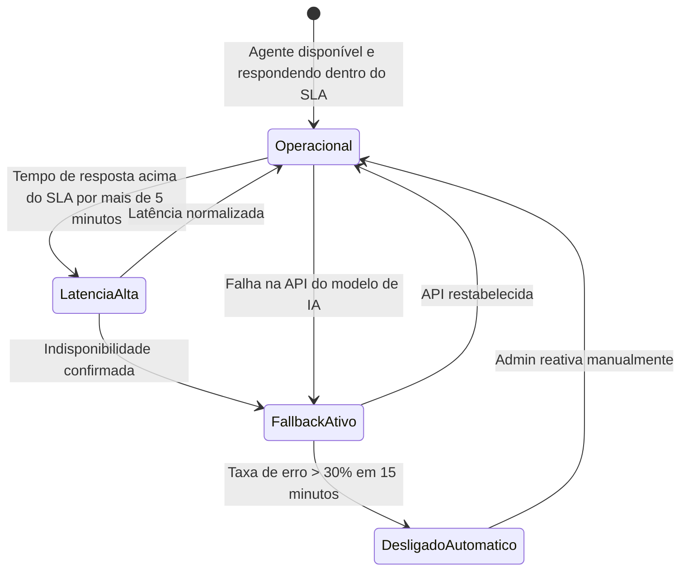

# 05.1 - PRD — Visão Geral e Módulo Segurança

| **Destinatário** | **Escopo** | **Versão** | **Responsável** | **Data da versão** |
|---|---|---|---|---|
| Equipe de Produto e Engenharia | PRD do agente AI-Dani-Cessionário — Parte 1/5: Visão Geral, Objetivos, Glossário e Módulo Segurança/Isolamento | v1.0 | Claude Code Desktop | 23/03/2026 (America/Fortaleza) |

---

> 📌 **TL;DR**
>
> - AI-Dani-Cessionário é a Analista de Oportunidades dedicada ao Cessionário na plataforma Repasse Seguro.
> - Cobre o ciclo completo: descoberta → análise → simulação → decisão → suporte.
> - Princípio de segurança inegociável: **isolamento total** — nenhum dado de Cedente ou de outro Cessionário é acessível.
> - Calculadora de Comissão é módulo determinístico independente da IA — funciona mesmo quando a Dani está indisponível.
> - PRD em 5 partes (05.1 a 05.5). Esta parte cobre Visão Geral + Módulo Segurança/Isolamento.
> - Rastreabilidade: cada RF mapeia para uma ou mais RNs do D01.

---

## 1. Visão Geral do Produto

### 1.1 O que é

AI-Dani-Cessionário é um agente conversacional especializado no Cessionário (investidor/comprador) da plataforma **Repasse Seguro**. A Dani é exibida na interface como "Dani", com persona de Analista de Oportunidades — experiente, precisa e orientada a dados.

### 1.2 Para quem

**Usuário primário:** Cessionário autenticado na plataforma Repasse Seguro.

**O que ele precisa:**
- Analisar oportunidades de repasse imobiliário antes de tomar uma decisão de investimento.
- Calcular comissão, custo total de Escrow e retorno esperado de forma rápida e confiável.
- Comparar múltiplas oportunidades para identificar a melhor relação retorno/risco.
- Simular valores de proposta e contraproposta sem precisar de uma planilha externa.
- Tirar dúvidas sobre regras e processos da plataforma.

### 1.3 Que problema resolve

O Cessionário hoje precisa fazer análise financeira de repasses imobiliários manualmente — usando planilhas, calculando Δ à mão, pesquisando valorização de empreendimentos. A Dani centraliza toda essa análise no contexto da plataforma, com dados reais do marketplace, em segundos.

### 1.4 Escopo de canais

| Canal | Fase | Status |
|---|---|---|
| Webchat integrado à plataforma (ícone fixo em todas as telas do Cessionário) | Fase 1 | MVP — Lançamento |
| WhatsApp Business via EvolutionAPI | Fase 2 | Pós-validação do webchat (critérios em RN-DC-040) |

### 1.5 O que a Dani NÃO faz

| Restrição | Motivo |
|---|---|
| Não acessa dados pessoais ou financeiros do Cedente | Isolamento de dados (RN-DC-002) |
| Não acessa dados de outros Cessionários | Isolamento de dados (RN-DC-002) |
| Não submete propostas em nome do Cessionário | Consentimento direto exigido (RN-DC-028) |
| Não fornece aconselhamento jurídico ou fiscal | Fora do escopo do agente (RN-DC-004) |
| Não aplica descontos na comissão | Exclusividade do Admin (RN-DC-013) |
| Não exibe score parcial ou estimado sem dados suficientes | Qualidade de análise (RN-DC-012) |

---

## 2. Objetivos e Métricas de Sucesso

| Objetivo | Métrica | Meta (Fase 1 — 90 dias) |
|---|---|---|
| Adoção | % de Cessionários ativos que abriram o chat ao menos 1x/semana | ≥ 30% |
| Satisfação | CSAT do webchat | ≥ 4,0 / 5 |
| Eficácia de análise | % de simulações completadas sem necessidade de fallback para a Calculadora | ≥ 85% |
| SLA | % de respostas dentro do SLA (≤ 5s para análise individual) | ≥ 95% |
| Fallback | Tempo médio de resolução de incidente de fallback | ≤ 30 minutos |
| Qualidade | Taxa de respostas com recusa de dados fora do escopo (sem vazar dados bloqueados) | 100% |

---

## 3. Glossário de Domínio

| Termo | Definição | Fonte |
|---|---|---|
| **Δ (Delta)** | Diferença entre Tabela Atual e Tabela Contrato. Base de cálculo da comissão | D01 seção 1 |
| **Calculadora de Comissão** | Módulo determinístico que calcula comissão, Escrow e ROI sem depender do modelo de IA. Fallback primário | D01 seção 1 |
| **Cedente** | Proprietário original do contrato imobiliário. Dados pessoais nunca expostos ao Cessionário | D01 seção 1 |
| **Cessionário** | Investidor ou comprador que adquire o repasse. Usuário-alvo da Dani | D01 seção 1 |
| **Comissão Comprador** | 20% × Δ (Δ > 0) ou 20% × Valor Pago pelo Cedente (Δ ≤ 0) | D01 seção 1 |
| **Dossiê** | Conjunto de documentos obrigatórios para validação do repasse | D01 seção 1 |
| **Envelope ZapSign** | Pacote de assinatura eletrônica para formalização do contrato de cessão | D01 seção 1 |
| **Escrow** | Conta garantia. Prazo padrão: 10 dias úteis. Extensão: +5 dias úteis com aprovação | D01 seção 1 |
| **KYC** | Verificação de identidade: documento (frente/verso) + selfie + comprovante de endereço ≤ 90 dias | D01 seção 1 |
| **OPR-XXXX-XXXX** | Código identificador único de uma oportunidade no marketplace | D01 seção 1 |
| **OTP** | Código de uso único, 6 dígitos, para vincular WhatsApp ao perfil do Cessionário | D01 seção 1 |
| **RBAC** | Controle de acesso por perfil — cada Cessionário acessa apenas os próprios dados | D01 seção 1 |
| **Score de Risco** | Avaliação de risco de 1 a 10, calculada pelo agente com base nos dados do marketplace | D01 seção 1 |
| **Tabela Atual** | Preço vigente do imóvel conforme tabela da incorporadora no momento da análise | D01 seção 1 |
| **Tabela Contrato** | Preço do imóvel na data do contrato original assinado pelo Cedente | D01 seção 1 |
| **Takeover** | Intervenção manual do Admin quando confiança da Dani < threshold configurado (padrão 80%) | D01 seção 1 |

---

## 4. Módulo 1 — Segurança e Isolamento de Dados

### 4.1 Visão geral do módulo

Este módulo define as regras de acesso a dados da Dani. É o módulo de maior criticidade — qualquer violação é tratada como incidente de segurança P0.

**RFs deste módulo:** RF-DC-001 a RF-DC-008

---

### RF-DC-001 — Escopo de dados acessíveis à Dani

**Origem:** RN-DC-001

**Descrição:** A Dani opera exclusivamente com dados do Cessionário autenticado.

**Critérios de aceite:**
- CA-001.1: Toda consulta da Dani é filtrada por `cessionario_id` antes de qualquer processamento.
- CA-001.2: A Dani acessa exclusivamente: oportunidades do marketplace (dados anonimizados do Cedente), propostas e negociações do próprio Cessionário, dados financeiros de Escrow e comissões do próprio Cessionário, dados públicos do empreendimento (localização, tipologia, valorização histórica), histórico de conversas do próprio Cessionário com a Dani.
- CA-001.3: Dados fora do escopo são bloqueados antes de chegarem ao modelo de IA.
- CA-001.4: Mensagem de recusa exibida em ≤ 2 segundos para dados fora do escopo.

**Impacto se violada:** Exposição de dados pessoais de terceiros, violação de LGPD, perda de confiança na plataforma.

---

### RF-DC-002 — Dados que a Dani nunca acessa

**Origem:** RN-DC-002

**Descrição:** Lista exaustiva de dados permanentemente bloqueados ao acesso da Dani.

**Critérios de aceite:**
- CA-002.1: A Dani nunca acessa: dados pessoais e financeiros de Cedentes (nome, CPF, contato, negociações, histórico).
- CA-002.2: A Dani nunca acessa o cenário escolhido pelo Cedente (A, B, C ou D).
- CA-002.3: A Dani nunca acessa propostas, negociações ou dados financeiros de outros Cessionários.
- CA-002.4: A Dani nunca acessa logs internos do Admin, decisões de moderação ou notas internas.
- CA-002.5: Se qualquer um desses dados seria necessário para responder, a Dani recusa e exibe mensagem padrão de restrição de perfil.

**Impacto se violada:** Vazamento de dados confidenciais, exposição de estratégias de outros investidores, risco jurídico severo.

---

### RF-DC-003 — Camadas de execução do isolamento

**Origem:** RN-DC-003

**Descrição:** O isolamento é implementado em três camadas independentes.

**Critérios de aceite:**
- CA-003.1: **Filtro de escopo:** toda consulta é filtrada pelo `cessionario_id` autenticado antes de chegar à Dani.
- CA-003.2: **Filtro de contexto:** as informações fornecidas ao modelo nunca incluem dados fora do escopo, mesmo que existam no banco.
- CA-003.3: **Reforço no system prompt:** as instruções permanentes da Dani explicitam os dados bloqueados com exemplos de recusa.
- CA-003.4: Se qualquer camada falhar, a Dani entra em modo de recusa total: "O serviço de análise está temporariamente indisponível. Tente novamente em instantes."
- CA-003.5: O campo de entrada permanece ativo durante a recusa total (não recarregar página).
- CA-003.6: Falha em qualquer camada de isolamento é tratada como incidente de segurança P0.

---

### RF-DC-004 — Mensagens padrão para dados bloqueados

**Origem:** RN-DC-004

**Descrição:** Cada tipo de dado bloqueado tem mensagem padrão específica.

**Critérios de aceite:**
- CA-004.1: As seguintes mensagens são exibidas conforme o dado solicitado:

| Dado solicitado | Mensagem obrigatória |
|---|---|
| Dados pessoais do Cedente (nome, CPF, contato) | "Essa informação não está disponível para o seu perfil. Para mais detalhes sobre a transação, entre em contato com o suporte via negociação." |
| Quantidade ou identidade de outros Cessionários interessados | "Não tenho acesso a informações sobre outros investidores interessados nesta oportunidade. Posso analisar os dados da oportunidade para você." |
| Cenário escolhido pelo Cedente (A, B, C ou D) | "O cenário do Cedente é confidencial e não impacta sua análise como investidor. Posso ajudá-lo a avaliar o retorno esperado desta oportunidade?" |
| Negociações de outros Cessionários | "Só tenho acesso às suas negociações e propostas. Quer que eu revise o andamento das suas?" |
| Garantia de resultado financeiro | "Essa é uma projeção baseada nos dados disponíveis. Resultados reais podem variar. Quer que eu mostre os cenários otimista, base e conservador?" |
| Conselho jurídico ou fiscal | "Para questões jurídicas ou fiscais, recomendo consultar um profissional especializado. Posso explicar o funcionamento da plataforma se ajudar." |
| Alteração de dados do perfil ou KYC | "Você pode atualizar seus dados em Meu Perfil > Dados Pessoais. Posso ajudá-lo com alguma análise de oportunidade enquanto isso?" |

- CA-004.2: Na 1ª e 2ª insistência em dado bloqueado: Dani repete a mensagem de recusa e oferece alternativa.
- CA-004.3: Na 3ª insistência consecutiva: Dani exibe a mensagem de recusa sem alternativas adicionais (evitar loop).

---

### RF-DC-005 — RBAC: Cessionário acessa apenas os próprios dados

**Origem:** RN-DC-001 (item RBAC implícito) + RN-DC-002

**Descrição:** Controle de acesso por perfil garante isolamento entre Cessionários.

**Critérios de aceite:**
- CA-005.1: Toda query ao banco de dados no contexto da Dani inclui `WHERE cessionario_id = {id_autenticado}`.
- CA-005.2: Tentativa de acesso a dados de outro Cessionário via manipulação de parâmetros retorna erro 403.
- CA-005.3: O guard `CessionarioOwnerGuard` é aplicado em todos os endpoints da Dani.

---

### RF-DC-006 — Takeover pelo Admin

**Origem:** RN-DC-001 (glossário — Takeover)

**Descrição:** O Admin pode intervir manualmente em uma conversa quando a confiança da Dani está abaixo do threshold.

**Critérios de aceite:**
- CA-006.1: Threshold padrão de confiança: 80%.
- CA-006.2: Quando confiança < threshold, alerta é enviado ao Admin.
- CA-006.3: Admin pode assumir a conversa diretamente sem interrupção visível ao Cessionário.
- CA-006.4: O threshold é configurável pelo Admin (não hardcoded).

---

### RF-DC-007 — Modo de recusa total por falha de isolamento

**Origem:** RN-DC-003 (item 2)

**Descrição:** Comportamento da Dani quando qualquer camada de isolamento falha.

**Critérios de aceite:**
- CA-007.1: Exibir: "O serviço de análise está temporariamente indisponível. Tente novamente em instantes."
- CA-007.2: Campo de entrada de texto permanece ativo (usuário pode tentar novamente sem recarregar).
- CA-007.3: Evento de falha é registrado como incidente P0 nos logs.
- CA-007.4: Alerta automático enviado ao Admin via canal de monitoramento.

---

### RF-DC-008 — Princípio de menor privilégio no system prompt

**Origem:** RN-DC-003 (item 2.3)

**Descrição:** O system prompt da Dani reforça explicitamente os dados bloqueados.

**Critérios de aceite:**
- CA-008.1: O system prompt inclui lista explícita de dados que nunca devem ser mencionados ou processados.
- CA-008.2: O system prompt inclui exemplos de recusa para cada tipo de dado bloqueado (conforme RF-DC-004).
- CA-008.3: O system prompt inclui instrução explícita de não submeter propostas (conforme RF-DC-028 — ver 05.4).
- CA-008.4: O system prompt é versionado e armazenado como código (não em banco de dados ou variável de ambiente).

---

## 5. Diagrama de Estados do Agente

---

## Changelog

| Data | Versão | Descrição |
|---|---|---|
| 23/03/2026 | v1.0 | Versão inicial — PRD Parte 1/5. Visão Geral, Objetivos, Glossário e Módulo Segurança/Isolamento (RF-DC-001 a RF-DC-008). |
