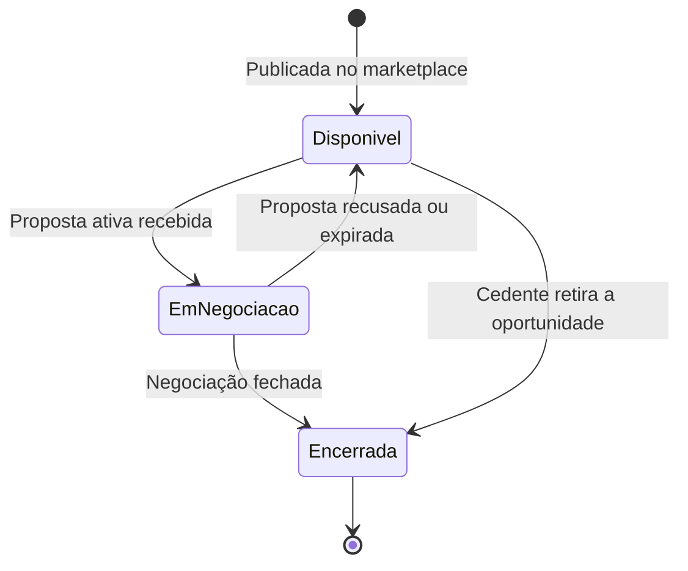
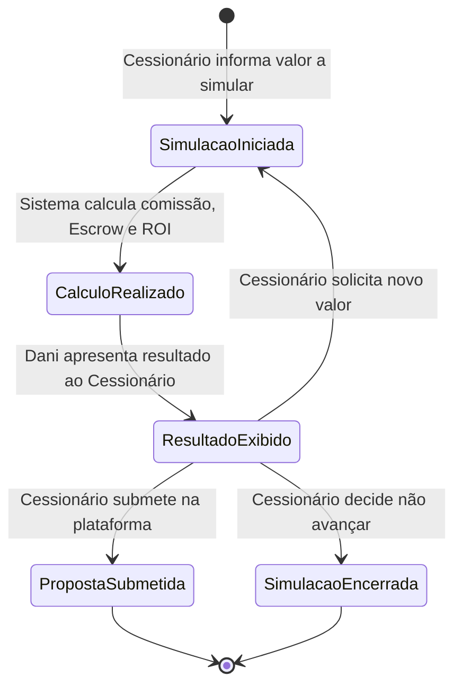

# 05.2 - PRD — Acesso, Análise e Cálculos

| **Destinatário** | **Escopo** | **Versão** | **Responsável** | **Data da versão** |
|---|---|---|---|---|
| Equipe de Produto e Engenharia | PRD do agente AI-Dani-Cessionário — Parte 2/5: Módulos de Acesso/Onboarding, Análise Individual e Cálculos | v1.0 | Claude Code Desktop | 23/03/2026 (America/Fortaleza) |

---

> 📌 **TL;DR**
>
> - Esta parte cobre: acesso ao chat (onboarding, KYC, pontos de entrada, herança de sessão, starters) + análise de oportunidade individual + cálculos determinísticos (comissão, Escrow, ROI).
> - RFs cobertos: RF-DC-009 a RF-DC-022.
> - Calculadora de Comissão é módulo separado — executa sempre, mesmo sem IA disponível.
> - Aviso de projeção ROI é obrigatório e não pode ser omitido (RN-DC-017).

---

## 4. Módulo 2 — Acesso e Onboarding

### RF-DC-009 — Mensagem de boas-vindas no primeiro acesso

**Origem:** RN-DC-005

**Descrição:** A Dani exibe mensagem personalizada conforme o estado do KYC e disponibilidade de oportunidades.

**Critérios de aceite:**
- CA-009.1: Trigger: Cessionário abre o chat sem histórico de conversas.
- CA-009.2: Se KYC aprovado + há oportunidades: exibir "Olá! Sou a Dani, sua Analista de Oportunidades. Posso analisar riscos, comparar imóveis e simular retornos para você. Como posso ajudar?" + sugestões de conversa (RF-DC-012). Mensagem com fade-in 300ms.
- CA-009.3: Se KYC pendente: boas-vindas + "Para acessar todas as análises, você precisa concluir sua verificação de identidade. Acesse Meu Perfil > Verificação de Identidade para continuar." Com link clicável para a tela correspondente.
- CA-009.4: Se não há oportunidades no marketplace: informar e oferecer botão "Ativar alertas" como ação rápida.

---

### RF-DC-010 — Pontos de entrada do chat

**Origem:** RN-DC-006

**Descrição:** Três pontos de entrada distintos com comportamentos diferentes.

**Critérios de aceite:**
- CA-010.1: **Ponto de entrada 1 — Tela de Oportunidade:** ao clicar em "Consultar Dani", o sistema carrega automaticamente os dados da oportunidade (código OPR, valores, localização) como contexto inicial da conversa.
- CA-010.2: **Ponto de entrada 2 — Dashboard:** widget "Oportunidades em Destaque" com Top 3 recomendadas pela Dani visível diretamente no dashboard.
- CA-010.3: **Ponto de entrada 3 — FAB global:** ícone fixo em qualquer tela do módulo Cessionário. Chat abre sem contexto específico. FAB exibe badge numérica quando há alertas proativos não lidos.
- CA-010.4: O FAB é exibido em todas as telas do módulo Cessionário sem exceção.

---

### RF-DC-011 — Autenticação por herança de sessão

**Origem:** RN-DC-007

**Descrição:** A Dani herda a sessão da plataforma sem exigir novo login.

**Critérios de aceite:**
- CA-011.1: Se há sessão ativa na plataforma: a Dani herda automaticamente sem novo login.
- CA-011.2: Se não há sessão ativa: redirecionar para tela de login. Após login bem-sucedido, retornar ao chat preservando o ponto de entrada original.
- CA-011.3: O JWT da sessão da plataforma é validado no guard da Dani antes de qualquer endpoint.

---

### RF-DC-012 — Sugestões de conversa (conversation starters)

**Origem:** RN-DC-008

**Descrição:** Quando o chat abre sem oportunidade pré-carregada, exibir 4 sugestões.

**Critérios de aceite:**
- CA-012.1: Exibir exatamente as seguintes sugestões como chips/botões de ação rápida:
  1. "Quais são as melhores oportunidades para mim hoje?"
  2. "Tenho R$ 500.000 para investir. O que recomenda?"
  3. "Me explica como funciona a comissão do comprador."
  4. "Qual o prazo para depósito em Escrow?"
- CA-012.2: Ao clicar em uma sugestão, o texto é enviado automaticamente como mensagem do Cessionário.
- CA-012.3: As sugestões desaparecem após o primeiro envio de mensagem (seja via sugestão ou digitação manual).

---

## 5. Módulo 3 — Análise de Oportunidade Individual

### RF-DC-013 — Estados da oportunidade visíveis à Dani

**Origem:** RN-DC-011 (seção 5.1 do D01)

**Descrição:** A Dani trabalha com três estados de oportunidade.

**Critérios de aceite:**
- CA-013.1: Estado **Disponível:** oportunidade publicada no marketplace, disponível para análise e proposta.
- CA-013.2: Estado **Em negociação:** oportunidade com proposta ativa de outro Cessionário — identidade do outro Cessionário nunca revelada.
- CA-013.3: Estado **Encerrada:** oportunidade fora do marketplace.

---

### RF-DC-014 — Análise completa de oportunidade individual

**Origem:** RN-DC-011

**Descrição:** A Dani apresenta análise estruturada de uma oportunidade quando solicitada.

**Critérios de aceite:**
- CA-014.1: Trigger: Cessionário solicita análise de oportunidade específica (via tela ou código OPR no chat).
- CA-014.2: Se disponível, a Dani apresenta obrigatoriamente:
  1. **Δ (Delta):** diferença entre Tabela Atual e Tabela Contrato, em reais.
  2. **Comissão do comprador:** calculada conforme RF-DC-018.
  3. **Custo total:** Preço Repasse + Comissão (total a depositar no Escrow).
  4. **Retorno estimado:** ROI projetado conforme RF-DC-022, com cenários otimista, base e conservador.
  5. **Score de risco:** avaliação de 1 a 10 com justificativa. Indicador visual: verde (1–3), amarelo (4–6), vermelho (7–10). Contraste mínimo 4.5:1, rótulo textual acessível.
  6. **Comparativo regional:** contexto em relação ao mercado da mesma região. Se dados insuficientes, informar explicitamente.
  7. **Gráfico de valorização:** histórico do empreendimento. No WhatsApp (Fase 2), substituir por tabela textual.
- CA-014.3: Se em negociação com outro Cessionário: informar status + oferecer notificação quando voltar a estar disponível. Badge "Em negociação" (cor laranja).
- CA-014.4: Se encerrada: badge "Encerrada" (cor cinza) + até 3 sugestões de oportunidades semelhantes como chips com código OPR.
- CA-014.5: Se não existe: "Não encontrei esta oportunidade no marketplace. Verifique o código e tente novamente, ou posso buscar oportunidades disponíveis para você."
- CA-014.6: A análise é registrada no histórico de conversas do Cessionário.

---

### RF-DC-015 — Score de risco da oportunidade

**Origem:** RN-DC-012

**Descrição:** A Dani calcula e exibe score de risco de 1 a 10.

**Critérios de aceite:**
- CA-015.1: Se há dados suficientes: apresentar score de 1 a 10 com justificativa listando os fatores considerados (ex: valorização, localização, tempo de mercado). Fatores exibidos como lista compacta abaixo do score.
- CA-015.2: Se dados insuficientes: "Os dados disponíveis desta oportunidade não são suficientes para calcular um score de risco preciso. Recomendo solicitar o dossiê completo antes de decidir."
- CA-015.3: A Dani **não** exibe score parcial ou estimado — ausência de score é comunicada explicitamente.
- CA-015.4: Indicadores visuais: verde (1–3 risco baixo), amarelo (4–6 risco moderado), vermelho (7–10 risco alto). Contraste mínimo 4.5:1 e aria-label para screen readers.

---

## 6. Módulo 4 — Cálculos Determinísticos

### 6.1 Fórmulas de negócio

| Cálculo | Fórmula | Condição |
|---|---|---|
| Comissão padrão | 20% × Δ | Δ > 0 |
| Comissão fallback | 20% × Valor Pago pelo Cedente | Δ ≤ 0 |
| Custo total Escrow | Preço Repasse + Comissão | Sempre |
| ROI projetado | (Tabela Atual − Custo Total) ÷ Custo Total × 100 | Sempre |

> ⚙️ **Estes cálculos são determinísticos.** Não dependem da IA. A Calculadora de Comissão deve executá-los mesmo quando a Dani está indisponível.

---

### RF-DC-016 — Formatação de valores monetários

**Origem:** RN-DC-013 (item 5)

**Descrição:** Padrão de formatação obrigatório para todos os valores monetários exibidos.

**Critérios de aceite:**
- CA-016.1: Todos os valores monetários formatados com separador de milhar e duas casas decimais: `R$ 30.000,00`.
- CA-016.2: Formato aplicado em comissão, custo total, ROI (em reais), Δ e qualquer valor financeiro exibido pela Dani.

---

### RF-DC-017 — Cálculo de comissão do comprador

**Origem:** RN-DC-013

**Descrição:** Cálculo determinístico da comissão do comprador.

**Critérios de aceite:**
- CA-017.1: Se Δ > 0: comissão = 20% × Δ.
- CA-017.2: Se Δ ≤ 0: comissão = 20% × Valor Pago pelo Cedente. A Dani exibe nota: "Como a Tabela Atual não é superior à Tabela Contrato, a comissão é calculada sobre o Valor Pago pelo Cedente."
- CA-017.3: Descontos por faixa são aplicados exclusivamente pelo Admin — a Dani não aplica descontos sem autorização registrada na oportunidade.
- CA-017.4: A Dani exibe: "A comissão sobre esta proposta é de R$ [valor]. Esse valor é calculado sobre [base de cálculo utilizada]."
- CA-017.5: Valores monetários formatados conforme RF-DC-016.

---

### RF-DC-018 — Cálculo do custo total de Escrow

**Origem:** RN-DC-014

**Descrição:** Custo total que o Cessionário deve depositar no Escrow.

**Critérios de aceite:**
- CA-018.1: Fórmula: Custo Total = Preço Repasse + Comissão.
- CA-018.2: A Dani exibe: "Para esta proposta, o valor total a depositar no Escrow é de R$ [valor total] — sendo R$ [preço repasse] pelo repasse e R$ [comissão] de comissão."
- CA-018.3: Se o Cessionário propõe valor diferente do preço de tabela: recalcular usando o novo valor como Preço Repasse.

---

### RF-DC-019 — Simulação de custos para uma proposta

**Origem:** RN-DC-016

**Descrição:** A Dani simula comissão, Escrow e ROI para um valor de proposta informado.

**Critérios de aceite:**
- CA-019.1: Trigger: Cessionário informa valor que pretende propor.
- CA-019.2: Se valor válido (número positivo): a Dani executa simulação e apresenta: comissão calculada, depósito total no Escrow, ROI projetado com cenários otimista, base e conservador.
- CA-019.3: Se valor inválido (não numérico, zero ou negativo): "O valor informado não é válido. Por favor, informe um valor em reais maior que zero para a simulação." Campo permanece ativo para nova tentativa.
- CA-019.4: A Dani encerra com botões de ação rápida: "Simular outro valor" e "Ir para a oportunidade".
- CA-019.5: A Dani **não** submete a proposta em nome do Cessionário — ver RF-DC-028.

---

### RF-DC-020 — Cálculo de ROI com cenários de investimento

**Origem:** RN-DC-017

**Descrição:** ROI apresentado em três cenários obrigatórios.

**Critérios de aceite:**
- CA-020.1: Fórmula: ROI = (Tabela Atual − Custo Total) ÷ Custo Total × 100.
- CA-020.2: Apresentar três cenários baseados em variações de ±20% da valorização estimada:
  - **Conservador:** valorização 20% abaixo da estimativa base. Ícone de escudo, cor neutra.
  - **Base:** valorização conforme estimativa disponível. Ícone de alvo, cor padrão. Visualmente destacado como referência principal.
  - **Otimista:** valorização 20% acima da estimativa base. Ícone de tendência ascendente, cor de destaque.
- CA-020.3: Aviso obrigatório — **nunca pode ser omitido ou ocultado:** "Esses são valores projetados com base nos dados disponíveis. Resultados reais podem variar conforme condições de mercado." Exibido em corpo de texto menor com ícone de informação (i).

---

### RF-DC-021 — Simulação de contraproposta

**Origem:** RN-DC-018

**Descrição:** Simulação de valores de contraproposta em negociação ativa.

**Critérios de aceite:**
- CA-021.1: Trigger: Cessionário em negociação ativa solicita simulação de valor de contraproposta.
- CA-021.2: Se há negociação ativa: calcular e apresentar nova comissão, novo Escrow, diferença em relação à proposta anterior (seta verde para baixo = economia, seta vermelha para cima = acréscimo, com valor absoluto e percentual), ROI ajustado com três cenários.
- CA-021.3: Se não há negociação ativa: "Não encontrei uma negociação ativa para simular a contraproposta. Quer que eu simule uma proposta inicial para alguma oportunidade disponível?"
- CA-021.4: Encerrar com próximo passo: "Quando decidir o valor, acesse a tela de negociação na plataforma para submeter a contraproposta."

---

---

## 7. Módulo 5 — Base de Conhecimento

### RF-DC-022 — Resposta a perguntas sobre regras da plataforma

**Origem:** RN-DC-022

**Descrição:** A Dani responde dúvidas sobre processos e regras da plataforma.

> **Nota de reclassificação:** RF-DC-022 foi movido do bloco "Cálculos Determinísticos" para o bloco "Base de Conhecimento" — trata-se de capacidade de FAQ/conhecimento, não de cálculo determinístico.

**Critérios de aceite:**
- CA-022.1: Tópicos cobertos:
  - **KYC:** documentos exigidos, prazo de análise (≤ 30min automatizado / ≤ 2 dias úteis manual), motivos comuns de rejeição.
  - **Escrow:** o que é, como funciona, prazo padrão de 10 dias úteis, como solicitar extensão de +5 dias úteis.
  - **Assinatura eletrônica:** o que é o Envelope ZapSign, como funciona, prazo de assinatura (5 dias úteis).
  - **Fechamento:** etapas do processo após aceite da proposta.
  - **Status de proposta e negociação:** significado de cada status.
- CA-022.2: Prazos operacionais que a Dani conhece:
  - Depósito em Escrow: 10 dias úteis após aceite.
  - Extensão de Escrow: +5 dias úteis (consulta ao Cedente 24h; silêncio = aprovação; confirmação do Admin).
  - Reversão do Escrow: 15 dias corridos se negociação não concluída.
  - Assinatura ZapSign: 5 dias úteis. Lembretes em D+2 e D+4. Expiração em D+5.
  - KYC automatizado: ≤ 30 minutos. KYC manual: ≤ 2 dias úteis. Cessionário pode navegar mas não enviar propostas durante análise.
- CA-022.3: Se fora do escopo (jurídica, fiscal, específica de contrato individual): exibir mensagem de redirecionamento com link para o canal de suporte relevante.

---

## Changelog

| Data | Versão | Descrição |
|---|---|---|
| 23/03/2026 | v1.0 | Versão inicial — PRD Parte 2/5. Módulo Acesso/Onboarding (RF-DC-009 a RF-DC-012) + Análise Individual (RF-DC-013 a RF-DC-015) + Cálculos Determinísticos (RF-DC-016 a RF-DC-022). |
