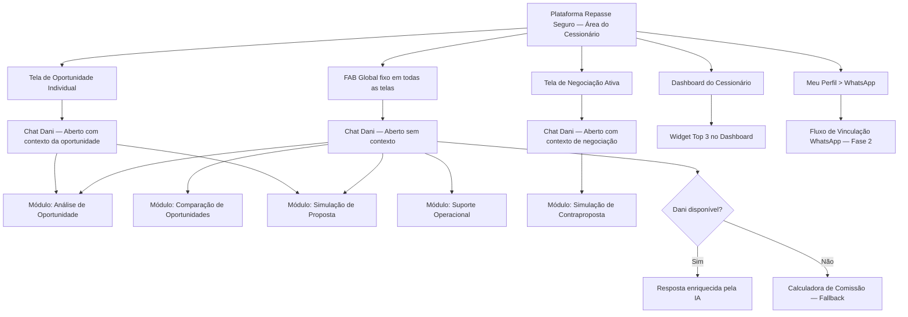
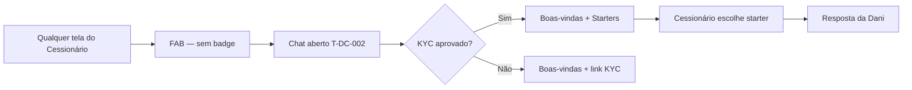
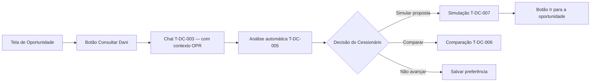
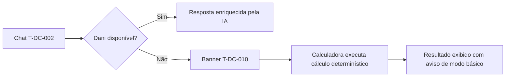
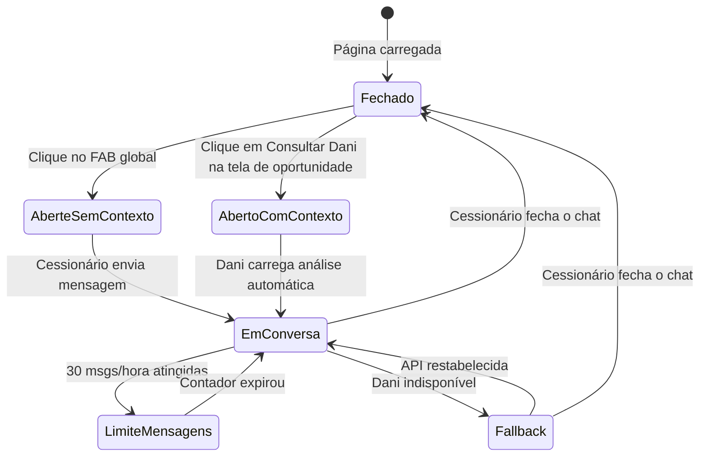

# 06 - Mapa de Telas

| **Destinatário** | **Escopo** | **Versão** | **Responsável** | **Data da versão** |
|---|---|---|---|---|
| Equipe de Produto, Design e Engenharia | Mapa completo de telas e componentes do agente AI-Dani-Cessionário | v1.0 | Claude Code Desktop | 23/03/2026 (America/Fortaleza) |

---

> 📌 **TL;DR**
>
> - O AI-Dani-Cessionário não tem telas próprias — é um módulo de chat que se integra às telas existentes do Cessionário.
> - **3 pontos de entrada:** Tela de Oportunidade, Dashboard, FAB global (RN-DC-006).
> - **9 estados/telas do agente:** Chat fechado (FAB), Chat aberto (vazio), Chat com oportunidade carregada, Análise de oportunidade, Comparação de oportunidades, Simulação, Top 3 no Dashboard, Fallback da Calculadora, Vinculação WhatsApp.
> - Todas as telas do Cessionário exibem o FAB global — sem exceção.
> - WhatsApp (Fase 2): sem tela própria — canal textual via EvolutionAPI.

---

## 1. Arquitetura de Integração

O AI-Dani-Cessionário é um **módulo de chat sobreposto** que opera sobre as telas existentes da plataforma Repasse Seguro. Não há navegação autônoma — a Dani flutua sobre o contexto do Cessionário.

---

## 2. Inventário de Telas e Componentes

### T-DC-001 — FAB Global (Floating Action Button)

| Atributo | Valor |
|---|---|
| Tipo | Componente flutuante, não tela |
| Presente em | Todas as telas do módulo Cessionário, sem exceção |
| Posição | `position: fixed; bottom: 24px; right: 24px; z-index: 9999` |
| Estado padrão | Ícone da Dani. Sem badge quando não há alertas |
| Estado com alertas | Badge numérica em canto superior direito (cor `--destructive`) |
| Ação | Abre o Chat (T-DC-002 ou T-DC-003, dependendo do contexto) |
| Fonte | RN-DC-006 (ponto de entrada 3) |

---

### T-DC-002 — Chat da Dani (Aberto — Sem Contexto)

| Atributo | Valor |
|---|---|
| Tipo | Overlay / Panel deslizante |
| Trigger | Clique no FAB global (quando não há oportunidade/negociação carregada) |
| Dimensões | 400px largura × 600px altura (desktop); 100vw × 100dvh (mobile ≤ 640px) |
| Posição | Fixo no canto inferior direito, acima do FAB |
| Componentes obrigatórios | Header com nome "Dani" + avatar; área de mensagens; input bar; botão fechar |
| Estado inicial (primeiro acesso) | Mensagem de boas-vindas (RF-DC-009) + 4 conversation starters (RF-DC-012) |
| Estado inicial (acesso subsequente) | Histórico de conversas carregado (últimas 90 dias) |
| Estado KYC pendente | Boas-vindas + link para completar KYC |
| Estado sem oportunidades | Boas-vindas + botão "Ativar alertas" |
| Fonte | RN-DC-005, RN-DC-006, RN-DC-008 |

---

### T-DC-003 — Chat da Dani (Aberto — Com Contexto de Oportunidade)

| Atributo | Valor |
|---|---|
| Tipo | Overlay / Panel deslizante |
| Trigger | Clique em "Consultar Dani" na Tela de Oportunidade |
| Contexto pré-carregado | Código OPR, valores, localização da oportunidade — injetado como contexto inicial |
| Diferença de T-DC-002 | A Dani já conhece a oportunidade e pode iniciar a análise imediatamente sem o Cessionário precisar informar o OPR |
| Fonte | RN-DC-006 (ponto de entrada 1) |

---

### T-DC-004 — Chat da Dani (Aberto — Com Contexto de Negociação)

| Atributo | Valor |
|---|---|
| Tipo | Overlay / Panel deslizante |
| Trigger | FAB na Tela de Negociação Ativa (herda o contexto automaticamente) |
| Contexto pré-carregado | Dados da negociação ativa: valor proposto, status, OPR |
| Módulo ativado | Simulação de Contraproposta (RF-DC-021) |
| Fonte | RN-DC-018, RN-DC-027 |

---

### T-DC-005 — Módulo: Análise de Oportunidade Individual (inline no chat)

| Atributo | Valor |
|---|---|
| Tipo | Resposta estruturada inline no chat (não tela separada) |
| Trigger | Cessionário solicita análise de uma oportunidade específica |
| Componentes exibidos | Card da oportunidade com: Δ, Comissão, Custo total, Score de risco (badge colorido), ROI (3 cenários), Comparativo regional, Gráfico de valorização |
| Badge de status | Disponível (verde) / Em negociação (laranja) / Encerrada (cinza) |
| Ações rápidas | "Simular proposta" / "Comparar com similares" / "Salvar para alertas" |
| Fonte | RN-DC-011, RN-DC-012 |

---

### T-DC-006 — Módulo: Comparação de Oportunidades (inline no chat)

| Atributo | Valor |
|---|---|
| Tipo | Tabela comparativa inline no chat |
| Trigger | Cessionário solicita comparação de 2 a 5 oportunidades |
| Colunas obrigatórias | OPR, Δ, Comissão, Custo total Escrow, Score de risco, Localização, Tipologia |
| Linha "Melhor opção" | Badge destacado em `--primary` |
| Linha clicável | Abre análise detalhada (T-DC-005) da oportunidade correspondente |
| Estado > 5 oportunidades | Mensagem de limite com prompt de refinamento |
| Fonte | RN-DC-015 |

---

### T-DC-007 — Módulo: Simulação de Proposta (inline no chat)

| Atributo | Valor |
|---|---|
| Tipo | Resultado de simulação inline no chat |
| Trigger | Cessionário informa valor de proposta |
| Componentes exibidos | Comissão calculada, Depósito total no Escrow, ROI com 3 cenários, Aviso de projeção obrigatório |
| Ações rápidas | "Simular outro valor" / "Ir para a oportunidade" |
| Estado valor inválido | Mensagem de erro + campo permanece ativo |
| Fonte | RN-DC-016 |

---

### T-DC-008 — Módulo: Simulação de Contraproposta (inline no chat)

| Atributo | Valor |
|---|---|
| Tipo | Resultado de simulação inline no chat |
| Trigger | Cessionário em negociação ativa informa valor de contraproposta |
| Componentes exibidos | Nova comissão, Novo Escrow, Diferença em relação à proposta anterior (seta indicativa), ROI ajustado (3 cenários) |
| Ação | "Ir para tela de negociação" (botão) |
| Fonte | RN-DC-018, RN-DC-027 |

---

### T-DC-009 — Widget Top 3 no Dashboard

| Atributo | Valor |
|---|---|
| Tipo | Widget integrado no Dashboard do Cessionário |
| Posição | Seção "Oportunidades em Destaque" no Dashboard |
| Componentes | 3 cards de oportunidade: Δ, comissão estimada, score de risco, localização |
| Estado perfil incompleto | Banner "Recomendações baseadas em dados gerais. Complete seu perfil." com link |
| Estado sem oportunidades | Mensagem informativa + botão "Ativar alertas" |
| Fonte | RN-DC-006 (ponto de entrada 2), RN-DC-021 |

---

### T-DC-010 — Banner de Fallback da Calculadora

| Atributo | Valor |
|---|---|
| Tipo | Banner contextual inline no chat |
| Quando exibido | Quando a Dani está indisponível e o resultado é da Calculadora de Comissão |
| Texto | "Modo básico — sem análise da IA" |
| Cor | `--agent-fallback` (azul informativo — ver D09 seção 2.5 para valor hex; não equivale a `--primary`) | [CORRIGIDO: PROBLEMA-010]
| Ações disponíveis | Copiar valores, solicitar novo cálculo (tudo funcional normalmente) |
| Fonte | RN-DC-023 |

---

### T-DC-011 — Estado de Rate Limit do Chat

| Atributo | Valor |
|---|---|
| Tipo | Estado do componente de input do chat |
| Quando exibido | Após atingir 30 mensagens/hora (RN-DC-025) |
| Visual | Input desabilitado (fundo cinza, cursor bloqueado) + botão enviar inativo + contador regressivo (mm:ss) |
| Reativação | Pulse 500ms ao desbloquear |
| Fonte | RN-DC-025 |

---

### T-DC-012 — Vinculação WhatsApp (Fase 2)

| Atributo | Valor |
|---|---|
| Tipo | Seção em Meu Perfil > WhatsApp |
| Tela pai | Meu Perfil (existente na plataforma) |
| Etapas | 1. Informar número + validação em tempo real; 2. Inserir OTP SMS (com rate limit e hard block); 3. Confirmar código enviado ao WhatsApp |
| Estado vinculado | Número exibido mascarado + botão "Desvincular" |
| Estado não vinculado | Campo de número + botão "Vincular" |
| Desvinculação | Modal de confirmação (plataforma) ou comando PARAR (WhatsApp) |
| Fonte | RN-DC-040, RN-DC-041, RN-DC-042, RN-DC-044 |

---

## 3. Mapa de Telas por Jornada

### 3.1 Jornada: Primeiro acesso ao chat

### 3.2 Jornada: Análise de oportunidade

### 3.3 Jornada: Fallback da Calculadora

---

## 4. Fluxo de Estados do Chat

---

## 5. Resumo do Inventário

| ID | Nome | Tipo | Fase |
|---|---|---|---|
| T-DC-001 | FAB Global | Componente flutuante | Fase 1 |
| T-DC-002 | Chat Aberto (sem contexto) | Overlay/Panel | Fase 1 |
| T-DC-003 | Chat Aberto (com contexto de oportunidade) | Overlay/Panel | Fase 1 |
| T-DC-004 | Chat Aberto (com contexto de negociação) | Overlay/Panel | Fase 1 |
| T-DC-005 | Módulo Análise de Oportunidade | Resposta inline | Fase 1 |
| T-DC-006 | Módulo Comparação de Oportunidades | Tabela inline | Fase 1 |
| T-DC-007 | Módulo Simulação de Proposta | Resultado inline | Fase 1 |
| T-DC-008 | Módulo Simulação de Contraproposta | Resultado inline | Fase 1 |
| T-DC-009 | Widget Top 3 no Dashboard | Widget embarcado | Fase 1 |
| T-DC-010 | Banner de Fallback | Banner contextual | Fase 1 |
| T-DC-011 | Estado de Rate Limit | Estado do input | Fase 1 |
| T-DC-012 | Vinculação WhatsApp | Seção em Meu Perfil | Fase 2 |

**Total: 12 telas/componentes (11 na Fase 1 + 1 na Fase 2)**

---

## Changelog

| Data | Versão | Descrição |
|---|---|---|
| 23/03/2026 | v1.0 | Versão inicial. 12 telas/componentes mapeados. Diagrama de integração, inventário completo, jornadas de usuário e fluxo de estados. |
