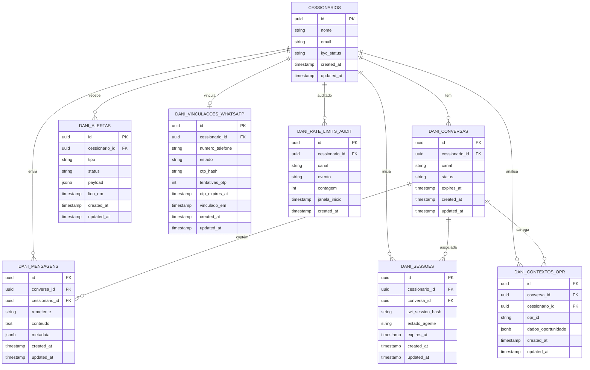

# 12 - Modelo de Dados (ERD Schema)

| **Destinatário** | **Escopo** | **Versão** | **Responsável** | **Data da versão** |
|---|---|---|---|---|
| Engenharia (Backend + DBA) | Modelo de dados do agente AI-Dani-Cessionário — tabelas, relacionamentos e convenções | v1.0 | Claude Code Desktop | 23/03/2026 (America/Fortaleza) |

---

> 📌 **TL;DR**
>
> - **7 tabelas principais:** `dani_conversas`, `dani_mensagens`, `dani_sessoes`, `dani_contextos_opr`, `dani_alertas`, `dani_vinculacoes_whatsapp`, `dani_rate_limits`.
> - Todas as tabelas com UUID v4 como PK e colunas `created_at` / `updated_at` obrigatórias (padrão ShiftLabs).
> - Isolamento garantido em nível de schema: toda tabela com `cessionario_id` como FK + índice composto.
> - Tabelas são de propriedade do módulo da Dani — fazem referência a `cessionarios` da plataforma principal (FK externa).
> - Histórico de mensagens: retenção 90 dias via coluna `expires_at` + job de limpeza.
> - `dani_rate_limits` é auxiliar — estado real em Redis (TTL). Tabela para auditoria apenas.

---

## 1. Convenções de Banco de Dados

Seguem o padrão ShiftLabs Stacks v7.1 (D02):

| Convenção | Regra |
|---|---|
| Primary Keys | UUID v4: `id String @id @default(uuid()) @db.Uuid` |
| Colunas de auditoria | `created_at DateTime @default(now()) @db.Timestamptz` e `updated_at DateTime @updatedAt @db.Timestamptz` obrigatórias em toda tabela |
| Nomenclatura de tabelas | `snake_case`, plural, prefixo `dani_` para tabelas do módulo |
| Nomenclatura de colunas | `snake_case` |
| FKs | `{tabela_referenciada}_id` (ex: `cessionario_id`) |
| Soft delete | `deleted_at DateTime? @db.Timestamptz` — tabelas com dados do Cessionário |
| Índices | Sempre em colunas de FK + colunas de filtro frequente |
| Enum | Declarado no schema Prisma, mapeado para `text` no PostgreSQL |

---

## 2. ERD Completo



---

## 3. Descrição Detalhada das Tabelas

### 3.1 `dani_conversas`

Representa uma sessão de conversa do Cessionário com a Dani.

| Coluna | Tipo | Nullable | Descrição |
|---|---|---|---|
| `id` | UUID | NOT NULL | PK — UUID v4 |
| `cessionario_id` | UUID | NOT NULL | FK → `cessionarios.id`. RBAC: toda consulta filtra por esta coluna |
| `canal` | TEXT | NOT NULL | `WEBCHAT` ou `WHATSAPP` |
| `status` | TEXT | NOT NULL | `ATIVA`, `ENCERRADA`, `EXPIRADA` |
| `expires_at` | TIMESTAMPTZ | NOT NULL | Data de expiração para limpeza (created_at + 90 dias) |
| `created_at` | TIMESTAMPTZ | NOT NULL | Automático |
| `updated_at` | TIMESTAMPTZ | NOT NULL | Automático |

**Índices:**
- `idx_dani_conversas_cessionario_id` em `(cessionario_id)`
- `idx_dani_conversas_expires_at` em `(expires_at)` — para job de limpeza
- `idx_dani_conversas_cessionario_canal` em `(cessionario_id, canal)` — para histórico por canal

---

### 3.2 `dani_mensagens`

Armazena todas as mensagens da conversa (Cessionário e Dani).

| Coluna | Tipo | Nullable | Descrição |
|---|---|---|---|
| `id` | UUID | NOT NULL | PK — UUID v4 |
| `conversa_id` | UUID | NOT NULL | FK → `dani_conversas.id` |
| `cessionario_id` | UUID | NOT NULL | FK redundante para consultas rápidas com filtro RBAC |
| `remetente` | TEXT | NOT NULL | `CESSIONARIO`, `DANI`, `SISTEMA`, `CALCULADORA` |
| `conteudo` | TEXT | NOT NULL | Texto da mensagem |
| `metadata` | JSONB | NULL | Dados estruturados: tipo de resposta (análise, simulação, comparação), IDs de OPR, valores calculados, confiança do modelo, latency_ms |
| `created_at` | TIMESTAMPTZ | NOT NULL | Automático |
| `updated_at` | TIMESTAMPTZ | NOT NULL | Automático |

**Índices:**
- `idx_dani_mensagens_conversa_id` em `(conversa_id)`
- `idx_dani_mensagens_cessionario_id` em `(cessionario_id)`
- `idx_dani_mensagens_conversa_created` em `(conversa_id, created_at DESC)` — para paginação do histórico

**Retenção:** Limpeza automática via job que deleta registros onde `conversas.expires_at < NOW()`.

---

### 3.3 `dani_sessoes`

Rastreia o estado operacional da Dani por sessão de conversa.

| Coluna | Tipo | Nullable | Descrição |
|---|---|---|---|
| `id` | UUID | NOT NULL | PK — UUID v4 |
| `cessionario_id` | UUID | NOT NULL | FK → `cessionarios.id` |
| `conversa_id` | UUID | NOT NULL | FK → `dani_conversas.id` |
| `jwt_session_hash` | TEXT | NOT NULL | Hash do JWT da sessão da plataforma (não armazena token completo) |
| `estado_agente` | TEXT | NOT NULL | `OPERACIONAL`, `FALLBACK`, `DESLIGADO` |
| `expires_at` | TIMESTAMPTZ | NOT NULL | Expiração da sessão (alinhado com TTL do JWT) |
| `created_at` | TIMESTAMPTZ | NOT NULL | Automático |
| `updated_at` | TIMESTAMPTZ | NOT NULL | Automático |

**Índices:**
- `idx_dani_sessoes_cessionario_id` em `(cessionario_id)`
- `idx_dani_sessoes_conversa_id` em `(conversa_id)`

---

### 3.4 `dani_contextos_opr`

Armazena o contexto de oportunidade carregado em uma conversa (ponto de entrada T-DC-003).

| Coluna | Tipo | Nullable | Descrição |
|---|---|---|---|
| `id` | UUID | NOT NULL | PK — UUID v4 |
| `conversa_id` | UUID | NOT NULL | FK → `dani_conversas.id` |
| `cessionario_id` | UUID | NOT NULL | FK → `cessionarios.id`. Isolamento garantido |
| `opr_id` | TEXT | NOT NULL | Código OPR-XXXX-XXXX da oportunidade |
| `dados_oportunidade` | JSONB | NOT NULL | Snapshot dos dados da oportunidade no momento do carregamento: tabela_atual, tabela_contrato, valor_pago_cedente, localização, tipologia, status |
| `created_at` | TIMESTAMPTZ | NOT NULL | Automático |
| `updated_at` | TIMESTAMPTZ | NOT NULL | Automático |

**Índices:**
- `idx_dani_contextos_opr_conversa_id` em `(conversa_id)`
- `idx_dani_contextos_opr_opr_id` em `(opr_id)` — para invalidação quando oportunidade muda de status

---

### 3.5 `dani_alertas`

Alertas proativos enviados pela Dani ao Cessionário.

| Coluna | Tipo | Nullable | Descrição |
|---|---|---|---|
| `id` | UUID | NOT NULL | PK — UUID v4 |
| `cessionario_id` | UUID | NOT NULL | FK → `cessionarios.id` |
| `tipo` | TEXT | NOT NULL | `NOVA_OPORTUNIDADE`, `OPORTUNIDADE_ENCERRADA`, `NEGOCIACAO_ATUALIZADA`, `ESCROW_PRAZO`, `ZAPSIGN_PENDENTE` |
| `status` | TEXT | NOT NULL | `PENDENTE`, `ENVIADO`, `LIDO`, `FALHA` |
| `payload` | JSONB | NOT NULL | Dados do alerta: opr_id, mensagem, link de ação |
| `lido_em` | TIMESTAMPTZ | NULL | Quando o Cessionário leu o alerta |
| `created_at` | TIMESTAMPTZ | NOT NULL | Automático |
| `updated_at` | TIMESTAMPTZ | NOT NULL | Automático |

**Índices:**
- `idx_dani_alertas_cessionario_status` em `(cessionario_id, status)` — para badge do FAB
- `idx_dani_alertas_cessionario_created` em `(cessionario_id, created_at DESC)`

---

### 3.6 `dani_vinculacoes_whatsapp`

Gerencia o estado de vinculação do WhatsApp por Cessionário (Fase 2).

| Coluna | Tipo | Nullable | Descrição |
|---|---|---|---|
| `id` | UUID | NOT NULL | PK — UUID v4 |
| `cessionario_id` | UUID | NOT NULL | FK → `cessionarios.id`. UNIQUE — um Cessionário tem no máximo uma vinculação |
| `numero_telefone` | TEXT | NOT NULL | Número mascarado no armazenamento (somente últimos 4 dígitos em texto puro; número completo criptografado) |
| `estado` | TEXT | NOT NULL | `NAO_VINCULADO`, `OTP_SMS_ENVIADO`, `AGUARDANDO_CONFIRMACAO_WA`, `VINCULADO`, `DESVINCULADO` |
| `otp_hash` | TEXT | NULL | Hash bcrypt do OTP enviado (nunca o OTP em texto claro) |
| `tentativas_otp` | INT | NOT NULL | Contador de tentativas (para hard block em 5 falhas consecutivas) |
| `otp_expires_at` | TIMESTAMPTZ | NULL | Expiração do OTP (15 minutos após envio) |
| `vinculado_em` | TIMESTAMPTZ | NULL | Timestamp da vinculação confirmada |
| `created_at` | TIMESTAMPTZ | NOT NULL | Automático |
| `updated_at` | TIMESTAMPTZ | NOT NULL | Automático |

**Índices:**
- `idx_dani_vinculacoes_cessionario_id` UNIQUE em `(cessionario_id)`
- `idx_dani_vinculacoes_estado` em `(estado)` — para varredura de OTPs expirados

---

### 3.7 `dani_rate_limits_audit`

Registro de auditoria de rate limiting (estado operacional em Redis — ver D02 seção 2.4).

| Coluna | Tipo | Nullable | Descrição |
|---|---|---|---|
| `id` | UUID | NOT NULL | PK — UUID v4 |
| `cessionario_id` | UUID | NOT NULL | FK → `cessionarios.id` |
| `canal` | TEXT | NOT NULL | `WEBCHAT` ou `WHATSAPP` |
| `evento` | TEXT | NOT NULL | `LIMITE_ATINGIDO`, `DESBLOQUEADO`, `HARD_BLOCK_OTP` |
| `contagem` | INT | NOT NULL | Número de mensagens na janela no momento do evento |
| `janela_inicio` | TIMESTAMPTZ | NOT NULL | Início da janela deslizante |
| `created_at` | TIMESTAMPTZ | NOT NULL | Automático |

> ⚙️ **Nota:** Esta tabela é somente para auditoria e alertas de abuso. O controle real de rate limiting é feito via Redis com TTL (D02 seção 2.4). Nunca usar esta tabela como fonte de verdade para bloqueio em tempo real.

---

## 4. Diagrama de Relacionamentos Simplificado

```
CESSIONARIOS (plataforma principal)
    │
    ├──< DANI_CONVERSAS (canal, status, expires_at)
    │         │
    │         ├──< DANI_MENSAGENS (remetente, conteudo, metadata)
    │         ├──< DANI_SESSOES (estado_agente, jwt_hash)
    │         └──< DANI_CONTEXTOS_OPR (opr_id, snapshot_dados)
    │
    ├──< DANI_ALERTAS (tipo, status, payload, lido_em)
    ├──o DANI_VINCULACOES_WHATSAPP (numero, estado, otp_hash)
    └──< DANI_RATE_LIMITS_AUDIT (canal, evento, contagem)
```

---

## 5. Decisões de Design

| Decisão | Justificativa |
|---|---|
| Prefixo `dani_` em todas as tabelas | Isolamento de namespace do módulo da Dani do restante da plataforma |
| `cessionario_id` redundante em `dani_mensagens` | Evita JOIN com `dani_conversas` para o filtro RBAC mais comum (consulta de histórico) |
| JSONB para `metadata` em mensagens | Flexibilidade para dados estruturados de respostas (análise, simulação) sem migrations frequentes |
| JSONB para `dados_oportunidade` em contextos OPR | Snapshot imutável — garante que análises históricas referenciem os dados do momento |
| `otp_hash` com bcrypt | OTP nunca armazenado em texto claro — hash one-way |
| Rate limit em Redis, não no banco | Latência < 1ms para verificação de rate limit no hot path de cada mensagem |
| `expires_at` em conversas e mensagens | Suporte ao requisito de retenção 90 dias com deleção automática eficiente (índice em `expires_at`) |

---

## Changelog

| Data | Versão | Descrição |
|---|---|---|
| 23/03/2026 | v1.0 | Versão inicial. 7 tabelas + ERD Mermaid + decisões de design. Alinhado com D01 (regras de negócio), D02 (stacks ShiftLabs) e D05 (PRD). |
