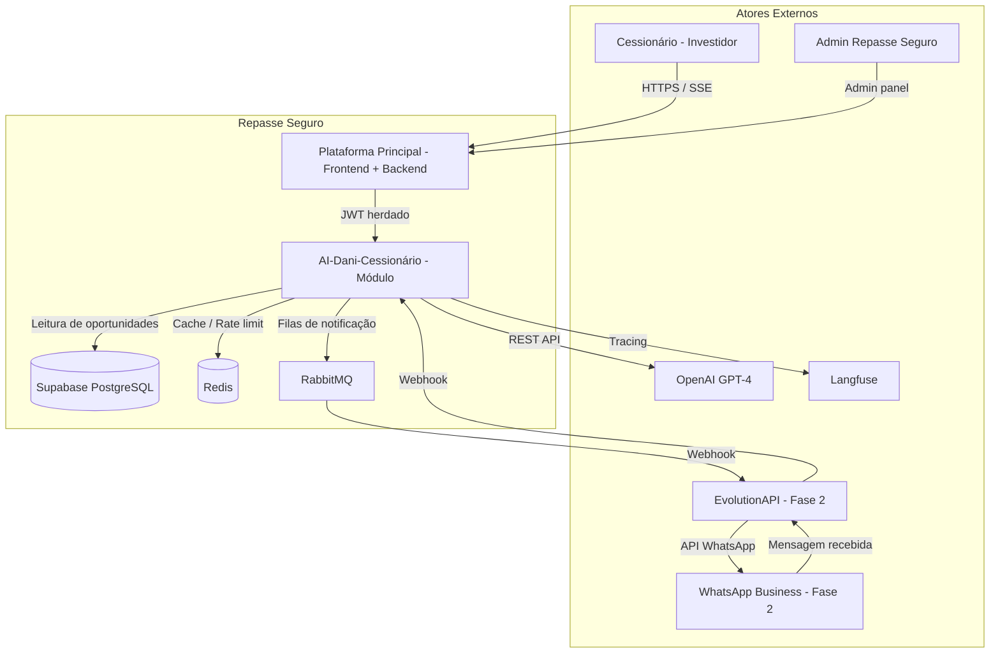
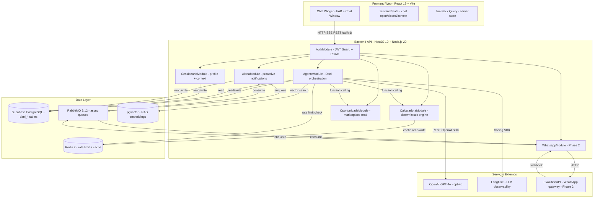
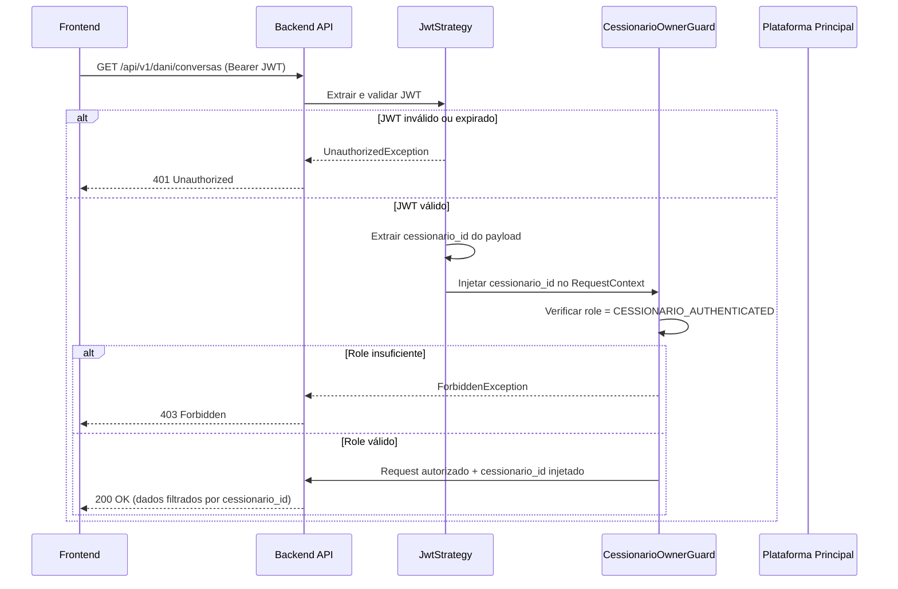
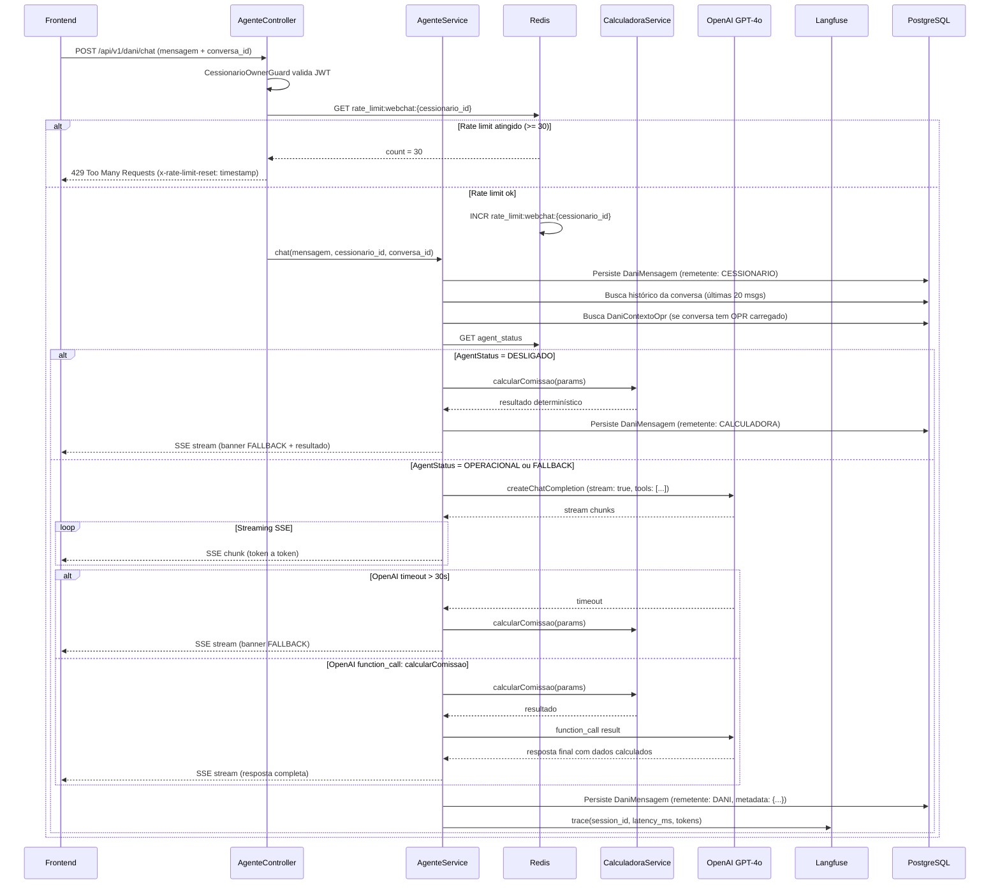
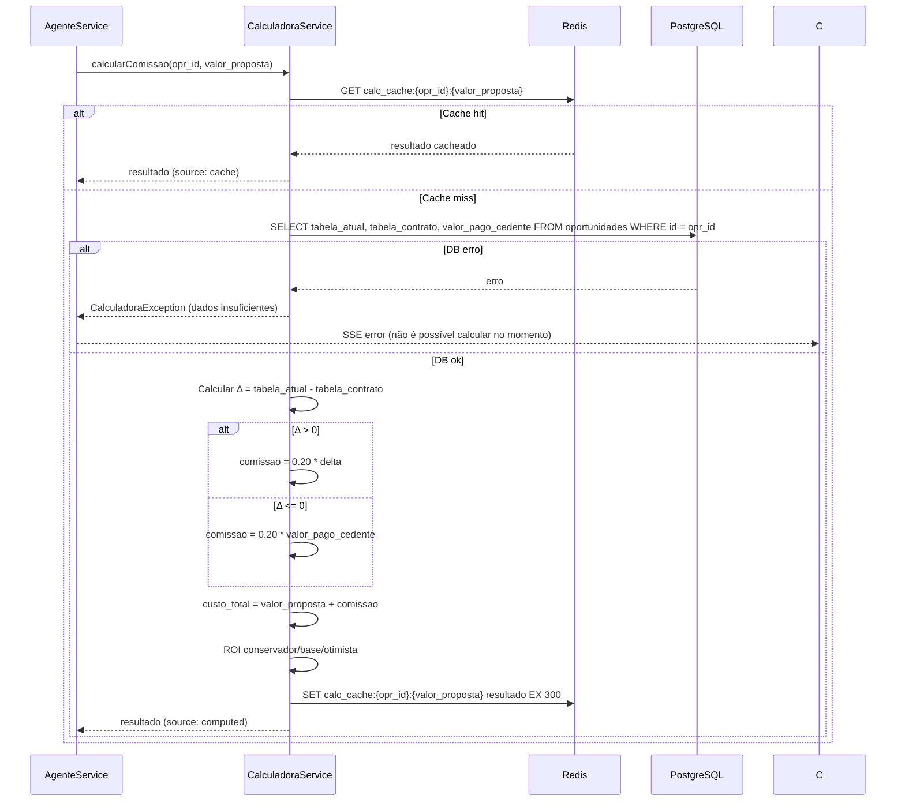
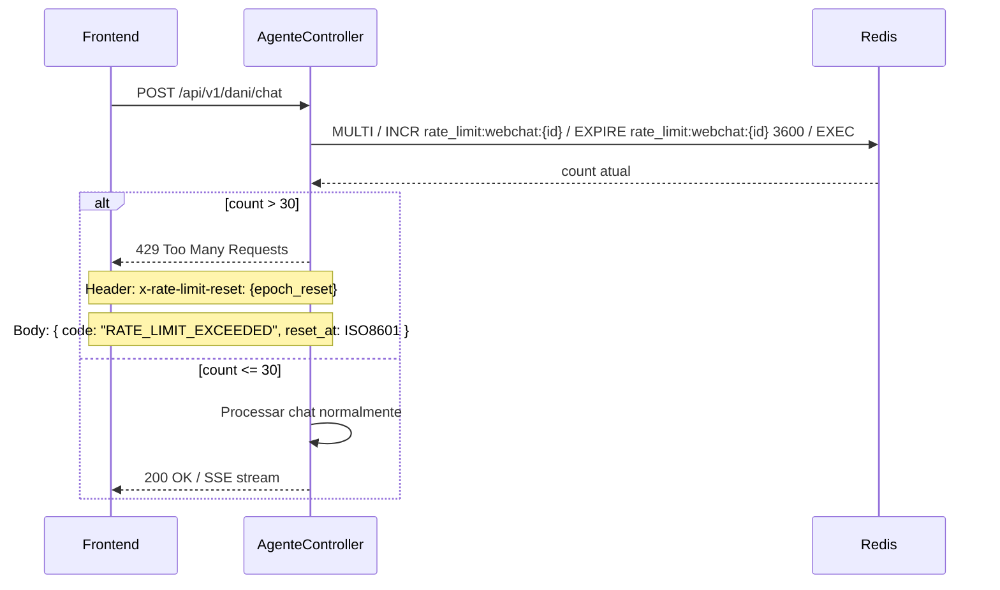
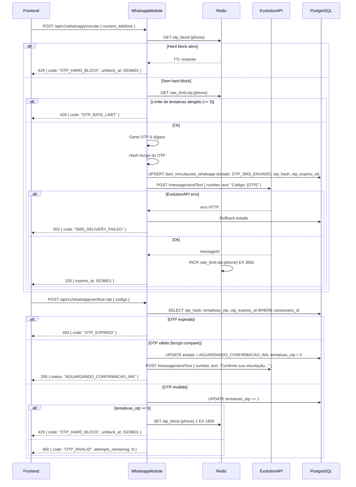
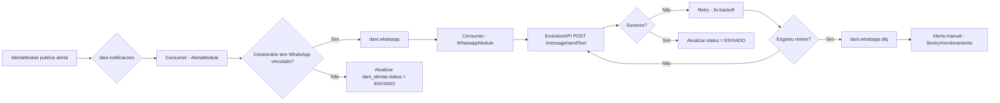

# 14 - Especificações Técnicas

| **Destinatário** | **Escopo** | **Versão** | **Responsável** | **Data da versão** |
|---|---|---|---|---|
| Arquitetura e Engenharia | Documento de arquitetura técnica completo do AI-Dani-Cessionário — módulos, containers, fluxos críticos, cache, filas e ADRs | v1.0 | Claude Code Desktop | 23/03/2026 (America/Fortaleza) |

---

> 📌 **TL;DR**
>
> - **Arquitetura:** módulo NestJS overlay integrado à plataforma Repasse Seguro. 8 containers: Frontend Web, Backend API, PostgreSQL (Supabase), Redis, RabbitMQ, OpenAI GPT-4, Langfuse, EvolutionAPI (Fase 2).
> - **7 módulos backend:** `AgenteModule`, `CalculadoraModule`, `OportunidadeModule`, `CessionarioModule`, `AlertaModule`, `WhatsappModule` (Fase 2), `AuthModule`.
> - **5 fluxos críticos documentados:** autenticação/RBAC, conversa com streaming SSE, cálculo determinístico (fallback), rate limiting, vinculação WhatsApp OTP.
> - **Cache Redis:** 5 chaves com TTL, invalidação e comportamento em miss/indisponibilidade definidos.
> - **Filas RabbitMQ:** 3 filas com DLQ, retry exponencial e idempotência.
> - **ADRs:** ADR-001 (EvolutionAPI), ADR-002 (SSE obrigatório), ADR-003 (Calculadora isolada), ADR-004 (RAG com pgvector isolado por cessionario_id).
> - **Zero decisões pendentes por insuficiência de insumo.**

---

## 1. Arquitetura Geral (C4 Nível 1)

### 1.1 Diagrama de Contexto



### 1.2 Escopo do Sistema

O AI-Dani-Cessionário é um **módulo de agente de IA** sobreposto à plataforma Repasse Seguro. Não possui domínio de autenticação próprio — herda o JWT da plataforma. Opera exclusivamente com dados do Cessionário autenticado (isolamento total: RN-DC-001 a RN-DC-003).

**O que está dentro do escopo:**
- Agente de IA (Dani) via chat webchat (Fase 1) e WhatsApp (Fase 2)
- Calculadora de Comissão determinística (módulo independente)
- Alertas proativos para o Cessionário
- Vinculação e gerenciamento do canal WhatsApp (Fase 2)

**O que está fora do escopo:**
- Autenticação de usuários (responsabilidade da plataforma principal)
- Gerenciamento de oportunidades, Escrow, ZapSign (responsabilidade da plataforma principal)
- KYC (responsabilidade da plataforma principal)

---

## 2. Diagrama de Containers (C4 Nível 2)



**Protocolos de comunicação:**

| Origem | Destino | Protocolo | Observação |
|---|---|---|---|
| Frontend | Backend API | HTTPS REST + SSE | SSE para streaming do LLM |
| Backend | OpenAI | HTTPS REST | OpenAI SDK v4 |
| Backend | Langfuse | HTTPS REST | SDK de tracing assíncrono |
| Backend | Redis | TCP Redis Protocol | ioredis |
| Backend | RabbitMQ | AMQP 0-9-1 | `@nestjs/microservices` + amqplib |
| Backend | PostgreSQL | TCP (Supabase pooler) | Prisma Client |
| Backend | pgvector | SQL over TCP | Supabase pgvector extension |
| WhatsappModule | EvolutionAPI | HTTPS REST | Fase 2 |
| EvolutionAPI | WhatsappModule | HTTPS Webhook | Fase 2 — endpoint `/api/v1/whatsapp/webhook` |

---

## 3. Estrutura de Módulos do Backend

### 3.1 Convenção por Módulo

Todos os módulos seguem o padrão NestJS com estrutura:

```
src/
  <modulo>/
    <modulo>.module.ts        # Declaração do módulo e DI
    <modulo>.controller.ts    # Endpoints HTTP (DTOs como params)
    <modulo>.service.ts       # Lógica de negócio
    <modulo>.repository.ts    # Acesso ao Prisma (queries)
    dto/
      create-*.dto.ts
      update-*.dto.ts
      response-*.dto.ts
    guards/
      <modulo>.guard.ts       # Guards específicos do módulo
    prompts/                  # Apenas AgenteModule
      dani-system-prompt.v1.ts
```

### 3.2 Módulos e Responsabilidades

#### 3.2.1 `AuthModule`

| Responsabilidade | Implementação |
|---|---|
| Validar JWT da plataforma Repasse Seguro | `JwtStrategy` extrai `cessionario_id` e `role` do payload |
| `CessionarioOwnerGuard` | Aplicado em todos os endpoints que retornam dados do Cessionário — injeta `cessionario_id` no request context |
| `RbacGuard` | Valida role mínimo por endpoint (`CESSIONARIO_AUTHENTICATED`, `ADMIN`) |

**Dependências:** `@nestjs/passport`, `passport-jwt`, `jwks-rsa` (para validar chave pública da plataforma).

#### 3.2.2 `AgenteModule`

| Responsabilidade | Implementação |
|---|---|
| Orquestração do agente Dani | `AgenteService.chat()` — recebe mensagem, monta contexto, chama OpenAI |
| Streaming SSE | `AgenteController.stream()` — endpoint `GET /ai-dani/stream` via `Vercel AI SDK` |
| Function calling | Registra tools: `buscarOportunidade`, `calcularComissao`, `buscarHistorico` |
| RAG | `AgenteService.buscarContexto()` — vector search no pgvector com filtro `cessionario_id` |
| System prompt | Carregado de `prompts/dani-system-prompt.v1.ts` — nunca hardcoded |
| Gerenciamento de conversa | Cria/lê `DaniConversa`, `DaniSessao`, `DaniMensagem` via repository |
| Tracing Langfuse | Trace por chamada com `session_id`, `cessionario_id`, `input_tokens`, `output_tokens`, `latency_ms` |
| Monitoramento de SLA | Emite evento na fila `dani.agent_monitor` se latência > 5s (análise individual) ou > 10s (comparação) |

**Dependências:** `OpenAI SDK`, `Vercel AI SDK`, `LangChain.js`, `Langfuse SDK`, `CalculadoraModule`, `OportunidadeModule`.

#### 3.2.3 `CalculadoraModule`

| Responsabilidade | Implementação |
|---|---|
| Cálculo determinístico de Comissão | `CalculadoraService.calcularComissao()` — fórmula: `20% × Δ` (Δ > 0) ou `20% × Valor Pago Cedente` (Δ ≤ 0) |
| Cálculo de Custo Total (Escrow) | `Preço Repasse + Comissão` |
| Cálculo de ROI (3 cenários) | Conservador (−10% tabela), Base, Otimista (+15% tabela) |
| Cache de resultados | Redis chave `calc_cache:{opr_id}:{valor}`, TTL 300s |
| Fallback primário | Funciona sem OpenAI — nunca depende do modelo de IA |

**Dependências:** Redis (ioredis), nenhuma dependência do `AgenteModule`.

> ⚙️ **Isolamento obrigatório:** `CalculadoraModule` não importa `AgenteModule`. Relação unidirecional: `AgenteModule` → `CalculadoraModule`.

#### 3.2.4 `OportunidadeModule`

| Responsabilidade | Implementação |
|---|---|
| Leitura de oportunidades do marketplace | `OportunidadeService.buscarPorOpr()` — consulta read-only na plataforma principal |
| Snapshot para DaniContextoOpr | `OportunidadeService.capturarSnapshot()` — persiste JSON em `dani_contextos_opr` |
| Validação de acesso | Confirma que oportunidade é pública ou o Cessionário tem permissão |

**Dependências:** Prisma (read-only na tabela `oportunidades` da plataforma principal).

#### 3.2.5 `CessionarioModule`

| Responsabilidade | Implementação |
|---|---|
| Leitura do perfil do Cessionário | `CessionarioService.getPerfil()` — retorna nome, KYC status, preferências |
| Contexto para o agente | Fornece ao `AgenteModule` dados de perfil para personalização |

**Dependências:** Prisma (tabela `cessionarios` — read-only no módulo da Dani).

#### 3.2.6 `AlertaModule`

| Responsabilidade | Implementação |
|---|---|
| Criação de alertas proativos | `AlertaService.criar()` — persiste em `dani_alertas` |
| Marcação de alertas como lidos | `AlertaService.marcarLido()` — atualiza `lido_em` |
| Contagem de não lidos (badge FAB) | `AlertaService.contarNaoLidos()` — filtrado por `cessionario_id` |
| Consumo da fila de notificações | Consumer da fila `dani.notificacoes` — envia alertas via SSE ou WhatsApp |

**Dependências:** RabbitMQ, Prisma, `WhatsappModule` (Fase 2).

#### 3.2.7 `WhatsappModule` (Fase 2)

| Responsabilidade | Implementação |
|---|---|
| Vinculação de número via OTP | `WhatsappService.iniciarVinculacao()`, `WhatsappService.verificarOtp()` |
| Rate limiting OTP | Redis chaves `rate_limit:otp:{phone}` e `otp_block:{phone}` |
| Envio de mensagens via EvolutionAPI | `WhatsappService.enviar()` — HTTP para EvolutionAPI |
| Webhook de mensagens recebidas | `WhatsappController.webhook()` — valida assinatura + encaminha para `AgenteModule` |
| Desvinculação | `WhatsappService.desvincular()` — estado `DESVINCULADO` em `dani_vinculacoes_whatsapp` |

**Dependências:** Redis, Prisma, EvolutionAPI (HTTP), `AgenteModule`.

---

## 4. Fluxos Internos Críticos

### 4.1 Autenticação e RBAC



**Tratamento de erro:**
- JWT expirado: `401` com `WWW-Authenticate: Bearer error="token_expired"` — frontend deve renovar via refresh token
- Role insuficiente: `403` com body `{ code: "INSUFFICIENT_ROLE", required: "CESSIONARIO_AUTHENTICATED" }`
- Consulta sem `cessionario_id` no contexto: falha de segurança → `500` + log de auditoria + alerta Sentry

---

### 4.2 Conversa com Streaming SSE



**Tratamento de erros:**
- OpenAI timeout (> 30s): fallback automático para Calculadora. Log + alerta Langfuse
- OpenAI rate limit (`429`): retry 3x com backoff exponencial (1s, 2s, 4s). Se falhar: fallback Calculadora
- PostgreSQL indisponível: resposta SSE com `{ type: "error", code: "DB_UNAVAILABLE" }`. Log Sentry P0
- Redis indisponível: continua sem rate limit (fail open para não bloquear o usuário). Log + alerta Sentry

---

### 4.3 Cálculo Determinístico (Fallback da Calculadora)



**Tratamento de erros:**
- Cache miss + DB indisponível: `CalculadoraException` → mensagem ao usuário: "Não é possível calcular no momento. Tente novamente em instantes."
- `valor_proposta` inválido (zero, negativo, não-numérico): `ValidationException` antes de consultar Redis/DB

---

### 4.4 Rate Limiting (Janela Deslizante)



**Detalhes de implementação:**
- Algoritmo: sliding window via Redis sorted set com ZADD/ZREMRANGEBYSCORE
- Chave: `rate_limit:webchat:{cessionario_id}` — TTL 3600s (janela 1h)
- Redis indisponível: fail open (permitir a mensagem, log de aviso). Nunca bloquear por falha de infraestrutura
- Hard block OTP: `otp_block:{phone}` TTL 1800s — não há fail open (bloqueio de segurança)

---

### 4.5 Vinculação WhatsApp (OTP) — Fase 2



**Tratamento de erros:**
- EvolutionAPI indisponível: rollback do estado no banco + `502` ao usuário + alerta RabbitMQ para retry
- OTP hash nunca armazenado em texto claro — apenas bcrypt
- OTP expirado (> 15min): usuário deve solicitar novo OTP

---

## 5. Estratégia de Cache

**Tecnologia:** Redis ≥ 7.x (Docker local / Upstash produção)

| Recurso | Chave | TTL | Invalidação | Cache miss | Redis indisponível |
|---|---|---|---|---|---|
| Rate limit webchat | `rate_limit:webchat:{cessionario_id}` | 3.600s (1h) | Automática (TTL expira) | Count começa em 1 | Fail open — mensagem permitida |
| Rate limit OTP | `rate_limit:otp:{phone}` | 3.600s (1h) | Automática (TTL expira) | Count começa em 1 | Fail open — OTP permitido (log de aviso) |
| Hard block OTP | `otp_block:{phone}` | 1.800s (30min) | Automática (TTL expira) | Sem block ativo | Fail closed — OTP bloqueado (segurança) |
| Resultado Calculadora | `calc_cache:{opr_id}:{valor}` | 300s (5min) | Manual: invalidar quando oportunidade muda de status | Computar e cachear | Computar sem cache (aceita degradação) |
| Status do agente | `agent_status` | 60s | Manual: ao alterar estado pelo Admin | Assumir `OPERACIONAL` | Assumir `OPERACIONAL` |

**Regras gerais:**
- TTL obrigatório em toda chave — nunca persistir sem expiração
- Serialização: JSON para valores complexos, string/integer para contadores
- Conexão: pool de conexões via `ioredis` com reconexão automática (retry strategy: 3x com backoff 100ms, 500ms, 2s)
- Nunca armazenar dados pessoais do Cessionário em texto claro no Redis

---

## 6. Estratégia de Filas

**Tecnologia:** RabbitMQ ≥ 3.12 (Docker local / CloudAMQP produção)

### 6.1 Filas e Configuração

| Fila | Exchange | Routing Key | DLQ | Retry | Idempotência | Uso |
|---|---|---|---|---|---|---|
| `dani.notificacoes` | `dani.direct` | `notificacoes` | `dani.notificacoes.dlq` | 3x, backoff: 2s/4s/8s | `alerta_id` como chave de deduplicação | Alertas proativos para Cessionário |
| `dani.whatsapp` | `dani.direct` | `whatsapp` | `dani.whatsapp.dlq` | 3x, backoff: 5s/15s/30s | `message_id` EvolutionAPI | Mensagens de saída para WhatsApp (Fase 2) |
| `dani.agent_monitor` | `dani.fanout` | — | `dani.agent_monitor.dlq` | 1x, sem backoff | `trace_id` Langfuse | SLA e monitoramento de latência do agente |

### 6.2 Fluxo de Processamento Assíncrono



### 6.3 Monitoramento de Filas

- Métricas obrigatórias: profundidade de fila, taxa de mensagens em DLQ, latência de processamento
- Alerta automático: Sentry quando DLQ receber > 10 mensagens em 5 minutos
- Dashboard: CloudAMQP management UI em produção

---

## 7. ADRs (Architecture Decision Records)

### ADR-001 — EvolutionAPI como Gateway WhatsApp (Fase 2)

**Contexto:** A Dani precisa de um canal WhatsApp para comunicação com o Cessionário na Fase 2. Opções avaliadas: WhatsApp Business API oficial (Meta), Twilio API for WhatsApp, EvolutionAPI (open-source).

**Decisão:** EvolutionAPI ≥ 2.x como gateway WhatsApp.

**Alternativas avaliadas:**
- (A) WhatsApp Business API oficial (Meta): aprovação demorada (semanas), custo por mensagem, infraestrutura gerenciada pela Meta
- (B) Twilio for WhatsApp: custo alto por mensagem, dependência de vendor externo
- (C) EvolutionAPI: open-source, auto-hospedado, sem custo por mensagem, integração via REST

**Justificativa:** EvolutionAPI elimina custo por mensagem e dependência de terceiro. Controle total sobre a infraestrutura. Ecossistema open-source ativo. Mitigação do risco de instabilidade: health check periódico + fallback para alertas somente via webchat se EvolutionAPI indisponível.

**Consequências:** Necessita infraestrutura de hospedagem própria. Atualizações de versão manuais. Risco de mudanças no protocolo WhatsApp exigir atualização do EvolutionAPI.

---

### ADR-002 — SSE Obrigatório para Streaming do LLM

**Contexto:** As respostas da Dani para análises complexas (comparação de 5 OPRs) podem levar até 10s. Sem streaming, o usuário vê tela branca aguardando resposta.

**Decisão:** SSE (Server-Sent Events) obrigatório para todas as respostas do LLM.

**Alternativas avaliadas:**
- (A) HTTP longo (response ao final): usuário aguarda resposta completa. UX inaceitável para respostas de 5-10s
- (B) WebSocket bidirecional: overhead desnecessário — o canal de streaming é unidirecional (servidor → cliente). Requer conexão persistente
- (C) SSE: unidirecional, sem overhead de handshake WebSocket, funciona com `fetch` + `EventSource` nativo

**Justificativa:** SSE é o protocolo natural para streaming token a token de LLM. Menor overhead que WebSocket, suporte nativo nos browsers, integração trivial com Vercel AI SDK. Melhora percepção de latência — o usuário vê a resposta sendo construída.

**Consequências:** Proxies e load balancers devem ter timeout > 30s configurado para conexões SSE. Sem suporte a HTTP/1.0 para SSE — garantir HTTP/1.1+ em produção.

---

### ADR-003 — Calculadora como Módulo Isolado (sem dependência do AgenteModule)

**Contexto:** A RN-DC-023 exige que a Calculadora de Comissão funcione mesmo quando a IA está indisponível. Se a Calculadora dependesse do AgenteModule, uma falha no agente quebraria o fallback.

**Decisão:** `CalculadoraModule` é independente do `AgenteModule`. A relação é unidirecional: `AgenteModule` injeta `CalculadoraService`, mas não o contrário.

**Alternativas avaliadas:**
- (A) Calculadora como método privado dentro do AgenteService: simples de implementar, mas falha junto com o agente
- (B) Calculadora como microserviço separado: alta complexidade operacional para o volume atual
- (C) Calculadora como módulo NestJS isolado: isolamento lógico sem overhead de microserviço

**Justificativa:** Módulo NestJS isolado garante que a Calculadora pode ser testada, deployada e operada independentemente do agente de IA. Sem overhead de microserviço. Alinhado com RN-DC-023.

**Consequências:** `CalculadoraModule` não pode importar `AgenteModule` — lint rule ou ADR review obrigatório.

---

### ADR-004 — RAG com pgvector Isolado por `cessionario_id`

**Contexto:** A Dani usa RAG para contextualizar respostas com histórico de conversas. Se os embeddings de Cessionários diferentes fossem misturados no mesmo namespace, haveria risco de vazamento de dados (RN-DC-001).

**Decisão:** Todos os embeddings são armazenados com metadado `namespace = cessionario_id`. Toda query vetorial obrigatoriamente inclui filtro `WHERE namespace = cessionario_id`.

**Alternativas avaliadas:**
- (A) Tabelas separadas por Cessionário: impossível escalar (N tabelas para N cessionários)
- (B) Pinecone com namespaces: infra adicional desnecessária quando Supabase pgvector cobre o caso
- (C) pgvector com filtro de metadado: solução nativa, performática com índice HNSW

**Justificativa:** pgvector com filtro de metadado elimina infra adicional. Supabase já tem pgvector habilitado. Filtro obrigatório na query previne vazamento. Consulta sem filtro é tratada como falha de segurança (log + Sentry).

**Consequências:** Índice HNSW deve incluir o filtro de `namespace` para performance. Embedding gerado com `text-embedding-3-small` (menor custo, qualidade adequada para histórico de chat).

---

## 8. Requisitos Não-Funcionais

### 8.1 Performance

| Operação | SLA p95 | Medição |
|---|---|---|
| Análise de oportunidade individual | ≤ 5s (RN-DC-029) | Langfuse trace `latency_ms` |
| Simulação de proposta | ≤ 5s | Langfuse trace |
| Suporte operacional | ≤ 5s | Langfuse trace |
| Comparação de até 5 OPRs | ≤ 10s (RN-DC-029) | Langfuse trace |
| Cálculo determinístico (Calculadora) | ≤ 200ms p99 | Pino log |
| Rate limit check (Redis) | ≤ 5ms p99 | Pino log |
| Busca vetorial RAG | ≤ 500ms p95 | Pino log |

**Degradação aceitável:** Se OpenAI p95 > 5s: ativar fallback Calculadora. Log no Langfuse + alerta na fila `dani.agent_monitor`.

### 8.2 Escalabilidade

| Dimensão | Estratégia |
|---|---|
| Backend | Horizontal scaling (Stateless NestJS). Rate limiting via Redis centralizado — não in-process |
| Banco de dados | Supabase connection pooler (PgBouncer) — não conexões diretas |
| Redis | Instância única em produção inicial. Migração para Redis Cluster se > 10.000 usuários simultâneos |
| RabbitMQ | Consumer horizontal — múltiplas instâncias consumindo a mesma fila |

### 8.3 Disponibilidade

| Componente | Alvo de SLA | Estratégia de resiliência |
|---|---|---|
| Backend API | 99.5% | Restart automático (pm2/Docker). Health check `/health` |
| Dani (IA) | 95% (dependência OpenAI) | Fallback automático para Calculadora quando OpenAI indisponível |
| Redis | 99.9% | Fail open (sem rate limit) em caso de indisponibilidade |
| RabbitMQ | 99.5% | DLQ + retry. Alertas manuais se DLQ crescer |
| Supabase | 99.9% (SLA Supabase Pro) | Read replica para queries de análise (se volume justificar) |

### 8.4 Segurança

| Requisito | Implementação |
|---|---|
| Isolamento de dados | `cessionario_id` em todas as queries Prisma. `CessionarioOwnerGuard` em todos os endpoints |
| JWT | Access token 15min, refresh token 7 dias. Herança da plataforma — sem novo login |
| Secrets | Variáveis de ambiente obrigatórias: `OPENAI_API_KEY`, `DATABASE_URL`, `REDIS_URL`, `RABBITMQ_URL`, `LANGFUSE_SECRET_KEY`, `EVOLUTIONAPI_KEY`. Nunca hardcoded |
| OTP | Hash bcrypt (nunca texto claro). Expiração 15min. Rate limit 3/hora. Hard block 5 falhas = 30min |
| Número de telefone | Hash bcrypt. Somente sufixo 4 dígitos em texto claro para exibição |
| HTTPS | Obrigatório em todos os ambientes (exceto localhost). TLS 1.2+ |
| CORS | Apenas origins da plataforma Repasse Seguro (`ALLOWED_ORIGINS` env) |
| RAG | Filtro obrigatório `WHERE namespace = cessionario_id`. Consulta sem filtro = falha de segurança |
| Auditoria | Toda tentativa de acesso a dados de outro Cessionário: log nível ERROR + Sentry alert |

---

## Changelog

| Data | Versão | Descrição |
|---|---|---|
| 23/03/2026 | v1.0 | Versão inicial. Arquitetura completa com C4 L1+L2, 7 módulos NestJS, 5 fluxos críticos (happy path + erro), estratégia de cache Redis, filas RabbitMQ, 4 ADRs e requisitos não-funcionais. Alinhado com D01 (RNs), D02 (Stacks), D05 (PRD), D06 (Mapa de Telas), D12 (ERD). |

---

## Backlog de Pendências

| Item | Marcador | Seção | Justificativa / Trade-off | Impacto | Dono | Status |
|---|---|---|---|---|---|---|
| Read replica Supabase para queries de análise | Decisão Autônoma | §8.2 Escalabilidade | Ativar somente se volume de leituras justificar o custo — monitorar após MVP. Threshold sugerido: > 1.000 análises/hora | P2 | Tech Lead | Aberto |
| Redis Cluster vs instância única | Decisão Autônoma | §5 Cache | Instância única suficiente para MVP. Migrar para Cluster se > 10.000 usuários simultâneos — monitorar latência Redis p99 | P2 | DevOps | Aberto |
| Algoritmo de ranking "Melhor opção" em comparações | Decisão Autônoma | §3.2.2 AgenteModule | Critério definido: menor Score de Risco + maior Δ. Produto deve validar se critério atende ao negócio | P1 | Product Owner | Aberto |
| Timeout SSE para proxies/load balancer | Decisão Autônoma | ADR-002 | Configuração de timeout > 30s necessária no proxy (nginx/Cloudflare). Confirmar com DevOps antes do deploy em produção | P1 | DevOps | Aberto |
