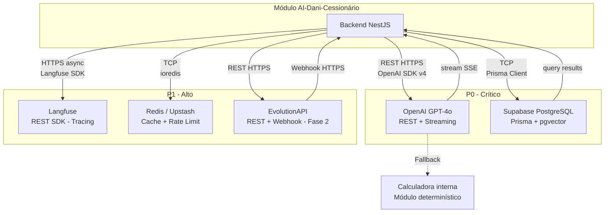

# 17 - Integrações Externas

| **Destinatário** | **Escopo** | **Versão** | **Responsável** | **Data da versão** |
|---|---|---|---|---|
| Backend, Arquitetura e Operação | Mapa de dependências externas do AI-Dani-Cessionário — APIs, SDKs, webhooks, quotas, fallback e criticidade | v1.0 | Claude Code Desktop | 23/03/2026 (America/Fortaleza) |

---

> 📌 **TL;DR**
>
> - **5 integrações mapeadas:** OpenAI GPT-4o, Langfuse, Supabase (PostgreSQL + pgvector), EvolutionAPI (Fase 2), Redis/Upstash.
> - **Por criticidade:** P0: OpenAI (fallback Calculadora), Supabase. P1: Langfuse, Redis, EvolutionAPI (Fase 2). P2: nenhuma.
> - **Integrações sem fallback:** Supabase (DB indisponível = produto indisponível — SLA 99.9% Supabase Pro). Redis tem fail open em rate limit (exceto hard block OTP).
> - **SLA documentado:** Supabase Pro 99.9%, OpenAI 99.9% (tier pago). Langfuse e Upstash sem SLA contratual — tratar como P1.
> - **Dependências core:** OpenAI para respostas da Dani; Supabase para persistência de conversas, mensagens e alertas.
> - **Zero integrações pendentes por insuficiência de insumo.**

---

## 1. Diagrama de Dependências

---

## 2. Fichas de Integração

### 2.1 OpenAI GPT-4o — Modelo de Linguagem

🔴 **Criticidade: P0**

| Campo | Valor |
|---|---|
| **Finalidade** | Motor de IA da Dani — gera análises, simulações, comparações e respostas de suporte |
| **Tipo de conexão** | REST API + Server-Sent Events (streaming) |
| **Base URL** | `https://api.openai.com/v1` |
| **Autenticação** | API key via `OPENAI_API_KEY` |
| **SDK** | `openai` Node.js ≥ 4.x + `@ai-sdk/openai` (Vercel AI SDK) |
| **SLA** | 99.9% uptime (tier pago) · Latência p99: variável (3–30s para análises longas) |
| **Rate limits** | Depende do tier. Tier recomendado: `Tier 4` — 1M tokens/min, 10K req/min |
| **Timeout** | 30s por request (após 30s: fallback Calculadora) |

**Endpoints consumidos:**

| Método | Path | Uso |
|---|---|---|
| `POST` | `/chat/completions` | Chat com streaming SSE e function calling |
| `POST` | `/embeddings` | Geração de embeddings para RAG (modelo: `text-embedding-3-small`) |

**Dados trafegados:**
- **Envia:** system prompt, histórico de mensagens (máx. 20 turns), function definitions, `cessionario_id` (nunca dados pessoais sensíveis)
- **Recebe:** tokens de resposta em stream, function_call requests, usage (input/output tokens)

**Retry policy:**
- 3 tentativas com backoff exponencial: 1s, 2s, 4s
- Timeout por attempt: 30s
- Rate limit (`429`): retry automático (OpenAI SDK gerencia com `Retry-After` header)
- Servidor down (`5xx`): 3x retry → fallback Calculadora

**Fallback:** Calculadora de Comissão assume respostas determinísticas. Banner `AgentStatusBanner` exibido com `--agent-fallback`. Agente registrado como `FALLBACK` no Redis `dani:status:agent`.

**Plano de contingência:**
- Usuário vê: "Modo básico — sem análise da IA" (banner T-DC-010)
- Sistema: `CalculadoraService` executa cálculo determinístico automaticamente
- Notificação: Sentry alert P1 + Langfuse trace com `fallback: true`
- Persistência: fila `dani.agent_monitor` recebe evento de degradação
- Se falha > 15 min: Admin recebe alerta manual. Estado `DESLIGADO` no Redis

---

### 2.2 Supabase — PostgreSQL + pgvector

🔴 **Criticidade: P0**

| Campo | Valor |
|---|---|
| **Finalidade** | Banco de dados principal — conversas, mensagens, alertas, vinculação WhatsApp, sessões, contextos OPR. RAG via pgvector |
| **Tipo de conexão** | TCP via Prisma Client (connection pooler PgBouncer) + SQL direto para pgvector |
| **Base URL** | `postgresql://[user]:[pw]@[host]:5432/postgres` via `DATABASE_URL` |
| **Autenticação** | `DATABASE_URL` (connection string com credentials) |
| **SDK** | Prisma ≥ 5.x |
| **SLA** | 99.9% uptime (Supabase Pro) |
| **Rate limits** | 500 conexões simultâneas (PgBouncer). Limitar pool do Prisma: `connection_limit=10` |
| **Timeout** | 30s por query |

**Tabelas gerenciadas pela Dani:** `dani_conversas`, `dani_mensagens`, `dani_sessoes`, `dani_contextos_opr`, `dani_alertas`, `dani_vinculacoes_whatsapp`, `dani_rate_limits_audit`

**Dados trafegados:**
- **Escreve:** mensagens, sessões, alertas, OTP hash (bcrypt), estados de vinculação
- **Lê:** histórico de conversas (máx 90 dias), contextos de OPR, dados de oportunidades (read-only)
- **RAG:** embeddings armazenados com namespace `cessionario_id`. Queries: cosine similarity via `<=>` operator

**Retry policy:**
- Prisma reconexão automática: 3 tentativas com backoff 500ms
- Timeout de query: 30s (configurado no Prisma datasource)
- Connection loss: reconexão automática do pool

**Fallback:** Sem fallback técnico para banco indisponível — produto indisponível. Mitigação: SLA 99.9% + backups automáticos diários do Supabase Pro.

**Plano de contingência:**
- Usuário vê: "Serviço temporariamente indisponível. Tente novamente em instantes." (generic 500)
- Sistema: Sentry P0 alert imediato
- Notificação: PagerDuty (se configurado) + Slack #ops-alerts
- Ação manual: verificar dashboard Supabase, ativar read replica se disponível

---

### 2.3 Langfuse — Observabilidade de LLM

💡 **Criticidade: P1**

| Campo | Valor |
|---|---|
| **Finalidade** | Tracing de todas as chamadas ao OpenAI — latência, custo, qualidade, input/output tokens |
| **Tipo de conexão** | REST API assíncrona via SDK |
| **Base URL** | `https://cloud.langfuse.com` ou self-hosted |
| **Autenticação** | `LANGFUSE_SECRET_KEY` + `LANGFUSE_PUBLIC_KEY` |
| **SDK** | `langfuse` Node.js ≥ 2.x |
| **SLA** | Sem SLA contratual documentado (cloud). Self-hosted: depende da infra |
| **Rate limits** | Sem limite documentado para tier pago |
| **Timeout** | 5s (tracing é assíncrono — sem impacto no caminho crítico) |

**Dados trafegados:**
- **Envia:** `session_id`, `cessionario_id` (pseudoanonimizado), `input` (mensagem), `output` (resposta Dani), `latency_ms`, `input_tokens`, `output_tokens`, `model`, `fallback_ativo`
- **Recebe:** confirmação de ingestão (assíncrono)

> ⚙️ **Regra de privacidade:** `cessionario_id` enviado ao Langfuse como hash SHA-256 — nunca UUID real nem dados pessoais do Cessionário.

**Retry policy:** SDK tenta 2x em background. Se falhar: log local e continua (não bloqueia resposta ao usuário).

**Fallback:** Sem fallback para observabilidade — tracing simplesmente não é registrado. Produto continua funcional. Log Pino local como backup mínimo.

**Plano de contingência:**
- Usuário: não percebe impacto
- Sistema: log Pino com dados de latência e tokens como alternativa local
- Notificação: Sentry warning (não P0) se taxa de falha > 10% em 5 min

---

### 2.4 Redis / Upstash — Cache e Rate Limiting

💡 **Criticidade: P1**

| Campo | Valor |
|---|---|
| **Finalidade** | Cache de rate limiting, status do agente, resultados da Calculadora, hard block OTP |
| **Tipo de conexão** | TCP via ioredis (Redis protocol) |
| **Base URL** | `redis://[host]:6379` via `REDIS_URL` (Docker local) / Upstash URL em produção |
| **Autenticação** | `REDIS_URL` (inclui password se necessário) |
| **SDK** | `ioredis` ≥ 5.x |
| **SLA** | Upstash: 99.9% (regional) |
| **Rate limits** | Upstash Free: 10K req/dia. Pro: 500K req/dia |
| **Timeout** | 100ms por comando (acima disso: fail open) |

**Comandos utilizados:**

| Comando | Chave | Uso |
|---|---|---|
| `INCR` + `EXPIRE` | `dani:rate:webchat:{id}` | Rate limit sliding window |
| `INCR` + `EXPIRE` | `dani:rate:otp:{phone_hash}` | Rate limit OTP |
| `SET EX` | `dani:block:otp:{phone_hash}` | Hard block OTP |
| `SET EX GET` | `dani:cache:calc:{opr_id}:{val_hash}` | Cache Calculadora |
| `SET EX` | `dani:status:agent` | Status do agente |

**Retry policy:**
- ioredis: retry automático 3x com backoff 100ms/500ms/2s
- Timeout: 100ms (configurado no ioredis options)

**Fallback por tipo de chave:**
- Rate limit webchat: **fail open** — mensagem permitida. Log warning
- Rate limit OTP: **fail open** — OTP permitido. Log warning
- Hard block OTP: **fail closed** — bloqueia se não conseguir verificar (segurança)
- Cache Calculadora: cache miss → computar sem cache
- Status agente: assume `OPERACIONAL` se Redis indisponível

**Plano de contingência:**
- Usuário: não percebe em condições normais (fail open em rate limit)
- Sistema: Sentry P1 alert + log Pino com `redis_unavailable: true`
- Notificação: Slack #ops-alerts se indisponível > 2min
- Exceção: hard block OTP com Redis indisponível → log auditoria manual obrigatório

---

### 2.5 EvolutionAPI — Gateway WhatsApp (Fase 2)

💡 **Criticidade: P1 (Fase 2 apenas)**

| Campo | Valor |
|---|---|
| **Finalidade** | Gateway WhatsApp Business para canal de mensagens da Fase 2 (RN-DC-040 a RN-DC-044) |
| **Tipo de conexão** | REST API (outbound) + Webhook HTTPS (inbound) |
| **Base URL** | `http://[evolutionapi-host]:8080` via `EVOLUTIONAPI_URL` |
| **Autenticação** | `EVOLUTIONAPI_KEY` (API key no header `apikey`) |
| **SDK** | HTTP client nativo (sem SDK oficial) |
| **SLA** | Auto-hospedado — sem SLA externo. Uptime gerenciado internamente |
| **Rate limits** | WhatsApp Business: ~1000 msgs/dia sem aprovação de Business Account. Verificar limite atual com Meta |
| **Timeout** | 10s por request |

**Endpoints consumidos:**

| Método | Path | Uso |
|---|---|---|
| `POST` | `/message/sendText` | Enviar mensagem de texto ao Cessionário |
| `GET` | `/instance/fetchInstances` | Health check da instância |
| `GET` | `/instance/connectionState` | Status da conexão WhatsApp |

**Webhook recebido:**
- `POST /api/v1/whatsapp/webhook` — payload: `messages.upsert`, `connection.update`
- Validação: `x-api-key: {EVOLUTIONAPI_WEBHOOK_SECRET}` obrigatório

**Dados trafegados:**
- **Envia:** número de telefone (E.164), texto da mensagem, OTP
- **Recebe:** confirmação de envio (`messageId`), mensagens recebidas (webhook), status de conexão

**Retry policy:**
- 3 tentativas com backoff: 5s, 15s, 30s
- Timeout: 10s por attempt
- Falha definitiva → fila DLQ `dani.whatsapp.dlq` + alerta manual

**Fallback:** EvolutionAPI indisponível → alertas proativos entregues somente via in-app (chat + badge FAB). Usuário não recebe mensagem no WhatsApp mas não perde o alerta. Fila `dani.whatsapp.dlq` armazena mensagens para retry manual.

**Plano de contingência:**
- Usuário: mensagem não chega ao WhatsApp. Alerta visível no chat in-app
- Sistema: retry automático 3x. Mensagem vai para `dani.whatsapp.dlq`
- Notificação: Sentry P1 alert se DLQ > 5 mensagens em 5 min
- Ação manual: verificar status da instância EvolutionAPI + reconectar se necessário

---

## 3. Matriz de Criticidade

| Integração | Criticidade | Impacto se offline | Fallback disponível | Fallback |
|---|---|---|---|---|
| OpenAI GPT-4o | P0 | Dani indisponível — sem análise de IA | ✅ Sim | Calculadora determinística |
| Supabase PostgreSQL | P0 | Produto indisponível (sem persistência) | ❌ Não | SLA 99.9% como mitigação |
| Langfuse | P1 | Sem tracing de LLM (operacional normal) | ✅ Sim | Log Pino local |
| Redis / Upstash | P1 | Rate limit fail open, cache sem funcionar | ✅ Parcial | Fail open (exceto OTP hard block) |
| EvolutionAPI | P1 | WhatsApp offline, in-app funcional | ✅ Sim | Alertas somente in-app |

---

## 4. Plano de Contingência

### 4.1 OpenAI GPT-4o (P0)

| Evento | Sistema | Usuário vê | Notificação | Ação manual |
|---|---|---|---|---|
| Timeout > 30s | `CalculadoraService` assume automaticamente. `FALLBACK` no Redis `dani:status:agent` | Banner "Modo básico — sem análise da IA" (T-DC-010) | Sentry P1 + Langfuse `fallback: true` | Nenhuma se < 15 min |
| Rate limit `429` | Retry 3x com `Retry-After`. Fallback se todos falharem | Mesmo banner + resultado Calculadora | Sentry P1 | Verificar tier OpenAI |
| Down > 15 min | `DESLIGADO` no Redis `dani:status:agent` | Banner "Analista de Oportunidades temporariamente indisponível" | Sentry P0 + Slack #ops-alerts | Admin verifica status OpenAI. Aguardar restabelecimento |
| Qualidade degradada (confiança < 80%) | Takeover disponível para Admin | Resposta exibida normalmente (Cessionário não vê nível de confiança) | Langfuse dashboard | Admin pode ativar takeover manual |

### 4.2 Supabase PostgreSQL (P0)

| Evento | Sistema | Usuário vê | Notificação | Ação manual |
|---|---|---|---|---|
| Conexão perdida | Prisma retry 3x (500ms backoff) | Timeout + 500 genérico após 30s | Sentry P0 imediato | Verificar dashboard Supabase |
| Down > 5 min | Serviço retorna `503 Service Unavailable` | "Serviço temporariamente indisponível." | Sentry P0 + PagerDuty | Escalar para DevOps. Verificar read replica se disponível |
| Lentidão (queries > 10s) | Timeout de query 30s → `504` | "Estamos com lentidão. Tente novamente." | Sentry warning + Pino log | Verificar plano de execução de queries. Adicionar índice se necessário |

### 4.3 Redis / Upstash (P1)

| Evento | Sistema | Usuário vê | Notificação | Ação manual |
|---|---|---|---|---|
| Timeout > 100ms | Fail open para rate limit. Log warning | Sem impacto visível | Sentry warning | Verificar latência Redis |
| Conexão perdida | ioredis retry 3x. Fail open (exceto OTP hard block). Log `redis_unavailable: true` | Sem impacto visível (rate limit não aplicado) | Sentry P1 + Slack | Verificar Upstash dashboard. Reiniciar ioredis pool |
| OTP hard block com Redis indisponível | Bloqueia OTP (fail closed — segurança) | "Verificação temporariamente indisponível. Tente novamente." | Sentry P1 | Log de auditoria manual gerado |

### 4.4 EvolutionAPI (P1 — Fase 2)

| Evento | Sistema | Usuário vê | Notificação | Ação manual |
|---|---|---|---|---|
| Timeout ou `5xx` | Retry 3x (5s/15s/30s). Mensagem → DLQ | Alerta in-app (chat) entregue normalmente | Sentry P1 se DLQ > 5 msgs | Verificar instância EvolutionAPI. Reprocessar DLQ |
| WhatsApp desconectado | `/instance/connectionState` retorna `close` | Alerta in-app somente (sem WhatsApp) | Sentry P1 + Slack | Reconectar instância no painel EvolutionAPI |
| Rate limit WhatsApp | Mensagens não enviadas (sem retry automático — violação pode banir número) | In-app somente | Sentry P1 | Revisar volume. Não fazer retry automático se limite Meta atingido |

---

## 5. Segurança e Credenciais

| Integração | Env Var | Rotação | Escopo |
|---|---|---|---|
| OpenAI | `OPENAI_API_KEY` | A cada 90 dias (recomendado) | Backend apenas — nunca expor no frontend |
| Supabase | `DATABASE_URL` | A cada 180 dias ou em breach | Backend apenas |
| Langfuse | `LANGFUSE_SECRET_KEY`, `LANGFUSE_PUBLIC_KEY` | A cada 90 dias | Backend (secret) + frontend pode usar public key |
| Redis / Upstash | `REDIS_URL` | A cada 90 dias | Backend apenas |
| EvolutionAPI | `EVOLUTIONAPI_KEY`, `EVOLUTIONAPI_URL` | A cada 60 dias | Backend apenas |
| Webhook EvolutionAPI | `EVOLUTIONAPI_WEBHOOK_SECRET` | A cada 30 dias | Backend apenas |

**Regras de segurança obrigatórias:**
- HTTPS obrigatório em todas as comunicações externas (exceto Redis via VPN interna)
- Nenhuma credencial hardcoded no código-fonte — auditado no CI via `git-secrets`
- Webhook EvolutionAPI: validar `x-api-key` antes de processar qualquer payload
- Dados pessoais do Cessionário nunca enviados ao Langfuse — usar hash SHA-256 do `cessionario_id`
- Número de telefone nunca enviado ao Langfuse nem ao Redis em texto claro

---

## 6. Monitoramento

### 6.1 Health Checks

| Integração | Endpoint de health check | Frequência | Alerta se |
|---|---|---|---|
| OpenAI | `GET https://api.openai.com/v1/models` | A cada 60s | Resposta > 5s ou não-200 |
| Supabase | `SELECT 1` via Prisma | A cada 30s | Timeout ou erro de conexão |
| Langfuse | SDK flush assíncrono | Passivo (via SDK) | Taxa de erro SDK > 10% |
| Redis | `PING` via ioredis | A cada 30s | Timeout > 100ms ou sem resposta |
| EvolutionAPI | `GET /instance/connectionState` | A cada 120s (Fase 2) | `state !== "open"` |

### 6.2 Métricas a Monitorar

| Integração | Métrica | Threshold de alerta |
|---|---|---|
| OpenAI | `latency_ms` p95 | > 5s → warning; > 15s → P1 |
| OpenAI | `fallback_rate` | > 5% em 10 min → P1 |
| OpenAI | `error_rate` | > 1% em 5 min → P0 |
| Supabase | Query `latency_ms` p99 | > 2s → warning; > 10s → P1 |
| Supabase | Connection pool utilization | > 80% das 10 conexões → warning |
| Redis | Latência p99 | > 50ms → warning |
| Redis | `rate_limit_fail_open_count` | > 100 eventos/min → P1 |
| EvolutionAPI | DLQ depth | > 5 mensagens → P1 |
| EvolutionAPI | `connection_state` | `close` por > 2min → P1 |

### 6.3 Alertas Configurados

- **Sentry:** error tracking automático em todas as integrações
- **Langfuse:** dashboard de LLM com métricas de qualidade e custo
- **Pino:** logs estruturados com campo `integration` para filtros rápidos
- **RabbitMQ management:** DLQ monitoring via CloudAMQP console

---

## Changelog

| Data | Versão | Descrição |
|---|---|---|
| 23/03/2026 | v1.0 | Versão inicial. 5 integrações mapeadas (OpenAI, Supabase, Langfuse, Redis, EvolutionAPI). Fichas completas, planos de contingência P0/P1, segurança de credenciais e monitoramento. |

---

## Backlog de Pendências

| Item | Marcador | Seção | Justificativa / Trade-off | Impacto | Dono | Status |
|---|---|---|---|---|---|---|
| Tier OpenAI (rate limits exatos) | Decisão Autônoma | §2.1 | Recomendado Tier 4 (1M tokens/min). Confirmar com conta OpenAI antes do go-live e ajustar limites de retry | P1 | Tech Lead | Aberto |
| Self-hosted vs. cloud Langfuse | Decisão Autônoma | §2.3 | Cloud para MVP (menor overhead operacional). Self-hosted se compliance exigir dados on-prem | P2 | Tech Lead | Aberto |
| PagerDuty configuração | Decisão Autônoma | §4.2 | PagerDuty mencionado como canal de alerta P0. Confirmar contratação antes do go-live. Alternativa: OpsGenie | P1 | DevOps | Aberto |
| Webhook assinatura HMAC vs. API Key | [DEFINIÇÃO PENDENTE] | §2.5 + D16 §8 | Opção A: API Key simples (atual). Opção B: HMAC-SHA256 (mais seguro). Decisão de segurança — impacta compliance | P1 | Backend Lead + Security | Aberto |
| Upstash Pro vs. self-hosted Redis | Decisão Autônoma | §2.4 | Upstash Pro para produção (managed, SLA 99.9%). Self-hosted Redis com Docker para local/staging | P2 | DevOps | Aberto |
