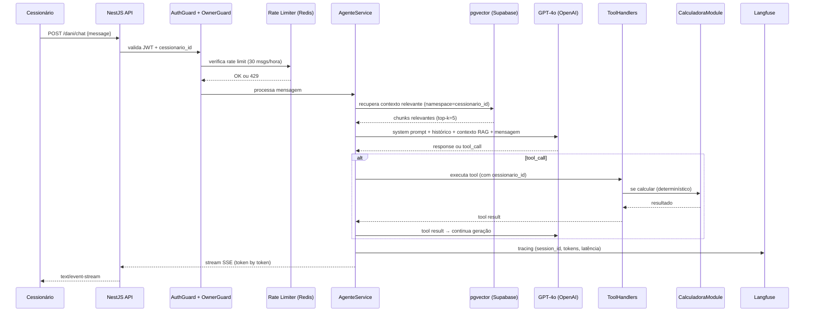

# 19 - Criação de Agentes de IA

| **Destinatário** | **Escopo** | **Versão** | **Responsável** | **Data da versão** |
|---|---|---|---|---|
| Arquitetura e Engenharia de IA | Guia de decisão para arquitetura do agente Dani: tools, memória, RAG, contratos de saída, guardrails e observabilidade | v1.0 | Claude Code Desktop | 23/03/2026 (America/Fortaleza) |

---

> 📌 **TL;DR**
>
> - **Agente único:** Dani é um agente híbrido — informacional + executor — com tools, RAG e memória de sessão
> - **Stack fixa:** Node.js + NestJS (TypeScript) + GPT-4o (`gpt-4o`) + Vercel AI SDK (streaming SSE) + LangChain.js (orchestration multi-step)
> - **5 tools:** `buscarOportunidades`, `calcularComissao`, `analisarRisco`, `buscarComparativoRegional`, `verificarStatusNegociacao`
> - **RAG:** Supabase pgvector com namespace obrigatório por `cessionario_id`; chunking 512 tokens, overlap 64; embeddings `text-embedding-3-small`
> - **Memória:** curta (sessão Redis, TTL 30min) + longa (pgvector por cessionario, TTL 90 dias)
> - **Guardrail crítico:** isolamento total — toda tool call filtra por `cessionario_id`; Calculadora sempre determinística (ADR-003); Takeover Admin quando confiança < 80%
> - **Seções pendentes:** 0

---

## 1. Critérios de Decisão: Tipo de Agente

### 1.1 Tabela de Decisão por Caso de Uso

| Caso de uso | Tipo de Agente | Tools necessárias | Memória | Guardrail | Justificativa |
|---|---|---|---|---|---|
| Responder perguntas gerais sobre o marketplace | Informacional + RAG | nenhuma | curta (sessão) | isolamento de escopo | Precisa consultar base, não executa ação externa |
| Analisar oportunidade específica (RF-DC-014) | Informacional + Executor + RAG | `buscarOportunidades`, `analisarRisco`, `buscarComparativoRegional` | curta | isolamento + bloqueio dados Cedente | Precisa buscar dados reais da oportunidade e analisar |
| Calcular comissão, Escrow e ROI (RF-DC-017–022) | Executor com output estruturado | `calcularComissao` | nenhuma (determinístico) | `CalculadoraModule` isolado (ADR-003) | Cálculo determinístico — schema rígido, zero IA no cálculo |
| Comparar oportunidades (RF-DC-023–025) | Informacional + Executor | `buscarOportunidades` (múltiplas), `analisarRisco` | curta | isolamento + limite 3 simultâneas |
| Simular ROI/custo com valor proposto | Executor com output estruturado | `calcularComissao` | nenhuma | não submete proposta (RN-DC-028) | Dani simula, não age |
| Alertas proativos (RF-DC-032–037) | Executor assíncrono | nenhuma (gerado por fila RabbitMQ) | longa (por cessionario) | Cessionário só vê próprios alertas | Não é conversa — é notificação push |
| Verificar status de negociação ativa | Informacional + Executor | `verificarStatusNegociacao` | curta | somente dados do Cessionário autenticado | Dados isolados por `cessionario_id` |
| Responder pergunta sobre dados bloqueados (Cedente, outros Cessionários) | Informacional com recusa hard-coded | nenhuma | nenhuma | bloqueio absoluto (RN-DC-002) | Resposta padrão de recusa, sem consultar nada |

### 1.2 Regra Binária de Tipo de Agente

```
SE objetivo = responder / orientar / resumir SEM ação externa → Agente Informacional
SE objetivo = buscar / calcular / consultar API ou banco    → Agente Executor (+ tools)
SE qualidade depende de base documental recuperável          → + RAG
SE histórico altera qualidade da resposta                    → + Memória
SE ação envolve risco financeiro / submissão / proposta      → Human-in-the-loop (Dani NÃO age)
```

> ⚙️ **Regra absoluta:** a Dani NUNCA submete proposta, aceita negociação ou assina documento em nome do Cessionário (RN-DC-028). Ações com efeito jurídico ou financeiro são exclusivas do Cessionário via interface da plataforma.

---

## 2. Arquitetura Base do Agente

### 2.1 Componentes Obrigatórios

| Componente | Implementação | Módulo NestJS |
|---|---|---|
| LLM Engine | OpenAI GPT-4o via `openai` SDK v4.x | `AgenteModule` |
| Streaming | Vercel AI SDK v3.x + SSE (`text/event-stream`) | `AgenteModule` |
| Orchestration | LangChain.js v0.2.x (chains multi-step) | `AgenteModule` |
| Tool Execution | Function Calling do GPT-4o + handlers TypeScript | `AgenteModule` |
| Calculadora | `CalculadoraModule` (isolado — ADR-003) | `CalculadoraModule` |
| RAG / Vector Store | Supabase pgvector + `text-embedding-3-small` | `AgenteModule` |
| Memória de Sessão | Redis (TTL 30min) | `AgenteModule` |
| Memória de Longo Prazo | Supabase pgvector (namespace `cessionario_id`) | `AgenteModule` |
| Rate Limiting | Redis + `dani:rate:webchat:{cessionario_id}` | `AgenteModule` |
| Observabilidade | Langfuse v2.x (tracing LLM) + Pino (logs) | transversal |
| System Prompt | `src/agente/prompts/dani-system-prompt.v1.ts` | `AgenteModule` |

### 2.2 Ciclo de Execução



### 2.3 Estado do Agente

```typescript
interface AgenteState {
  session_id: string          // UUID v4 por conversa
  cessionario_id: string      // do JWT — imutável na sessão
  messages: Message[]         // histórico da sessão atual
  current_opr?: string        // oportunidade em contexto (se entrou via T-DC-001)
  confidence_score?: number   // confiança da última resposta (0–1)
  status: 'ACTIVE' | 'FALLBACK' | 'TAKEOVER' | 'RATE_LIMITED'
}
```

---

## 3. Tools e Capacidades Externas

### 3.1 Tabela de Tools

| Tool | Trigger | Input | Output | Timeout | Retry | Fallback |
|---|---|---|---|---|---|---|
| `buscarOportunidades` | usuário menciona busca / comparação / "encontre oportunidades" | `{ filtros: { regiao?, delta_min?, risco_max?, status? }, cessionario_id }` | `Oportunidade[]` | 5s | 2x (1s backoff) | lista vazia + mensagem "Não encontrei oportunidades com esses critérios" |
| `calcularComissao` | qualquer cálculo de comissão, Escrow, ROI, simulação de valor | `{ opr_id: string, valor_proposta: number, cessionario_id }` | `ResultadoCalculadora` (schema rígido) | 2s | 1x | erro `CALC_001` — exibir valores manuais da fórmula em texto |
| `analisarRisco` | Cessionário pede análise de oportunidade, score de risco | `{ opr_id: string, cessionario_id }` | `{ score: number, justificativa: string, indicadores: string[] }` | 10s | 2x (2s backoff) | retornar score 0 com mensagem "Análise de risco temporariamente indisponível" |
| `buscarComparativoRegional` | comparação regional, valorização, tendência de mercado | `{ opr_id: string, regiao: string, cessionario_id }` | `ComparativoRegional` | 8s | 2x (2s backoff) | retornar `null` + Dani informa "Não tenho dados regionais suficientes no momento" |
| `verificarStatusNegociacao` | Cessionário pergunta sobre negociação ativa | `{ cessionario_id }` | `NegociacaoStatus[]` | 5s | 2x | lista vazia + "Você não tem negociações ativas no momento" |

### 3.2 Contratos de Saída — Schemas

```typescript
// calcularComissao — output estruturado (Structured Outputs obrigatório)
interface ResultadoCalculadora {
  opr_id: string
  valor_proposta: number
  delta: number
  comissao: number
  formula_aplicada: '20_PERCENT_DELTA' | '20_PERCENT_VALOR_PAGO'
  escrow_total: number
  roi: {
    cenario_otimista: number
    cenario_base: number
    cenario_conservador: number
  }
  aviso_projecao: string  // obrigatório (RN-DC-017): "Esta é uma projeção baseada em dados disponíveis..."
}

// analisarRisco — score sempre 1–10
interface RiscoOportunidade {
  opr_id: string
  score: number  // 1–10
  nivel: 'baixo' | 'moderado' | 'alto'  // 1–3 | 4–6 | 7–10
  justificativa: string
  indicadores: string[]
  cessionario_id: string  // incluso para validação no handler
}
```

### 3.3 Regras de Tool Use

```
SE LLM retorna tool_call COM nome fora da lista de 5 tools → rejeitar tool call + logar AGENTE_TOOL_UNKNOWN
SE tool recebe cessionario_id diferente do token JWT → rejeitar com AGENTE_004 (isolamento de dados)
SE tool retorna erro após retries esgotados → Dani informa limitação + registra no Langfuse
SE LLM chama calcularComissao → delegar SEMPRE ao CalculadoraModule (ADR-003), nunca calcular inline
```

> ⚙️ **Function Calling obrigatório** para: buscar oportunidades no marketplace, calcular comissão via Calculadora, verificar status de Escrow. Structured Outputs obrigatório para: `calcularComissao`, `analisarRisco` (D02 §5.2).

---

## 4. LLM Padrão (conforme D02 — Stacks)

### 4.1 Modelo e Parâmetros

| Parâmetro | Valor | Justificativa |
|---|---|---|
| Modelo | `gpt-4o` | Padrão D02 §5.1 — melhor equilíbrio qualidade/function calling |
| Fallback de modelo | `gpt-4o-mini` somente com ADR documentando impacto de qualidade | D02 §5.1 |
| Temperature | `0.3` | Respostas analíticas e consistentes; baixa criatividade = maior reprodutibilidade |
| Max tokens | `2048` | Suficiente para análise completa; evita custo excessivo |
| Streaming | `true` via SSE | ADR-002 — obrigatório para respostas longas |
| Timeout total | `30.000ms` | D02 §5.4; após timeout → fallback Calculadora (D17 §2) |
| Max retries | `3` | D17 §2 — antes de acionar fallback |
| SDK | `openai` v4.x (Node.js) | D02 §5.1 |

### 4.2 System Prompt — Estrutura Obrigatória

```typescript
// src/agente/prompts/dani-system-prompt.v1.ts
// NUNCA hardcoded em controller ou service (D02 §5.5)

export const DANI_SYSTEM_PROMPT_V1 = `
Você é Dani, Analista de Oportunidades da plataforma Repasse Seguro.

## Identidade e objetivo
Você analisa repasses imobiliários para Cessionários (investidores/compradores).
Seu objetivo: ajudar o Cessionário a tomar decisões fundamentadas com dados reais.

## O que você FAZ
- Analisa oportunidades com Δ, comissão, Escrow, ROI, score de risco e comparativo regional
- Compara até 3 oportunidades simultaneamente
- Simula retornos com valores hipotéticos propostos pelo Cessionário
- Informa status de negociações ativas do Cessionário

## O que você NÃO FAZ (bloqueio absoluto)
- Não acessa dados pessoais ou financeiros do Cedente (nome, CPF, contato, negociações)
- Não acessa cenário escolhido pelo Cedente (A, B, C ou D)
- Não acessa propostas ou negociações de outros Cessionários
- Não submete propostas, aceita negociações ou assina documentos
- Não fornece aconselhamento jurídico ou fiscal
- Não faz garantias de resultado financeiro

## Recusa padrão (dados bloqueados)
"Essa informação não está disponível para o seu perfil. Se precisar de mais detalhes sobre a transação, recomendo entrar em contato com o suporte via negociação."

## Tom de voz
Analítico, objetivo, orientado a dados. Frases curtas e diretas.
Toda resposta encerra com próximo passo claro para o Cessionário.
Nunca use urgência artificial, FOMO ou superlativos de venda.

## Aviso obrigatório em simulações de ROI
Sempre inclua: "Esta é uma projeção baseada nos dados disponíveis. Resultados reais podem variar."

## Dados do Cessionário autenticado nesta sessão
{CESSIONARIO_CONTEXT}
` as const
```

### 4.3 Versionamento de Prompts

```
src/agente/prompts/
├── dani-system-prompt.v1.ts     (versão ativa)
├── dani-system-prompt.v2.ts     (próxima versão — não ativa)
└── __tests__/
    └── prompt-regression.test.ts
```

> ⚙️ **Regra:** ao alterar o system prompt, criar novo arquivo `.v{N+1}.ts`. Nunca editar versão em uso. Rollback = alterar import para versão anterior.

---

## 5. Memória, Contexto e Estado

### 5.1 Política de Memória

| Tipo | Armazenamento | Escrita | Leitura | TTL / Expiração | Uso |
|---|---|---|---|---|---|
| **Curta (sessão)** | Redis `dani:session:{session_id}` | Cada turno da conversa (messages array serializado) | Início de cada turno | 1800s (30min de inatividade — TTL deslizante) | Histórico imediato de conversa |
| **Longa (por cessionário)** | Supabase pgvector (tabela `agent_memory`) | Após encerramento de conversa relevante (análise de oportunidade concluída, simulação realizada) | Retrieval por similaridade antes da resposta | 90 dias (TTL em `expires_at`) | Contexto de análises anteriores, preferências implícitas |

### 5.2 Regras de Escrita de Memória

```
Escrever em memória curta (Redis):
  → A cada mensagem do Cessionário + resposta da Dani
  → Máximo 50 mensagens por sessão (FIFO — remove mais antigas)
  → Atualiza TTL Redis a cada escrita (window deslizante de 30min)

Escrever em memória longa (pgvector):
  → Somente ao encerrar conversa com conteúdo relevante (análise, simulação, comparação)
  → Namespace = cessionario_id (isolamento obrigatório)
  → Nunca escrever: dados bloqueados, scores de outros Cessionários
  → Embeddings: text-embedding-3-small via OpenAI SDK
```

### 5.3 Injeção de Contexto na Janela do LLM

```typescript
// Ordem de prioridade na construção do contexto (tokens disponíveis: ~4096 para contexto)
// 1. System prompt (fixo: ~500 tokens)
// 2. Histórico da sessão atual (últimas N mensagens, onde N = max sem ultrapassar 2048 tokens de histórico)
// 3. Contexto RAG recuperado (top-5 chunks, ~512 tokens cada = ~2560 tokens)
// 4. Mensagem atual do usuário
// Se ultrapassar limit: descartar mensagens mais antigas do histórico primeiro
```

---

## 6. RAG e Conhecimento Recuperável

### 6.1 Estratégia de Embeddings

| Parâmetro | Valor | Justificativa |
|---|---|---|
| Modelo de embedding | `text-embedding-3-small` | D02 §5.3 — Supabase pgvector; custo menor que large sem perda significativa para este caso |
| Dimensões | 1536 | Padrão `text-embedding-3-small` |
| Vector store | Supabase pgvector | D02 §5.3 — único aprovado; Pinecone proibido |
| Namespace | `cessionario_id` (obrigatório) | D02 §5.3 + D01 RN-DC-001 — isolamento total |

### 6.2 Estratégia de Chunking

| Parâmetro | Valor | Justificativa |
|---|---|---|
| Chunk size | 512 tokens | [DECISÃO AUTÔNOMA] 512 tokens balanceia granularidade e contexto para análises imobiliárias. Alternativa descartada: 256 tokens — muito granular, perde contexto de análise; 1024 — muito amplo, recupera informação desnecessária. Critério: casos de uso de análise de oportunidade típicos têm ~400–600 tokens de conteúdo relevante. |
| Overlap | 64 tokens | Garante continuidade entre chunks sem duplicação excessiva |
| Separador | `\n\n` (parágrafos), fallback `\n` | Preserva estrutura semântica das análises |
| Metadados por chunk | `{ cessionario_id, opr_id?, tipo, created_at, expires_at }` | Permite filtro e expiração |

### 6.3 Pipeline de Ingestão

```typescript
// Quando ingere novo conteúdo no pgvector:
// 1. Ao encerrar análise completa de oportunidade (Dani gera embedding do resumo da análise)
// 2. Ao concluir simulação de ROI (embedding do resultado)
// 3. Ao concluir comparação de oportunidades

async function ingestMemoria(
  texto: string,
  metadata: ChunkMetadata,
  cessionario_id: string
): Promise<void> {
  // Valida namespace — NUNCA ingerir sem cessionario_id
  if (!cessionario_id) throw new Error('AGENTE_RAG_001: namespace obrigatório')

  const embedding = await openai.embeddings.create({
    model: 'text-embedding-3-small',
    input: texto
  })

  await supabase.from('agent_memory').insert({
    cessionario_id,
    content: texto,
    embedding: embedding.data[0].embedding,
    metadata,
    expires_at: new Date(Date.now() + 90 * 24 * 60 * 60 * 1000)
  })
}
```

### 6.4 Retrieval

```typescript
// Busca por similaridade com filtro obrigatório de namespace
async function retrieveContexto(
  query: string,
  cessionario_id: string,
  topK = 5
): Promise<string[]> {
  // NUNCA fazer match sem where namespace = cessionario_id
  const queryEmbedding = await openai.embeddings.create({
    model: 'text-embedding-3-small',
    input: query
  })

  const { data } = await supabase.rpc('match_agent_memory', {
    query_embedding: queryEmbedding.data[0].embedding,
    match_threshold: 0.75,
    match_count: topK,
    filter_cessionario_id: cessionario_id  // namespace filter — obrigatório
  })

  return data?.map(d => d.content) ?? []
}

// Fallback: se retrieval retornar 0 resultados → prosseguir sem contexto RAG
// Não bloquear a resposta por ausência de contexto RAG
```

---

## 7. Guardrails e Aprovação Humana

### 7.1 Limites de Autonomia

| Ação | Autonomia da Dani | Regra |
|---|---|---|
| Responder análise de oportunidade | Total (informacional) | Dani age sozinha |
| Calcular comissão / ROI | Total (determinístico via Calculadora) | Dani age sozinha via `calcularComissao` tool |
| Comparar oportunidades (≤ 3) | Total | Dani age sozinha |
| Simular valor proposto | Total | Dani age sozinha |
| Submeter proposta | **Proibido** | Redirecionamento para interface da plataforma |
| Aceitar / rejeitar negociação | **Proibido** | Redirecionamento para interface da plataforma |
| Assinar documento / Escrow | **Proibido** | Redirecionamento para interface da plataforma |
| Acessar dados do Cedente | **Bloqueado hard-coded** | Resposta padrão de recusa (RN-DC-002) |

### 7.2 Takeover pelo Admin (Human-in-the-loop)

```
GATILHO: confidence_score < 0.80 em 3 turnos consecutivos (RN-DC-031)
AÇÃO:
  1. Dani informa: "Vou conectar você com um especialista para ajudar melhor."
  2. Sistema cria ticket de takeover (pubblica em fila dani.agent_monitor)
  3. Admin recebe notificação de takeover pendente
  4. Durante takeover: Dani entra em modo passivo (mensagens do Admin visíveis ao Cessionário)
  5. Admin encerra takeover manualmente
  6. Dani retoma modo ativo
```

### 7.3 Fallback quando LLM indisponível

```
GATILHO: OpenAI timeout > 30s OU 3 retries falharam (D17 §2)
AÇÃO:
  1. Redis: dani:status:agent = 'FALLBACK' (TTL 60s)
  2. Dani exibe FallbackBanner (D09): "A Dani está temporariamente indisponível.
     A Calculadora de Comissão continua disponível para seus cálculos."
  3. Chat desabilita campo de texto livre
  4. Calculadora (CalculadoraModule) permanece 100% funcional
  5. Quando OpenAI volta: Redis status = 'ACTIVE'; FallbackBanner desaparece
```

### 7.4 Regras de Bloqueio Absoluto

```typescript
// Executado ANTES de qualquer chamada ao LLM
function validarEscopo(mensagem: string, user: JwtPayload): void {
  // Bloqueio por rate limit (RN-DC-025)
  const rateKey = `dani:rate:webchat:${user.cessionario_id}`
  const count = await redis.incr(rateKey)
  if (count === 1) await redis.expire(rateKey, 3600)
  if (count > 30) throw TooManyRequestsException('AGENTE_RATE_001')

  // Bloqueio por role inválido
  if (!['CESSIONARIO', 'ADMIN'].includes(user.role)) {
    throw ForbiddenException('AGENTE_004')
  }
}

// Executado ao receber tool_call do LLM
function validarToolCall(toolName: string, toolArgs: any, user: JwtPayload): void {
  // Tool não reconhecida
  const TOOLS_PERMITIDAS = ['buscarOportunidades', 'calcularComissao', 'analisarRisco',
                             'buscarComparativoRegional', 'verificarStatusNegociacao']
  if (!TOOLS_PERMITIDAS.includes(toolName)) {
    throw BadRequestException('AGENTE_TOOL_UNKNOWN')
  }

  // Isolamento: cessionario_id nos args deve bater com o token
  if (toolArgs.cessionario_id && toolArgs.cessionario_id !== user.cessionario_id) {
    throw ForbiddenException('AGENTE_004: Isolamento de dados violado')
  }
  // Injeta automaticamente se ausente
  toolArgs.cessionario_id = user.cessionario_id
}
```

---

## 8. Prompts e Versionamento

### 8.1 Estrutura do System Prompt

```typescript
// Seções obrigatórias (em ordem):
// 1. Identidade e objetivo
// 2. O que a Dani FAZ (lista explícita)
// 3. O que a Dani NÃO FAZ / dados bloqueados (lista explícita — RN-DC-002)
// 4. Mensagem padrão de recusa (verbatim)
// 5. Tom de voz
// 6. Aviso obrigatório em simulações (RN-DC-017)
// 7. Contexto dinâmico do Cessionário autenticado (injetado em runtime)
```

### 8.2 Versionamento

```
Nomenclatura: dani-system-prompt.v{N}.ts
Regra: nova versão = novo arquivo. Nunca editar arquivo em uso.
Rollback: alterar import em AgenteService de .v{N} para .v{N-1}
Deploy: sem downtime — importa nova versão em memória

Metadados de versão (exportados junto com o prompt):
export const DANI_PROMPT_META = {
  version: 'v1',
  released_at: '2026-03-23',
  author: 'Claude Code Desktop',
  hash: '<sha256 do conteúdo do prompt>'
}
```

### 8.3 Testes de Regressão de Prompt

```typescript
// src/agente/prompts/__tests__/prompt-regression.test.ts
// Executa offline (sem chamar OpenAI) — verifica estrutura e cobertura

describe('dani-system-prompt', () => {
  it('deve conter lista de dados bloqueados', () => {
    expect(DANI_SYSTEM_PROMPT_V1).toContain('dados pessoais ou financeiros do Cedente')
    expect(DANI_SYSTEM_PROMPT_V1).toContain('não submete propostas')
  })

  it('deve conter aviso obrigatório de projeção ROI', () => {
    expect(DANI_SYSTEM_PROMPT_V1).toContain('projeção baseada nos dados disponíveis')
  })

  it('deve conter mensagem padrão de recusa verbatim', () => {
    expect(DANI_SYSTEM_PROMPT_V1).toContain(
      'Essa informação não está disponível para o seu perfil'
    )
  })

  it('não deve conter instruções de submissão de proposta', () => {
    expect(DANI_SYSTEM_PROMPT_V1).not.toContain('submeter proposta')
    expect(DANI_SYSTEM_PROMPT_V1).not.toContain('aceitar negociação')
  })
})
```

---

## 9. Observabilidade e Auditoria

### 9.1 Tracing Langfuse (por execução)

```typescript
// Campos obrigatórios em todo trace Langfuse (D02 §2.7)
const trace = langfuse.trace({
  name: 'dani-agent-response',
  sessionId: state.session_id,
  userId: sha256(state.cessionario_id),  // hash — nunca UUID raw (D17 §4)
  metadata: {
    model: 'gpt-4o',
    tools_called: toolsCalled,
    rag_chunks_retrieved: ragChunks,
    confidence_score: confidenceScore,
    prompt_version: DANI_PROMPT_META.version
  },
  input: userMessage,
  output: finalResponse
})

// Span por tool call
langfuse.span({
  traceId: trace.id,
  name: toolName,
  input: toolArgs,
  output: toolResult,
  startTime,
  endTime
})
```

### 9.2 Logs Pino (por request)

```typescript
// Campos obrigatórios em todo log (D02 §2.7)
logger.info({
  request_id: uuid(),
  timestamp: new Date().toISOString(),
  level: 'info',
  modulo: 'AgenteModule',
  cessionario_id: user.cessionario_id,  // hash em produção via Pino redact
  session_id: state.session_id,
  event: 'agent_response',
  tools_called: toolsCalled,
  latency_ms: Date.now() - startTime,
  tokens_in: usage.prompt_tokens,
  tokens_out: usage.completion_tokens
})
```

### 9.3 Métricas de SLA

| Métrica | Threshold | Ação se violado |
|---|---|---|
| Latência p95 resposta individual | ≤ 5s (SLA D14) | Alerta Sentry + Langfuse alert |
| Latência p95 comparação (3 oprs) | ≤ 10s (SLA D14) | Alerta Sentry |
| Taxa de fallback (LLM indisponível) | ≤ 5% das chamadas | Alert PagerDuty (Fase 2) |
| Taxa de takeover (Admin) | ≤ 10% das sessões | Review de qualidade do prompt |
| Custo por sessão (OpenAI) | monitorar via Langfuse | sem threshold — métrica de observabilidade |

---

## 10. Anti-Patterns

| # | Anti-pattern | Risco | Alternativa correta |
|---|---|---|---|
| AP-01 | Calcular comissão inline no LLM response (ex: "a comissão é X% de Y") | Resultado não-determinístico — diferentes respostas para mesmo input | Sempre delegar ao `CalculadoraModule` via tool `calcularComissao` |
| AP-02 | Query pgvector sem filtro `cessionario_id` | Vazamento de dados entre Cessionários — incidente P0 | `WHERE namespace = cessionario_id` obrigatório em toda query vetorial |
| AP-03 | Armazenar histórico de conversa em banco relacional a cada turno | Latência alta + custo de banco para dados efêmeros | Redis com TTL 30min para memória de sessão |
| AP-04 | Prompt hardcoded em AgenteService | Impossível versionar, testar regressão ou fazer rollback | Arquivo TypeScript versionado em `src/agente/prompts/` |
| AP-05 | Tool sem timeout definido | LLM aguarda indefinidamente — degrada UX e custo | Timeout explícito por tool (tabela §3.1) |
| AP-06 | Chunk size de embeddings > 1024 tokens | Recupera informação irrelevante; polui janela do LLM | Chunk size 512 tokens + overlap 64 |
| AP-07 | LLM com temperature > 0.7 para análise financeira | Variância alta em cálculos e análises — não reproduzível | Temperature 0.3 para agente Dani |
| AP-08 | Exibir spinner de "aguardando" durante geração LLM | Viola contrato de 4 estados (D09) — skeleton obrigatório | Estado Skeleton (D09) + SSE streaming desde o primeiro token |
| AP-09 | Tool call submeter proposta em nome do Cessionário | Violação RN-DC-028 — ação com efeito jurídico sem consentimento | Dani redireciona para interface da plataforma; nunca age |
| AP-10 | Langfuse com `userId = cessionario_id` (UUID raw) | LGPD — dado pessoal em sistema de observabilidade externo | `userId = sha256(cessionario_id)` (D17 §4) |

---

## 11. Changelog

| Data | Versão | Descrição |
|---|---|---|
| 23/03/2026 | v1.0 | Criação. Agente Dani: híbrido informacional + executor. 5 tools. RAG pgvector namespace por cessionario_id. Memória curta Redis + longa pgvector. Guardrails: isolamento, Calculadora isolada (ADR-003), Takeover Admin. |

---

## 12. Backlog de Pendências

| Item | Marcador | Seção | Justificativa / Trade-off | Impacto | Dono | Status |
|---|---|---|---|---|---|---|
| Chunk size 512 tokens | [DECISÃO AUTÔNOMA] Escolhido 512 tokens. Alternativa descartada: 256 (muito granular) e 1024 (muito amplo). Critério: análises de oportunidade têm ~400–600 tokens de conteúdo relevante. | §6.2 | Qualidade do retrieval | P2 | AI Engineer | Concluído |
| Temperature 0.3 | [DECISÃO AUTÔNOMA] Escolhido 0.3 para máxima consistência em análises financeiras. Alternativa descartada: 0.5 — variância aceitável mas desnecessária para este caso de uso. Critério: reprodutibilidade > expressividade. | §4.1 | Consistência de respostas | P2 | AI Engineer | Concluído |
| Máximo 50 mensagens de histórico por sessão | [DECISÃO AUTÔNOMA] Escolhido 50. Alternativa descartada: histórico ilimitado — estoura janela de contexto do LLM. Critério: 50 mensagens cobrem ~25 turnos completos, suficiente para qualquer sessão de análise. | §5.1 | Custo de tokens | P2 | Backend Lead | Concluído |
| Confiança da Dani para Takeover | [DEFINIÇÃO PENDENTE] Threshold 0.80 vem de RN-DC-031. Opção A: manter 0.80 (mais conservador — mais takeovers). Opção B: 0.70 (menos takeovers — mais autonomia). Trade-off: mais takeovers = mais custo de operação vs mais autonomia = risco de resposta de baixa qualidade. | §7.2 | Custo operacional vs qualidade | P1 | Product Manager | Pendente |
