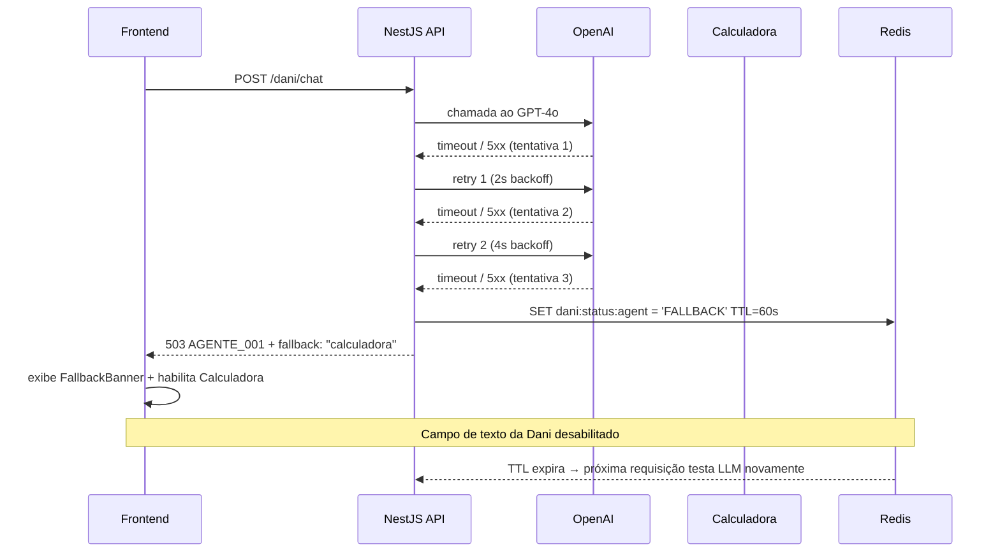

# 20 - Error Handling

| **Nome do Documento** | **Versão** | **Data** | **Autor** | **Status** |
|---|---|---|---|---|
| 20 - Error Handling | v1.0 | 23/03/2026 | Claude Code Desktop | Aprovado |

---

> 📌 **TL;DR**
>
> - **Princípios:** contrato único de erro entre backend, frontend e logs; nunca expor stack trace ao usuário; mensagem técnica e mensagem de UI sempre separadas
> - **Camadas cobertas:** API NestJS (exceptions filter), Frontend React (error boundaries), Redis/RabbitMQ (infraestrutura), Langfuse/Sentry (observabilidade)
> - **Taxonomia:** 10 categorias com prefixos por domínio: `AGENTE_`, `CALC_`, `OPR_`, `CESS_`, `ALERTA_`, `WA_`, `AUTH_`, `INFRA_`
> - **Retry:** erros de serviço externo são retryable (3x backoff); erros de validação e auth são não-retryable
> - **Recovery:** fallback para Calculadora quando LLM indisponível; estado Empty quando recurso não encontrado; estado Error quando serviço indisponível
> - **Correlation ID:** obrigatório em todo log e response de erro; nunca dados sensíveis em logs
> - **Seções pendentes:** 0

---

## 1. Taxonomia de Erros

Esta seção define as 10 categorias de erro do produto, seus códigos, comportamentos e recoveries.

| Código Prefixo | Categoria | Status HTTP | Logging Level | Retryable | Recovery |
|---|---|---|---|---|---|
| `AUTH_001–009` | Autenticação / Sessão | 401 / 403 | warn | Não | Redirect login (401) ou exibir mensagem (403) |
| `AGENTE_001–020` | Agente IA (Dani) | 422 / 429 / 503 | error | Parcial (503 sim) | Fallback Calculadora (503); mensagem de recusa (422) |
| `CALC_001–010` | Calculadora de Comissão | 422 / 500 | error | Não (422); Sim (500) | Exibir fórmula manual em texto; retry 1x |
| `OPR_001–010` | Oportunidades / Marketplace | 404 / 422 | info / warn | Não | Estado Empty; sugestões alternativas |
| `CESS_001–010` | Cessionário / Perfil | 404 / 409 / 422 | warn | Não | Mensagem inline; redirecionar para perfil |
| `ALERTA_001–005` | Alertas / Notificações | 422 / 500 | warn | Sim (500) | Retry silencioso; falha não bloqueia UI |
| `WA_001–010` | WhatsApp / OTP | 400 / 422 / 429 | warn / error | Parcial (429 não) | Contador de tentativas; mensagem de bloqueio |
| `INFRA_001–010` | Redis / RabbitMQ / Banco | 503 | error | Sim (3x backoff) | Degradação graceful; FallbackBanner |
| `RATE_001–003` | Rate Limiting (chat) | 429 | info | Não (TTL) | Contador regressivo; campo desabilitado |
| `VALID_001–020` | Validação de input (DTOs) | 400 | info | Não | Mensagem inline no campo; campo marcado em erro |

---

## 2. Schema de Erro (Backend)

Todo erro retornado pela API segue este schema. Nunca retornar stack trace, detalhe interno ou dado sensível.

### 2.1 Schema Padrão

```typescript
interface ErrorResponse {
  error: {
    code: string          // ex: "AGENTE_001"
    category: string      // ex: "agent_unavailable"
    message: string       // mensagem técnica (para logs e dev)
    user_message: string  // mensagem para exibição ao usuário
    details?: Record<string, unknown>  // contexto adicional (sem dados sensíveis)
    correlation_id: string // UUID v4 gerado por request
    timestamp: string      // ISO 8601
  }
}
```

### 2.2 Exemplos por Categoria

**Exemplo 1 — Agente indisponível (503)**
```json
{
  "error": {
    "code": "AGENTE_001",
    "category": "agent_unavailable",
    "message": "OpenAI API timeout after 30000ms on attempt 3/3",
    "user_message": "A Dani está temporariamente indisponível. A Calculadora de Comissão continua disponível para seus cálculos.",
    "details": { "fallback": "calculadora" },
    "correlation_id": "f47ac10b-58cc-4372-a567-0e02b2c3d479",
    "timestamp": "2026-03-23T12:00:00.000Z"
  }
}
```

**Exemplo 2 — Rate limit chat (429)**
```json
{
  "error": {
    "code": "AGENTE_RATE_001",
    "category": "rate_limit_exceeded",
    "message": "Rate limit: 30/3600s exceeded for cessionario abc123",
    "user_message": "Você atingiu o limite de 30 mensagens por hora. Você poderá enviar a próxima mensagem em 23 minutos.",
    "details": { "retry_after_seconds": 1380 },
    "correlation_id": "a1b2c3d4-e5f6-7890-abcd-ef1234567890",
    "timestamp": "2026-03-23T12:00:00.000Z"
  }
}
```

**Exemplo 3 — Validação DTO (400)**
```json
{
  "error": {
    "code": "VALID_001",
    "category": "validation_error",
    "message": "DTO validation failed: message must not be empty",
    "user_message": "O campo de mensagem não pode estar vazio.",
    "details": { "field": "message", "constraint": "isNotEmpty" },
    "correlation_id": "b2c3d4e5-f6a7-8901-bcde-f12345678901",
    "timestamp": "2026-03-23T12:00:00.000Z"
  }
}
```

**Anti-exemplo:**
```json
❌ { "message": "Internal Server Error" }
❌ { "error": "Something went wrong", "stack": "at Object.<anonymous>..." }
```
```json
✅ {
  "error": {
    "code": "INFRA_001",
    "category": "database_unavailable",
    "message": "Prisma: Can't reach database server at localhost:5432",
    "user_message": "Serviço temporariamente indisponível. Tente novamente em instantes.",
    "correlation_id": "...",
    "timestamp": "..."
  }
}
```

---

## 3. Error Classes (Backend — NestJS)

### 3.1 Hierarquia de Classes

```typescript
// src/common/exceptions/

// Base class
export class DaniBaseException extends HttpException {
  readonly code: string
  readonly category: string
  readonly userMessage: string
  readonly isRetryable: boolean
  readonly correlationId: string

  constructor(params: {
    code: string
    category: string
    message: string
    userMessage: string
    statusCode: number
    isRetryable?: boolean
    details?: Record<string, unknown>
  }) {
    super({ error: { ...params, correlation_id: uuid(), timestamp: new Date().toISOString() } }, params.statusCode)
    this.code = params.code
    this.category = params.category
    this.userMessage = params.userMessage
    this.isRetryable = params.isRetryable ?? false
    this.correlationId = uuid()
  }
}

// Subclasses por domínio
export class AgenteException extends DaniBaseException {}        // 503 padrão, retryable
export class CalculadoraException extends DaniBaseException {}  // 422/500
export class AuthException extends DaniBaseException {}         // 401/403, não retryable
export class ValidationException extends DaniBaseException {}  // 400, não retryable
export class NotFoundDaniException extends DaniBaseException {} // 404, não retryable
export class RateLimitException extends DaniBaseException {}    // 429, não retryable (tem TTL)
export class ExternalServiceException extends DaniBaseException {} // 503, retryable
export class WhatsappException extends DaniBaseException {}    // 400/429, parcial
```

### 3.2 All Exceptions Filter (NestJS)

```typescript
// src/common/filters/all-exceptions.filter.ts
@Catch()
export class AllExceptionsFilter implements ExceptionFilter {
  catch(exception: unknown, host: ArgumentsHost): void {
    const ctx = host.switchToHttp()
    const response = ctx.getResponse()
    const request = ctx.getRequest()

    // Nunca expor stack trace ou detalhe interno
    if (exception instanceof DaniBaseException) {
      const body = exception.getResponse() as any
      logger.warn({
        correlation_id: body.error.correlation_id,
        code: body.error.code,
        path: request.url,
        cessionario_id: request.user?.cessionario_id  // hash em prod via Pino redact
      })
      return response.status(exception.getStatus()).json(body)
    }

    // Erro não mapeado → 500 genérico sem detalhes internos
    const correlationId = uuid()
    logger.error({
      correlation_id: correlationId,
      code: 'INFRA_000',
      path: request.url,
      error: exception instanceof Error ? exception.message : String(exception)
      // stack apenas em dev (NODE_ENV === 'development')
    })
    return response.status(500).json({
      error: {
        code: 'INFRA_000',
        category: 'internal_error',
        message: 'Internal server error',
        user_message: 'Serviço temporariamente indisponível. Tente novamente em instantes.',
        correlation_id: correlationId,
        timestamp: new Date().toISOString()
      }
    })
  }
}
```

---

## 4. Error Boundaries (Frontend)

### 4.1 Três Níveis de Boundary

| Nível | Escopo | Erros capturados | Fallback UI | Integração Sentry |
|---|---|---|---|---|
| **Global** | toda a aplicação | erros fatais de render, módulos não carregados | Tela de erro genérica com botão "Recarregar" | sim — `Sentry.captureException` |
| **Route-level** | cada rota/página | erro no carregamento de dados da rota (TanStack Query error boundary) | Tela de erro da rota com botão "Tentar novamente" | sim |
| **Component-level** | componentes críticos (DaniChatWindow, ComparisonTable, CalcResultCard) | erros de render isolados | Estado Error do componente (D09 §4 estados obrigatórios) | sim |

### 4.2 Implementação do Global Error Boundary

```tsx
// src/components/ErrorBoundary.tsx
import { Component, ReactNode } from 'react'
import * as Sentry from '@sentry/react'

interface Props { children: ReactNode; fallback?: ReactNode }
interface State { hasError: boolean; correlationId?: string }

export class ErrorBoundary extends Component<Props, State> {
  state: State = { hasError: false }

  static getDerivedStateFromError(): State {
    return { hasError: true }
  }

  componentDidCatch(error: Error, info: React.ErrorInfo): void {
    const correlationId = crypto.randomUUID()
    Sentry.captureException(error, {
      extra: { componentStack: info.componentStack, correlationId }
    })
    this.setState({ correlationId })
  }

  render(): ReactNode {
    if (this.state.hasError) {
      return this.props.fallback ?? (
        <div role="alert" aria-live="assertive">
          <p>Algo deu errado. Tente recarregar a página.</p>
          <button onClick={() => window.location.reload()}>Recarregar</button>
        </div>
      )
    }
    return this.props.children
  }
}
```

### 4.3 Error State dos Componentes (D09 — 4 estados obrigatórios)

```tsx
// Componente Dani — estado Error (não usar spinner)
function DaniChatWindow({ status }: { status: 'skeleton' | 'empty' | 'error' | 'populated' }) {
  if (status === 'error') {
    return (
      <FallbackBanner
        message="A Dani está temporariamente indisponível. A Calculadora continua disponível."
        action={{ label: 'Tentar novamente', onClick: retry }}
        aria-live="polite"
      />
    )
  }
  // ... outros estados
}
```

---

## 5. Mapeamento API Error → UI

Esta tabela mapeia os erros mais frequentes para o componente de UI, mensagem exibida e ação disponível.

| Código API | Status | Componente UI | Mensagem exibida ao usuário | Ação disponível |
|---|---|---|---|---|
| `AGENTE_001` | 503 | `FallbackBanner` | "A Dani está temporariamente indisponível. A Calculadora continua disponível." | "Abrir Calculadora" |
| `AGENTE_RATE_001` | 429 | Campo desabilitado + contador regressivo | "Você atingiu o limite de 30 mensagens por hora. Próxima mensagem em [mm:ss]." | contador regressivo (sem ação até TTL) |
| `AGENTE_004` | 403 | Toast de erro | "Acesso negado. Você só pode acessar os próprios dados." | — |
| `AUTH_002` | 401 | — (interceptor) | — (refresh automático silencioso → redirect login se falhar) | — |
| `WA_004` | 429 | Campo OTP desabilitado + contador | "Número bloqueado por 30 minutos. Tente novamente em [mm:ss]." | contador regressivo |
| `WA_007` | 422 | Campo OTP marcado em erro | "Código incorreto. [N] tentativas restantes." | campo limpo automaticamente |
| `WA_005` | 422 | Campo OTP marcado em erro + link | "Código expirado. Solicite um novo código." | botão "Reenviar código" (cooldown 60s) |
| `OPR_001` | 404 | Estado Empty da tela | "Não encontrei esta oportunidade no marketplace. Verifique o código." | chips com oportunidades semelhantes |
| `CALC_001` | 422 | Toast de aviso + resultado manual | "Não foi possível calcular. Use: Comissão = 20% × Δ (se Δ > 0)." | — |
| `VALID_001` | 400 | Campo em estado de erro | mensagem específica do campo inválido | campo ativo para correção |

**Anti-exemplo:**
```
❌ Exibir "Error: 422 Unprocessable Entity" ao usuário
❌ Exibir "Something went wrong, please try again"
```
```
✅ Exibir "Código incorreto. 3 tentativas restantes." com o campo OTP limpo e ativo para nova entrada.
```

---

## 6. Retry e Recovery

### 6.1 Erros Retryable

| Código | Estratégia | Max Retries | Backoff | Jitter | Após esgotar |
|---|---|---|---|---|---|
| `AGENTE_001` (OpenAI timeout/5xx) | Exponential backoff | 3 | 2s → 4s → 8s | ±500ms | FallbackBanner + Calculadora |
| `INFRA_001` (DB indisponível) | Exponential backoff | 3 | 1s → 2s → 4s | ±200ms | 503 genérico + Sentry alert |
| `INFRA_002` (Redis indisponível) | Linear backoff | 2 | 500ms | nenhum | Fail open para rate limit; fail closed para OTP block |
| `ALERTA_003` (RabbitMQ indisponível) | Exponential backoff | 3 | 5s → 15s → 30s | ±1s | DLQ (`dani.notificacoes.dlq`) |
| `WA_008` (EvolutionAPI 5xx) | Exponential backoff | 3 | 5s → 15s → 30s | ±1s | DLQ (`dani.whatsapp.dlq`) |

### 6.2 Erros Não-Retryable

| Código | Motivo | Comportamento |
|---|---|---|
| `AUTH_001–004` | Token inválido / expirado / revogado | Redirect login imediato (sem retry) |
| `AUTH_005` | Role não autorizado | Mensagem de acesso negado (sem retry) |
| `VALID_001–020` | Dados de entrada inválidos | Mensagem de validação inline (sem retry — corrija e reenvie) |
| `AGENTE_RATE_001` | Rate limit — TTL ativo | Aguardar TTL (contagem regressiva na UI) |
| `WA_004` | OTP hard block | Aguardar TTL 30min (contagem regressiva) |
| `OPR_001` | Oportunidade não encontrada | Estado Empty (sem retry automático) |
| `CESS_009` | Conflito de número já vinculado | Mensagem de conflito (sem retry — requer suporte) |

### 6.3 Fluxo de Recovery — Agente Indisponível



---

## 7. Logging de Erros

### 7.1 Campos Obrigatórios em Todo Log de Erro

```typescript
// Estrutura Pino — todo log de erro deve conter:
{
  correlation_id: string    // UUID v4 — rastreia request end-to-end
  error_code: string        // ex: "AGENTE_001"
  category: string          // ex: "agent_unavailable"
  level: 'info' | 'warn' | 'error' | 'fatal'
  message: string           // mensagem técnica interna
  modulo: string            // ex: "AgenteModule", "CalculadoraModule"
  request_path: string      // ex: "/api/v1/dani/chat"
  request_method: string    // ex: "POST"
  status_code: number       // ex: 503
  cessionario_id: string    // hash SHA-256 em produção (nunca UUID raw)
  session_id?: string       // quando disponível
  timestamp: string         // ISO 8601
  environment: string       // "development" | "staging" | "production"
  // stack_trace: apenas em development (NODE_ENV !== 'production')
}
```

### 7.2 Regras de Exclusão de Dados Sensíveis

```typescript
// Configuração Pino redact — nunca logar:
const logger = pino({
  redact: {
    paths: [
      'req.headers.authorization',   // JWT token
      'req.body.password',
      'req.body.otp',                 // OTP em plain text
      'req.body.phone',              // número de telefone
      '*.cessionario_id',            // substituir por hash em produção
      '*.cpf',
      '*.email'
    ],
    remove: false,  // substitui por "[Redacted]" em vez de remover
    censor: '[Redacted]'
  }
})
```

**Anti-exemplo:**
```typescript
❌ logger.error('User login failed', { user_id: 'uuid-raw', password: 'plaintext', otp: '123456' })
❌ logger.info(error.stack)  // stack trace em produção
```
```typescript
✅ logger.warn({
  correlation_id: req.correlationId,
  error_code: 'AUTH_002',
  message: 'Access token expired',
  cessionario_id: sha256(user.cessionario_id),
  request_path: req.path
})
```

---

## 8. Observabilidade e Alertas

### 8.1 Integração Sentry

```typescript
// Captura de erros via Sentry em todas as camadas
// Backend: AllExceptionsFilter envia erros 5xx e 4xx (exceto 400/404 comuns)
Sentry.captureException(error, {
  extra: {
    correlation_id: correlationId,
    error_code: errorCode,
    request_path: requestPath,
    environment: process.env.NODE_ENV
  },
  user: { id: sha256(user?.cessionario_id) }  // hash
})

// Frontend: ErrorBoundary + interceptor de API
// Alertas: P0 = notificação imediata; P1 = digest horário
```

### 8.2 Regras de Alerta por Nível

| Nível | Condição | Canal de alerta |
|---|---|---|
| **P0 — Crítico** | `INFRA_000` (erro não mapeado), `AUTH_005` (acesso negado massa), isolamento de dados falhou | Sentry → alerta imediato → Slack #alertas-criticos |
| **P1 — Alto** | `AGENTE_001` taxa > 5% das chamadas, `INFRA_001` (DB indisponível) | Sentry → alerta em 5min |
| **P2 — Médio** | `AGENTE_RATE_001` taxa > 20% das sessões, `WA_004` taxa > 10% | Sentry → digest diário |
| **P3 — Info** | `VALID_001–020`, `OPR_001`, `AUTH_002` (refresh normal) | Log apenas — sem alerta |

---

## 9. Testes de Error Handling

```typescript
// Cobertura mínima obrigatória:

// 1. AllExceptionsFilter — nunca expõe stack trace
it('should not expose stack trace in production', () => {
  process.env.NODE_ENV = 'production'
  const response = filter.catch(new Error('Internal'), host)
  expect(response.error.stack).toBeUndefined()
})

// 2. Rate limit — retorna 429 com retry_after_seconds
it('should return 429 with retry_after_seconds when rate limit exceeded', async () => {
  // simula 31 mensagens na janela de 1h
  const response = await request(app).post('/dani/chat').set('Authorization', jwt)
  expect(response.status).toBe(429)
  expect(response.body.error.code).toBe('AGENTE_RATE_001')
  expect(response.body.error.details.retry_after_seconds).toBeGreaterThan(0)
})

// 3. OTP hard block — retorna 429 após 5 falhas
it('should hard block after 5 consecutive OTP failures', async () => {
  for (let i = 0; i < 5; i++) {
    await request(app).post('/dani/whatsapp/verificar-otp').send({ phone: '+5511999999999', otp: '000000' })
  }
  const response = await request(app).post('/dani/whatsapp/verificar-otp').send(...)
  expect(response.status).toBe(429)
  expect(response.body.error.code).toBe('WA_004')
})

// 4. CessionarioOwnerGuard — bloqueia acesso a dados de outro cessionário
it('should return 403 when cessionario_id in token differs from resource', async () => {
  const response = await request(app)
    .get('/dani/oportunidades?cessionario_id=outro-id')
    .set('Authorization', jwtDeOutroCessionario)
  expect(response.status).toBe(403)
  expect(response.body.error.code).toBe('AUTH_005')
})

// 5. Fallback LLM — retorna AGENTE_001 com fallback "calculadora"
it('should return AGENTE_001 with fallback=calculadora on OpenAI timeout', async () => {
  mockOpenAI.mockRejectedValue(new Error('timeout'))
  const response = await request(app).post('/dani/chat').send({ message: 'analise esta oportunidade' })
  expect(response.status).toBe(503)
  expect(response.body.error.code).toBe('AGENTE_001')
  expect(response.body.error.details.fallback).toBe('calculadora')
})
```

---

## 10. Glossário de Códigos de Erro

| Código | Categoria | Mensagem técnica resumida | Retryable |
|---|---|---|---|
| `AGENTE_001` | agent_unavailable | OpenAI timeout/5xx esgotados | Sim (3x) |
| `AGENTE_002` | agent_fallback_active | Agente em modo fallback | Não (aguardar TTL 60s) |
| `AGENTE_003` | agent_tool_unknown | Tool call não reconhecida | Não |
| `AGENTE_004` | data_isolation_violation | cessionario_id inválido em tool arg | Não |
| `AGENTE_RATE_001` | rate_limit_exceeded | 30 msgs/hora atingidas | Não (aguardar TTL) |
| `AUTH_001` | token_missing | Bearer token ausente | Não |
| `AUTH_002` | token_expired | Access token expirado | Não (use refresh) |
| `AUTH_003` | token_invalid | JWT inválido ou mal-formado | Não |
| `AUTH_004` | payload_incomplete | cessionario_id ou role ausente no payload | Não |
| `AUTH_005` | forbidden | Role não autorizado / recurso de outro Cessionário | Não |
| `AUTH_006` | refresh_missing | Cookie dani_refresh_token ausente | Não |
| `AUTH_007` | refresh_expired | Refresh token expirado | Não (re-login) |
| `AUTH_008` | refresh_revoked | Refresh token revogado | Não |
| `AUTH_009` | owner_mismatch | Recurso pertence a outro Cessionário | Não |
| `CALC_001` | calculation_failed | Parâmetros inválidos para cálculo | Não |
| `CALC_002` | calculation_error | Erro interno na Calculadora | Sim (1x) |
| `OPR_001` | opportunity_not_found | OPR não existe ou não disponível | Não |
| `OPR_002` | opportunity_unavailable | OPR em negociação ou encerrada | Não |
| `CESS_001` | profile_not_found | Cessionário não encontrado | Não |
| `WA_001` | phone_invalid | Número de telefone inválido | Não |
| `WA_002` | phone_already_bound | Número já vinculado a outro perfil | Não |
| `WA_003` | otp_rate_limit | 3 tentativas/hora atingidas | Não (aguardar TTL) |
| `WA_004` | otp_hard_block | Hard block após 5 falhas | Não (aguardar 30min) |
| `WA_005` | otp_expired | OTP expirou (> 15min) | Não (solicitar novo) |
| `WA_007` | otp_invalid | OTP incorreto | Não (nova tentativa) |
| `WA_008` | evolution_unavailable | EvolutionAPI 5xx/timeout | Sim (3x) |
| `INFRA_000` | internal_error | Erro interno não mapeado | Não (escalar) |
| `INFRA_001` | database_unavailable | Supabase/Prisma indisponível | Sim (3x) |
| `INFRA_002` | redis_unavailable | Redis indisponível | Sim (2x) |
| `RATE_001` | global_rate_limit | Limite global de requisições | Não (aguardar TTL) |
| `VALID_001` | validation_error | DTO de entrada inválido | Não (corrigir input) |

---

## 11. Backlog de Pendências

| Item | Marcador | Seção | Justificativa / Trade-off | Impacto | Dono | Status |
|---|---|---|---|---|---|---|
| Fail open vs fail closed Redis indisponível | [DECISÃO AUTÔNOMA] Fail open para rate limit (deixa passar); fail closed para OTP block (bloqueia por segurança). Alternativa descartada: fail closed para ambos — impediria chat durante falha Redis, degradando UX. Critério: segurança > UX para OTP; UX > segurança para rate limit (sem dado financeiro em jogo). | §6.1 | Segurança vs disponibilidade | P1 | Tech Lead | Concluído |
| Stack trace em development | [DECISÃO AUTÔNOMA] Stack trace incluída apenas em `NODE_ENV === 'development'`. Nunca em staging/produção. Alternativa descartada: nunca incluir — dificulta debugging local. Critério: DX em dev vs segurança em produção. | §3.2 | Segurança | P2 | Backend Lead | Concluído |
| Alerta P0 para isolamento de dados violado | [DECISÃO AUTÔNOMA] Tratar `AGENTE_004` em escala como incidente P0. Alternativa descartada: P1 — isolamento de dados é princípio central da Dani (D01 §3). Critério: risco jurídico e reputacional de vazamento entre Cessionários. | §8.2 | Segurança | P0 | DevOps | Concluído |
