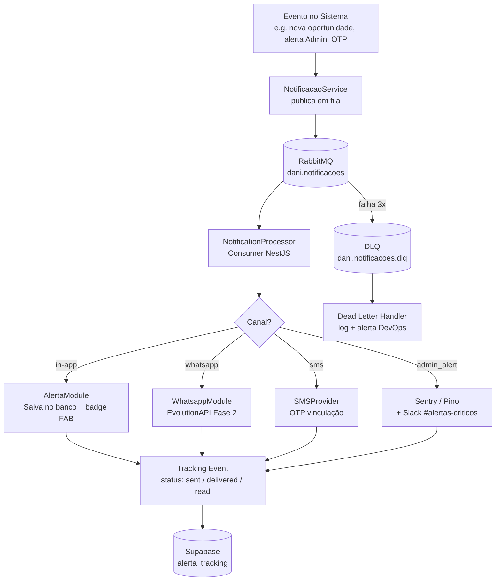

# 21 - Notificações, Templates e Implementação

| **Nome do Documento** | **Versão** | **Data** | **Autor** | **Status** |
|---|---|---|---|---|
| 21 - Notificações, Templates e Implementação | v1.0 | 23/03/2026 | Claude Code Desktop | Aprovado |

---

> 📌 **TL;DR**
>
> - **Canais:** 4 canais ativos — In-App (badge FAB + painel de alertas), WhatsApp Business (Fase 2 via EvolutionAPI), SMS (OTP vinculação), Admin Alert (interno)
> - **Templates:** 10 templates documentados com gatilho, variáveis, prioridade e regra de opt-out
> - **Arquitetura:** envio assíncrono via RabbitMQ (`dani.notificacoes`) com retry 3x e DLQ; nunca síncrono na request principal
> - **Notificações críticas (sem opt-out):** OTP de vinculação, alertas de segurança ao Admin, desligamento automático da Dani
> - **Opt-out:** Cessionário pode desativar alertas proativos de oportunidades; notificações críticas são sempre entregues
> - **LGPD:** PARAR via WhatsApp = desvinculação imediata e irreversível (RN-DC-044); dados de histórico retidos por 90 dias
> - **Seções pendentes:** 0

---

## 1. Arquitetura de Notificações

Todo evento notificável é publicado de forma assíncrona em fila RabbitMQ. Nunca há chamada de envio síncrona na request principal do Cessionário.



---

## 2. Canais

### 2.1 Canal: In-App (Badge FAB + Painel de Alertas)

| Campo | Valor |
|---|---|
| Tecnologia | Supabase Realtime / polling TanStack Query |
| Prioridade de envio | síncrono ao banco, UI atualiza via polling 30s |
| Rate limiting | sem limite (são escritas no banco, não enviadas por push) |
| Opt-out | sim — Cessionário pode desativar alertas proativos de oportunidades |
| Fallback | nenhum (dado sempre disponível no banco) |
| Retry | não aplicável (escrita em banco) |

**Payload padrão:**
```typescript
interface AlertaInApp {
  id: string                    // UUID v4
  cessionario_id: string        // isolamento obrigatório
  tipo: AlertaTipo              // OPORTUNIDADE_NOVA | NEGOCIACAO_STATUS | TAKEOVER | AGENTE_DOWN | ...
  titulo: string                // ex: "Nova oportunidade em Fortaleza"
  corpo: string                 // ex: "OPR-2026-0042 — Δ R$ 120.000, risco 3/10"
  deep_link: string             // ex: "/oportunidades/OPR-2026-0042"
  prioridade: 'critico' | 'alto' | 'normal' | 'baixo'
  lido: boolean                 // false por padrão
  created_at: Date
  expires_at?: Date             // alertas de oportunidade expiram quando status muda
}
```

> ⚙️ **Regra:** todo alerta in-app deve ter `deep_link` contextual. Alerta sem deep link é anti-pattern.

### 2.2 Canal: WhatsApp Business (Fase 2 — EvolutionAPI)

| Campo | Valor |
|---|---|
| Tecnologia | EvolutionAPI v2.x via HTTP + fila `dani.whatsapp` |
| Prioridade | publicado na fila `dani.whatsapp`, processado pelo WhatsappModule |
| Rate limiting | 1 msg/minuto por número (EvolutionAPI limit) — [DECISÃO AUTÔNOMA] |
| Opt-out | PARAR = desvinculação imediata e irreversível (LGPD, RN-DC-044) |
| Fallback | se EvolutionAPI indisponível: retry 3x (5s/15s/30s) → DLQ |
| Retry | 3x com backoff exponencial |

**Payload padrão:**
```typescript
interface WhatsappMessage {
  phone: string          // número com DDI +55
  message: string        // texto plain (sem HTML, sem markdown pesado)
  tipo: 'transacional' | 'marketing'  // 'marketing' exige opt-in explícito
  template_id: string    // referência ao template (nunca hardcoded)
  cessionario_id: string
}
```

> 🔴 **WhatsApp marketing:** qualquer mensagem de promoção ou oportunidade para Cessionários SEM opt-in explícito é violação da política Meta WhatsApp Business. Fase 2 inicia apenas com mensagens transacionais.

### 2.3 Canal: SMS (OTP de Vinculação)

| Campo | Valor |
|---|---|
| Tecnologia | SMS Provider (Twilio ou AWS SNS — [DEFINIÇÃO PENDENTE]) |
| Uso | exclusivo para OTP de vinculação WhatsApp (RN-DC-040–041) |
| Opt-out | não aplicável — é transacional / funcional |
| Rate limiting | 3 SMS/hora por número (controlado pelo rate limit do OTP) |
| Retry | nenhum (código inválido = Cessionário reenviar) |
| Conteúdo | "Seu código de verificação Repasse Seguro é: XXXXXX. Válido por 15 minutos." |

### 2.4 Canal: Admin Alert (Interno)

| Campo | Valor |
|---|---|
| Destino | Sentry alert + Pino log (level=error/fatal) + Slack #alertas-criticos (Fase 2) |
| Gatilhos | taxa de erro > 10%/30% (RN-DC-024), latência > 5min (RN-DC-029), isolamento violado |
| Opt-out | não permitido — crítico operacional |
| Retry | não aplicável |

---

## 3. Templates

Todos os templates são armazenados como TypeScript enums/constantes em `src/notificacoes/templates/`. Nunca hardcoded em service ou controller.

**Anti-exemplo:**
```typescript
❌ await send({ message: `Olá ${nome}, nova oportunidade em ${cidade}!` })
```
```typescript
✅ await notificacaoService.send({
     template: Templates.OPORTUNIDADE_NOVA,
     vars: { nome, cidade, opr_id, delta, risco },
     cessionario_id
   })
```

| ID | Template | Evento Gatilho | Canal | Variáveis | Prioridade | Opt-out? |
|---|---|---|---|---|---|---|
| `TPLF-001` | Boas-vindas Dani | Primeiro acesso ao chat (KYC aprovado) | In-App | `nome` | normal | Não |
| `TPLF-002` | Nova Oportunidade no Marketplace | Nova OPR publicada com match no perfil do Cessionário | In-App + WhatsApp (Fase 2) | `opr_id`, `cidade`, `delta`, `risco`, `deep_link` | alto | Sim (alertas de oportunidade) |
| `TPLF-003` | Oportunidade Voltou a Estar Disponível | OPR retorna ao status DISPONIVEL após negociação | In-App + WhatsApp (Fase 2) | `opr_id`, `cidade`, `delta`, `deep_link` | alto | Sim |
| `TPLF-004` | Lembrete ZapSign D+2 | 2 dias após aceite de proposta sem assinatura | In-App + WhatsApp (Fase 2) | `opr_id`, `prazo_restante`, `link_assinatura` | critico | Não |
| `TPLF-005` | Lembrete ZapSign D+4 | 4 dias após aceite sem assinatura (urgente) | In-App + WhatsApp (Fase 2) | `opr_id`, `link_assinatura`, `prazo_expiracao` | critico | Não |
| `TPLF-006` | ZapSign Expirado | 5 dias sem assinatura — envelope expirou | In-App | `opr_id`, `link_suporte` | critico | Não |
| `TPLF-007` | Prazo Escrow Crítico | 1 dia útil restante para depósito no Escrow | In-App + WhatsApp (Fase 2) | `opr_id`, `valor_escrow`, `prazo`, `link_escrow` | critico | Não |
| `TPLF-008` | OTP de Vinculação WhatsApp | Cessionário solicita vincular número | SMS | `otp`, `expiracao_min` | critico | Não |
| `TPLF-009` | WhatsApp Vinculado com Sucesso | Confirmação da vinculação via WhatsApp | In-App + WhatsApp (Fase 2) | `numero_mascarado` | normal | Não |
| `TPLF-010` | Alerta Admin — Dani Desligada | Taxa de erro > 30% (RN-DC-024) | Admin Alert | `taxa_erro`, `timestamp`, `environment` | critico | Não |

**Anti-exemplo:**
```
❌ Push sem deep link: "Nova oportunidade disponível para você!"
```
```
✅ TPLF-002 com deep_link: "/oportunidades/OPR-2026-0042" e variáveis:
   "Nova oportunidade em Fortaleza: Δ R$ 120.000, risco 3/10. Ver detalhes →"
```

---

## 4. Preferências do Usuário (Opt-out)

### 4.1 Modelo de Preferências

```typescript
interface PreferenciasNotificacao {
  cessionario_id: string
  canais: {
    in_app: boolean       // padrão: true
    whatsapp: boolean     // padrão: false (opt-in explícito na vinculação)
  }
  tipos: {
    oportunidade_nova: boolean       // padrão: true | opt-out permitido
    oportunidade_retorno: boolean    // padrão: true | opt-out permitido
    negociacao_status: boolean       // padrão: true | opt-out NÃO permitido
    zapsign_lembrete: boolean        // padrão: true | opt-out NÃO permitido
    escrow_prazo: boolean            // padrão: true | opt-out NÃO permitido
  }
  updated_at: Date
}
```

> 🔴 **Notificações críticas (não pode desativar):** `TPLF-004` (ZapSign D+2), `TPLF-005` (ZapSign D+4), `TPLF-006` (ZapSign expirado), `TPLF-007` (Escrow crítico), `TPLF-008` (OTP). Essas notificações têm obrigação contratual ou financeira.

### 4.2 Endpoint de Preferências

```
GET  /api/v1/dani/alertas/preferencias          → retorna modelo de preferências
PUT  /api/v1/dani/alertas/preferencias          → atualiza preferências
POST /api/v1/dani/whatsapp/desvincular          → opt-out total do canal WhatsApp (LGPD)
```

### 4.3 Opt-out via WhatsApp (LGPD — RN-DC-044)

```
Cessionário envia "PARAR" no WhatsApp da Dani:
  1. EvolutionAPI recebe webhook com mensagem "PARAR"
  2. WhatsappModule processa → desvincula número imediatamente
  3. Status WhatsApp → NÃO VINCULADO
  4. Nenhuma mensagem WhatsApp será enviada a partir deste ponto
  5. Log de audit: { cessionario_id, phone_hash, tipo: 'opt_out_lgpd', timestamp }
```

> 🔴 **LGPD:** O opt-out via "PARAR" é exigência legal e deve ser processado em até 24h. No nosso caso é imediato (D01 RN-DC-044). Nunca ignorar ou enfileirar o processamento desta mensagem.

---

## 5. Fila e Processamento

### 5.1 Configuração RabbitMQ

| Fila | Exchange | DLQ | Max Retries | Backoff | Uso |
|---|---|---|---|---|---|
| `dani.notificacoes` | `dani.notifications` (fanout) | `dani.notificacoes.dlq` | 3 | 5s → 15s → 30s | Todos os alertas in-app e WhatsApp (Fase 2) |
| `dani.whatsapp` | `dani.whatsapp` (direct) | `dani.whatsapp.dlq` | 3 | 5s → 15s → 30s | Mensagens WhatsApp via EvolutionAPI |
| `dani.agent_monitor` | `dani.monitor` (direct) | `dani.agent_monitor.dlq` | 3 | 2s → 5s → 10s | Monitoramento SLA e taxa de erro |

### 5.2 Publicação de Notificação (NestJS)

```typescript
// NotificacaoService — nunca chame diretamente o canal de envio
@Injectable()
export class NotificacaoService {
  async publicar(evento: NotificacaoEvento): Promise<void> {
    // Validação: template deve existir
    if (!Templates[evento.template_id]) {
      throw new Error(`ALERTA_001: template ${evento.template_id} não encontrado`)
    }

    // Isolamento: cessionario_id obrigatório para eventos de usuário
    if (evento.tipo !== 'admin_alert' && !evento.cessionario_id) {
      throw new Error('ALERTA_002: cessionario_id obrigatório para notificações de usuário')
    }

    // Publica na fila — nunca envia síncrono
    await this.amqpConnection.publish(
      'dani.notifications',
      'notificacao.nova',
      evento,
      { persistent: true, expiration: 3600000 }  // TTL 1h para mensagens transacionais
    )

    // Log de publicação
    this.logger.info({
      event: 'notification_published',
      template_id: evento.template_id,
      canal: evento.canal,
      cessionario_id: evento.cessionario_id
    })
  }
}
```

**Anti-exemplo:**
```typescript
❌ // Envio síncrono na request principal (bloqueia response)
async handleChat(body: ChatDto): Promise<Response> {
  await evolutionApi.send({ phone, message })  // BLOQUEIA
  return this.agente.processar(body)
}
```
```typescript
✅ // Envio assíncrono via fila
async handleChat(body: ChatDto): Promise<Response> {
  await notificacaoService.publicar({ template: 'TPLF-002', ... })  // não bloqueia
  return this.agente.processar(body)
}
```

### 5.3 Dead Letter Handler

```typescript
// Processador da DLQ — log + alerta DevOps
@RabbitSubscribe({ queue: 'dani.notificacoes.dlq' })
async handleDeadLetter(message: NotificacaoEvento): Promise<void> {
  this.logger.error({
    event: 'notification_dead_letter',
    template_id: message.template_id,
    canal: message.canal,
    cessionario_id: message.cessionario_id,
    tentativas: message.retryCount
  })
  // Alerta DevOps se for notificação crítica
  if (message.prioridade === 'critico') {
    await sentry.captureMessage('DLQ crítica — notificação não entregue', 'error')
  }
}
```

---

## 6. Tracking e Métricas

### 6.1 Eventos de Tracking

| Evento | Quando | Canal |
|---|---|---|
| `sent` | Publicado na fila com sucesso | todos |
| `delivered` | Consumer confirmou processamento | todos |
| `read` | Cessionário marcou alerta como lido (in-app) ou webhook read receipt (WhatsApp) | in-app, WhatsApp |
| `clicked` | Cessionário clicou no deep link do alerta | in-app, WhatsApp |
| `failed` | Todas as tentativas esgotadas → DLQ | todos |
| `opted_out` | Cessionário desativou tipo ou canal | todos |

### 6.2 Schema de Tracking

```typescript
interface AlertaTracking {
  id: string
  alerta_id: string
  cessionario_id: string    // hash em queries externas
  evento: TrackingEvento
  canal: Canal
  timestamp: Date
  metadata?: {
    tentativa?: number
    erro?: string           // sem stack trace
    whatsapp_message_id?: string
  }
}
```

### 6.3 Dashboard Mínimo de Métricas

| Métrica | Fonte | Threshold de alerta |
|---|---|---|
| Taxa de entrega por canal (%) | `alerta_tracking` (`sent` / `delivered`) | < 95% → alerta P1 |
| Taxa de leitura in-app (%) | `alerta_tracking` (`read` / `delivered`) | métrica de saúde — sem alerta automático |
| DLQ size | RabbitMQ management API | > 10 itens → alerta P1 |
| Notificações críticas não entregues | `alerta_tracking` (`failed` + `prioridade='critico'`) | qualquer → alerta P0 |

---

## 7. Testes

### 7.1 Sandbox e Preview

```typescript
// Em desenvolvimento (NODE_ENV === 'development'):
// Todos os canais de envio externo são interceptados
// WhatsApp: mensagem logada no console em vez de enviada
// SMS: OTP exibido nos logs (nunca em produção)

@Injectable()
export class NotificationInterceptor {
  shouldIntercept(): boolean {
    return process.env.NODE_ENV === 'development'
  }

  intercept(message: WhatsappMessage): void {
    console.log('[DEV NOTIFICATION INTERCEPTED]', {
      canal: 'whatsapp',
      phone: message.phone,
      message: message.message,
      template_id: message.template_id
    })
  }
}
```

### 7.2 Cenários de Teste Obrigatórios

```typescript
// 1. Template válido → publicado na fila
it('should publish to queue when template exists and cessionario_id provided', async () => {
  await notificacaoService.publicar({ template_id: 'TPLF-002', cessionario_id: uuid(), ... })
  expect(amqpMock.publish).toHaveBeenCalledWith('dani.notifications', expect.any(String), ...)
})

// 2. Template inválido → ALERTA_001
it('should throw ALERTA_001 when template not found', async () => {
  await expect(notificacaoService.publicar({ template_id: 'INVALIDO', ... }))
    .rejects.toThrow('ALERTA_001')
})

// 3. Notificação crítica sem opt-out
it('should not allow opt-out for zapsign reminder templates', () => {
  expect(canOptOut('TPLF-004')).toBe(false)
  expect(canOptOut('TPLF-007')).toBe(false)
})

// 4. Opt-out PARAR WhatsApp → desvinculação imediata
it('should unlink whatsapp immediately on PARAR message', async () => {
  await whatsappModule.processWebhook({ from: '+5511999999999', message: 'PARAR' })
  const binding = await prisma.whatsappBinding.findFirst({ where: { phone_hash: sha256('+5511999999999') } })
  expect(binding?.status).toBe('INACTIVE')
})

// 5. Retry 3x → DLQ
it('should route to DLQ after 3 failed delivery attempts', async () => {
  evolutionApiMock.send.mockRejectedValue(new Error('timeout'))
  await notificationProcessor.process(evento)
  // Após 3 tentativas
  expect(dlqMock.publish).toHaveBeenCalledTimes(1)
})
```

---

## 8. LGPD e Compliance

| Requisito | Implementação |
|---|---|
| Opt-out WhatsApp via PARAR | Processado imediatamente pelo webhook handler (RN-DC-044) |
| Não enviar marketing sem opt-in | WhatsApp Fase 2 inicia apenas com mensagens transacionais; opt-in explícito antes de qualquer mensagem promocional |
| Retenção de histórico | Alertas in-app mantidos por 90 dias (alinhado ao histórico de conversas — D01) |
| Dados de contato em logs | Número de telefone como SHA-256 hash em todos os logs e Redis keys |
| Direito de exclusão | Desvinculação = todos os dados de WhatsApp do Cessionário removidos do banco |
| Audit trail | `alerta_tracking` com `opted_out` event + timestamp para comprovação de opt-out |

---

## 9. Glossário

| Termo | Definição |
|---|---|
| **DLQ** | Dead Letter Queue — fila onde mensagens que falharam após todos os retries são armazenadas para análise e reprocessamento manual |
| **Template** | Estrutura pré-definida de notificação com placeholders para variáveis; nunca hardcoded no código |
| **Deep Link** | URL interna que abre a tela específica contextual do alerta |
| **Opt-out** | Escolha do usuário de não receber determinado tipo de notificação |
| **Notificação Crítica** | Notificação com obrigação contratual, financeira ou de segurança — não pode ser desativada |
| **Transacional** | Mensagem desencadeada por ação do usuário (ex: OTP, confirmação de ação) |
| **Proativo** | Mensagem desencadeada pelo sistema com base em eventos (ex: nova oportunidade) |

---

## 10. Backlog de Pendências

| Item | Marcador | Seção | Justificativa / Trade-off | Impacto | Dono | Status |
|---|---|---|---|---|---|---|
| SMS Provider (Twilio vs AWS SNS) | [DEFINIÇÃO PENDENTE] Opção A: Twilio SMS — DX excelente, SDK Node.js robusto, custo ~$0.0075/SMS. Opção B: AWS SNS SMS — integração com infra AWS, custo ~$0.00645/SMS. Trade-off: Twilio tem melhor DX e suporte; AWS tem integração nativa com stack de infra. | §2.3 | Custo operacional + integração | P1 | DevOps | Pendente — avaliar na Fase 2 |
| Rate limit WhatsApp 1 msg/min | [DECISÃO AUTÔNOMA] 1 mensagem/minuto por número alinhado ao limite de rate da EvolutionAPI para evitar bloqueio do número pelo WhatsApp Business. Alternativa descartada: sem rate limit — risco de bloqueio do número pela Meta. Critério: preservar a instância WhatsApp Business. | §2.2 | Disponibilidade do canal | P1 | Backend Lead | Concluído |
| TTL de mensagens na fila (1h) | [DECISÃO AUTÔNOMA] Mensagens transacionais com TTL=1h. Alternativa descartada: sem TTL — mensagem de OTP entregue horas depois seria inválida. Critério: OTP expira em 15min; alertas de oportunidade perdem contexto após horas. | §5.2 | Relevância da notificação | P2 | Backend Lead | Concluído |
| WhatsApp marketing opt-in | [DEFINIÇÃO PENDENTE] Opção A: opt-in no momento da vinculação (tela separada com termos). Opção B: opt-in progressivo — perguntar após 1 mês de uso. Trade-off: A tem maior compliance mas menor conversão; B tem melhor conversão mas requer mais cuidado legal. | §2.2 | Compliance LGPD + Meta Policy | P0 | Product Manager + Jurídico | Pendente — Fase 2 |
