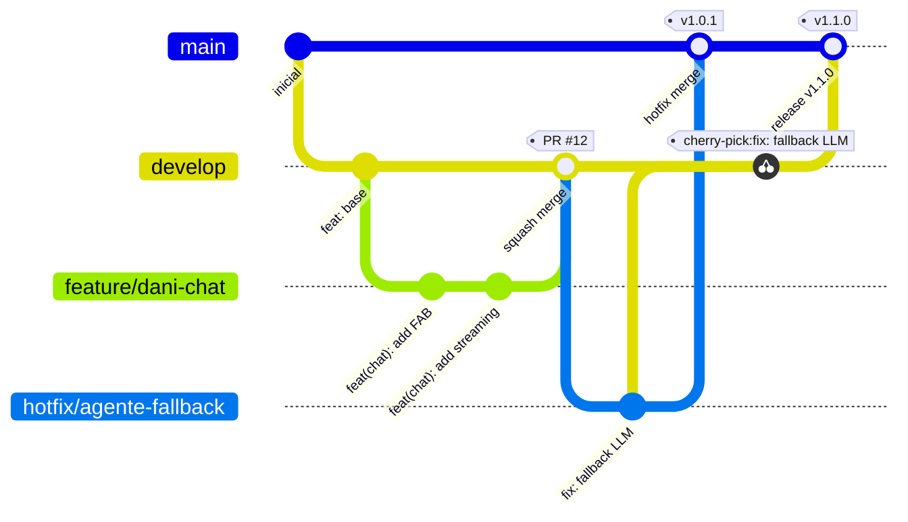
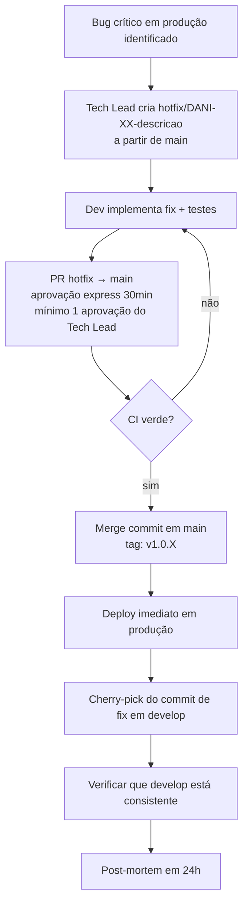

# 23 - Guia de Contribuição

| **Nome do Documento** | **Versão** | **Data** | **Autor** | **Status** |
|---|---|---|---|---|
| 23 - Guia de Contribuição | v1.0 | 23/03/2026 | Claude Code Desktop | Aprovado |

---

> 📌 **TL;DR**
>
> - **Branching:** trunk-based simplificado com `main` (produção), `develop` (integração), `feature/*`, `bugfix/*`, `hotfix/*`
> - **Commits:** Conventional Commits obrigatório — `tipo(escopo): descrição` em inglês; mensagens genéricas bloqueadas pelo hook
> - **PR:** máximo 400 linhas alteradas; template obrigatório; mínimo 1 aprovação; SLA de review 24h úteis
> - **Merge:** squash para features/bugfixes em `develop`; merge commit para `develop → main`; hotfix faz merge direto em `main` + cherry-pick em `develop`
> - **CI obrigatório antes do merge:** lint + testes + build verde
> - **Hotfix:** fluxo acelerado com aprovação express (30min) e deploy direto ao `main`
> - **Branches protegidas:** `main` (2 aprovações) e `develop` (1 aprovação) — force push proibido

---

## 1. Branching Strategy

O projeto usa **trunk-based development simplificado** com proteções em `main` e `develop`. Branches de feature têm vida curta (máximo 5 dias úteis) para evitar divergência excessiva.



### 1.1 Branches e Nomenclatura

| Branch | Proteção | Quem cria | Quando | Exemplo |
|---|---|---|---|---|
| `main` | ✅ Protegida (2 aprovações, sem force push) | Tech Lead | única | `main` |
| `develop` | ✅ Protegida (1 aprovação) | Tech Lead | única | `develop` |
| `feature/<ticket>-<descricao>` | não protegida | qualquer dev | nova feature | `feature/DANI-42-fab-component` |
| `bugfix/<ticket>-<descricao>` | não protegida | qualquer dev | bug não crítico | `bugfix/DANI-55-otp-rate-limit` |
| `hotfix/<ticket>-<descricao>` | não protegida | Tech Lead / dev de plantão | bug crítico em produção | `hotfix/DANI-60-agent-isolation-breach` |
| `chore/<descricao>` | não protegida | qualquer dev | tarefas de manutenção | `chore/update-pnpm-lockfile` |
| `docs/<descricao>` | não protegida | qualquer dev | atualização de docs | `docs/update-api-docs` |

**Anti-exemplo:**
```bash
❌ git checkout -b nova-feature
❌ git checkout -b fix
❌ git checkout -b joao/meu-trabalho
```
```bash
✅ git checkout -b feature/DANI-42-fab-component
✅ git checkout -b bugfix/DANI-55-otp-rate-limit
✅ git checkout -b hotfix/DANI-60-fallback-llm
```

### 1.2 Regras de Ciclo de Vida

- Feature branch: **máximo 5 dias úteis** antes de abrir PR. Se ultrapassar, rebasing em `develop` obrigatório.
- Bugfix branch: **máximo 2 dias úteis**.
- Hotfix branch: **máximo 4 horas** — deploy emergencial.
- Branch abandonada (> 10 dias sem commit): avisar o autor e deletar após 2 dias sem resposta.

---

## 2. Convenção de Commits

O projeto usa **Conventional Commits** (v1.0.0). O hook `commit-msg` (Husky) valida o formato antes de aceitar o commit. Commits que não passam no hook são rejeitados.

### 2.1 Formato

```
tipo(escopo): descrição curta em inglês

[corpo opcional — explicar o "por quê" se necessário]

[footer opcional — referência ao ticket: DANI-42]
```

### 2.2 Tipos Permitidos

| Tipo | Uso | Exemplo |
|---|---|---|
| `feat` | Nova funcionalidade | `feat(chat): add FAB with notification badge` |
| `fix` | Correção de bug | `fix(agente): handle OpenAI timeout after 30s` |
| `docs` | Documentação | `docs(api): update /dani/chat endpoint spec` |
| `style` | Formatação / lint | `style(calculadora): fix eslint warnings` |
| `refactor` | Refatoração sem novo comportamento | `refactor(auth): extract CessionarioOwnerGuard` |
| `test` | Testes | `test(otp): add hard block coverage` |
| `chore` | Dependências, config, build | `chore: bump pnpm to 9.5.0` |
| `ci` | Configuração de CI/CD | `ci: add sentry sourcemaps upload step` |
| `perf` | Melhoria de performance | `perf(rag): reduce chunk size from 1024 to 512` |

**Escopos aprovados:**
`chat`, `agente`, `calculadora`, `auth`, `opr`, `alerta`, `whatsapp`, `ux`, `api`, `db`, `infra`

### 2.3 Tabela de Exemplos

| ✅ Correto | ❌ Incorreto |
|---|---|
| `feat(chat): add streaming SSE support` | `fix stuff` |
| `fix(agente): fallback to calculadora on 3rd timeout` | `update files` |
| `test(otp): add 5 consecutive failures hard block test` | `changes` |
| `chore: update pnpm lockfile` | `WIP` |
| `refactor(auth): isolate CessionarioOwnerGuard to own file` | `misc` |

**Anti-exemplo de commit:**
```bash
❌ git commit -m "fix"
❌ git commit -m "alterações diversas"
❌ git commit -m "WIP - nao terminou"
```
```bash
✅ git commit -m "fix(agente): handle empty response from OpenAI on retry 3"
✅ git commit -m "feat(otp): block number for 30min after 5 consecutive failures"
```

---

## 3. Pull Request Flow

### 3.1 Template de PR

Ao abrir um PR, preencha o template completo (localizado em `.github/pull_request_template.md`):

```markdown
## Descrição
<!-- O que esta mudança faz e por quê é necessária? -->

## Tipo de mudança
- [ ] Nova feature (`feat`)
- [ ] Correção de bug (`fix`)
- [ ] Refatoração (`refactor`)
- [ ] Documentação (`docs`)
- [ ] Chore / dependências (`chore`)

## Checklist
- [ ] Testes unitários adicionados / atualizados
- [ ] Testes passando localmente (`pnpm test`)
- [ ] Lint sem erros (`pnpm lint`)
- [ ] Build sem erros (`pnpm build`)
- [ ] Documentação atualizada (se API ou comportamento mudou)
- [ ] Sem secret ou dado sensível commitado
- [ ] `cessionario_id` nunca exposto em logs (se mudança no backend)

## Tickets relacionados
<!-- DANI-XX -->

## Screenshots / evidências (se mudança de UI)
<!-- Adicione capturas antes/depois se aplicável -->
```

### 3.2 Regras de Tamanho

| Critério | Limite | Ação se ultrapassar |
|---|---|---|
| Linhas alteradas | ≤ 400 (excluindo lockfiles e arquivos gerados) | Dividir em PRs menores antes de abrir |
| Arquivos modificados | ≤ 20 | Dividir por responsabilidade (feature split) |
| Commits no PR | ≤ 10 (serão squashados no merge) | sem limite rígido — serão squashados |

**Anti-exemplo:**
```
❌ PR com 2.000 linhas modificadas, sem descrição, sem checklist
❌ PR: "refactor everything" com 45 arquivos modificados
```
```
✅ PR focado: "feat(chat): implement FAB with badge — 180 linhas, 4 arquivos, checklist completo"
```

### 3.3 Regras de Review

| Regra | Valor |
|---|---|
| Aprovações mínimas (feature/bugfix → develop) | 1 aprovação |
| Aprovações mínimas (develop → main) | 2 aprovações |
| SLA de review | 24 horas úteis |
| Quem pode aprovar | qualquer membro do time com acesso ao repositório |
| Quem NÃO pode aprovar | o próprio autor do PR |
| Auto-merge | proibido em `main`; permitido em `develop` após CI verde + 1 aprovação |

---

## 4. Code Review Guidelines

### 4.1 O que verificar no review

| Critério | Verificação | Bloqueia merge? |
|---|---|---|
| **Funcionalidade** | O código faz o que a descrição diz? | Sim |
| **Testes** | Há cobertura para os casos principais e edge cases? | Sim |
| **Segurança** | `cessionario_id` filtrado? Nenhum secret em código? | Sim (P0) |
| **Legibilidade** | Funções pequenas, nomes claros, sem código morto? | Não (sugestão) |
| **Performance** | Query sem índice? N+1? Chunk size no RAG? | Não (sugestão) |
| **Tipos** | TypeScript strict? Sem `any` sem justificativa? | Sim |
| **Docs** | Swagger/OpenAPI atualizado se endpoint mudou? | Sim |

### 4.2 Como dar feedback

```
✅ Feedback bloqueante:
"❌ BLOQUEIO: cessionario_id não está sendo injetado no tool arg (linha 42).
Viola o contrato de isolamento D01 §3."

✅ Feedback sugestivo (não bloqueia):
"💡 Sugestão: considerar extrair a validação do phone para um helper reutilizável.
Não é bloqueante — pode ser feito em PR separado."

❌ Feedback vago (proibido):
"Isso poderia ser melhor."
"Refatora isso."
```

---

## 5. Merge Strategy

| Branch origem | Branch destino | Estratégia | Quem faz |
|---|---|---|---|
| `feature/*` | `develop` | **Squash merge** (1 commit limpo) | autor do PR (após aprovação) |
| `bugfix/*` | `develop` | **Squash merge** | autor do PR (após aprovação) |
| `develop` | `main` | **Merge commit** (preserva histórico de release) | Tech Lead |
| `hotfix/*` | `main` | **Merge commit** | Tech Lead |
| `hotfix/*` | `develop` | **Cherry-pick** do commit do fix | Tech Lead |

### 5.1 Regras de Rebase e Conflito

```bash
# Antes de abrir PR, sempre rebase na branch de destino:
git fetch origin
git rebase origin/develop
# Resolver conflitos localmente antes de abrir PR

# Nunca use force push em develop ou main
# Force push permitido apenas em branches de feature pessoais

# Conflito em PR aberto:
# 1. git fetch origin && git rebase origin/develop
# 2. Resolver conflitos
# 3. git push --force-with-lease origin feature/minha-branch
```

**Anti-exemplo:**
```bash
❌ git merge origin/develop  # merge commit desnecessário em feature branch
❌ git push --force origin develop  # force push em branch protegida
```
```bash
✅ git rebase origin/develop  # rebase limpo antes do PR
✅ git push --force-with-lease origin feature/minha-branch  # apenas na branch pessoal
```

---

## 6. Hotfix Flow

Hotfix é para bugs críticos em produção que não podem esperar o ciclo normal de release.



### 6.1 Critérios para Hotfix

| Critério | Hotfix? |
|---|---|
| Isolamento de dados violado (AGENTE_004) | Sim — P0 imediato |
| Dani desligada automaticamente e sem recovery | Sim — P0 |
| Bug que impede Cessionário de acessar dados próprios | Sim — P1 |
| Bug de UI sem impacto funcional | Não — próxima release |
| Feature request | Nunca |

### 6.2 Comandos do Hotfix

```bash
# 1. Criar branch de hotfix a partir de main (não de develop)
git checkout main && git pull
git checkout -b hotfix/DANI-60-fallback-llm

# 2. Implementar e commitar
git commit -m "fix(agente): restore fallback status after OpenAI recovery"

# 3. Push e abrir PR → main (não develop)
git push origin hotfix/DANI-60-fallback-llm

# 4. Após merge em main, cherry-pick em develop
git checkout develop
git cherry-pick <commit-hash-do-fix>
git push origin develop
```

---

## 7. CI/CD Integration

Estes checks são executados automaticamente pelo GitHub Actions em todo PR. O merge é **bloqueado** se qualquer check falhar.

| Check | Comando | Bloqueia merge? |
|---|---|---|
| Lint (ESLint + Prettier) | `pnpm lint` | Sim |
| Testes unitários | `pnpm test` | Sim |
| Build backend | `pnpm --filter apps/api build` | Sim |
| Build frontend | `pnpm --filter apps/web build` | Sim |
| TypeScript check | `pnpm typecheck` | Sim |
| Conventional Commits | hook `commit-msg` (Husky) | Sim (no push) |
| Secrets scan | GitHub Advanced Security | Sim |

> ⚙️ **Regra:** nenhum PR é mergeado com CI vermelho. Exceção única: PR de documentação pura (`docs/`) pode ter CI de build ignorado se a falha for unrelated — deve ser documentado no PR.

---

## 8. Release Flow

```bash
# Release de feature (develop → main)
# 1. Tech Lead verifica que develop está verde (CI)
# 2. Abre PR: develop → main com título "Release v1.X.0"
# 3. Aguarda 2 aprovações
# 4. Merge commit (preserva histórico)
# 5. Tag de release:
git tag -a v1.X.0 -m "Release v1.X.0 — [resumo das features]"
git push origin v1.X.0

# 6. Deploy acionado automaticamente pelo GitHub Actions via tag
```

| Versão | Quando incrementar | Exemplo |
|---|---|---|
| MAJOR (vX.0.0) | Breaking change na API ou arquitetura | v2.0.0 |
| MINOR (v1.X.0) | Nova feature sem breaking change | v1.2.0 |
| PATCH (v1.0.X) | Bugfix ou hotfix | v1.0.1 |

---

## 9. Glossário

| Termo | Definição |
|---|---|
| **Trunk-based** | Estratégia de branching com uma branch principal de integração contínua (develop) e branches de vida curta |
| **Squash merge** | Colapsar todos os commits de uma branch em um único commit no merge — histórico mais limpo |
| **Cherry-pick** | Aplicar um commit específico em outra branch sem merge completo |
| **Conventional Commits** | Especificação de formato de mensagem de commit para geração automática de changelog |
| **SLA de review** | Service Level Agreement — 24h úteis para dar feedback em um PR |
| **Hotfix** | Branch de correção emergencial criada a partir de `main`, não de `develop` |
| **Force-with-lease** | Push forçado seguro — falha se alguém mais commitou na branch desde seu último fetch |

---

## 10. Backlog de Pendências

| Item | Marcador | Seção | Justificativa / Trade-off | Impacto | Dono | Status |
|---|---|---|---|---|---|---|
| Número de aprovações para develop → main | [DECISÃO AUTÔNOMA] 2 aprovações para `main`, 1 para `develop`. Alternativa descartada: 1 para ambas — risco de bug passar para produção em time pequeno. Critério: proteção adicional na branch de produção sem bloquear velocidade em develop. | §3.3 | Qualidade | P2 | Tech Lead | Concluído |
| Squash vs merge commit | [DECISÃO AUTÔNOMA] Squash para feature/bugfix (histórico limpo em develop), merge commit para develop → main (preserva histórico de release). Alternativa descartada: squash em tudo — perde rastreabilidade de releases. | §5 | Rastreabilidade | P2 | Tech Lead | Concluído |
| Máximo de 400 linhas por PR | [DECISÃO AUTÔNOMA] 400 linhas excluindo lockfiles. Alternativa descartada: 200 linhas — muito restritivo para features de tamanho médio; 800 linhas — PR difícil de revisar. Critério: equilíbrio entre velocidade de review e contexto adequado. | §3.2 | Qualidade de review | P2 | Tech Lead | Concluído |
