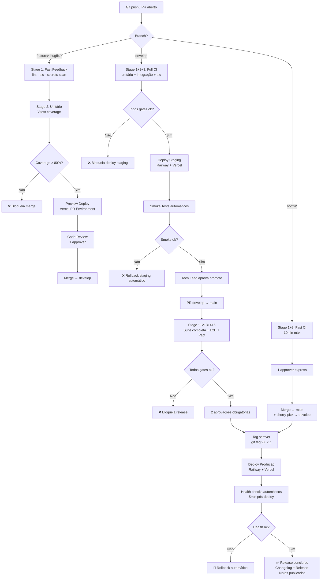

# 24 - Deploy, CI-CD e Versionamento
## AI-Dani-Cessionário — Repasse Seguro

| **Campo** | **Valor** |
|---|---|
| **Produto** | AI-Dani-Cessionário |
| **Versão** | v1.0 |
| **Data** | 23/03/2026 |
| **Autor** | Claude Code Desktop — Pipeline ShiftLabs v9.5 |
| **Status** | Aprovado — pronto para execução |
| **Bloco** | 5 — Ambiente e Processo |

---

> 📌 **TL;DR — Pipeline de Deploy**
>
> O AI-Dani-Cessionário usa GitHub Actions como orquestrador de CI/CD, Railway como plataforma de deploy (API NestJS + workers) e Vercel como plataforma web (React). O pipeline segue o fluxo `feature → develop → main → produção` com gates automáticos em cada promoção. Rollback é executável em menos de 5 minutos via Railway ou redeploy de commit anterior na Vercel. Semantic versioning com tags Git governa todo release. Hotfixes têm fluxo acelerado com aprovação express e versionamento `patch` automático. Nenhum deploy em produção é manual — tudo rastreado, testado e auditável.

---

## 1. Matriz de Ambientes

| **Ambiente** | **Objetivo** | **URL** | **Branch** | **Trigger** | **Tipo de Dados** | **Responsável pelo Promote** | **Critério de Uso** |
|---|---|---|---|---|---|---|---|
| **Local** | Desenvolvimento individual | `localhost:3000` (web) / `localhost:3001` (api) | Qualquer branch | Manual (`pnpm dev`) | Dados sintéticos (seeds) | Dev | Setup via D22; nunca dados reais |
| **Preview** | Review de PR (Vercel) | `dani-pr-{N}.vercel.app` | `feature/*`, `bugfix/*` | Abertura/atualização de PR | Dados sintéticos + staging DB | Automático (Vercel) | Revisão visual de UI; sem dados de negócio reais |
| **Staging** | Validação pré-release | `staging-api.repasse-seguro.com.br` / `staging.repasse-seguro.com.br` | `develop` | Merge em `develop` | Dados mascarados de produção (snapshot semanal) | Tech Lead (aprovação manual) | Gate obrigatório antes de promote para `main` |
| **Produção** | Usuários reais | `api.repasse-seguro.com.br` / `app.repasse-seguro.com.br` | `main` | Merge em `main` + tag semver | Tech Lead + 1 approver (2 aprovações) | Release candidate aprovado em staging | Somente após go/no-go formal |

**[DECISÃO AUTÔNOMA]:** Railway para API + workers; Vercel para web — Justificativa: stack alinhada com D02 (Railway como plataforma de deploy declarada); Vercel é a escolha canônica para React/Vite com preview environments automáticos | Alternativa descartada: Render para ambos — menos controle sobre workers e sem preview environments nativos para frontend.

---

## 2. Diagrama do Pipeline



---

## 3. Workflows de CI/CD

### 3.1 Workflow: `ci-pr.yml`

| **Campo** | **Valor** |
|---|---|
| **Nome** | CI — Pull Request |
| **Trigger** | `pull_request` em qualquer branch |
| **Jobs** | `fast-feedback`, `unit-tests`, `preview-deploy` |
| **Runner** | `ubuntu-latest` |
| **Secrets consumidos** | `SUPABASE_URL`, `SUPABASE_ANON_KEY`, `REDIS_URL` (valores de staging) |
| **Artefatos gerados** | Coverage report (LCOV), preview URL |
| **Cache** | pnpm store, Turborepo cache |
| **Condição de falha** | Qualquer job com exit code != 0 |
| **Notificação** | PR comment com resultado + coverage badge |
| **Impacto se falhar** | Merge bloqueado — PR não pode ser mergeado |

```yaml
# .github/workflows/ci-pr.yml (estrutura)
name: CI — Pull Request
on:
  pull_request:
    branches: ['*']
jobs:
  fast-feedback:
    runs-on: ubuntu-latest
    steps:
      - uses: actions/checkout@v4
      - uses: pnpm/action-setup@v3
      - run: pnpm install --frozen-lockfile
      - run: pnpm lint
      - run: pnpm tsc --noEmit
      - uses: gitleaks/gitleaks-action@v2  # secrets scan
      - run: pnpm commitlint  # conventional commits check

  unit-tests:
    needs: fast-feedback
    runs-on: ubuntu-latest
    steps:
      - run: pnpm test:unit --coverage
      - name: Coverage gate (≥80%)
        run: |
          COV=$(cat coverage/coverage-summary.json | jq '.total.statements.pct')
          [ $(echo "$COV >= 80" | bc) -eq 1 ] || exit 1
      - uses: actions/upload-artifact@v4
        with:
          name: coverage-report
          path: coverage/
```

### 3.2 Workflow: `ci-staging.yml`

| **Campo** | **Valor** |
|---|---|
| **Nome** | CI/CD — Staging |
| **Trigger** | `push` em `develop` |
| **Jobs** | `fast-feedback`, `unit-tests`, `integration-tests`, `deploy-staging`, `smoke-tests` |
| **Runner** | `ubuntu-latest` + Docker services (postgres, redis, rabbitmq) |
| **Secrets consumidos** | `STAGING_*` vars, `RAILWAY_TOKEN_STAGING`, `VERCEL_TOKEN` |
| **Artefatos gerados** | Coverage report, integration test report, staging deploy URL |
| **Condição de falha** | Qualquer job; smoke tests pós-deploy |
| **Notificação** | Slack `#dani-deployments` + GitHub Deployment status |
| **Impacto se falhar** | Staging não promovido; time alertado via Slack |

### 3.3 Workflow: `release.yml`

| **Campo** | **Valor** |
|---|---|
| **Nome** | Release — Produção |
| **Trigger** | `push` de tag `v*.*.*` em `main` |
| **Jobs** | `full-suite`, `e2e-tests`, `contract-tests`, `deploy-prod`, `health-check`, `post-release` |
| **Runner** | `ubuntu-latest` |
| **Secrets consumidos** | `PROD_*` vars, `RAILWAY_TOKEN_PROD`, `VERCEL_TOKEN`, `PACT_BROKER_TOKEN` |
| **Artefatos gerados** | Full test report, E2E report (Playwright HTML), deploy receipt |
| **Aprovação humana** | `environment: production` com 2 reviewers obrigatórios |
| **Condição de falha** | Qualquer job; health check pós-deploy 5min |
| **Notificação** | Slack `#dani-releases` + GitHub Release criado automaticamente |
| **Impacto se falhar** | Rollback automático; release bloqueado; post-mortem obrigatório |

### 3.4 Workflow: `hotfix.yml`

| **Campo** | **Valor** |
|---|---|
| **Nome** | Hotfix — Express |
| **Trigger** | `push` em `hotfix/*` |
| **Jobs** | `fast-feedback`, `unit-critical`, `deploy-prod-express` |
| **Aprovação humana** | 1 reviewer (SLA 30min) |
| **Tempo máximo** | 10min CI + 30min review + 5min deploy = 45min total |
| **Impacto se falhar** | Rollback imediato; incidente P0 aberto |

---

## 4. Estratégia de Deploy

### 4.1 Abordagem: Blue-Green via Railway

**[DECISÃO AUTÔNOMA]:** Blue-green deployment com Railway Deployments — Justificativa: Railway suporta "instant rollback" para deploy anterior com um clique ou via CLI; zero downtime; estado de banco gerenciado separadamente via Supabase (sem migração zero-downtime complexa) | Alternativa descartada: rolling deployment — Railway não suporta nativamente para tier padrão; arriscado se migration alterar schema.

**Fluxo:**
1. Railway cria novo deployment (instância "Green") com a nova versão.
2. Health check automático roda por 3 minutos (`GET /health` deve retornar 200).
3. Se health ok → Railway redireciona tráfego para "Green"; instância "Blue" mantida por 15min para rollback.
4. Se health falha → Railway mantém "Blue" ativa; deploy "Green" descartado automaticamente.

**Pré-condições:**
- Migrations de banco aplicadas ANTES do deploy da nova versão (backward-compatible obrigatório).
- Variáveis de ambiente atualizadas no Railway antes do trigger.
- `pnpm health` passou em staging.

**Evidência de sucesso:** `GET /health` retorna `{ status: "ok", version: "X.Y.Z" }` por 5min consecutivos.

### 4.2 Frontend: Vercel Atomic Deploy

Vercel realiza deploy atômico — a nova versão substitui a anterior instantaneamente após build bem-sucedido. Rollback via `vercel rollback` ou dashboard em menos de 2 minutos.

**Evidência de sucesso:** `curl https://app.repasse-seguro.com.br | grep "version"` retorna a nova versão.

---

## 5. Promoção entre Ambientes

### 5.1 `feature/*` → `develop` (Staging)

| **Gate** | **Tipo** | **Critério** |
|---|---|---|
| Lint + TypeScript | Automático | Zero erros |
| Secrets scan | Automático | Zero credenciais detectadas |
| Conventional Commits | Automático | Todos os commits no padrão |
| Cobertura unitária | Automático | ≥80% statements |
| Code Review | Humano | Mínimo 1 approver |

### 5.2 `develop` → `main` (Produção)

| **Gate** | **Tipo** | **Critério** |
|---|---|---|
| Suite completa (unitário + integração) | Automático | Zero falhas; cobertura integração ≥70% |
| E2E obrigatório | Automático | 10 fluxos E2E-001 a E2E-010 verdes |
| Testes de contrato (Pact) | Automático | Todos os contratos aprovados |
| Smoke tests em staging | Automático | Todos os health checks ok |
| Acessibilidade (axe) | Automático | Zero violações críticas |
| Go/No-Go formal | Humano | Tech Lead + 1 approver; checklist D28 preenchido |
| Janela de deploy | Humano | Seg–Sex 09h–17h (America/Fortaleza); fora dessa janela somente para hotfix P0 |

### 5.3 Smoke Tests Pós-Deploy

```bash
# smoke-tests.sh — executado automaticamente após deploy em staging e produção

set -e
BASE_URL=${1:-"https://staging-api.repasse-seguro.com.br"}

echo "🔍 Smoke test: health check"
curl -f "$BASE_URL/health" | jq '.status == "ok"'

echo "🔍 Smoke test: endpoint protegido retorna 401"
STATUS=$(curl -s -o /dev/null -w "%{http_code}" "$BASE_URL/api/v1/agente/chat")
[ "$STATUS" = "401" ] || (echo "❌ Endpoint /chat não retornou 401" && exit 1)

echo "🔍 Smoke test: calculadora retorna 401 sem auth"
STATUS=$(curl -s -o /dev/null -w "%{http_code}" -X POST "$BASE_URL/api/v1/calculadora/simular")
[ "$STATUS" = "401" ] || (echo "❌ Calculadora não protegida" && exit 1)

echo "✅ Smoke tests concluídos"
```

---

## 6. Build e Artefatos

### 6.1 API (NestJS — Railway)

| **Campo** | **Valor** |
|---|---|
| **Comando de build** | `pnpm --filter api build` (Turborepo) |
| **Output** | `apps/api/dist/` |
| **Imagem Docker** | Gerada automaticamente pelo Railway via Nixpacks |
| **Nomenclatura** | `dani-api:v{MAJOR}.{MINOR}.{PATCH}` |
| **Versionamento** | Tag semver + commit SHA curto como label |
| **Retenção** | Últimas 5 imagens retidas no Railway; artefatos de CI por 30 dias |
| **Validação de integridade** | SHA-256 do artefato publicado no GitHub Release |

### 6.2 Web (React/Vite — Vercel)

| **Campo** | **Valor** |
|---|---|
| **Comando de build** | `pnpm --filter web build` |
| **Output** | `apps/web/dist/` |
| **Deploy** | Vercel Serverless (edge) |
| **Nomenclatura** | Deployment ID Vercel + tag semver como alias |
| **Retenção** | Histórico completo no Vercel; rollback disponível para qualquer deployment anterior |

### 6.3 Turborepo Cache

- Cache remoto habilitado via Vercel Remote Cache.
- Hit rate esperado: >80% em builds de CI que não alteram dependências.
- Chave de cache: hash de `pnpm-lock.yaml` + hash de arquivos do workspace.

---

## 7. Rollback

### 7.1 Quando Acionar

- Health check falha por mais de 3 minutos após deploy.
- Taxa de erro (HTTP 5xx) > 5% por 2 minutos em produção.
- Alerta P0 ou P1 disparado em menos de 15 minutos após deploy.
- Tech Lead ou on-call decide rollback manual.

### 7.2 Quem Pode Acionar

- Tech Lead, SRE, ou qualquer membro do time com acesso ao Railway/Vercel em caso de P0.
- Rollback automático: acionado pelo próprio Railway se health check falha no deploy.

### 7.3 Rollback API (Railway)

```bash
# Opção 1: Via Railway CLI (preferencial)
railway rollback --service dani-api

# Opção 2: Via Railway Dashboard
# 1. Acessar https://railway.app → projeto → serviço dani-api
# 2. Aba "Deployments" → selecionar deployment anterior estável
# 3. Clicar "Redeploy"

# Verificação pós-rollback (executar imediatamente):
curl -f https://api.repasse-seguro.com.br/health | jq '.version'
# Confirmar que version == versão anterior esperada
```

**Tempo esperado:** 2–3 minutos.

**Riscos colaterais:**
- Migrations de banco aplicadas no deploy atual NÃO são revertidas automaticamente.
- Se a migration alterar schema de forma incompatível, rollback de código pode gerar erros de schema. Verificar `prisma migrate status` após rollback.

### 7.4 Rollback Frontend (Vercel)

```bash
# Via Vercel CLI
vercel rollback https://app.repasse-seguro.com.br

# Via dashboard: Vercel → projeto → Deployments → selecionar deployment anterior → "Promote to Production"
```

**Tempo esperado:** < 2 minutos (atomic).

### 7.5 Rollback de Migration (Banco)

**[DECISÃO AUTÔNOMA]:** Migrations devem ser backward-compatible — nunca DROP de coluna diretamente | Justificativa: permite rollback de código sem rollback de schema; risco de perda de dados em produção é eliminado | Alternativa descartada: rollback de migration via `prisma migrate down` — Prisma não suporta rollback nativo em produção; risco de perda de dados.

Se migration forward-only não for possível (caso raro):
1. Abrir incidente P0.
2. Consultar snapshot do Supabase (backup diário automático).
3. Restore seguindo seção 8 deste documento.

### 7.6 Validações Obrigatórias Após Rollback

```bash
# 1. Health check
curl -f https://api.repasse-seguro.com.br/health

# 2. Verificar versão revertida
curl -s https://api.repasse-seguro.com.br/health | jq '.version'

# 3. Smoke tests rápidos
bash smoke-tests.sh https://api.repasse-seguro.com.br

# 4. Verificar Redis (sem corruption)
redis-cli -u $REDIS_URL ping

# 5. Verificar fila RabbitMQ (sem acúmulo anormal)
# Acessar RabbitMQ Management: https://rabbitmq.repasse-seguro.com.br
# Verificar que dani.notificacoes não tem mensagens em DLQ > baseline

# 6. Monitorar taxa de erro por 10min (Sentry dashboard)
```

---

## 8. Semantic Versioning

### 8.1 Convenção

O AI-Dani-Cessionário segue [Semantic Versioning 2.0.0](https://semver.org/): `MAJOR.MINOR.PATCH`.

| **Tipo de Bump** | **Quando** | **Exemplo** |
|---|---|---|
| **MAJOR** | Breaking change em API pública; mudança incompatível no protocolo de sessão; remoção de endpoint | `1.0.0 → 2.0.0` |
| **MINOR** | Nova feature backward-compatible; novo endpoint; novo tool do agente | `1.0.0 → 1.1.0` |
| **PATCH** | Bugfix; ajuste de comportamento; hotfix | `1.0.0 → 1.0.1` |

### 8.2 Versões Especiais

| **Sufixo** | **Uso** | **Exemplo** |
|---|---|---|
| `-rc.N` | Release candidate em staging | `1.1.0-rc.1` |
| `-hotfix.N` | Hotfix em branch específica (descartado após merge) | Nunca publicado como tag final |

### 8.3 Relação com Tags Git

```bash
# Criar release candidate
git tag v1.1.0-rc.1
git push origin v1.1.0-rc.1

# Promover para release final (após aprovação)
git tag v1.1.0
git push origin v1.1.0

# Hotfix
git tag v1.0.1
git push origin v1.0.1
```

---

## 9. Ciclo de Release

```
1. DESENVOLVIMENTO
   feature/* branches → PRs → code review → merge develop

2. QA / STAGING (develop branch)
   CI completo → deploy automático staging → QA manual exploratório
   Duração típica: 1–3 dias úteis

3. RELEASE CANDIDATE
   git tag v{X}.{Y}.{Z}-rc.1 → deploy staging com tag
   Smoke tests + E2E + acessibilidade

4. APROVAÇÃO (Go/No-Go)
   Tech Lead + 1 stakeholder preenchem checklist D28
   Janela: Seg–Sex 09h–17h (America/Fortaleza)

5. PRODUÇÃO
   Merge develop → main → tag semver final → deploy automático
   Health checks 5min

6. ESTABILIZAÇÃO (24–48h)
   Monitoramento intensivo: Sentry, Langfuse, logs Pino
   On-call em alerta durante janela de estabilização

7. COMUNICAÇÃO
   Release Notes publicadas no GitHub + Slack #dani-releases
```

**Freeze de código:** obrigatório nas 24h anteriores ao release. Nenhum PR mergeado em `develop` durante esse período sem aprovação explícita do Tech Lead.

---

## 10. Changelog

### 10.1 Formato

Arquivo: `CHANGELOG.md` na raiz do monorepo. Formato: [Keep a Changelog](https://keepachangelog.com/pt-BR/1.0.0/).

```markdown
## [1.1.0] — 2026-03-23

### Adicionado
- Tool `buscarComparativoRegional` no AgenteModule (RF-DC-012)
- Endpoint `GET /api/v1/agente/comparativo` (EP-013)

### Corrigido
- Rate limit não resetava após hard block de OTP (RN-DC-043)

### Alterado
- Temperature do GPT-4o ajustado de 0.5 para 0.3 (ADR-002-rev)
```

### 10.2 Responsável

Tech Lead ou dev responsável pela feature, obrigatório no PR que inclui a mudança.

### 10.3 Quando Atualizar

- A cada PR mergeado em `develop` que afeta comportamento observável.
- Nunca atualizar em hotfix retroativamente — incluir no commit do hotfix.

### 10.4 Exemplo Incorreto

```markdown
# ❌ ERRADO — genérico e não rastreável
## [1.1.0]
- Melhorias gerais no agente
- Correções de bugs
- Performance aprimorada
```

---

## 11. Release Notes

### 11.1 Template Mínimo

```markdown
# Release Notes — AI-Dani-Cessionário v{X}.{Y}.{Z}

**Data:** {DATA}
**Ambiente:** Produção
**Versão anterior:** v{X}.{Y}.{Z-1}

## Resumo
{1-3 frases descrevendo o principal valor entregue nesta versão}

## Escopo
{Lista das mudanças principais com referência a RF/RN quando aplicável}

## Riscos Conhecidos
{Se nenhum: "Nenhum risco identificado nesta release."}

## Ações Pós-Release
- [ ] Monitorar Sentry por 24h
- [ ] Verificar métricas Langfuse (custo LLM, latência)
- [ ] Confirmar que alertas In-App estão sendo entregues

## Impacto para o Cessionário
{O que muda na experiência do cessionário, se aplicável}

## Links
- PR: {URL}
- Changelog: {URL}
- Deploy log: {Railway deployment URL}
```

---

## 12. Tagging

### 12.1 Convenção de Tags Git

```bash
# Release estável
v1.0.0, v1.1.0, v2.0.0

# Release candidate
v1.1.0-rc.1, v1.1.0-rc.2

# Nunca criar tags de hotfix com sufixo — hotfix resulta em tag PATCH normal
# v1.0.1 (não "v1.0.1-hotfix")
```

### 12.2 Regras

- Tags em `main` apenas.
- Tags push somente pelo Tech Lead ou CI após aprovação.
- Tag `latest` alias: atualizada automaticamente pelo GitHub Actions no release.
- Tag de rollback: se rollback for necessário, o deployment anterior mantém sua tag original — nunca criar tag retroativa.

---

## 13. Comunicação de Release

### 13.1 Antes do Deploy (30min antes)

**Canal:** Slack `#dani-deployments`

```
🚀 Deploy programado: AI-Dani-Cessionário v{X}.{Y}.{Z}
Início estimado: {HH:MM} (America/Fortaleza)
Impacto esperado: nenhum (zero downtime)
Responsável: {NOME}
Rollback disponível: sim
```

### 13.2 Durante o Deploy

**Canal:** Slack `#dani-deployments` + atualizar GitHub Deployment status.

```
⏳ Deploy em andamento: v{X}.{Y}.{Z} — health checks rodando...
```

### 13.3 Após o Deploy (confirmação)

```
✅ Deploy concluído: AI-Dani-Cessionário v{X}.{Y}.{Z}
Horário: {HH:MM}
Status: OK (health checks passando)
Release Notes: {URL}
Monitoramento: {Sentry dashboard URL}
```

### 13.4 Se Deploy Falhar

```
🔴 Deploy FALHOU: AI-Dani-Cessionário v{X}.{Y}.{Z}
Rollback acionado: {SIM/EM ANDAMENTO}
Versão ativa: v{X}.{Y}.{Z-anterior}
Responsável: {NOME}
Incidente aberto: {URL}
```

**Responsáveis por severidade:**

| **Severidade** | **Notifica** | **Canal** |
|---|---|---|
| Deploy ok | Time de engenharia | `#dani-deployments` |
| Deploy falhou → rollback ok | Tech Lead + time | `#dani-deployments` + `#dani-incidents` |
| Deploy falhou → rollback falhou (P0) | Tech Lead + CEO tech + on-call | `#dani-incidents` + DM direto |

---

## 14. Hotfix Flow

### 14.1 Quando Usar

- Bug P0 em produção confirmado (dados errados, indisponibilidade, falha de segurança).
- Não aguarda ciclo de release normal.

### 14.2 Fluxo

```bash
# 1. Branch a partir de main (NUNCA de develop)
git checkout main
git pull origin main
git checkout -b hotfix/DANI-{N}-descricao

# 2. Implementar fix + teste mínimo obrigatório
# Cobertura: apenas fluxo crítico afetado

# 3. PR para main com label "hotfix" e "express-review"
# SLA de review: 30 minutos
# Aprovação: 1 reviewer (não o autor)

# 4. CI express roda (10min máx): fast-feedback + unit-critical
# Se falhar: corrigir antes de merge

# 5. Merge em main com squash commit
git merge --squash hotfix/DANI-{N}-descricao

# 6. Tag PATCH imediata
git tag v{X}.{Y}.{PATCH+1}
git push origin main v{X}.{Y}.{PATCH+1}

# 7. CI release.yml dispara automaticamente
# Deploy em produção com health checks

# 8. Cherry-pick obrigatório para develop
git checkout develop
git cherry-pick {COMMIT_HASH}
git push origin develop

# 9. Deletar branch hotfix
git push origin --delete hotfix/DANI-{N}-descricao
```

### 14.3 Validação Obrigatória Após Hotfix

- Executar smoke tests manuais do fluxo afetado.
- Confirmar que bug não reproduz em produção.
- Atualizar CHANGELOG.md com entry na versão do hotfix.
- Post-mortem leve (30min): por que o bug chegou em produção?

---

## 15. Backlog de Pendências

| **ID** | **Tipo** | **Descrição** | **Impacto** |
|---|---|---|---|
| P-01 | [DEFINIÇÃO PENDENTE] | Domínio de produção final não confirmado (`repasse-seguro.com.br` usado como placeholder) — impacta URLs em smoke tests, release notes e comunicação | Smoke tests falharão em produção se URL divergir |
| P-02 | [DECISÃO AUTÔNOMA] | Pact Broker self-hosted via Docker no Railway — Justificativa: evita custo de PactFlow; Railway suporta Dockerfile custom | DevOps deve provisionar instância antes do primeiro release |
| P-03 | PENDÊNCIA | Definir conta Railway e Vercel de produção (team plan) com RBAC — acessos de CI precisam de tokens de service account, não de conta pessoal | Bloqueante para Stage 3 e Stage 5 do pipeline |
| P-04 | PENDÊNCIA | Janela de manutenção de banco Supabase não definida — snapshots diários automáticos estão habilitados por padrão, mas horário de backup não foi confirmado | Pode impactar SLA de restore (seção 8 do Runbook) |

---

*Documento gerado por Claude Code Desktop — Pipeline ShiftLabs v9.5 — AI-Dani-Cessionário*
