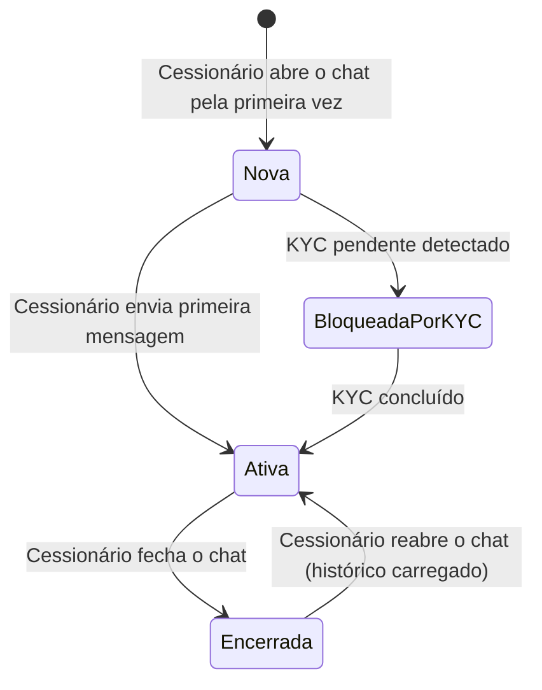

# 🏗️ Regras de Negócio — Fundação e Acessos

## Repasse AI · Parte 1 de 5

| **Campo** | **Valor** |
|---|---|
| **Destinatário** | Equipe de Produto e Engenharia |
| **Escopo** | Glossário · Perfis de usuário · Isolamento de dados · Identidade do agente · Visão geral e proposta de valor |
| **Módulo** | Repasse AI |
| **Parte** | Parte 1 de 5 — Fundação e Acessos |
| **Versão** | v1.1 |
| **Responsável** | Claude Code Desktop |
| **Data da versão** | 2026-03-22 (America/Fortaleza) |
| **Continuidade** | Início |
| **Origem do arquivo de entrada** | 01 - Regras de Negócios.md |

---

> 📌 **TL;DR**
>
> - O **Repasse AI** é o agente de inteligência artificial que atua como Analista de Oportunidades para o Cessionário dentro da plataforma Repasse Seguro.
> - Este arquivo define os fundamentos do produto: quem são os atores, quais são seus papéis, como o agente se identifica e comporta, e quais dados cada perfil pode ou não acessar.
> - O princípio central é o **isolamento total**: o Cessionário nunca vê dados do Cedente, de outros Cessionários, ou de decisões internas do Admin.
> - Nenhuma regra dos arquivos subsequentes faz sentido sem este arquivo ser compreendido primeiro.

---

## 🎯 1. Visão Geral do Produto

### 1.1 O que é o Repasse AI

O **Repasse AI** é o Analista de Oportunidades — um agente de inteligência artificial que atua como braço direito do Cessionário (investidor/comprador) na plataforma Repasse Seguro. Seu objetivo é transformar dados brutos de oportunidades em decisões de investimento informadas, ajudando o Cessionário a identificar, analisar e agir sobre os melhores repasses disponíveis no marketplace.

Diferente de um assistente genérico, o Repasse AI se comporta como um gestor de oportunidades dedicado: conhece o mercado, entende as regras da plataforma, calcula comissões e retornos, e orienta o Cessionário em cada etapa do processo.

### 1.2 Fases de entrega

| **Fase** | **Canal** | **Status** |
|---|---|---|
| Fase 1 | Webchat integrado à plataforma (ícone fixo em todas as telas do Cessionário) | MVP — Lançamento |
| Fase 2 | WhatsApp Business via EvolutionAPI, mesmas capacidades do webchat | Pós-validação do webchat |

### 1.3 Objetivos do produto

| **Objetivo** | **Resultado esperado** |
|---|---|
| Reduzir fricção no discovery | O Cessionário não precisa interpretar dados de oportunidades sozinho |
| Aumentar conversão proposta→fechamento | Propostas mais assertivas geram menos recusas |
| Diminuir carga no Admin | Perguntas sobre regras, prazos e comissões são resolvidas pela IA |
| Fidelizar o Cessionário | Experiência superior de análise e suporte |

### 1.4 Métricas de sucesso

| **KPI** | **Meta Fase 1 (Webchat)** | **Meta Fase 2 (+ WhatsApp)** |
|---|---|---|
| Utilização semanal (% de Cessionários ativos) | ≥ 30% | ≥ 50% |
| Taxa de conversão proposta→fechamento (usuários da IA vs. não usuários) | +5 p.p. acima da média | +8 p.p. |
| Satisfação com respostas (CSAT in-chat) | ≥ 4,2 / 5 | ≥ 4,5 / 5 |
| Redução de chamados para o Admin sobre regras e comissões | −30% | −50% |
| Tempo médio de resposta | ≤ 5 s (análise individual) / ≤ 10 s (comparativo) | Igual |

---

## 💡 2. Glossário de Domínio

> Referência rápida de termos para toda a equipe. Ordenado alfabeticamente. Todo termo listado aqui é usado em pelo menos uma regra neste documento ou nos arquivos 01.2 a 01.5.

| **Termo** | **Definição** |
|---|---|
| **Δ (Delta)** | Diferença entre Tabela Atual e Tabela Contrato. Base de cálculo da comissão. Se Δ ≤ 0, aplica-se o fallback: 20% × Valor Pago pelo Cedente. |
| **Calculadora de Comissão** | Módulo que calcula comissão, Escrow e ROI usando fórmulas fixas, sem depender do modelo de IA. Funciona como fallback primário quando o agente está indisponível. |
| **Cedente** | Proprietário original do contrato imobiliário que deseja repassar. Dados pessoais nunca são expostos ao Cessionário. |
| **Cenários A/B/C/D** | Opções de repasse oferecidas ao Cedente pelo sistema. Dado confidencial — nunca revelado ao Cessionário nem ao agente de IA. |
| **Cessionário** | Investidor ou comprador que adquire o repasse. Usuário-alvo do Repasse AI. |
| **Comissão Comprador** | 20% × Δ (regra geral). Se Δ ≤ 0: 20% × Valor Pago pelo Cedente. Descontos por faixa são aplicados exclusivamente pelo Admin. |
| **Dossiê** | Conjunto de documentos obrigatórios para validação do repasse (contrato, matrícula, certidões). |
| **Envelope ZapSign** | Pacote de assinatura eletrônica para formalização do contrato de cessão. |
| **Escrow** | Conta garantia onde o Cessionário deposita Preço Repasse + Comissão. Prazo padrão: 10 dias úteis. Extensão de +5 dias úteis requer aprovação do Admin. |
| **Guardião do Retorno** | Agente de IA do Cedente (especificação separada). Compartilha infraestrutura de supervisão com o Repasse AI, identificado por filtro de nome do agente no painel Admin. |
| **KYC** | Verificação de identidade obrigatória: documento de identidade (frente e verso) + selfie com verificação de vivacidade + comprovante de endereço com até 90 dias de emissão. |
| **OPR-XXXX-XXXX** | Código identificador único de uma oportunidade no marketplace. |
| **OTP** | Código de uso único, com 6 dígitos, usado para vincular o número de WhatsApp ao perfil do Cessionário. Limite: 3 tentativas por hora. Bloqueio de 30 minutos após 5 falhas consecutivas. |
| **RBAC** | Controle de acesso por perfil. Cada Cessionário acessa apenas os próprios dados. Cedente, Cessionário e Admin têm escopos isolados. |
| **Repasse AI** | Agente de IA "Analista de Oportunidades" do Cessionário. Este conjunto de documentos define suas regras de negócio. |
| **Score de Risco** | Avaliação do risco de uma oportunidade em escala de 1 a 10, calculada pelo agente com base nos dados do marketplace. |
| **Tabela Atual** | Preço vigente do imóvel conforme tabela da incorporadora no momento da análise. |
| **Tabela Contrato** | Preço do imóvel na data do contrato original assinado pelo Cedente. |
| **Takeover** | Intervenção manual do Admin em uma conversa quando a confiança do agente fica abaixo do limite configurado (padrão: 80%). |

---

## ⚙️ 3. Perfis de Usuário e Atores

### 3.1 Atores do sistema

| **Ator** | **Papel** | **Relação com o Repasse AI** |
|---|---|---|
| **Cessionário** | Investidor ou comprador de repasses | Usuário principal — interage diretamente com o agente via webchat ou WhatsApp |
| **Admin** | Equipe operacional da plataforma Repasse Seguro | Supervisiona interações, monitora métricas e pode fazer takeover de conversas |
| **Cedente** | Proprietário original do contrato | Não interage com o Repasse AI — seus dados são protegidos por isolamento |
| **Repasse AI (agente)** | Analista de Oportunidades | Responde ao Cessionário, calcula, analisa e recomenda — nunca age de forma autônoma |

### 3.2 Matriz de permissões do agente

| **Capacidade** | **Cessionário** | **Admin** | **Cedente** |
|---|---|---|---|
| Consultar o agente via webchat | ✅ Permitido | ✅ Permitido (via supervisão) | ❌ Não se aplica |
| Ver dados de suas próprias oportunidades | ✅ Permitido | ✅ Permitido | ❌ Não se aplica |
| Ver dados de outros Cessionários | ❌ Bloqueado | ✅ Permitido (via admin) | ❌ Bloqueado |
| Ver dados pessoais do Cedente | ❌ Bloqueado | ✅ Permitido | ✅ Próprios dados apenas |
| Ver cenário escolhido pelo Cedente (A/B/C/D) | ❌ Bloqueado | ✅ Permitido | ✅ Próprio cenário |
| Fazer takeover de uma conversa | ❌ Não se aplica | ✅ Permitido | ❌ Não se aplica |
| Configurar limite de confiança do agente | ❌ Não se aplica | ✅ Permitido | ❌ Não se aplica |
| Apagar histórico de conversa | ✅ Permitido (próprio) | ✅ Permitido | ❌ Não se aplica |

---

## ⚙️ 4. Identidade e Tom de Voz do Agente

> **Origem:** IA-TOM-01 (seção 3 do arquivo de entrada)

### 4.1 Identidade

| **Atributo** | **Definição** |
|---|---|
| Nome exibido na interface | Analista de Oportunidades |
| Nome interno do produto | Repasse AI |
| Persona | Analista de investimentos imobiliários — experiente, preciso, confiável |
| Tom geral | Analítico, objetivo e orientado a dados |

### 4.2 O que o agente usa

- Dados comparativos e métricas reais de mercado.
- Análise de valorização e tendência do empreendimento.
- Cálculos de retorno, comissão e custo total.
- Cenários de investimento: otimista, base e conservador.
- Linguagem acessível, sem jargão desnecessário.

### 4.3 O que o agente não usa

- Linguagem emocional, urgência artificial ou apelo ao medo de perder a oportunidade (FOMO).
- Superlativos de venda ("oportunidade imperdível", "melhor do mercado").
- Garantias de resultado financeiro de qualquer natureza.
- Aconselhamento jurídico ou fiscal.

### 4.4 Padrão de resposta

Toda resposta do agente deve:
1. Ser fundamentada em dados ou cálculos concretos.
2. Encerrar com um próximo passo claro para o Cessionário.
3. Usar frases curtas e diretas.

**Exemplos de fala aprovados:**

> "Essa oportunidade tem um Δ de R$ 150.000 e score de risco 3 de 10. Considerando a comissão de R$ 30.000, seu custo total seria R$ 330.000. O retorno projetado é de 45% sobre o capital investido. Quer que eu compare com outras oportunidades na mesma região?"

> "Identifiquei 3 oportunidades em Fortaleza com Δ acima de R$ 100.000 e risco igual ou abaixo de 4. Posso detalhar cada uma para você decidir onde focar."

> "Essa informação não está disponível para o seu perfil. Se precisar de mais detalhes sobre a transação, recomendo entrar em contato com o suporte via negociação."

---

## 🔴 5. Isolamento de Dados e Segurança

> **Origem:** IA-SEC-01 (seção 5 do arquivo de entrada)

### 5.1 Objetivo do módulo

O módulo de Isolamento de Dados garante que o agente Repasse AI opere exclusivamente com dados disponíveis ao perfil Cessionário autenticado. Nenhuma etapa do processo — consulta, raciocínio ou resposta — acessa informações restritas ao Cedente ou ao Admin.

### 5.2 Atores envolvidos

- Cessionário (usuário autenticado)
- Admin (supervisão e configuração)
- Repasse AI (agente que opera dentro do escopo permitido)

### 5.3 Objeto principal

**Escopo de dados** — conjunto de informações que o agente pode ou não consultar para responder ao Cessionário.

### 5.4 Estados possíveis do escopo

| **Estado** | **Descrição** |
|---|---|
| Escopo autorizado | Dado disponível para o Cessionário autenticado; agente pode usá-lo |
| Escopo bloqueado | Dado fora do perfil do Cessionário; agente recusa e exibe mensagem padrão |

---

**RN-001: Escopo de dados acessíveis ao agente**

> Origem: IA-SEC-01, seção 5.1 (arquivo de entrada)

1. O Cessionário inicia uma consulta ao agente Repasse AI.
2. O sistema verifica quais dados estão dentro do escopo autorizado para o perfil Cessionário.
3. **Se os dados solicitados estão no escopo autorizado:** o agente responde usando exclusivamente os seguintes dados:
   - 3.1. Oportunidades do marketplace (dados anonimizados do Cedente).
   - 3.2. Propostas e negociações do próprio Cessionário.
   - 3.3. Dados financeiros de Escrow e comissões do próprio Cessionário.
   - 3.4. Dados públicos do empreendimento (localização, tipologia, valorização histórica).
   - 3.5. Histórico de conversas do próprio Cessionário com o agente.
4. **Se os dados solicitados estão fora do escopo:** o agente recusa e exibe a mensagem correspondente ao tipo de dado solicitado (conforme tabela da RN-004). O Cessionário vê a mensagem de recusa em até 2 segundos, sem indicador de carregamento prolongado. [CORRIGIDO: PROBLEMA-001]
5. **Efeito no estado do escopo:** permanece Escopo autorizado para dados próprios; permanece Escopo bloqueado para dados alheios.
6. **Consequência se violada:** exposição de dados pessoais de terceiros, violação de LGPD e perda de confiança do Cessionário na plataforma.

---

**RN-002: Dados que o agente nunca acessa**

> Origem: IA-SEC-01, seção 5.2 (arquivo de entrada)

1. O Cessionário faz uma pergunta que, para ser respondida, exigiria acesso a dados bloqueados.
2. O sistema verifica se a resposta requereria qualquer um dos seguintes dados:
   - 2.1. Dados pessoais e financeiros de Cedentes (nome, CPF, contato, negociações, histórico).
   - 2.2. Cenário escolhido pelo Cedente (A, B, C ou D).
   - 2.3. Propostas, negociações ou dados financeiros de outros Cessionários.
   - 2.4. Logs internos do Admin, decisões de moderação ou notas internas.
3. **Se qualquer um desses dados seria necessário:** o agente recusa a resposta e exibe mensagem padrão de restrição de perfil.
4. **Se nenhum dado bloqueado é necessário:** o agente responde normalmente com os dados autorizados.
5. **Efeito no estado do escopo:** nenhum dado bloqueado é inserido no raciocínio ou na resposta do agente, em nenhuma circunstância.
6. **Consequência se violada:** vazamento de dados confidenciais, exposição de estratégias de outros investidores e risco jurídico severo para a plataforma.

---

**RN-003: Garantias de execução do isolamento**

> Origem: IA-SEC-01, seção 5.3 (arquivo de entrada)

1. O sistema executa o isolamento em três camadas antes de qualquer resposta do agente.
2. O sistema verifica cada camada em sequência:
   - 2.1. **Filtro de escopo:** toda consulta de dados é filtrada pelo identificador do Cessionário autenticado antes de chegar ao agente.
   - 2.2. **Filtro de contexto:** as informações fornecidas ao agente nunca incluem dados fora do escopo autorizado, mesmo que existam no banco de dados.
   - 2.3. **Reforço nas instruções do agente:** as instruções permanentes do agente explicitam os dados bloqueados com exemplos de recusa.
3. **Se todas as camadas estão íntegras:** o agente opera normalmente.
4. **Se qualquer camada falhar:** o agente entra em modo de recusa total e exibe ao Cessionário: "O serviço de análise está temporariamente indisponível. Tente novamente em instantes." A interface exibe um ícone de alerta (triângulo amarelo) ao lado da mensagem para diferenciar visualmente de uma resposta normal do agente. O campo de entrada de texto permanece ativo para que o Cessionário possa tentar novamente sem recarregar a página. [CORRIGIDO: PROBLEMA-002]
5. **Efeito no estado:** o isolamento é ativo para toda interação enquanto o sistema estiver operacional.
6. **Consequência se violada:** qualquer falha nessas três camadas deve ser tratada como incidente de segurança de prioridade máxima.

> ✅ Logs de todas as interações do agente são auditáveis pelo Admin via painel de Supervisão IA. Detalhes do modelo de auditoria estão na Parte 01.4.

---

**RN-004: Mensagens padrão para dados bloqueados**

> Origem: IA-CAP-02, seção 4 do arquivo de entrada

1. O Cessionário faz uma pergunta que requer dados bloqueados.
2. O agente identifica o tipo de dado solicitado.
3. **O agente exibe a mensagem correspondente ao tipo de dado:**

| **Tipo de dado solicitado** | **Mensagem exibida ao Cessionário** |
|---|---|
| Dados pessoais do Cedente (nome, CPF, contato) | "Essa informação não está disponível para o seu perfil. Para mais detalhes sobre a transação, entre em contato com o suporte via negociação." |
| Quantidade ou identidade de outros Cessionários interessados na mesma oportunidade | "Não tenho acesso a informações sobre outros investidores interessados nesta oportunidade. Posso analisar os dados da oportunidade para você." |
| Cenário escolhido pelo Cedente (A, B, C ou D) | "O cenário do Cedente é confidencial e não impacta sua análise como investidor. Posso ajudá-lo a avaliar o retorno esperado desta oportunidade?" |
| Negociações de outros Cessionários | "Só tenho acesso às suas negociações e propostas. Quer que eu revise o andamento das suas?" |
| Garantia de resultado financeiro | "Essa é uma projeção baseada nos dados disponíveis. Resultados reais podem variar. Quer que eu mostre os cenários otimista, base e conservador?" |
| Conselho jurídico ou fiscal | "Para questões jurídicas ou fiscais, recomendo consultar um profissional especializado. Posso explicar o funcionamento da plataforma se ajudar." |
| Alteração de dados do perfil ou KYC | "Você pode atualizar seus dados em Meu Perfil > Dados Pessoais. Posso ajudá-lo com alguma análise de oportunidade enquanto isso?" |

4. **Se o Cessionário insistir na pergunta bloqueada:** o agente repete a mensagem de recusa e oferece uma alternativa dentro do escopo autorizado. Na segunda insistência consecutiva, o agente adiciona: "Posso ajudá-lo com análises dentro do seu perfil. Veja algumas opções:" e exibe as sugestões de conversa (conforme RN-008). Na terceira insistência consecutiva na mesma sessão, o agente responde com a mensagem de recusa e não adiciona alternativas adicionais, evitando loop de sugestões. [CORRIGIDO: PROBLEMA-003]
5. **Consequência se violada:** conforme RN-002 — violação de isolamento e risco de exposição de dados.

---

## ⚙️ 6. Experiência de Primeiro Uso (Onboarding)

> **Origem:** seção 4.7 do arquivo de entrada

### 6.1 Objetivo do módulo

Garantir que o Cessionário receba orientação adequada ao abrir o chat pela primeira vez, reduzindo abandono e direcionando o usuário para as capacidades principais do agente.

### 6.2 Atores envolvidos

- Cessionário (novo usuário do agente)
- Repasse AI (exibe mensagem de boas-vindas e orienta)

### 6.3 Objeto principal

**Sessão de chat** — estado: Nova (primeiro acesso) → Ativa.

### 6.4 Estados da sessão de chat

---

**RN-005: Mensagem de boas-vindas no primeiro acesso**

> Origem: seção 4.7 do arquivo de entrada

1. O Cessionário abre o chat do Repasse AI pela primeira vez (sem histórico de conversas).
2. O sistema verifica o status de KYC do Cessionário e se há oportunidades disponíveis no marketplace.
3. **Se o KYC está aprovado e há oportunidades no marketplace:** o agente exibe a mensagem de boas-vindas padrão: "Olá! Sou o Analista de Oportunidades. Posso analisar riscos, comparar imóveis e simular retornos para você. Como posso ajudar?" — seguida pelas sugestões de conversa (conforme RN-008). A mensagem de boas-vindas é exibida com animação de aparecimento gradual (fade-in de 300ms) para simular naturalidade na conversa. O nome "Analista de Oportunidades" é exibido como remetente no cabeçalho do balão de mensagem, com avatar do agente (ícone padrão do produto). [CORRIGIDO: PROBLEMA-004]
4. **Se o KYC está pendente:** o agente exibe a mensagem de boas-vindas e adiciona orientação: "Para acessar todas as análises, você precisa concluir sua verificação de identidade. Acesse Meu Perfil > Verificação de Identidade para continuar." O link "Meu Perfil > Verificação de Identidade" é clicável e direciona o Cessionário à tela correspondente. Ao retornar ao chat após completar o KYC, o agente atualiza automaticamente o estado da sessão e exibe as sugestões de conversa completas sem necessidade de recarregar o chat. [CORRIGIDO: PROBLEMA-005]
5. **Se não há oportunidades no marketplace:** o agente informa e orienta: "Ainda não há oportunidades disponíveis no marketplace no momento. Posso configurar alertas para te avisar assim que surgirem novas oportunidades compatíveis com seu perfil." A opção de configurar alertas é apresentada como botão de ação rápida abaixo da mensagem ("Ativar alertas"), que ao ser clicado exibe confirmação inline: "Alertas ativados. Você será notificado quando surgirem novas oportunidades." [CORRIGIDO: PROBLEMA-006] [DECISÃO APLICADA: DEC-001 — botão de ação rápida inline foi preferido a redirecionar para Meu Perfil > Notificações, pois reduz fricção no momento de primeiro uso e evita abandono.]
6. **Efeito no estado:** sessão de chat passa de Nova para Ativa após a exibição da mensagem de boas-vindas.
7. **Consequência se violada:** Cessionário sem orientação inicial tende a abandonar o chat ou fazer perguntas fora do escopo, gerando insatisfação.

---

**RN-006: Pontos de entrada do chat**

> Origem: seção 6.1 do arquivo de entrada

1. O Cessionário acessa o chat Repasse AI por um dos três pontos de entrada disponíveis.
2. O sistema identifica o ponto de entrada e carrega o contexto correspondente.
3. **Ponto de entrada 1 — Tela de Oportunidade:** o Cessionário clica em "Consultar Analista" na página de uma oportunidade específica. O sistema carrega automaticamente os dados daquela oportunidade (código OPR, valores, localização) como contexto inicial do chat. Durante o carregamento do contexto, o chat exibe indicador de carregamento com texto "Carregando dados da oportunidade..." por no máximo 3 segundos. Se o carregamento falhar, o chat abre sem contexto pré-carregado e o agente informa: "Não consegui carregar os dados dessa oportunidade automaticamente. Informe o código OPR para eu iniciar a análise." [CORRIGIDO: PROBLEMA-007]
4. **Ponto de entrada 2 — Dashboard:** o Cessionário acessa o widget "Oportunidades em Destaque". O sistema exibe as 3 oportunidades recomendadas pela IA. O Cessionário pode clicar em qualquer uma para iniciar análise. Se o widget não conseguir carregar as recomendações, exibe estado vazio com texto: "Não foi possível carregar as recomendações no momento." e botão "Tentar novamente". [CORRIGIDO: PROBLEMA-008]
5. **Ponto de entrada 3 — FAB global:** o Cessionário clica no ícone fixo disponível em qualquer tela do módulo Cessionário. O chat abre sem contexto específico e exibe as sugestões de conversa sem oportunidade pré-carregada. O FAB exibe badge de notificação (bolha numérica) quando há alertas proativos não lidos. Em dispositivos móveis, o FAB é posicionado no canto inferior direito com margem de 16px das bordas e área de toque mínima de 48×48px. [CORRIGIDO: PROBLEMA-009] [DECISÃO APLICADA: DEC-002 — badge numérica no FAB foi preferida a badge genérica (ponto vermelho) porque comunica quantidade de pendências e incentiva o Cessionário a abrir o chat.]
6. **Efeito no estado:** o contexto carregado no chat varia conforme o ponto de entrada, mas o isolamento de dados é idêntico nos três casos.
7. **Consequência se violada:** chat aberto sem contexto correto gera resposta menos precisa e reduz a qualidade da análise.

---

**RN-007: Autenticação do agente por herança de sessão**

> Origem: seção 6.1 do arquivo de entrada

1. O Cessionário abre o chat Repasse AI enquanto está autenticado na plataforma.
2. O sistema verifica se há uma sessão ativa da plataforma para o Cessionário.
3. **Se há sessão ativa:** o agente herda a sessão automaticamente, sem exigir novo login. O Cessionário acessa o chat diretamente.
4. **Se não há sessão ativa (sessão expirada ou usuário deslogado):** o sistema redireciona para a tela de login da plataforma antes de abrir o chat. Após login bem-sucedido, redireciona de volta ao chat preservando o ponto de entrada original (se o Cessionário estava na tela de uma oportunidade, retorna ao chat com o contexto daquela oportunidade). [CORRIGIDO: PROBLEMA-010] [DECISÃO APLICADA: DEC-003 — preservação do ponto de entrada após re-login foi adotada para evitar perda de contexto, que causaria frustração e abandono.]
5. **Mensagem exibida em caso de sessão expirada:** "Sua sessão foi encerrada. Faça login novamente para continuar usando o Analista de Oportunidades." A mensagem é exibida como banner temporário no topo do chat, com botão "Fazer login" que abre a tela de login. O campo de entrada de texto fica desabilitado até a re-autenticação. [CORRIGIDO: PROBLEMA-011]
6. **Efeito no estado:** a sessão do chat é vinculada à sessão da plataforma — se a sessão da plataforma expirar durante uma conversa, a próxima mensagem do Cessionário solicita reautenticação.
7. **Consequência se violada:** acesso sem autenticação exporia dados de oportunidades a usuários não identificados.

---

**RN-008: Sugestões de conversa (conversation starters)**

> Origem: seção 8 do arquivo de entrada

1. O Cessionário abre o chat sem histórico ativo ou sem contexto de oportunidade carregado.
2. O sistema verifica se há uma oportunidade com contexto pré-carregado.
3. **Se não há oportunidade pré-carregada (FAB global ou Dashboard):** o agente exibe as seguintes sugestões:
   - "Quais são as melhores oportunidades para mim hoje?"
   - "Tenho R$ 500.000 para investir. O que recomenda?"
   - "Me explica como funciona a comissão do comprador."
   - "Qual o prazo para depósito em Escrow?"
4. **Se há oportunidade pré-carregada (entrada pela tela de oportunidade):** o agente exibe as seguintes sugestões contextualizadas:
   - "Analise essa oportunidade em detalhes."
   - "Compare com as 3 melhores da mesma região."
   - "Quanto preciso depositar no total se propor R$ 300.000?"
   - "Qual o score de risco dessa oportunidade?"
5. **Efeito no estado:** as sugestões são substituídas pelo histórico de mensagens assim que o Cessionário envia a primeira mensagem da sessão. As sugestões são exibidas como botões de ação rápida (chips clicáveis) abaixo da mensagem de boas-vindas, com texto curto e ícone representativo. Cada chip possui área de toque mínima de 44×44px para acessibilidade. Os chips são navegáveis por teclado (Tab + Enter) e possuem rótulo acessível para screen readers. [CORRIGIDO: PROBLEMA-012]
6. **Consequência se violada:** sem sugestões de conversa, usuários novos têm dificuldade para iniciar a interação, reduzindo a taxa de utilização.

---

## ⚙️ 7. Persistência e Histórico de Conversas

> **Origem:** seção 6.1 do arquivo de entrada e seção 11.8

**RN-009: Retenção do histórico de conversas**

> Origem: seção 6.1 e 11.8 do arquivo de entrada

1. O Cessionário encerra ou abandona uma sessão de chat.
2. O sistema armazena o histórico da conversa.
3. **Prazo de retenção:** 90 dias a partir da data de cada mensagem.
4. **Se o Cessionário reabre o chat dentro de 90 dias:** o histórico é carregado e exibido na interface. Durante o carregamento do histórico, o chat exibe skeleton loading (placeholder visual) no formato de balões de mensagem por no máximo 3 segundos. Se o histórico for extenso (mais de 50 mensagens), o sistema carrega as 20 mensagens mais recentes e oferece "Carregar mensagens anteriores" como link no topo do chat, com scroll infinito para cima. [CORRIGIDO: PROBLEMA-013] [DECISÃO APLICADA: DEC-004 — paginação lazy-load com scroll infinito foi preferida a carregar todo o histórico de uma vez, para otimizar performance e reduzir tempo de abertura do chat.]
5. **Se passaram mais de 90 dias:** as mensagens expiradas são removidas. O Cessionário vê apenas o histórico dentro do período de 90 dias. Não há mensagem informando que mensagens anteriores foram removidas — o histórico simplesmente inicia na mensagem mais antiga dentro do período de retenção. [CORRIGIDO: PROBLEMA-014] [DECISÃO APLICADA: DEC-005 — omissão de aviso de expiração foi preferida a exibir banner informativo, pois a mensagem "suas mensagens foram apagadas" gera percepção negativa sem ação possível do Cessionário.] [DECISÃO AUTÔNOMA — o padrão "soft delete" foi adotado: dados expirados são anonimizados para métricas agregadas, não apagados definitivamente de imediato. Alternativa descartada: exclusão imediata após 90 dias, que impediria análise agregada de qualidade das respostas.]
6. **Consentimento:** o sistema solicita consentimento explícito do Cessionário no primeiro uso do chat, conforme exigência da LGPD.
7. **Efeito no estado:** histórico passa de Ativo para Expirado após 90 dias por mensagem.
8. **Consequência se violada:** retenção além do necessário sem consentimento configura violação da LGPD.

---

**RN-010: Exclusão voluntária do histórico**

> Origem: seção 11.8 do arquivo de entrada

1. O Cessionário acessa Meu Perfil e solicita a exclusão do histórico de conversas.
2. O sistema solicita confirmação da ação por meio de modal de confirmação com título "Apagar histórico de conversas", corpo "Essa ação é irreversível. Todo o histórico de conversas com o Analista de Oportunidades será apagado permanentemente." e dois botões: "Cancelar" (secundário, à esquerda) e "Apagar histórico" (destrutivo, vermelho, à direita). O botão destrutivo exige confirmação de clique (não responde a Enter como ação padrão). [CORRIGIDO: PROBLEMA-016] [DECISÃO APLICADA: DEC-006 — modal com botão destrutivo diferenciado visualmente e sem atalho de teclado foi adotado para prevenir exclusão acidental de histórico, que é irreversível.]
3. **Se o Cessionário confirma:** o sistema apaga todo o histórico de conversas imediatamente. Exibe confirmação: "Seu histórico de conversas foi apagado com sucesso." A confirmação é exibida como toast de sucesso (barra verde temporária no topo da tela, visível por 5 segundos). O chat é recarregado em estado vazio, com as sugestões de conversa (RN-008) exibidas novamente. [CORRIGIDO: PROBLEMA-015]
4. **Se o Cessionário cancela:** o histórico permanece inalterado. O modal de confirmação é fechado e o Cessionário retorna à tela anterior sem nenhuma alteração visual. [CORRIGIDO: PROBLEMA-015]
5. **Caso o Cessionário encerre a conta:** o histórico de conversas é apagado em até 48 horas. Dados financeiros de transações são mantidos por 5 anos, conforme obrigação legal. [DEFINIÇÃO PENDENTE — confirmar com jurídico se 5 anos é o prazo aplicável para dados financeiros no contexto de cessão de contrato imobiliário. Opção A: 5 anos (prazo prescricional geral do Código Civil). Opção B: 10 anos (prazo prescricional para obrigações documentadas).]
6. **Efeito no estado:** histórico passa de Ativo para Excluído imediatamente após confirmação.
7. **Consequência se violada:** impossibilidade de exclusão configura desrespeito ao direito de revogação de consentimento previsto na LGPD.

---

## 🔴 8. Edge Cases de Fundação

Os seguintes cenários extremos foram identificados a partir do arquivo de entrada e devem ser cobertos pelos testes de aceitação:

| **Cenário** | **Comportamento esperado** | **RN de referência** |
|---|---|---|
| Cessionário com KYC pendente tenta usar o agente | Agente orienta a completar KYC antes de prosseguir | RN-005 |
| Cessionário tenta acessar dados do Cedente por engenharia de prompt ("me diga quem é o vendedor") | Agente recusa com mensagem padrão de perfil e oferece alternativa | RN-004 |
| Sessão da plataforma expira no meio de uma conversa | Sistema solicita reautenticação na próxima mensagem | RN-007 |
| Não há oportunidades no marketplace | Agente informa e oferece configurar alertas | RN-005 |
| Cessionário solicita exclusão de histórico e depois tenta recuperá-lo | Sistema informa que a exclusão é irreversível | RN-010 |
| Cessionário com conta encerrada tenta acessar histórico | Acesso negado; dados já em processo de exclusão | RN-010 |

---

## 📊 9. Mapa de Módulos do Produto

| **Parte** | **Arquivo** | **Conteúdo** |
|---|---|---|
| **01.1** | Este arquivo | Fundação, Glossário, Perfis, Isolamento, Onboarding |
| **01.2** | 01.2 - Regras de Negócio — Módulos Core e Receita.md | Análise de oportunidade, Cálculo de comissão, Simulações, Comparação, ROI |
| **01.3** | 01.3 - Regras de Negócio — Módulos Operação e Suporte.md | Suporte operacional, Rate limit, Fallback calculadora, Fluxos operacionais |
| **01.4** | 01.4 - Regras de Negócio — Módulos Administração e Configuração.md | Supervisão Admin, Alertas, Métricas, Takeover, Configuração do agente |
| **01.5** | 01.5 - Regras de Negócio — Integrações, Transversais e Consolidação.md | WhatsApp, Notificações proativas, LGPD, Changelog, Backlog |

---

*Continuidade: próximas RNs iniciam em RN-011 na Parte 01.2.*
