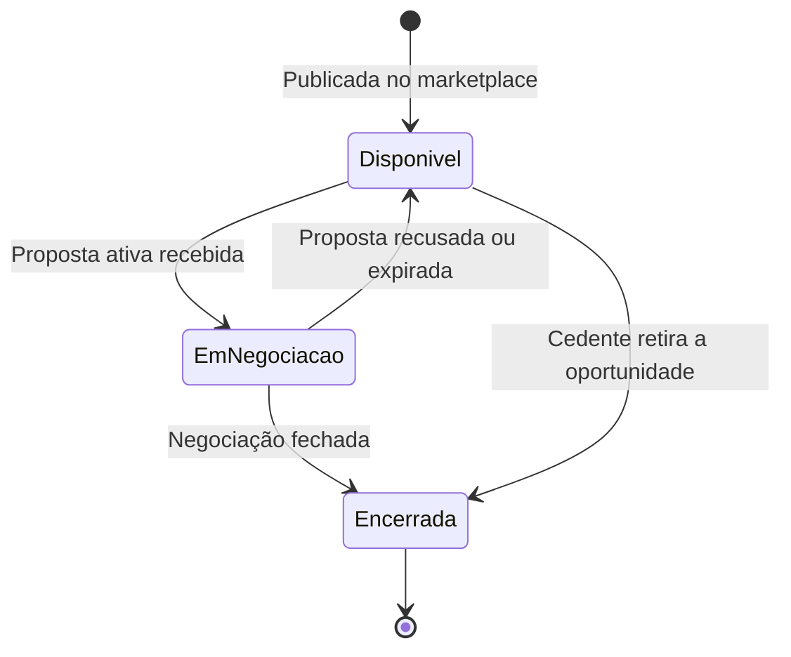
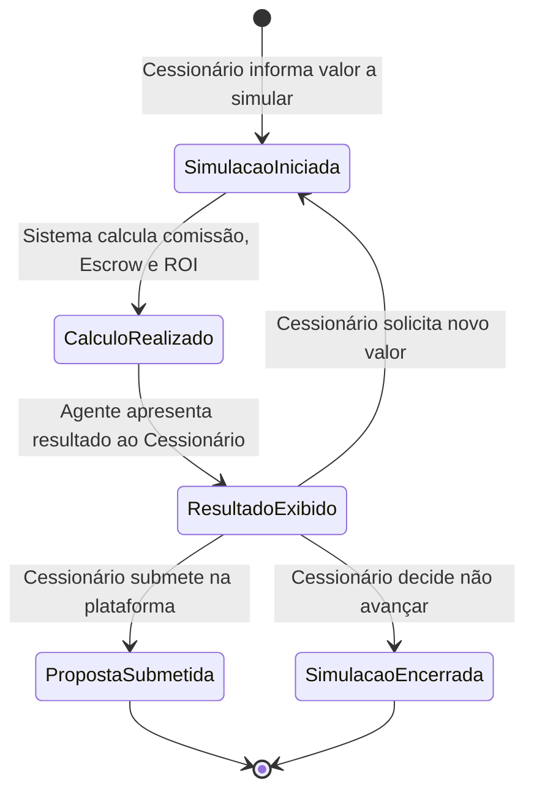

# 💰 Regras de Negócio — Módulos Core e Receita

## Repasse AI · Parte 2 de 5

| **Campo** | **Valor** |
|---|---|
| **Destinatário** | Equipe de Produto e Engenharia |
| **Escopo** | Análise de oportunidade · Cálculo de comissão e Escrow · Comparação de oportunidades · Simulação de propostas e contrapropostas · ROI e cenários de investimento |
| **Módulo** | Repasse AI |
| **Parte** | Parte 2 de 5 — Módulos Core e Receita |
| **Versão** | v1.1 |
| **Responsável** | Claude Code Desktop |
| **Data da versão** | 2026-03-22 (America/Fortaleza) |
| **Continuidade** | RN-010 (Parte 01.1) |
| **Origem do arquivo de entrada** | 01 - Regras de Negócios.md |

---

> 📌 **TL;DR**
>
> - Este arquivo cobre os módulos que geram valor direto ao Cessionário e são indispensáveis para o fluxo principal do produto: analisar → comparar → simular → decidir.
> - Remover qualquer módulo desta parte interrompe o ciclo de conversão proposta→fechamento, que é a principal métrica de sucesso do Repasse AI.
> - As regras de cálculo de comissão e Escrow são **determinísticas**: não dependem do agente de IA para funcionar e devem ser implementadas como módulo independente (Calculadora de Comissão).
> - A numeração RN continua a partir de RN-011.

---

## 🎯 1. Módulo: Análise de Oportunidade Individual

### 1.1 Objetivo do módulo

Permitir que o Cessionário obtenha uma análise completa de uma oportunidade específica — com Δ calculado, comissão, custo total, score de risco, ROI projetado e comparativo regional — sem precisar interpretar os dados brutos do marketplace manualmente.

### 1.2 Atores envolvidos

- Cessionário (solicita a análise)
- Repasse AI (executa a análise e apresenta os resultados)

### 1.3 Objeto principal

**Oportunidade** (identificada pelo código OPR-XXXX-XXXX).

### 1.4 Estados da oportunidade visíveis ao agente

| **Estado** | **Descrição** |
|---|---|
| Disponível | Oportunidade publicada no marketplace, disponível para análise e proposta |
| Em negociação | Oportunidade com proposta ativa de outro Cessionário [DECISÃO AUTÔNOMA — o agente informa que a oportunidade está em negociação, mas não revela a identidade do outro Cessionário, conforme RN-004 (Parte 01.1). Alternativa descartada: ocultar completamente a oportunidade, o que impediria o Cessionário de se manter informado.] |
| Encerrada | Oportunidade fora do marketplace — agente informa que não está mais disponível |

### 1.5 Operações principais

- Analisar (oportunidade individual)
- Calcular (Δ, comissão, Escrow, ROI)
- Avaliar (score de risco)
- Contextualizar (comparativo regional)

### 1.6 Diagrama de estados da oportunidade

---

**RN-011: Análise de oportunidade individual pelo agente**

> Origem: IA-CAP-01, seção 4.1 do arquivo de entrada

1. O Cessionário solicita ao agente a análise de uma oportunidade específica (via tela de oportunidade ou mencionando o código OPR no chat).
2. O sistema verifica se a oportunidade existe e está disponível no marketplace dentro do escopo do Cessionário autenticado.
3. **Se a oportunidade está disponível:** o agente realiza e apresenta os seguintes elementos de análise:
   - 3.1. **Δ (Delta):** diferença entre Tabela Atual e Tabela Contrato, em reais.
   - 3.2. **Comissão do comprador:** calculada conforme RN-013.
   - 3.3. **Custo total:** Preço Repasse + Comissão (valor total a depositar no Escrow).
   - 3.4. **Retorno estimado:** ROI projetado conforme RN-016, com cenários otimista, base e conservador.
   - 3.5. **Score de risco:** avaliação de 1 a 10 com justificativa baseada nos dados do marketplace. O score é exibido com indicador visual de cor: verde (1-3, risco baixo), amarelo (4-6, risco moderado), vermelho (7-10, risco alto). O indicador deve ter contraste mínimo de 4.5:1 em relação ao fundo e rótulo textual acessível para screen readers ("Risco baixo", "Risco moderado", "Risco alto"). [CORRIGIDO: PROBLEMA-017] [DECISÃO APLICADA: DEC-007 — escala de 3 faixas de cor foi preferida a 10 cores distintas por simplicidade de leitura e acessibilidade; o valor numérico continua visível para quem quer mais detalhe.]
   - 3.6. **Comparativo regional:** contexto da oportunidade em relação ao mercado da mesma região (quando dados disponíveis). Se não há dados regionais suficientes, o agente informa: "Não há dados suficientes para comparativo regional desta oportunidade no momento." em vez de omitir silenciosamente a seção. [CORRIGIDO: PROBLEMA-018]
   - 3.7. **Gráfico de valorização:** histórico de valorização do empreendimento (quando disponível). Em canais que não suportam gráficos interativos (WhatsApp), o agente substitui por tabela textual com os pontos de valorização. Se não há dados de valorização disponíveis, o agente informa: "O histórico de valorização deste empreendimento ainda não está disponível." [CORRIGIDO: PROBLEMA-019]
4. **Se a oportunidade está em negociação com outro Cessionário:** o agente informa o status e pergunta se o Cessionário deseja ser notificado caso a oportunidade volte a estar disponível. A resposta exibe badge de status "Em negociação" (cor laranja) ao lado do código OPR. Se o Cessionário quiser ser notificado, o agente confirma inline: "Pronto, você será avisado se essa oportunidade ficar disponível novamente." [CORRIGIDO: PROBLEMA-020]
5. **Se a oportunidade foi encerrada ou removida:** o agente informa que a oportunidade não está mais disponível e oferece buscar oportunidades semelhantes. A mensagem exibe badge de status "Encerrada" (cor cinza). O agente apresenta até 3 sugestões de oportunidades semelhantes como botões de ação rápida (chips com código OPR). [CORRIGIDO: PROBLEMA-021]
6. **Se a oportunidade não existe no marketplace:** o agente exibe: "Não encontrei esta oportunidade no marketplace. Verifique o código e tente novamente, ou posso buscar oportunidades disponíveis para você." A mensagem é exibida com ícone de busca (lupa) para diferenciar visualmente de mensagens de erro. [CORRIGIDO: PROBLEMA-022]
7. **Efeito no estado:** a análise é registrada no histórico de conversa do Cessionário.
8. **Consequência se violada:** sem análise estruturada, o Cessionário toma decisões com dados incompletos, reduzindo a qualidade das propostas e a conversão.

---

**RN-012: Score de risco da oportunidade**

> Origem: seção 4.1 e Glossário do arquivo de entrada

1. O agente inicia o cálculo do score de risco de uma oportunidade como parte da análise (RN-011) ou a pedido direto do Cessionário.
2. O sistema verifica os dados disponíveis da oportunidade no marketplace.
3. **Se há dados suficientes para calcular o score:** o agente apresenta o score de 1 a 10, onde 1 é risco muito baixo e 10 é risco muito alto, com uma justificativa baseada nos dados utilizados. A justificativa lista os fatores considerados no cálculo (ex: "Considerados: valorização do empreendimento, localização, tempo de mercado"). Os fatores são exibidos como lista compacta abaixo do score, com hierarquia visual secundária (fonte menor ou cor mais clara que o score principal). [CORRIGIDO: PROBLEMA-023]
4. **Se os dados são insuficientes para calcular o score com confiança:** o agente informa: "Os dados disponíveis desta oportunidade não são suficientes para calcular um score de risco preciso. Recomendo solicitar o dossiê completo antes de decidir." O agente não exibe score parcial ou estimado — a ausência de score é comunicada de forma explícita para evitar decisões baseadas em dados incompletos. [CORRIGIDO: PROBLEMA-024] [DECISÃO APLICADA: DEC-008 — omissão total do score quando dados são insuficientes foi preferida a exibir score parcial com disclaimer, pois score parcial pode ser confundido com score definitivo e induzir decisões inadequadas.]
5. **Efeito no estado:** score de risco é apresentado junto à análise e registrado no histórico de conversa.
6. **Consequência se violada:** score de risco impreciso ou ausente aumenta a probabilidade de o Cessionário fazer propostas em oportunidades inadequadas ao seu perfil.

---

## 🎯 2. Módulo: Cálculo de Comissão e Escrow

### 2.1 Objetivo do módulo

Garantir que o Cessionário saiba exatamente quanto pagará de comissão e qual o valor total a depositar no Escrow antes de submeter qualquer proposta, eliminando surpresas financeiras após o aceite.

### 2.2 Atores envolvidos

- Cessionário (solicita ou recebe automaticamente o cálculo)
- Repasse AI (apresenta o cálculo)
- Calculadora de Comissão (módulo determinístico que executa as fórmulas)

### 2.3 Objeto principal

**Proposta** — entidade sobre a qual o cálculo é aplicado.

### 2.4 Fórmulas de negócio (determinísticas)

| **Cálculo** | **Fórmula** | **Condição** |
|---|---|---|
| Comissão padrão | 20% × Δ | Δ > 0 |
| Comissão fallback | 20% × Valor Pago pelo Cedente | Δ ≤ 0 |
| Custo total Escrow | Preço Repasse + Comissão | Sempre |
| ROI projetado | (Tabela Atual − Custo Total) ÷ Custo Total × 100 | Sempre |

> 💡 Esses cálculos são **determinísticos**: não dependem do agente de IA. A Calculadora de Comissão deve ser implementada como módulo independente e funcionar mesmo quando o agente estiver indisponível. Ver RN-022 (Parte 01.3) para comportamento de fallback.

---

**RN-013: Cálculo de comissão do comprador**

> Origem: seção 4.3 e Glossário do arquivo de entrada

1. O agente calcula a comissão do comprador para uma proposta ao valor informado pelo Cessionário ou ao preço de tabela da oportunidade.
2. O sistema verifica se o Δ (Tabela Atual − Tabela Contrato) é positivo.
3. **Se Δ > 0:** a comissão é calculada como 20% × Δ.
4. **Se Δ ≤ 0 (Tabela Atual igual ou menor que Tabela Contrato):** a comissão é calculada como 20% × Valor Pago pelo Cedente. [DECISÃO AUTÔNOMA — o fallback para Valor Pago pelo Cedente protege a receita da plataforma em cenários de desvalorização. O Valor Pago pelo Cedente é um dado da oportunidade disponível no escopo autorizado do Cessionário, não configurando violação de isolamento.]
5. **Descontos por faixa:** aplicados exclusivamente pelo Admin — o agente não aplica descontos sem autorização do Admin registrada na oportunidade.
6. O agente exibe: "A comissão sobre esta proposta é de R$ [valor]. Esse valor é calculado sobre [base de cálculo utilizada]." Valores monetários são formatados com separador de milhar (ponto) e duas casas decimais (ex: R$ 30.000,00). Quando a comissão é calculada com fallback (Δ ≤ 0), o agente adiciona nota explicativa: "Como a Tabela Atual não é superior à Tabela Contrato, a comissão é calculada sobre o Valor Pago pelo Cedente." para que o Cessionário entenda o motivo da base diferente. [CORRIGIDO: PROBLEMA-025]
7. **Efeito no estado:** comissão calculada é exibida na conversa e usada como base para o cálculo do custo total (RN-014).
8. **Consequência se violada:** comissão calculada incorretamente gera discrepância entre o valor exibido pelo agente e o cobrado na plataforma, quebrando a confiança do Cessionário.

---

**RN-014: Cálculo do custo total de Escrow**

> Origem: seção 4.3 e Glossário do arquivo de entrada

1. Após calcular a comissão (RN-013), o agente calcula o custo total que o Cessionário precisará depositar no Escrow.
2. **Fórmula:** Custo Total = Preço Repasse + Comissão.
3. O agente exibe: "Para esta proposta, o valor total a depositar no Escrow é de R$ [valor total] — sendo R$ [preço repasse] pelo repasse e R$ [comissão] de comissão."
4. **Se o Cessionário propõe um valor diferente do preço de tabela (simulação de contraproposta):** o agente recalcula usando o novo valor como Preço Repasse e apresenta o novo custo total (conforme RN-018).
5. **Efeito no estado:** valor de Escrow exibido ao Cessionário antes de qualquer submissão de proposta.
6. **Consequência se violada:** Cessionário submete proposta sem saber o valor real do Escrow, gerando inadimplência de depósito e cancelamento da negociação.

---

## 🎯 3. Módulo: Comparação de Oportunidades

### 3.1 Objetivo do módulo

Permitir que o Cessionário compare até 5 oportunidades simultaneamente em uma tabela estruturada, ranqueadas por critérios definidos pelo próprio investidor, acelerando a tomada de decisão.

### 3.2 Atores envolvidos

- Cessionário (define os critérios de comparação)
- Repasse AI (monta e apresenta a tabela comparativa)

### 3.3 Objeto principal

**Conjunto de oportunidades** — de 2 a 5 oportunidades selecionadas para comparação.

### 3.4 Operações principais

- Comparar (até 5 oportunidades)
- Ranquear (por critério definido pelo Cessionário)
- Destacar (melhor oportunidade por cada critério)

---

**RN-015: Comparação de até 5 oportunidades**

> Origem: seção 4.2 do arquivo de entrada

1. O Cessionário solicita a comparação de múltiplas oportunidades (pode especificá-las por código OPR ou pedir ao agente que selecione as melhores de uma região ou categoria).
2. O sistema verifica quantas oportunidades foram solicitadas para comparação.
3. **Se foram solicitadas entre 2 e 5 oportunidades e todas estão disponíveis:** o agente monta uma tabela comparativa com os seguintes campos para cada oportunidade:
   - Δ (em reais)
   - Comissão (em reais)
   - Custo total Escrow (em reais)
   - Score de risco (1–10)
   - Localização (cidade/bairro)
   - Tipologia (tipo do imóvel)
   A tabela é exibida com scroll horizontal em dispositivos móveis quando as colunas ultrapassam a largura da tela. A coluna com o critério de ranqueamento ativo é destacada visualmente (fundo levemente diferenciado). Cada linha da tabela é clicável e abre a análise detalhada da oportunidade correspondente (conforme RN-011). [CORRIGIDO: PROBLEMA-026] [DECISÃO APLICADA: DEC-009 — linhas clicáveis na tabela comparativa foram preferidas a botões de ação em cada linha, pois reduzem a poluição visual e mantêm a tabela compacta.]
4. **Se o Cessionário definiu um critério de ranqueamento** (ex: melhor retorno, menor risco, menor aporte): o agente ordena a tabela por esse critério e destaca o primeiro colocado. O destaque do primeiro colocado é feito com badge "Melhor opção" ao lado do código OPR, em cor de destaque. [CORRIGIDO: PROBLEMA-027]
5. **Se o Cessionário não definiu critério:** o agente ranqueia por melhor relação retorno/risco e informa o critério utilizado.
6. **Se foram solicitadas mais de 5 oportunidades:** o agente informa: "Consigo comparar até 5 oportunidades de uma vez. Qual grupo você gostaria de analisar primeiro?" e aguarda refinamento do Cessionário.
7. **Se uma das oportunidades solicitadas não está mais disponível:** o agente informa qual oportunidade foi removida e monta a tabela com as demais, perguntando se o Cessionário deseja substituir.
8. **Efeito no estado:** tabela comparativa registrada no histórico de conversa.
9. **Consequência se violada:** sem comparação estruturada, o Cessionário analisa oportunidades de forma isolada, reduzindo a qualidade da decisão de investimento.

---

## 🎯 4. Módulo: Simulação de Propostas e Contrapropostas

### 4.1 Objetivo do módulo

Permitir que o Cessionário simule o impacto financeiro de diferentes valores de proposta antes de submeter qualquer oferta, reduzindo erros e aumentando a assertividade das negociações.

### 4.2 Atores envolvidos

- Cessionário (define os valores a simular)
- Repasse AI (executa a simulação e apresenta os resultados)
- Calculadora de Comissão (executa os cálculos determinísticos)

### 4.3 Objeto principal

**Proposta simulada** — valor hipotético avaliado antes da submissão real.

### 4.4 Diagrama de fluxo de simulação

---

**RN-016: Simulação de custos para uma proposta**

> Origem: seção 4.3 e fluxo 7.1 do arquivo de entrada

1. O Cessionário informa ao agente o valor que pretende propor para uma oportunidade.
2. O sistema verifica se o valor informado é válido (número positivo, dentro da faixa da oportunidade).
3. **Se o valor é válido:** o agente executa a simulação e apresenta:
   - 3.1. Comissão calculada sobre o valor proposto (conforme RN-013).
   - 3.2. Depósito total no Escrow (conforme RN-014).
   - 3.3. ROI projetado com os cenários otimista, base e conservador (conforme RN-017).
4. **Se o valor informado não é numérico ou é zero ou negativo:** o agente exibe: "O valor informado não é válido. Por favor, informe um valor em reais maior que zero para a simulação." A mensagem de erro é exibida com ícone de atenção (triângulo amarelo) e o campo de entrada permanece ativo para nova tentativa imediata, sem necessidade de o Cessionário reiniciar o fluxo. [CORRIGIDO: PROBLEMA-028]
5. O agente encerra a simulação com próximo passo claro: "Se quiser simular com outro valor ou submeter esta proposta na plataforma, é só me avisar." Os dois próximos passos são apresentados como botões de ação rápida: "Simular outro valor" e "Ir para a oportunidade" (link para a tela de submissão de proposta na plataforma). [CORRIGIDO: PROBLEMA-029] [DECISÃO APLICADA: DEC-010 — botões de ação rápida ao final da simulação foram preferidos a texto corrido, pois reduzem fricção e deixam as opções explícitas para o Cessionário.]
6. **Efeito no estado:** simulação registrada no histórico. O Cessionário precisa acessar a plataforma para submeter a proposta real — o agente não submete em nome do Cessionário.
7. **Consequência se violada:** sem simulação prévia, o Cessionário pode submeter propostas com custo total subestimado, gerando inadimplência de depósito.

---

**RN-017: Cálculo de ROI com cenários de investimento**

> Origem: seção 4.3 e 4.6 do arquivo de entrada

1. O agente calcula o retorno sobre o investimento (ROI) para uma oportunidade ou simulação.
2. O sistema aplica a fórmula: ROI = (Tabela Atual − Custo Total) ÷ Custo Total × 100.
3. O agente apresenta **três cenários** baseados em variações da valorização estimada do empreendimento:
   - **Cenário conservador:** valorização 20% abaixo da estimativa base.
   - **Cenário base:** valorização conforme estimativa disponível no marketplace.
   - **Cenário otimista:** valorização 20% acima da estimativa base. [DECISÃO AUTÔNOMA — percentual de 20% adotado como variação padrão por ser uma faixa comum em análises de risco imobiliário. Alternativa descartada: 10%, considerada insuficiente para capturar volatilidade do mercado de repasses.]
4. O agente apresenta cada cenário com o valor de ROI em percentual e o lucro estimado em reais. Os três cenários são exibidos lado a lado (ou empilhados em dispositivos móveis) com diferenciação visual: conservador (ícone de escudo, cor neutra), base (ícone de alvo, cor padrão) e otimista (ícone de tendência ascendente, cor de destaque). O cenário base é visualmente destacado como referência principal. [CORRIGIDO: PROBLEMA-030]
5. O agente adiciona o aviso obrigatório: "Esses são valores projetados com base nos dados disponíveis. Resultados reais podem variar conforme condições de mercado." O aviso é exibido em corpo de texto menor, com ícone de informação (i), abaixo dos cenários. O aviso não pode ser omitido ou ocultado pelo Cessionário. [CORRIGIDO: PROBLEMA-031]
6. **Efeito no estado:** projeção de ROI registrada no histórico de conversa junto à simulação.
7. **Consequência se violada:** sem cenários, o Cessionário pode superestimar o retorno e tomar decisões de risco inadequadas ao seu perfil.

---

**RN-018: Simulação de contraproposta**

> Origem: seção 4.3 e fluxo 7.2 do arquivo de entrada

1. O Cessionário está em uma negociação ativa e solicita ao agente a simulação de um valor de contraproposta diferente do original.
2. O sistema verifica se há uma negociação ativa vinculada ao Cessionário.
3. **Se há negociação ativa:** o agente calcula e apresenta, para o novo valor simulado:
   - 3.1. Nova comissão calculada sobre o valor de contraproposta.
   - 3.2. Novo depósito total no Escrow.
   - 3.3. Diferença em reais em relação à proposta anterior (economia ou acréscimo). A diferença é exibida com indicador visual: seta para baixo em verde se é economia, seta para cima em vermelho se é acréscimo, com valor absoluto e percentual. [CORRIGIDO: PROBLEMA-032]
   - 3.4. ROI ajustado com os três cenários (conservador, base, otimista).
4. **Se o Cessionário quiser simular outro valor:** o agente repete o cálculo para o novo valor informado, sem limite de iterações na mesma sessão.
5. **Se não há negociação ativa:** o agente informa: "Não encontrei uma negociação ativa para simular a contraproposta. Quer que eu simule uma proposta inicial para alguma oportunidade disponível?"
6. O agente encerra com próximo passo: "Quando decidir o valor, acesse a tela de negociação na plataforma para submeter a contraproposta."
7. **Efeito no estado:** cada simulação é registrada no histórico, permitindo ao Cessionário comparar diferentes valores simulados na mesma sessão.
8. **Consequência se violada:** sem simulação de contraproposta, o Cessionário faz contrapropostas sem base de cálculo, gerando negociações mal calibradas.

---

## 🎯 5. Módulo: Análise de Cenários de Investimento

### 5.1 Objetivo do módulo

Permitir que o Cessionário avalie estratégias de alocação de capital entre múltiplas oportunidades — respondendo perguntas do tipo "e se eu investir X em Y oportunidades?" — com resultado quantificado em reais e percentual de retorno.

### 5.2 Atores envolvidos

- Cessionário (define o capital disponível e as oportunidades de interesse)
- Repasse AI (executa a análise e apresenta os cenários)

### 5.3 Objeto principal

**Portfólio simulado** — conjunto de oportunidades avaliadas como uma estratégia de investimento.

---

**RN-019: Simulação de portfólio com múltiplas oportunidades**

> Origem: seção 4.6 do arquivo de entrada

1. O Cessionário informa ao agente um capital disponível e solicita análise de como distribuí-lo entre múltiplas oportunidades.
2. O sistema verifica se as oportunidades informadas estão disponíveis no marketplace.
3. **Se todas as oportunidades estão disponíveis:** o agente calcula para cada oportunidade o custo total de Escrow (conforme RN-014) e apresenta:
   - 3.1. Capital total necessário para cobrir todos os Escrows somados.
   - 3.2. Se o capital informado é suficiente, insuficiente ou excedente.
   - 3.3. ROI projetado para o portfólio completo e por oportunidade individual.
4. **Se o capital informado é insuficiente para todas as oportunidades:** o agente informa o déficit e sugere: "Com R$ [capital disponível], você consegue cobrir as oportunidades [lista das que cabem no orçamento]. Quer que eu ranqueie quais priorizar?" O déficit é exibido em destaque visual (negrito, cor de alerta) para que o Cessionário perceba rapidamente que o capital é insuficiente. A sugestão de ranqueamento é apresentada como botão de ação rápida "Ranquear por prioridade". [CORRIGIDO: PROBLEMA-033]
5. **Se alguma oportunidade não está mais disponível:** o agente informa e recalcula com as oportunidades restantes.
6. **Efeito no estado:** análise de portfólio registrada no histórico de conversa.
7. **Consequência se violada:** sem análise de portfólio, o Cessionário pode comprometer capital em múltiplos Escrows sem verificar se tem liquidez suficiente para todos.

---

**RN-020: Simulação de impacto de variação de valorização**

> Origem: seção 4.6 do arquivo de entrada

1. O Cessionário pergunta ao agente qual o impacto de uma variação específica na valorização do empreendimento sobre o ROI de uma oportunidade.
2. O agente recalcula o ROI aplicando a variação informada pelo Cessionário à Tabela Atual.
3. **Se a variação informada é positiva:** o agente mostra o ROI melhorado e o novo lucro estimado.
4. **Se a variação informada é negativa:** o agente mostra o ROI reduzido e, se o resultado for negativo (prejuízo), informa claramente: "Com uma desvalorização de [X]%, o retorno desta oportunidade seria negativo. O investimento resultaria em uma perda estimada de R$ [valor]."
5. O agente encerra com o aviso obrigatório: "Esta é uma projeção baseada nos dados disponíveis. Resultados reais podem variar."
6. **Efeito no estado:** simulação registrada no histórico.
7. **Consequência se violada:** sem simulação de variação, o Cessionário não avalia adequadamente o risco de desvalorização antes de investir.

---

## 🎯 6. Recomendação Proativa de Oportunidades

### 6.1 Objetivo do módulo

Identificar proativamente oportunidades compatíveis com o perfil de investimento do Cessionário e apresentá-las de forma ordenada, reduzindo o tempo de descoberta de oportunidades relevantes.

### 6.2 Atores envolvidos

- Cessionário (define preferências e recebe recomendações)
- Repasse AI (analisa o marketplace e gera as recomendações)
- Sistema de notificações (dispara alertas para novas oportunidades — detalhes na Parte 01.5)

### 6.3 Objeto principal

**Perfil de investimento** — conjunto de preferências do Cessionário (região, faixa de Δ, tolerância ao risco, capital disponível).

---

**RN-021: Geração do Top 3 de oportunidades em destaque**

> Origem: seção 4.4 do arquivo de entrada

1. O Cessionário acessa o Dashboard da plataforma ou solicita ao agente "Quais são as melhores oportunidades para mim hoje?".
2. O sistema verifica as oportunidades disponíveis no marketplace e o perfil de investimento do Cessionário.
3. **Se há oportunidades disponíveis e há dados de perfil suficientes:** o agente seleciona as 3 oportunidades com melhor relação retorno/risco compatíveis com as preferências do Cessionário e as apresenta com: Δ, comissão estimada, score de risco e localização.
4. **Se há oportunidades disponíveis mas o perfil está incompleto:** o agente apresenta o Top 3 com base nos melhores retornos gerais e informa: "Para recomendações mais personalizadas, complete seu perfil de investimento em Meu Perfil > Preferências." O link "Meu Perfil > Preferências" é clicável e direciona à tela correspondente. O agente exibe banner informativo acima do Top 3 indicando que as recomendações são genéricas: "Recomendações baseadas em dados gerais de mercado. Complete seu perfil para resultados personalizados." [CORRIGIDO: PROBLEMA-034]
5. **Se não há oportunidades disponíveis:** o agente informa e oferece configurar alertas (conforme RN-025 na Parte 01.5).
6. **Efeito no estado:** Top 3 gerado é exibido no widget do Dashboard e registrado no histórico.
7. **Consequência se violada:** sem recomendação proativa, o Cessionário precisa filtrar manualmente o marketplace, reduzindo a experiência e a utilização da plataforma.

---

## 🔴 7. Edge Cases de Core e Receita

| **Cenário** | **Comportamento esperado** | **RN de referência** |
|---|---|---|
| Δ igual a zero em uma oportunidade | Comissão calculada sobre o Valor Pago pelo Cedente (fallback) | RN-013 |
| Cessionário propõe valor maior que a Tabela Atual | Agente aceita a simulação e informa que o ROI seria negativo neste caso | RN-016 |
| Cessionário solicita comparar 6 oportunidades de uma vez | Agente informa o limite de 5 e pede refinamento | RN-015 |
| Cessionário pergunta "qual é a melhor proposta que posso fazer?" | Agente simula com base no preço de tabela e sugere simular variações | RN-016 |
| Cessionário pede ROI sem informar o valor da proposta | Agente usa o preço de tabela como referência padrão e informa | RN-016 |
| Oportunidade sai do marketplace durante simulação | Agente informa na próxima mensagem que a oportunidade não está mais disponível | RN-011 |
| Duas oportunidades têm o mesmo score de risco no ranqueamento | Agente desempata por maior Δ (melhor retorno absoluto) [DECISÃO AUTÔNOMA] | RN-015 |

---

## 📊 8. Matriz de Permissões — Módulos Core

| **Operação** | **Cessionário** | **Admin** | **Cedente** |
|---|---|---|---|
| Solicitar análise de oportunidade | ✅ Próprias negociações + marketplace | ✅ Todas | ❌ Não se aplica |
| Visualizar Δ e comissão calculados | ✅ Sempre | ✅ Sempre | ❌ Não se aplica |
| Solicitar comparação de oportunidades | ✅ Até 5 simultâneas | ✅ Sem limite | ❌ Não se aplica |
| Simular valores de proposta | ✅ Ilimitado na sessão | ✅ Ilimitado | ❌ Não se aplica |
| Receber Top 3 recomendações | ✅ Baseado em perfil próprio | ✅ Por qualquer Cessionário | ❌ Não se aplica |
| Aplicar desconto na comissão | ❌ Bloqueado | ✅ Mediante critério definido | ❌ Não se aplica |
| Ver Valor Pago pelo Cedente (base fallback) | ✅ Dado público da oportunidade | ✅ Sempre | ✅ Próprio dado |

---

*Continuidade: próximas RNs iniciam em RN-022 na Parte 01.3.*
