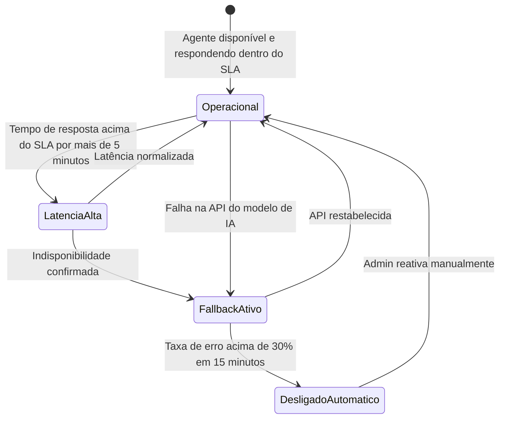

# ⚙️ Regras de Negócio — Módulos Operação e Suporte

## Repasse AI · Parte 3 de 5

| **Campo** | **Valor** |
|---|---|
| **Destinatário** | Equipe de Produto e Engenharia |
| **Escopo** | Suporte operacional · Rate limit · Fallback da Calculadora · Fluxos de conversação · Disponibilidade do agente |
| **Módulo** | Repasse AI |
| **Parte** | Parte 3 de 5 — Módulos Operação e Suporte |
| **Versão** | v1.1 |
| **Responsável** | Claude Code Desktop |
| **Data da versão** | 2026-03-22 (America/Fortaleza) |
| **Continuidade** | RN-021 (Parte 01.2) |
| **Origem do arquivo de entrada** | 01 - Regras de Negócios.md |

---

> 📌 **TL;DR**
>
> - Este arquivo cobre os módulos que sustentam a operação do Repasse AI sem gerar receita diretamente: suporte a dúvidas operacionais, controle de uso (rate limit), comportamento em casos de falha ou indisponibilidade da IA e os fluxos principais de conversação.
> - Remover qualquer módulo desta parte não interrompe o faturamento imediatamente, mas compromete a qualidade da experiência do Cessionário e pode gerar sobrecarga no Admin.
> - A Calculadora de Comissão deve funcionar de forma independente do agente — este é o principal mecanismo de resiliência operacional do produto.
> - A numeração RN continua a partir de RN-022.

---

## 🎯 1. Módulo: Suporte Operacional

### 1.1 Objetivo do módulo

Responder ao Cessionário dúvidas sobre regras da plataforma, processos de verificação de identidade, funcionamento do Escrow, prazos e status de proposta — reduzindo a carga de atendimento do Admin para perguntas frequentes de operação.

### 1.2 Atores envolvidos

- Cessionário (faz perguntas sobre o funcionamento da plataforma)
- Repasse AI (responde com base nas regras definidas neste documento e no conjunto de documentação da plataforma)
- Admin (recebe o overflow de dúvidas que o agente não conseguir responder)

### 1.3 Objeto principal

**Dúvida operacional** — pergunta sobre regras, prazos, processos ou status da plataforma.

### 1.4 Operações principais

- Explicar (regras de KYC, Escrow, assinatura, fechamento)
- Orientar (prazos e SLAs)
- Esclarecer (status de proposta e negociação)
- Encaminhar (quando a dúvida está fora do escopo operacional)

---

**RN-022: Resposta a perguntas sobre regras da plataforma**

> Origem: seção 4.5 do arquivo de entrada

1. O Cessionário faz uma pergunta sobre como funciona algum processo ou regra da plataforma.
2. O agente verifica se a pergunta está dentro do escopo de suporte operacional definido.
3. **Se a pergunta está dentro do escopo:** o agente responde com informação objetiva, incluindo prazos e próximo passo quando aplicável. Os tópicos cobertos pelo suporte operacional incluem:
   - 3.1. **KYC:** documentos exigidos, prazo de análise, motivos comuns de rejeição.
   - 3.2. **Escrow:** o que é, como funciona, prazo padrão de 10 dias úteis, como solicitar extensão de +5 dias úteis (mediante aprovação do Admin).
   - 3.3. **Assinatura eletrônica:** o que é o Envelope ZapSign, como funciona, prazo de assinatura.
   - 3.4. **Fechamento:** etapas do processo após aceite da proposta.
   - 3.5. **Status de proposta e negociação:** o que significa cada status exibido na plataforma.
4. **Se a pergunta está fora do escopo (jurídica, fiscal, ou específica de um contrato individual):** o agente exibe a mensagem de redirecionamento correspondente conforme RN-004 da Parte 01.1. A mensagem de redirecionamento inclui link clicável para o canal de suporte ou seção relevante quando aplicável (ex: "Entre em contato com o suporte via negociação" com link para a tela de negociação). [CORRIGIDO: PROBLEMA-035]
5. **Efeito no estado:** resposta registrada no histórico de conversa.
6. **Consequência se violada:** sem suporte operacional no agente, o Admin recebe volume elevado de perguntas simples, reduzindo sua capacidade para atendimentos complexos.

---

**RN-022.a: Esclarecimento de prazos e SLAs**

> Origem: seção 4.5 do arquivo de entrada

1. O Cessionário pergunta sobre prazos específicos da plataforma.
2. O agente responde com os prazos vigentes:
   - **Depósito em Escrow:** 10 dias úteis após o aceite da proposta.
   - **Extensão de Escrow:** +5 dias úteis mediante aprovação do Admin.
   - **Reversão do Escrow:** 15 dias corridos caso a negociação não seja concluída.
   - **Análise de KYC:** prazo padrão [DEFINIÇÃO PENDENTE — prazo de análise de KYC não especificado no arquivo de entrada. Opção A: 2 dias úteis (padrão de mercado para verificação automatizada). Opção B: 5 dias úteis (considerando revisão manual em casos de documentação rejeitada).]. O agente informa o prazo configurado e, caso o prazo tenha sido excedido para o Cessionário, orienta: "Sua verificação está levando mais que o esperado. Se precisar de ajuda, entre em contato com o suporte." [CORRIGIDO: PROBLEMA-036] [DECISÃO APLICADA: DEC-011 — mensagem proativa de atraso de KYC foi adicionada para cobrir o edge case de o Cessionário perguntar "por que meu KYC está demorando" sem que o agente tenha resposta acionável.]
3. **Se o Cessionário perguntar sobre um prazo não listado acima:** o agente informa: "Não tenho essa informação disponível no momento. Para prazos específicos desta negociação, entre em contato com o suporte via chat de negociação."
4. **Efeito no estado:** prazos informados são registrados no histórico de conversa.
5. **Consequência se violada:** prazos incorretos levam o Cessionário a perder depósitos ou a deixar negociações expirarem por falta de informação.

---

**RN-022.b: Esclarecimento de status de proposta e negociação**

> Origem: seção 4.5 do arquivo de entrada

1. O Cessionário pergunta o que significa um determinado status exibido na plataforma para sua proposta ou negociação.
2. O agente responde com a definição do status em linguagem clara e informa o próximo passo esperado para aquele estado. [DECISÃO AUTÔNOMA — o agente responde com base nos status definidos nos documentos de regras de negócio da plataforma Repasse Seguro. Os status específicos de proposta/negociação são definidos no documento de RNs do módulo Cessionário (referência cruzada), não neste documento.]
3. **Se o status exibido não está no conjunto de status conhecidos:** o agente informa: "Não reconheço esse status. Para esclarecer, entre em contato com o suporte via negociação."
4. **Efeito no estado:** resposta registrada no histórico de conversa.
5. **Consequência se violada:** sem esclarecimento de status, o Cessionário fica paralisado em etapas simples da negociação.

---

## 🎯 2. Módulo: Fallback da Calculadora de Comissão

### 2.1 Objetivo do módulo

Garantir que o Cessionário sempre receba os cálculos de comissão, Escrow e ROI mesmo quando o agente de IA estiver indisponível, sem interromper o fluxo de análise por falhas de terceiros.

### 2.2 Atores envolvidos

- Cessionário (recebe o cálculo)
- Calculadora de Comissão (módulo determinístico, independente do agente)
- Repasse AI (quando disponível, enriquece o cálculo com análise contextual)

### 2.3 Objeto principal

**Cálculo de comissão** — resultado das fórmulas determinísticas sem depender do modelo de IA.

### 2.4 Estados do serviço de IA

---

**RN-023: Funcionamento da Calculadora de Comissão como fallback**

> Origem: seção 11.3 do arquivo de entrada

1. O Cessionário solicita um cálculo (comissão, Escrow ou ROI) via chat.
2. O sistema verifica se o agente de IA está disponível e respondendo dentro do SLA.
3. **Se o agente está disponível:** a Calculadora de Comissão executa o cálculo determinístico e o agente enriquece a resposta com análise contextual.
4. **Se o agente está indisponível:** a Calculadora de Comissão executa o cálculo determinístico de forma independente e exibe ao Cessionário: "Cálculo realizado sem análise contextual da IA. Para análise completa, tente novamente em instantes." O resultado do cálculo em fallback é exibido com banner informativo no topo ("Modo básico — sem análise da IA") em cor neutra (cinza/azul claro) para diferenciar visualmente de uma resposta completa do agente. O Cessionário pode interagir com o resultado (copiar valores, solicitar novo cálculo) normalmente. [CORRIGIDO: PROBLEMA-037] [DECISÃO APLICADA: DEC-012 — banner "Modo básico" foi preferido a ocultar completamente a diferença, pois o Cessionário precisa saber que a análise contextual não está presente para calibrar suas decisões.]
5. **Fórmulas usadas pela Calculadora em fallback** (conforme Parte 01.2, RN-013 e RN-014):
   - Comissão: 20% × Δ (ou 20% × Valor Pago pelo Cedente se Δ ≤ 0).
   - Custo total Escrow: Preço Repasse + Comissão.
   - ROI projetado: (Tabela Atual − Custo Total) ÷ Custo Total × 100.
6. **Efeito no estado:** o serviço de IA entra no estado FallbackAtivo; a Calculadora de Comissão permanece disponível independentemente.
7. **Consequência se violada:** sem fallback, qualquer indisponibilidade da API do modelo de IA impede o Cessionário de obter informações financeiras críticas para decidir sobre uma proposta.

---

**RN-024: Desligamento automático do agente por taxa de erro**

> Origem: seção 9.1 do arquivo de entrada

1. O sistema monitora continuamente a taxa de erros nas respostas do agente.
2. O sistema verifica a taxa de erros em janelas de tempo de 15 minutos.
3. **Se a taxa de erro supera 10% das respostas em 15 minutos:** o sistema dispara alerta para o Admin (conforme RN-031 na Parte 01.4) e mantém o agente operacional em modo de monitoramento elevado.
4. **Se a taxa de erro supera 30% das respostas em 15 minutos:** o sistema desliga automaticamente o agente. O Cessionário recebe: "O Analista de Oportunidades está temporariamente indisponível. Os cálculos de comissão e Escrow continuam disponíveis. Tente novamente em alguns instantes."
5. **Após o desligamento automático:** a Calculadora de Comissão assume o atendimento de cálculos (conforme RN-023). O agente só é reativado manualmente pelo Admin.
6. **Efeito no estado:** agente passa de Operacional para DesligadoAutomatico.
7. **Consequência se violada:** sem desligamento automático, o agente continuaria respondendo com alto índice de erros, degradando a confiança do Cessionário na plataforma.

---

## 🎯 3. Módulo: Rate Limit — Webchat

### 3.1 Objetivo do módulo

Controlar o volume de mensagens enviadas por Cessionário no webchat, prevenindo uso abusivo e garantindo disponibilidade do serviço para todos os usuários.

### 3.2 Atores envolvidos

- Cessionário (envia mensagens)
- Sistema de rate limit (conta e bloqueia temporariamente quando o limite é atingido)

### 3.3 Objeto principal

**Sessão de chat do Cessionário** — janela de 1 hora com limite de mensagens.

### 3.4 Estados do rate limit

| **Estado** | **Descrição** |
|---|---|
| Disponível | Cessionário está abaixo do limite; pode enviar mensagens |
| Limite atingido | Cessionário atingiu 30 mensagens na última hora; envio bloqueado até liberar quota |

---

**RN-025: Rate limit de mensagens no webchat**

> Origem: seção 6.1 do arquivo de entrada

1. O Cessionário envia uma mensagem no chat do webchat.
2. O sistema conta as mensagens enviadas pelo Cessionário em uma janela deslizante de 1 hora.
3. **Se o Cessionário enviou menos de 30 mensagens na última hora:** a mensagem é processada normalmente.
4. **Se o Cessionário atingiu 30 mensagens na última hora:** o sistema bloqueia o envio da próxima mensagem e exibe: "Você atingiu o limite de 30 mensagens por hora. Você poderá enviar a próxima mensagem em [tempo restante em minutos]." O campo de entrada de texto fica visualmente desabilitado (cor de fundo cinza, cursor bloqueado) e o botão de envio fica inativo. Um contador regressivo em tempo real (mm:ss) é exibido acima do campo de entrada, atualizado a cada segundo, mostrando quando o próximo envio será liberado. [CORRIGIDO: PROBLEMA-038]
5. **Após o desbloqueio (janela deslizante avança):** o sistema libera o envio automaticamente sem nenhuma ação do Cessionário. O campo de entrada retorna ao estado normal (cor de fundo branca, cursor ativo) e o contador regressivo desaparece. Uma micro-animação (pulse sutil no campo de entrada, duração 500ms) indica que o envio foi liberado. [CORRIGIDO: PROBLEMA-039]
6. **Efeito no estado:** status muda de Disponível para Limite atingido; retorna a Disponível conforme a janela deslizante avança.
7. **Consequência se violada:** sem rate limit, um único Cessionário poderia esgotar os recursos do serviço, degradando a experiência de todos os demais.

---

## 🎯 4. Fluxos Principais de Conversação

### 4.1 Objetivo do módulo

Documentar os fluxos de conversa mais frequentes para que sejam implementados como fluxos recomendados no agente, garantindo consistência na experiência do Cessionário.

### 4.2 Atores envolvidos

- Cessionário (inicia e conduz a conversa)
- Repasse AI (responde, calcula e recomenda)

### 4.3 Objeto principal

**Conversa** — sequência de mensagens com objetivo definido.

---

**RN-026: Fluxo principal — análise de oportunidade individual**

> Origem: seção 7.1 do arquivo de entrada

1. O Cessionário abre o chat na tela de uma oportunidade específica.
2. O agente carrega automaticamente o contexto da oportunidade (código OPR, dados do empreendimento).
3. O Cessionário solicita a análise da oportunidade.
4. O agente retorna a análise completa: Δ, comissão, custo total, score de risco, ROI projetado e comparativo regional (conforme RN-011, Parte 01.2).
5. **Se o Cessionário quiser mais informações:** o agente oferece comparação com as melhores oportunidades da mesma região (conforme RN-015, Parte 01.2).
6. **Se o Cessionário decidiu fazer uma proposta:** o agente simula o valor informado (comissão, Escrow, ROI) e encerra com o próximo passo: "Você pode submeter a proposta diretamente na tela da oportunidade."
7. **Se o Cessionário não decidiu:** o agente oferece salvar a preferência para alertas futuros (conforme RN-025, Parte 01.5).
8. **Efeito no estado:** conversa registrada no histórico; preferências de alerta salvas se solicitado.

---

**RN-027: Fluxo de simulação de contraproposta em negociação ativa**

> Origem: seção 7.2 do arquivo de entrada

1. O Cessionário está em uma negociação ativa e abre o chat para simular uma contraproposta.
2. O agente identifica a negociação ativa vinculada ao Cessionário.
3. O Cessionário informa o valor que pretende contrapropor.
4. O agente calcula e apresenta: nova comissão, novo Escrow, diferença em relação à proposta anterior e ROI ajustado (conforme RN-018, Parte 01.2).
5. **Se o Cessionário aceitar a simulação:** o agente encaminha para a plataforma com o próximo passo: "Acesse a tela de negociação para submeter a contraproposta."
6. **Se o Cessionário quiser simular outro valor:** o agente repete o cálculo para o novo valor sem limite de iterações.
7. **Efeito no estado:** cada simulação registrada no histórico da conversa.

---

**RN-028: Comportamento do agente ao recusar submissão de proposta em nome do Cessionário**

> Origem: IA-CAP-02, seção 4 do arquivo de entrada

1. O Cessionário pede ao agente que submeta uma proposta diretamente em seu nome.
2. O sistema identifica que a submissão de proposta é uma ação que requer consentimento explícito do usuário na plataforma.
3. **O agente recusa a ação e responde:** "Posso preparar a análise completa, mas a submissão da proposta precisa ser feita por você. Acesse a tela da oportunidade para confirmar." A mensagem inclui botão de ação "Ir para a oportunidade" que direciona o Cessionário diretamente para a tela de submissão de proposta da oportunidade em questão. [CORRIGIDO: PROBLEMA-040]
4. **O agente não submete nem inicia nenhuma proposta** em nenhuma circunstância, independentemente de como o Cessionário faça o pedido. Se o Cessionário insistir, o agente repete a recusa com tom empático: "Entendo que seria mais prático, mas por segurança, apenas você pode confirmar a proposta na plataforma." [CORRIGIDO: PROBLEMA-041]
5. **Efeito no estado:** nenhuma proposta é criada; o agente permanece em modo de análise.
6. **Consequência se violada:** agente submetendo propostas sem consentimento explícito configuraria ação não autorizada de alto impacto financeiro para o Cessionário.

---

## 🎯 5. Módulo: Disponibilidade e SLA do Agente

### 5.1 Objetivo do módulo

Definir os tempos máximos de resposta aceitáveis para cada tipo de interação, garantindo uma experiência fluida ao Cessionário e um critério objetivo para o monitoramento do Admin.

### 5.2 Atores envolvidos

- Cessionário (aguarda a resposta)
- Repasse AI (processa e responde)
- Admin (monitora e intervém quando o SLA é violado)

### 5.3 SLAs definidos

| **Tipo de interação** | **Tempo máximo de resposta** |
|---|---|
| Análise de oportunidade individual | ≤ 5 segundos |
| Comparação de até 5 oportunidades | ≤ 10 segundos |
| Simulação de proposta ou contraproposta | ≤ 5 segundos |
| Resposta a dúvida operacional | ≤ 5 segundos |

---

**RN-029: Comportamento em caso de latência acima do SLA**

> Origem: seção 9.1 e 11.5 do arquivo de entrada

1. O Cessionário envia uma mensagem que exige resposta dentro do SLA.
2. O sistema inicia o contador de tempo de resposta.
3. **Se a resposta é entregue dentro do SLA:** o agente responde normalmente.
4. **Se o tempo de resposta supera o SLA definido:** o sistema exibe ao Cessionário o indicador visual de "digitando" (animação de três pontos pulsando, streaming de resposta) para manter a percepção de atividade enquanto a resposta é preparada. O indicador "digitando" é exibido no balão do agente com a mesma posição e estilo de uma mensagem normal, para parecer natural. [CORRIGIDO: PROBLEMA-042]
5. **Se após o tempo máximo de tolerância (2× o SLA) a resposta ainda não foi entregue:** o sistema exibe: "O Analista está demorando mais que o esperado. Você pode aguardar ou tentar novamente em instantes." A mensagem é exibida com ícone de relógio e dois botões de ação: "Aguardar" (mantém o indicador de digitando) e "Tentar novamente" (reenvia a última mensagem do Cessionário). [CORRIGIDO: PROBLEMA-043] [DECISÃO APLICADA: DEC-013 — botão "Tentar novamente" que reenvia automaticamente a última mensagem foi preferido a exigir que o Cessionário redigite, pois reduz fricção em cenário de falha.]
6. **Se a latência alta persiste por 5 minutos consecutivos:** o sistema envia alerta automático ao Admin (conforme RN-030, Parte 01.4).
7. **Efeito no estado:** agente passa de Operacional para LatenciaAlta enquanto o problema persiste.
8. **Consequência se violada:** sem sinalização de latência, o Cessionário aguarda em silêncio e pode interpretar como falha ou abandono, reduzindo o CSAT.

---

## 🔴 6. Edge Cases de Operação e Suporte

| **Cenário** | **Comportamento esperado** | **RN de referência** |
|---|---|---|
| Cessionário atinge o limite de 30 mensagens/hora | Bloqueio temporário com mensagem informando o tempo restante | RN-025 |
| Agente fica indisponível durante uma simulação em andamento | Calculadora de Comissão retorna o cálculo determinístico com aviso | RN-023 |
| Cessionário pede ao agente para "fazer a proposta por ele" | Agente recusa e redireciona para a plataforma | RN-028 |
| Cessionário pergunta sobre prazos de um processo não listado nos SLAs | Agente informa que não tem a informação e redireciona ao suporte | RN-022.a |
| Agente está em FallbackAtivo mas o Cessionário ainda quer análise completa | Agente exibe aviso de indisponibilidade parcial e entrega o cálculo puro | RN-023 |
| Taxa de erro do agente supera 30% em 15 minutos | Desligamento automático + notificação ao Admin | RN-024 |
| Cessionário tenta enviar mensagem após desligamento automático | Exibição de mensagem de indisponibilidade temporária | RN-024 |

---

## 📊 7. Matriz de Permissões — Operação e Suporte

| **Operação** | **Cessionário** | **Admin** | **Cedente** |
|---|---|---|---|
| Perguntar sobre regras da plataforma | ✅ Permitido | ✅ Permitido | ❌ Não se aplica |
| Perguntar sobre status de proposta própria | ✅ Permitido | ✅ Qualquer proposta | ❌ Não se aplica |
| Receber cálculo via Calculadora de Comissão | ✅ Sempre (mesmo em fallback) | ✅ Sempre | ❌ Não se aplica |
| Pedir ao agente para submeter proposta | ❌ Bloqueado (ação requer consentimento direto na plataforma) | ❌ Bloqueado | ❌ Não se aplica |
| Visualizar tempo restante de rate limit | ✅ Exibido automaticamente | ✅ Via painel Admin | ❌ Não se aplica |
| Reativar o agente após desligamento automático | ❌ Bloqueado | ✅ Manual via painel | ❌ Não se aplica |

---

*Continuidade: próximas RNs iniciam em RN-030 na Parte 01.4.*
