# 🔧 Regras de Negócio — Módulos Administração e Configuração

## Repasse AI · Parte 4 de 5

| **Campo** | **Valor** |
|---|---|
| **Destinatário** | Equipe de Produto e Engenharia |
| **Escopo** | Supervisão de interações · Takeover manual · Métricas do Admin · Alertas automáticos · Configuração do agente · Canal Webchat |
| **Módulo** | Repasse AI |
| **Parte** | Parte 4 de 5 — Módulos Administração e Configuração |
| **Versão** | v1.1 |
| **Responsável** | Claude Code Desktop |
| **Data da versão** | 2026-03-22 (America/Fortaleza) |
| **Continuidade** | RN-029 (Parte 01.3) |
| **Origem do arquivo de entrada** | 01 - Regras de Negócios.md |

---

> 📌 **TL;DR**
>
> - Este arquivo cobre os módulos usados para monitorar, supervisionar e configurar o Repasse AI pelo Admin.
> - Remover qualquer módulo desta parte não interrompe o faturamento, mas remove a capacidade de gestão e resposta a incidentes, tornando o produto ingovernável.
> - O painel de Supervisão IA é a única fonte de verdade sobre o comportamento do agente em produção.
> - O canal Webchat e suas configurações são definidos aqui porque são objetos de administração — a experiência do Cessionário no webchat está na Parte 01.1 e 01.3.
> - A numeração RN continua a partir de RN-030.

---

## 🎯 1. Módulo: Supervisão de Interações (Painel Supervisão IA)

### 1.1 Objetivo do módulo

Dar ao Admin visibilidade total sobre as interações do agente Repasse AI — incluindo perguntas, respostas, nível de confiança e dados utilizados — e a capacidade de intervir manualmente quando necessário.

### 1.2 Atores envolvidos

- Admin (monitora, analisa e intervém)
- Repasse AI (gera registros de cada interação)
- Cessionário (é informado quando o Admin assume a conversa)

### 1.3 Objeto principal

**Interação** — par pergunta/resposta entre o Cessionário e o agente, com metadados de confiança, custo e latência.

### 1.4 Estados de uma interação

| **Estado** | **Descrição** |
|---|---|
| Respondida pela IA | Agente respondeu dentro do SLA com confiança acima do threshold |
| Sinalizada para revisão | Confiança abaixo do threshold; aguarda revisão do Admin |
| Em takeover | Admin assumiu a conversa manualmente |
| Encerrada | Conversa concluída (pela IA ou pelo Admin) |

### 1.5 Diagrama de estados de uma interação

```mermaid
stateDiagram-v2
    [*] --> RespondidaPelaIA : Agente responde com confiança ≥ threshold
    [*] --> SinalizadaParaRevisao : Agente responde com confiança < threshold
    SinalizadaParaRevisao --> EmTakeover : Admin inicia takeover
    SinalizadaParaRevisao --> RespondidaPelaIA : Admin não intervém; agente continua
    RespondidaPelaIA --> Encerrada : Cessionário encerra conversa
    EmTakeover --> Encerrada : Admin encerra takeover
    Encerrada --> [*]
```

---

**RN-030: Monitoramento de interações pelo Admin**

> Origem: IA-SUP-01, seção 9.1 do arquivo de entrada

1. O Admin acessa o painel de Supervisão IA na sidebar do painel de administração.
2. O sistema carrega a lista de todas as interações do agente com os seguintes dados por interação:
   - Identificação do Cessionário (anonimizada para fins de privacidade no painel de lista; detalhada na visualização individual).
   - Data e hora da interação.
   - Pergunta enviada pelo Cessionário.
   - Resposta gerada pelo agente.
   - Nível de confiança da resposta (percentual de 0 a 100%).
   - Dados utilizados para gerar a resposta.
   - Latência (tempo de resposta em segundos).
3. **Se a lista está vazia:** o sistema exibe estado vazio com ícone ilustrativo e texto: "Nenhuma interação registrada no período selecionado." O estado vazio inclui sugestão: "Tente ajustar o período ou os filtros aplicados." [CORRIGIDO: PROBLEMA-044]
4. **Se o Admin aplica filtros (por data, por Cessionário, por nível de confiança):** o sistema atualiza a lista com os resultados filtrados. Os filtros aplicados são exibidos como chips removíveis acima da lista (ex: "Confiança < 80%", "Último 7 dias"). O Admin pode remover filtros individualmente clicando no "x" de cada chip, ou limpar todos com botão "Limpar filtros". Durante a aplicação do filtro, a lista exibe indicador de carregamento inline (skeleton loading) sem substituir a tela inteira. [CORRIGIDO: PROBLEMA-045]
5. **Efeito no estado:** visualização registrada nos logs de acesso do Admin.
6. **Consequência se violada:** sem monitoramento, o Admin não consegue identificar padrões problemáticos, respostas incorretas ou tentativas de manipulação do agente.

---

**RN-031: Alertas automáticos de monitoramento**

> Origem: seção 9.1 do arquivo de entrada

1. O sistema monitora continuamente as métricas operacionais do agente.
2. O sistema verifica as condições de alerta a cada ciclo de monitoramento.
3. **Para cada condição atingida, o sistema dispara o alerta correspondente:**

| **Alerta** | **Condição de disparo** | **Canal de notificação** | **Ação esperada do Admin** |
|---|---|---|---|
| Latência alta | Tempo de resposta acima do SLA por 5 minutos consecutivos | Slack + painel Admin | Investigar gargalo de disponibilidade |
| Taxa de erro elevada | Mais de 10% das respostas com erro em 15 minutos | Slack + e-mail Admin | Monitorar e investigar causa |
| Desligamento automático | Taxa de erro acima de 30% em 15 minutos | Slack + e-mail Admin + painel | Reativar manualmente após resolução (conforme RN-024, Parte 01.3) |
| CSAT degradado | Média abaixo de 3,5 de 5 nas últimas 24 horas | Painel Admin + e-mail | Revisar interações recentes para identificar causa |
| Taxa de recusa alta | Mais de 20% das respostas com recusa de dados em 24 horas | Painel Admin | Verificar tentativas de manipulação ou problema de experiência |
| Consumo de processamento | Acima de 80% do orçamento mensal de processamento | E-mail Admin | Avaliar otimização do volume de dados por interação |

4. **Se múltiplos alertas são disparados simultaneamente:** o sistema os lista em ordem de prioridade (desligamento automático primeiro, latência alta segundo).
5. **Efeito no estado:** alerta registrado no painel Admin com timestamp e condição que o gerou.
6. **Consequência se violada:** sem alertas automáticos, incidentes operacionais podem passar despercebidos por horas, impactando o Cessionário.

---

## 🎯 2. Módulo: Takeover Manual (Intervenção Humana)

### 2.1 Objetivo do módulo

Permitir que o Admin assuma manualmente uma conversa do agente quando a qualidade da resposta da IA não é adequada para o Cessionário, mantendo a continuidade do atendimento sem criar uma ruptura na experiência.

### 2.2 Atores envolvidos

- Admin (inicia e conduz o takeover)
- Repasse AI (para de responder enquanto o takeover está ativo)
- Cessionário (é informado da mudança e recebe atendimento humano)

### 2.3 Objeto principal

**Conversa em takeover** — sessão de chat sob controle do Admin.

---

**RN-032: Condição de elegibilidade para takeover**

> Origem: IA-SUP-01, seção 9.2 do arquivo de entrada

1. O Admin observa uma interação no painel de Supervisão IA.
2. O sistema verifica o nível de confiança da última resposta do agente naquela interação.
3. **Se a confiança está abaixo do threshold configurado (padrão: 80%):** o sistema sinaliza a interação para revisão e habilita o botão de takeover para o Admin.
4. **Se a confiança está acima do threshold:** o Admin ainda pode iniciar o takeover manualmente por qualquer motivo, a qualquer momento.
5. **Efeito no estado:** interação passa para Sinalizada para revisão quando abaixo do threshold.
6. **Consequência se violada:** sem sinalização automática, o Admin precisaria revisar manualmente todas as interações para identificar respostas de baixa qualidade.

---

**RN-033: Execução do takeover pelo Admin**

> Origem: IA-SUP-01, seção 9.2 do arquivo de entrada

1. O Admin decide iniciar o takeover de uma conversa sinalizada ou em andamento.
2. O Admin acessa a interação no painel de Supervisão IA e clica em "Assumir conversa".
3. O sistema registra o takeover com timestamp, motivo e identificação do Admin.
4. **O Cessionário recebe imediatamente a mensagem:** "Um analista da equipe Repasse Seguro assumiu essa conversa para ajudá-lo. Como posso ajudar?" A mensagem é exibida com avatar diferenciado do agente (ícone de pessoa em vez de ícone do agente IA) e nome do remetente "Equipe Repasse Seguro" para que o Cessionário perceba que está falando com um humano. A transição entre agente e humano é sinalizada por separador visual no chat (linha com texto "Atendimento humano"). [CORRIGIDO: PROBLEMA-046]
5. **O agente para de responder automaticamente** enquanto o takeover está ativo — nenhuma resposta da IA é gerada para aquela sessão. O campo de entrada do Cessionário permanece ativo normalmente durante o takeover. [CORRIGIDO: PROBLEMA-047]
6. **Se o Admin encerrar o takeover:** o agente retoma o controle da conversa. O Cessionário recebe: "Você está novamente em atendimento com o Analista de Oportunidades." A transição de volta é sinalizada por separador visual ("Analista de Oportunidades") e o avatar retorna ao ícone padrão do agente IA. [CORRIGIDO: PROBLEMA-048]
7. **Efeito no estado:** conversa passa de RespondidaPelaIA ou SinalizadaParaRevisao para EmTakeover.
8. **Consequência se violada:** sem takeover disponível, interações de baixa qualidade do agente não podem ser recuperadas, degradando a experiência do Cessionário.

---

## 🎯 3. Módulo: Métricas do Dashboard do Admin

### 3.1 Objetivo do módulo

Fornecer ao Admin uma visão consolidada do desempenho do agente Repasse AI em tempo real e histórico, permitindo decisões de gestão baseadas em dados.

### 3.2 Atores envolvidos

- Admin (consulta e toma decisões com base nas métricas)
- Repasse AI (gera os dados que alimentam as métricas)

### 3.3 Objeto principal

**Dashboard de métricas do Admin** — painel com indicadores de desempenho do agente.

---

**RN-034: Métricas disponíveis no Dashboard do Admin**

> Origem: IA-SUP-01, seção 9.3 do arquivo de entrada

1. O Admin acessa o Dashboard de métricas no painel de Supervisão IA.
2. O sistema exibe os seguintes indicadores, com possibilidade de filtrar por período (dia, semana, mês):
   - **Volume de interações:** total de mensagens trocadas com o agente por dia e semana.
   - **Top 10 perguntas mais frequentes:** lista das perguntas mais enviadas pelos Cessionários no período.
   - **Taxa de respostas com recusa:** percentual de respostas em que o agente recusou fornecer dados por restrição de perfil.
   - **CSAT médio:** média das avaliações de satisfação recebidas no período (escala 1–5).
   - **Tempo médio de resposta:** latência média por tipo de interação (análise individual, comparativo).
3. **Se algum indicador não tiver dados suficientes no período selecionado:** o sistema exibe "Dados insuficientes para o período selecionado" para aquele indicador específico, com ícone de informação. O card do indicador mantém sua estrutura visual (título, moldura) e exibe a mensagem no espaço onde o valor seria exibido — nunca exibe "0" ou "0%", pois zero pode ser confundido com desempenho ruim em vez de ausência de dados. [CORRIGIDO: PROBLEMA-049] [DECISÃO APLICADA: DEC-014 — "Dados insuficientes" foi preferido a ocultar o card inteiro, pois a ausência total do card poderia ser interpretada como erro de carregamento.]
4. **Efeito no estado:** métricas registradas e atualizadas em tempo real conforme novas interações ocorrem.
5. **Consequência se violada:** sem métricas centralizadas, o Admin não consegue medir o impacto do agente nem identificar áreas de melhoria.

---

## 🎯 4. Módulo: Configuração do Agente

### 4.1 Objetivo do módulo

Permitir que o Admin ajuste parâmetros operacionais do agente Repasse AI — como o threshold de confiança para takeover — sem necessidade de alteração técnica no código.

### 4.2 Atores envolvidos

- Admin (configura os parâmetros)
- Repasse AI (opera conforme os parâmetros configurados)

### 4.3 Objeto principal

**Configuração do agente** — conjunto de parâmetros ajustáveis pelo Admin.

---

**RN-035: Configuração do threshold de confiança para takeover**

> Origem: IA-SUP-01, seção 9.2 e Glossário do arquivo de entrada

1. O Admin acessa o painel Configurações > Supervisão IA.
2. O Admin visualiza o threshold atual de confiança para sinalização automática de interações (padrão: 80%).
3. **Se o Admin ajusta o threshold para um valor entre 50% e 95%:** o sistema salva o novo valor e passa a sinalizar interações com confiança abaixo do novo threshold.
4. **Se o Admin tenta definir um threshold abaixo de 50% ou acima de 95%:** o sistema exibe: "O nível de supervisão precisa estar entre 50% e 95%. Valores fora desse intervalo podem comprometer a qualidade do atendimento." A mensagem de erro é exibida inline abaixo do campo de input, em cor de alerta, sem fechar o modal ou tela de configuração. O valor inválido permanece no campo para que o Admin possa corrigi-lo sem redigitar. [CORRIGIDO: PROBLEMA-050] [DECISÃO AUTÔNOMA — limites de 50% e 95% adotados para evitar que o threshold seja definido tão baixo que nenhuma interação seja sinalizada ou tão alto que praticamente todas sejam sinalizadas. Alternativa descartada: sem limites, que permitiria configurações inoperantes.]
5. **Efeito no estado:** o novo threshold entra em vigor imediatamente para todas as novas interações. Ao salvar com sucesso, o sistema exibe toast de confirmação: "Nível de supervisão atualizado para [valor]%." O valor anterior é registrado no log de auditoria e exibido no histórico de alterações da configuração como "Alterado de [anterior]% para [novo]% por [Admin] em [data/hora]". [CORRIGIDO: PROBLEMA-051]
6. **Consequência se violada:** threshold configurado de forma inadequada gera excesso ou ausência de sinalizações, comprometendo a supervisão.

---

## 🎯 5. Módulo: Canal Webchat — Configuração

### 5.1 Objetivo do módulo

Definir os parâmetros de funcionamento do canal webchat da Fase 1, que é o canal principal de distribuição do Repasse AI no lançamento.

### 5.2 Atores envolvidos

- Admin (responsável pela disponibilidade e configuração do canal)
- Cessionário (usuário do canal)
- Repasse AI (opera dentro do canal)

### 5.3 Parâmetros de configuração do webchat

| **Parâmetro** | **Valor configurado** | **Responsável pela alteração** |
|---|---|---|
| Canal | Webchat embutido na plataforma do Cessionário (web e mobile) | Engenharia |
| Disponibilidade | 24/7 (depende da disponibilidade da API do modelo de IA) | Admin monitora |
| Rate limit | 30 mensagens por hora por Cessionário (janela deslizante) | Admin pode ajustar |
| Persistência do histórico | 90 dias | Admin + Jurídico |
| Entrada de texto | Texto livre + sugestões de perguntas frequentes | Produto |
| FAB global | Ícone fixo visível em todas as telas do módulo Cessionário | Produto / Engenharia |

---

**RN-036: Disponibilidade 24/7 do webchat com dependência de API externa**

> Origem: seção 6.1 do arquivo de entrada

1. O Cessionário tenta acessar o chat Repasse AI fora do horário comercial.
2. O sistema verifica se a API do modelo de IA está disponível.
3. **Se a API está disponível:** o chat funciona normalmente, independente do horário.
4. **Se a API está indisponível:** o chat exibe: "O Analista de Oportunidades está temporariamente indisponível. Os cálculos de comissão e Escrow continuam disponíveis. Tente novamente em instantes." A Calculadora de Comissão permanece ativa para cálculos básicos (conforme RN-023, Parte 01.3). O ícone do FAB global exibe indicador visual de status degradado (badge de cor amarela) para que o Cessionário saiba antes de abrir o chat que o serviço está em modo limitado. [CORRIGIDO: PROBLEMA-052] [DECISÃO APLICADA: DEC-015 — indicador de status degradado no FAB foi preferido a nenhum indicador externo, pois evita que o Cessionário abra o chat para descobrir que o agente está indisponível.]
5. **Efeito no estado:** a disponibilidade do chat é proporcional à disponibilidade da API do modelo de IA. A Calculadora de Comissão permanece disponível em qualquer circunstância.
6. **Consequência se violada:** promessa de disponibilidade 24/7 sem tratamento de indisponibilidade da API gera frustração e abandono do Cessionário.

---

## 🎯 6. Perguntas de Validação — Critérios de Prontidão

### 6.1 Objetivo

Definir os requisitos que devem ser verificados como "Sim" antes do lançamento do Repasse AI em produção.

---

**RN-037: Isolamento de acesso antes da ativação do modelo de IA**

> Origem: seção 11.1 do arquivo de entrada

1. A equipe de engenharia solicita autorização para ativar o modelo de IA em produção.
2. O sistema verifica se os seguintes itens foram implementados e testados:
   - 2.1. Filtro de escopo: toda consulta de dados valida que o recurso pertence ao Cessionário autenticado antes de qualquer processamento.
   - 2.2. Filtro de contexto: as informações fornecidas ao agente contêm apenas dados autorizados (conforme RN-001, Parte 01.1).
   - 2.3. Teste de penetração: o cenário "Cessionário tenta acessar dados do Cedente" deve ser bloqueado em 100% dos casos testados.
3. **Se todos os itens foram verificados com sucesso:** o modelo de IA pode ser ativado em produção.
4. **Se qualquer item falhou:** a ativação é bloqueada até que o item seja corrigido e retestado.
5. **Efeito no estado:** o modelo de IA só opera em produção após aprovação de todos os itens desta RN.
6. **Consequência se violada:** ativar o modelo sem isolamento validado expõe dados de Cedentes e outros Cessionários, configurando incidente de segurança de prioridade máxima.

---

**RN-038: Cobertura do agente para cenários de recusa**

> Origem: seção 11.2 do arquivo de entrada

1. A equipe de produto solicita aprovação das instruções permanentes do agente para lançamento.
2. O sistema verifica se as instruções cobrem os 7 cenários de recusa mapeados em RN-004 (Parte 01.1).
3. **Para ser aprovado, as instruções do agente devem:**
   - 3.1. Definir a identidade e o tom do agente (conforme seção 4 da Parte 01.1).
   - 3.2. Listar explicitamente os dados bloqueados com exemplos de recusa para cada tipo.
   - 3.3. Incluir exemplos de perguntas que devem ser recusadas com a resposta esperada.
   - 3.4. Reforçar o formato de resposta: toda resposta encerra com um próximo passo claro.
4. **Antes do lançamento:** as instruções devem ser testadas com no mínimo 20 perguntas adversariais que tentam extrair dados bloqueados.
5. **Efeito no estado:** instrução aprovada fica ativa para todas as sessões do agente em produção.
6. **Consequência se violada:** sem cobertura dos cenários de recusa, o agente pode vazar dados restritos por indução de prompt.

---

**RN-039: Supervisão Admin funcional antes do lançamento**

> Origem: seção 11.4 do arquivo de entrada

1. A equipe de engenharia solicita autorização para lançamento do Repasse AI.
2. O sistema verifica se os seguintes componentes de supervisão estão implementados e testados:
   - 2.1. Registro de interações: cada interação do agente grava pergunta, resposta, nível de confiança e latência.
   - 2.2. Dashboard de métricas: volume, top perguntas, taxa de recusa, CSAT e latência estão visíveis no painel Admin.
   - 2.3. Alerta automático de confiança: interações com confiança abaixo do threshold são sinalizadas automaticamente.
   - 2.4. Takeover manual: Admin pode assumir uma conversa com registro de motivo.
3. **Se todos os componentes estão operacionais:** o lançamento é autorizado.
4. **Se qualquer componente está ausente:** o lançamento é bloqueado.
5. **Consequência se violada:** lançar sem supervisão funcional significa operar o agente sem capacidade de resposta a incidentes.

---

## 🔴 7. Edge Cases de Administração

| **Cenário** | **Comportamento esperado** | **RN de referência** |
|---|---|---|
| Admin configura threshold de confiança para 100% | Sistema recusa; exibe mensagem de limite máximo de 95% | RN-035 |
| Admin tenta fazer takeover de uma conversa já encerrada | Sistema bloqueia; exibe status "Conversa encerrada" | RN-033 |
| CSAT degradado e taxa de recusa alta ao mesmo tempo | Ambos os alertas são disparados; Admin decide qual investigar primeiro | RN-031 |
| Dashboard sem dados no período selecionado | Sistema exibe "Dados insuficientes" por indicador — não apresenta zeros que poderiam ser confundidos com desempenho ruim | RN-034 |
| Admin encerra takeover sem resolver a dúvida do Cessionário | Agente retoma; se o Cessionário repetir a pergunta, agente responde normalmente | RN-033 |
| Dois Admins tentam fazer takeover da mesma conversa | [DECISÃO AUTÔNOMA — primeiro a confirmar assume; o segundo recebe mensagem "Esta conversa já está em atendimento por outro analista". Alternativa descartada: fila — adicionaria complexidade desnecessária para o MVP.] | RN-033 |

---

## 📊 8. Matriz de Permissões — Administração

| **Operação** | **Cessionário** | **Admin** | **Cedente** |
|---|---|---|---|
| Acessar painel de Supervisão IA | ❌ Bloqueado | ✅ Permitido | ❌ Bloqueado |
| Visualizar interações de outros Cessionários | ❌ Bloqueado | ✅ Permitido | ❌ Bloqueado |
| Iniciar takeover de conversa | ❌ Não se aplica | ✅ Permitido | ❌ Não se aplica |
| Configurar threshold de confiança | ❌ Bloqueado | ✅ Permitido | ❌ Bloqueado |
| Visualizar Dashboard de métricas do agente | ❌ Bloqueado | ✅ Permitido | ❌ Bloqueado |
| Reativar agente após desligamento automático | ❌ Bloqueado | ✅ Permitido | ❌ Bloqueado |
| Receber alertas automáticos de incidente | ❌ Não se aplica | ✅ Via Slack e e-mail | ❌ Não se aplica |

---

*Continuidade: próximas RNs iniciam em RN-040 na Parte 01.5.*
