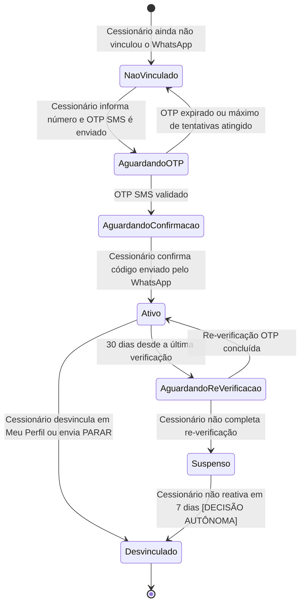

# 🔗 Regras de Negócio — Integrações, Transversais e Consolidação

## Repasse AI · Parte 5 de 5

| **Campo** | **Valor** |
|---|---|
| **Destinatário** | Equipe de Produto e Engenharia |
| **Escopo** | Canal WhatsApp · Vinculação e segurança OTP · Notificações proativas · LGPD · Referências cruzadas · Backlog consolidado · Changelog |
| **Módulo** | Repasse AI |
| **Parte** | Parte 5 de 5 — Integrações, Transversais e Consolidação |
| **Versão** | v1.1 |
| **Responsável** | Claude Code Desktop |
| **Data da versão** | 2026-03-22 (America/Fortaleza) |
| **Continuidade** | RN-039 (Parte 01.4) |
| **Origem do arquivo de entrada** | 01 - Regras de Negócios.md |

---

> 📌 **TL;DR**
>
> - Este arquivo cobre as integrações externas (WhatsApp via EvolutionAPI), as regras transversais de privacidade (LGPD), as notificações proativas e a consolidação de referências, backlog e changelog.
> - O canal WhatsApp é a Fase 2 do produto — não deve ser iniciado antes que os critérios de prontidão do webchat sejam atingidos.
> - A segurança da vinculação WhatsApp↔perfil é crítica: um número de WhatsApp comprometido equivale a um segundo fator de acesso ao perfil do Cessionário.
> - Todo consentimento de uso de dados e toda regra de exclusão estão consolidados nesta parte.
> - A numeração RN continua a partir de RN-040.

---

## 🔗 1. Módulo: Canal WhatsApp (Fase 2)

### 1.1 Objetivo do módulo

Expandir o acesso ao Repasse AI para o WhatsApp Business, mantendo todas as capacidades de análise do webchat e adicionando alertas proativos, para Cessionários que preferem o canal de mensagens instantâneas.

### 1.2 Atores envolvidos

- Cessionário (usa o canal e consente com a vinculação)
- Repasse AI (opera com as mesmas capacidades do webchat, com adaptações de formato)
- EvolutionAPI (infraestrutura de integração com WhatsApp Business)
- Admin (monitora e configura o canal)

### 1.3 Objeto principal

**Vinculação WhatsApp** — associação entre um número de WhatsApp e o perfil do Cessionário na plataforma.

### 1.4 Estados da vinculação WhatsApp

### 1.5 Critérios para iniciar a Fase 2

A Fase 2 só deve ser iniciada quando **todos** os seguintes critérios forem atendidos simultaneamente:

| **Critério** | **Meta** |
|---|---|
| Utilização semanal do webchat | ≥ 30% dos Cessionários ativos |
| CSAT do webchat | ≥ 4,0 / 5 |
| EvolutionAPI integrada e testada em staging | Concluído |
| Fluxo de vinculação WhatsApp↔perfil validado | Concluído |

---

**RN-040: Vinculação do número de WhatsApp ao perfil do Cessionário**

> Origem: seção 6.2 e 11.7 do arquivo de entrada

1. O Cessionário acessa Meu Perfil > WhatsApp e informa seu número de WhatsApp.
2. O sistema verifica se o número informado é um número de WhatsApp válido e se não está vinculado a outro perfil.
3. **Se o número é válido e não está vinculado a outro perfil:** o sistema envia um OTP de 6 dígitos para o número informado via SMS. O Cessionário tem 15 minutos para inserir o OTP na plataforma. [DECISÃO AUTÔNOMA — prazo de 15 minutos adotado como padrão de mercado para OTP. Alternativa descartada: 5 minutos, que pode ser insuficiente em casos de lentidão de entrega de SMS.]
4. **Se o número já está vinculado a outro perfil:** o sistema exibe: "Este número já está associado a outra conta. Se acredita que há um erro, entre em contato com o suporte." A mensagem inclui link clicável "entre em contato com o suporte" que direciona ao canal de suporte da plataforma. O campo de número permanece preenchido para que o Cessionário possa confirmar o que digitou. [CORRIGIDO: PROBLEMA-053]
5. **Se o número informado não é um número de WhatsApp válido:** o sistema exibe: "O número informado não parece ser válido. Verifique o DDD e tente novamente." A validação é feita em tempo real conforme o Cessionário digita (validação de formato DDD+número após perda de foco do campo). O erro é exibido inline abaixo do campo de input, em cor de alerta. O campo de número aplica máscara de formatação automática: (XX) XXXXX-XXXX. [CORRIGIDO: PROBLEMA-054] [DECISÃO APLICADA: DEC-016 — validação em tempo real com máscara foi preferida a validação apenas no submit, pois reduz erros de digitação e melhora a experiência de preenchimento.]
6. **Efeito no estado:** vinculação passa de NaoVinculado para AguardandoOTP.
7. **Consequência se violada:** vinculação sem verificação permite que um número de WhatsApp de terceiro seja associado ao perfil do Cessionário.

---

**RN-041: Validação do OTP de vinculação (SMS)**

> Origem: seção 11.7 do arquivo de entrada

1. O sistema enviou o OTP de 6 dígitos por SMS (conforme RN-040).
2. O Cessionário insere o OTP na plataforma.
3. **Se o OTP está correto e dentro do prazo de 15 minutos:** o sistema avança para a segunda etapa da vinculação (RN-042).
4. **Se o OTP está incorreto:** o sistema registra a tentativa e exibe: "O código informado não está correto. Verifique o SMS e tente novamente." O campo de OTP é limpo automaticamente após erro para facilitar nova digitação. O número de tentativas restantes é exibido abaixo do campo: "Você tem [N] tentativas restantes." [CORRIGIDO: PROBLEMA-055]
   - Limite: 3 tentativas por hora.
   - Se as 3 tentativas forem esgotadas em 1 hora: o sistema bloqueia por 30 minutos e exibe: "Você excedeu o número de tentativas permitidas. Aguarde 30 minutos para tentar novamente." O campo de OTP e o botão de reenvio ficam desabilitados durante o bloqueio. Um contador regressivo (mm:ss) é exibido indicando quando o Cessionário poderá tentar novamente. [CORRIGIDO: PROBLEMA-056]
5. **Se o OTP expirou (mais de 15 minutos):** o sistema exibe: "O código expirou. Solicite um novo código para continuar." O Cessionário pode solicitar reenvio do SMS. O botão "Reenviar código" fica visível e ativo. Após o reenvio, o botão fica desabilitado por 60 segundos com contador regressivo "Reenviar em [ss]s" para evitar spam de SMS. [CORRIGIDO: PROBLEMA-057] [DECISÃO APLICADA: DEC-017 — cooldown de 60 segundos para reenvio de OTP foi adotado como padrão de mercado para evitar abuso de SMS sem prejudicar a experiência do Cessionário.]
6. **Efeito no estado:** após validação bem-sucedida, vinculação avança para AguardandoConfirmacao.
7. **Consequência se violada:** sem limite de tentativas, é possível tentar adivinhar o OTP por força bruta.

---

**RN-042: Segunda etapa da vinculação — confirmação pelo WhatsApp**

> Origem: seção 11.7 do arquivo de entrada

1. O OTP de SMS foi validado com sucesso (conforme RN-041).
2. O sistema envia uma mensagem de boas-vindas ao número de WhatsApp informado, contendo um código de confirmação único.
3. O Cessionário responde à mensagem com o código de confirmação.
4. **Se o código de confirmação está correto:** a vinculação é concluída. O sistema exibe na plataforma: "Seu WhatsApp foi vinculado com sucesso. Agora você pode usar o Analista de Oportunidades pelo WhatsApp." O estado da vinculação passa para Ativo.
5. **Se o Cessionário não responder ao WhatsApp em 24 horas:** a vinculação expira. O estado retorna para NaoVinculado. O sistema exibe na plataforma: "A confirmação pelo WhatsApp não foi concluída. Inicie o processo novamente quando quiser vincular seu WhatsApp."
6. **Efeito no estado:** vinculação passa de AguardandoConfirmacao para Ativo.
7. **Consequência se violada:** sem segunda etapa, um número de WhatsApp pode ser vinculado por qualquer pessoa que tenha acesso ao SMS temporariamente.

---

**RN-043: Re-verificação periódica da vinculação WhatsApp**

> Origem: seção 11.7 do arquivo de entrada

1. O sistema detecta que a vinculação do WhatsApp está ativa há 30 dias sem re-verificação.
2. O sistema envia uma mensagem de re-verificação ao Cessionário via WhatsApp com um novo OTP de 6 dígitos.
3. **Se o Cessionário insere o OTP correto em até 48 horas:** a re-verificação é concluída. Estado permanece Ativo. [DECISÃO AUTÔNOMA — prazo de 48 horas adotado para re-verificação, considerando que o Cessionário pode não verificar o WhatsApp diariamente. Alternativa descartada: 24 horas, considerada restritiva demais para o perfil do usuário.]
4. **Se o Cessionário não responder em 48 horas:** o estado da vinculação passa para Suspenso. O acesso ao agente via WhatsApp é bloqueado até que o Cessionário complete a re-verificação.
5. **Mensagem exibida ao Cessionário em estado Suspenso:** "Sua verificação de segurança está pendente. Para continuar usando o Analista de Oportunidades pelo WhatsApp, acesse Meu Perfil > WhatsApp > Re-verificar."
6. **Efeito no estado:** vinculação passa de Ativo para AguardandoReVerificacao; depois para Suspenso se não concluído.
7. **Consequência se violada:** sem re-verificação periódica, um número de WhatsApp roubado ou transferido continua tendo acesso ao agente indefinidamente.

---

**RN-044: Desvinculação do WhatsApp**

> Origem: seção 11.7 do arquivo de entrada

1. O Cessionário solicita a desvinculação do WhatsApp.
2. O Cessionário pode desvincular de duas formas:
   - **Forma 1:** Acessar Meu Perfil > WhatsApp > Desvincular na plataforma.
   - **Forma 2:** Enviar o comando `PARAR` no chat do WhatsApp (conforme exigência de opt-out da LGPD).
3. **Em qualquer forma:** o sistema desvincula o número imediatamente. Na Forma 1 (via plataforma), o sistema exibe modal de confirmação antes de desvincular: "Ao desvincular, você deixará de receber alertas e análises pelo WhatsApp. Deseja continuar?" com botões "Cancelar" e "Desvincular". Na Forma 2 (via comando PARAR no WhatsApp), a desvinculação é imediata sem confirmação adicional, conforme exigência de opt-out da LGPD. [CORRIGIDO: PROBLEMA-058] [DECISÃO APLICADA: DEC-018 — confirmação na plataforma mas não no WhatsApp foi adotada porque o opt-out via WhatsApp deve ser imediato por exigência legal, enquanto na plataforma a confirmação previne desvinculação acidental.]
4. O sistema exibe na plataforma (se via Meu Perfil): "Seu WhatsApp foi desvinculado. Você pode vincular um novo número a qualquer momento."
5. **Se via comando PARAR no WhatsApp:** o agente responde no WhatsApp: "Seu número foi desvinculado. Você não receberá mais mensagens por este canal. Para reativar, acesse a plataforma."
6. **Efeito no estado:** vinculação passa de Ativo ou Suspenso para Desvinculado imediatamente.
7. **Consequência se violada:** impossibilidade de desvinculação imediata configura descumprimento do direito de opt-out da LGPD.

---

**RN-045: Bloqueio de OTP por falhas consecutivas**

> Origem: seção 11.7 do arquivo de entrada

1. O sistema detecta 5 tentativas de OTP incorretas consecutivas para o mesmo número de WhatsApp.
2. O sistema bloqueia temporariamente qualquer nova tentativa de vinculação para aquele número por 30 minutos.
3. O sistema exibe: "Por segurança, o processo foi temporariamente bloqueado. Aguarde 30 minutos para tentar novamente."
4. **Após 30 minutos:** o bloqueio é encerrado automaticamente e o Cessionário pode reiniciar o processo.
5. **Efeito no estado:** vinculação permanece em NaoVinculado ou AguardandoOTP durante o bloqueio.
6. **Consequência se violada:** sem bloqueio por falhas consecutivas, ataques de força bruta contra o OTP são possíveis.

---

## 🔗 2. Módulo: WhatsApp — Capacidades e Limitações

### 2.1 Objetivo do módulo

Definir o que o agente pode e não pode fazer no canal WhatsApp em relação ao webchat, garantindo paridade de capacidades analíticas com adaptações para as limitações do canal de mensagens de texto.

---

**RN-046: Capacidades do agente no canal WhatsApp**

> Origem: seção 6.2 do arquivo de entrada

1. O Cessionário envia uma mensagem ao agente via WhatsApp após vincular seu número (conforme RN-040 a RN-042).
2. O sistema verifica se o Cessionário tem uma vinculação Ativa e se os dados sensíveis solicitados requerem verificação ativa.
3. **Se a vinculação está Ativa e os dados são não sensíveis:** o agente responde com as mesmas capacidades do webchat (análise, comparação, cálculos, suporte operacional).
4. **Se os dados solicitados são sensíveis (valores de Escrow, comissões específicas):** o agente só os exibe após confirmar que a verificação de identidade está ativa.
5. **Limitações exclusivas do canal WhatsApp** (não presentes no webchat):
   - Sem gráficos interativos — o agente substitui por tabelas formatadas em texto.
   - Sem botões de ação direta — o agente redireciona para a plataforma com link quando uma ação precisa ser executada (ex: submeter proposta).
6. **Rate limit no WhatsApp:** 20 mensagens por hora por Cessionário. Ao atingir o limite: "Você atingiu o limite de 20 mensagens por hora. Você poderá enviar a próxima mensagem em [tempo restante]."
7. **Efeito no estado:** todas as interações via WhatsApp são registradas no mesmo histórico de conversa do Cessionário (consolidado com o webchat). [DECISÃO AUTÔNOMA — histórico unificado entre canais foi adotado para permitir continuidade de análise iniciada no webchat e retomada no WhatsApp. Alternativa descartada: históricos separados por canal, que criaria fragmentação de contexto.]
8. **Consequência se violada:** sem paridade de capacidades, o canal WhatsApp não cumpre a proposta de valor da Fase 2.

---

## 🔗 3. Módulo: Notificações Proativas

### 3.1 Objetivo do módulo

Alertar o Cessionário proativamente sobre eventos relevantes — novas oportunidades compatíveis com seu perfil, prazos de Escrow e mudanças de status — sem que ele precise consultar a plataforma ativamente.

### 3.2 Atores envolvidos

- Cessionário (recebe notificações com opt-in)
- Repasse AI (gera e dispara as notificações)
- Sistema de notificações da plataforma (canal de entrega)

### 3.3 Objeto principal

**Alerta proativo** — mensagem disparada pelo agente sem ação iniciada pelo Cessionário.

---

**RN-047: Alerta de nova oportunidade compatível com o perfil**

> Origem: seção 4.4 e referência NOT-CES-13 do arquivo de entrada

1. Uma nova oportunidade é publicada no marketplace.
2. O sistema verifica se a oportunidade é compatível com o perfil de investimento de algum Cessionário com alertas ativos.
3. **Se há Cessionários com perfil compatível e com alertas habilitados:** o agente dispara uma notificação para cada Cessionário elegível com: código OPR, Δ estimado, score de risco e link para ver a oportunidade na plataforma.
4. **Canais de disparo:** webchat (bolha de notificação no FAB com badge numérica de alertas não lidos) e, se vinculado, WhatsApp (com opt-in ativo). A notificação no webchat é exibida como mensagem do agente no chat quando o Cessionário abrir a conversa, com formatação compacta (card com código OPR, Delta e score de risco) e botão "Ver oportunidade". [CORRIGIDO: PROBLEMA-059]
5. **Se o Cessionário não tem alertas habilitados:** nenhuma notificação é enviada — o sistema só recomenda novas oportunidades quando o Cessionário abre o chat ativamente. A seção de configuração de alertas em Meu Perfil > Notificações exibe o estado atual de cada tipo de alerta com toggle on/off, e descrição curta do que cada alerta faz. [CORRIGIDO: PROBLEMA-060]
6. **Efeito no estado:** notificação registrada no histórico de conversas do Cessionário.
7. **Consequência se violada:** sem alertas proativos, o Cessionário pode perder oportunidades de alta relação retorno/risco antes de vê-las.

---

**RN-048: Alerta de prazo de Escrow**

> Origem: seção 6.2 do arquivo de entrada

1. O sistema detecta que o prazo de depósito em Escrow de uma negociação ativa está se aproximando.
2. **Regra de disparo:** o alerta é enviado quando restam 2 dias úteis para o vencimento do prazo de depósito.
3. **O alerta inclui:** código da negociação, valor a depositar, data de vencimento e link para acessar a negociação.
4. **Canal de disparo:** webchat (bolha de notificação) e WhatsApp (se vinculado e com opt-in ativo).
5. **Se o Cessionário já realizou o depósito antes do alerta:** o alerta não é disparado.
6. **Efeito no estado:** alerta registrado no histórico de conversa.
7. **Consequência se violada:** sem alerta de prazo, o Cessionário pode perder o prazo de depósito, resultando em cancelamento automático da negociação e perda da oportunidade.

---

**RN-049: Alerta de mudança de status de proposta**

> Origem: seção 6.2 do arquivo de entrada

1. O status de uma proposta do Cessionário é alterado na plataforma (aceite, recusa, contraproposta recebida).
2. O sistema detecta a mudança de status.
3. **O agente dispara notificação para o Cessionário com:** o novo status, o significado em linguagem clara e o próximo passo recomendado.
4. **Canal de disparo:** webchat (bolha de notificação) e WhatsApp (se vinculado e com opt-in ativo).
5. **Efeito no estado:** notificação registrada no histórico de conversa.
6. **Consequência se violada:** sem notificação de status, o Cessionário pode deixar vencer prazos de resposta a contrapropostas ou aceites.

---

**RN-050: Gestão do opt-in de notificações**

> Origem: seção 6.2 do arquivo de entrada

1. O Cessionário pode ativar ou desativar notificações proativas a qualquer momento.
2. As configurações de opt-in estão disponíveis em Meu Perfil > Notificações.
3. **Tipos de notificação configuráveis individualmente:**
   - Alertas de novas oportunidades compatíveis.
   - Alertas de prazo de Escrow.
   - Alertas de mudança de status de proposta.
4. **Se o Cessionário desativa um tipo de notificação:** o sistema para de enviar aquele tipo imediatamente para todos os canais.
5. **Se o Cessionário desvincula o WhatsApp (RN-044):** todos os alertas via WhatsApp são cancelados automaticamente, independente das configurações de opt-in individuais.
6. **Efeito no estado:** preferências de opt-in salvas e aplicadas imediatamente.
7. **Consequência se violada:** enviar notificações sem opt-in configura violação de LGPD e pode resultar em bloqueio do número pelo WhatsApp Business.

---

## 🔗 4. Regras Transversais — LGPD e Privacidade

### 4.1 Objetivo do módulo

Consolidar todas as regras de privacidade, consentimento e gestão de dados do Cessionário no contexto do Repasse AI, garantindo conformidade com a LGPD.

---

**RN-051: Consentimento explícito no primeiro uso do chat**

> Origem: seção 11.8 do arquivo de entrada

1. O Cessionário abre o chat Repasse AI pela primeira vez.
2. Antes de qualquer mensagem ser processada, o sistema exibe um banner de consentimento informando:
   - Que as conversas são armazenadas por 90 dias para melhoria do serviço.
   - Que o Cessionário pode apagar o histórico a qualquer momento em Meu Perfil.
   - Link para a Política de Privacidade completa.
3. **Se o Cessionário aceita:** o sistema registra o consentimento com data, hora e versão da política. O chat é liberado para uso. O banner de consentimento desaparece com animação de slide-up (300ms) e a mensagem de boas-vindas é exibida em seguida (conforme RN-005). [CORRIGIDO: PROBLEMA-061]
4. **Se o Cessionário recusa ou fecha o banner sem aceitar:** o chat é bloqueado para uso e exibe: "Para usar o Analista de Oportunidades, é necessário aceitar o uso de dados. Você pode revisar a política e aceitar quando quiser." O campo de entrada de texto fica desabilitado e o chat exibe apenas o banner de consentimento com botões "Aceitar" e "Ver política de privacidade". O Cessionário pode fechar o chat e voltar a qualquer momento — o banner reaparecerá na próxima abertura. [CORRIGIDO: PROBLEMA-062]
5. **Efeito no estado:** consentimento registrado na conta do Cessionário. A sessão de chat passa de NaoConsentida para Ativa.
6. **Consequência se violada:** armazenar conversas sem consentimento explícito configura violação direta da LGPD, Art. 7.

---

**RN-052: Direito de exclusão de dados — conta encerrada**

> Origem: seção 11.8 do arquivo de entrada

1. O Cessionário solicita o encerramento de sua conta na plataforma.
2. O sistema registra a solicitação com timestamp.
3. O sistema agenda a exclusão do histórico de conversas do Repasse AI em até 48 horas. O Cessionário recebe confirmação imediata: "Sua solicitação foi registrada. O histórico de conversas será excluído em até 48 horas." Se o Cessionário tentar acessar o chat durante o período de exclusão, o sistema exibe: "Sua conta está em processo de encerramento. O acesso ao chat não está disponível." [CORRIGIDO: PROBLEMA-063]
4. **Dados excluídos:** todo o histórico de conversas com o agente.
5. **Dados retidos:** registros financeiros de transações concluídas, retidos pelo prazo legalmente exigido [DEFINIÇÃO PENDENTE — prazo de retenção de dados financeiros de cessão imobiliária. Opção A: 5 anos (prazo prescricional geral do Código Civil Brasileiro). Opção B: 10 anos (prazo para obrigações documentadas em instrumento formal).].
6. **Efeito no estado:** histórico de conversas passa para estado Excluído em até 48 horas após a solicitação.
7. **Consequência se violada:** manter dados após encerramento de conta sem base legal configura violação da LGPD, Art. 15.

---

**RN-053: Anonimização de dados para métricas agregadas**

> Origem: seção 11.8 do arquivo de entrada

1. O histórico de uma conversa atinge 90 dias de retenção ou o Cessionário solicita exclusão.
2. O sistema executa o processo de anonimização antes da exclusão definitiva.
3. **O processo de anonimização:**
   - 3.1. Remove todos os identificadores do Cessionário (nome, CPF, e-mail, número de WhatsApp).
   - 3.2. Mantém apenas dados agregados não identificáveis: tipo de pergunta, categoria de resposta, CSAT médio.
4. **Os dados anonimizados** são usados exclusivamente para métricas internas de qualidade e melhoria do agente — nunca para identificação individual.
5. **Efeito no estado:** dado passa de Ativo para Anonimizado.
6. **Consequência se violada:** uso de dados identificáveis após o prazo de retenção configura violação da LGPD.

---

## 📋 5. Referências Cruzadas

| **Documento** | **Localização** | **Relação com este conjunto de regras** |
|---|---|---|
| Regras de Negócio do Cessionário (RNs CES-IA-01 a CES-IA-03) | Módulo Cessionário / Tech-Docs | Personalidade, capacidades e isolamento do agente — complementares a este documento |
| PRD do Cessionário (RF-CES-060 a RF-CES-064) | Módulo Cessionário / Tech-Docs | Requisitos funcionais, SLA e stack técnica do Repasse AI |
| PRD do Cessionário (RF-CES-076 a RF-CES-079) | Módulo Cessionário / Tech-Docs | Fluxo completo de vinculação WhatsApp↔perfil e segurança OTP |
| Regras de Negócio do Admin | Módulo Admin / Tech-Docs | Supervisão IA, logs, takeover e monitoramento — detalhes complementares à Parte 01.4 |
| Documentação de API do Admin | Módulo Admin / Tech-Docs | Endpoints de listagem de ações e takeover manual para supervisão |
| PRD do Repasse AI (02 - PRD) | Este módulo / Desenvolvimento | Arquitetura, API, QA, UI, segurança avançada e rollout — documento técnico complementar a este conjunto de regras de negócio |
| Guardião do Retorno (spec do Cedente) | Módulo Cedente (spec pendente) | Segundo agente de IA que compartilha a infraestrutura de supervisão — identificado por filtro de nome do agente no painel Admin |

---

## 📋 6. Mapa Completo de RNs — Todos os Arquivos

| **RN** | **Nome** | **Arquivo** | **Origem no arquivo de entrada** |
|---|---|---|---|
| RN-001 | Escopo de dados acessíveis ao agente | 01.1 | IA-SEC-01, seção 5.1 |
| RN-002 | Dados que o agente nunca acessa | 01.1 | IA-SEC-01, seção 5.2 |
| RN-003 | Garantias de execução do isolamento | 01.1 | IA-SEC-01, seção 5.3 |
| RN-004 | Mensagens padrão para dados bloqueados | 01.1 | IA-CAP-02, seção 4 |
| RN-005 | Mensagem de boas-vindas no primeiro acesso | 01.1 | Seção 4.7 |
| RN-006 | Pontos de entrada do chat | 01.1 | Seção 6.1 |
| RN-007 | Autenticação do agente por herança de sessão | 01.1 | Seção 6.1 |
| RN-008 | Sugestões de conversa | 01.1 | Seção 8 |
| RN-009 | Retenção do histórico de conversas | 01.1 | Seções 6.1 e 11.8 |
| RN-010 | Exclusão voluntária do histórico | 01.1 | Seção 11.8 |
| RN-011 | Análise de oportunidade individual pelo agente | 01.2 | IA-CAP-01, seção 4.1 |
| RN-012 | Score de risco da oportunidade | 01.2 | Seção 4.1 e Glossário |
| RN-013 | Cálculo de comissão do comprador | 01.2 | Seção 4.3 e Glossário |
| RN-014 | Cálculo do custo total de Escrow | 01.2 | Seção 4.3 e Glossário |
| RN-015 | Comparação de até 5 oportunidades | 01.2 | Seção 4.2 |
| RN-016 | Simulação de custos para uma proposta | 01.2 | Seção 4.3 e fluxo 7.1 |
| RN-017 | Cálculo de ROI com cenários de investimento | 01.2 | Seções 4.3 e 4.6 |
| RN-018 | Simulação de contraproposta | 01.2 | Seção 4.3 e fluxo 7.2 |
| RN-019 | Simulação de portfólio com múltiplas oportunidades | 01.2 | Seção 4.6 |
| RN-020 | Simulação de impacto de variação de valorização | 01.2 | Seção 4.6 |
| RN-021 | Geração do Top 3 de oportunidades em destaque | 01.2 | Seção 4.4 |
| RN-022 | Resposta a perguntas sobre regras da plataforma | 01.3 | Seção 4.5 |
| RN-022.a | Esclarecimento de prazos e SLAs | 01.3 | Seção 4.5 |
| RN-022.b | Esclarecimento de status de proposta e negociação | 01.3 | Seção 4.5 |
| RN-023 | Funcionamento da Calculadora de Comissão como fallback | 01.3 | Seção 11.3 |
| RN-024 | Desligamento automático do agente por taxa de erro | 01.3 | Seção 9.1 |
| RN-025 | Rate limit de mensagens no webchat | 01.3 | Seção 6.1 |
| RN-026 | Fluxo principal — análise de oportunidade individual | 01.3 | Seção 7.1 |
| RN-027 | Fluxo de simulação de contraproposta em negociação ativa | 01.3 | Seção 7.2 |
| RN-028 | Recusa do agente de submeter proposta em nome do Cessionário | 01.3 | IA-CAP-02, seção 4 |
| RN-029 | Comportamento em caso de latência acima do SLA | 01.3 | Seções 9.1 e 11.5 |
| RN-030 | Monitoramento de interações pelo Admin | 01.4 | IA-SUP-01, seção 9.1 |
| RN-031 | Alertas automáticos de monitoramento | 01.4 | Seção 9.1 |
| RN-032 | Condição de elegibilidade para takeover | 01.4 | IA-SUP-01, seção 9.2 |
| RN-033 | Execução do takeover pelo Admin | 01.4 | IA-SUP-01, seção 9.2 |
| RN-034 | Métricas disponíveis no Dashboard do Admin | 01.4 | IA-SUP-01, seção 9.3 |
| RN-035 | Configuração do threshold de confiança para takeover | 01.4 | Seções 9.2 e Glossário |
| RN-036 | Disponibilidade 24/7 com dependência de API externa | 01.4 | Seção 6.1 |
| RN-037 | Isolamento de acesso antes da ativação do modelo de IA | 01.4 | Seção 11.1 |
| RN-038 | Cobertura do agente para cenários de recusa | 01.4 | Seção 11.2 |
| RN-039 | Supervisão Admin funcional antes do lançamento | 01.4 | Seção 11.4 |
| RN-040 | Vinculação do número de WhatsApp ao perfil | 01.5 | Seções 6.2 e 11.7 |
| RN-041 | Validação do OTP de vinculação (SMS) | 01.5 | Seção 11.7 |
| RN-042 | Segunda etapa da vinculação — confirmação pelo WhatsApp | 01.5 | Seção 11.7 |
| RN-043 | Re-verificação periódica da vinculação WhatsApp | 01.5 | Seção 11.7 |
| RN-044 | Desvinculação do WhatsApp | 01.5 | Seção 11.7 |
| RN-045 | Bloqueio de OTP por falhas consecutivas | 01.5 | Seção 11.7 |
| RN-046 | Capacidades do agente no canal WhatsApp | 01.5 | Seção 6.2 |
| RN-047 | Alerta de nova oportunidade compatível com o perfil | 01.5 | Seções 4.4 e 6.2 |
| RN-048 | Alerta de prazo de Escrow | 01.5 | Seção 6.2 |
| RN-049 | Alerta de mudança de status de proposta | 01.5 | Seção 6.2 |
| RN-050 | Gestão do opt-in de notificações | 01.5 | Seção 6.2 |
| RN-051 | Consentimento explícito no primeiro uso do chat | 01.5 | Seção 11.8 |
| RN-052 | Direito de exclusão de dados — conta encerrada | 01.5 | Seção 11.8 |
| RN-053 | Anonimização de dados para métricas agregadas | 01.5 | Seção 11.8 |

**Total: 53 RNs (incluindo sub-regras RN-022.a e RN-022.b)**

---

## 📋 7. Backlog Consolidado

> Itens de backlog identificados durante a reescrita deste conjunto de regras. Todo item marcado como [DEFINIÇÃO PENDENTE] ou que requer decisão fora do escopo deste documento está listado aqui.

| **ID** | **Tipo** | **Descrição** | **Impacto** | **Responsável sugerido** |
|---|---|---|---|---|
| BKL-001 | Definição Pendente | Prazo de análise de KYC não especificado no arquivo de entrada (RN-022.a). Opção A: 2 dias úteis. Opção B: 5 dias úteis. | Médio — afeta expectativa do Cessionário em onboarding | Produto + Operações |
| BKL-002 | Definição Pendente | Prazo de retenção de dados financeiros de cessão imobiliária após encerramento de conta (RN-010, RN-052). Opção A: 5 anos (Art. 206 CC). Opção B: 10 anos (Art. 205 CC). | Alto — impacto jurídico direto | Jurídico |
| BKL-003 | Especificação Pendente | Status específicos de proposta e negociação na plataforma Repasse Seguro não estão definidos neste documento (RN-022.b). Precisam ser importados do documento de RNs do módulo Cessionário para completar a cobertura do suporte operacional. | Médio — afeta completude do suporte operacional | Produto |
| BKL-004 | Especificação Pendente | Spec completa do Guardião do Retorno (agente de IA do Cedente) ainda não disponível. Quando disponível, verificar compatibilidade com a infraestrutura de supervisão compartilhada descrita na Parte 01.4. | Baixo (Fase 2+) | Produto |
| BKL-005 | Validação Técnica | Benchmark de latência com 50 consultas reais em staging para validar SLA de ≤ 5s (seção 11.5). | Alto — pré-requisito de lançamento | Engenharia |
| BKL-006 | Validação Técnica | Implementar e testar 20 perguntas adversariais contra as instruções do agente antes do lançamento (RN-038). | Alto — pré-requisito de lançamento | Produto + QA |
| BKL-007 | Monitoramento | Definir ação automática se mais de 10% dos Cessionários atingirem o rate limit de 20 mensagens/hora no WhatsApp no primeiro mês de Fase 2. Elevar para 30 mensagens/hora se confirmado (seção 11.6). | Baixo (Fase 2) | Produto + Engenharia |
| BKL-008 | Decisão de Produto | Definir se o estado Suspenso da vinculação WhatsApp após não re-verificação resulta em desvinculação automática após 7 dias (conforme decisão autônoma em RN-043) ou se permanece Suspenso indefinidamente aguardando ação do Cessionário. | Médio — afeta retenção de usuários do canal WhatsApp | Produto |
| BKL-009 | Validação Jurídica | Confirmar com jurídico se 90 dias de retenção de histórico de conversas + soft delete (anonimização para métricas) atende ao Art. 15 da LGPD no contexto de plataforma de investimento imobiliário. | Alto — impacto de conformidade | Jurídico |

---

## 📋 8. Conflitos Identificados

Nenhum conflito direto foi identificado entre RNs do arquivo de entrada. As seções do arquivo de entrada são coerentes entre si. Os únicos pontos de ambiguidade foram resolvidos via decisão autônoma ou marcados como definição pendente, conforme listado no Backlog Consolidado acima.

---

## 📋 9. Changelog Consolidado

### 9.1 Changelog do arquivo de entrada (01 - Regras de Negócios.md)

| **Versão** | **Data** | **Alterações** |
|---|---|---|
| v1.7 | 06/03/2026 | Limpeza final de resíduos técnicos. Substituída linguagem técnica remanescente por linguagem de negócio nas seções 5, 9.1, 10, 11.1–11.4 e 12. Tabela IA-CAP-02 atualizada. |
| v1.6 | 06/03/2026 | Auditoria pós-split (13 achados). Removidos código técnico, nomes de banco de dados e métricas de processamento. Atualizado status do OTP na matriz. Limpeza de nomes técnicos de campos. Adicionado cenário de competição entre Cessionários em IA-CAP-02. Referência NOT-CES-13 em 4.4. Nova seção 4.7 (experiência de primeiro uso). |
| v1.5 | 06/03/2026 | Versão inicial pós-split. 12 seções: Visão Geral, Objetivo, Personalidade, Capacidades, Isolamento, Canais, Fluxos, Sugestões, Supervisão, Referências Cruzadas, Perguntas de Validação, Glossário. |

### 9.2 Changelog deste conjunto de documentos reestruturados (01.1 a 01.5)

| **Versão** | **Data** | **Alterações** |
|---|---|---|
| v1.0 | 2026-03-22 | Criação do conjunto de 5 arquivos a partir da reestruturação completa do arquivo de entrada v1.7. 53 RNs geradas, 9 itens de backlog identificados, 0 conflitos, 2 definições pendentes de natureza jurídica. |
| v1.1 | 2026-03-22 | Auditoria UX completa aplicada aos 5 arquivos. 63 problemas identificados e corrigidos em 10 dimensões de UX. 18 decisões autônomas registradas (DEC-001 a DEC-018). Adicionados: estados de interface, feedback visual, micro-interações, acessibilidade, tratamento de exceção visível, fluxos de recuperação e copy de mensagens em todas as RNs auditadas. |

---

## 🔴 10. Edge Cases Transversais

| **Cenário** | **Comportamento esperado** | **RN de referência** |
|---|---|---|
| Cessionário vincula WhatsApp, muda de número e quer vincular novo número | Deve desvincular o número antigo primeiro (RN-044) antes de iniciar nova vinculação | RN-040 |
| Cessionário envia PARAR no WhatsApp por engano | Desvinculação é imediata e irreversível pelo WhatsApp — deve ser refeita pela plataforma | RN-044 |
| Cessionário recusa o banner de consentimento e quer usar o chat depois | Chat continua bloqueado; banner de consentimento reaparece na próxima tentativa de acesso | RN-051 |
| Cessionário usa webchat e WhatsApp simultaneamente na mesma sessão | Histórico é unificado; rate limits são contados separadamente por canal (30/h webchat, 20/h WhatsApp) | RN-046 |
| Notificação de nova oportunidade é disparada mas o Cessionário já tem KYC pendente | Notificação é enviada mas com aviso: "Para fazer proposta, complete sua verificação de identidade primeiro." | RN-047, RN-005 (Parte 01.1) |
| Cessionário recebe alerta de prazo de Escrow mas já realizou o depósito | Alerta não é disparado se o depósito já foi registrado no sistema | RN-048 |

---

*Este é o último arquivo do conjunto. Intervalo total de RNs: RN-001 a RN-053.*
