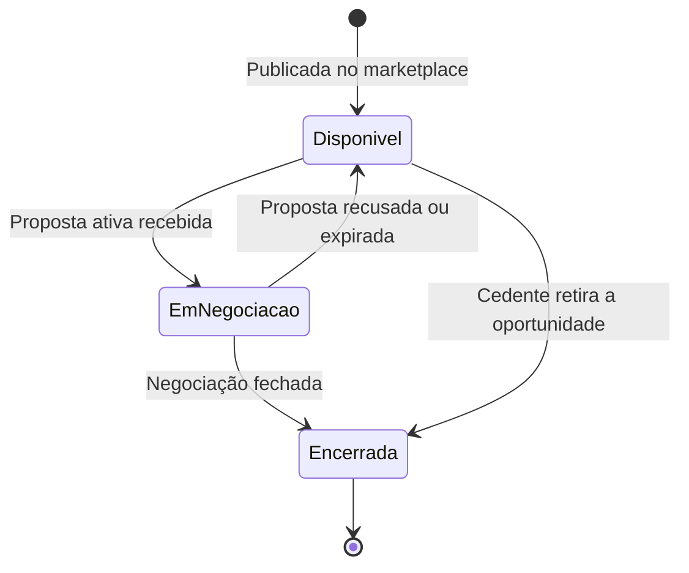
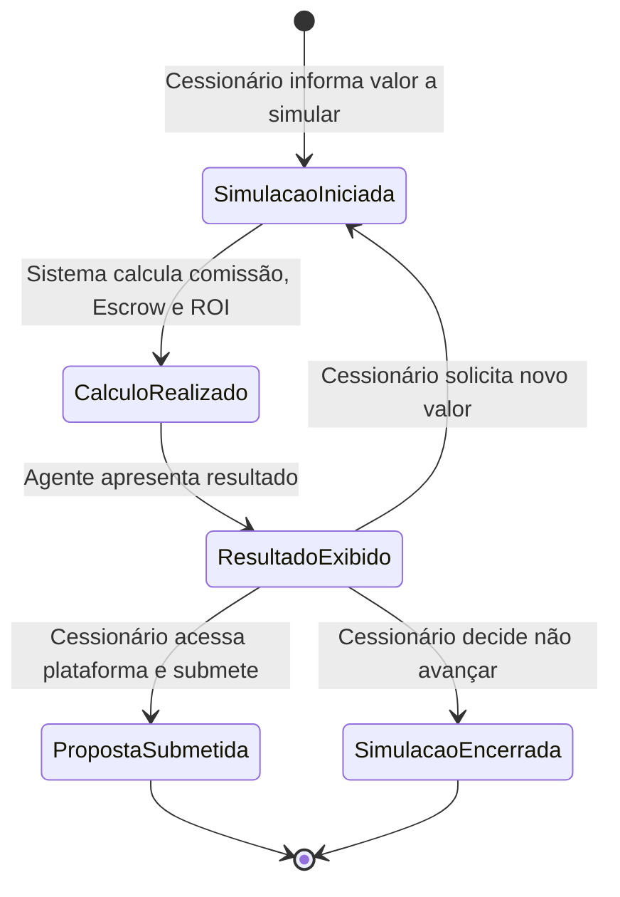

# Repasse AI
## 05.2 — PRD | Requisitos Funcionais — Core e Receita

| Campo | Valor |
|---|---|
| **Destinatário** | Produto e Engenharia |
| **Escopo** | RF-001 a RF-057 — Análise de Oportunidade · Cálculo de Comissão e Escrow · Comparação · Simulação de Propostas/Contrapropostas · Cenários de Investimento · Recomendação Proativa |
| **Módulo** | Repasse AI |
| **Parte** | Parte 2 de 5 — Requisitos Funcionais — Core e Receita |
| **Versão** | v1.1 |
| **Responsável** | Claude Code Desktop |
| **Data** | 22/03/2026 00:00 (America/Fortaleza) |

---

> 📌 **TL;DR**
>
> - Esta parte cobre RF-001 a RF-057, derivados de RN-011 a RN-021 (Parte 01.2 do Doc 01).
> - Módulos cobertos: Análise de Oportunidade Individual, Cálculo de Comissão e Escrow, Comparação de Oportunidades, Simulação de Propostas e Contrapropostas, Cenários de Investimento, Recomendação Proativa.
> - Contém 8 decisões autônomas (DEC-001 a DEC-008 do Doc 01 ratificadas como RFs).
> - Fórmulas de cálculo são determinísticas e independentes do agente de IA.
> - Todo RF deste bloco deriva de pelo menos uma RN da Parte 01.2.

---

## Módulo 1: Análise de Oportunidade Individual

> **Origem:** RN-011, RN-012 (Parte 01.2)

### Máquina de estados da oportunidade

---

**RF-001: Análise completa de oportunidade disponível**
- **Origem:** RN-011 (Parte 01.2)
- **Descrição:** Quando o Cessionário solicita a análise de uma oportunidade disponível no marketplace, o sistema retorna análise estruturada contendo: Δ (Delta em reais), comissão calculada, custo total Escrow, ROI projetado com 3 cenários, score de risco com justificativa, comparativo regional e gráfico/tabela de valorização histórica.
- **Critério de aceite:**
  - Given um Cessionário autenticado com sessão ativa
  - When solicita análise de uma oportunidade com código OPR válido e status Disponível
  - Then o sistema retorna dentro de 5 segundos todos os 7 elementos de análise: Δ, comissão, custo total, ROI (3 cenários), score de risco (1–10 com justificativa), comparativo regional (ou mensagem de indisponibilidade), histórico de valorização (ou mensagem de indisponibilidade)

**RF-002: Apresentação visual do score de risco com 3 faixas de cor**
- **Origem:** RN-011 item 3.5 (Parte 01.2)
- **Descrição:** O score de risco (1–10) é exibido com indicador visual de cor: verde para risco baixo (1–3), amarelo para risco moderado (4–6) e vermelho para risco alto (7–10). O indicador tem contraste mínimo 4.5:1 e rótulo textual para screen readers.
- **Critério de aceite:**
  - Given uma análise de oportunidade retornada pelo agente
  - When o score de risco é calculado
  - Then o indicador visual exibe cor verde para score 1–3, amarelo para 4–6, vermelho para 7–10; contraste ≥ 4.5:1 verificado; rótulo acessível ("Risco baixo/moderado/alto") presente no DOM

**RF-003: Mensagem de indisponibilidade de comparativo regional**
- **Origem:** RN-011 item 3.6 (Parte 01.2)
- **Descrição:** Quando não há dados regionais suficientes para o comparativo, o agente exibe mensagem explícita de indisponibilidade em vez de omitir a seção silenciosamente.
- **Critério de aceite:**
  - Given uma oportunidade sem dados regionais suficientes
  - When o agente executa a análise
  - Then a seção de comparativo regional exibe: "Não há dados suficientes para comparativo regional desta oportunidade no momento." — sem omissão silenciosa

**RF-004: Substituição de gráfico por tabela textual no WhatsApp**
- **Origem:** RN-011 item 3.7 (Parte 01.2)
- **Dependência:** RF-094 (Parte 05.5) — canal WhatsApp não suporta gráficos interativos [CORRIGIDO: PROBLEMA-001]
- **Descrição:** No canal WhatsApp, o gráfico de valorização histórica é substituído por tabela formatada em texto com os pontos de valorização.
- **Critério de aceite:**
  - Given uma análise de oportunidade enviada via canal WhatsApp
  - When o dado de valorização histórica está disponível
  - Then o agente exibe tabela textual formatada com datas e valores de valorização (sem gráfico interativo)

**RF-005: Informação de status "Em negociação" com notificação de retorno**
- **Origem:** RN-011 item 4 (Parte 01.2)
- **Descrição:** Quando uma oportunidade está em negociação com outro Cessionário, o agente informa o status e oferece notificação quando ficar disponível. A identidade do outro Cessionário nunca é revelada.
- **Critério de aceite:**
  - Given um Cessionário que solicita análise de oportunidade com status EmNegociacao
  - When o agente verifica o status
  - Then exibe badge "Em negociação" (cor laranja), informa status e pergunta se quer ser notificado quando ficar disponível; identidade do outro Cessionário não aparece em nenhum campo da resposta

**RF-006: Análise de oportunidade encerrada com sugestões de semelhantes**
- **Origem:** RN-011 item 5 (Parte 01.2)
- **Descrição:** Quando a oportunidade foi encerrada ou removida, o agente informa o status e apresenta até 3 oportunidades semelhantes como chips clicáveis com código OPR.
- **Critério de aceite:**
  - Given um Cessionário que solicita análise de oportunidade com status Encerrada
  - When o agente verifica o status
  - Then exibe badge "Encerrada" (cor cinza) e apresenta até 3 chips de oportunidades semelhantes com código OPR; cada chip é clicável e inicia análise da oportunidade correspondente

**RF-007: Mensagem de oportunidade inexistente no marketplace**
- **Origem:** RN-011 item 6 (Parte 01.2)
- **Descrição:** Quando o código OPR não existe no marketplace, o agente exibe mensagem com ícone de busca (lupa) diferenciando visualmente de mensagem de erro.
- **Critério de aceite:**
  - Given um Cessionário que informa um código OPR que não existe no marketplace
  - When o agente busca a oportunidade
  - Then exibe mensagem "Não encontrei esta oportunidade no marketplace..." com ícone de lupa; sem código de erro HTTP genérico exposto ao usuário

**RF-008: Cálculo e apresentação do score de risco com justificativa**
- **Origem:** RN-012 (Parte 01.2)
- **Descrição:** O score de risco (1–10) é calculado com base nos dados disponíveis da oportunidade e apresentado com lista compacta dos fatores considerados. Quando dados são insuficientes, o score é omitido completamente com mensagem explícita — sem score parcial.
- **Critério de aceite:**
  - Given dados suficientes para calcular o score de risco
  - When o agente calcula o score
  - Then retorna valor 1–10, indicador visual de cor, e lista de fatores considerados em hierarquia visual secundária

  - Given dados insuficientes para calcular o score
  - When o agente tenta calcular o score
  - Then exibe: "Os dados disponíveis desta oportunidade não são suficientes para calcular um score de risco preciso. Recomendo solicitar o dossiê completo antes de decidir." — sem score parcial ou estimado

---

## Módulo 2: Cálculo de Comissão e Escrow

> **Origem:** RN-013, RN-014 (Parte 01.2)
> **Importante:** Cálculos são determinísticos — implementados como módulo independente (Calculadora de Comissão).

### Fórmulas obrigatórias

| Cálculo | Fórmula | Condição |
|---|---|---|
| Comissão padrão | 20% × Δ | Δ > 0 |
| Comissão fallback | 20% × Valor Pago pelo Cedente | Δ ≤ 0 |
| Custo total Escrow | Preço Repasse + Comissão | Sempre |
| ROI projetado | (Tabela Atual − Custo Total) ÷ Custo Total × 100 | Sempre |

---

**RF-009: Cálculo de comissão padrão (Δ > 0)**
- **Origem:** RN-013 item 3 (Parte 01.2)
- **Descrição:** Quando Δ > 0, a comissão é calculada como 20% × Δ. O agente exibe o resultado com separador de milhar e duas casas decimais (ex: R$ 30.000,00), informando a base de cálculo utilizada.
- **Critério de aceite:**
  - Given uma oportunidade com Tabela Atual > Tabela Contrato (Δ > 0)
  - When o agente calcula a comissão
  - Then retorna comissão = 20% × Δ formatada como R$ X.XXX,XX, com texto explicando que a base é o Delta

**RF-010: Cálculo de comissão com fallback (Δ ≤ 0)**
- **Origem:** RN-013 item 4 (Parte 01.2)
- **Descrição:** Quando Δ ≤ 0, a comissão é calculada como 20% × Valor Pago pelo Cedente. O agente exibe nota explicativa sobre o uso da base alternativa.
- **Critério de aceite:**
  - Given uma oportunidade com Tabela Atual ≤ Tabela Contrato (Δ ≤ 0)
  - When o agente calcula a comissão
  - Then retorna comissão = 20% × Valor Pago pelo Cedente com nota: "Como a Tabela Atual não é superior à Tabela Contrato, a comissão é calculada sobre o Valor Pago pelo Cedente."

**RF-011: Bloqueio de aplicação de desconto pelo agente**
- **Origem:** RN-013 item 5 (Parte 01.2)
- **Descrição:** Descontos na comissão são aplicados exclusivamente pelo Admin. O agente nunca aplica desconto sem autorização do Admin registrada na oportunidade.
- **Critério de aceite:**
  - Given um Cessionário que solicita desconto na comissão via chat
  - When o agente processa a solicitação
  - Then recusa a aplicação de desconto e informa que descontos são aplicados pelo time Repasse Seguro; a comissão calculada permanece sem desconto

**RF-012: Cálculo do custo total de Escrow**
- **Origem:** RN-014 (Parte 01.2)
- **Descrição:** Após calcular a comissão, o sistema calcula e exibe o custo total = Preço Repasse + Comissão, discriminando cada componente.
- **Critério de aceite:**
  - Given comissão calculada (RF-009 ou RF-010)
  - When o agente apresenta o custo total
  - Then exibe: "Para esta proposta, o valor total a depositar no Escrow é de R$ [total] — sendo R$ [preço repasse] pelo repasse e R$ [comissão] de comissão." com valores formatados

**RF-013: Recálculo do custo total ao simular valor diferente do de tabela**
- **Origem:** RN-014 item 4 (Parte 01.2)
- **Dependência:** RF-019 (simulação de proposta)
- **Descrição:** Quando o Cessionário simula um valor de proposta diferente do preço de tabela, o sistema recalcula comissão e custo total usando o novo valor como Preço Repasse.
- **Critério de aceite:**
  - Given um Cessionário que informa valor de proposta X diferente do preço de tabela
  - When o agente executa a simulação
  - Then recalcula comissão e Escrow usando X como Preço Repasse e exibe novo custo total discriminado

---

## Módulo 3: Comparação de Oportunidades

> **Origem:** RN-015 (Parte 01.2)

---

**RF-014: Tabela comparativa de 2 a 5 oportunidades**
- **Origem:** RN-015 item 3 (Parte 01.2)
- **Descrição:** O agente monta tabela comparativa com Δ, comissão, custo total Escrow, score de risco, localização e tipologia para cada oportunidade solicitada. A coluna com critério de ranqueamento ativo é destacada visualmente. Cada linha é clicável e abre a análise detalhada da oportunidade.
- **Critério de aceite:**
  - Given um Cessionário que solicita comparação de 2 a 5 oportunidades disponíveis
  - When o agente monta a tabela
  - Then exibe tabela com 6 colunas obrigatórias (Δ, comissão, custo total, score, localização, tipologia); coluna do critério ativo com fundo diferenciado; cada linha clicável abrindo RF-001

**RF-015: Scroll horizontal na tabela comparativa em dispositivos móveis**
- **Origem:** RN-015 item 3 (Parte 01.2)
- **Descrição:** Quando as colunas da tabela comparativa ultrapassam a largura da tela, a tabela exibe scroll horizontal.
- **Critério de aceite:**
  - Given tabela comparativa com 3+ oportunidades em viewport móvel (< 768px)
  - When as colunas ultrapassam a largura disponível
  - Then tabela exibe scroll horizontal sem quebra de layout; todas as colunas acessíveis por scroll

**RF-016: Ranqueamento por critério definido pelo Cessionário**
- **Origem:** RN-015 item 4 (Parte 01.2)
- **Descrição:** Quando o Cessionário define um critério de ranqueamento (melhor retorno, menor risco, menor aporte), o agente ordena a tabela e destaca o primeiro colocado com badge "Melhor opção".
- **Critério de aceite:**
  - Given tabela comparativa gerada com critério de ranqueamento definido
  - When o agente aplica o critério
  - Then tabela ordenada pelo critério; primeiro colocado com badge "Melhor opção" em cor de destaque

**RF-017: Ranqueamento padrão por relação retorno/risco**
- **Origem:** RN-015 item 5 (Parte 01.2)
- **Descrição:** Quando o Cessionário não define critério, o agente ranqueia por melhor relação retorno/risco e informa o critério utilizado.
- **Critério de aceite:**
  - Given tabela comparativa solicitada sem critério explícito
  - When o agente gera a tabela
  - Then tabela ordenada por relação ROI/score de risco; mensagem explica o critério utilizado

**RF-018: Limite de 5 oportunidades por comparação**
- **Origem:** RN-015 item 6 (Parte 01.2)
- **Descrição:** Quando solicitadas mais de 5 oportunidades na comparação, o agente informa o limite e pede refinamento.
- **Critério de aceite:**
  - Given um Cessionário que solicita comparação de 6 ou mais oportunidades
  - When o agente processa a solicitação
  - Then exibe: "Consigo comparar até 5 oportunidades de uma vez. Qual grupo você gostaria de analisar primeiro?" — sem processar nenhuma das 6+

**RF-018.b: Desempate por maior Δ em score de risco igual**
- **Origem:** RN-015 edge case (Parte 01.2)
- **Descrição:** Quando duas oportunidades têm o mesmo score de risco no ranqueamento, o desempate é feito por maior Δ (melhor retorno absoluto).
- **Critério de aceite:**
  - Given duas oportunidades com score de risco idêntico no ranqueamento
  - When o agente aplica o critério de desempate
  - Then a oportunidade com maior Δ absoluto é posicionada acima na tabela

---

## Módulo 4: Simulação de Propostas e Contrapropostas

> **Origem:** RN-016, RN-017, RN-018 (Parte 01.2)

### Máquina de estados da simulação

---

**RF-019: Simulação de custos para valor de proposta informado**
- **Origem:** RN-016 (Parte 01.2)
- **Descrição:** Quando o Cessionário informa um valor de proposta, o agente calcula e exibe comissão, custo total Escrow e ROI com 3 cenários. Encerra com botões de ação "Simular outro valor" e "Ir para a oportunidade".
- **Critério de aceite:**
  - Given um Cessionário que informa valor de proposta numérico positivo
  - When o agente executa a simulação
  - Then retorna em ≤ 5 segundos: comissão calculada, custo total Escrow, ROI com cenários conservador/base/otimista, botões "Simular outro valor" e "Ir para a oportunidade"

**RF-020: Validação de valor de proposta inválido**
- **Origem:** RN-016 item 4 (Parte 01.2)
- **Descrição:** Quando o valor informado não é numérico, é zero ou negativo, o agente exibe mensagem de erro com ícone de atenção. O campo de entrada permanece ativo para nova tentativa imediata.
- **Critério de aceite:**
  - Given um Cessionário que informa valor de proposta zero, negativo ou não numérico
  - When o agente processa a entrada
  - Then exibe mensagem "O valor informado não é válido..." com ícone de triângulo amarelo; campo de entrada ativo para nova tentativa sem reiniciar o fluxo

**RF-021: ROI com três cenários de investimento**
- **Origem:** RN-017 (Parte 01.2)
- **Descrição:** O sistema calcula ROI com três cenários: conservador (valorização −20%), base (valorização conforme marketplace) e otimista (valorização +20%). Cada cenário exibe ROI em percentual e lucro estimado em reais. Aviso obrigatório de projeção presente. Cenário base destacado como referência principal.
- **Critério de aceite:**
  - Given qualquer cálculo que envolva ROI projetado
  - When o agente apresenta os cenários
  - Then exibe 3 cenários lado a lado (empilhados em mobile) com ícones diferenciadores; aviso de projeção visível; não pode ser ocultado; cenário base destacado visualmente como referência

**RF-022: Simulação de contraproposta em negociação ativa**
- **Origem:** RN-018 (Parte 01.2)
- **Descrição:** Quando o Cessionário tem negociação ativa e solicita simulação de contraproposta, o agente calcula nova comissão, novo Escrow, diferença em relação à proposta anterior (com indicador visual seta + cor) e ROI ajustado com 3 cenários.
- **Critério de aceite:**
  - Given um Cessionário com negociação ativa que informa valor de contraproposta
  - When o agente executa a simulação
  - Then retorna nova comissão, novo Escrow, diferença em reais e percentual em relação à proposta anterior (seta verde se economia, seta vermelha se acréscimo), ROI ajustado com 3 cenários

**RF-023: Iterações ilimitadas de simulação na mesma sessão**
- **Origem:** RN-018 item 4 (Parte 01.2)
- **Descrição:** O Cessionário pode simular quantos valores de proposta ou contraproposta quiser na mesma sessão, sem limite de iterações.
- **Critério de aceite:**
  - Given um Cessionário em fluxo de simulação ativo
  - When solicita nova simulação com valor diferente (qualquer número de vezes)
  - Then o agente recalcula para o novo valor sem bloquear ou exigir reinício do fluxo

**RF-024: Recusa de simulação sem negociação ativa para contraproposta**
- **Origem:** RN-018 item 5 (Parte 01.2)
- **Descrição:** Quando o Cessionário solicita simulação de contraproposta sem ter negociação ativa vinculada, o agente informa e oferece simular proposta inicial.
- **Critério de aceite:**
  - Given um Cessionário sem negociação ativa
  - When solicita simulação de contraproposta
  - Then exibe: "Não encontrei uma negociação ativa para simular a contraproposta. Quer que eu simule uma proposta inicial para alguma oportunidade disponível?"

**RF-025: Agente nunca submete proposta em nome do Cessionário**
- **Origem:** RN-028 (Parte 01.3)
- **Descrição:** O agente recusa qualquer solicitação de submissão de proposta em nome do Cessionário, com botão de ação "Ir para a oportunidade". Na segunda insistência, repete com tom empático.
- **Critério de aceite:**
  - Given um Cessionário que pede ao agente para submeter uma proposta
  - When o agente processa a solicitação
  - Then recusa com mensagem explicando que a submissão deve ser feita pelo Cessionário; exibe botão "Ir para a oportunidade" apontando para a tela de submissão da oportunidade em questão; nenhuma proposta é criada no sistema

---

## Módulo 5: Análise de Cenários de Investimento (Portfólio)

> **Origem:** RN-019, RN-020 (Parte 01.2)

---

**RF-026: Simulação de portfólio com múltiplas oportunidades**
- **Origem:** RN-019 (Parte 01.2)
- **Descrição:** Quando o Cessionário informa capital disponível e lista de oportunidades, o agente calcula custo total de Escrow para cada uma, capital total necessário, suficiência do capital, ROI projetado do portfólio e por oportunidade individual.
- **Critério de aceite:**
  - Given um Cessionário que informa capital disponível e 2 ou mais oportunidades disponíveis
  - When o agente executa a análise de portfólio
  - Then retorna para cada oportunidade: custo total Escrow; soma total do portfólio; avaliação de suficiência de capital; ROI projetado do portfólio completo e por oportunidade

**RF-027: Informação de déficit de capital e sugestão de ranqueamento**
- **Origem:** RN-019 item 4 (Parte 01.2)
- **Descrição:** Quando o capital informado é insuficiente para cobrir todas as oportunidades, o agente informa o déficit em destaque visual e sugere ranqueamento das oportunidades que cabem no orçamento com botão "Ranquear por prioridade".
- **Critério de aceite:**
  - Given capital informado pelo Cessionário insuficiente para cobrir todos os Escrows
  - When o agente calcula o portfólio
  - Then exibe déficit em negrito com cor de alerta; lista oportunidades que cabem no orçamento; botão "Ranquear por prioridade" presente

**RF-028: Simulação de impacto de variação de valorização no ROI**
- **Origem:** RN-020 (Parte 01.2)
- **Descrição:** Quando o Cessionário pergunta sobre o impacto de uma variação específica de valorização, o agente recalcula o ROI aplicando a variação à Tabela Atual. Para variações negativas que resultem em ROI negativo (prejuízo), o agente informa claramente o valor de perda estimada.
- **Critério de aceite:**
  - Given um Cessionário que informa variação percentual de valorização (positiva ou negativa)
  - When o agente recalcula o ROI
  - Then exibe ROI ajustado com variação aplicada; se ROI negativo, exibe: "Com uma desvalorização de [X]%, o retorno desta oportunidade seria negativo. O investimento resultaria em uma perda estimada de R$ [valor]." + aviso de projeção obrigatório

---

## Módulo 6: Recomendação Proativa de Oportunidades

> **Origem:** RN-021 (Parte 01.2)

---

**RF-029: Geração do Top 3 de oportunidades em destaque**
- **Origem:** RN-021 (Parte 01.2)
- **Descrição:** Quando o Cessionário acessa o Dashboard ou pergunta "Quais são as melhores oportunidades para mim hoje?", o agente seleciona as 3 oportunidades com melhor relação retorno/risco compatíveis com o perfil do Cessionário, exibindo Δ, comissão estimada, score de risco e localização.
- **Critério de aceite:**
  - Given um Cessionário com perfil de investimento completo e oportunidades disponíveis no marketplace
  - When acessa o Dashboard ou pergunta pelo Top 3
  - Then recebe até 3 oportunidades com Δ, comissão estimada, score de risco e localização, ranqueadas por melhor relação retorno/risco compatível com o perfil

**RF-030: Top 3 genérico quando perfil incompleto**
- **Origem:** RN-021 item 4 (Parte 01.2)
- **Descrição:** Quando o perfil de investimento do Cessionário está incompleto, o agente apresenta Top 3 por melhores retornos gerais com banner informativo indicando que as recomendações são genéricas e link clicável para completar o perfil.
- **Critério de aceite:**
  - Given um Cessionário com perfil de investimento incompleto (sem preferências definidas)
  - When acessa o Top 3
  - Then exibe banner acima do Top 3: "Recomendações baseadas em dados gerais de mercado. Complete seu perfil para resultados personalizados." com link clicável para Meu Perfil > Preferências

**RF-031: Ausência de oportunidades no marketplace — oferta de alertas**
- **Origem:** RN-021 item 5 (Parte 01.2)
- **Dependência:** RF-047 (Parte 05.5) — módulo de notificações proativas
- **Descrição:** Quando não há oportunidades disponíveis, o agente informa e oferece configurar alertas para quando surgirem oportunidades compatíveis.
- **Critério de aceite:**
  - Given ausência de oportunidades no marketplace no momento da consulta
  - When o Cessionário acessa o Top 3
  - Then agente informa indisponibilidade e apresenta opção de configurar alertas; ao clicar, confirma ativação inline sem redirecionamento

---

## Matriz de Rastreabilidade — Módulos Core e Receita

| RN | Descrição | RFs derivados | Coberto? |
|---|---|---|---|
| RN-011 | Análise de oportunidade individual pelo agente | RF-001, RF-002, RF-003, RF-004, RF-005, RF-006, RF-007 | ✅ Sim |
| RN-012 | Score de risco da oportunidade | RF-008 | ✅ Sim |
| RN-013 | Cálculo de comissão do comprador | RF-009, RF-010, RF-011 | ✅ Sim |
| RN-014 | Cálculo do custo total de Escrow | RF-012, RF-013 | ✅ Sim |
| RN-015 | Comparação de até 5 oportunidades | RF-014, RF-015, RF-016, RF-017, RF-018, RF-018.b | ✅ Sim |
| RN-016 | Simulação de custos para uma proposta | RF-019, RF-020 | ✅ Sim |
| RN-017 | Cálculo de ROI com cenários de investimento | RF-021 | ✅ Sim |
| RN-018 | Simulação de contraproposta | RF-022, RF-023, RF-024 | ✅ Sim |
| RN-028 | Recusa do agente de submeter proposta em nome do Cessionário | RF-025 | ✅ Sim |
| RN-019 | Simulação de portfólio com múltiplas oportunidades | RF-026, RF-027 | ✅ Sim |
| RN-020 | Simulação de impacto de variação de valorização | RF-028 | ✅ Sim |
| RN-021 | Geração do Top 3 de oportunidades em destaque | RF-029, RF-030, RF-031 | ✅ Sim |

**Total desta parte: RF-001 a RF-031 (31 requisitos funcionais)**

---

## Changelog

| Data | Versão | Descrição |
|---|---|---|
| 22/03/2026 | v1.0 | Geração inicial — RF-001 a RF-031, módulos Core e Receita |
| 22/03/2026 | v1.1 | Auditoria B03 aplicada — PROBLEMA-001 corrigido: dependência cruzada RF-004 → RF-094 (era RF-046, parte incorreta). |
