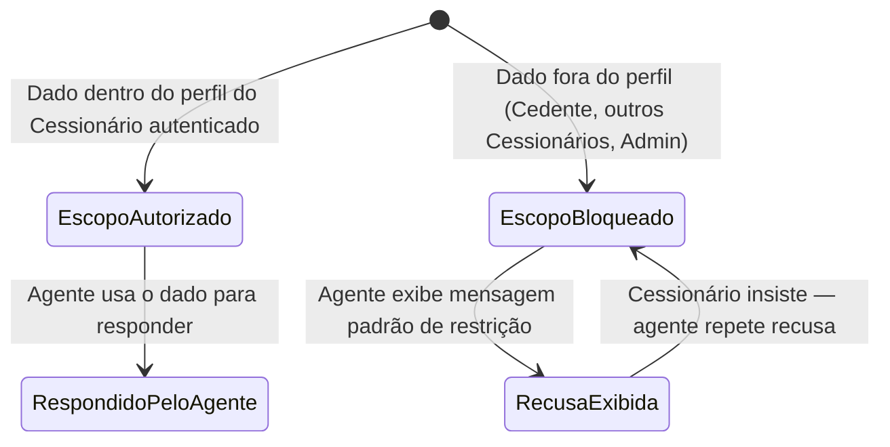
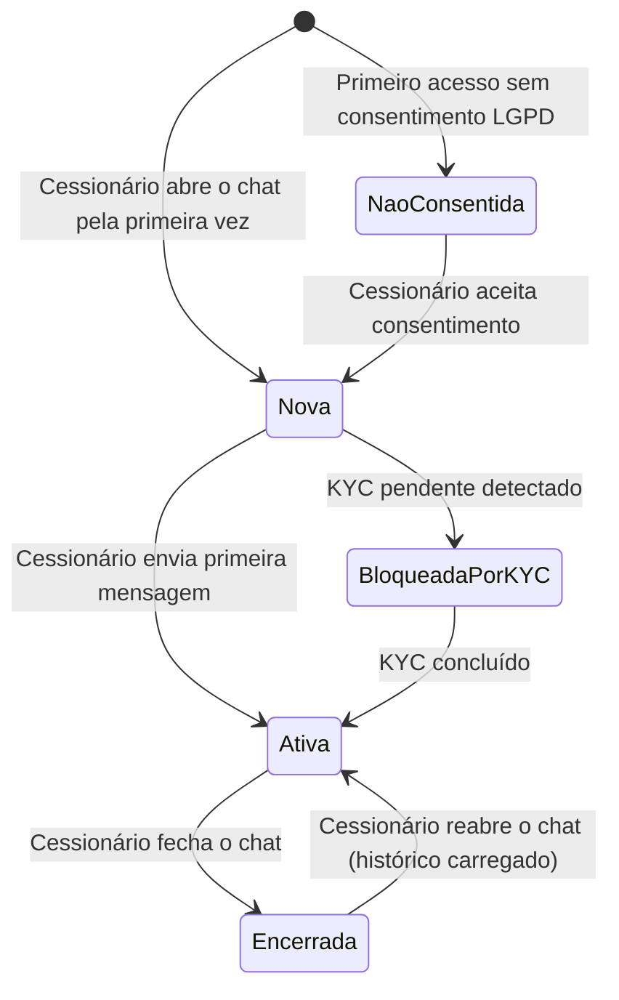
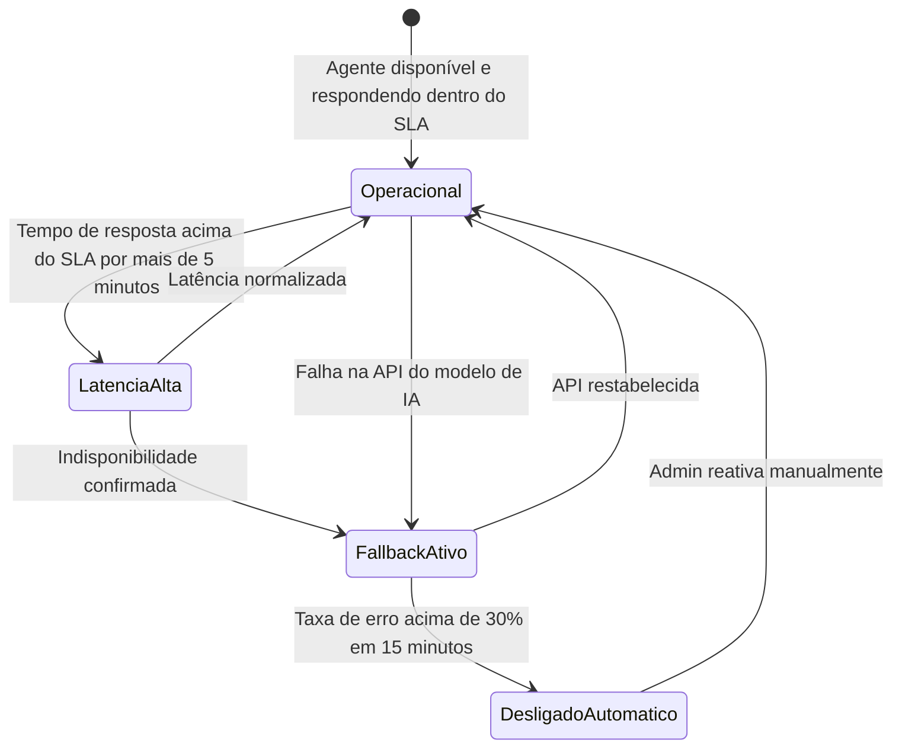

# Repasse AI
## 05.3 — PRD | Requisitos Funcionais — Operação e Suporte

| Campo | Valor |
|---|---|
| **Destinatário** | Produto e Engenharia |
| **Escopo** | RF-032 a RF-065 — Fundação e Acessos · Onboarding · Histórico · Suporte Operacional · Fallback da Calculadora · Rate Limit · Fluxos de Conversação · SLA e Disponibilidade | [CORRIGIDO: PROBLEMA-002]
| **Módulo** | Repasse AI |
| **Parte** | Parte 3 de 5 — Requisitos Funcionais — Operação e Suporte |
| **Versão** | v1.1 |
| **Responsável** | Claude Code Desktop |
| **Data** | 22/03/2026 00:00 (America/Fortaleza) |

---

> 📌 **TL;DR**
>
> - Esta parte cobre RF-032 a RF-090, derivados de RN-001 a RN-010 e RN-022 a RN-029 (Partes 01.1 e 01.3 do Doc 01).
> - Módulos cobertos: Isolamento de Dados (3 camadas), Identidade do Agente, Onboarding, Histórico de Conversas, Suporte Operacional, Fallback da Calculadora, Rate Limit, Fluxos de Conversação, SLA e Disponibilidade.
> - O isolamento de dados (RN-001 a RN-004) é requisito de lançamento — sem ele, o sistema não entra em produção.
> - A Calculadora de Comissão opera independentemente do agente de IA em qualquer circunstância.

---

## Módulo 7: Isolamento de Dados e Segurança

> **Origem:** RN-001, RN-002, RN-003, RN-004 (Parte 01.1)

### Máquina de estados do escopo de dados

---

**RF-032: Filtro de escopo por Cessionário autenticado**
- **Origem:** RN-001, RN-003 item 2.1 (Parte 01.1)
- **Descrição:** Toda consulta de dados ao sistema é filtrada pelo `cessionario_id` do usuário autenticado antes de chegar ao agente. O sistema verifica o escopo autorizado antes de qualquer processamento.
- **Critério de aceite:**
  - Given qualquer request ao agente de IA
  - When o sistema processa a consulta
  - Then o `cessionario_id` validado no JWT é aplicado como filtro em 100% das queries ao banco de dados antes de qualquer dado ser passado ao modelo LLM

**RF-033: Filtro de contexto — dados fora do escopo nunca chegam ao agente**
- **Origem:** RN-003 item 2.2 (Parte 01.1)
- **Descrição:** As informações fornecidas ao agente nunca incluem dados fora do escopo autorizado, mesmo que esses dados existam no banco de dados.
- **Critério de aceite:**
  - Given dados de Cedente, outros Cessionários ou logs internos do Admin existentes no banco
  - When o sistema monta o contexto para o agente LLM
  - Then nenhum desses dados aparece no prompt, contexto RAG ou ferramentas (tools) disponíveis para o agente

**RF-034: Bloqueio de dados restritos com recusa imediata**
- **Origem:** RN-001 item 4, RN-003 item 2.3 (Parte 01.1)
- **Descrição:** Quando o Cessionário solicita dados fora do escopo autorizado, o agente recusa e exibe a mensagem correspondente ao tipo de dado em até 2 segundos, sem indicador de carregamento prolongado.
- **Critério de aceite:**
  - Given um Cessionário que solicita dados bloqueados (dados pessoais do Cedente, outros Cessionários, cenário A/B/C/D, logs Admin)
  - When o agente processa a solicitação
  - Then recusa é exibida em ≤ 2 segundos com a mensagem padrão correspondente ao tipo de dado (conforme tabela RN-004); sem indicador de carregamento prolongado

**RF-035: Mensagens padrão por tipo de dado bloqueado**
- **Origem:** RN-004 (Parte 01.1)
- **Descrição:** O agente exibe mensagem específica para cada tipo de dado bloqueado, conforme tabela definida em RN-004. Inclui 7 categorias de bloqueio.
- **Critério de aceite:**
  - Given um Cessionário que solicita dado de categoria específica bloqueada
  - When o agente processa
  - Then exibe exatamente a mensagem correspondente à categoria conforme tabela RN-004 — sem variação nem criatividade na mensagem de recusa

**RF-036: Escalada progressiva de recusa (insistência do Cessionário)**
- **Origem:** RN-004 item 4 (Parte 01.1)
- **Descrição:** Na segunda insistência sobre dado bloqueado, o agente repete a recusa e exibe sugestões de conversa. Na terceira insistência na mesma sessão, repete a recusa sem adicionar sugestões (prevenindo loop).
- **Critério de aceite:**
  - Given um Cessionário que insiste em solicitar dado bloqueado na mesma sessão
  - When solicita pela segunda vez consecutiva o mesmo dado bloqueado
  - Then agente repete recusa e exibe sugestões de conversa
  - When solicita pela terceira vez na mesma sessão
  - Then agente repete apenas a recusa, sem sugestões adicionais

**RF-037: Modo de recusa total em falha de isolamento**
- **Origem:** RN-003 item 4 (Parte 01.1)
- **Descrição:** Quando qualquer das 3 camadas de isolamento falha, o agente entra em modo de recusa total, exibe mensagem de indisponibilidade temporária com ícone de alerta (triângulo amarelo), e mantém o campo de entrada ativo para nova tentativa.
- **Critério de aceite:**
  - Given falha detectada em qualquer das 3 camadas de isolamento (filtro de escopo, filtro de contexto ou guardrails do prompt)
  - When o sistema detecta a falha
  - Then agente exibe: "O serviço de análise está temporariamente indisponível. Tente novamente em instantes." com ícone de triângulo amarelo; campo de entrada permanece ativo; incidente registrado como prioridade máxima nos logs

---

## Módulo 8: Identidade e Tom de Voz do Agente

> **Origem:** Seção 4 da Parte 01.1

---

**RF-038: Identidade do agente como "Analista de Oportunidades"**
- **Origem:** Seção 4.1 (Parte 01.1)
- **Descrição:** O agente é exibido com o nome "Analista de Oportunidades" na interface do chat, com avatar/ícone padrão do produto. O nome interno do produto é "Repasse AI".
- **Critério de aceite:**
  - Given o agente respondendo ao Cessionário via webchat
  - When uma mensagem do agente é exibida
  - Then o remetente exibido é "Analista de Oportunidades" com avatar do produto; nunca "ChatGPT", "IA", "Bot" ou similar

**RF-039: Padrão de resposta — fundamentação em dados e próximo passo**
- **Origem:** Seção 4.4 (Parte 01.1)
- **Descrição:** Toda resposta do agente é fundamentada em dados ou cálculos concretos e encerra com um próximo passo claro para o Cessionário. Linguagem emocional, urgência artificial, superlativos de venda e garantias de resultado financeiro são proibidos.
- **Critério de aceite:**
  - Given qualquer resposta do agente ao Cessionário
  - When a resposta é gerada
  - Then contém ao menos um dado numérico ou cálculo concreto como fundamento; encerra com próximo passo explícito; não contém frases como "oportunidade imperdível", "melhor do mercado", "garantia de retorno" ou equivalentes

---

## Módulo 9: Onboarding e Pontos de Entrada

> **Origem:** RN-005, RN-006, RN-007, RN-008 (Parte 01.1)

### Máquina de estados da sessão de chat

---

**RF-040: Mensagem de boas-vindas no primeiro acesso com KYC aprovado**
- **Origem:** RN-005 item 3 (Parte 01.1)
- **Descrição:** No primeiro acesso com KYC aprovado e oportunidades disponíveis, o agente exibe mensagem de boas-vindas padrão com animação fade-in de 300ms, nome "Analista de Oportunidades" no cabeçalho do balão, avatar do agente e conversation starters (RF-044).
- **Critério de aceite:**
  - Given Cessionário abrindo o chat pela primeira vez com KYC aprovado e oportunidades disponíveis
  - When o chat é aberto
  - Then exibe mensagem: "Olá! Sou o Analista de Oportunidades. Posso analisar riscos, comparar imóveis e simular retornos para você. Como posso ajudar?" com fade-in de 300ms, seguida pelas sugestões de conversa

**RF-041: Boas-vindas com orientação de KYC pendente**
- **Origem:** RN-005 item 4 (Parte 01.1)
- **Descrição:** Se o KYC está pendente, a mensagem de boas-vindas inclui link clicável para Meu Perfil > Verificação de Identidade. Ao retornar após KYC concluído, o estado atualiza automaticamente sem recarregar o chat.
- **Critério de aceite:**
  - Given Cessionário abrindo o chat com KYC pendente
  - When o chat é aberto
  - Then exibe boas-vindas + orientação com link clicável "Meu Perfil > Verificação de Identidade"; ao retornar com KYC concluído, sugestões completas são exibidas sem reload da página

**RF-042: Ausência de oportunidades — oferta de alertas com botão inline**
- **Origem:** RN-005 item 5 (Parte 01.1)
- **Descrição:** Se não há oportunidades no marketplace, o agente informa e apresenta botão de ação "Ativar alertas" inline. Ao clicar, exibe confirmação inline sem redirecionamento.
- **Critério de aceite:**
  - Given ausência de oportunidades no marketplace
  - When Cessionário abre o chat pela primeira vez
  - Then agente exibe mensagem informando indisponibilidade + botão "Ativar alertas"; ao clicar, confirma: "Alertas ativados. Você será notificado quando surgirem novas oportunidades." sem sair do chat

**RF-043: Ponto de entrada 1 — tela de oportunidade com contexto pré-carregado**
- **Origem:** RN-006 item 3 (Parte 01.1)
- **Descrição:** Quando o Cessionário abre o chat pela tela de uma oportunidade, o sistema carrega automaticamente os dados daquela oportunidade como contexto inicial. Indicador "Carregando dados da oportunidade..." por ≤ 3 segundos. Se falhar, chat abre sem contexto com mensagem informando que o Cessionário deve informar o código OPR.
- **Critério de aceite:**
  - Given Cessionário clicando em "Consultar Analista" na tela de uma oportunidade
  - When o chat abre
  - Then contexto da oportunidade (código OPR, valores, localização) é carregado em ≤ 3 segundos; em caso de falha, exibe: "Não consegui carregar os dados dessa oportunidade automaticamente. Informe o código OPR para eu iniciar a análise."

**RF-044: Ponto de entrada 2 — Dashboard com widget Top 3**
- **Origem:** RN-006 item 4 (Parte 01.1)
- **Descrição:** O Dashboard exibe widget "Oportunidades em Destaque" com as 3 oportunidades recomendadas. Em caso de falha de carregamento, exibe estado vazio com botão "Tentar novamente".
- **Critério de aceite:**
  - Given Cessionário no Dashboard com oportunidades disponíveis
  - When o widget carrega
  - Then exibe até 3 oportunidades recomendadas; se falha, exibe: "Não foi possível carregar as recomendações no momento." + botão "Tentar novamente"

**RF-045: Ponto de entrada 3 — FAB global com badge numérica**
- **Origem:** RN-006 item 5 (Parte 01.1)
- **Descrição:** FAB (Floating Action Button) fixo em todas as telas do módulo Cessionário. Em dispositivos móveis, posicionado no canto inferior direito com margem de 16px e área de toque mínima de 48×48px. Badge numérica exibida quando há alertas proativos não lidos.
- **Critério de aceite:**
  - Given Cessionário em qualquer tela do módulo Cessionário
  - When o FAB é renderizado
  - Then visível em todas as telas; em mobile, posicionado no canto inferior direito com margem ≥ 16px e área de toque ≥ 48×48px; badge numérica exibida quando há alertas não lidos

**RF-046: Autenticação do agente por herança de sessão da plataforma**
- **Origem:** RN-007 (Parte 01.1)
- **Descrição:** O agente herda automaticamente a sessão ativa da plataforma sem exigir novo login. Quando não há sessão ativa, redireciona para tela de login preservando o ponto de entrada original após autenticação bem-sucedida.
- **Critério de aceite:**
  - Given Cessionário autenticado na plataforma que abre o chat
  - When o chat é aberto
  - Then acessa diretamente sem novo login; sessão do chat é vinculada ao JWT da plataforma

  - Given Cessionário sem sessão ativa que tenta abrir o chat
  - When tenta acessar o chat
  - Then é redirecionado para tela de login; após autenticação, retorna ao chat preservando o ponto de entrada original

**RF-047: Banner de sessão expirada com reautenticação**
- **Origem:** RN-007 item 5 (Parte 01.1)
- **Descrição:** Quando a sessão expira durante uma conversa, a próxima mensagem do Cessionário exibe banner temporário no topo do chat com botão "Fazer login". Campo de entrada fica desabilitado até re-autenticação.
- **Critério de aceite:**
  - Given sessão da plataforma expirando durante uma conversa ativa
  - When Cessionário tenta enviar próxima mensagem
  - Then banner exibido no topo: "Sua sessão foi encerrada. Faça login novamente para continuar usando o Analista de Oportunidades." com botão "Fazer login"; campo de entrada desabilitado até re-autenticação

**RF-048: Sugestões de conversa (conversation starters) sem contexto de oportunidade**
- **Origem:** RN-008 item 3 (Parte 01.1)
- **Descrição:** Quando o chat abre sem oportunidade pré-carregada (FAB global ou Dashboard), exibe 4 sugestões padrão como chips clicáveis com área de toque ≥ 44×44px, navegáveis por teclado (Tab + Enter) e com rótulo acessível para screen readers.
- **Critério de aceite:**
  - Given chat aberto via FAB global ou Dashboard sem oportunidade pré-carregada
  - When as sugestões são renderizadas
  - Then exibe exatamente 4 chips: "Quais são as melhores oportunidades para mim hoje?", "Tenho R$ 500.000 para investir. O que recomenda?", "Me explica como funciona a comissão do comprador.", "Qual o prazo para depósito em Escrow?"; área de toque ≥ 44×44px; navegáveis por Tab + Enter; rótulo acessível presente

**RF-049: Sugestões de conversa contextualizadas (oportunidade pré-carregada)**
- **Origem:** RN-008 item 4 (Parte 01.1)
- **Descrição:** Quando o chat abre com oportunidade pré-carregada (entrada pela tela de oportunidade), exibe 4 sugestões contextualizadas relacionadas àquela oportunidade.
- **Critério de aceite:**
  - Given chat aberto com oportunidade pré-carregada
  - When as sugestões são renderizadas
  - Then exibe exatamente 4 chips: "Analise essa oportunidade em detalhes.", "Compare com as 3 melhores da mesma região.", "Quanto preciso depositar no total se propor R$ 300.000?", "Qual o score de risco dessa oportunidade?"

**RF-050: Substituição das sugestões pelo histórico após primeira mensagem**
- **Origem:** RN-008 item 5 (Parte 01.1)
- **Descrição:** Os chips de sugestão são substituídos pelo histórico de mensagens assim que o Cessionário envia a primeira mensagem da sessão.
- **Critério de aceite:**
  - Given chat com chips de sugestão visíveis
  - When Cessionário envia a primeira mensagem
  - Then chips desaparecem e são substituídos pelo histórico de mensagens da sessão; sem reload da página

---

## Módulo 10: Histórico de Conversas

> **Origem:** RN-009, RN-010 (Parte 01.1)

---

**RF-051: Retenção do histórico de conversas por 90 dias**
- **Origem:** RN-009 (Parte 01.1)
- **Descrição:** O sistema armazena o histórico de conversas por 90 dias a partir da data de cada mensagem. Ao reabrir o chat dentro de 90 dias, carrega as 20 mensagens mais recentes com skeleton loading (≤ 3 segundos), com opção "Carregar mensagens anteriores" via scroll infinito para cima.
- **Critério de aceite:**
  - Given Cessionário reabrindo o chat dentro do período de 90 dias
  - When o chat é aberto
  - Then carrega as 20 mensagens mais recentes em ≤ 3 segundos com skeleton loading; link "Carregar mensagens anteriores" disponível no topo; scroll infinito para cima funcional

**RF-052: Expiração silenciosa de mensagens com mais de 90 dias**
- **Origem:** RN-009 item 5 (Parte 01.1)
- **Descrição:** Mensagens com mais de 90 dias são removidas do histórico visível. O histórico simplesmente inicia na mensagem mais antiga dentro do período de retenção, sem banner informando que mensagens foram removidas.
- **Critério de aceite:**
  - Given histórico com mensagens de mais de 90 dias atrás
  - When Cessionário abre o chat
  - Then histórico inicia na mensagem mais antiga dentro dos 90 dias; sem mensagem de aviso sobre expiração; dados expirados anonimizados para métricas agregadas (não apagados definitivamente de imediato)

**RF-053: Consentimento LGPD antes do primeiro uso do chat**
- **Origem:** RN-009 item 6, RN-051 (Partes 01.1 e 01.5)
- **Descrição:** Antes do primeiro uso, o sistema exibe banner de consentimento informando retenção de 90 dias, direito de exclusão e link para Política de Privacidade. O chat só é habilitado após aceite explícito.
- **Dependência:** RF-053 bloqueia acesso ao chat enquanto consentimento não for aceito
- **Critério de aceite:**
  - Given Cessionário abrindo o chat pela primeira vez
  - When o chat é aberto
  - Then banner de consentimento exibido antes de qualquer mensagem ser processada; chat bloqueado até aceite; aceite registrado com data, hora e versão da política; banner desaparece com slide-up 300ms após aceite

**RF-054: Exclusão voluntária do histórico com modal de confirmação**
- **Origem:** RN-010 (Parte 01.1)
- **Descrição:** O Cessionário pode excluir o histórico em Meu Perfil. Modal de confirmação com botão destrutivo diferenciado visualmente (vermelho), sem atalho de teclado Enter. Confirmação exibida como toast de sucesso por 5 segundos. Chat recarregado em estado vazio com sugestões.
- **Critério de aceite:**
  - Given Cessionário acessando Meu Perfil e solicitando exclusão do histórico
  - When o botão de exclusão é clicado
  - Then modal exibido com título "Apagar histórico de conversas", botões "Cancelar" (esquerda) e "Apagar histórico" (destrutivo, vermelho, direita); botão destrutivo não responde a Enter como ação padrão

  - Given Cessionário confirmando a exclusão
  - When o botão destrutivo é acionado
  - Then histórico apagado imediatamente; toast verde "Seu histórico de conversas foi apagado com sucesso." visível por 5 segundos; chat recarregado em estado vazio com sugestões

---

## Módulo 11: Suporte Operacional

> **Origem:** RN-022, RN-022.a, RN-022.b (Parte 01.3)

---

**RF-055: Resposta a perguntas sobre regras da plataforma**
- **Origem:** RN-022 (Parte 01.3)
- **Descrição:** O agente responde perguntas sobre KYC (documentos, prazo, motivos de rejeição), Escrow (o que é, como funciona, prazo de 10 dias úteis, extensão de +5 dias), assinatura eletrônica (Envelope ZapSign), fechamento e status de proposta/negociação. Para perguntas fora do escopo, exibe mensagem de redirecionamento com link clicável.
- **Critério de aceite:**
  - Given Cessionário que pergunta sobre KYC, Escrow, ZapSign, fechamento ou status
  - When o agente processa a pergunta
  - Then retorna resposta objetiva com prazo e próximo passo quando aplicável; em ≤ 5 segundos

**RF-056: Esclarecimento de prazos oficiais da plataforma**
- **Origem:** RN-022.a (Parte 01.3)
- **Descrição:** O agente responde prazos vigentes: depósito Escrow (10 dias úteis), extensão Escrow (+5 dias úteis mediante aprovação do Admin), reversão do Escrow (15 dias corridos). Para prazo de análise de KYC, usa 2 dias úteis como padrão [DECISÃO AUTÔNOMA — prazo padrão para verificação automatizada de KYC no mercado. Se prazo excedido para o Cessionário específico, orienta contato com suporte].
- **Critério de aceite:**
  - Given Cessionário que pergunta sobre prazos específicos da plataforma
  - When o agente responde
  - Then informa: Escrow 10 dias úteis, extensão +5 dias, reversão 15 dias corridos, KYC 2 dias úteis; se prazo do Cessionário excedido, orienta contato com suporte

**RF-057: Esclarecimento de status de proposta e negociação**
- **Origem:** RN-022.b (Parte 01.3)
- **Descrição:** O agente explica o significado de qualquer status de proposta ou negociação exibido na plataforma em linguagem clara, com próximo passo esperado. Se o status não é reconhecido, redireciona ao suporte.
- **Critério de aceite:**
  - Given Cessionário que pergunta sobre significado de um status específico
  - When o agente processa
  - Then retorna definição em linguagem clara e próximo passo esperado; se status desconhecido, exibe: "Não reconheço esse status. Para esclarecer, entre em contato com o suporte via negociação."

---

## Módulo 12: Fallback da Calculadora de Comissão

> **Origem:** RN-023, RN-024 (Parte 01.3)

### Máquina de estados do serviço de IA

---

**RF-058: Cálculos determinísticos independentes do agente de IA**
- **Origem:** RN-023 item 3 e 4 (Parte 01.3)
- **Descrição:** A Calculadora de Comissão executa cálculos de comissão, Escrow e ROI independentemente do estado do agente. Quando o agente está indisponível, retorna o cálculo com banner "Modo básico — sem análise da IA" em cor neutra (cinza/azul claro). Cessionário pode copiar valores e solicitar novo cálculo normalmente.
- **Critério de aceite:**
  - Given agente de IA indisponível (FallbackAtivo)
  - When Cessionário solicita cálculo de comissão, Escrow ou ROI
  - Then Calculadora de Comissão retorna cálculo determinístico em ≤ 2 segundos com banner "Modo básico — sem análise da IA" em cor neutra; valores copiáveis; novo cálculo solicitável sem restart

**RF-059: Monitoramento de taxa de erro e alerta ao Admin**
- **Origem:** RN-024 item 3 (Parte 01.3)
- **Descrição:** Quando a taxa de erros supera 10% em janela de 15 minutos, o sistema dispara alerta automático ao Admin (Slack + painel) e mantém o agente em operação com monitoramento elevado.
- **Critério de aceite:**
  - Given taxa de erros acima de 10% em janela de 15 minutos
  - When o sistema detecta a condição
  - Then alerta disparado para Admin via Slack e painel; agente permanece operacional; condição registrada no log de alertas

**RF-060: Desligamento automático do agente por taxa de erro crítica**
- **Origem:** RN-024 item 4 e 5 (Parte 01.3)
- **Descrição:** Quando a taxa de erros supera 30% em janela de 15 minutos, o agente é desligado automaticamente. Cessionário recebe mensagem de indisponibilidade. A Calculadora de Comissão assume cálculos. Reativação é exclusivamente manual pelo Admin.
- **Critério de aceite:**
  - Given taxa de erros acima de 30% em janela de 15 minutos
  - When o sistema detecta a condição
  - Then agente desligado automaticamente; Cessionário recebe: "O Analista de Oportunidades está temporariamente indisponível. Os cálculos de comissão e Escrow continuam disponíveis. Tente novamente em alguns instantes."; estado passa para DesligadoAutomatico; Admin notificado via Slack + e-mail; reativação exige ação manual do Admin

---

## Módulo 13: Rate Limit

> **Origem:** RN-025 (Parte 01.3)

---

**RF-061: Rate limit de 30 mensagens por hora no webchat**
- **Origem:** RN-025 (Parte 01.3)
- **Descrição:** Quando o Cessionário atinge 30 mensagens em janela deslizante de 1 hora, o campo de entrada é desabilitado (fundo cinza, cursor bloqueado) e botão de envio inativado. Contador regressivo em tempo real (mm:ss) exibido acima do campo. Desbloqueio automático com micro-animação (pulse 500ms) quando a janela avança.
- **Critério de aceite:**
  - Given Cessionário que atingiu 30 mensagens na última hora
  - When tenta enviar nova mensagem
  - Then campo de entrada com fundo cinza e cursor bloqueado; botão de envio inativo; mensagem exibida: "Você atingiu o limite de 30 mensagens por hora. Você poderá enviar a próxima mensagem em [tempo restante]." com contador regressivo mm:ss atualizado a cada segundo

  - Given contador zerado (janela deslizante avançou)
  - When o desbloqueio ocorre automaticamente
  - Then campo de entrada retorna ao estado normal; micro-animação pulse 500ms; contador desaparece

---

## Módulo 14: Fluxos de Conversação

> **Origem:** RN-026, RN-027, RN-028, RN-029 (Parte 01.3)

---

**RF-062: Fluxo principal — análise de oportunidade com proposta**
- **Origem:** RN-026 (Parte 01.3)
- **Descrição:** Fluxo completo: contexto da oportunidade carregado → análise completa → comparativo regional → simulação de valor → próximo passo. Ao decidir fazer proposta, encerra com botão "Ir para a oportunidade". Ao não decidir, oferece salvar alerta.
- **Critério de aceite:**
  - Given Cessionário que abre chat na tela de oportunidade e solicita análise completa
  - When o fluxo é executado
  - Then: análise completa retornada ≤ 5s; simulação disponível para valor informado; botão "Ir para a oportunidade" presente ao decidir; oferta de alerta ao não decidir

**RF-063: Fluxo de simulação de contraproposta em negociação ativa**
- **Origem:** RN-027 (Parte 01.3)
- **Descrição:** O agente identifica a negociação ativa, recebe o valor de contraproposta, calcula e apresenta nova comissão, novo Escrow, diferença e ROI ajustado. Encerra com link para a tela de negociação.
- **Critério de aceite:**
  - Given Cessionário com negociação ativa que informa valor de contraproposta
  - When o agente processa
  - Then retorna nova comissão, novo Escrow, diferença com indicador visual (seta + cor), ROI ajustado 3 cenários; encerra com: "Acesse a tela de negociação para submeter a contraproposta."

---

## Módulo 15: SLA e Disponibilidade do Agente

> **Origem:** RN-029 (Parte 01.3), tabela SLA da seção 5.3

---

**RF-064: Indicador visual "digitando" durante processamento**
- **Origem:** RN-029 item 4 (Parte 01.3)
- **Descrição:** Quando o agente está processando a resposta, exibe indicador de "digitando" (3 pontos pulsando via streaming SSE) no balão do agente, com posição e estilo idênticos a uma mensagem normal.
- **Critério de aceite:**
  - Given qualquer request em processamento pelo agente
  - When o processamento está ativo
  - Then indicador de "digitando" (3 pontos pulsando) exibido no balão do agente em posição e estilo idênticos a uma mensagem normal

**RF-065: Mensagem de latência excessiva com botões de ação**
- **Origem:** RN-029 item 5 (Parte 01.3)
- **Descrição:** Se a resposta não é entregue em 2× o SLA definido (10 segundos para análise individual, 20 para comparativo), exibe mensagem com ícone de relógio e botões "Aguardar" (mantém indicador) e "Tentar novamente" (reenvia última mensagem automaticamente).
- **Critério de aceite:**
  - Given resposta não entregue em 2× o SLA (10s para análise individual, 20s para comparativo)
  - When o timeout é atingido
  - Then exibe mensagem com ícone de relógio; botão "Aguardar" mantém indicador de digitando; botão "Tentar novamente" reenvia automaticamente a última mensagem do Cessionário

---

## Matriz de Rastreabilidade — Módulos Operação e Suporte

| RN | Descrição | RFs derivados | Coberto? |
|---|---|---|---|
| RN-001 | Escopo de dados acessíveis ao agente | RF-032, RF-033, RF-034 | ✅ Sim |
| RN-002 | Dados que o agente nunca acessa | RF-033, RF-034, RF-035 | ✅ Sim |
| RN-003 | Garantias de execução do isolamento | RF-032, RF-033, RF-037 | ✅ Sim |
| RN-004 | Mensagens padrão para dados bloqueados | RF-035, RF-036 | ✅ Sim |
| RN-005 | Mensagem de boas-vindas no primeiro acesso | RF-040, RF-041, RF-042 | ✅ Sim |
| RN-006 | Pontos de entrada do chat | RF-043, RF-044, RF-045 | ✅ Sim |
| RN-007 | Autenticação do agente por herança de sessão | RF-046, RF-047 | ✅ Sim |
| RN-008 | Sugestões de conversa | RF-048, RF-049, RF-050 | ✅ Sim |
| RN-009 | Retenção do histórico de conversas | RF-051, RF-052, RF-053 | ✅ Sim |
| RN-010 | Exclusão voluntária do histórico | RF-054 | ✅ Sim |
| RN-022 | Resposta a perguntas sobre regras da plataforma | RF-055 | ✅ Sim |
| RN-022.a | Esclarecimento de prazos e SLAs | RF-056 | ✅ Sim |
| RN-022.b | Esclarecimento de status de proposta e negociação | RF-057 | ✅ Sim |
| RN-023 | Funcionamento da Calculadora de Comissão como fallback | RF-058 | ✅ Sim |
| RN-024 | Desligamento automático do agente por taxa de erro | RF-059, RF-060 | ✅ Sim |
| RN-025 | Rate limit de mensagens no webchat | RF-061 | ✅ Sim |
| RN-026 | Fluxo principal — análise de oportunidade individual | RF-062 | ✅ Sim |
| RN-027 | Fluxo de simulação de contraproposta em negociação ativa | RF-063 | ✅ Sim |
| RN-028 | Recusa do agente de submeter proposta em nome do Cessionário | RF-025 (Parte 05.2) | ✅ Sim |
| RN-029 | Comportamento em caso de latência acima do SLA | RF-064, RF-065 | ✅ Sim |

**Total desta parte: RF-032 a RF-065 (34 requisitos funcionais)**

---

## Changelog

| Data | Versão | Descrição |
|---|---|---|
| 22/03/2026 | v1.0 | Geração inicial — RF-032 a RF-065, módulos Operação e Suporte |
| 22/03/2026 | v1.1 | Auditoria B03 aplicada — PROBLEMA-002 corrigido: header de escopo corrigido de "RF-032 a RF-090" para "RF-032 a RF-065". |
