# Repasse AI
## 05.4 — PRD | Requisitos Funcionais — Administração e Configuração

| Campo | Valor |
|---|---|
| **Destinatário** | Produto e Engenharia |
| **Escopo** | RF-066 a RF-110 — Supervisão IA · Takeover Manual · Métricas do Admin · Configuração do Agente · Canal Webchat · Critérios de Prontidão |
| **Módulo** | Repasse AI |
| **Parte** | Parte 4 de 5 — Requisitos Funcionais — Administração e Configuração |
| **Versão** | v1.0 |
| **Responsável** | Claude Code Desktop |
| **Data** | 22/03/2026 00:00 (America/Fortaleza) |

---

> 📌 **TL;DR**
>
> - Esta parte cobre RF-066 a RF-110, derivados de RN-030 a RN-039 (Parte 01.4 do Doc 01).
> - Módulos cobertos: Supervisão de Interações (Painel IA), Takeover Manual, Métricas do Dashboard Admin, Configuração do Agente, Canal Webchat, Critérios de Prontidão para Lançamento.
> - O painel de Supervisão IA é requisito de lançamento (RN-039) — sem ele, o produto não vai a produção.
> - O threshold de confiança padrão é 80%, configurável entre 50% e 95% pelo Admin.
> - Esta parte não contém RFs de WhatsApp (Fase 2) — esses ficam na Parte 05.5.

---

## Módulo 16: Supervisão de Interações (Painel Supervisão IA)

> **Origem:** RN-030, RN-031 (Parte 01.4)

### Máquina de estados de uma interação

```mermaid
stateDiagram-v2
    [*] --> RespondidaPelaIA : Agente responde com confiança >= threshold
    [*] --> SinalizadaParaRevisao : Agente responde com confiança < threshold
    SinalizadaParaRevisao --> EmTakeover : Admin inicia takeover
    SinalizadaParaRevisao --> RespondidaPelaIA : Admin nao intervem; agente continua
    RespondidaPelaIA --> Encerrada : Cessionario encerra conversa
    EmTakeover --> Encerrada : Admin encerra takeover
    Encerrada --> [*]
```

---

**RF-066: Listagem de interações no painel de Supervisão IA**
- **Origem:** RN-030 (Parte 01.4)
- **Descrição:** O Admin acessa o painel de Supervisão IA e visualiza lista de todas as interações com: identificação anonimizada do Cessionário (na lista), data e hora, pergunta enviada, resposta gerada, nível de confiança (%), dados utilizados e latência.
- **Critério de aceite:**
  - Given o Admin acessando o painel de Supervisão IA
  - When a lista carrega
  - Then exibe todas as interações com os 7 campos: ID anonimizado do Cessionário, data/hora, pergunta, resposta, % de confiança, dados utilizados, latência em segundos

**RF-067: Estado vazio com sugestão de filtros na lista de interações**
- **Origem:** RN-030 item 3 (Parte 01.4)
- **Descrição:** Quando a lista está vazia para o período selecionado, exibe estado vazio com ícone ilustrativo, texto informativo e sugestão de ajustar período ou filtros.
- **Critério de aceite:**
  - Given lista de interações sem resultados para o período/filtros selecionados
  - When a lista renderiza
  - Then ícone ilustrativo + texto: "Nenhuma interação registrada no período selecionado." + "Tente ajustar o período ou os filtros aplicados." — sem lista vazia sem contexto

**RF-068: Filtros com chips removíveis e loading inline**
- **Origem:** RN-030 item 4 (Parte 01.4)
- **Descrição:** Admin pode filtrar por data, por Cessionário e por nível de confiança. Filtros ativos exibidos como chips removíveis (com "x" individual + botão "Limpar filtros"). Ao aplicar filtro, a lista exibe skeleton loading inline sem substituir a tela inteira.
- **Critério de aceite:**
  - Given Admin aplicando filtro de data, Cessionário ou confiança
  - When o filtro é aplicado
  - Then chips removíveis exibidos acima da lista (ex: "Confiança < 80%", "Último 7 dias"); skeleton loading inline enquanto carrega; botão "Limpar filtros" presente; cada chip removível individualmente

**RF-069: Visualização detalhada de interação individual**
- **Origem:** RN-030 (Parte 01.4)
- **Descrição:** Ao selecionar uma interação na lista, o Admin acessa visão detalhada com identificação completa do Cessionário (não anonimizada), o par pergunta/resposta completo, dados utilizados, confiança, latência e opção de iniciar takeover (quando aplicável).
- **Critério de aceite:**
  - Given Admin que seleciona uma interação na lista
  - When a visualização detalhada abre
  - Then exibe identificação completa do Cessionário, pergunta e resposta completas, dados utilizados, % confiança, latência; botão de takeover habilitado ou estado com explicação

**RF-070: Alertas automáticos de monitoramento**
- **Origem:** RN-031 (Parte 01.4)
- **Descrição:** O sistema monitora continuamente e dispara alertas conforme as condições definidas: latência alta (> SLA por 5 min → Slack + painel), taxa de erro > 10% em 15 min (Slack + e-mail), desligamento automático (Slack + e-mail + painel), CSAT degradado (< 3,5 média 24h → painel + e-mail), taxa de recusa alta (> 20% em 24h → painel), consumo de processamento > 80% do orçamento mensal (e-mail).
- **Critério de aceite:**
  - Given condição de alerta atingida (conforme tabela RN-031)
  - When o sistema detecta a condição
  - Then alerta disparado no canal correto (Slack, e-mail ou painel conforme tabela); timestamp e condição registrados no painel; se múltiplos alertas simultâneos, desligamento automático listado primeiro

---

## Módulo 17: Takeover Manual (Intervenção Humana)

> **Origem:** RN-032, RN-033 (Parte 01.4)

---

**RF-071: Sinalização automática de interações abaixo do threshold**
- **Origem:** RN-032 (Parte 01.4)
- **Descrição:** Quando a confiança de uma resposta do agente fica abaixo do threshold configurado (padrão: 80%), o sistema sinaliza a interação para revisão automaticamente e habilita o botão de takeover para o Admin.
- **Critério de aceite:**
  - Given resposta do agente com confiança abaixo do threshold configurado
  - When o sistema processa a resposta
  - Then interação marcada como "Sinalizada para revisão" na lista; botão de takeover habilitado para o Admin naquela interação

**RF-072: Iniciação do takeover pelo Admin**
- **Origem:** RN-033 (Parte 01.4)
- **Descrição:** O Admin clica em "Assumir conversa" no painel. O sistema registra o takeover com timestamp, motivo e ID do Admin. O Cessionário recebe mensagem imediata com avatar de pessoa (não ícone IA), nome "Equipe Repasse Seguro" e separador visual "Atendimento humano" no chat.
- **Critério de aceite:**
  - Given Admin que clica em "Assumir conversa" em uma interação
  - When o takeover é iniciado
  - Then: registro criado com timestamp, motivo e ID do Admin; Cessionário recebe: "Um analista da equipe Repasse Seguro assumiu essa conversa para ajudá-lo. Como posso ajudar?" com avatar de pessoa; separador visual "Atendimento humano" no chat; agente para de responder automaticamente

**RF-073: Pausa do agente durante takeover ativo**
- **Origem:** RN-033 item 5 (Parte 01.4)
- **Descrição:** Enquanto o takeover está ativo, nenhuma resposta do agente de IA é gerada para aquela sessão. O campo de entrada do Cessionário permanece ativo normalmente.
- **Critério de aceite:**
  - Given conversa com takeover ativo
  - When Cessionário envia mensagem
  - Then mensagem entregue ao Admin (não ao agente); agente não gera nenhuma resposta; campo de entrada ativo

**RF-074: Encerramento do takeover com retomada pelo agente**
- **Origem:** RN-033 item 6 (Parte 01.4)
- **Descrição:** Quando o Admin encerra o takeover, o agente retoma o controle. Cessionário recebe mensagem de transição com separador visual "Analista de Oportunidades" e avatar retorna ao ícone padrão do agente IA.
- **Critério de aceite:**
  - Given Admin encerrando o takeover
  - When o encerramento é confirmado
  - Then Cessionário recebe: "Você está novamente em atendimento com o Analista de Oportunidades."; separador visual "Analista de Oportunidades" exibido no chat; avatar retorna ao ícone do agente IA; agente responde normalmente às próximas mensagens

**RF-075: Bloqueio de takeover concorrente (dois Admins)**
- **Origem:** RN-033 edge case (Parte 01.4)
- **Descrição:** Quando dois Admins tentam fazer takeover da mesma conversa simultaneamente, o primeiro a confirmar assume. O segundo recebe mensagem de bloqueio.
- **Critério de aceite:**
  - Given dois Admins que tentam iniciar takeover da mesma conversa ao mesmo tempo
  - When o segundo Admin confirma o takeover
  - Then segundo Admin recebe: "Esta conversa já está em atendimento por outro analista."; primeiro Admin prossegue com o takeover sem interrupção

---

## Módulo 18: Métricas do Dashboard do Admin

> **Origem:** RN-034 (Parte 01.4)

---

**RF-076: Dashboard de métricas do desempenho do agente**
- **Origem:** RN-034 (Parte 01.4)
- **Descrição:** O Admin visualiza 5 indicadores filtráveis por período (dia, semana, mês): volume de interações, top 10 perguntas mais frequentes, taxa de respostas com recusa, CSAT médio (1–5) e tempo médio de resposta por tipo de interação.
- **Critério de aceite:**
  - Given Admin acessando o Dashboard de métricas
  - When os indicadores carregam
  - Then exibe 5 cards: volume de interações, top 10 perguntas, taxa de recusa %, CSAT médio, latência média; todos filtráveis por dia/semana/mês; dados atualizados em tempo real

**RF-077: Estado de dados insuficientes por indicador (não zero)**
- **Origem:** RN-034 item 3 (Parte 01.4)
- **Descrição:** Quando um indicador não tem dados suficientes para o período selecionado, exibe "Dados insuficientes para o período selecionado" com ícone de informação no espaço do valor. Nunca exibe "0" ou "0%" quando o motivo é ausência de dados.
- **Critério de aceite:**
  - Given período selecionado sem dados suficientes para um indicador específico
  - When o card do indicador renderiza
  - Then exibe "Dados insuficientes para o período selecionado" com ícone de informação no espaço do valor; estrutura do card preservada; nunca "0" quando ausência de dados

---

## Módulo 19: Configuração do Agente

> **Origem:** RN-035 (Parte 01.4)

---

**RF-078: Configuração do threshold de confiança entre 50% e 95%**
- **Origem:** RN-035 (Parte 01.4)
- **Descrição:** O Admin pode ajustar o threshold de confiança para sinalização automática de interações. Valores aceitos: 50% a 95%. O novo valor entra em vigor imediatamente para todas as novas interações.
- **Critério de aceite:**
  - Given Admin acessando Configurações > Supervisão IA
  - When define novo threshold entre 50% e 95%
  - Then valor salvo; novo threshold aplicado imediatamente para novas interações; toast de confirmação: "Nível de supervisão atualizado para [valor]%."

**RF-079: Bloqueio de threshold fora do intervalo válido**
- **Origem:** RN-035 item 4 (Parte 01.4)
- **Descrição:** Quando o Admin tenta definir threshold abaixo de 50% ou acima de 95%, o sistema exibe mensagem de erro inline sem fechar o modal/tela. O valor inválido permanece no campo para correção.
- **Critério de aceite:**
  - Given Admin tentando salvar threshold < 50% ou > 95%
  - When o formulário é submetido
  - Then erro inline: "O nível de supervisão precisa estar entre 50% e 95%. Valores fora desse intervalo podem comprometer a qualidade do atendimento."; modal/tela permanece aberta; valor inválido permanece no campo; nenhuma alteração salva

**RF-080: Registro no log de auditoria de alterações de threshold**
- **Origem:** RN-035 item 5 (Parte 01.4)
- **Descrição:** Cada alteração de threshold é registrada no log de auditoria com valor anterior, novo valor, ID do Admin e timestamp. Histórico de alterações visível nas configurações.
- **Critério de aceite:**
  - Given Admin que salva um novo threshold com sucesso
  - When a alteração é registrada
  - Then log de auditoria contém: valor anterior, novo valor, ID do Admin e timestamp; histórico de alterações exibe: "Alterado de [anterior]% para [novo]% por [Admin] em [data/hora]"

---

## Módulo 20: Canal Webchat — Configuração e Disponibilidade

> **Origem:** RN-036 (Parte 01.4)

---

**RF-081: Disponibilidade 24/7 com dependência da API do modelo de IA**
- **Origem:** RN-036 (Parte 01.4)
- **Descrição:** O chat opera 24/7. Quando a API do modelo de IA está indisponível, o chat exibe mensagem de modo limitado e o FAB global exibe badge amarela indicando status degradado. A Calculadora de Comissão permanece ativa.
- **Critério de aceite:**
  - Given API do modelo de IA indisponível
  - When Cessionário tenta acessar o chat
  - Then chat exibe: "O Analista de Oportunidades está temporariamente indisponível. Os cálculos de comissão e Escrow continuam disponíveis."; FAB global exibe badge de status degradado (cor amarela); Calculadora de Comissão responde normalmente

**RF-082: Badge de status degradado no FAB antes de abrir o chat**
- **Origem:** RN-036 item 4 (Parte 01.4)
- **Descrição:** Quando o agente está em modo degradado (FallbackAtivo ou DesligadoAutomatico), o FAB global exibe badge de cor amarela visível antes de o Cessionário abrir o chat, evitando que descubra a indisponibilidade somente após abrir.
- **Critério de aceite:**
  - Given agente em estado FallbackAtivo ou DesligadoAutomatico
  - When Cessionário visualiza o FAB global
  - Then FAB exibe badge de cor amarela (diferente da badge numérica de alertas); badge visível sem necessidade de interação

---

## Módulo 21: Critérios de Prontidão para Lançamento

> **Origem:** RN-037, RN-038, RN-039 (Parte 01.4)

---

**RF-083: Gate de isolamento de acesso antes da ativação do modelo em produção**
- **Origem:** RN-037 (Parte 01.4)
- **Descrição:** Antes da ativação do modelo de IA em produção, o sistema deve ter verificado e aprovado: filtro de escopo (100% das queries filtradas por `cessionario_id`), filtro de contexto (dados bloqueados ausentes do prompt), e teste de penetração (cenário "Cessionário tenta acessar dados do Cedente" bloqueado em 100% dos casos testados).
- **Critério de aceite:**
  - Given solicitação de ativação do modelo de IA em produção
  - When o gate de prontidão é verificado
  - Then os 3 itens verificados: filtro de escopo ativo para 100% das queries, filtro de contexto validado, teste de penetração passado em 100% dos cenários adversariais; se qualquer item falhar, ativação bloqueada até correção e reteste

**RF-084: Cobertura dos 7 cenários de recusa nas instruções do agente**
- **Origem:** RN-038 (Parte 01.4)
- **Descrição:** As instruções permanentes do agente devem cobrir: identidade e tom de voz, os 7 tipos de dados bloqueados com exemplos de recusa, exemplos de perguntas adversariais e respostas esperadas, e formato de encerramento com próximo passo claro. Testadas com ≥ 20 perguntas adversariais antes do lançamento.
- **Critério de aceite:**
  - Given instruções permanentes do agente submetidas para aprovação de lançamento
  - When o gate de cobertura é verificado
  - Then instruções contêm: identidade + tom, 7 categorias de recusa com exemplos, ≥ 3 exemplos adversariais por categoria com resposta esperada; resultado de ≥ 20 testes adversariais 100% aprovados (zero recusas falhadas)

**RF-085: Gate de supervisão Admin funcional antes do lançamento**
- **Origem:** RN-039 (Parte 01.4)
- **Descrição:** Antes do lançamento, os 4 componentes de supervisão devem estar implementados e testados: registro de interações (pergunta + resposta + confiança + latência), Dashboard de métricas (volume, top perguntas, taxa de recusa, CSAT, latência), alertas automáticos de confiança, e takeover manual com registro de motivo.
- **Critério de aceite:**
  - Given solicitação de autorização de lançamento do Repasse AI
  - When o gate de supervisão é verificado
  - Then os 4 componentes verificados como operacionais: registro de interações ativo, Dashboard com 5 métricas visíveis, alerta de confiança abaixo do threshold disparando corretamente, takeover manual funcional com registro de motivo; se qualquer componente ausente, lançamento bloqueado

---

## Matriz de Rastreabilidade — Módulos Administração e Configuração

| RN | Descrição | RFs derivados | Coberto? |
|---|---|---|---|
| RN-030 | Monitoramento de interações pelo Admin | RF-066, RF-067, RF-068, RF-069 | ✅ Sim |
| RN-031 | Alertas automáticos de monitoramento | RF-070 | ✅ Sim |
| RN-032 | Condição de elegibilidade para takeover | RF-071 | ✅ Sim |
| RN-033 | Execução do takeover pelo Admin | RF-072, RF-073, RF-074, RF-075 | ✅ Sim |
| RN-034 | Métricas disponíveis no Dashboard do Admin | RF-076, RF-077 | ✅ Sim |
| RN-035 | Configuração do threshold de confiança para takeover | RF-078, RF-079, RF-080 | ✅ Sim |
| RN-036 | Disponibilidade 24/7 com dependência de API externa | RF-081, RF-082 | ✅ Sim |
| RN-037 | Isolamento de acesso antes da ativação do modelo de IA | RF-083 | ✅ Sim |
| RN-038 | Cobertura do agente para cenários de recusa | RF-084 | ✅ Sim |
| RN-039 | Supervisão Admin funcional antes do lançamento | RF-085 | ✅ Sim |

**Total desta parte: RF-066 a RF-085 (20 requisitos funcionais)**

---

## Changelog

| Data | Versão | Descrição |
|---|---|---|
| 22/03/2026 | v1.0 | Geração inicial — RF-066 a RF-085, módulos Administração e Configuração |
