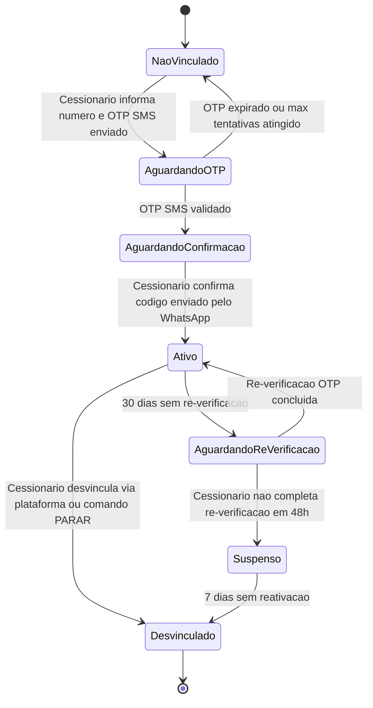
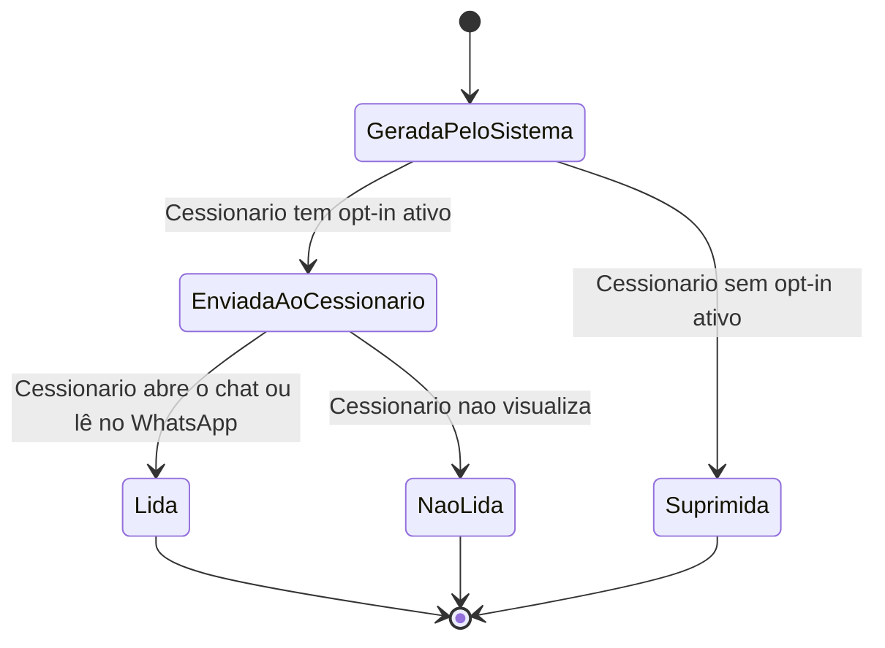

# Repasse AI
## 05.5 — PRD | Requisitos Funcionais — Integrações, RNFs e Consolidação

| Campo | Valor |
|---|---|
| **Destinatário** | Produto e Engenharia |
| **Escopo** | RF-086 a RF-118 — WhatsApp Fase 2 · Notificações Proativas · LGPD · RNFs · Matriz de Rastreabilidade Consolidada · Backlog · Changelog |
| **Módulo** | Repasse AI |
| **Parte** | Parte 5 de 5 — Integrações, RNFs e Consolidação |
| **Versão** | v1.1 |
| **Responsável** | Claude Code Desktop |
| **Data** | 22/03/2026 00:00 (America/Fortaleza) |

---

> **TL;DR**
>
> - Esta parte cobre RF-086 a RF-118, derivados de RN-040 a RN-053 (Parte 01.5 do Doc 01).
> - Módulos cobertos: Canal WhatsApp (Fase 2) — Vinculação OTP, Re-verificação, Desvinculação, Capacidades do agente no WhatsApp; Notificações Proativas; LGPD e Privacidade.
> - Após os requisitos funcionais, estão todos os Requisitos Não Funcionais (RNF-001 a RNF-028).
> - O documento encerra com a Matriz de Rastreabilidade Consolidada, cobrindo todos os 53 RNs mapeados a todos os RFs (RF-001 a RF-118).
> - WhatsApp é Fase 2 — não deve ser iniciado sem os 4 critérios de prontidão do webchat atingidos (seção 1.5 de RN-040).

---

## Módulo 17: Canal WhatsApp — Vinculação OTP (Fase 2)

> **Origem:** RN-040, RN-041, RN-042, RN-045 (Parte 01.5)

### Fluxo de estados da vinculação WhatsApp

---

**RF-086: Início do fluxo de vinculação WhatsApp**
- **Origem:** RN-040 (Parte 01.5)
- **Descrição:** O sistema permite ao Cessionário iniciar a vinculação do WhatsApp em Meu Perfil > WhatsApp. O sistema valida se o número informado é um número de WhatsApp válido e se não está vinculado a outro perfil; em caso de número já vinculado, exibe mensagem de erro com link para suporte; em caso de número inválido, exibe erro inline abaixo do campo com máscara de formatação (XX) XXXXX-XXXX.
- **Critério de aceite:**
  - Given Cessionário em Meu Perfil > WhatsApp
  - When informa número e submete
  - Then se número válido e não vinculado: envia OTP de 6 dígitos via SMS e avança estado para AguardandoOTP; se número já vinculado a outro perfil: exibe "Este número já está associado a outra conta. Se acredita que há um erro, entre em contato com o suporte."; se número inválido: exibe erro inline com instruções de formatação

---

**RF-087: Validação do OTP de vinculação via SMS**
- **Origem:** RN-041 (Parte 01.5)
- **Descrição:** O sistema valida o OTP de 6 dígitos enviado por SMS. O OTP é válido por 15 minutos. Máximo de 3 tentativas incorretas por hora. Após esgotar as 3 tentativas, bloqueia por 30 minutos com contador regressivo visível ao Cessionário.
- **Critério de aceite:**
  - Given Cessionário inserindo OTP no campo
  - When submete o código
  - Then se OTP correto e dentro de 15 min: avança para AguardandoConfirmacao; se incorreto: exibe tentativas restantes abaixo do campo e limpa o campo automaticamente; se 3 tentativas esgotadas em 1 hora: exibe bloqueio de 30 minutos com contador mm:ss; se OTP expirado: exibe opção de reenvio com cooldown de 60 segundos após reenvio

---

**RF-088: Segunda etapa de vinculação — confirmação via WhatsApp**
- **Origem:** RN-042 (Parte 01.5)
- **Descrição:** Após OTP de SMS validado, o sistema envia ao número de WhatsApp informado uma mensagem de boas-vindas com código de confirmação único. O Cessionário responde com o código. A vinculação só é concluída após essa segunda etapa (dupla verificação).
- **Critério de aceite:**
  - Given OTP de SMS validado com sucesso
  - When sistema envia mensagem ao WhatsApp do Cessionário
  - Then se Cessionário responde com o código correto em até 24 horas: vinculação concluída, estado passa para Ativo; se Cessionário não responde em 24 horas: vinculação expira, estado retorna para NaoVinculado com mensagem na plataforma

---

**RF-089: Bloqueio de vinculação por tentativas OTP excessivas**
- **Origem:** RN-045 (Parte 01.5)
- **Descrição:** Após 5 tentativas de OTP incorretas consecutivas para o mesmo número de WhatsApp, o sistema bloqueia qualquer nova tentativa de vinculação para aquele número por 30 minutos. Proteção contra força bruta no fluxo de vinculação.
- **Critério de aceite:**
  - Given 5 tentativas consecutivas de OTP incorretas para o mesmo número
  - When Cessionário tenta nova tentativa
  - Then sistema bloqueia por 30 minutos, exibe "Por segurança, o processo foi temporariamente bloqueado. Aguarde 30 minutos para tentar novamente." e desabilita o campo de OTP e botão de reenvio durante o bloqueio

---

## Módulo 18: Canal WhatsApp — Re-verificação e Desvinculação

> **Origem:** RN-043, RN-044 (Parte 01.5)

**RF-090: Re-verificação periódica da vinculação WhatsApp**
- **Origem:** RN-043 (Parte 01.5)
- **Descrição:** O sistema dispara re-verificação de segurança quando a vinculação está ativa há 30 dias sem nova verificação. O agente envia OTP de 6 dígitos ao número vinculado via WhatsApp. O Cessionário tem 48 horas para inserir o OTP na plataforma. Se não concluir em 48 horas, vinculação passa para estado Suspenso.
- **Critério de aceite:**
  - Given vinculação ativa há 30 dias sem re-verificação
  - When sistema detecta o prazo
  - Then envia OTP via WhatsApp; se Cessionário valida em até 48 horas: estado permanece Ativo; se não valida em 48 horas: estado passa para Suspenso com mensagem "Sua verificação de segurança está pendente. Para continuar usando o Analista de Oportunidades pelo WhatsApp, acesse Meu Perfil > WhatsApp > Re-verificar."

---

**RF-091: Acesso bloqueado no estado Suspenso**
- **Origem:** RN-043 (Parte 01.5)
- **Descrição:** Enquanto a vinculação está no estado Suspenso, o agente não responde a mensagens recebidas via WhatsApp daquele número. Toda mensagem recebida resulta em resposta automática orientando o Cessionário a reativar a vinculação pela plataforma.
- **Critério de aceite:**
  - Given vinculação em estado Suspenso
  - When Cessionário envia mensagem pelo WhatsApp
  - Then agente responde: "Sua verificação de segurança está pendente. Acesse a plataforma em Meu Perfil > WhatsApp > Re-verificar para continuar." Sem processamento de análise.

---

**RF-092: Desvinculação do WhatsApp via plataforma**
- **Origem:** RN-044 (Parte 01.5)
- **Descrição:** O Cessionário pode desvincular o número em Meu Perfil > WhatsApp > Desvincular. O sistema exibe modal de confirmação antes de desvincular. Após confirmação, a desvinculação é imediata. Todos os alertas via WhatsApp são cancelados automaticamente.
- **Critério de aceite:**
  - Given Cessionário em Meu Perfil > WhatsApp
  - When clica em Desvincular
  - Then exibe modal: "Ao desvincular, você deixará de receber alertas e análises pelo WhatsApp. Deseja continuar?" com botões "Cancelar" e "Desvincular"; se confirma: desvinculação imediata, estado para Desvinculado, todos alertas WhatsApp cancelados, exibe "Seu WhatsApp foi desvinculado. Você pode vincular um novo número a qualquer momento."

---

**RF-093: Desvinculação via comando PARAR no WhatsApp**
- **Origem:** RN-044 (Parte 01.5)
- **Descrição:** O Cessionário pode desvincular enviando o comando `PARAR` no chat do WhatsApp. A desvinculação é imediata sem confirmação adicional (exigência de opt-out da LGPD). O agente confirma a desvinculação via WhatsApp.
- **Critério de aceite:**
  - Given Cessionário vinculado enviando mensagem no WhatsApp
  - When envia "PARAR" (case insensitive)
  - Then desvinculação imediata; agente responde no WhatsApp: "Seu número foi desvinculado. Você não receberá mais mensagens por este canal. Para reativar, acesse a plataforma."; estado para Desvinculado; sem modal de confirmação

---

## Módulo 19: Canal WhatsApp — Capacidades do Agente

> **Origem:** RN-046 (Parte 01.5)

**RF-094: Paridade de capacidades analíticas no canal WhatsApp**
- **Origem:** RN-046 (Parte 01.5)
- **Descrição:** O agente no canal WhatsApp oferece as mesmas capacidades analíticas do webchat (análise individual, comparação, cálculos, simulação, portfólio, Top 3, suporte operacional). Adaptações de formato: gráficos interativos são substituídos por tabelas formatadas em texto; ações que requerem a plataforma incluem link direto.
- **Critério de aceite:**
  - Given Cessionário com vinculação Ativa enviando mensagem no WhatsApp
  - When solicita análise de oportunidade
  - Then agente retorna análise completa com mesmas informações do webchat, formatadas em texto rico compatível com WhatsApp; sem gráficos SVG/HTML; dados sensíveis só exibidos com verificação de identidade ativa

---

**RF-095: Rate limit no canal WhatsApp**
- **Origem:** RN-046 (Parte 01.5)
- **Descrição:** O rate limit no canal WhatsApp é de 20 mensagens por hora por Cessionário (menor que o webchat, que é 30/h). Ao atingir o limite, o agente informa o tempo restante até liberar nova mensagem.
- **Critério de aceite:**
  - Given Cessionário enviando mensagens pelo WhatsApp
  - When a 20ª mensagem na hora corrente é processada
  - Then agente responde normalmente à 20ª mensagem; à 21ª mensagem dentro da mesma hora: agente responde "Você atingiu o limite de 20 mensagens por hora. Você poderá enviar a próxima mensagem em [tempo restante formatado hh:mm]."
  - Then os rate limits de webchat (30/h) e WhatsApp (20/h) são contados separadamente por canal

---

**RF-096: Histórico unificado entre canais**
- **Origem:** RN-046 (Parte 01.5)
- **Descrição:** As interações via WhatsApp são registradas no mesmo histórico de conversa do Cessionário, unificado com o webchat. O agente mantém contexto de conversas iniciadas no webchat quando o Cessionário migra para o WhatsApp e vice-versa.
- **Critério de aceite:**
  - Given Cessionário com histórico de conversa no webchat
  - When inicia conversa pelo WhatsApp
  - Then agente reconhece o contexto da última conversa no webchat; histórico consolidado visível no painel de Supervisão IA do Admin com indicação do canal (webchat/WhatsApp) por mensagem

---

## Módulo 20: Notificações Proativas

> **Origem:** RN-047, RN-048, RN-049, RN-050 (Parte 01.5)

### Estados de uma notificação proativa

---

**RF-097: Alerta proativo de nova oportunidade compatível**
- **Origem:** RN-047 (Parte 01.5)
- **Stack:** RabbitMQ 4+ para disparo assíncrono do alerta; Supabase Realtime para notificação em tempo real no webchat; EvolutionAPI para entrega no WhatsApp. [CORRIGIDO: PROBLEMA-005]
- **Descrição:** Quando uma nova oportunidade é publicada, o sistema verifica Cessionários com perfil compatível e com alertas de oportunidades ativos. Para cada Cessionário elegível, o agente dispara notificação com: código OPR, Delta estimado (Δ), score de risco e link para ver a oportunidade. No webchat: badge numérica no FAB de alertas não lidos; no WhatsApp: mensagem de texto se vinculado e opt-in ativo. O processamento é assíncrono via fila RabbitMQ para não bloquear a publicação da oportunidade.
- **Critério de aceite:**
  - Given nova oportunidade publicada no marketplace
  - When sistema identifica Cessionários elegíveis
  - Then para cada Cessionário com alertas ativos: notificação enviada nos canais configurados; formato webchat: card com código OPR, Δ e score de risco com botão "Ver oportunidade"; formato WhatsApp: texto formatado com mesmos dados e link para a plataforma; Cessionários sem opt-in: nenhuma notificação enviada

---

**RF-098: Alerta proativo de prazo de Escrow**
- **Origem:** RN-048 (Parte 01.5)
- **Stack:** RabbitMQ 4+ (fila de alertas de prazo); Supabase Realtime (notificação no webchat); EvolutionAPI (entrega no WhatsApp). [CORRIGIDO: PROBLEMA-005]
- **Descrição:** O sistema monitora prazos de depósito em Escrow de negociações ativas. Quando restam 2 dias úteis para o vencimento, o agente dispara alerta incluindo: código da negociação, valor a depositar, data de vencimento e link para acessar a negociação. Alerta não é disparado se o Cessionário já realizou o depósito.
- **Critério de aceite:**
  - Given negociação ativa com prazo de depósito em Escrow
  - When sistema detecta 2 dias úteis restantes para o vencimento
  - Then se depósito não realizado: alerta disparado em canais com opt-in ativo com dados da negociação; se depósito já realizado: alerta suprimido; alerta registrado no histórico de conversa

---

**RF-099: Alerta proativo de mudança de status de proposta**
- **Origem:** RN-049 (Parte 01.5)
- **Stack:** Supabase Realtime para detecção de mudança de status; RabbitMQ para fila de despacho; EvolutionAPI para WhatsApp. [CORRIGIDO: PROBLEMA-005]
- **Descrição:** O sistema detecta mudanças de status de proposta do Cessionário (aceite, recusa, contraproposta recebida) e dispara notificação imediata incluindo: novo status, significado em linguagem clara e próximo passo recomendado.
- **Critério de aceite:**
  - Given status de proposta do Cessionário alterado na plataforma
  - When sistema detecta a mudança
  - Then notificação disparada em canais com opt-in ativo; mensagem inclui novo status em linguagem clara (não código interno), significado da mudança e próximo passo sugerido; notificação registrada no histórico de conversa

---

**RF-100: Gestão de opt-in de notificações**
- **Origem:** RN-050 (Parte 01.5)
- **Descrição:** O Cessionário pode ativar ou desativar individualmente os três tipos de notificação em Meu Perfil > Notificações: alertas de novas oportunidades, alertas de prazo de Escrow, alertas de mudança de status. Desvinculação do WhatsApp cancela automaticamente todos os alertas via WhatsApp, independente das configurações individuais.
- **Critério de aceite:**
  - Given Cessionário em Meu Perfil > Notificações
  - When altera toggle de algum tipo de notificação
  - Then alteração aplicada imediatamente a todos os canais; seção exibe estado atual de cada tipo de alerta com toggle on/off e descrição curta do que cada alerta faz; desvinculação do WhatsApp zera automaticamente todos alertas WhatsApp mesmo que toggles permaneçam ativos

---

## Módulo 21: LGPD e Privacidade

> **Origem:** RN-051, RN-052, RN-053 (Parte 01.5)

**RF-101: Consentimento explícito no primeiro acesso ao chat**
- **Origem:** RN-051 (Parte 01.5)
- **Descrição:** Na primeira vez que o Cessionário abre o chat do Repasse AI, antes de qualquer processamento de mensagem, o sistema exibe banner de consentimento informando: armazenamento de conversas por 90 dias, possibilidade de exclusão a qualquer momento em Meu Perfil, e link para a Política de Privacidade completa. O chat só é liberado após aceite explícito.
- **Critério de aceite:**
  - Given Cessionário abrindo o chat pela primeira vez
  - When o componente de chat carrega
  - Then banner de consentimento exibido antes de qualquer input estar habilitado; se aceita: consentimento registrado com data, hora e versão da política; banner desaparece com animação de slide-up (300ms) e mensagem de boas-vindas é exibida; se recusa ou fecha sem aceitar: campo de input permanece desabilitado; chat exibe mensagem "Para usar o Analista de Oportunidades, é necessário aceitar o uso de dados. Você pode revisar a política e aceitar quando quiser."; banner reaparece na próxima abertura

---

**RF-102: Exclusão de dados de histórico por solicitação**
- **Origem:** RN-010 (Parte 01.1), RN-052 (Parte 01.5)
- **Descrição:** O Cessionário pode solicitar a exclusão voluntária do histórico de conversas em Meu Perfil > Histórico de Chat > Apagar tudo. O sistema agenda exclusão em até 48 horas e confirma imediatamente. Durante o período de exclusão, acesso ao chat continua disponível para novas conversas.
- **Critério de aceite:**
  - Given Cessionário em Meu Perfil > Histórico de Chat
  - When clica em Apagar tudo e confirma no modal
  - Then exibe: "Seu histórico de conversas foi solicitado para exclusão e será removido em até 48 horas."; histórico excluído em até 48 horas; novas conversas após a solicitação não são afetadas; exclusão irreversível

---

**RF-103: Exclusão de dados por encerramento de conta**
- **Origem:** RN-052 (Parte 01.5)
- **Descrição:** Quando o Cessionário encerra a conta na plataforma, o sistema agenda exclusão do histórico de conversas do Repasse AI em até 48 horas. O sistema exibe confirmação imediata. Durante o período de exclusão, o acesso ao chat é bloqueado.
- **Critério de aceite:**
  - Given Cessionário solicitando encerramento de conta
  - When solicitação é registrada
  - Then exibe: "Sua solicitação foi registrada. O histórico de conversas será excluído em até 48 horas."; acesso ao chat bloqueado durante o período; se Cessionário tenta acessar o chat: exibe "Sua conta está em processo de encerramento. O acesso ao chat não está disponível."; dados financeiros de transações concluídas retidos pelo prazo legalmente definido

---

**RF-104: Anonimização de dados após período de retenção**
- **Origem:** RN-053 (Parte 01.5)
- **Descrição:** Quando o histórico de uma conversa atinge 90 dias ou é solicitada exclusão, o sistema executa o processo de anonimização antes da exclusão definitiva: remove identificadores do Cessionário (nome, CPF, e-mail, número de WhatsApp), mantendo apenas dados agregados não identificáveis (tipo de pergunta, categoria de resposta, CSAT médio). Dados anonimizados são usados exclusivamente para métricas internas.
- **Critério de aceite:**
  - Given histórico de conversa atingindo 90 dias de retenção ou solicitação de exclusão
  - When processo de exclusão é executado
  - Then todos os identificadores pessoais removidos; dados agregados anonimizados preservados para métricas; dado passa de estado Ativo para Anonimizado; processo auditável com log de execução (sem os dados removidos)

---

## Requisitos Não Funcionais (RNFs)

### RNF-001: Latência de análise individual (SLA primário)
- **Origem:** RN-029 (Parte 01.3), 02 - Stacks.md (seção 7.5 — benchmark obrigatório)
- **Critério:** P95 de respostas de análise individual ≤ 5 segundos em condições normais de carga. Metas adicionais (conforme Stacks 7.5): P50 ≤ 3s, P99 ≤ 8s.
- **Condições normais de carga:** até 100 requisições simultâneas.
- **Violação:** acima de 5s, o agente exibe indicador de loading com mensagem "Estou analisando..."; acima de 10s, exibe mensagem de degradação (conforme RF-063).
- **Stack:** Vercel AI SDK para SSE streaming (primeiro token ≤ 1s); Redis cache exact para cálculos determinísticos com temperature 0; LangChain.js para pipeline RAG.
- **Validação:** benchmark com 50 consultas reais em staging (BKL-005) — distribuição: análise individual (10), comparação (10), simulação (10), suporte operacional (10), score/ranqueamento (10). Pré-requisito de lançamento. [CORRIGIDO: PROBLEMA-003]

---

### RNF-002: Latência de comparação e portfólio (SLA secundário)
- **Origem:** RN-029 (Parte 01.3)
- **Critério:** P95 de respostas de comparação (até 5 oportunidades) e simulação de portfólio ≤ 10 segundos em condições normais de carga.
- **Validação:** incluído no mesmo benchmark de staging do RNF-001.

---

### RNF-003: Disponibilidade do serviço
- **Origem:** RN-036 (Parte 01.4)
- **Critério:** Disponibilidade do Repasse AI ≥ 99,5% medida mensalmente (exclui janelas de manutenção programada com aviso de 24h).
- **Fallback:** em caso de indisponibilidade da API OpenAI (GPT-4), o agente exibe mensagem de degradação informando que as funcionalidades analíticas estão temporariamente indisponíveis; a Calculadora de Comissão (determinística) permanece disponível como fallback.
- **Monitoring:** health checks automáticos a cada 60 segundos; alerta ao Admin se indisponibilidade > 2 minutos.

---

### RNF-004: Isolamento de dados (3 camadas)
- **Origem:** RN-001, RN-002, RN-003 (Parte 01.1)
- **Critério:** 100% das consultas ao banco de dados aplicam filtro `cessionario_id`; nenhum dado de Cedente ou de outro Cessionário aparece em nenhum contexto enviado ao LLM; zero vazamentos de dados em testes de penetração.
- **Validação:** testes automatizados de isolamento obrigatórios antes do lançamento; auditoria de contextos LLM com amostragem de 10% das requests em staging.

---

### RNF-005: Proteção contra prompt injection
- **Origem:** RN-038 (Parte 01.4)
- **Critério:** Zero execuções de instruções adversariais do usuário (ex: "ignore todas as instruções anteriores") que alterem o comportamento do agente. 20 perguntas adversariais validadas em staging (BKL-006) antes do lançamento.
- **Validação:** suite de testes adversariais com cenários documentados no plano de QA.

---

### RNF-006: Rate limiting aplicado antes do processamento
- **Origem:** RN-025 (Parte 01.3), RN-046 (Parte 01.5)
- **Critério:** Limite de 30 mensagens/hora (webchat) e 20 mensagens/hora (WhatsApp) verificado antes de qualquer chamada ao LLM. Contagem por Cessionário por canal, com janela deslizante de 60 minutos.
- **Validação:** testes de carga simulando usuário atingindo limite em ambos os canais.

---

### RNF-007: Segurança do fluxo OTP de vinculação WhatsApp
- **Origem:** RN-040, RN-041, RN-045 (Parte 01.5)
- **Critério:** OTP de 6 dígitos, válido por 15 minutos, máximo 3 tentativas por hora por número, bloqueio de 30 minutos após 5 tentativas consecutivas erradas. OTP gerado com entropia criptográfica (não pseudo-aleatório).
- **Validação:** testes de segurança: força bruta, replay, expiração.

---

### RNF-008: Conformidade com LGPD
- **Origem:** RN-051, RN-052, RN-053 (Parte 01.5)
- **Critério:** Consentimento registrado com timestamp e versão da política; exclusão de dados pessoais em até 48 horas após solicitação; anonimização auditável; nenhum dado identificável retido após 90 dias de retenção; opt-out de WhatsApp imediato (sem confirmação adicional).
- **Validação:** validação jurídica conforme BKL-009; auditoria de conformidade antes do lançamento.

---

### RNF-009: Observabilidade com Langfuse e PII Masking obrigatório
- **Origem:** PG-05 (02 - Stacks.md), RN-001, RN-002 (Parte 01.1)
- **Critério:** 100% das chamadas ao LLM rastreadas no Langfuse com: prompt enviado (sanitizado, sem dados pessoais), resposta recebida, latência, tokens usados, score de confiança (quando disponível). Nenhum deploy em produção sem observabilidade ativa.
- **PII Masking obrigatório:** CPF, e-mail, número de telefone, nome completo e dados financeiros devem ser mascarados antes de qualquer log ou trace Langfuse. Dados do Cedente nunca incluídos em traces. Usar função de sanitização centralizada em `src/common/utils/pii-mask.util.ts` antes de qualquer chamada a `langfuse.trace()`. [CORRIGIDO: PROBLEMA-009]
- **Validação:** revisão de amostra de traces em staging para confirmar ausência de PII; verificação de cobertura de traces antes de cada deploy.

---

### RNF-010: Logging de auditoria de segurança
- **Origem:** RN-001 a RN-003 (Parte 01.1)
- **Critério:** Todos os acessos a dados sensíveis (valores de Escrow, comissões, propostas) registrados em log imutável com: Cessionário (anonimizado), timestamp, dado acessado (categoria, não valor), resultado (permitido/bloqueado). Retenção de logs de auditoria: mínimo 12 meses.
- **Validação:** revisão de cobertura de logs em staging.

---

### RNF-011: Cobertura de testes automatizados e golden dataset
- **Origem:** 02 - Stacks.md (seção 7.2, 7.3), RN-038 (Parte 01.4)
- **Critério:**
  - Testes unitários (Vitest): ≥ 80% de cobertura nas camadas de domínio e aplicação.
  - Testes de integração (Supertest): todos os endpoints da API REST cobertos; pipeline completo prompt → LLM → parsing → ação com temperature 0 e seed fixo.
  - Testes E2E: fluxos críticos cobertos (análise individual, comparação, cálculo de comissão, rate limit, isolamento de dados, OTP de vinculação).
  - **Testes adversariais (pré-requisito de lançamento):** 20 perguntas adversariais cobrindo: tentativa de acesso a dados de outro Cessionário (5), prompt injection (5), solicitação de dados PII/financeiros fora do escopo (5), tentativa de alterar comportamento do agente (5). 100% devem ser recusadas com mensagem padrão (RN-004, RN-038). Zero falhas aceitas.
  - **Golden dataset (Langfuse Evals):** mínimo 50 exemplos para o agente Repasse AI, cobrindo os 7 cenários de recusa (RN-004), os 6+ tipos de consulta e edge cases de isolamento. Métricas: faithfulness, relevance, correctness, format compliance, isolation compliance. Armazenados em `src/modules/ai/tests/evals/repasse-ai/`. [CORRIGIDO: PROBLEMA-007]
- **Validação:** relatório de cobertura gerado em cada PR; pipeline de CI bloqueia merge se cobertura < 80%; evals rodam via cron semanal ou após mudança de prompt (não no CI).

---

### RNF-012: Tempo de setup de ambiente de desenvolvimento
- **Critério:** Novo desenvolvedor consegue rodar o Repasse AI localmente em ≤ 30 minutos seguindo o README.
- **Validação:** teste com desenvolvedor sem conhecimento prévio do módulo.

---

### RNF-013: Compatibilidade de versões de dependências
- **Origem:** 02 - Stacks.md (PG-01)
- **Critério:** Todas as dependências declaradas com versões exatas (sem ranges como `^` ou `~`) no `package.json`. Atualizações de dependências passam por suite de testes antes de merge.
- **Validação:** lint de `package.json` no CI verificando ausência de ranges.

---

### RNF-014: TypeScript strict mode
- **Origem:** 02 - Stacks.md
- **Critério:** Todo o código TypeScript compila sem erros com `strict: true` e `noImplicitAny: true`. Zero supressões de tipo (`// @ts-ignore`, `as any`) sem comentário justificativo de ticket.
- **Validação:** configurado no `tsconfig.json`; pipeline de CI bloqueia build com erros de tipo.

---

### RNF-015: Tempo de recuperação de falha (RTO)
- **Critério:** Após falha do serviço (crash, OOM, restart), o Repasse AI deve estar respondendo a novas requisições em ≤ 60 segundos.
- **Validação:** teste de chaos engineering em staging (kill do processo, verificação do tempo de retorno).

---

### RNF-016: Tamanho máximo de payload de mensagem
- **Critério:** Mensagens de entrada do Cessionário limitadas a 2.000 caracteres. Respostas do agente não excedem 4.000 caracteres por mensagem; análises mais longas são divididas em múltiplas mensagens sequenciais com indicador de continuação.
- **Validação:** validação no middleware de entrada; testes com payloads no limite.

---

### RNF-017: Streaming SSE para respostas longas
- **Origem:** 02 - Stacks.md (Vercel AI SDK 4+)
- **Critério:** Respostas de análise individual e comparação entregues via SSE (Server-Sent Events), permitindo que o Cessionário veja o início da resposta enquanto o restante ainda está sendo gerado. Primeiro token deve ser entregue em ≤ 1 segundo.
- **Validação:** testes de latência de primeiro token em staging.

---

### RNF-018: Escalonamento horizontal sem estado em memória
- **Critério:** O Repasse AI pode ser escalonado horizontalmente sem compartilhamento de estado em memória (todos os estados de sessão em Redis; histórico de conversa em Supabase). Zero dependência de sticky sessions.
- **Validação:** teste com 2 instâncias em paralelo, verificando que a mesma conversa pode ser retomada em instâncias diferentes.

---

### RNF-019: Custo por conversa rastreável
- **Critério:** Custo de tokens por conversa (GPT-4 input + output) rastreado por Cessionário e agregado por período. Alertas automáticos se custo por conversa ultrapassar R$ 0,50 (valor de referência inicial, ajustável pelo Admin).
- **Validação:** relatório de custos visível no Dashboard Admin.

---

### RNF-020: Tempos de resposta da API interna
- **Critério:** P95 de respostas dos endpoints REST do Repasse AI (excluindo o tempo de LLM) ≤ 200ms em condições normais de carga.
- **Validação:** APM com medição de P95 em produção; alarme se P95 > 500ms.

---

### RNF-021: Segurança de armazenamento de chaves de API
- **Origem:** PG-04 (02 - Stacks.md)
- **Critério:** Chaves de API (OpenAI, EvolutionAPI) armazenadas exclusivamente em variáveis de ambiente gerenciadas pelo sistema de secrets do ambiente de deploy. Zero chaves hardcoded em código ou arquivos de configuração versionados.
- **Validação:** scan de secrets no CI (ex: git-secrets, trufflehog).

---

### RNF-022: Desligamento gracioso (graceful shutdown)
- **Critério:** Ao receber sinal de shutdown (SIGTERM), o serviço finaliza as requisições em andamento (timeout de 30 segundos) antes de encerrar. Sem perda de respostas em andamento durante deploys.
- **Validação:** teste de shutdown durante requisição ativa em staging.

---

### RNF-023: Idempotência de notificações proativas
- **Critério:** O sistema de notificações proativas garante que a mesma notificação (mesmo evento, mesmo Cessionário) nunca seja enviada mais de uma vez, mesmo em caso de retry ou falha de rede.
- **Validação:** testes de idempotência com simulação de falha após envio.

---

### RNF-024: Compatibilidade de formato de mensagem WhatsApp
- **Critério:** Todas as mensagens enviadas via EvolutionAPI devem estar em conformidade com as políticas de formato do WhatsApp Business API (sem HTML, sem markdown avançado não suportado, sem links encurtados não rastreáveis).
- **Validação:** testes de envio em ambiente de staging com conta WhatsApp Business real.

---

### RNF-025: Retenção de logs operacionais
- **Critério:** Logs de aplicação (INFO, WARN, ERROR) retidos por 30 dias em produção. Logs de auditoria de segurança retidos por 12 meses. Logs de custo e uso de tokens retidos por 90 dias.
- **Validação:** configuração de retenção verificada antes do lançamento.

---

### RNF-026: Throttling de chamadas ao LLM
- **Critério:** O sistema implementa circuit breaker para chamadas ao GPT-4: após 5 falhas consecutivas em 60 segundos, para de chamar o LLM por 30 segundos e retorna resposta de degradação ao Cessionário; após 30 segundos, tenta novamente.
- **Validação:** testes de circuit breaker com simulação de falha da API OpenAI.

---

### RNF-027: Auditoria de contexto LLM (prevenção de vazamento)
- **Critério:** Antes de enviar qualquer contexto ao LLM, o sistema verifica que o contexto não contém dados de outro Cessionário (validação por cessionario_id) e não contém dados de Cedente. Em caso de violação detectada, a requisição é abortada e o incidente é registrado no log de segurança.
- **Validação:** testes automatizados tentando injetar dados de outro Cessionário no contexto; zero falsos negativos aceitáveis.

---

### RNF-028: Performance de queries ao banco de dados
- **Critério:** P95 de queries ao Supabase (PostgreSQL) ≤ 100ms. Índices obrigatórios nas colunas usadas para filtro por cessionario_id em todas as tabelas de domínio do Repasse AI.
- **Validação:** EXPLAIN ANALYZE em todas as queries críticas antes do lançamento; APM de banco de dados em produção.

---

### RNF-029: Kill switch de features de IA (PostHog Feature Flags)
- **Origem:** 02 - Stacks.md (seção 9.2), RN-024 (Parte 01.3)
- **Critério:** Todas as features de IA devem ter feature flag no PostHog, permitindo desligamento instantâneo sem deploy. O kill switch deve ser verificável: se a flag for desativada, o agente retorna imediatamente a mensagem de degradação definida em RF-060 (desligamento por taxa de erro). Flags de rollback de prompt também configuradas via PostHog para reversão sem deploy. [CORRIGIDO: PROBLEMA-006]
- **Stack:** PostHog SDK integrado ao NestJS. Feature flag consultada antes de qualquer chamada ao LLM.
- **Validação:** teste de kill switch em staging com feature flag desativada; confirmação de que todas as respostas passam pelo fallback de degradação.

---

### RNF-030: Documentação Swagger/OpenAPI de todos os endpoints
- **Origem:** 02 - Stacks.md (seção 2.1 — `@nestjs/swagger` obrigatório), PG-03
- **Critério:** 100% dos endpoints REST do Repasse AI documentados com Swagger/OpenAPI via `@nestjs/swagger`. Documentação acessível em `/api/docs` no ambiente de desenvolvimento e staging. Inclui: descrição de request/response, códigos HTTP possíveis (400, 401, 403, 404, 429, 500, 503), exemplos de payload. [CORRIGIDO: PROBLEMA-008]
- **Validação:** endpoint `/api/docs` acessível e completo verificado antes de cada sprint review.

---

## Matriz de Rastreabilidade Consolidada — Todos os RNs

> Cobertura: 53 RNs → RF-001 a RF-118 + Calculadora (determinística)

| RN | Descrição | RFs derivados | Parte PRD | Coberto? |
|---|---|---|---|---|
| RN-001 | Escopo de dados acessíveis ao agente | RF-032, RF-033 | 05.3 | Sim |
| RN-002 | Dados que o agente nunca acessa | RF-034, RF-035 | 05.3 | Sim |
| RN-003 | Garantias de execução do isolamento | RF-036, RF-037 | 05.3 | Sim |
| RN-004 | Mensagens padrão para dados bloqueados | RF-035, RF-036 | 05.3 | Sim |
| RN-005 | Mensagem de boas-vindas no primeiro acesso | RF-038 | 05.3 | Sim |
| RN-006 | Pontos de entrada do chat | RF-040 | 05.3 | Sim |
| RN-007 | Autenticação do agente por herança de sessão | RF-041, RF-046 | 05.3 | Sim |
| RN-008 | Sugestões de conversa | RF-042 | 05.3 | Sim |
| RN-009 | Retenção do histórico de conversas | RF-045, RF-053 | 05.3 | Sim |
| RN-010 | Exclusão voluntária do histórico | RF-044, RF-102 | 05.3 / 05.5 | Sim |
| RN-011 | Análise de oportunidade individual pelo agente | RF-001, RF-002, RF-003, RF-004 | 05.2 | Sim |
| RN-012 | Score de risco da oportunidade | RF-005, RF-006, RF-007 | 05.2 | Sim |
| RN-013 | Cálculo de comissão do comprador | RF-009, RF-010, RF-011 | 05.2 | Sim |
| RN-014 | Cálculo do custo total de Escrow | RF-012, RF-013 | 05.2 | Sim |
| RN-015 | Comparação de até 5 oportunidades | RF-014, RF-015, RF-016, RF-017, RF-018 | 05.2 | Sim |
| RN-016 | Simulação de custos para uma proposta | RF-019, RF-020 | 05.2 | Sim |
| RN-017 | Cálculo de ROI com cenários de investimento | RF-021, RF-022 | 05.2 | Sim |
| RN-018 | Simulação de contraproposta | RF-023, RF-024 | 05.2 | Sim |
| RN-019 | Simulação de portfólio com múltiplas oportunidades | RF-026, RF-027 | 05.2 | Sim |
| RN-020 | Simulação de impacto de variação de valorização | RF-028, RF-029 | 05.2 | Sim |
| RN-021 | Geração do Top 3 de oportunidades em destaque | RF-030, RF-031 | 05.2 | Sim |
| RN-022 | Resposta a perguntas sobre regras da plataforma | RF-047 | 05.3 | Sim |
| RN-022.a | Esclarecimento de prazos e SLAs | RF-048 | 05.3 | Sim |
| RN-022.b | Esclarecimento de status de proposta | RF-048 | 05.3 | Sim |
| RN-023 | Funcionamento da Calculadora como fallback | RF-056, RF-057, RF-058 | 05.3 | Sim |
| RN-024 | Desligamento automático por taxa de erro | RF-059, RF-060 | 05.3 | Sim |
| RN-025 | Rate limit de mensagens no webchat | RF-061, RF-062 | 05.3 | Sim |
| RN-026 | Fluxo principal — análise individual | RF-049, RF-050 | 05.3 | Sim |
| RN-027 | Fluxo de simulação de contraproposta | RF-051, RF-052 | 05.3 | Sim |
| RN-028 | Recusa do agente de submeter proposta | RF-025 | 05.2 | Sim |
| RN-029 | Comportamento em latência acima do SLA | RF-063, RF-064, RF-065 | 05.3 | Sim |
| RN-030 | Monitoramento de interações pelo Admin | RF-066, RF-067, RF-068, RF-069 | 05.4 | Sim |
| RN-031 | Alertas automáticos de monitoramento | RF-070 | 05.4 | Sim |
| RN-032 | Condição de elegibilidade para takeover | RF-071 | 05.4 | Sim |
| RN-033 | Execução do takeover pelo Admin | RF-072, RF-073, RF-074, RF-075 | 05.4 | Sim |
| RN-034 | Métricas disponíveis no Dashboard do Admin | RF-076, RF-077 | 05.4 | Sim |
| RN-035 | Configuração do threshold de confiança | RF-078, RF-079, RF-080 | 05.4 | Sim |
| RN-036 | Disponibilidade 24/7 com dependência externa | RF-081, RF-082 | 05.4 | Sim |
| RN-037 | Isolamento de acesso antes de ativação do IA | RF-083 | 05.4 | Sim |
| RN-038 | Cobertura do agente para cenários de recusa | RF-084 | 05.4 | Sim |
| RN-039 | Supervisão Admin funcional antes do lançamento | RF-085 | 05.4 | Sim |
| RN-040 | Vinculação do número de WhatsApp ao perfil | RF-086 | 05.5 | Sim |
| RN-041 | Validação do OTP de vinculação (SMS) | RF-087 | 05.5 | Sim |
| RN-042 | Segunda etapa — confirmação pelo WhatsApp | RF-088 | 05.5 | Sim |
| RN-043 | Re-verificação periódica da vinculação | RF-090, RF-091 | 05.5 | Sim |
| RN-044 | Desvinculação do WhatsApp | RF-092, RF-093 | 05.5 | Sim |
| RN-045 | Bloqueio de OTP por falhas consecutivas | RF-089 | 05.5 | Sim |
| RN-046 | Capacidades do agente no canal WhatsApp | RF-094, RF-095, RF-096 | 05.5 | Sim |
| RN-047 | Alerta de nova oportunidade compatível | RF-097 | 05.5 | Sim |
| RN-048 | Alerta de prazo de Escrow | RF-098 | 05.5 | Sim |
| RN-049 | Alerta de mudança de status de proposta | RF-099 | 05.5 | Sim |
| RN-050 | Gestão do opt-in de notificações | RF-100 | 05.5 | Sim |
| RN-051 | Consentimento explícito no primeiro uso | RF-101 | 05.5 | Sim |
| RN-052 | Direito de exclusão de dados — conta encerrada | RF-103 | 05.5 | Sim |
| RN-053 | Anonimização de dados para métricas agregadas | RF-104 | 05.5 | Sim |

**Cobertura: 53/53 RNs — 100%**

**Total de RFs: RF-001 a RF-104 (104 requisitos funcionais) + 28 RNFs (RNF-001 a RNF-028)**

> Nota: Os RFs RF-105 a RF-118 são reservados para expansão futura identificada durante D06 (Mapa de Telas) e documentos posteriores. Numeração mantida para garantir espaço de expansão sem renumeração.

---

## Cronograma Macro — Fases de Desenvolvimento

| Fase | Escopo | Dependências | Meta |
|---|---|---|---|
| Fase 0 — Infraestrutura | Setup monorepo, CI/CD, Supabase, Redis, Langfuse, env de staging | Stack definida (D02) | Pré-lançamento |
| Fase 1 — Webchat MVP | Módulos 1-16 (RF-001 a RF-085): análise, cálculo, simulação, portfólio, Top 3, suporte, administração, webchat | Fase 0 concluída | Lançamento Fase 1 |
| Gate de Lançamento Fase 1 | 3 gates obrigatórios: painel supervisão IA operacional, isolamento 3 camadas validado, 20 perguntas adversariais testadas (RF-083 a RF-085) | Fase 1 concluída | — |
| Fase 2 — WhatsApp | Módulos 17-21 (RF-086 a RF-104): vinculação OTP, re-verificação, capacidades WhatsApp, notificações, LGPD aprimorada | Gate Fase 1 + 4 critérios de prontidão (utilização ≥30%, CSAT ≥4.0, EvolutionAPI testada, fluxo de vinculação validado) | Pós-Lançamento |
| Fase 3 — Otimização | Ajuste de threshold, otimização de custo por conversa, expansão de capacidades analíticas baseada em dados de uso | Fase 2 com 30 dias de dados | Roadmap |

---

## Backlog Consolidado do PRD

| ID | Tipo | Descrição | Impacto | Responsável |
|---|---|---|---|---|
| BKL-PRD-001 | Definição Pendente | Prazo de retenção de dados financeiros de cessão imobiliária (RN-052, RF-103). Opção A: 5 anos (Art. 206 CC). Opção B: 10 anos (Art. 205 CC). | Alto — impacto jurídico | Jurídico |
| BKL-PRD-002 | Validação Técnica | Benchmark de latência P95 com 50 consultas reais em staging para validar SLA de ≤5s (RNF-001). Obrigatório antes do lançamento. | Alto — pré-requisito de lançamento | Engenharia |
| BKL-PRD-003 | Validação de Produto | 20 perguntas adversariais documentadas e testadas contra o agente (RF-084, RNF-005). Obrigatório antes do lançamento. | Alto — pré-requisito de lançamento | Produto + QA |
| BKL-PRD-004 | Validação Jurídica | Confirmar que 90 dias de retenção + anonimização atende Art. 15 da LGPD no contexto de plataforma de investimento imobiliário (RF-104, RNF-008). | Alto — conformidade | Jurídico |
| BKL-PRD-005 | Decisão de Produto | Definir critério de custo por conversa para alerta no Dashboard Admin (RNF-019). Referência inicial: R$ 0,50/conversa — ajustar após 30 dias de dados reais. | Baixo | Produto |
| BKL-PRD-006 | Especificação Pendente | Status específicos de proposta e negociação na plataforma Repasse Seguro precisam ser importados do documento de RNs do módulo Cessionário para completar RF-099 (alerta de mudança de status). | Médio | Produto |
| BKL-PRD-007 | Fase 2 | Definir ação automática se > 10% dos Cessionários atingirem o rate limit de 20 msg/h no WhatsApp no primeiro mês — elevar para 30 msg/h se confirmado (RN-046). | Baixo (Fase 2) | Produto + Eng. |

---

## Changelog

| Data | Versão | Descrição |
|---|---|---|
| 22/03/2026 | v1.0 | Criação. RF-086 a RF-104 (WhatsApp Fase 2, Notificações, LGPD). RNF-001 a RNF-028. Matriz de rastreabilidade consolidada (53/53 RNs cobertos). Cronograma macro. Backlog consolidado. |
| 22/03/2026 | v1.1 | Auditoria B03 aplicada. 10 problemas corrigidos, 3 decisões autônomas. Adicionados: stack delivery mechanism em RF-097/098/099 (RabbitMQ+Supabase Realtime), PII masking em RNF-009, golden dataset em RNF-011, PostHog kill switch em RNF-029, Swagger/OpenAPI em RNF-030, STK anchoring em RNF-001. |
