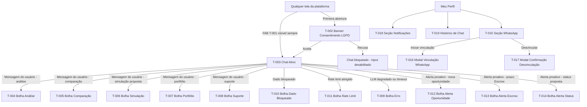
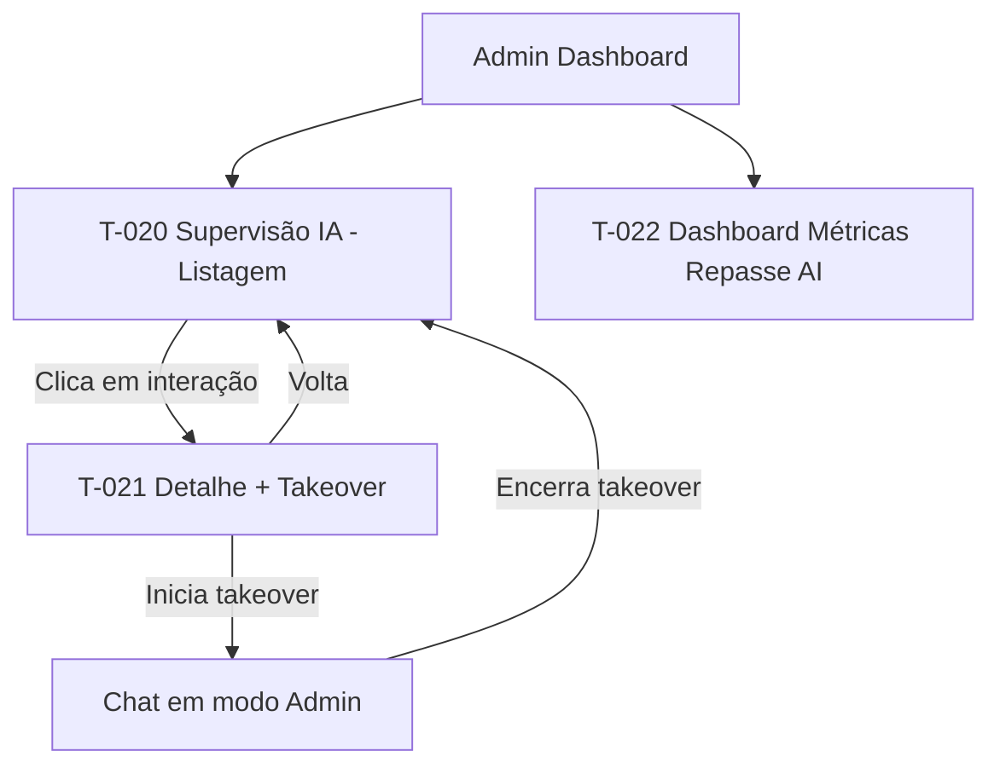
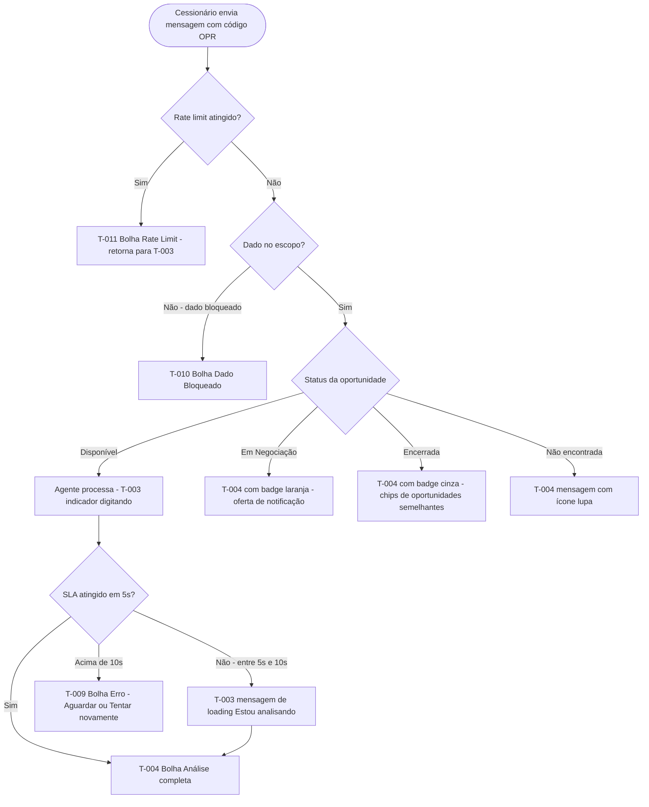
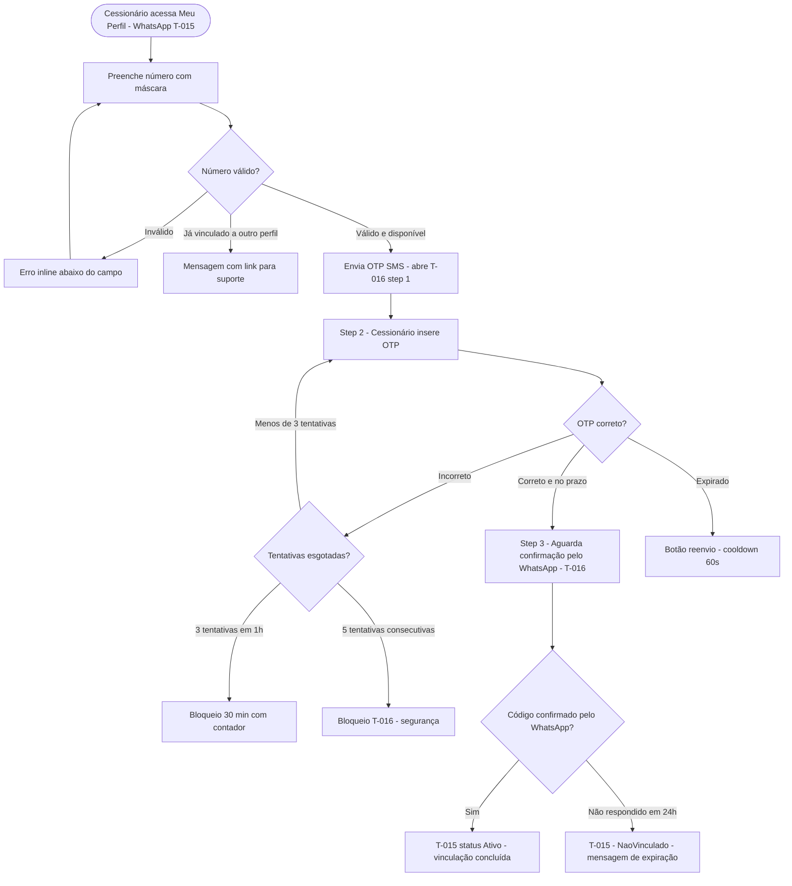
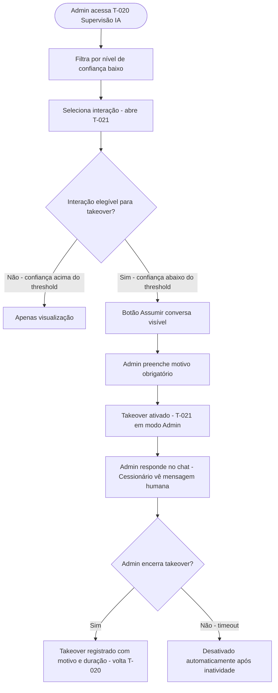
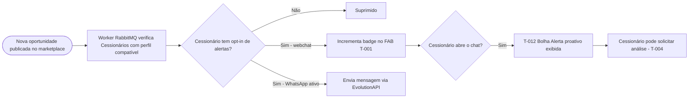
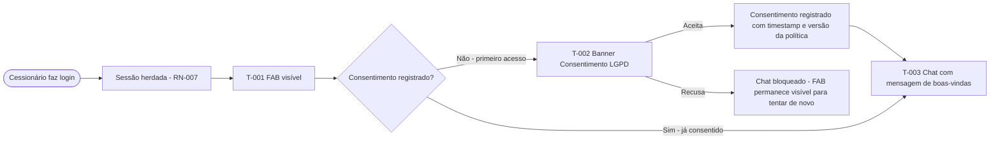
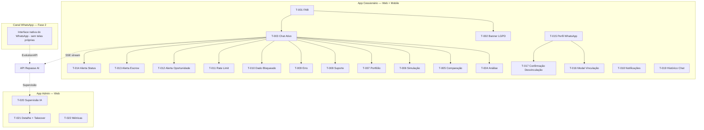

# Repasse AI
## 06 — Mapa de Telas

| Campo | Valor |
|---|---|
| **Destinatário** | Produto, UX e Frontend |
| **Escopo** | Inventário completo de telas, navegação, estados visuais e mapeamento de componentes do módulo Repasse AI |
| **Módulo** | Repasse AI |
| **Versão** | v1.1 |
| **Responsável** | Claude Code Desktop |
| **Data** | 22/03/2026 00:00 (America/Fortaleza) |

---

> **TL;DR**
>
> - Total de telas mapeadas: **22 unidades documentais** (T-001 a T-022) — incluindo 9 modais e overlays com lógica própria.
> - Total de módulos cobertos: **8 módulos** (Webchat, Análise, Calculadora, Comparação, Simulação, Notificações, Configurações do Usuário, Admin Supervisão).
> - Plataformas suportadas: **Web** (frontend Cessionário + Admin) + **WhatsApp** (Fase 2, sem telas próprias — interface nativa do canal).
> - Padrão de navegação adotado: FAB flutuante no canto inferior direito para acesso ao chat; navigation via mensagens dentro do chat para fluxos analíticos; sidebar fixa no Admin.
> - Principais adaptações responsivas: webchat em modal full-screen no mobile (< 768px); painel Admin com sidebar recolhível em tablet (768px–1024px).
> - Componentes reutilizáveis identificados: ChatBubble, OportunidadeCard, ScoreIndicador, TabComparativo, FAB, BannerConsentimento, AlertaBadge.
> - Nenhuma seção crítica pendente. [DECISÃO AUTÔNOMA] aplicada em 4 pontos de navegação (marcados inline).
>
> **Nota arquitetural:** O Repasse AI é um serviço backend puro (PG-03). As telas documentadas aqui são **superfícies no frontend do Cessionário e do Admin** que consomem a API do Repasse AI. O módulo em si não tem frontend próprio. O WhatsApp não gera telas — é o canal de mensagens nativo.

---

## 1. Inventário Completo de Telas

### Módulo A — Webchat (Interface principal do Repasse AI)

| ID | Nome da Tela | Descrição | Aplicação | Plataforma | Módulo | Fase | RF relacionado |
|---|---|---|---|---|---|---|---|
| T-001 | FAB do Chat (Botão flutuante) | Botão de acesso ao Repasse AI, sempre visível nas telas do Cessionário. Exibe badge numérica de alertas não lidos. | Cessionário | Web | Webchat | Fase 1 | RF-040 |
| T-002 | Banner de Consentimento LGPD | Overlay exibido na primeira abertura do chat, solicitando consentimento para armazenamento de conversas por 90 dias. Bloqueia o input até aceite. | Cessionário | Web | Webchat / LGPD | Fase 1 | RF-101 |
| T-003 | Janela do Chat — Estado Ativo | Interface principal do chat: histórico de mensagens, campo de input, indicador de digitação SSE, sugestões de conversa. | Cessionário | Web, Mobile | Webchat | Fase 1 | RF-038, RF-042, RF-046 |
| T-004 | Chat — Bolha de Análise de Oportunidade | Resposta estruturada do agente com Δ, comissão, custo Escrow, ROI (3 cenários), score de risco com indicador de cor, comparativo regional. | Cessionário | Web, Mobile | Análise | Fase 1 | RF-001, RF-002, RF-008, RF-009, RF-010 |
| T-005 | Chat — Bolha de Comparação | Resposta do agente com tabela comparativa de até 5 oportunidades, coluna de destaque (maior Δ ou menor risco). | Cessionário | Web, Mobile | Comparação | Fase 1 | RF-014 a RF-018 |
| T-006 | Chat — Bolha de Simulação (Proposta / Contraproposta) | Resposta do agente com simulação de custos para valor proposto ou contraproposta, ROI ajustado, nota de recusa de submissão. | Cessionário | Web, Mobile | Simulação | Fase 1 | RF-019 a RF-024 |
| T-007 | Chat — Bolha de Portfólio | Resposta do agente com simulação de portfólio multi-oportunidade, ROI total com 3 cenários de valorização (±20%). | Cessionário | Web, Mobile | Simulação | Fase 1 | RF-026 a RF-029 |
| T-008 | Chat — Bolha de Suporte Operacional | Resposta do agente para perguntas sobre regras da plataforma, KYC, Escrow, status. | Cessionário | Web, Mobile | Suporte | Fase 1 | RF-047, RF-048 |
| T-009 | Chat — Bolha de Erro / Degradação | Mensagem exibida quando o agente excede SLA ou está indisponível. Oferece "Aguardar" ou "Tentar novamente". | Cessionário | Web, Mobile | Webchat | Fase 1 | RF-063, RF-064, RF-065 |
| T-010 | Chat — Bolha de Dado Bloqueado | Mensagem padrão exibida quando o Cessionário solicita dados fora do escopo (Cedente, outros Cessionários). | Cessionário | Web, Mobile | Segurança | Fase 1 | RF-034, RF-035 |
| T-011 | Chat — Bolha de Rate Limit Atingido | Mensagem de limite de mensagens por hora com contador de tempo restante. | Cessionário | Web, Mobile | Webchat | Fase 1 | RF-061, RF-062 |

### Módulo B — Notificações Proativas

| ID | Nome da Tela | Descrição | Aplicação | Plataforma | Módulo | Fase | RF relacionado |
|---|---|---|---|---|---|---|---|
| T-012 | Bolha de Alerta Proativo — Nova Oportunidade | Mensagem proativa do agente no chat com card de oportunidade compatível (OPR, Δ, score de risco, botão "Ver oportunidade"). Exibida quando Cessionário abre o chat. | Cessionário | Web, Mobile | Notificações | Fase 1 | RF-097 |
| T-013 | Bolha de Alerta Proativo — Prazo de Escrow | Mensagem proativa com alerta de prazo de depósito (2 dias úteis restantes), código da negociação, valor e link. | Cessionário | Web, Mobile | Notificações | Fase 1 | RF-098 |
| T-014 | Bolha de Alerta Proativo — Mudança de Status | Mensagem proativa com novo status de proposta, significado em linguagem clara e próximo passo. | Cessionário | Web, Mobile | Notificações | Fase 1 | RF-099 |

### Módulo C — Configurações do Usuário (Repasse AI)

| ID | Nome da Tela | Descrição | Aplicação | Plataforma | Módulo | Fase | RF relacionado |
|---|---|---|---|---|---|---|---|
| T-015 | Meu Perfil — Seção WhatsApp | Subseção de Meu Perfil para vinculação do WhatsApp: campo de número com máscara, botão iniciar vinculação, status atual da vinculação, botão Desvincular. | Cessionário | Web | WhatsApp | Fase 2 | RF-086, RF-092 |
| T-016 | Modal — Fluxo de Vinculação WhatsApp | Modal overlay com steps: (1) Inserir número, (2) Inserir OTP SMS, (3) Aguardar confirmação pelo WhatsApp. Exibe contadores regressivos, tentativas restantes e estados de bloqueio. | Cessionário | Web | WhatsApp | Fase 2 | RF-086, RF-087, RF-088, RF-089 |
| T-017 | Modal — Confirmação de Desvinculação WhatsApp | Modal de confirmação antes de desvincular o número, com aviso sobre perda de alertas via WhatsApp. | Cessionário | Web | WhatsApp | Fase 2 | RF-092 |
| T-018 | Meu Perfil — Seção Notificações | Subseção de Meu Perfil com toggles individuais para os 3 tipos de notificação proativa, estado atual de cada um, e descrição inline de cada tipo. | Cessionário | Web | Notificações | Fase 1 | RF-100 |
| T-019 | Meu Perfil — Seção Histórico de Chat | Subseção de Meu Perfil com histórico de conversas e botão "Apagar tudo" com modal de confirmação. | Cessionário | Web | Webchat / LGPD | Fase 1 | RF-102 |

### Módulo D — Admin — Supervisão IA

| ID | Nome da Tela | Descrição | Aplicação | Plataforma | Módulo | Fase | RF relacionado |
|---|---|---|---|---|---|---|---|
| T-020 | Painel de Supervisão IA — Listagem | Lista de interações com: ID anônimo do Cessionário, data/hora, pergunta, resposta, nível de confiança (%), dados utilizados, latência. Filtros de data, confiança e canal. | Admin | Web | Admin / Supervisão | Fase 1 | RF-066, RF-067, RF-068, RF-069 |
| T-021 | Supervisão IA — Detalhe da Interação + Takeover | Visão detalhada de uma interação. Se elegível para takeover (confiança < threshold): botão "Assumir conversa" + campo de motivo obrigatório. Durante takeover: chat em modo Admin. | Admin | Web | Admin / Takeover | Fase 1 | RF-071, RF-072, RF-073, RF-074 |
| T-022 | Dashboard Admin — Métricas do Repasse AI | Painel de métricas: CSAT, taxa de recusa, taxa de takeover, latência média, volume de interações. Filtros por período. | Admin | Web | Admin / Métricas | Fase 1 | RF-076, RF-077 |

---

## 2. Hierarquia de Navegação

### 2.1 Navegação do Cessionário (Web)

### 2.2 Navegação do Admin (Web)

---

## 3. Fluxos de Navegação por Módulo

### 3.1 Fluxo Principal — Análise de Oportunidade

### 3.2 Fluxo de Vinculação WhatsApp (Fase 2)

### 3.3 Fluxo de Takeover Admin

---

### 3.4 Fluxos Cross-Módulo

**Cross-módulo: Análise → Notificação Proativa (RF-097)**

**Cross-módulo: Onboarding → LGPD → Chat (RF-053 + RF-101)**

---

## 4. Estados e Transições por Tela

**T-001: FAB do Chat**
- **Loading:** não aplicável — FAB renderiza imediatamente com base em estado local.
- **Empty:** FAB sem badge (sem alertas não lidos). Ícone de chat com cor `--primary` (#0069A8).
- **Sucesso:** FAB com badge numérica em vermelho (`--destructive` #E7000B) quando há alertas. Número máximo exibido: "9+".
- **Erro:** não aplicável — FAB não falha; o erro acontece dentro do chat.
- **Parcial:** não aplicável.
- **Offline:** FAB permanece visível com opacidade reduzida (0.5). Tooltip "Sem conexão" ao hover.
- **Transição:** badge aparece com animação scale-in (150ms, ease-out). Quando zerada: scale-out (150ms).

---

**T-002: Banner de Consentimento LGPD**
- **Loading:** não aplicável — banner renderiza sincronicamente antes do chat carregar.
- **Empty:** não aplicável.
- **Sucesso:** banner visível com texto, link para política e botões "Aceitar" e "Ver política".
- **Erro:** se falha ao registrar o consentimento no backend, banner permanece e exibe toast de erro no topo: "Não foi possível registrar seu consentimento. Tente novamente." com botão "Tentar novamente".
- **Parcial:** não aplicável.
- **Offline:** botão "Aceitar" desabilitado com tooltip "Necessário ter conexão para aceitar."
- **Transição:** ao aceitar: banner desaparece com slide-up (300ms, ease-in-out); mensagem de boas-vindas (T-003) aparece com fade-in (200ms).

---

**T-003: Janela do Chat — Estado Ativo**
- **Loading:** skeleton de 3 linhas de mensagem enquanto o histórico carrega (max 500ms).
- **Empty:** mensagem de boas-vindas com sugestões de conversa (chips clicáveis). `--muted-foreground` para sugestões. [DECISÃO AUTÔNOMA — chips em vez de lista para economizar espaço e incentivar interação por toque; alternativa descartada: lista com bullets (menor densidade de informação).]
- **Sucesso:** histórico de mensagens com bubbles (usuário: alinhado à direita, `--primary`; agente: alinhado à esquerda, `--card`). Timestamps em `--muted-foreground`.
- **Erro:** toast no topo da janela "Não foi possível carregar o histórico." — chat continua funcional para novas mensagens.
- **Parcial:** últimas 20 mensagens exibidas com botão "Carregar mais" acima.
- **Offline:** input desabilitado com banner "Você está offline. As mensagens serão enviadas quando a conexão voltar." — histórico em cache exibido normalmente.
- **Transição:** indicador de digitando (três pontos pulsando, 800ms de ciclo) durante streaming SSE; tokens chegam em stream e são renderizados progressivamente sem layout shift.
- **Edge case — stream interrompido:** se a conexão SSE cair durante o streaming (bolha incompleta), a bolha exibe o texto recebido até o momento com indicador "Resposta incompleta" em `--muted-foreground` + botão "Tentar novamente". Nenhum dado perdido — o input fica habilitado para re-envio. [CORRIGIDO: PROBLEMA-B04-003] [DECISÃO APLICADA: DEC-B04-001]
- **Hierarquia visual:** o input fica sempre ancorado na parte inferior; o histórico rola acima do input. Botão de envio é a ação primária. Sugestões são elementos terciários (tamanho menor, cor `--muted-foreground`). Timestamps são quaternários (7px menor que o texto de mensagem).

---

**T-004: Chat — Bolha de Análise de Oportunidade**
- **Loading:** inline skeleton dentro da bolha enquanto o stream está ativo.
- **Empty:** não aplicável — bolha só aparece quando há resposta.
- **Hierarquia visual:** Δ (Delta) é o número de destaque principal — maior tamanho de fonte, `--foreground` bold. Abaixo: Comissão e Custo Escrow em tamanho médio. Score de Risco com badge colorida como elemento de atenção secundário. ROI em abas ao lado do Score. Comparativo Regional e Histórico em seção colapsável "Ver mais detalhes" para não sobrecarregar a visualização primária. [CORRIGIDO: PROBLEMA-B04-001] [DECISÃO APLICADA: DEC-B04-002 — Delta como destaque principal por ser o dado de maior relevância imediata para decisão de proposta; alternativa descartada: ROI como destaque (o ROI depende de mais contexto para ser interpretado).]
- **Sucesso (completo):** card estruturado com 7 seções: Δ (destaque numérico grande), Comissão, Custo Total Escrow, ROI com 3 abas (Conservador/Base/Otimista), Score de Risco (badge colorida + justificativa), Comparativo Regional (ou mensagem de indisponibilidade), Histórico de Valorização (gráfico inline ou tabela textual no WhatsApp).
- **Sucesso (Em Negociação):** badge laranja "Em negociação" + oferta de notificação (botão "Me avisar quando disponível").
- **Sucesso (Encerrada):** badge cinza "Encerrada" + chips de até 3 oportunidades semelhantes.
- **Erro (OPR não encontrado):** ícone lupa + mensagem de oportunidade não encontrada.
- **Parcial:** score de risco omitido com mensagem de dados insuficientes (não score parcial).
- **Offline:** não aplicável — bolha já está em histórico em cache.
- **Transição:** streaming progressivo dos tokens; score de risco badge anima com scale-in ao finalizar o stream.

---

**T-005: Chat — Bolha de Comparação**
- **Loading:** skeleton de tabela (header + 3 linhas de placeholder) durante streaming.
- **Empty:** não aplicável.
- **Sucesso:** tabela responsiva com oportunidades como colunas (máx 5), campos como linhas. Coluna de destaque (maior Δ ou menor risco) com borda `--primary`. Cabeçalho fixo em mobile com scroll horizontal.
- **Indicador de scroll em mobile:** na primeira exibição em mobile, um indicador visual de "deslize para ver mais" (chevron right com leve pulse animation, 2 ciclos de 1s) aparece na borda direita da tabela se houver colunas fora da tela. Desaparece após o primeiro scroll ou 3 segundos. [CORRIGIDO: PROBLEMA-B04-007] [DECISÃO APLICADA: DEC-B04-006 — indicador discoverability para scroll horizontal, que não é óbvio para usuários novos; alternativa descartada: hint textual "arraste para ver mais" (ocupa espaço valioso dentro da bolha do chat).]
- **Erro:** mensagem inline se alguma das oportunidades não for encontrada, com indicação do código OPR faltante.
- **Parcial:** tabela com colunas preenchidas para as oportunidades encontradas; colunas ausentes indicadas com "-".
- **Offline:** histórico em cache.
- **Transição:** tabela renderiza coluna por coluna durante o stream.

---

**T-006: Chat — Bolha de Simulação**
- **Loading:** skeleton de card único.
- **Empty:** não aplicável.
- **Sucesso:** card com: valor proposto, comissão calculada, custo total Escrow, ROI ajustado; nota de recusa de submissão automática de proposta em `--muted-foreground` italic.
- **Erro:** mensagem se valor inválido ou OPR não encontrado.
- **Parcial:** não aplicável — simulação usa dados determinísticos completos ou retorna erro.
- **Offline:** histórico em cache.
- **Transição:** stream progressivo; ROI renderiza por cenário (Conservador → Base → Otimista).

---

**T-007: Chat — Bolha de Portfólio**
- **Loading:** skeleton de 3 cards de oportunidade.
- **Empty:** não aplicável.
- **Sucesso:** cards empilhados por oportunidade + card de resumo do portfólio com ROI total (3 cenários, abas). Capital comprometido total exibido em destaque.
- **Erro:** se alguma das oportunidades do portfólio não for encontrada.
- **Parcial:** portfólio calculado com as oportunidades válidas; oportunidades inválidas indicadas.
- **Offline:** histórico em cache.
- **Transição:** cards aparecem sequencialmente durante o stream (stagger 100ms entre cards).

---

**T-008: Chat — Bolha de Suporte Operacional**
- **Loading:** skeleton de parágrafo.
- **Empty:** não aplicável.
- **Sucesso:** resposta em texto formatado com: cabeçalho da regra explicada, detalhes em parágrafos, links para documentação (quando disponível).
- **Erro:** mensagem de fallback se a consulta excede o escopo do suporte operacional.
- **Parcial:** resposta parcial com indicação de que dados adicionais podem ser consultados na plataforma.
- **Offline:** histórico em cache.
- **Transição:** stream progressivo de tokens.

---

**T-009: Chat — Bolha de Erro / Degradação**
- Exibida quando: (a) LLM não responde em ≤ 10s, (b) agente desligado por taxa de erro > 30%.
- **Estados:** mensagem clara com dois botões de ação: "Aguardar" (mantém o indicador de loading ativo) e "Tentar novamente" (re-envia a mensagem). Se Calculadora de Comissão disponível como fallback: terceiro botão "Calcular comissão apenas" direciona para T-004 com resultado determinístico.
- **Transição:** aparece com fade-in (200ms) após timeout.

---

**T-010: Chat — Bolha de Dado Bloqueado**
- **Sucesso:** mensagem padrão do tipo de dado solicitado (RN-004 — 7 categorias). Texto em `--foreground`, sem ícone de erro (não é um erro técnico, é uma restrição de negócio). [DECISÃO AUTÔNOMA — sem ícone de alerta vermelho para não criar ansiedade no Cessionário; a mensagem é informativa, não alarmante. Alternativa descartada: ícone de cadeado (pode sugerir que o dado existe mas está trancado, quando muitas vezes simplesmente não é acessível pelo agente).]
- **Segunda insistência:** mesma mensagem + chips de sugestões de conversa.
- **Terceira insistência:** mesma mensagem sem chips.

---

**T-011: Chat — Bolha de Rate Limit Atingido**
- **Sucesso:** mensagem com tempo restante formatado (hh:mm). Contador atualizado em tempo real a cada minuto. Input desabilitado após o limite. Reabilitado automaticamente quando o limite é liberado.
- **Transição:** input desabilita suavemente (opacity transition 200ms) ao atingir o limite.

---

**T-012 a T-014: Bolhas de Alertas Proativos**
- **Loading:** não aplicável — bolhas são inseridas assincronicamente.
- **Sucesso:** card compacto com badge "Novo alerta" em `--primary`, dados da oportunidade/negociação e botão de ação.
- **Erro:** não exibido ao usuário em caso de falha de entrega — sistema retenta via fila RabbitMQ.
- **Transição:** bolha aparece com slide-down (250ms) quando Cessionário abre o chat.

---

**T-015: Meu Perfil — Seção WhatsApp**
- **Loading:** skeleton do campo de número enquanto o status de vinculação carrega.
- **Empty (NaoVinculado):** campo de número + botão "Vincular WhatsApp".
- **Sucesso (Ativo):** número mascarado (XX) XXXXX-XXXX, status "Vinculado" com ícone verde + botão "Desvincular".
- **Suspenso:** status "Verificação pendente" com botão "Re-verificar agora".
- **Erro:** mensagem inline se falha na validação do número.
- **Offline:** botão de vinculação desabilitado com tooltip "Sem conexão".
- **Transição:** status atualizado com fade-in (200ms) após cada mudança de estado.

---

**T-016: Modal — Fluxo de Vinculação WhatsApp**
- **Step 1 (inserir número):** campo com máscara, validação em tempo real, botão "Enviar código". Erro inline se número inválido ou já vinculado.
- **Step 2 (inserir OTP SMS):** 6 campos de dígito individuais (estilo OTP), contador regressivo de 15 minutos, botão "Reenviar código" (desabilitado 60s após reenvio), indicador de tentativas restantes.
- **Bloqueio:** overlay de bloqueio com contador regressivo mm:ss, todos os inputs desabilitados.
- **Step 3 (aguardar confirmação WhatsApp):** tela de estado com ícone de WhatsApp animado, contador de 24 horas restantes, instrução clara.
- **Transição entre steps:** slide horizontal (step 1 → step 2 → step 3), 300ms ease-in-out.
- **Acessibilidade:** `role="dialog"`, `aria-modal="true"`, `aria-labelledby` apontando para o título do step ativo. Focus trap dentro do modal — ao abrir, foco no primeiro input. Ao fechar (cancelar ou concluir), foco retorna ao botão "Vincular WhatsApp" em T-015. OTP inputs com `autocomplete="one-time-code"` para facilitar preenchimento automático via SMS em dispositivos compatíveis. [CORRIGIDO: PROBLEMA-B04-002]
- **Edge case — usuário fecha o modal no meio do fluxo:** ao fechar no step 2 ou 3, sistema exibe confirmação "Tem certeza? O código enviado expirará e você precisará reiniciar o processo." com botões "Cancelar" e "Sair". [CORRIGIDO: PROBLEMA-B04-004] [DECISÃO APLICADA: DEC-B04-003 — confirmação no fechamento intermediário evita abandono acidental do processo de 2 etapas; alternativa descartada: fechar sem confirmação (alto risco de frustração ao recomeçar o processo).]

---

**T-017: Modal — Confirmação de Desvinculação**
- **Sucesso:** modal com título, aviso sobre perda de alertas, botões "Cancelar" (outline) e "Desvincular" (destructive).
- **Transição:** modal fecha com fade-out (150ms); status em T-015 atualiza para NaoVinculado com fade-in.

---

**T-018: Meu Perfil — Seção Notificações**
- **Loading:** skeleton de 3 toggles.
- **Sucesso:** 3 linhas com toggle + label + descrição curta. Toggle em `--primary` quando ativo.
- **Offline:** toggles desabilitados com tooltip "Sem conexão".
- **Transição:** toggle com animação spring nativa do shadcn/ui Switch (150ms).

---

**T-019: Meu Perfil — Seção Histórico de Chat**
- **Loading:** skeleton de lista de conversas.
- **Empty:** "Nenhuma conversa registrada ainda." com CTA "Abrir chat".
- **Sucesso:** lista de conversas com data, primeira mensagem truncada, botão "Apagar tudo" no final (variant destructive outline).
- **Confirmação de exclusão:** modal inline com aviso "Ação irreversível. Histórico será excluído em até 48 horas." + botões "Cancelar" e "Confirmar exclusão".
- **Transição:** lista some com fade-out após confirmação; toast "Exclusão solicitada. Você receberá confirmação em até 48 horas." persiste 5s.

---

**T-020: Painel de Supervisão IA — Listagem (Admin)**
- **Loading:** skeleton de tabela com 10 linhas.
- **Empty:** "Nenhuma interação registrada ainda." — sem CTA (dashboard passivo).
- **Sucesso:** tabela com interações, badge de confiança colorida (verde ≥80%, amarelo 50–79%, vermelho <50%). Filtros no topo (período, canal, faixa de confiança).
- **Erro:** banner "Não foi possível carregar as interações. Tente novamente."
- **Parcial:** paginação de 20 itens por página.
- **Transição:** nova interação aparece no topo da lista com highlight de 2s em `--accent`.

---

**T-021: Supervisão IA — Detalhe da Interação + Takeover (Admin)**
- **Loading:** skeleton de painel de detalhe.
- **Sucesso (sem takeover disponível):** todos os campos da interação, botão de takeover ausente ou desabilitado com tooltip "Confiança acima do threshold".
- **Sucesso (takeover disponível):** botão "Assumir conversa" em `--primary`. Campo de motivo obrigatório aparece ao clicar.
- **Durante takeover:** painel dividido — histórico de mensagens à esquerda, campo de input do Admin à direita. Banner "Você está controlando esta conversa" persistente. Botão "Encerrar takeover" em destaque.
- **Erro no takeover:** toast "Não foi possível assumir a conversa. Tente novamente."
- **Edge case — takeover concorrente (dois Admins tentam assumir a mesma conversa simultaneamente):** o segundo Admin a clicar em "Assumir conversa" recebe toast de erro: "Esta conversa já está sendo controlada por outro membro da equipe." O botão fica desabilitado durante o takeover ativo. [CORRIGIDO: PROBLEMA-B04-005] [DECISÃO APLICADA: DEC-B04-004 — mutex por conversa com feedback imediato ao segundo Admin; alternativa descartada: sem proteção (dois Admins enviam mensagens simultâneas ao Cessionário, gerando experiência confusa).]
- **Hierarquia visual no takeover:** banner de status ("Você está controlando esta conversa") é elemento de atenção persistente no topo do painel — `--destructive` como cor de fundo com texto `--destructive-foreground`. Input do Admin em posição primária (parte inferior direita, maior largura). Botão "Encerrar takeover" como ação primária destrutiva (cor `--destructive`).
- **Transição:** modo takeover ativa com slide-in do painel de input (300ms, right).

---

**T-022: Dashboard Admin — Métricas do Repasse AI**
- **Loading:** skeleton de 5 cards de métrica + skeleton de gráfico.
- **Empty (sem dados no período):** cards com "--" e tooltip "Sem dados para o período selecionado."
- **Empty (produto recém-lançado — zero interações históricas):** estado de first-use — cards com "--", gráfico exibe linha do tempo sem dados e mensagem centralizada: "Ainda não há interações registradas. As métricas aparecerão aqui após os primeiros usos do Repasse AI." CTA opcional "Ver documentação" para Admin entender o que esperar. [CORRIGIDO: PROBLEMA-B04-006] [DECISÃO APLICADA: DEC-B04-005 — estado de first-use distinto do empty de período, pois o contexto e a mensagem orientativa são diferentes; alternativa descartada: mesmo estado (confunde Admin que não sabe se o produto está configurado corretamente).]
- **Sucesso:** 5 cards de métrica (CSAT, taxa de recusa, taxa de takeover, latência média, volume). Gráfico de linha com volume por dia. Filtro de período (7d, 30d, 90d, custom).
- **Erro:** banner de erro + cards em estado degradado.
- **Parcial:** dados do período parcial exibidos com indicação de janela temporal.
- **Hierarquia visual:** volume de interações como card primário (maior, posição top-left). CSAT como segundo card de destaque. Taxa de takeover e taxa de recusa como cards secundários. Latência média como card informativo (menor destaque). Gráfico de linha ocupa a metade inferior do painel.
- **Transição:** cards atualizam com number-flip animation (300ms) ao trocar o período.

---

## 4.1 Variantes por Perfil de Usuário

**T-003, T-004, T-005, T-006, T-007, T-008:** exclusivos do **Cessionário** — Admin nunca acessa o chat do usuário diretamente; o Admin acessa via T-021 (modo supervisão/takeover) apenas.

**T-020, T-021, T-022:** exclusivos do **Admin** — Cessionário nunca acessa o painel de supervisão.

**T-015, T-016, T-017, T-018, T-019:** exclusivos do **Cessionário** — configurações pessoais da conta.

---

## 5. Breakpoints e Adaptações Responsivas

### Mobile (< 768px)

| Tela | Adaptação |
|---|---|
| T-001 FAB | Posicionado bottom: 16px, right: 16px. Tamanho 56px × 56px. |
| T-002 Banner Consentimento | Full-screen overlay com scroll vertical. Botões em coluna (full-width). |
| T-003 Chat | Painel full-screen (100dvh). Campo de input fixo no bottom com safe-area-inset. Histórico com scroll. |
| T-004 a T-008 Bolhas | Largura máxima 90% da janela. Cards com layout em coluna (score de risco abaixo do Δ). |
| T-005 Tabela Comparação | Scroll horizontal com header fixo. Máximo 3 oportunidades visíveis sem scroll (4ª e 5ª em scroll). |
| T-016 Modal Vinculação | Full-screen drawer (bottom sheet) em vez de modal centrado. |
| T-020 a T-022 Admin | Não otimizado para mobile — aviso "Use o painel Admin em telas maiores." com redirect sugerido. [DECISÃO AUTÔNOMA — Admin é função operacional de supervisão; telas pequenas comprometem a usabilidade de tabelas densas; alternativa descartada: layout colapsado (complexidade alta, benefício baixo).] |

### Tablet (768px–1024px)

| Tela | Adaptação |
|---|---|
| T-003 Chat | Painel lateral (drawer) com largura 400px. Overlay sobre o conteúdo. |
| T-005 Tabela Comparação | Até 4 colunas visíveis sem scroll. |
| T-020 a T-022 Admin | Sidebar recolhível com ícones. Tabela com paginação reduzida (10 itens). |

### Desktop (> 1024px)

| Tela | Adaptação |
|---|---|
| T-003 Chat | Painel lateral fixo com largura 420px ou modal centrado 600px × 700px. [DECISÃO AUTÔNOMA — painel lateral como padrão desktop para não interromper o fluxo de navegação; o Cessionário pode continuar vendo as oportunidades enquanto conversa com o agente; alternativa descartada: modal centrado (bloqueia a tela principal).] |
| T-005 Tabela Comparação | 5 colunas visíveis simultaneamente. |
| T-016 Modal Vinculação | Modal centrado 480px de largura. |
| T-020 a T-022 Admin | Sidebar fixa expandida. Tabela com 20 itens por página. |

---

## 6. Componentes Reutilizáveis

| Componente | Telas onde aparece | Variantes | Tokens usados |
|---|---|---|---|
| **FAB** | T-001 (todas as telas do Cessionário) | Com badge / sem badge / desabilitado | `--primary`, `--destructive`, `--background` |
| **ChatBubble** | T-003, T-004 a T-011, T-012 a T-014 | Usuário (direita), Agente (esquerda), Sistema (centrado) | `--card`, `--primary`, `--muted`, `--foreground` |
| **OportunidadeCard** | T-004, T-005, T-006, T-007, T-012 | Análise completa / Compacto (comparação) / Mini (chip) | `--card`, `--border`, `--primary` |
| **ScoreIndicador** | T-004, T-008 | Baixo (verde) / Moderado (amarelo) / Alto (vermelho) | `--chart-1` (verde custom), `--chart-2` (amarelo custom), `--destructive` |
| **TabComparativo** | T-004 (ROI 3 cenários), T-005 (colunas), T-022 (filtro período) | 3 abas / N colunas / Período | `--primary`, `--muted`, `--border` |
| **BannerConsentimento** | T-002 | Default (sem variantes funcionais) | `--card`, `--primary`, `--muted-foreground` |
| **AlertaBadge** | T-001 (FAB), T-012 a T-014, T-020 (confiança) | Numérica (FAB) / Textual (interações) / Cor semântica (confiança) | `--destructive`, `--primary`, cores custom de semáforo |
| **ToggleNotificacao** | T-018 | Ativo / Inativo / Desabilitado | `--primary`, `--muted`, `--border` |
| **StepProgress** | T-016 (vinculação) | 3 steps | `--primary`, `--muted`, `--muted-foreground` |
| **OTPInput** | T-016 (step 2) | Normal / Erro / Bloqueado | `--input`, `--destructive`, `--ring` |

---

## 7. Acessibilidade Básica (a11y)

**T-001 FAB**
- `aria-label="Abrir Analista de Oportunidades"` no botão.
- Badge com `aria-live="polite"` para anunciar novas notificações.
- Contraste: ícone branco sobre `--primary` #0069A8 → ratio 4.7:1 (WCAG AA aprovado).

---

**T-002 Banner de Consentimento**
- Tab order: link "Ver política de privacidade" → botão "Aceitar".
- `role="dialog"` e `aria-labelledby` com o título do banner.
- `aria-modal="true"` para trap de foco.
- Contraste de texto: `--foreground` #0A0A0A sobre `--card` #FFFFFF → 19.5:1 (WCAG AAA).

---

**T-003 Chat**
- `role="log"` na área de histórico com `aria-live="polite"` para novas mensagens do agente.
- Indicador de "digitando" com `aria-label="Agente está digitando"`.
- Input com `aria-label="Escreva sua mensagem para o Analista de Oportunidades"` e `aria-describedby` apontando para contador de mensagens restantes.
- Tab order: histórico (não focável) → input → botão de envio → sugestões de conversa.

---

**T-004 Bolha de Análise**
- ScoreIndicador: `aria-label="Score de risco: [valor] — [Baixo/Moderado/Alto]"` com `role="status"`.
- Abas de ROI: `role="tablist"` com `role="tab"` e `aria-selected` em cada aba.
- Gráfico de valorização: `alt` text descritivo com os valores máximo e mínimo do período.
- Badge de status (Em negociação, Encerrada): `aria-label` descritivo do estado.

---

**T-016 Modal de Vinculação**
- `role="dialog"`, `aria-modal="true"`, `aria-labelledby` com o título do step ativo.
- OTP inputs: `aria-label="Dígito [N] de 6 do código de verificação"` para cada campo.
- Contador regressivo: `aria-live="assertive"` para bloqueios, `aria-live="polite"` para expiração normal.
- Foco retorna ao botão de origem (T-015) quando o modal é fechado.

---

**T-020 a T-022 Admin**
- Tabelas com `role="table"`, `scope="col"` em headers, `aria-sort` em colunas ordenáveis.
- Badge de confiança: `aria-label="Confiança: [valor]% — [Baixa/Média/Alta]"`.
- Botão de takeover: `aria-describedby` apontando para tooltip de elegibilidade.
- Contraste de texto em tabelas: `--foreground` sobre `--background` → 19.5:1.

---

## 8. Mapa Visual Consolidado

---

## 9. Changelog

| Data | Versão | Descrição |
|---|---|---|
| 22/03/2026 | v1.0 | Geração inicial. 22 telas mapeadas (T-001 a T-022), 8 módulos, 4 decisões autônomas. |
| 22/03/2026 | v1.1 | Auditoria B04 aplicada. 7 problemas UX corrigidos, 6 decisões autônomas adicionadas: hierarquia visual em T-004/T-021/T-022, edge case de stream interrompido em T-003, focus trap e confirmação de fechamento em T-016, takeover concorrente em T-021, first-use state em T-022, scroll hint em T-005. |

---

## 10. Backlog de Pendências

| Item | Tipo | Tela / Módulo | Decisão aplicada / Pendência |
|---|---|---|---|
| Layout do Chat em desktop: painel lateral vs. modal centrado | DECISÃO AUTÔNOMA | T-003 | Painel lateral adotado (permite uso simultâneo com marketplace). Alternativa: modal centrado (descartada — bloqueia navegação). |
| Sem ícone de alerta em T-010 (dado bloqueado) | DECISÃO AUTÔNOMA | T-010 | Ícone informativo adotado (sem alerta vermelho). Alternativa: cadeado (descartada — sugere dado trancado). |
| Admin não otimizado para mobile | DECISÃO AUTÔNOMA | T-020, T-021, T-022 | Aviso + redirect sugerido. Alternativa: layout colapsado (descartada — complexidade × benefício negativo). |
| Chips de sugestão de conversa em T-003 (Empty) | DECISÃO AUTÔNOMA | T-003 | Chips clicáveis. Alternativa: lista com bullets (descartada — menor densidade e ergonomia de toque). |
| Status específicos de proposta/negociação em T-014 (Alerta de mudança de status) | DEFINIÇÃO PENDENTE | T-014 | Opção A: importar status do módulo Cessionário (strings e semântica). Opção B: usar categorias genéricas (Aceite, Recusa, Contraproposta). Impacto: mensagem de T-014 e cópia UX do alerta. Responsável: Produto (BKL-PRD-006). |
