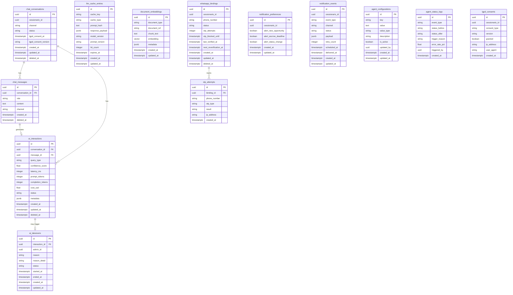

# Repasse AI
## 12 — Modelo de Dados (ERD / Schema)

| Campo | Valor |
|---|---|
| **Destinatário** | Backend e Arquitetura |
| **Escopo** | Documento de modelagem de dados com entidades, relacionamentos, migrations e seeds |
| **Versão** | v1.0 |
| **Responsável** | Claude Code Desktop |
| **Data da versão** | 22/03/2026 00:00 (America/Fortaleza) |
| **Status** | Ativo |
| **Fase** | 2 — Produto |
| **Área** | Backend / Arquitetura |
| **Referências** | 01 - Regras de Negócio · 02 - Stacks · 05 - PRD |

---

> 📌 **TL;DR**
>
> - **13 entidades** mapeadas em 6 domínios: Conversas, Interações, Análise/Cache, WhatsApp, Notificações, Admin/Configuração.
> - **ORM:** Prisma 6+ sobre Supabase PostgreSQL 17+ com pgvector. Migrations declarativas via Prisma.
> - **Convenção:** `snake_case` para tabelas (plural) e colunas (singular), UUID v4 como PK (`gen_random_uuid()`), `TIMESTAMPTZ` obrigatório em todos os timestamps.
> - **Soft delete:** adotado nas tabelas de domínio (`chat_conversations`, `chat_messages`, `ai_interactions`, `whatsapp_bindings`). Hard delete em tabelas de configuração e auditoria de segurança.
> - **LGPD:** `chat_messages`, `chat_conversations` e `whatsapp_bindings` contêm PII — cobertas por política de retenção de 90 dias e procedimento de exclusão mediante requisição.
> - **pgvector:** tabela `document_embeddings` fora do domínio relacional convencional — não tem FK para usuários, pois os embeddings são documentos da plataforma, não dados de Cessionários.
> - **Decisões pendentes:** 0 — todas as decisões foram tomadas autonomamente com base no contexto disponível.

---

## 1. Diagrama ER



---

## 2. Convenções de Nomenclatura

⚙️ **Todas as convenções abaixo são obrigatórias e não têm exceções sem ADR aprovado.**

| Elemento | Convenção | Exemplo |
|---|---|---|
| Tabelas | `snake_case`, plural | `chat_conversations`, `otp_attempts` |
| Colunas | `snake_case`, singular | `cessionario_id`, `created_at` |
| PKs | `id UUID NOT NULL DEFAULT gen_random_uuid()` | `id uuid NOT NULL DEFAULT gen_random_uuid()` |
| FKs | `{tabela_singular}_id` | `conversation_id`, `binding_id` |
| Índices | `idx_{tabela}_{colunas}` | `idx_chat_conversations_cessionario_id` |
| Unique constraints | `uq_{tabela}_{colunas}` | `uq_whatsapp_bindings_phone_number` |
| Check constraints | `chk_{tabela}_{regra}` | `chk_ai_interactions_confidence_score` |
| FK constraints | `fk_{tabela}_{referência}` | `fk_chat_messages_conversation_id` |
| Enums PostgreSQL | `{domínio}_status_enum` | `whatsapp_binding_status_enum` |
| Timestamps | `TIMESTAMPTZ` sempre | `created_at TIMESTAMPTZ NOT NULL DEFAULT now()` |
| Soft delete | `deleted_at TIMESTAMPTZ NULL DEFAULT NULL` | Presença = deletado |
| Schemas | `public` (padrão Supabase) | Sem schemas customizados |

**Campos de auditoria obrigatórios em toda tabela de domínio:**
```sql
created_at  TIMESTAMPTZ NOT NULL DEFAULT now(),
updated_at  TIMESTAMPTZ NOT NULL DEFAULT now()
```

**Exceção documentada:**
- `otp_attempts`, `agent_status_logs`, `lgpd_consents`: tabelas de log imutável — têm `created_at` mas não `updated_at` (registros nunca são atualizados).
- `chat_messages`: tem `created_at` e `deleted_at`, sem `updated_at` — mensagens são imutáveis após criação.

---

## 3. Definição de Tabelas

---

### 3.1 `chat_conversations`

**Descrição:** Representa uma sessão de conversa entre um Cessionário e o Repasse AI, independente do canal. Uma conversa agrupa todas as mensagens e interações associadas.

| Coluna | Tipo | Nullable | Default | Descrição |
|---|---|---|---|---|
| `id` | UUID | NOT NULL | `gen_random_uuid()` | PK |
| `cessionario_id` | UUID | NOT NULL | — | Referência ao Cessionário na plataforma principal (FK externa) |
| `channel` | `channel_enum` | NOT NULL | `'webchat'` | Canal da conversa: `webchat` ou `whatsapp` |
| `status` | `conversation_status_enum` | NOT NULL | `'active'` | Estado da conversa: `active`, `closed` |
| `lgpd_consent_at` | TIMESTAMPTZ | NULL | NULL | Timestamp do aceite LGPD para esta conversa |
| `lgpd_consent_version` | VARCHAR(20) | NULL | NULL | Versão da política aceita (ex: `"v1.0"`) |
| `created_at` | TIMESTAMPTZ | NOT NULL | `now()` | Data de criação |
| `updated_at` | TIMESTAMPTZ | NOT NULL | `now()` | Última atualização |
| `deleted_at` | TIMESTAMPTZ | NULL | NULL | Soft delete — LGPD: retenção 90 dias |

**Primary Key:** `id`

**Índices:**
- `idx_chat_conversations_cessionario_id` (btree) — listagem de conversas por Cessionário
- `idx_chat_conversations_channel_status` (btree) — filtragem por canal e estado
- `idx_chat_conversations_deleted_at` (btree, partial WHERE deleted_at IS NULL) — exclusão de registros deletados de queries padrão

**Constraints:**
- `chk_chat_conversations_channel` — `channel IN ('webchat', 'whatsapp')`
- `chk_chat_conversations_status` — `status IN ('active', 'closed')`

**Notas:**
- `cessionario_id` referencia o `users.id` da plataforma principal (Supabase Auth). FK externa — sem FK constraint no banco do Repasse AI; validação via serviço. [DECISÃO AUTÔNOMA] Justificativa: o Repasse AI é um módulo backend isolado sem acesso ao schema de usuários da plataforma principal; integridade garantida via service layer. Alternativa descartada: cross-database FK (impossível no Supabase multi-schema).
- Uma conversa por canal por Cessionário no estado `active`. [DECISÃO AUTÔNOMA] Justificativa: uma sessão ativa por canal simplifica o gerenciamento de contexto do agente e evita conflitos de histórico. Alternativa descartada: múltiplas sessões ativas (contexto fragmentado).

---

### 3.2 `chat_messages`

**Descrição:** Armazena cada mensagem trocada em uma conversa — mensagens do Cessionário, do agente e mensagens de sistema.

| Coluna | Tipo | Nullable | Default | Descrição |
|---|---|---|---|---|
| `id` | UUID | NOT NULL | `gen_random_uuid()` | PK |
| `conversation_id` | UUID | NOT NULL | — | FK para `chat_conversations.id` |
| `role` | `message_role_enum` | NOT NULL | — | Papel: `user`, `assistant`, `system` |
| `content` | TEXT | NOT NULL | — | Conteúdo da mensagem (PII potencial) |
| `channel` | `channel_enum` | NOT NULL | — | Canal de origem: `webchat` ou `whatsapp` |
| `metadata` | JSONB | NULL | NULL | Metadados: tipo de bolha, tokens de streaming, etc. |
| `created_at` | TIMESTAMPTZ | NOT NULL | `now()` | Data de criação |
| `deleted_at` | TIMESTAMPTZ | NULL | NULL | Soft delete — LGPD: retenção 90 dias |

**Primary Key:** `id`

**Foreign Keys:**
- `fk_chat_messages_conversation_id` → `chat_conversations(id)` ON DELETE CASCADE

**Índices:**
- `idx_chat_messages_conversation_id_created_at` (btree) — paginação do histórico por conversa, ordenada por data
- `idx_chat_messages_deleted_at` (btree, partial WHERE deleted_at IS NULL) — exclusão de registros deletados

**Constraints:**
- `chk_chat_messages_role` — `role IN ('user', 'assistant', 'system')`
- `chk_chat_messages_content_not_empty` — `length(trim(content)) > 0`

**Notas:** Mensagens não têm `updated_at` — são imutáveis após criação. `deleted_at` para LGPD: após solicitação de exclusão, `deleted_at` é preenchido e o conteúdo é substituído por `[EXCLUÍDO]` em até 48h por job assíncrono (conforme RN-010, RF-102).

---

### 3.3 `ai_interactions`

**Descrição:** Registra cada interação processada pelo agente — metadados de qualidade, confiança, custo e latência. Fonte principal para o painel Admin de Supervisão IA.

| Coluna | Tipo | Nullable | Default | Descrição |
|---|---|---|---|---|
| `id` | UUID | NOT NULL | `gen_random_uuid()` | PK |
| `conversation_id` | UUID | NOT NULL | — | FK para `chat_conversations.id` |
| `message_id` | UUID | NOT NULL | — | FK para `chat_messages.id` (mensagem do usuário que gerou a interação) |
| `query_type` | `query_type_enum` | NOT NULL | — | Tipo: `analysis`, `comparison`, `simulation`, `portfolio`, `support`, `error` |
| `confidence_score` | NUMERIC(5,2) | NULL | NULL | Score de confiança 0.00–100.00 |
| `latency_ms` | INTEGER | NOT NULL | — | Latência total em milissegundos |
| `prompt_tokens` | INTEGER | NULL | NULL | Tokens de prompt consumidos |
| `completion_tokens` | INTEGER | NULL | NULL | Tokens de completion consumidos |
| `cost_usd` | NUMERIC(10,6) | NULL | NULL | Custo em USD (calculado a partir dos tokens) |
| `status` | `interaction_status_enum` | NOT NULL | `'completed'` | Estado: `completed`, `error`, `timeout`, `takeover` |
| `error_code` | VARCHAR(50) | NULL | NULL | Código do erro se status = `error` |
| `langfuse_trace_id` | VARCHAR(100) | NULL | NULL | ID do trace no Langfuse para correlação |
| `metadata` | JSONB | NULL | NULL | Dados utilizados, tools chamadas, etc. |
| `created_at` | TIMESTAMPTZ | NOT NULL | `now()` | Data de criação |
| `updated_at` | TIMESTAMPTZ | NOT NULL | `now()` | Última atualização |
| `deleted_at` | TIMESTAMPTZ | NULL | NULL | Soft delete — retenção 90 dias |

**Primary Key:** `id`

**Foreign Keys:**
- `fk_ai_interactions_conversation_id` → `chat_conversations(id)` ON DELETE CASCADE
- `fk_ai_interactions_message_id` → `chat_messages(id)` ON DELETE CASCADE

**Índices:**
- `idx_ai_interactions_conversation_id` (btree) — consulta por conversa
- `idx_ai_interactions_status_created_at` (btree) — filtro Admin por status e data
- `idx_ai_interactions_confidence_score` (btree) — filtro Admin por confiança (takeover candidates)
- `idx_ai_interactions_query_type` (btree) — métricas por tipo de consulta
- `idx_ai_interactions_created_at` (btree) — ordenação cronológica para dashboard Admin

**Constraints:**
- `chk_ai_interactions_confidence_score` — `confidence_score IS NULL OR (confidence_score >= 0 AND confidence_score <= 100)`
- `chk_ai_interactions_latency_ms` — `latency_ms >= 0`
- `chk_ai_interactions_query_type` — `query_type IN ('analysis', 'comparison', 'simulation', 'portfolio', 'support', 'error')`

---

### 3.4 `llm_cache_entries`

**Descrição:** Cache de respostas LLM para consultas determinísticas (exact cache) e semânticas (semantic cache). Reduz custo de tokens e latência para consultas repetidas.

| Coluna | Tipo | Nullable | Default | Descrição |
|---|---|---|---|---|
| `id` | UUID | NOT NULL | `gen_random_uuid()` | PK |
| `cache_key` | VARCHAR(512) | NOT NULL | — | Chave única: hash(modelo + prompt_version + input_hash) |
| `cache_type` | `cache_type_enum` | NOT NULL | — | Tipo: `exact`, `semantic` |
| `prompt_hash` | VARCHAR(64) | NOT NULL | — | SHA-256 do prompt usado |
| `model_version` | VARCHAR(100) | NOT NULL | — | Versão fixada do modelo (ex: `gpt-4-turbo-2024-04-09`) |
| `prompt_version` | VARCHAR(20) | NOT NULL | — | Versão do prompt (ex: `v1.2`) |
| `response_payload` | JSONB | NOT NULL | — | Resposta cacheada |
| `hit_count` | INTEGER | NOT NULL | 0 | Número de acertos deste cache |
| `expires_at` | TIMESTAMPTZ | NOT NULL | — | TTL de expiração |
| `created_at` | TIMESTAMPTZ | NOT NULL | `now()` | Data de criação |
| `updated_at` | TIMESTAMPTZ | NOT NULL | `now()` | Última atualização (hit_count) |

**Primary Key:** `id`

**Índices:**
- `idx_llm_cache_entries_cache_key` (btree, UNIQUE) — lookup de cache por chave
- `idx_llm_cache_entries_expires_at` (btree) — job de limpeza de entradas expiradas
- `idx_llm_cache_entries_model_prompt_version` (btree) — invalidação em lote ao atualizar modelo ou prompt

**Constraints:**
- `uq_llm_cache_entries_cache_key` — `UNIQUE(cache_key)`
- `chk_llm_cache_entries_cache_type` — `cache_type IN ('exact', 'semantic')`

**Notas:** Mudança de `model_version` ou `prompt_version` invalida entradas em lote via DELETE WHERE. Sem `deleted_at` — registros expirados são deletados fisicamente por job (hard delete).

---

### 3.5 `document_embeddings`

**Descrição:** Armazena chunks de documentos da plataforma com seus embeddings vetoriais para o pipeline RAG (Retrieval-Augmented Generation). Não contém dados de Cessionários.

| Coluna | Tipo | Nullable | Default | Descrição |
|---|---|---|---|---|
| `id` | UUID | NOT NULL | `gen_random_uuid()` | PK |
| `document_type` | `document_type_enum` | NOT NULL | — | Tipo: `platform_rules`, `faq`, `regulatory`, `marketplace_data` |
| `document_ref` | VARCHAR(200) | NOT NULL | — | Referência externa (ex: `RN-022`, `FAQ-001`) |
| `chunk_text` | TEXT | NOT NULL | — | Texto do chunk |
| `embedding` | vector(1536) | NOT NULL | — | Embedding OpenAI text-embedding-3-small (1536 dims) |
| `metadata` | JSONB | NULL | NULL | Metadados: seção, versão, data de atualização |
| `created_at` | TIMESTAMPTZ | NOT NULL | `now()` | Data de criação |
| `updated_at` | TIMESTAMPTZ | NOT NULL | `now()` | Última atualização |

**Primary Key:** `id`

**Índices:**
- `idx_document_embeddings_document_type` (btree) — filtro por tipo de documento
- `idx_document_embeddings_document_ref` (btree) — atualização por referência
- `idx_document_embeddings_embedding_ivfflat` (ivfflat, vector_cosine_ops, lists=100) — busca de similaridade coseno para RAG

**Notas:** Extensão `pgvector` obrigatória (`CREATE EXTENSION IF NOT EXISTS vector`). Dimensão 1536 corresponde ao modelo `text-embedding-3-small` da OpenAI. Sem soft delete — reprocessamento via job de ingestão (RabbitMQ) recria embeddings desatualizados.

---

### 3.6 `whatsapp_bindings`

**Descrição:** Gerencia a vinculação entre um número de WhatsApp e o perfil do Cessionário. Estado da máquina conforme RN-040 a RN-044.

| Coluna | Tipo | Nullable | Default | Descrição |
|---|---|---|---|---|
| `id` | UUID | NOT NULL | `gen_random_uuid()` | PK |
| `cessionario_id` | UUID | NOT NULL | — | Referência ao Cessionário (FK externa — plataforma principal) |
| `phone_number` | VARCHAR(20) | NOT NULL | — | Número E.164 (ex: `+5511987654321`) |
| `status` | `whatsapp_binding_status_enum` | NOT NULL | `'nao_vinculado'` | Estado da vinculação |
| `otp_attempts` | SMALLINT | NOT NULL | 0 | Tentativas de OTP na janela corrente |
| `otp_blocked_until` | TIMESTAMPTZ | NULL | NULL | Bloqueio temporário (RN-045) |
| `last_verified_at` | TIMESTAMPTZ | NULL | NULL | Última verificação bem-sucedida |
| `next_reverification_at` | TIMESTAMPTZ | NULL | NULL | Data da próxima re-verificação obrigatória (30 dias) |
| `created_at` | TIMESTAMPTZ | NOT NULL | `now()` | Data de criação |
| `updated_at` | TIMESTAMPTZ | NOT NULL | `now()` | Última atualização |
| `deleted_at` | TIMESTAMPTZ | NULL | NULL | Soft delete (desvinculação — estado `Desvinculado`) |

**Primary Key:** `id`

**Índices:**
- `idx_whatsapp_bindings_cessionario_id` (btree) — lookup de vinculação por Cessionário
- `idx_whatsapp_bindings_phone_number` (btree, partial WHERE deleted_at IS NULL) — unicidade e lookup por número ativo
- `idx_whatsapp_bindings_status` (btree) — filtragem por estado (job de re-verificação)
- `idx_whatsapp_bindings_next_reverification_at` (btree, partial WHERE status = 'ativo') — job de re-verificação periódica

**Constraints:**
- `uq_whatsapp_bindings_phone_number_active` — `UNIQUE(phone_number)` WHERE `deleted_at IS NULL` (um número ativo por perfil)
- `chk_whatsapp_bindings_status` — `status IN ('nao_vinculado', 'aguardando_otp', 'aguardando_confirmacao', 'ativo', 'aguardando_reverificacao', 'suspenso', 'desvinculado')`
- `chk_whatsapp_bindings_phone_format` — `phone_number ~ '^\+[1-9]\d{7,14}$'`

---

### 3.7 `otp_attempts`

**Descrição:** Log imutável de tentativas de OTP — para auditoria de segurança e enforcement do rate limit de 3 tentativas por hora (RN-041, RN-045).

| Coluna | Tipo | Nullable | Default | Descrição |
|---|---|---|---|---|
| `id` | UUID | NOT NULL | `gen_random_uuid()` | PK |
| `binding_id` | UUID | NOT NULL | — | FK para `whatsapp_bindings.id` |
| `phone_number` | VARCHAR(20) | NOT NULL | — | Número alvo da tentativa (desnormalizado para auditoria) |
| `otp_type` | `otp_type_enum` | NOT NULL | — | Tipo: `initial`, `reverification` |
| `result` | `otp_result_enum` | NOT NULL | — | Resultado: `success`, `invalid_code`, `expired`, `blocked` |
| `ip_address` | INET | NULL | NULL | IP do request (para auditoria de segurança) |
| `created_at` | TIMESTAMPTZ | NOT NULL | `now()` | Data da tentativa |

**Primary Key:** `id`

**Foreign Keys:**
- `fk_otp_attempts_binding_id` → `whatsapp_bindings(id)` ON DELETE CASCADE

**Índices:**
- `idx_otp_attempts_binding_id_created_at` (btree) — janela de rate limit: tentativas do binding na última hora
- `idx_otp_attempts_phone_number_created_at` (btree) — auditoria de segurança por número

**Notas:** Log imutável — sem `updated_at`, sem soft delete. Retenção: 90 dias (purgados por job). `phone_number` desnormalizado intencionalmente para auditoria em caso de exclusão da vinculação.

---

### 3.8 `notification_preferences`

**Descrição:** Preferências de opt-in/out de cada Cessionário para os 3 tipos de notificação proativa (RN-047 a RN-049, RF-100).

| Coluna | Tipo | Nullable | Default | Descrição |
|---|---|---|---|---|
| `id` | UUID | NOT NULL | `gen_random_uuid()` | PK |
| `cessionario_id` | UUID | NOT NULL | — | Referência ao Cessionário (FK externa) |
| `alert_new_opportunity` | BOOLEAN | NOT NULL | TRUE | Opt-in para alertas de nova oportunidade |
| `alert_escrow_deadline` | BOOLEAN | NOT NULL | TRUE | Opt-in para alertas de prazo de Escrow |
| `alert_status_change` | BOOLEAN | NOT NULL | TRUE | Opt-in para alertas de mudança de status |
| `created_at` | TIMESTAMPTZ | NOT NULL | `now()` | Data de criação |
| `updated_at` | TIMESTAMPTZ | NOT NULL | `now()` | Última atualização |

**Primary Key:** `id`

**Índices:**
- `idx_notification_preferences_cessionario_id` (btree, UNIQUE) — lookup por Cessionário

**Constraints:**
- `uq_notification_preferences_cessionario_id` — `UNIQUE(cessionario_id)` — uma preferência por Cessionário

**Notas:** Default TRUE para todos os alertas — opt-out explícito requerido (privacy by opt-in na funcionalidade, mas default "ativo" é justificado pela natureza proativa do produto; conforme RF-100).

---

### 3.9 `notification_events`

**Descrição:** Registra cada evento de notificação proativa gerado — com estado de entrega, canal e payload.

| Coluna | Tipo | Nullable | Default | Descrição |
|---|---|---|---|---|
| `id` | UUID | NOT NULL | `gen_random_uuid()` | PK |
| `cessionario_id` | UUID | NOT NULL | — | Destinatário (FK externa) |
| `event_type` | `notification_event_type_enum` | NOT NULL | — | Tipo: `new_opportunity`, `escrow_deadline`, `status_change` |
| `channel` | `channel_enum` | NOT NULL | — | Canal de entrega: `webchat`, `whatsapp` |
| `status` | `notification_status_enum` | NOT NULL | `'pending'` | Estado: `pending`, `delivered`, `failed`, `suppressed` |
| `payload` | JSONB | NOT NULL | — | Dados do evento (OPR code, valor, etc.) |
| `retry_count` | SMALLINT | NOT NULL | 0 | Número de tentativas de entrega |
| `scheduled_at` | TIMESTAMPTZ | NOT NULL | `now()` | Quando deve ser entregue |
| `delivered_at` | TIMESTAMPTZ | NULL | NULL | Quando foi entregue com sucesso |
| `created_at` | TIMESTAMPTZ | NOT NULL | `now()` | Data de criação |
| `updated_at` | TIMESTAMPTZ | NOT NULL | `now()` | Última atualização |

**Primary Key:** `id`

**Índices:**
- `idx_notification_events_cessionario_id` (btree) — lookup por Cessionário
- `idx_notification_events_status_scheduled_at` (btree) — fila de despacho: pending não entregues
- `idx_notification_events_event_type` (btree) — métricas por tipo

**Constraints:**
- `chk_notification_events_event_type` — `event_type IN ('new_opportunity', 'escrow_deadline', 'status_change')`
- `chk_notification_events_status` — `status IN ('pending', 'delivered', 'failed', 'suppressed')`
- `chk_notification_events_retry_count` — `retry_count >= 0 AND retry_count <= 5`

---

### 3.10 `ai_takeovers`

**Descrição:** Registra cada operação de takeover manual do Admin sobre uma conversa do agente (RN-032 a RN-034).

| Coluna | Tipo | Nullable | Default | Descrição |
|---|---|---|---|---|
| `id` | UUID | NOT NULL | `gen_random_uuid()` | PK |
| `interaction_id` | UUID | NOT NULL | — | FK para `ai_interactions.id` (interação que gerou o takeover) |
| `admin_id` | UUID | NOT NULL | — | ID do Admin que executou o takeover (FK externa) |
| `reason` | `takeover_reason_enum` | NOT NULL | — | Categoria do motivo: `low_confidence`, `incorrect_response`, `sensitive_topic`, `user_request`, `other` |
| `reason_detail` | TEXT | NULL | NULL | Detalhe textual do motivo (campo obrigatório no formulário, mapeado aqui) |
| `status` | `takeover_status_enum` | NOT NULL | `'active'` | Estado: `active`, `completed`, `abandoned` |
| `started_at` | TIMESTAMPTZ | NOT NULL | `now()` | Início do takeover |
| `ended_at` | TIMESTAMPTZ | NULL | NULL | Fim do takeover |
| `created_at` | TIMESTAMPTZ | NOT NULL | `now()` | Data de criação |
| `updated_at` | TIMESTAMPTZ | NOT NULL | `now()` | Última atualização |

**Primary Key:** `id`

**Foreign Keys:**
- `fk_ai_takeovers_interaction_id` → `ai_interactions(id)` ON DELETE RESTRICT

**Índices:**
- `idx_ai_takeovers_interaction_id` (btree) — lookup de takeover por interação
- `idx_ai_takeovers_admin_id` (btree) — auditoria de takeovers por Admin
- `idx_ai_takeovers_status` (btree, partial WHERE status = 'active') — takeovers ativos (mutex)

**Constraints:**
- `chk_ai_takeovers_reason` — `reason IN ('low_confidence', 'incorrect_response', 'sensitive_topic', 'user_request', 'other')`
- `chk_ai_takeovers_status` — `status IN ('active', 'completed', 'abandoned')`

**Notas:** Mutex de takeover implementado via query: `SELECT 1 FROM ai_takeovers WHERE interaction_id = $1 AND status = 'active' FOR UPDATE`. Garante que apenas um Admin por vez possa assumir uma conversa (RN-032, DEC-B04-004).

---

### 3.11 `agent_configurations`

**Descrição:** Armazena configurações operacionais do agente Repasse AI — threshold de takeover, limites de rate, SLAs, etc.

| Coluna | Tipo | Nullable | Default | Descrição |
|---|---|---|---|---|
| `id` | UUID | NOT NULL | `gen_random_uuid()` | PK |
| `key` | VARCHAR(100) | NOT NULL | — | Chave de configuração (ex: `takeover_threshold`, `rate_limit_webchat`) |
| `value` | TEXT | NOT NULL | — | Valor da configuração |
| `value_type` | VARCHAR(20) | NOT NULL | `'string'` | Tipo para casting: `string`, `integer`, `float`, `boolean`, `json` |
| `description` | TEXT | NULL | NULL | Descrição da configuração para o Admin |
| `is_active` | BOOLEAN | NOT NULL | TRUE | Se a configuração está ativa |
| `updated_by` | UUID | NULL | NULL | ID do Admin que atualizou (FK externa) |
| `created_at` | TIMESTAMPTZ | NOT NULL | `now()` | Data de criação |
| `updated_at` | TIMESTAMPTZ | NOT NULL | `now()` | Última atualização |

**Primary Key:** `id`

**Índices:**
- `idx_agent_configurations_key` (btree, UNIQUE) — lookup por chave

**Constraints:**
- `uq_agent_configurations_key` — `UNIQUE(key)`
- `chk_agent_configurations_value_type` — `value_type IN ('string', 'integer', 'float', 'boolean', 'json')`

---

### 3.12 `agent_status_logs`

**Descrição:** Log imutável de mudanças de estado do agente — ativações, desativações e taxa de erro que disparou o shutdown automático (RN-024).

| Coluna | Tipo | Nullable | Default | Descrição |
|---|---|---|---|---|
| `id` | UUID | NOT NULL | `gen_random_uuid()` | PK |
| `event_type` | `agent_event_type_enum` | NOT NULL | — | Tipo: `activated`, `deactivated_auto`, `deactivated_manual`, `reactivated` |
| `status_before` | VARCHAR(30) | NOT NULL | — | Estado antes: `active`, `inactive` |
| `status_after` | VARCHAR(30) | NOT NULL | — | Estado depois: `active`, `inactive` |
| `trigger_reason` | TEXT | NULL | NULL | Razão do disparo (ex: `"error_rate_exceeded_30pct"`) |
| `error_rate_pct` | NUMERIC(5,2) | NULL | NULL | Taxa de erro no momento (quando relevante) |
| `triggered_by` | UUID | NULL | NULL | ID do Admin se manual (FK externa); NULL se automático |
| `created_at` | TIMESTAMPTZ | NOT NULL | `now()` | Data do evento |

**Primary Key:** `id`

**Índices:**
- `idx_agent_status_logs_created_at` (btree) — ordenação cronológica para auditoria

**Notas:** Log imutável — sem `updated_at`. Retenção: 1 ano. Não tem soft delete.

---

### 3.13 `lgpd_consents`

**Descrição:** Registro imutável de cada ação de consentimento LGPD — aceite, recusa e revogação — com evidência de IP e user-agent para fins de compliance.

| Coluna | Tipo | Nullable | Default | Descrição |
|---|---|---|---|---|
| `id` | UUID | NOT NULL | `gen_random_uuid()` | PK |
| `cessionario_id` | UUID | NOT NULL | — | Referência ao Cessionário (FK externa) |
| `consent_type` | `lgpd_consent_type_enum` | NOT NULL | — | Tipo: `chat_history_storage`, `whatsapp_notifications` |
| `version` | VARCHAR(20) | NOT NULL | — | Versão da política (ex: `"v1.0"`) |
| `granted` | BOOLEAN | NOT NULL | — | `TRUE` = aceite, `FALSE` = recusa/revogação |
| `ip_address` | INET | NULL | NULL | IP no momento do consentimento |
| `user_agent` | TEXT | NULL | NULL | User-agent no momento do consentimento |
| `created_at` | TIMESTAMPTZ | NOT NULL | `now()` | Timestamp do consentimento |

**Primary Key:** `id`

**Índices:**
- `idx_lgpd_consents_cessionario_id_type` (btree) — lookup do consentimento ativo por tipo
- `idx_lgpd_consents_created_at` (btree) — auditoria cronológica

**Notas:** Log imutável — sem `updated_at`, sem soft delete. Estado atual de consentimento = último registro por `(cessionario_id, consent_type)` ordenado por `created_at DESC`. Retenção: indefinida (evidência de compliance legal).

---

## 4. Relacionamentos

| Tabela Origem | Tabela Destino | Cardinalidade | FK | ON DELETE |
|---|---|---|---|---|
| `chat_messages` | `chat_conversations` | N:1 | `conversation_id` | CASCADE |
| `ai_interactions` | `chat_conversations` | N:1 | `conversation_id` | CASCADE |
| `ai_interactions` | `chat_messages` | N:1 | `message_id` | CASCADE |
| `ai_takeovers` | `ai_interactions` | 1:1 (máx) | `interaction_id` | RESTRICT |
| `otp_attempts` | `whatsapp_bindings` | N:1 | `binding_id` | CASCADE |

**Justificativas de ON DELETE:**
- **CASCADE** (`chat_messages`, `ai_interactions`, `otp_attempts`): registros filhos não têm sentido sem o pai. Soft delete na tabela pai previne cascata acidental.
- **RESTRICT** (`ai_takeovers`): um takeover não pode ser deletado enquanto houver interação associada ativa — garante auditabilidade de supervisão.

**Relacionamentos externos (sem FK no banco, enforced via service):**
- `chat_conversations.cessionario_id` → `users.id` (plataforma principal)
- `whatsapp_bindings.cessionario_id` → `users.id` (plataforma principal)
- `notification_preferences.cessionario_id` → `users.id` (plataforma principal)
- `notification_events.cessionario_id` → `users.id` (plataforma principal)
- `lgpd_consents.cessionario_id` → `users.id` (plataforma principal)
- `ai_takeovers.admin_id` → `admin_users.id` (plataforma principal)
- `agent_configurations.updated_by` → `admin_users.id` (plataforma principal)

---

## 5. Enums e Tipos Customizados

| Enum | Valores | Uso |
|---|---|---|
| `channel_enum` | `webchat`, `whatsapp` | Canal de comunicação (chat_conversations, chat_messages, notification_events) |
| `conversation_status_enum` | `active`, `closed` | Estado da conversa |
| `message_role_enum` | `user`, `assistant`, `system` | Papel da mensagem (espelha roles da OpenAI) |
| `query_type_enum` | `analysis`, `comparison`, `simulation`, `portfolio`, `support`, `error` | Tipo de consulta ao agente |
| `interaction_status_enum` | `completed`, `error`, `timeout`, `takeover` | Resultado da interação |
| `cache_type_enum` | `exact`, `semantic` | Tipo de cache LLM |
| `whatsapp_binding_status_enum` | `nao_vinculado`, `aguardando_otp`, `aguardando_confirmacao`, `ativo`, `aguardando_reverificacao`, `suspenso`, `desvinculado` | Estados da vinculação WhatsApp (máquina de estados RN-040 a RN-044) |
| `otp_type_enum` | `initial`, `reverification` | Tipo de OTP |
| `otp_result_enum` | `success`, `invalid_code`, `expired`, `blocked` | Resultado da tentativa de OTP |
| `notification_event_type_enum` | `new_opportunity`, `escrow_deadline`, `status_change` | Tipo de alerta proativo |
| `notification_status_enum` | `pending`, `delivered`, `failed`, `suppressed` | Estado de entrega da notificação |
| `takeover_reason_enum` | `low_confidence`, `incorrect_response`, `sensitive_topic`, `user_request`, `other` | Categoria do motivo de takeover |
| `takeover_status_enum` | `active`, `completed`, `abandoned` | Estado do takeover |
| `document_type_enum` | `platform_rules`, `faq`, `regulatory`, `marketplace_data` | Tipo de documento para RAG |
| `agent_event_type_enum` | `activated`, `deactivated_auto`, `deactivated_manual`, `reactivated` | Eventos do ciclo de vida do agente |
| `lgpd_consent_type_enum` | `chat_history_storage`, `whatsapp_notifications` | Tipo de consentimento LGPD |

**Regras de migração ao adicionar valores a um enum:**
```sql
-- PostgreSQL: adicionar valor a enum existente (sem DROP/CREATE)
ALTER TYPE whatsapp_binding_status_enum ADD VALUE 'novo_estado' AFTER 'estado_existente';
-- Nota: adição é irreversível no PostgreSQL sem recrear o tipo.
-- Para remover um valor: criar novo enum, fazer cast, dropar o antigo.
```

---

## 6. Estratégia de Migrations

### 6.1 Ferramenta

**Prisma 6+** como ferramenta única de migrations. `prisma migrate dev` para desenvolvimento, `prisma migrate deploy` para produção.

### 6.2 Convenção de Nomeação

```
{timestamp}_{descricao_curta}
Exemplos:
  20260322000001_create_chat_conversations
  20260322000002_create_chat_messages
  20260322000003_create_ai_interactions
  20260322000004_add_langfuse_trace_id_to_ai_interactions
```

### 6.3 Processo

1. **Desenvolvimento:** `npx prisma migrate dev --name <descricao>` — cria migration e aplica localmente.
2. **Review:** migration revisada em PR antes do merge.
3. **Staging:** `npx prisma migrate deploy` — aplicação automática no pipeline CI.
4. **Produção:** `npx prisma migrate deploy` — executado via step dedicado no deploy pipeline antes do start da aplicação.

### 6.4 Estratégia de Rollback

```
Cada migration deve ter uma estratégia de rollback documentada no PR:

Rollback aditivo (ADD COLUMN, CREATE INDEX):
  → Reverter via nova migration que desfaz a mudança.
  → Exemplo: DROP COLUMN se nenhum dado crítico foi escrito.

Rollback destrutivo (DROP TABLE, ALTER COLUMN):
  → Proibido em produção sem backup confirmado.
  → Processo: (1) backup do schema e dados, (2) migration de rollback preparada e testada, (3) janela de manutenção aprovada.

Rollback de enum:
  → Criar novo enum sem o valor, migrar dados, dropar enum antigo.
  → Nunca remover valor de enum em uso sem migrar dados primeiro.
```

### 6.5 Regras para Migrations Destrutivas

- `DROP TABLE`: somente após deprecação documentada por ≥ 2 sprints.
- `ALTER COLUMN` (mudança de tipo): via nova coluna + job de migração + swap + drop coluna antiga.
- `DROP COLUMN`: somente após aplicação de código que não usa mais a coluna (3-step deploy).
- `RENAME TABLE/COLUMN`: via nova tabela/coluna + migração de dados + deprecação + drop.

---

## 7. Seeds

### 7.1 Seeds Obrigatórios (desenvolvimento e staging)

```typescript
// prisma/seed.ts — seeds executados via `npx prisma db seed`

// 1. Configurações do agente (valores padrão)
await prisma.agentConfigurations.createMany({
  data: [
    { key: 'takeover_threshold', value: '80', value_type: 'float', description: 'Threshold de confiança para habilitar takeover (0-100)', is_active: true },
    { key: 'rate_limit_webchat_per_hour', value: '30', value_type: 'integer', description: 'Máximo de mensagens por hora no webchat (RN-025)', is_active: true },
    { key: 'rate_limit_whatsapp_per_hour', value: '20', value_type: 'integer', description: 'Máximo de mensagens por hora no WhatsApp (RN-046)', is_active: true },
    { key: 'agent_sla_initial_response_ms', value: '5000', value_type: 'integer', description: 'SLA de resposta inicial em ms (RN-029)', is_active: true },
    { key: 'agent_sla_timeout_ms', value: '10000', value_type: 'integer', description: 'SLA de timeout do agente em ms (RN-029)', is_active: true },
    { key: 'otp_expiry_minutes', value: '15', value_type: 'integer', description: 'Validade do OTP de vinculação em minutos (RN-040)', is_active: true },
    { key: 'otp_resend_cooldown_seconds', value: '60', value_type: 'integer', description: 'Cooldown de reenvio de OTP em segundos (RN-041)', is_active: true },
    { key: 'whatsapp_reverification_days', value: '30', value_type: 'integer', description: 'Dias entre re-verificações do WhatsApp (RN-043)', is_active: true },
    { key: 'chat_history_retention_days', value: '90', value_type: 'integer', description: 'Retenção do histórico de chat em dias (RN-009)', is_active: true },
  ],
  skipDuplicates: true,
});
```

### 7.2 Seeds de Teste

```typescript
// prisma/seed-test.ts — somente em ambiente test/staging

// Conversa de teste com interação e métricas para validar painel Admin
// Vinculação WhatsApp em estado 'ativo' para testes de notificação
// Preferências de notificação com cenários on/off
// Nota: UUIDs de cessionario_id e admin_id usam IDs conhecidos do ambiente de staging
```

### 7.3 Execução

```bash
# Desenvolvimento local
npx prisma migrate dev && npx prisma db seed

# Staging (CI pipeline)
npx prisma migrate deploy && npx prisma db seed

# Produção (apenas seeds obrigatórios, sem dados de teste)
npx prisma migrate deploy && npx prisma db seed --env production
```

---

## 8. Decisões de Modelagem (ADRs)

### ADR-001: Histórico de chat unificado por canal

**Decisão:** Uma tabela `chat_messages` com coluna `channel` cobre webchat e WhatsApp.
**Alternativas:** (A) Tabela unificada com `channel` — escolhida. (B) Tabelas separadas `webchat_messages` e `whatsapp_messages`.
**Justificativa:** RN-046 (Parte 01.5) define explicitamente histórico unificado entre canais para continuidade de análise. Tabela unificada simplifica queries de histórico, RAG e exportação LGPD. A diferenciação por canal é filtro, não separação estrutural.
**Impacto:** Service layer usa `channel` para adaptar o formato de resposta (gráficos vs. tabelas texto).

---

### ADR-002: FK externa para cessionario_id (sem FK constraint no banco)

**Decisão:** `cessionario_id` armazenado sem FK constraint no banco do Repasse AI.
**Alternativas:** (A) FK externa sem constraint — escolhida. (B) Replicar tabela `users` no schema do Repasse AI.
**Justificativa:** Repasse AI é módulo backend isolado (PG-03). Cross-database FK é impossível no Supabase. Replicar dados de usuários viola separação de responsabilidades e cria inconsistências. Integridade garantida via service layer (validação antes da escrita).
**Impacto:** Service layer deve validar existência do `cessionario_id` antes de qualquer escrita. Testes de integração cobrem este contrato.

---

### ADR-003: Soft delete nas tabelas de domínio com PII

**Decisão:** `deleted_at` nas tabelas `chat_conversations`, `chat_messages`, `ai_interactions`, `whatsapp_bindings`.
**Alternativas:** (A) Soft delete com `deleted_at` — escolhida. (B) Hard delete imediato.
**Justificativa:** LGPD exige confirmação de exclusão em até 48h após solicitação (RF-102). Soft delete permite processamento assíncrono, auditoria e backup antes do hard delete pelo job de purgação. Hard delete imediato tornaria impossível confirmar exclusão e auditar o processo.
**Política de retenção:** Job diário purga registros com `deleted_at` > 90 dias (chat) ou 30 dias (WhatsApp). Tabelas de log (`otp_attempts`, `lgpd_consents`, `agent_status_logs`) têm hard delete controlado por retenção diferente.

---

### ADR-004: pgvector para embeddings no mesmo Supabase

**Decisão:** `document_embeddings` no mesmo banco Supabase com extensão pgvector, sem vector store externo.
**Alternativas:** (A) pgvector inline — escolhida. (B) Pinecone/Weaviate como vector store dedicado.
**Justificativa:** Stacks doc define Supabase pgvector como vector store padrão. Infraestrutura já provisionada, sem custo adicional de outro serviço, latência de consulta menor (sem hop de rede). Para o volume esperado (< 100k chunks), pgvector com IVFFlat é suficiente.
**Impacto:** Prisma usa `$queryRaw` para queries pgvector (não suportado nativamente no schema Prisma). Tipos `vector(1536)` definidos via raw SQL na migration.

---

### ADR-005: Mutex de takeover via SELECT FOR UPDATE

**Decisão:** Exclusividade de takeover implementada via `SELECT ... FOR UPDATE` na tabela `ai_takeovers`.
**Alternativas:** (A) SELECT FOR UPDATE — escolhida. (B) Redis distributed lock.
**Justificativa:** O volume de takeovers simultâneos é baixo (< 10 Admins). FOR UPDATE em PostgreSQL é suficiente e elimina dependência de Redis para essa operação. Simples de implementar e testar.
**Impacto:** Service de takeover envolve a operação em transação. Timeout de lock: 5s (configurável via `lock_timeout`).

---

## 9. Políticas de Dados

### 9.1 Soft Delete vs. Hard Delete por Entidade

| Tabela | Estratégia | Retenção | Purgação |
|---|---|---|---|
| `chat_conversations` | Soft delete | 90 dias após `deleted_at` | Job diário |
| `chat_messages` | Soft delete + anonimização | 90 dias; conteúdo substituído por `[EXCLUÍDO]` em até 48h | Job diário |
| `ai_interactions` | Soft delete | 90 dias após `deleted_at` | Job diário |
| `whatsapp_bindings` | Soft delete | 30 dias após `deleted_at` | Job diário |
| `otp_attempts` | Hard delete por retenção | 90 dias após `created_at` | Job diário |
| `notification_events` | Hard delete por retenção | 180 dias após `created_at` | Job semanal |
| `llm_cache_entries` | Hard delete por TTL | `expires_at` | Job diário |
| `lgpd_consents` | Imutável — sem delete | Indefinido (compliance) | — |
| `agent_status_logs` | Imutável — sem delete | 1 ano após `created_at` | Job anual |
| `document_embeddings` | Sem delete; reprocessado | Por demanda (ingestão) | Job de re-ingestão |
| `agent_configurations` | Sem delete; atualizado | Indefinido | — |
| `notification_preferences` | Sem delete; atualizado | Indefinido | — |
| `ai_takeovers` | Sem soft delete | Indefinido (auditoria) | — |

### 9.2 LGPD

**Dados pessoais identificados:**

| Tabela | Colunas com PII | Classificação |
|---|---|---|
| `chat_messages` | `content` (pode conter dados pessoais do Cessionário) | PII direta |
| `chat_conversations` | `cessionario_id`, `lgpd_consent_at` | PII indireta (via FK) |
| `whatsapp_bindings` | `phone_number`, `cessionario_id` | PII direta |
| `otp_attempts` | `phone_number`, `ip_address` | PII direta |
| `lgpd_consents` | `cessionario_id`, `ip_address`, `user_agent` | PII indireta + técnica |
| `notification_events` | `cessionario_id`, `payload` (pode conter dados) | PII indireta |

**Fluxo de exclusão por requisição LGPD:**
1. Cessionário solicita exclusão via plataforma (ou conforme RF-102).
2. Service preenche `deleted_at` em `chat_conversations`, `chat_messages`, `ai_interactions`, `whatsapp_bindings`.
3. Job assíncrono (RabbitMQ, SLA 48h) substitui `content` em `chat_messages` por `[EXCLUÍDO]`.
4. Após 90 dias, job de purgação remove registros com `deleted_at` preenchido.
5. `lgpd_consents` é mantido indefinidamente como evidência de compliance.

**Consentimento:**
- `lgpd_consents` registra imutavelmente cada ação de aceite/recusa/revogação.
- `chat_conversations.lgpd_consent_at` registra o timestamp do aceite na conversa ativa.
- Sem consentimento (`lgpd_consent_at IS NULL`): input do chat bloqueado no frontend (RF-101).

**Exportação de dados:**
- Service de exportação agrega dados das tabelas PII filtradas por `cessionario_id` e gera JSON assinado.
- Prazo: 72h após solicitação.

### 9.3 Criptografia em Repouso

- Supabase PostgreSQL 17+ aplica AES-256 em repouso por padrão no nível de disco — sem necessidade de criptografia adicional por coluna.
- `phone_number` em `whatsapp_bindings`: armazenado em formato E.164 sem criptografia por coluna. [DECISÃO AUTÔNOMA] Justificativa: criptografia por coluna em `phone_number` dificultaria busca de duplicatas (constraint unique). Com AES-256 no disco e controle de acesso via Row Level Security (RLS) do Supabase, o risco residual é aceitável. Alternativa descartada: criptografia por coluna (impede query de unicidade sem hash separado).
- **Row Level Security (RLS):** habilitado em todas as tabelas do Repasse AI. Políticas por `cessionario_id` garantem isolamento de dados entre Cessionários (RN-001 a RN-003).

---

## 10. Changelog

| Versão | Data | Autor | Descrição |
|---|---|---|---|
| v1.0 | 22/03/2026 | Claude Code Desktop — Pipeline v6.1 | Criação. 13 entidades, 6 domínios, 17 enums. Decisões ADR-001 a ADR-005 documentadas. Políticas LGPD e soft delete definidas. Seeds obrigatórios. |

---

## 11. Backlog de Pendências

| Item | Marcador | Seção | Justificativa / Trade-off | Impacto | Dono | Status |
|---|---|---|---|---|---|---|
| FK externa para `cessionario_id` sem constraint no banco | [DECISÃO AUTÔNOMA] | 3.1, ADR-002 | Repasse AI é módulo isolado sem acesso ao schema de usuários da plataforma principal. Integridade via service layer. Alternativa (replicar tabela users) descartada: duplicação e inconsistência. | P2 | Backend | Aplicado |
| Histórico unificado por canal (tabela única com coluna `channel`) | [DECISÃO AUTÔNOMA] | ADR-001 | RN-046 define histórico unificado explicitamente. Tabela única simplifica queries e RAG. Alternativa (tabelas separadas por canal) descartada. | P1 | Backend | Aplicado |
| pgvector inline no Supabase (sem vector store externo) | [DECISÃO AUTÔNOMA] | 3.5, ADR-004 | Stack já inclui pgvector. Para volume < 100k chunks, IVFFlat é suficiente. Alternativa Pinecone/Weaviate descartada: custo e complexidade adicionais. | P1 | Backend | Aplicado |
| Mutex de takeover via SELECT FOR UPDATE (sem Redis lock) | [DECISÃO AUTÔNOMA] | 3.10, ADR-005 | Volume baixo de takeovers simultâneos. FOR UPDATE em PostgreSQL suficiente. Alternativa Redis distributed lock descartada: dependência desnecessária. | P2 | Backend | Aplicado |
| `phone_number` sem criptografia por coluna | [DECISÃO AUTÔNOMA] | 9.3 | AES-256 no disco + RLS + unique constraint inviabiliza criptografia por coluna sem hash separado. Risco residual aceitável com controles existentes. | P2 | Segurança | Aplicado |

---

*Modelo de Dados v1.0 concluído. Cobertura: 13 entidades, 6 domínios, 17 enums. Status: APROVADO. Próximo documento do pipeline: D08 — UX Writing.*
