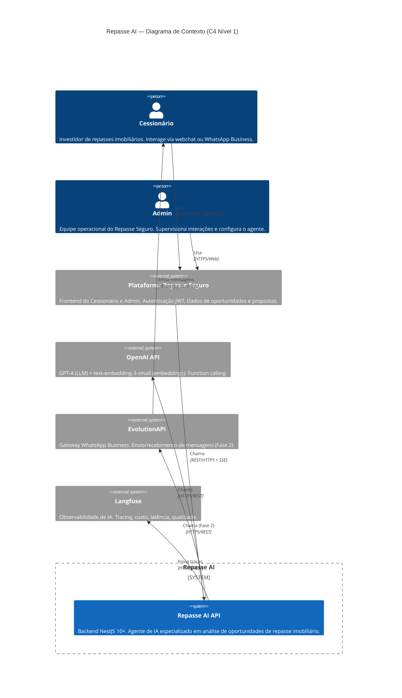
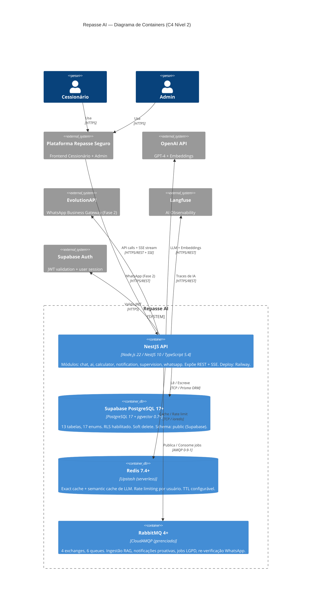
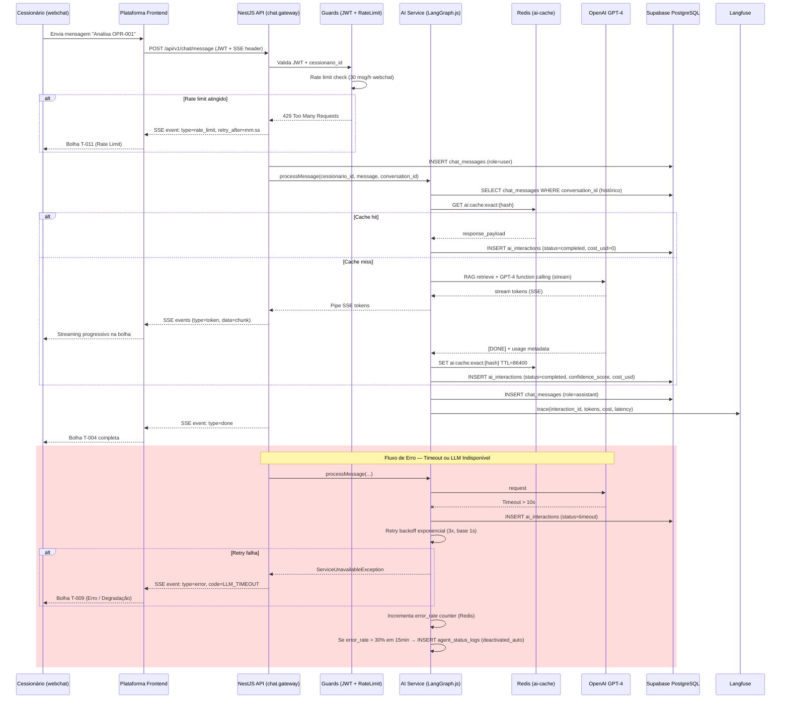
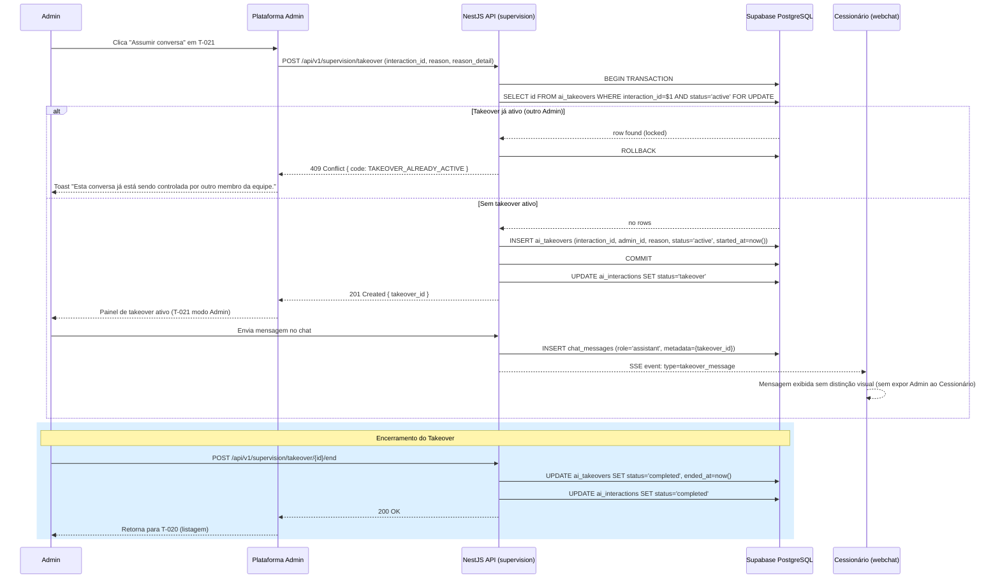
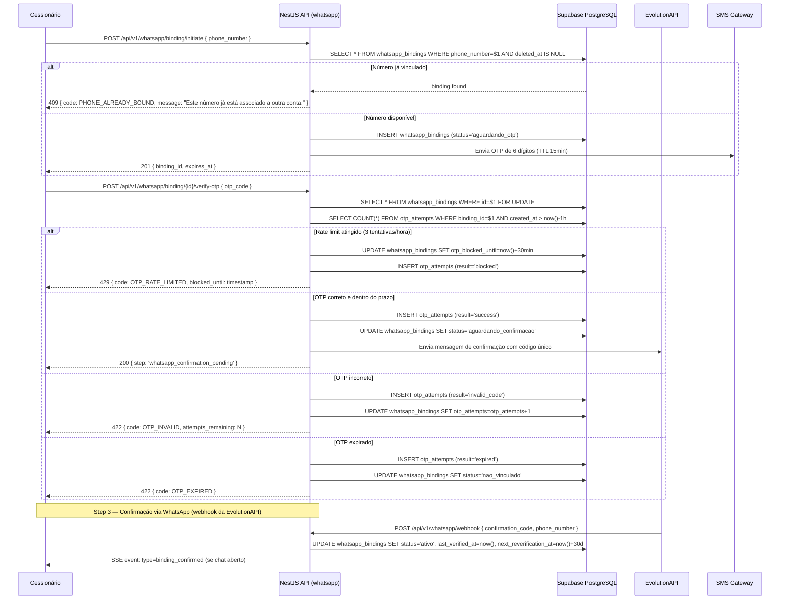
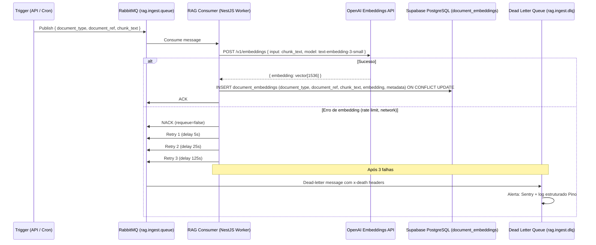
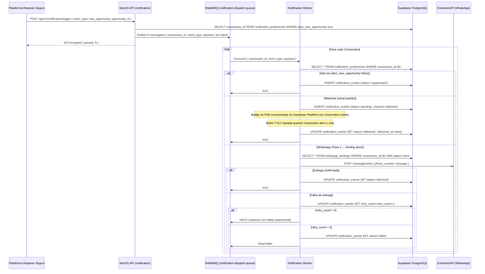
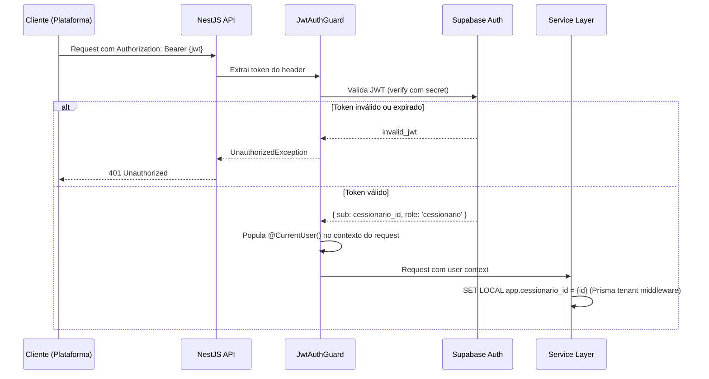

# Repasse AI
## 14 — Especificações Técnicas

| Campo | Valor |
|---|---|
| **Destinatário** | Arquitetura e Engenharia |
| **Escopo** | Documento de arquitetura interna com módulos, fluxos, containers, filas e decisões arquiteturais |
| **Versão** | v1.0 |
| **Responsável** | Claude Code Desktop |
| **Data da versão** | 22/03/2026 00:00 (America/Fortaleza) |
| **Status** | Ativo |
| **Fase** | 2 — Produto |
| **Área** | Backend / Arquitetura |
| **Referências** | 01 - Regras de Negócio · 02 - Stacks · 05 - PRD · 06 - Mapa de Telas · 10 - Glossário · 12 - Modelo de Dados · 13 - Schema Prisma |

---

> 📌 **TL;DR**
>
> - **Padrão arquitetural:** Módulo backend puro (PG-03) com NestJS 10+ / TypeScript strict. Arquitetura hexagonal por domínio. Sem frontend próprio — expõe API REST + SSE.
> - **8 containers:** NestJS API (Railway), Supabase PostgreSQL 17+ (pgvector), Redis 7.4+ (Upstash), RabbitMQ 4+ (CloudAMQP), OpenAI API, EvolutionAPI (Fase 2), Langfuse, Supabase Auth.
> - **6 fluxos críticos documentados:** análise de oportunidade (happy path + erro), chat SSE (streaming + fallback), vinculação WhatsApp OTP, takeover Admin (mutex), ingestão RAG, notificação proativa.
> - **Cache Redis:** exact cache (TTL 24h) + semantic cache (TTL 1h) com chaves compostas `ai:cache:{tipo}:{hash}`.
> - **Filas RabbitMQ:** 4 exchanges, 6 queues, todas com DLQ e retry exponencial (max 3 tentativas).
> - **ADRs mais impactantes:** backend puro sem frontend (ADR-001), LangGraph.js para fluxo stateful (ADR-002), pgvector inline sem vector store externo (ADR-003), Railway para deploy (ADR-004).
> - **Pendências:** 0 — todas as decisões tomadas autonomamente.

---

## 1. Arquitetura Geral (C4 Nível 1)

### 1.1 Diagrama de Contexto



### 1.2 Atores e Responsabilidades

| Ator | Tipo | Interação com o Repasse AI |
|------|------|---------------------------|
| **Cessionário** | Pessoa | Via webchat (SSE streaming) ou WhatsApp Business (Fase 2); herda sessão da plataforma |
| **Admin** | Pessoa | Via painel Admin da plataforma (REST); supervisão, takeover, configuração |
| **Plataforma Repasse Seguro** | Sistema externo | Autenticação JWT; dados de oportunidades, Cessionários e propostas; FAB + chat UI no frontend |
| **OpenAI API** | Serviço externo | GPT-4 para geração de respostas; text-embedding-3-small para RAG |
| **EvolutionAPI** | Serviço externo (Fase 2) | Gateway WhatsApp Business; envio/recebimento de mensagens |
| **Langfuse** | Serviço externo | Coleta de traces de IA; métricas de custo, latência, qualidade |

---

## 2. Diagrama de Containers (C4 Nível 2)



### 2.1 Especificação dos Containers

| Container | Tecnologia | Deploy | Responsabilidade |
|-----------|-----------|--------|-----------------|
| **NestJS API** | Node.js 22 LTS, NestJS 10+, TypeScript 5.4 strict | Railway (Docker, auto-deploy GitHub) | Toda lógica de negócio, endpoints REST, SSE streaming, orquestração de agentes |
| **Supabase PostgreSQL** | PostgreSQL 17+, pgvector 0.7+ | Supabase (gerenciado, 3 projetos: dev/staging/prod) | Persistência de dados, RLS, embeddings vetoriais |
| **Redis** | Redis 7.4+ | Upstash serverless | Cache exact/semantic de LLM, rate limiting por cessionario_id |
| **RabbitMQ** | RabbitMQ 4+ | CloudAMQP (gerenciado) | Processamento assíncrono: RAG ingestion, notificações, LGPD jobs, WhatsApp re-verification |

---

## 3. Estrutura de Módulos do Backend

### 3.1 Organização por Domínio

```
apps/ai/src/
├── modules/
│   ├── ai/                     # Domínio: Agente IA
│   │   ├── ai.module.ts
│   │   ├── ai.service.ts
│   │   ├── ai.config.ts
│   │   ├── llm/
│   │   │   ├── llm.service.ts          # GPT-4 calls, streaming, function calling
│   │   │   └── llm.types.ts
│   │   ├── rag/
│   │   │   ├── rag.service.ts          # Retrieval pipeline
│   │   │   ├── rag.ingest.ts           # Document ingestion (consumer RabbitMQ)
│   │   │   └── rag.retrieve.ts         # Vector similarity search ($queryRaw)
│   │   ├── agents/
│   │   │   └── repasse-ai/
│   │   │       ├── repasse-ai.agent.ts         # LangGraph.js stateful graph
│   │   │       ├── repasse-ai.tools.ts         # Function calling definitions
│   │   │       └── repasse-ai.types.ts
│   │   ├── prompts/
│   │   │   └── repasse-ai/
│   │   │       ├── repasse-ai-system.prompt.ts
│   │   │       ├── repasse-ai-user.prompt.ts
│   │   │       ├── repasse-ai-tools.ts
│   │   │       └── repasse-ai-guardrails.ts
│   │   ├── cache/
│   │   │   └── ai-cache.service.ts     # Exact + semantic cache
│   │   └── observability/
│   │       └── langfuse.service.ts
│   │
│   ├── chat/                   # Domínio: Chat / Histórico
│   │   ├── chat.module.ts
│   │   ├── chat.service.ts             # CRUD conversas e mensagens
│   │   ├── chat.controller.ts          # Endpoints REST
│   │   ├── chat.gateway.ts             # SSE streaming endpoint
│   │   └── dto/
│   │
│   ├── calculator/             # Domínio: Calculadora de Comissão (determinístico)
│   │   ├── calculator.module.ts
│   │   ├── calculator.service.ts       # Cálculo: Delta, comissão, Escrow, ROI
│   │   ├── calculator.controller.ts
│   │   └── dto/
│   │
│   ├── notification/           # Domínio: Notificações Proativas
│   │   ├── notification.module.ts
│   │   ├── notification.service.ts     # Dispatch de alertas (webchat + WhatsApp)
│   │   ├── notification.controller.ts  # Preferências do Cessionário
│   │   └── dto/
│   │
│   ├── supervision/            # Domínio: Supervisão Admin + Takeover
│   │   ├── supervision.module.ts
│   │   ├── supervision.service.ts      # Listagem, filtros, takeover mutex
│   │   ├── supervision.controller.ts
│   │   └── dto/
│   │
│   └── whatsapp/               # Domínio: WhatsApp Binding (Fase 2)
│       ├── whatsapp.module.ts
│       ├── whatsapp.service.ts         # OTP, binding, EvolutionAPI
│       ├── whatsapp.controller.ts
│       └── dto/
│
├── common/
│   ├── decorators/             # @CurrentUser(), @RequireRole()
│   ├── filters/                # GlobalExceptionFilter, HttpExceptionFilter
│   ├── guards/                 # JwtAuthGuard, CessionarioGuard, AdminGuard
│   ├── interceptors/           # LoggingInterceptor, TransformInterceptor
│   └── pipes/                  # ValidationPipe global
│
├── config/                     # ConfigModule — env vars tipadas
├── jobs/                       # Jobs agendados (retenção, re-verificação, purgação)
├── prisma/                     # schema.prisma, seed.ts, rls/, middleware/
├── app.module.ts
└── main.ts
```

### 3.2 Padrão por Módulo

Cada módulo de domínio segue estritamente:

```
{dominio}.module.ts       → @Module — imports, providers, exports, controllers
{dominio}.controller.ts   → @Controller — endpoints REST; delega para service; sem lógica de negócio
{dominio}.service.ts      → lógica de negócio; injeta repository (Prisma), cache (Redis), filas (RabbitMQ)
{dominio}.gateway.ts      → SSE endpoint (apenas módulo chat) — streaming de tokens
dto/                      → CreateDto, UpdateDto, ResponseDto; validação com class-validator
tests/                    → *.spec.ts (Vitest unit) + *.e2e-spec.ts (Supertest integration)
```

### 3.3 Responsabilidades por Módulo

| Módulo | Responsabilidade Principal | Dependências Internas | Dependências Externas |
|--------|---------------------------|----------------------|----------------------|
| **ai** | Orquestração LangGraph.js, RAG, cache LLM, Langfuse | chat, calculator | OpenAI API, Langfuse |
| **chat** | Histórico de conversas, SSE streaming, consentimento LGPD | ai | Prisma (chat_conversations, chat_messages) |
| **calculator** | Cálculos determinísticos: Δ, comissão, Escrow, ROI | — | Nenhuma (pure functions) |
| **notification** | Alertas proativos, preferências, dispatch por canal | whatsapp | RabbitMQ, Prisma (notification_*) |
| **supervision** | Painel Admin, métricas, takeover com mutex | ai, chat | Prisma (ai_interactions, ai_takeovers) |
| **whatsapp** | Vinculação OTP, EvolutionAPI, re-verificação | notification | EvolutionAPI, RabbitMQ |

### 3.4 Injeção de Dependências (Guards e Interceptors Globais)

```typescript
// main.ts — configuração global obrigatória
app.useGlobalPipes(new ValidationPipe({ transform: true, whitelist: true }));
app.useGlobalFilters(new GlobalExceptionFilter());
app.useGlobalInterceptors(new LoggingInterceptor(), new TransformInterceptor());

// Ordem de execução por request:
// 1. JwtAuthGuard (valida JWT da plataforma)
// 2. CessionarioGuard | AdminGuard (RBAC por role)
// 3. RateLimitGuard (@nestjs/throttler — por cessionario_id)
// 4. ValidationPipe (class-validator nos DTOs)
// 5. Controller → Service → Prisma (com soft delete middleware)
// 6. TransformInterceptor (wrap em { success, data, meta })
// 7. LoggingInterceptor (Pino — request_id, cessionario_id, latência)
```

---

## 4. Fluxos Internos Críticos

### 4.1 Fluxo: Análise de Oportunidade (Happy Path + Erro)



### 4.2 Fluxo: Takeover Admin (Mutex via SELECT FOR UPDATE)



### 4.3 Fluxo: Vinculação WhatsApp OTP (Happy Path + Bloqueio)



### 4.4 Fluxo: Ingestão RAG (Assíncrono via RabbitMQ)



### 4.5 Fluxo: Notificação Proativa (Alerta de Nova Oportunidade)



### 4.6 Autenticação por Request



---

## 5. Estratégia de Cache

### 5.1 Tabela de Cache

| Recurso | Chave | TTL | Invalidação | Cache Miss | Cache Indisponível |
|---------|-------|-----|-------------|-----------|-------------------|
| **LLM Exact Cache** (cálculos determinísticos) | `ai:cache:exact:{sha256(model+prompt_version+input)}` | 24h | Mudança de `model_version` ou `prompt_version` → `DEL ai:cache:exact:*` por padrão de chave | Chama OpenAI diretamente + popula cache | Chama OpenAI diretamente; alerta Sentry; sem fallback |
| **LLM Semantic Cache** (suporte operacional, temperature=0) | `ai:cache:semantic:{embedding_hash}` | 1h | Mudança de prompt ou modelo; ou expiração por TTL | RAG retrieve + OpenAI + popula cache | Chama OpenAI diretamente |
| **Rate Limit Webchat** | `ratelimit:webchat:{cessionario_id}` | 1h (deslizante) | Automática (TTL por sliding window) | Contagem começa do zero | Assumir rate 0 (permissive); alerta Sentry |
| **Rate Limit WhatsApp** | `ratelimit:whatsapp:{cessionario_id}` | 1h (deslizante) | Automática | Contagem começa do zero | Assumir rate 0 (permissive) |
| **OTP Bloqueio** | `otp:blocked:{binding_id}` | 30min | Expiração por TTL | OTP desbloqueado | DB como fallback — verificar `otp_blocked_until` |
| **Agent Config** | `agent:config:{key}` | 5min | Atualização via Admin endpoint + `DEL agent:config:{key}` | Lê do banco + popula cache | Lê do banco diretamente |

### 5.2 Regras Gerais de Caching

```
1. Cache key sempre inclui versão do modelo e versão do prompt.
2. Nunca cachear respostas com temperatura > 0 (não determinísticas).
3. Semantic cache: similaridade coseno > 0.92 → cache hit. [DECISÃO AUTÔNOMA — threshold 0.92 balanceia precisão e taxa de hit; alternativa descartada: 0.85 (muito permissiva para análises financeiras).]
4. Cache miss: executar pipeline completo, então inserir no cache SOMENTE se status=completed.
5. Respostas com status=error ou status=timeout NUNCA são cacheadas.
6. Redis indisponível: operação continua sem cache; alertar Sentry; não bloquear request.
```

---

## 6. Estratégia de Filas (RabbitMQ)

### 6.1 Exchanges e Queues

| Exchange | Tipo | Queues | Responsabilidade |
|----------|------|--------|-----------------|
| `repasse.ai.rag` | `direct` | `rag.ingest.queue` + `rag.ingest.dlq` | Ingestão de documentos para pgvector |
| `repasse.ai.notification` | `direct` | `notification.dispatch.queue` + `notification.dispatch.dlq` | Dispatch de alertas proativos |
| `repasse.ai.lgpd` | `direct` | `lgpd.anonymize.queue` + `lgpd.anonymize.dlq` | Anonimização de chat_messages (≤ 48h LGPD) |
| `repasse.ai.whatsapp` | `direct` | `whatsapp.reverification.queue` + `whatsapp.reverification.dlq` | Job de re-verificação periódica (30 dias) |

### 6.2 Configuração por Queue

| Queue | Max Retries | Retry Delay | DLQ | Idempotência |
|-------|-------------|-------------|-----|-------------|
| `rag.ingest.queue` | 3 | Exp: 5s / 25s / 125s | `rag.ingest.dlq` | `document_ref` + `chunk_index` como dedup key |
| `notification.dispatch.queue` | 5 | Exp: 10s / 30s / 90s / 270s / 810s | `notification.dispatch.dlq` | `notification_event_id` como dedup key |
| `lgpd.anonymize.queue` | 3 | Exp: 30s / 90s / 270s | `lgpd.anonymize.dlq` | `chat_message_id` como dedup key |
| `whatsapp.reverification.queue` | 3 | Exp: 60s / 300s / 1500s | `whatsapp.reverification.dlq` | `binding_id` + `reverification_date` como dedup key |

### 6.3 Configuração DLQ

```typescript
// Configuração de filas com Dead Letter Exchange (RabbitMQ)
channel.assertQueue('rag.ingest.queue', {
  durable: true,
  arguments: {
    'x-dead-letter-exchange': 'repasse.ai.rag.dlx',
    'x-dead-letter-routing-key': 'rag.ingest.dead',
    'x-message-ttl': 86400000, // 24h — mensagem expira se não processada
  },
});

// DLQ: monitoramento via Sentry + alerta Slack para mensagens mortas
// Retry manual de DLQ: via script de re-enqueue no runbook operacional
```

### 6.4 Monitoramento de Filas

- **CloudAMQP Management UI**: monitoramento de depth de queue em tempo real.
- **Alerta automático:** depth > 100 mensagens em `notification.dispatch.queue` → alerta Slack Admin.
- **DLQ threshold:** DLQ com > 10 mensagens → alerta Sentry P1.
- **Langfuse**: tracking de jobs de RAG para correlacionar latência de ingestão com qualidade de retrieval.

---

## 7. ADRs (Architecture Decision Records)

### ADR-001: Backend Puro sem Frontend Próprio

- **Contexto:** O Repasse AI é um módulo de IA que opera dentro do ecossistema Repasse Seguro, servindo Cessionários e Admins já autenticados na plataforma principal.
- **Decisão:** Repasse AI é um serviço backend puro (PG-03). Expõe API REST + SSE. Sem frontend web, mobile, landing page ou dashboard próprio.
- **Alternativas:** (A) Backend puro — escolhida. (B) Microserviço com frontend embutido (BFF pattern).
- **Justificativa:** O Repasse AI é consumido por múltiplos frontends (Cessionário + Admin) que já existem na plataforma. BFF aumentaria complexidade sem benefício claro. Backend puro mantém separação de responsabilidades e evita duplicação de lógica de autenticação.
- **Consequências:** Todo desenvolvimento de UI ocorre na plataforma principal, não no repositório do Repasse AI. O time de frontend da plataforma consome a API do Repasse AI.

---

### ADR-002: LangGraph.js para Fluxo Stateful do Agente

- **Contexto:** O agente Repasse AI tem fluxos de decisão com branching complexo: análise individual vs. comparativa vs. simulação vs. portfólio vs. suporte; score de confiança que determina elegibilidade de takeover; estado de conversa persistente entre mensagens.
- **Decisão:** LangGraph.js 0.2+ para orquestrar o grafo de estados do agente.
- **Alternativas:** (A) LangGraph.js — escolhida. (B) LangChain.js Agent sem estado explícito. (C) Implementação manual com switch/case.
- **Justificativa:** LangGraph.js é a única opção da stack que oferece fluxo stateful com checkpoints, loops controlados e branching tipado em TypeScript. LangChain.js Agent sem LangGraph não mantém estado entre turns; implementação manual é frágil e não testável.
- **Consequências:** Dependência de LangGraph.js 0.2+. Estado do agente serializado no contexto da conversa (em memória por turn; persistido em `chat_messages.metadata` entre turns). Complexidade de debug maior — mitigada por Langfuse tracing.

---

### ADR-003: pgvector Inline (sem Vector Store Externo)

- **Contexto:** O RAG do Repasse AI precisa de um vector store para embeddings de documentos da plataforma (regras, FAQ, dados de mercado).
- **Decisão:** Supabase pgvector no mesmo PostgreSQL como vector store.
- **Alternativas:** (A) pgvector inline — escolhida. (B) Pinecone. (C) Qdrant.
- **Justificativa:** Supabase pgvector já está na stack (Stacks doc). Para volume esperado (< 100k chunks), IVFFlat (lists=100) é suficiente. Elimina custo e complexidade de outro serviço. Queries híbridas (vetorial + SQL com filtros) são mais eficientes no mesmo banco.
- **Consequências:** Queries de similaridade via `$queryRaw` (Prisma não suporta tipo `vector` nativamente). Índice IVFFlat aplicado via `indexes.sql` (ver D13 — Schema Prisma). Reavaliação necessária se volume superar 500k chunks.

---

### ADR-004: Railway para Deploy do NestJS

- **Contexto:** O Repasse AI precisa de hosting com baixa latência (SLA ≤ 5s para resposta inicial) e deploy Docker automatizado via GitHub.
- **Decisão:** Railway para deploy do NestJS API.
- **Alternativas:** (A) Railway — escolhida. (B) Render. (C) VPS (DigitalOcean/AWS EC2).
- **Justificativa:** Railway não tem cold starts (containers sempre quentes), o que é crítico para o SLA de latência de IA. Render tem cold starts inaceitáveis. VPS tem overhead operacional alto para equipe de desenvolvimento ágil.
- **Consequências:** Dependência de Railway como plataforma de deploy. Custo previsível (não serverless). Deploy automático via `railway up` no pipeline GitHub Actions.

---

### ADR-005: Vercel AI SDK para Streaming SSE

- **Contexto:** O webchat precisa de streaming progressivo de tokens (SSE) do agente para o frontend.
- **Decisão:** Vercel AI SDK 4.x+ gerencia o streaming SSE no endpoint NestJS.
- **Alternativas:** (A) Vercel AI SDK — escolhida. (B) SSE manual com `res.write()` e `EventEmitter`. (C) WebSocket.
- **Justificativa:** Vercel AI SDK integra nativamente com OpenAI streaming, gerencia back-pressure, oferece `streamText()` e `streamObject()` com tipos TypeScript. SSE manual é frágil. WebSocket é overkill para comunicação unidirecional.
- **Consequências:** Todos os endpoints de chat com streaming usam `Vercel AI SDK`. Endpoints de análise não-streaming usam `OpenAI SDK` diretamente.

---

### ADR-006: Isolamento de Dados em 3 Camadas

- **Contexto:** LGPD e RN-001 a RN-004 exigem isolamento total de dados entre Cessionários.
- **Decisão:** 3 camadas de isolamento: (1) filtro de query por `cessionario_id`, (2) filtro de contexto do prompt, (3) guardrails no system prompt.
- **Alternativas:** (A) 3 camadas — escolhida. (B) RLS no banco como única camada. (C) Apenas filtro de query.
- **Justificativa:** Defesa em profundidade. RLS como única camada é insuficiente para ataques de prompt injection. Filtro de query sem guardrail deixa brechas se o agente "imaginar" dados fora do contexto fornecido. As 3 camadas juntas cobrem vetores de ataque distintos.
- **Consequências:** Cada request de chat executa `withTenant()` (ver D13); contexto do prompt é construído apenas com dados filtrados por `cessionario_id`; system prompt contém instruções explícitas de recusa com exemplos.

---

## 8. Requisitos Não-Funcionais

### 8.1 Performance

| Métrica | Meta | Mecanismo |
|---------|------|-----------|
| Resposta inicial (chat) | ≤ 5s (p50: ≤ 3s, p95: ≤ 5s, p99: ≤ 8s) | Streaming SSE — primeiro token antes do fim da geração |
| Timeout total (chat) | 10s | `agent_sla_timeout_ms` configurável via `agent_configurations` |
| Cálculo determinístico (Calculadora) | ≤ 200ms | Pure function, sem LLM |
| RAG retrieval (pgvector) | ≤ 50ms para k=5 | IVFFlat index, lists=100 |
| Cache hit (exact) | ≤ 5ms | Redis Upstash, mesma região |
| Benchmark pré-lançamento | 50 consultas reais em staging: p50 ≤ 3s, p95 ≤ 5s | Requisito obrigatório de lançamento |

### 8.2 Escalabilidade

```
Estratégia: horizontal (múltiplas instâncias Railway) + vertical (Redis/PostgreSQL gerenciado).

Repasse AI API (NestJS):
  - Stateless: múltiplas instâncias Railway sem compartilhamento de estado local
  - Redis compartilhado para rate limit e cache (cluster Redis em produção)
  - RabbitMQ: consumidores podem ser escalados horizontalmente

PostgreSQL (Supabase):
  - Supabase Pro com connection pooling (PgBouncer embutido)
  - Read replicas disponíveis para queries de leitura intensiva (Admin dashboard)
  [DECISÃO AUTÔNOMA — read replica não habilitada no lançamento inicial; ativar se p95 de queries Admin > 500ms]

Ponto de atenção: LangGraph.js mantém estado em memória durante o turn. Em múltiplas instâncias,
o contexto é re-construído a partir do banco a cada request (stateless por design de API).
```

### 8.3 Disponibilidade

| Componente | SLA Esperado | Estratégia de Resiliência |
|------------|-------------|--------------------------|
| NestJS API (Railway) | 99.5% | Auto-restart por Railway; health check endpoint `/health` |
| Supabase PostgreSQL | 99.9% (Supabase SLA) | Backups automáticos diários; PITR (point-in-time recovery) |
| Redis (Upstash) | 99.9% (Upstash SLA) | Fallback para consulta direta ao banco em caso de indisponibilidade |
| RabbitMQ (CloudAMQP) | 99.9% | Mensagens persistentes (`durable: true`); DLQ para falhas |
| OpenAI API | Sem SLA garantido | Retry com backoff exponencial (3x); fallback Calculadora de Comissão |

**Kill switch de IA:**
- Feature flag via PostHog (ou variável de ambiente) para desligar o agente instantaneamente em produção.
- Desligamento automático: taxa de erro > 30% em 15 minutos → `INSERT agent_status_logs (deactivated_auto)` + alerta Admin.
- Re-ativação: manual pelo Admin via `/api/v1/supervision/agent/activate`.

### 8.4 Segurança

| Requisito | Implementação | RN de Referência |
|-----------|--------------|-----------------|
| Autenticação | JWT da plataforma principal validado via Supabase Auth | RN-007 |
| Autorização (RBAC) | `CessionarioGuard` + `AdminGuard` em cada controller | RN-001 a RN-004 |
| Isolamento de dados | 3 camadas: query filter + context filter + guardrails | RN-001 a RN-004 |
| Prompt injection | Delimitadores `<user_input>`, sanitização, validação de tool params | RN-037, RN-038 |
| Content filtering | OpenAI Moderation API em cada input | RN-004 |
| PII masking | CPF, senhas, dados de pagamento nunca enviados ao LLM | RN-001, RN-002 |
| Rate limiting | `@nestjs/throttler` por `cessionario_id` + Redis sliding window | RN-025, RN-046 |
| SQL injection | Prisma query builder tipado + `$queryRaw` apenas com parâmetros preparados | — |
| HTTPS | Obrigatório em todos os ambientes (Railway + Supabase + Upstash) | — |
| Secrets | Variáveis de ambiente (`.env`); `.env.example` em todo repo; `.env` no `.gitignore` | — |
| Error tracking | Sentry `@sentry/nestjs` 9.x+; source maps em produção | — |

---

## 9. Changelog

| Versão | Data | Autor | Descrição |
|--------|------|-------|-----------|
| v1.0 | 22/03/2026 | Claude Code Desktop — Pipeline ShiftLabs v9.5 | Criação. Diagramas C4 nível 1 e 2. 6 módulos de domínio documentados. 6 fluxos críticos com sequência completa (happy path + erro). Estratégia de cache Redis com 6 recursos. Estratégia de filas RabbitMQ com 4 exchanges e DLQ. 6 ADRs. RNFs completos (performance, escalabilidade, disponibilidade, segurança). |

---

## 10. Backlog de Pendências

| Item | Marcador | Seção | Justificativa / Trade-off | Impacto | Dono | Status |
|------|---------|-------|--------------------------|---------|------|--------|
| Semantic cache threshold = 0.92 | [DECISÃO AUTÔNOMA] | 5 | Balanceia precisão e taxa de hit para análises financeiras; threshold 0.85 descartado (muito permissivo) | P2 | Backend | Aplicado |
| Read replica PostgreSQL não habilitada no lançamento | [DECISÃO AUTÔNOMA] | 8.2 | Volume inicial não justifica complexidade adicional; ativar se p95 Admin > 500ms | P2 | DevOps | Aplicado |
| LangGraph.js estado re-construído a cada request (stateless API) | [DECISÃO AUTÔNOMA] | 8.2 | Multi-instância Railway exige stateless; contexto re-construído do banco por turn; alternativa (sticky sessions) descartada por complexidade de infra | P1 | Backend | Aplicado |

---

*Especificações Técnicas v1.0 concluído. Cobertura: C4 L1+L2, 6 módulos, 6 fluxos críticos, cache Redis, filas RabbitMQ (4 exchanges), 6 ADRs, RNFs completos. Status: APROVADO. Próximo documento do pipeline: D11 — Mobile.*
