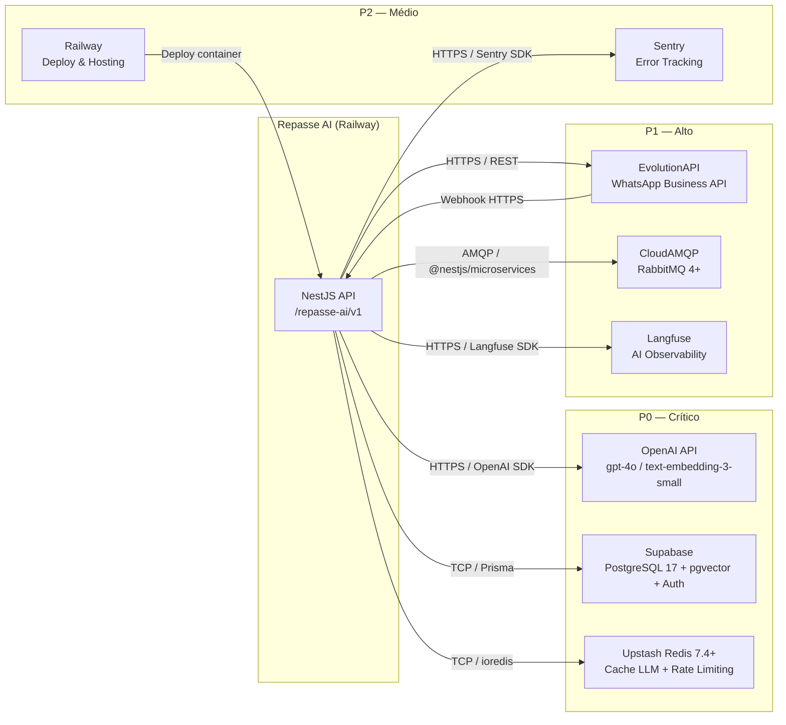

# Repasse AI
## 17 — Integrações Externas

| Campo | Valor |
|---|---|
| **Destinatário** | Backend, Arquitetura e Operação |
| **Escopo** | Mapa de dependências externas com APIs, SDKs, webhooks, quotas, fallback e criticidade |
| **Módulo** | Repasse AI |
| **Versão** | v1.0 |
| **Responsável** | Claude Code Desktop |
| **Data** | 22/03/2026 00:00 (America/Fortaleza) |

---

> 📌 **TL;DR**
>
> - **Total de integrações mapeadas:** 8 integrações externas.
> - **Por criticidade:** P0: 3 (OpenAI, Supabase, Redis/Upstash) · P1: 3 (EvolutionAPI, RabbitMQ/CloudAMQP, Langfuse) · P2: 2 (Sentry, Railway).
> - **Integrações sem fallback:** OpenAI (P0) — degradação graceful com mensagem de indisponibilidade, sem fallback de modelo alternativo. [DECISÃO AUTÔNOMA] documentada inline.
> - **Provedores com SLA documentado:** Supabase (99.9%), Upstash Redis (99.99%), CloudAMQP (99.5%), Railway (99.9%).
> - **Dependências críticas para o core:** OpenAI (análise do agente), Supabase (persistência), Redis (cache LLM + rate limiting).
> - **Webhook externo recebido:** EvolutionAPI → Repasse AI (confirmação de vinculação WhatsApp).
> - **Seções pendentes:** 0. 4 decisões autônomas aplicadas (marcadas inline).

---

## 1. Diagrama de Dependências



---

## 2. Fichas de Integração

---

### 2.1 OpenAI API

🔴 **Criticidade: P0**

| Campo | Valor |
|---|---|
| **Finalidade** | LLM principal (GPT-4o) para respostas do agente; Embeddings (text-embedding-3-small) para RAG e cache semântico |
| **Tipo de conexão** | HTTPS REST + OpenAI Node.js SDK (`openai` npm package) |
| **Base URL** | `https://api.openai.com/v1` |
| **Autenticação** | API Key via `OPENAI_API_KEY` |
| **SDK** | `openai@latest` (Node.js SDK) |

**Endpoints consumidos:**

| Método | Endpoint | Uso |
|---|---|---|
| `POST` | `/chat/completions` | Geração de resposta do agente (streaming) |
| `POST` | `/embeddings` | Geração de embeddings para RAG e cache semântico |

**Dados trafegados:**

- **Envia:** mensagem do usuário (após PII masking), histórico da conversa (max 20 mensagens), ferramentas disponíveis (calculate_delta, calculate_roi, etc.), prompt do sistema com `cessionario_id` (sem dados PII).
- **Recebe:** tokens de resposta em streaming, tool calls com argumentos, finish_reason.

> ⚙️ **PII Masking obrigatório:** Antes de qualquer chamada à OpenAI, dados PII (CPF, nome, e-mail, telefone) são substituídos por tokens `[PII_TYPE]`. Nunca enviar dados PII para o modelo.

**Rate limits / Quotas:**

| Tier | TPM (tokens por minuto) | RPM (requests por minuto) |
|---|---|---|
| Tier 3 (padrão) | 800.000 TPM (GPT-4o) | 5.000 RPM |
| Embeddings | 3.000.000 TPM | 3.000 RPM |

**SLA do provedor:** 99.9% uptime (sem SLA financeiro explícito na API pública).

**Retry policy:**
- 3 tentativas com backoff exponencial: 1s → 2s → 4s.
- Timeout por request: 30s (análise), 5s (embeddings).
- Em caso de `429 RateLimitError`: aguarda `Retry-After` do header (mínimo 1s).
- Em caso de `500/503`: retry imediato com backoff.

**Fallback:**
- Sem modelo alternativo configurado. [DECISÃO AUTÔNOMA] — Não há fallback para outro provedor (Anthropic, Gemini). Justificativa: custo de manter contextos duais de treinamento/prompts + inconsistência de respostas entre modelos seria maior que o risco de indisponibilidade da OpenAI (SLA 99.9%). Alternativa descartada: fallback para GPT-3.5-turbo (qualidade insuficiente para análise financeira). Contingência: circuit breaker + kill switch + mensagem de degradação para o usuário.
- **Comportamento quando falha:** exibe T-009 (Bolha Erro/Degradação). Usuário vê: *"Agente temporariamente indisponível. Tente novamente em instantes."*
- **Kill switch:** variável `FEATURE_LLM_ENABLED=false` desabilita o módulo de IA; API retorna 503 com mensagem de manutenção.

**Módulos dependentes:** `AiModule`, `ChatModule`

---

### 2.2 Supabase (PostgreSQL + Auth)

🔴 **Criticidade: P0**

| Campo | Valor |
|---|---|
| **Finalidade** | Banco relacional principal (13 entidades), pgvector para RAG, Auth para validação de JWT da plataforma Cessionário |
| **Tipo de conexão** | TCP / Prisma ORM + Supabase JS SDK (auth only) |
| **Base URL (DB)** | `postgresql://postgres.{project_ref}:@aws-0-{region}.pooler.supabase.com:6543/postgres` (via connection pooler) |
| **Base URL (API)** | `https://{project_ref}.supabase.co` |
| **Autenticação (DB)** | Connection string via `DATABASE_URL` |
| **Autenticação (Auth)** | `SUPABASE_URL` + `SUPABASE_SERVICE_ROLE_KEY` (apenas para validação server-side) |

**Endpoints consumidos:**

| Tipo | Descrição |
|---|---|
| TCP Prisma | Queries CRUD + `$queryRaw` para pgvector similarity search |
| `GET /auth/v1/user` | Validação de JWT Cessionário via Supabase Auth |

**Dados trafegados:**

- **Envia:** queries SQL via Prisma (com RLS ativo via `SET LOCAL app.cessionario_id`), tokens JWT para validação.
- **Recebe:** resultados de queries, payload do usuário autenticado.

**Rate limits / Quotas:**

| Recurso | Limite (Plano Pro) |
|---|---|
| Conexões simultâneas | 60 (connection pooler) |
| Auth API requests | 10.000 req/hora |
| Armazenamento | 100 GB (banco) |

**SLA do provedor:** 99.9% uptime (SLA financeiro no Plano Pro).

**Connection Pool:** PgBouncer via Supabase Pooler (modo Transaction). `pool_min: 2`, `pool_max: 10` por instância Railway.

**Retry policy:**
- Prisma: 3 tentativas com backoff 500ms → 1s → 2s em `PrismaClientKnownRequestError` com código `P1001` (connection refused) ou `P1002` (timeout).
- Auth: sem retry automático — 401/403 são erros definitivos.

**Fallback:**
- Sem banco alternativo. Em caso de indisponibilidade total do Supabase: serviço retorna 503 em todos os endpoints. Circuit breaker ativa modo degradado global.
- **Comportamento quando falha:** health check retorna `degraded`. Todos os endpoints retornam `503 Service Unavailable`. Log Sentry + alerta PagerDuty.

**Módulos dependentes:** Todos os módulos (via `DatabaseModule`).

---

### 2.3 Upstash Redis

🔴 **Criticidade: P0**

| Campo | Valor |
|---|---|
| **Finalidade** | Cache de LLM (exato + semântico), rate limiting por usuário (webchat 30 msg/h + WhatsApp 20 msg/h), cache de OTP de WhatsApp, cache de métricas Admin |
| **Tipo de conexão** | TCP / `ioredis` Node.js client |
| **Endpoint** | `redis://:PASSWORD@{host}.upstash.io:6379` via `REDIS_URL` |
| **Autenticação** | Password incluído na `REDIS_URL` (TLS obrigatório em produção) |

**Comandos Redis utilizados:**

| Comando | Uso |
|---|---|
| `GET` / `SET` / `SETEX` | Cache de LLM (exact e semantic), OTP, rate limiting |
| `INCR` / `EXPIRE` | Contador de rate limiting por janela deslizante |
| `DEL` | Invalidação de cache ao atualizar prompt version |
| `SCAN` | Limpeza de cache expirado (background job) |

**Dados trafegados:**
- **Envia:** chaves Redis conforme padrão `repasse-ai:{cessionario_id}:{domínio}:{recurso}`, valores serializados em JSON.
- **Recebe:** valores JSON ou `null` (cache miss).

**Rate limits / Quotas (Upstash Pro):**

| Recurso | Limite |
|---|---|
| Comandos por segundo | 10.000 req/s |
| Bandwidth | 200 GB/mês |
| Tamanho máximo de valor | 512 MB |

**SLA do provedor:** 99.99% uptime (Upstash Pro).

**Retry policy:**
- 3 tentativas com backoff 200ms → 400ms → 800ms em caso de `ECONNREFUSED` ou `ETIMEDOUT`.
- Timeout de conexão: 2s.

**Fallback:**
- **Cache miss por indisponibilidade:** sistema trata como cache miss — requisição passa para o LLM sem cache. Performance degradada (maior latência + maior custo de tokens), mas funcionalidade mantida.
- **Rate limiting indisponível:** [DECISÃO AUTÔNOMA] — se Redis estiver indisponível, rate limiting é temporariamente desabilitado (fail open). Justificativa: bloquear todos os usuários por falha de Redis seria pior que um breve período sem rate limiting. Alternativa descartada: fail closed (bloqueia usuários — inaceitável). Duração máxima sem rate limiting: 5 minutos antes de circuit breaker global.

**Módulos dependentes:** `AiModule` (cache), `ChatModule` (rate limit), `WhatsappModule` (OTP, rate limit), `SupervisionModule` (métricas).

---

### 2.4 EvolutionAPI (WhatsApp Business)

💡 **Criticidade: P1**

| Campo | Valor |
|---|---|
| **Finalidade** | Envio de mensagens WhatsApp para Cessionários (notificações proativas + confirmação de vinculação), recebimento de webhooks de confirmação |
| **Tipo de conexão** | HTTPS REST + Webhooks recebidos |
| **Base URL** | `https://{host}.evolution-api.com` via `EVOLUTION_API_URL` |
| **Autenticação** | API Key via header `apikey: {EVOLUTION_API_KEY}` |

**Endpoints consumidos:**

| Método | Endpoint | Uso |
|---|---|---|
| `POST` | `/message/sendText/{instance}` | Envio de mensagem de texto para Cessionário |
| `GET` | `/instance/fetchInstances` | Verificação de saúde da instância |

**Webhook recebido:**

| Evento | Payload | Descrição |
|---|---|---|
| `message.upsert` | `{ key, message, messageTimestamp }` | Recebimento de mensagem do Cessionário para confirmação de vinculação |

**Validação de assinatura do webhook:**
```
Header: X-Evolution-Signature: sha256=HMAC_SHA256(body, EVOLUTION_WEBHOOK_SECRET)
```
Requisições sem assinatura válida retornam `401` sem processar.

**Dados trafegados:**
- **Envia:** número de destino E.164, texto da mensagem (sem PII além do número), tipo de notificação.
- **Recebe:** confirmação de envio (`{"status": "PENDING"}` + `messageId`), eventos de webhook de confirmação.

**Rate limits / Quotas:**

| Recurso | Limite |
|---|---|
| Mensagens por segundo | 5 msg/s por instância |
| Mensagens por dia | Sem limite documentado (sujeito a policy do WhatsApp Business) |

**SLA do provedor:** Sem SLA formal publicado. Estimativa: 99% uptime baseado em histórico.

**Retry policy:**
- 3 tentativas com backoff exponencial: 1s → 2s → 4s.
- Timeout: 15s por request.
- Mensagens falhas enfileiradas em `repasse.ai.notification.whatsapp.dlq` para processamento manual.

**Fallback:**
- Notificação proativa não entregue via WhatsApp: notificação mantida no banco com `status: FAILED`. Na próxima abertura do chat, alerta é entregue via webchat (ChatBubble).
- Vinculação WhatsApp em estado `PENDING_WHATSAPP`: se confirmação não chegar em 10 minutos, vinculação expira e retorna ao estado `OTP_SENT` com opção de reenvio.

**Módulos dependentes:** `WhatsappModule`, `NotificationModule`

---

### 2.5 CloudAMQP (RabbitMQ 4+)

💡 **Criticidade: P1**

| Campo | Valor |
|---|---|
| **Finalidade** | Fila de processamento assíncrono: ingestão de documentos para RAG, envio de notificações proativas, jobs LGPD (anonimização), processamento de webhooks WhatsApp |
| **Tipo de conexão** | AMQP 0-9-1 via `@nestjs/microservices` + `amqplib` |
| **URL de conexão** | `amqps://user:password@{host}.cloudamqp.com/{vhost}` via `AMQP_URL` |
| **Autenticação** | Incluída na `AMQP_URL` (TLS obrigatório — `amqps://`) |

**Exchanges e Queues configurados:**

| Exchange | Tipo | Queue | Routing Key | DLQ |
|---|---|---|---|---|
| `repasse.ai.rag` | direct | `repasse.ai.rag.ingest` | `ingest` | `repasse.ai.rag.ingest.dlq` |
| `repasse.ai.notification` | direct | `repasse.ai.notification.send` | `send` | `repasse.ai.notification.send.dlq` |
| `repasse.ai.notification` | direct | `repasse.ai.notification.whatsapp` | `whatsapp` | `repasse.ai.notification.whatsapp.dlq` |
| `repasse.ai.lgpd` | direct | `repasse.ai.lgpd.anonymize` | `anonymize` | `repasse.ai.lgpd.anonymize.dlq` |
| `repasse.ai.whatsapp` | direct | `repasse.ai.whatsapp.webhook` | `webhook` | `repasse.ai.whatsapp.webhook.dlq` |

**Dados trafegados:**
- **Publica:** eventos de ingestão de documento, eventos de notificação, eventos de anonimização LGPD.
- **Consome:** os mesmos eventos nas queues correspondentes.

**Rate limits / Quotas (CloudAMQP Little Lemur Pro):**

| Recurso | Limite |
|---|---|
| Conexões simultâneas | 100 |
| Mensagens por segundo | 10.000 msg/s |
| Tamanho máximo de mensagem | 128 MB |

**SLA do provedor:** 99.5% uptime (CloudAMQP Pro).

**Retry policy:**
- Exponential backoff: 3 → 5 → 10 → 20 → 40 segundos (máx 5 tentativas).
- Após 5 falhas: mensagem vai para DLQ correspondente.
- DLQ processada manualmente pelo time via painel CloudAMQP ou endpoint Admin.

**Fallback:**
- Se RabbitMQ estiver indisponível ao publicar mensagem: [DECISÃO AUTÔNOMA] — retry em memória com até 3 tentativas em 10s. Se ainda falhar, operação principal (ex: chat) é concluída mas processamento assíncrono (ex: RAG ingest) falha silenciosamente com log de erro. Alternativa descartada: falhar a operação principal por indisponibilidade de queue (UX inaceitável). Alerta Sentry para monitoramento de backlog.
- Notificações WhatsApp não enfileiradas: entregues na próxima abertura do chat via webchat.

**Módulos dependentes:** `AiModule` (RAG), `NotificationModule`, `WhatsappModule`

---

### 2.6 Langfuse

💡 **Criticidade: P1**

| Campo | Valor |
|---|---|
| **Finalidade** | Observabilidade de IA: tracing de chamadas LLM, custo por token, latência, qualidade, evals com golden dataset |
| **Tipo de conexão** | HTTPS / Langfuse Node.js SDK |
| **Base URL** | `https://cloud.langfuse.com` |
| **Autenticação** | `LANGFUSE_PUBLIC_KEY` + `LANGFUSE_SECRET_KEY` |

**SDK:** `langfuse@latest` (Node.js SDK)

**Dados trafegados:**
- **Envia:** trace de cada interação (input, output, tool calls, latência, custo estimado, modelo, temperatura, prompt version).
- **Recebe:** resultados de evals, pontuações de qualidade.

> ⚙️ **PII em traces Langfuse:** o input enviado ao Langfuse já passou por PII masking. Nunca enviar o input original com PII para o Langfuse.

**Rate limits:** Sem limite documentado no plano Cloud (fair use). SLA: sem SLA formal publicado.

**Retry policy:**
- Langfuse SDK faz retry automático em background.
- Timeout de flush: 5s. Se flush falhar, traces são descartados sem impacto no fluxo principal.

**Fallback:**
- **Langfuse indisponível:** operação principal (resposta do agente) não é bloqueada. Traces são descartados silenciosamente com log de warning.
- Implicação: perda de observabilidade temporária — não de funcionalidade. Alerta configurado para inatividade > 5 minutos.
- [DECISÃO AUTÔNOMA] — PG-05 exige que observabilidade esteja configurada antes do deploy, mas não bloqueia operação em falha do provider. Alternativa descartada: bloquear resposta do agente se Langfuse indisponível (inaceitável — degradaria P0 por causa de P1).

**Módulos dependentes:** `AiModule` (LlmService, RagService)

---

### 2.7 Sentry

**Criticidade: P2**

| Campo | Valor |
|---|---|
| **Finalidade** | Error tracking de infraestrutura: exceções não tratadas, erros de integração, performance monitoring do backend |
| **Tipo de conexão** | HTTPS / Sentry Node.js SDK |
| **Base URL** | `https://sentry.io` |
| **Autenticação** | DSN via `SENTRY_DSN` |

**Dados trafegados:**
- **Envia:** stack traces de exceções, breadcrumbs, performance spans, request context (sem PII do usuário — `cessionario_id` como anonymous ID).
- **Recebe:** nada (fire-and-forget com async buffer).

**Retry policy:** Sentry SDK faz retry automático em background. Falha silenciosa se indisponível.

**Fallback:** Se Sentry indisponível, erros continuam sendo logados localmente via Pino. Zero impacto na operação.

**Módulos dependentes:** Global (via `SentryModule` no `AppModule`)

---

### 2.8 Railway (Deploy & Hosting)

**Criticidade: P2**

| Campo | Valor |
|---|---|
| **Finalidade** | Hosting do serviço NestJS em produção (containers Docker). Zero cold starts, escalabilidade automática, deploy via GitHub Actions |
| **Tipo de conexão** | Railway CLI + GitHub Actions via `RAILWAY_TOKEN` |
| **Base URL (API)** | `https://backboard.railway.app/graphql/v2` |
| **Autenticação** | `RAILWAY_TOKEN` (CI/CD) |

**Justificativa Railway (ADR-004):** sem cold starts (diferente de Vercel Serverless), custo previsível para serviço com LLM calls longas (> 30s de latência), suporte nativo a workers em background.

**SLA do provedor:** 99.9% uptime (Railway Pro).

**Fallback:**
- Em caso de Railway indisponível: serviço fica offline. Sem failover automático para outro provedor de cloud. [DECISÃO AUTÔNOMA] — Não há configuração multi-região ou failover de cloud. Justificativa: custo e complexidade operacional não justificados para estágio atual. Alternativa descartada: deploy simultâneo em Railway + Fly.io (overhead de manutenção). Contingência manual: deploy emergencial em Render.com com mesmo Dockerfile.
- **RPO/RTO manual:** 30 min para redeploy em Render.com via GitHub Actions adaptado.

**Módulos dependentes:** Todo o serviço `apps/ai/`

---

## 3. Matriz de Criticidade

| Integração | Criticidade | Impacto se Offline | Fallback Disponível | DLQ/Fila |
|---|---|---|---|---|
| OpenAI API | P0 | Agente inoperante — nenhuma análise, resposta ou embedding | Kill switch + mensagem de degradação | Não |
| Supabase PostgreSQL | P0 | Serviço completamente inoperante — sem persistência nem autenticação | Circuit breaker + 503 global | Não |
| Upstash Redis | P0 | Cache indisponível (falha open) + rate limiting suspenso por até 5 min | Cache miss graceful + fail open | Não |
| EvolutionAPI | P1 | WhatsApp não entregue; vinculação em espera; notificações via webchat | DLQ + fallback webchat | Sim |
| CloudAMQP RabbitMQ | P1 | Processamento assíncrono (RAG, LGPD, notificações) suspenso | Retry em memória + DLQ manual | Sim |
| Langfuse | P1 | Observabilidade de IA perdida — sem tracing, custo, qualidade | Descarte silencioso + log warning | Não |
| Sentry | P2 | Error tracking offline — erros logados localmente | Log Pino local | Não |
| Railway | P2 | Serviço offline — deploy de emergência necessário | Redeploy manual em Render.com (30 min) | Não |

---

## 4. Plano de Contingência

### 4.1 OpenAI API (P0)

| Cenário | Ação Automática | O que o usuário vê | Notificação | Estado do objeto | Falha persistente (> 5 min) |
|---|---|---|---|---|---|
| `429 RateLimitError` | Retry com `Retry-After`; backoff exponencial (3x) | Spinner + "Analisando..." (até 30s); se falhar: T-009 | Alerta Sentry | Mensagem do usuário salva; interação marcada `FAILED` | Kill switch manual via feature flag |
| `500/503` OpenAI | Retry 3x backoff 1/2/4s | T-009: "Agente temporariamente indisponível." | Alerta Sentry + PagerDuty (se P95 > 8s) | Interação marcada `FAILED` | Ativar kill switch `FEATURE_LLM_ENABLED=false` |
| Timeout 30s | Cancelar request; exibir T-009 | T-009: "Agente demorou mais que o esperado." | Alerta Langfuse (latência P95 > 8s) | Interação marcada `TIMEOUT` | Investigar via Langfuse traces |

### 4.2 Supabase PostgreSQL (P0)

| Cenário | Ação Automática | O que o usuário vê | Notificação | Ação Manual |
|---|---|---|---|---|
| Connection refused | Retry Prisma 3x (500ms/1s/2s) | 503 em todos os endpoints | Alerta Sentry + PagerDuty imediato | Verificar health do Supabase; contactar suporte |
| Timeout de query | Retry 2x + log Sentry | 500 com mensagem genérica | Alerta Sentry | Analisar slow queries via Supabase Dashboard |
| RLS policy error | Sem retry — erro definitivo | 403 com mensagem de acesso negado | Log Sentry (warning) | Revisar políticas RLS no Supabase |

### 4.3 Upstash Redis (P0)

| Cenário | Ação Automática | O que o usuário vê | Notificação | Ação Manual |
|---|---|---|---|---|
| Connection refused | Retry 3x (200/400/800ms); fail open | Nenhuma mudança visível (cache miss transparente) | Alerta Sentry | Verificar status Upstash; falha open dura até 5 min |
| Rate limiting Redis indisponível | Fail open por até 5 min | Nenhuma mudança visível | Alerta Sentry (warning) | Monitorar volume de requests; restaurar Redis em < 5 min |
| OTP Redis indisponível | Não armazena OTP; binding falha | Erro: "Não foi possível iniciar vinculação. Tente novamente." | Alerta Sentry | Restaurar Redis; usuário pode tentar novamente |

### 4.4 EvolutionAPI (P1)

| Cenário | Ação Automática | O que o usuário vê | Notificação | Ação Manual |
|---|---|---|---|---|
| Envio de mensagem falha | Retry 3x backoff 1/2/4s; após 3 falhas → DLQ | Nenhuma (canal WhatsApp; usuário vê no chat na próxima abertura) | Alerta Sentry | Processar DLQ manualmente; verificar instância EvolutionAPI |
| Webhook não chega | Vinculação expira em 10 min em `PENDING_WHATSAPP` | Modal T-016 Step 3 expira + opção de reenvio | Sem alerta automático (timeout normal) | Usuário solicita reenvio do OTP |
| Instância EvolutionAPI desconectada | Health check falha → alerta | Notificações WhatsApp não entregues; fallback webchat ativo | Alerta PagerDuty | Reconectar instância via painel EvolutionAPI |

### 4.5 CloudAMQP RabbitMQ (P1)

| Cenário | Ação Automática | O que o usuário vê | Notificação | Ação Manual |
|---|---|---|---|---|
| Publish falha (queue indisponível) | Retry em memória 3x em 10s; se falhar: operação principal conclui, async perde | Resposta do agente normal; processamento assíncrono suspenso | Alerta Sentry | Processar backlog manualmente ao restaurar |
| Consumer falha (exception no worker) | Nack → requeue até max_retries; após limit → DLQ | Nenhuma (background job) | Alerta Sentry | Processar DLQ via painel CloudAMQP |
| Conexão AMQP cai | `@nestjs/microservices` reconecta automaticamente (3x em 30s) | Nenhuma (reconexão transparente) | Alerta Sentry se > 3 falhas | Verificar status CloudAMQP |

### 4.6 Langfuse (P1)

| Cenário | Ação Automática | O que o usuário vê | Notificação | Ação Manual |
|---|---|---|---|---|
| Langfuse indisponível | SDK descarta traces silenciosamente | Nenhuma | Log warning (não alerta PagerDuty) | Verificar dashboard Langfuse; aceitar perda de traces durante downtime |
| Flush timeout (> 5s) | SDK descarta flush pendente | Nenhuma | Log warning | Nenhuma — aceitar perda de observabilidade durante janela |

---

## 5. Segurança e Credenciais

### 5.1 Tabela de Credenciais

| Integração | Env Var | Rotação Sugerida | Escopo | Secret Manager |
|---|---|---|---|---|
| OpenAI API | `OPENAI_API_KEY` | 90 dias | Produção apenas | Railway Secrets |
| Supabase DB | `DATABASE_URL` | Na troca de senha | Backend (NestJS) apenas | Railway Secrets |
| Supabase Auth (service role) | `SUPABASE_SERVICE_ROLE_KEY` | 180 dias | Backend (NestJS) apenas — nunca frontend | Railway Secrets |
| Supabase Auth (anon) | `SUPABASE_ANON_KEY` | 180 dias | Backend apenas | Railway Secrets |
| Upstash Redis | `REDIS_URL` (inclui password) | 90 dias | Backend (NestJS) apenas | Railway Secrets |
| CloudAMQP RabbitMQ | `AMQP_URL` (inclui password) | 90 dias | Backend (NestJS) apenas | Railway Secrets |
| EvolutionAPI | `EVOLUTION_API_URL`, `EVOLUTION_API_KEY`, `EVOLUTION_WEBHOOK_SECRET` | 90 dias | Backend (NestJS) apenas | Railway Secrets |
| Langfuse | `LANGFUSE_PUBLIC_KEY`, `LANGFUSE_SECRET_KEY` | 180 dias | Backend (NestJS) apenas | Railway Secrets |
| Sentry | `SENTRY_DSN` | Sem rotação necessária (DSN é público por design) | Backend | Railway Secrets |
| Railway CI/CD | `RAILWAY_TOKEN` | 90 dias | GitHub Actions apenas | GitHub Secrets |

### 5.2 Regras de Segurança

1. **HTTPS obrigatório** em todas as conexões externas — sem exceções. `EVOLUTION_API_URL` e `AMQP_URL` devem usar `https://` e `amqps://` respectivamente.
2. **Credenciais nunca em código-fonte** — somente via variáveis de ambiente no Railway.
3. **HMAC-SHA256 para webhooks:** webhook do EvolutionAPI valida `X-Evolution-Signature` antes de processar. Requisições sem assinatura válida: `401` imediato sem processar payload.
4. **IP Allowlist para webhook:** endpoint `/internal/webhooks/whatsapp` acessível apenas de IPs do EvolutionAPI via configuração Railway.
5. **Service Role Key nunca exposta ao frontend:** `SUPABASE_SERVICE_ROLE_KEY` usada exclusivamente server-side para validar JWTs.
6. **PII masking antes de qualquer chamada OpenAI ou Langfuse:** implementado no `LlmService` antes de construir o prompt.
7. **Env vars no `.env.example`** com nomes mas sem valores — nunca adicionar `.env` ao Git.

---

## 6. Monitoramento

### 6.1 Health Checks por Integração

| Integração | Tipo de Health Check | Frequência | Endpoint/Comando |
|---|---|---|---|
| OpenAI API | HTTP GET `/models` com `Authorization` | A cada 5 min | `GET https://api.openai.com/v1/models` |
| Supabase | Prisma `$queryRaw` `SELECT 1` | A cada 1 min | `PrismaService.$queryRaw(Prisma.sql\`SELECT 1\`)` |
| Upstash Redis | `PING` via ioredis | A cada 1 min | `redisClient.ping()` |
| CloudAMQP RabbitMQ | `checkQueue` via amqplib | A cada 5 min | `channel.checkQueue('repasse.ai.rag.ingest')` |
| EvolutionAPI | GET `/instance/fetchInstances` | A cada 5 min | `GET {EVOLUTION_API_URL}/instance/fetchInstances` |
| Langfuse | Flush de trace de teste | A cada 10 min | Trace de smoke test via SDK |

O endpoint `GET /health` do Repasse AI agrega todos estes checks e retorna `healthy` ou `degraded` conforme resultado.

### 6.2 Métricas a Monitorar

| Integração | Métrica | Threshold de Alerta | Ferramenta |
|---|---|---|---|
| OpenAI API | Latência P95 de `/chat/completions` | > 8s | Langfuse |
| OpenAI API | Taxa de erros `4xx/5xx` | > 5% em 5 min | Sentry |
| OpenAI API | Custo total por hora | > R$ 50/h | Langfuse |
| Supabase | Connection pool usage | > 80% | Railway Metrics |
| Supabase | Query latência P95 | > 2s | Sentry performance |
| Redis | Cache hit rate | < 30% em 1h | Langfuse custom metric |
| Redis | Latência de GET | > 100ms | Sentry performance |
| RabbitMQ | Tamanho da DLQ | > 100 mensagens | CloudAMQP dashboard + Sentry alert |
| EvolutionAPI | Taxa de falha de envio | > 10% em 30 min | Sentry |

### 6.3 Alertas Configurados

| Alert | Canal | Severidade | Destinatário |
|---|---|---|---|
| Supabase indisponível (health check falhou) | PagerDuty + Slack `#ops-alertas` | P0 | On-call |
| OpenAI P95 latência > 8s | PagerDuty + Slack `#ops-alertas` | P0 | On-call |
| Redis indisponível | Slack `#ops-alertas` | P1 | Time de engenharia |
| DLQ RabbitMQ > 100 msgs | Slack `#ops-alertas` | P1 | Time de engenharia |
| EvolutionAPI instância desconectada | PagerDuty + Slack `#ops-alertas` | P1 | On-call |
| Taxa de erros Sentry > 1% em 5 min | Slack `#ops-alertas` | P1 | Time de engenharia |
| Custo OpenAI > R$ 50/h | Slack `#ops-alertas` | P2 | Product Lead |

---

## 7. Changelog

| Data | Versão | Descrição |
|---|---|---|
| 22/03/2026 | v1.0 | Versão inicial. 8 integrações mapeadas (3 P0, 3 P1, 2 P2). Fichas completas. Plano de contingência P0/P1. Segurança e credenciais mapeadas. Monitoramento com health checks e alertas. |

---

## 8. Backlog de Pendências

| Item | Marcador | Seção | Justificativa / Trade-off | Impacto | Dono | Status |
|---|---|---|---|---|---|---|
| Sem fallback de modelo para OpenAI | [DECISÃO AUTÔNOMA] | 2.1 OpenAI | Manter dois contextos de prompts + consistência de respostas entre modelos > risco de downtime OpenAI (SLA 99.9%). GPT-3.5-turbo descartado por qualidade insuficiente para análise financeira. Contingência: kill switch. | P0 | Tech Lead | Decidido |
| Redis fail-open para rate limiting | [DECISÃO AUTÔNOMA] | 2.3 Redis | Fail closed bloquearia todos os usuários por falha de Redis. Fail open por até 5 min é tolerável. Alternativa descartada: fail closed (UX inaceitável). | P1 | Backend Lead | Decidido |
| Sem failover multi-cloud para Railway | [DECISÃO AUTÔNOMA] | 2.8 Railway | Custo e complexidade de multi-cloud não justificados no estágio atual. Contingência manual em Render.com (30 min). Alternativa descartada: Railway + Fly.io em hot standby (overhead operacional alto). | P2 | DevOps | Decidido |
| Langfuse não bloqueia operação em falha | [DECISÃO AUTÔNOMA] | 2.6 Langfuse | PG-05 exige observabilidade configurada antes do deploy, não que bloqueie requests. Aceitar perda de traces durante downtime do Langfuse é correto. Alternativa descartada: bloquear resposta do agente se Langfuse offline (degradaria P0 por P1). | P1 | Backend Lead | Decidido |

---

*Próximo documento do pipeline: D22 — Guia de Ambiente, Setup Local e Secrets.*
