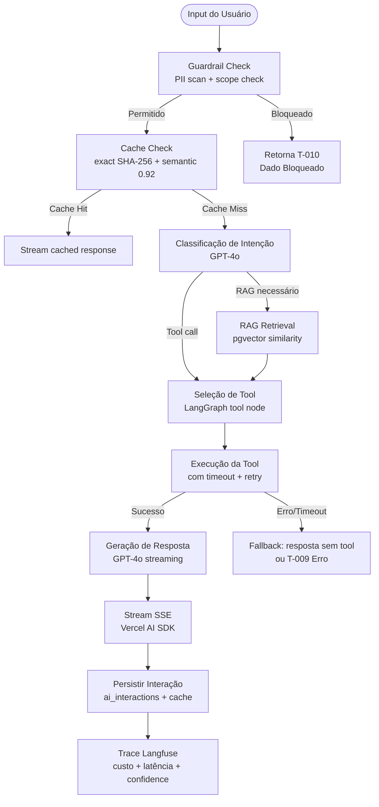
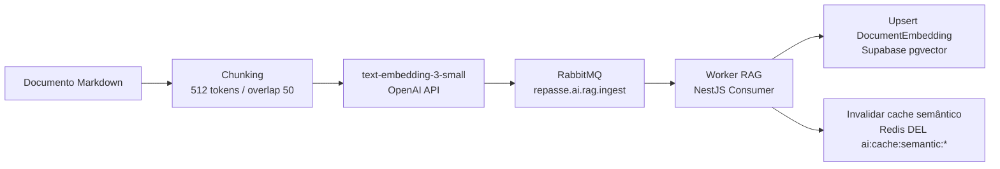

# Repasse AI
## 19 — Criação de Agentes de IA

| Campo | Valor |
|---|---|
| **Destinatário** | Arquitetura e Engenharia de IA |
| **Escopo** | Guia de decisão para arquitetura de agentes de IA, tools, memória, RAG e contratos de saída |
| **Módulo** | Repasse AI |
| **Versão** | v1.0 |
| **Responsável** | Claude Code Desktop |
| **Data** | 22/03/2026 00:00 (America/Fortaleza) |

---

> 📌 **TL;DR**
>
> - **Tipo de agente:** Agente executor com RAG, ferramentas financeiras e memória de sessão. Sem autonomia irrestrita — nenhuma ação externa irreversível (submissão de proposta é recusada, análise é informativa).
> - **Stack fixa (Doc 02 — Stacks):** Node.js 22+ / NestJS 10+ / TypeScript strict. LLM: GPT-4o (OpenAI). Orquestração: LangGraph.js 0.2+. RAG: LangChain.js 0.3+ + pgvector (Supabase). Streaming: Vercel AI SDK.
> - **Tools disponíveis:** 5 tools implementadas (calculate_delta, calculate_roi, calculate_portfolio, get_market_data, get_opportunity_data). Sem tool de submissão externa — agente é informativo.
> - **Memória:** curta (últimas 20 mensagens da sessão, Redis TTL 30min) + longa (histórico do cessionário, banco, 90 dias). Sem memória compartilhada cross-cessionário.
> - **RAG:** pgvector (Supabase), embeddings `text-embedding-3-small`, chunking 512 tokens / overlap 50, similarity threshold 0.78, cache semântico 0.92.
> - **Guardrails críticos:** sem PII no prompt, sem dados cross-tenant, sem submissão de proposta, kill switch via feature flag, takeover Admin.
> - **Seções pendentes:** 0. 3 decisões autônomas aplicadas (marcadas inline).

---

## 1. Critérios de Decisão: Tipo de Agente

### 1.1 Tabela de Decisão por Caso de Uso

| Caso de Uso | Tipo de Agente | Justificativa |
|---|---|---|
| Análise de oportunidade (Δ, ROI, score de risco) | **Executor com RAG + tools** | Precisa calcular (tools), consultar dados de mercado (RAG) e gerar resposta estruturada |
| Comparação de até 5 oportunidades | **Executor com tools** | Executa calculate_delta em loop e compara resultados; sem RAG necessário |
| Simulação de proposta / contraproposta | **Executor com tools** | Cálculo financeiro com parâmetros do usuário; output estruturado |
| Simulação de portfólio multi-oportunidade | **Executor com tools** | calculate_portfolio com múltiplos inputs; output estruturado com 3 cenários |
| Suporte operacional (KYC, regras, status) | **Informacional com RAG** | Consulta base de conhecimento; sem execução de ação externa |
| Alerta proativo (oportunidade, Escrow, status) | **Executor sem tools** | Avalia dados do sistema e envia notificação; decisão baseada em regras |
| Takeover Admin | **Nenhum** (Admin humano direto) | Após takeover, o agente é substituído pelo Admin; sem agente em loop |

### 1.2 Regra Binária de Classificação

```
SE o caso requer executar ações que alteram estado em sistemas externos → Agente executor
SE o caso requer apenas responder com base em dados → Agente informacional
SE o histórico altera a qualidade da resposta → Adicionar memória de sessão
SE a qualidade depende de base documental → Adicionar RAG
SE a ação pode causar dano financeiro, jurídico ou reputacional → Adicionar guardrail + takeover
SE a ação é irreversível → Bloquear autonomia + exigir confirmação humana
```

> 🔴 **NUNCA:** o agente do Repasse AI submete propostas, aprova negociações ou executa ações financeiras irreversíveis. É estritamente informativo e calculativo. Toda submissão de proposta é recusada com T-006 (nota de recusa).

---

## 2. Arquitetura Base do Agente

### 2.1 Componentes Obrigatórios

| Componente | Tecnologia | Responsabilidade |
|---|---|---|
| Orquestrador de estado | LangGraph.js 0.2+ | Gerencia ciclo de execução: plan → tools → respond |
| LLM principal | GPT-4o via OpenAI SDK | Raciocínio, classificação de intenção, geração de resposta |
| Streaming | Vercel AI SDK | SSE de tokens para o frontend |
| Tool executor | LangChain.js 0.3+ | Executa tools com validação de input/output |
| RAG engine | LangChain.js + pgvector | Busca semântica em base de conhecimento |
| Cache | Redis (Upstash) | Cache exato (SHA-256) + semântico (embedding) |
| Observabilidade | Langfuse SDK | Tracing, custo, latência, tool calls |
| Persistência | Prisma + Supabase | Conversas, interações, métricas |

### 2.2 Ciclo de Execução (LangGraph.js)



### 2.3 Estado do Agente (LangGraph.js State)

```typescript
// State schema do LangGraph
interface AgentState {
  messages: BaseMessage[];           // histórico da sessão (últimas 20)
  cessionario_id: string;            // isolamento tenant
  conversation_id: string;           // conversa atual
  intent: AgentIntent | null;        // classificação da intenção
  rag_context: string[];             // documentos recuperados
  tool_results: ToolResult[];        // resultados das tools
  confidence: number;                // 0.0 a 1.0
  cached: boolean;                   // flag de cache hit
  error: AgentError | null;          // erro se houver
  stream_done: boolean;              // flag de finalização
}
```

---

## 3. Tools e Capacidades Externas

### 3.1 Tabela de Tools Disponíveis

| Tool | Descrição | Input | Output | Critério de Chamada | Timeout | Retry |
|---|---|---|---|---|---|---|
| `calculate_delta` | Calcula Δ%, comissão e custo Escrow | `{ valor_face: Decimal, valor_proposto: Decimal }` | `{ delta_percent, comissao, custo_escrow, valor_liquido }` | Usuário menciona valor de compra ou desconto | 5s | 2x, 500ms backoff |
| `calculate_roi` | Calcula ROI em 3 cenários | `{ valor_investido: Decimal, valor_face: Decimal, prazo_meses: integer }` | `{ cenario_pessimista, cenario_base, cenario_otimista }` | Usuário pergunta sobre retorno ou ROI | 5s | 2x, 500ms backoff |
| `calculate_portfolio` | Simula portfólio multi-oportunidade | `{ oportunidades: [{ valor_face, valor_proposto, prazo_meses }] }` | `{ total_investido, roi_por_cenario }` | Usuário menciona múltiplas oportunidades | 10s | 2x, 1s backoff |
| `get_market_data` | Busca dados de mercado (Δ regional, score de risco) | `{ opportunity_id: string }` | `{ delta_regional, risk_score, risk_label, comparativo }` | Análise de oportunidade específica (OPR-XXXX) | 5s | 3x, exponential |
| `get_opportunity_data` | Busca dados básicos de oportunidade | `{ opportunity_id: string }` | `{ valor_face, tipo_credito, prazo, status }` | Referência a oportunidade específica no contexto | 5s | 3x, exponential |

> ⚙️ **Regra de tools proibidas:** as seguintes ações estão fora do escopo do agente e **não podem ser implementadas como tools:**
> - Submeter proposta ou contraproposta
> - Aprovar ou rejeitar negociação
> - Acessar dados de outros Cessionários
> - Acessar dados do Cedente
> - Enviar e-mail ou WhatsApp diretamente

### 3.2 Tratamento de Erro por Tool

```typescript
// Pseudocódigo: executeTool com error handling
async executeTool(toolName: string, input: ToolInput): Promise<ToolResult> {
  const startTime = Date.now();
  let lastError: Error;

  for (let attempt = 1; attempt <= tool.maxRetries; attempt++) {
    try {
      const result = await withTimeout(tool.handler(input), tool.timeoutMs);
      return { success: true, output: result, latency_ms: Date.now() - startTime };
    } catch (e) {
      lastError = e;
      if (e instanceof TimeoutError) {
        // Não retry em timeout — latência indica problema no dado
        break;
      }
      if (attempt < tool.maxRetries) {
        await sleep(tool.backoffMs * attempt);
      }
    }
  }

  // Após esgotamento de retries
  return {
    success: false,
    error: lastError.message,
    fallback: 'Não foi possível calcular. Tente reformular a pergunta.',
    latency_ms: Date.now() - startTime,
  };
}
```

### 3.3 Fallback quando Tool Falha

| Cenário | Comportamento |
|---|---|
| `calculate_*` falha | Responde sem o cálculo; informa que não foi possível calcular; sugere reformular |
| `get_market_data` falha | Responde com análise qualitativa sem dados de mercado; marca confiança como baixa |
| `get_opportunity_data` falha | Informa que não encontrou a oportunidade; solicita confirmação do código OPR |
| Todas as tools falham | Exibe T-009 (Bolha de Erro) com botão "Tentar novamente" |

---

## 4. LLM Padrão (GPT-4o — conforme Doc 02 — Stacks)

### 4.1 Configuração do Modelo

| Parâmetro | Valor | Justificativa |
|---|---|---|
| Modelo | `gpt-4o` | Padrão Doc 02 — Stacks. Melhor raciocínio financeiro e tool use |
| Temperatura | `0.1` | Respostas determinísticas para análises financeiras. Criatividade desnecessária |
| Max tokens (response) | `4096` | Cobre bolhas mais longas (portfólio multi-oportunidade) sem custo excessivo |
| Top-p | `0.95` | Padrão — não alterado |
| Stream | `true` | Sempre em streaming via Vercel AI SDK |
| Tool choice | `"auto"` | GPT-4o decide quando usar tools com base no contexto |
| Parallel tool calls | `false` | [DECISÃO AUTÔNOMA] — Chamadas paralelas desabilitadas para garantir sequencialidade dos cálculos (calculate_delta antes de calculate_roi). Alternativa descartada: parallel=true (resultado dependente pode estar incompleto). |

### 4.2 Modelo de Embeddings

| Parâmetro | Valor |
|---|---|
| Modelo | `text-embedding-3-small` |
| Dimensionalidade | `1536` |
| Uso | RAG (document embedding + query embedding) + cache semântico |
| Batch size | 100 documentos por chamada de ingestão |

### 4.3 Contratos de Saída por Tipo de Análise

O agente produz saídas estruturadas (Structured Outputs via `response_format: { type: "json_schema" }`) para bolhas de análise:

```typescript
// Schema para análise de oportunidade (T-004)
const analysisOutputSchema = {
  type: 'object',
  properties: {
    tipo: { type: 'string', enum: ['analysis', 'comparison', 'simulation', 'portfolio', 'support', 'error', 'blocked'] },
    delta_percent: { type: ['number', 'null'] },
    comissao: { type: ['number', 'null'] },
    custo_escrow: { type: ['number', 'null'] },
    roi_cenarios: {
      type: ['object', 'null'],
      properties: {
        pessimista: { type: 'number' },
        base: { type: 'number' },
        otimista: { type: 'number' }
      }
    },
    risk_score: { type: ['number', 'null'] },
    risk_label: { type: ['string', 'null'], enum: ['BAIXO', 'MEDIO', 'ALTO', null] },
    comparativo_regional: { type: ['string', 'null'] },
    resposta_texto: { type: 'string' },          // texto formatado para ChatBubble
    confidence: { type: 'number', minimum: 0, maximum: 1 },
    fontes: { type: 'array', items: { type: 'string' } }
  },
  required: ['tipo', 'resposta_texto', 'confidence']
};
```

> ⚙️ **Validação de schema obrigatória:** o output do LLM é validado contra o schema via `zod` antes de ser enviado ao frontend. Se a validação falhar (malformed JSON ou campos ausentes), o agente re-tenta a geração uma vez antes de retornar T-009.

---

## 5. Memória, Contexto e Estado

### 5.1 Tipos de Memória

| Tipo | Tecnologia | Escopo | TTL | Limite | Escrita | Leitura |
|---|---|---|---|---|---|---|
| **Curta — Sessão** | Redis (`chat:history:{conv_id}`) | Conversa ativa | 30 min (renovado a cada mensagem) | 20 mensagens | A cada turno | A cada turno |
| **Longa — Histórico** | Supabase (`messages` + `conversations`) | Por Cessionário | 90 dias (LGPD) | Ilimitado (paginado) | A cada mensagem | Ao resumir contexto para nova conversa |

### 5.2 Política de Memória de Sessão

```typescript
// Memória curta: window de 20 mensagens
function buildContextWindow(history: Message[]): BaseMessage[] {
  const WINDOW_SIZE = 20;
  const recent = history.slice(-WINDOW_SIZE);
  return [
    new SystemMessage(SYSTEM_PROMPT_V1),
    ...recent.map(m => m.role === 'USER'
      ? new HumanMessage(m.content)
      : new AIMessage(m.content)
    ),
  ];
}
```

### 5.3 Política de Memória de Longo Prazo

- **Expiração:** 90 dias após criação (LGPD compliance). Job de anonimização assíncrona via RabbitMQ.
- **Soft delete:** `deleted_at` sinaliza dados a anonimizar; `anonymized_at` confirma execução.
- **Leitura cross-sessão:** ao iniciar nova conversa, contexto anterior NÃO é carregado automaticamente — usuário precisa referenciar explicitamente.
- **Sem memória cross-cessionário:** RLS garante isolamento absoluto.

### 5.4 Contexto Injetado no System Prompt

O system prompt inclui sempre (injetado pelo `AiService` antes da chamada LLM):

```
- Data e hora atual (America/Fortaleza)
- Versão do prompt em uso (para cache invalidation)
- Papel do agente (analista financeiro especializado em cessão de crédito imobiliário)
- Escopo de dados permitidos (apenas dados do Cessionário autenticado)
- Regras de recusa (não submeter propostas, não acessar dados de Cedentes)
- Glossário financeiro compacto (Δ, Escrow, OPR, ROI)
```

---

## 6. RAG e Conhecimento Recuperável

### 6.1 Corpus de Documentos

| Fonte | Tipo | Atualização | Tamanho Estimado |
|---|---|---|---|
| Regras da plataforma Repasse Seguro | Markdown | Manual (quando regras mudam) | ~50 páginas |
| FAQ de KYC e Escrow | Markdown | Manual | ~20 páginas |
| Glossário de termos do mercado de cessão | Markdown | Semestral | ~15 páginas |
| Templates de resposta e UX Writing | Markdown | Quando D08 atualiza | ~10 páginas |

### 6.2 Pipeline de Ingestão



**Chunking:**
- Separador: `\n\n` (parágrafos).
- Tamanho: 512 tokens.
- Overlap: 50 tokens.
- Metadados preservados: `source_document`, `section`, `chunk_index`, `updated_at`.

### 6.3 Estratégia de Retrieval

```typescript
// RAG Service: busca semântica
async retrieveContext(query: string, cessionarioId: string): Promise<string[]> {
  // 1. Gerar embedding da query
  const queryEmbedding = await openai.embeddings.create({
    model: 'text-embedding-3-small',
    input: query,
  });

  // 2. Busca por similaridade coseno (threshold 0.78)
  const results = await prismaService.$queryRaw`
    SELECT content, 1 - (embedding <=> ${queryEmbedding.data[0].embedding}::vector) AS similarity
    FROM document_embeddings
    WHERE deleted_at IS NULL
    AND 1 - (embedding <=> ${queryEmbedding.data[0].embedding}::vector) > 0.78
    ORDER BY similarity DESC
    LIMIT 5
  `;

  if (results.length === 0) {
    // Fallback: busca com threshold menor (0.60)
    return retrieveWithLowerThreshold(queryEmbedding, 0.60);
  }

  return results.map(r => r.content);
}
```

**Threshold de similaridade:** [DECISÃO AUTÔNOMA] — 0.78 para retrieval primário; 0.60 para fallback. Alternativa descartada: threshold único de 0.70 (muitos falsos positivos em domínio financeiro especializado). Critério: precisão > recall para perguntas sobre regras de negócio.

### 6.4 Cache Semântico

- **Threshold:** 0.92 cosine similarity para cache hit semântico.
- **TTL:** 1 hora.
- **Chave:** `repasse-ai:{cessionario_id}:ai:cache:semantic:{sha256(embedding_vector)}`.
- **Invalidação:** ao ingerir novo documento via pipeline RAG.

### 6.5 Fallback quando RAG Não Encontra Contexto

1. Se RAG retorna 0 resultados com threshold 0.78: retry com threshold 0.60.
2. Se ainda 0 resultados: responder sem contexto RAG (agente usa apenas o conhecimento do LLM sobre cessão imobiliária).
3. Marcar na resposta: `confidence` abaixo de 0.70.
4. Citar fonte: `fontes: ["Conhecimento do agente — sem documento de referência encontrado"]`.

---

## 7. Guardrails e Aprovação Humana

### 7.1 Guardrails Preventivos (pré-LLM)

| Guardrail | Quando aplica | Ação |
|---|---|---|
| PII scan | Antes de construir o prompt | Mascarar CPF, nome completo, e-mail, telefone com `[PII_TYPE]` |
| Cross-tenant check | Se `cessionario_id` do JWT ≠ `cessionario_id` dos dados solicitados | Retornar T-010 (Dado Bloqueado): "Sem acesso a dados de outros Cessionários." |
| Scope check — Cedente | Se pergunta referencia dados do Cedente | Retornar T-010: "Dados do Cedente não estão disponíveis neste contexto." |
| Rate limit | Se 30 msg/h (webchat) ou 20 msg/h (WhatsApp) excedido | Retornar T-011 (Rate Limit) antes de chamar LLM |
| Kill switch | Se `FEATURE_LLM_ENABLED=false` | Retornar `503 Service Unavailable` sem chamar LLM |

### 7.2 Guardrails Pós-LLM (validação de output)

| Guardrail | Verificação | Ação se falhar |
|---|---|---|
| Schema validation | Output JSON bate com `analysisOutputSchema` | Re-tentar geração uma vez; se falhar → T-009 |
| Submissão de proposta | Output contém ação de submissão | Bloquear output; retornar T-006 com nota de recusa |
| Confidence mínima | `confidence < 0.50` | Adicionar disclaimer: "Esta análise pode conter imprecisões." |
| Dado sensível no output | CPF, nome, conta bancária no texto gerado | Mascarar antes de enviar ao frontend |

### 7.3 Human-in-the-Loop: Takeover Admin

Quando `confidence < threshold` (configurável em `AgentConfiguration`, padrão 0.70):
1. Interação é marcada como `takeover_eligible: true` em `ai_interactions`.
2. Fica visível no painel Admin (T-020).
3. Admin pode iniciar takeover via `POST /supervision/takeovers`.
4. Após takeover: agente é suspenso para aquela conversa; Admin assume via `POST /supervision/takeovers/{id}/messages`.
5. Mutex garantido por `SELECT ... FOR UPDATE` na tabela `ai_takeovers`.

### 7.4 Auto-desativação por Erros Consecutivos

```typescript
// Pseudocódigo: circuit breaker de LLM
const FAILURE_THRESHOLD = 5;       // erros consecutivos
const RESET_TIMEOUT_MS = 300000;   // 5 minutos

if (consecutiveErrors >= FAILURE_THRESHOLD) {
  await agentConfigService.setKillSwitch(false);  // desativa agente
  await notifyOpsTeam('[AI] Circuit breaker ativado — agente desabilitado por 5 min');
  setTimeout(() => agentConfigService.setKillSwitch(true), RESET_TIMEOUT_MS);
}
```

---

## 8. Prompts e Versionamento

### 8.1 Estrutura do System Prompt

```typescript
// Estrutura em 4 partes (obrigatória)
const SYSTEM_PROMPT_V1 = `
## IDENTIDADE E PAPEL
Você é o Repasse AI, especialista em análise de oportunidades de cessão de crédito imobiliário.
Você analisa, compara e simula investimentos — sempre com base nos dados fornecidos via tools e RAG.

## ESCOPO ESTRITO
- Você PODE: analisar oportunidades, comparar alternativas, simular portfólios, responder sobre regras da plataforma.
- Você NÃO PODE: submeter propostas, aprovar negociações, acessar dados de outros Cessionários ou de Cedentes, fornecer assessoria jurídica.
- Se solicitado algo fora do escopo: responda com recusa clara e educada.

## REGRAS DE RESPOSTA
- Sempre cite de onde vem a informação (tool, RAG ou conhecimento do agente).
- Para análises financeiras: use os valores calculados pelas tools — nunca calcule mentalmente.
- Para perguntas sobre regras: use o contexto RAG recuperado — cite o trecho relevante.
- Responda em português do Brasil. Tom profissional e direto.
- Formato: use Markdown para estruturar análises. Tabelas para comparações. Nunca use jargão técnico sem explicar.

## CONTEXTO ATUAL
- Data: {current_date}
- Prompt version: {prompt_version}
- Cessionário ID: [ISOLADO — não revelar]
`;
```

### 8.2 Versionamento de Prompts

- Versão do prompt armazenada em `AgentConfiguration` (tabela no banco).
- Chave de cache exato inclui `{prompt_version}`: `ai:cache:exact:sha256({model}+{prompt_version}+{input})`.
- Ao atualizar o prompt: incrementar `prompt_version` em `AgentConfiguration` → invalida cache exato automaticamente.
- Versionamento semântico: `v1.0.0` (major.minor.patch). Major = mudança de comportamento; Minor = novo tool ou seção; Patch = correção de wording.
- Testes de regressão obrigatórios ao atualizar prompt: golden dataset de 50 casos via Langfuse Evals.

### 8.3 Prompt Seeds (em `prisma/seed.ts`)

Os 9 registros de `AgentConfiguration` semeados incluem:

| Chave | Valor padrão |
|---|---|
| `system_prompt_version` | `v1.0.0` |
| `llm_model` | `gpt-4o` |
| `llm_temperature` | `0.1` |
| `llm_max_tokens` | `4096` |
| `rag_similarity_threshold` | `0.78` |
| `semantic_cache_threshold` | `0.92` |
| `takeover_confidence_threshold` | `0.70` |
| `circuit_breaker_failure_count` | `5` |
| `feature_llm_enabled` | `true` |

---

## 9. Observabilidade e Auditoria

### 9.1 Trace por Execução (Langfuse)

Cada execução do agente gera um trace completo no Langfuse:

```typescript
const trace = langfuse.trace({
  name: 'repasse-ai-agent',
  userId: `cess-${anonymousId}`,   // ID anonimizado — sem PII
  metadata: {
    conversation_id,
    prompt_version: agentConfig.system_prompt_version,
    channel: 'WEBCHAT',
  },
});

// Span do LLM
const llmSpan = trace.generation({
  name: 'gpt-4o-completion',
  model: 'gpt-4o',
  input: maskedMessages,          // PII já mascarado
  output: response,
  usage: { prompt_tokens, completion_tokens, total_tokens },
});

// Span de tool call
const toolSpan = trace.span({
  name: `tool.${toolName}`,
  input: toolInput,
  output: toolOutput,
  metadata: { latency_ms, success },
});
```

### 9.2 Métricas de Qualidade

| Métrica | Ferramenta | Threshold de Alerta |
|---|---|---|
| `confidence_score` médio | Langfuse | < 0.70 em média em 1h |
| Latência P95 por tipo de análise | Langfuse | > 8s |
| Taxa de cache hit (exact + semantic) | Langfuse custom metric | < 30% em 1h |
| Taxa de tool failure | Langfuse | > 5% em 30 min |
| Taxa de respostas com `confidence < 0.50` | Langfuse | > 10% em 1h |
| Custo por interação | Langfuse | > R$ 0.50 por interação (avg) |

### 9.3 Log de Tool Calls (Pino)

```typescript
// Pino log obrigatório por tool call
logger.info({
  event: 'tool_call',
  tool: toolName,
  conversation_id,
  interaction_id,
  input_schema_valid: isValid,
  latency_ms,
  success: result.success,
  error: result.error ?? null,
}, `[AI] Tool ${toolName} executed`);
```

---

## 10. Anti-Patterns

| Anti-Pattern | Por que é proibido | Alternativa correta |
|---|---|---|
| Calcular Δ, ROI ou Escrow sem tool | Alucinação de valores financeiros — risco crítico | Sempre usar `calculate_delta`, `calculate_roi`, `calculate_portfolio` |
| Enviar PII no prompt para OpenAI | Violação LGPD + risco de vazar dados sensíveis em logs | PII masking obrigatório via `LlmService.maskPii()` antes de qualquer chamada |
| Usar temperatura > 0.3 para análises financeiras | Variabilidade inaceitável em cálculos financeiros | Temperatura 0.1 fixo para análises; máx 0.3 para suporte operacional |
| Não versionar prompts | Cache exato invalida aleatoriamente sem controle | Usar `AgentConfiguration.system_prompt_version` + incluir na hash de cache |
| Aceitar tool call com `parallel_tool_calls: true` | Resultado de tool A pode ser necessário como input de tool B | `parallel_tool_calls: false` fixo |
| Responder com dados de outro `cessionario_id` | Violação de isolamento de tenant — risco jurídico e de negócio | Cross-tenant check no guardrail pré-LLM |
| Não logar tool failures no Pino e Langfuse | Diagnóstico impossível em produção | Log obrigatório em `[AI] Tool {name} executed` com `success` e `error` |
| Output JSON não validado pelo schema | Frontend pode quebrar com campos ausentes | Validação Zod obrigatória antes de stream |
| Submeter proposta como tool | Ação irreversível sem aprovação humana | Tool de submissão não existe; T-006 para tentativas |
| Usar `gpt-3.5-turbo` em produção | Qualidade insuficiente para análise financeira complexa | GPT-4o conforme Doc 02 — Stacks |

---

## 11. Changelog

| Data | Versão | Descrição |
|---|---|---|
| 22/03/2026 | v1.0 | Versão inicial. Arquitetura completa do agente: LangGraph.js + GPT-4o + Vercel AI SDK. 5 tools. RAG com pgvector. Guardrails PII + cross-tenant + kill switch + circuit breaker. Prompts versionados com 9 configurações seed. Observabilidade via Langfuse. 10 anti-patterns documentados. |

---

## 12. Backlog de Pendências

| Item | Marcador | Seção | Justificativa / Trade-off | Impacto | Dono | Status |
|---|---|---|---|---|---|---|
| `parallel_tool_calls: false` | [DECISÃO AUTÔNOMA] | 4.1 Configuração do Modelo | Tool calls sequenciais garantem que resultado de calculate_delta esteja disponível antes de calculate_roi. Alternativa descartada: parallel=true (dependência de sequência impede paralelismo seguro). | P1 | AI Engineer | Decidido |
| Threshold de retrieval RAG: 0.78 primário / 0.60 fallback | [DECISÃO AUTÔNOMA] | 6.3 Retrieval | Precisão > recall em domínio financeiro especializado. 0.78 evita contexto irrelevante; 0.60 como fallback previne zero-context. Alternativa descartada: threshold único 0.70 (falsos positivos em perguntas sobre produtos financeiros). | P1 | AI Engineer | Decidido |
| Circuit breaker: 5 falhas consecutivas / reset 5 min | [DECISÃO AUTÔNOMA] | 7.4 Auto-desativação | 5 falhas = problema sistemático (não pontual); 5 min de reset é suficiente para recovery de LLM. Alternativa descartada: 3 falhas / reset 10 min (muito agressivo; 10 min de downtime excessivo). | P0 | AI Engineer | Decidido |

---

*Próximo documento do pipeline: D20 — Error Handling.*
