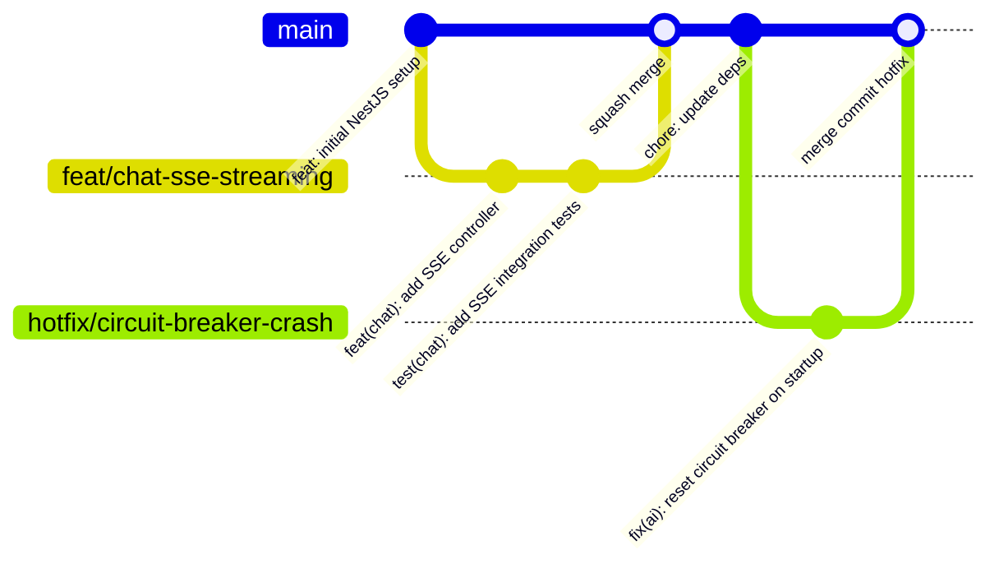
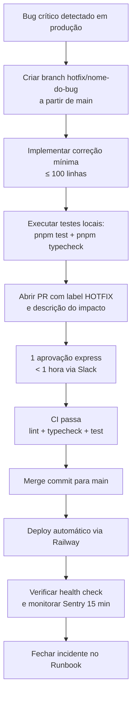

# 23 - Guia de Contribuição

## Cabeçalho

| **Nome do Documento** | **Versão** | **Data** | **Autor** | **Status** |
| --- | --- | --- | --- | --- |
| 23 - Guia de Contribuição | v1.0 | 2026-03-22 | Claude Code Desktop (ShiftLabs Pipeline v9.5) | Aprovado |

---

## TL;DR

> 📌 **Contrato de contribuição do Repasse AI:**
>
> - **Branching:** Trunk-Based Development — `main` é sempre deployável; branches de feature com vida máxima de 3 dias.
> - **Commits:** Conventional Commits obrigatório — `feat(chat): add SSE streaming for agent responses`.
> - **PRs:** template obrigatório, máximo 400 linhas alteradas, mínimo 1 aprovação (2 para mudanças em `main`).
> - **Merge:** Squash merge em feature branches; merge commit para releases e hotfixes.
> - **Hotfix:** branch `hotfix/` direto de `main`, aprovação express (1 aprovação), deploy prioritário.
> - **CI obrigatório:** lint + typecheck + testes unitários devem passar antes de qualquer merge.
> - **Branches protegidas:** `main` (produção) — nenhum push direto, nunca.

---

## 1. Branching Strategy

O Repasse AI adota **Trunk-Based Development (TBD)** com branches de curta duração. `main` é a única branch de longa duração e é sempre deployável. Nenhuma branch de feature deve existir por mais de 3 dias sem merge ou rebase.

[DECISÃO AUTÔNOMA] TBD escolhido sobre Git Flow: o produto é backend puro (PG-03) sem múltiplas versões paralelas em suporte, equipe pequena e deploy contínuo via Railway. Git Flow descartado por overhead de branches `develop`/`release` sem benefício real neste contexto. Critério: simplicidade operacional + CI/CD contínuo.

### 1.1 Branches Protegidas

| Branch | Proteção | Quem pode fazer push | Regras |
| --- | --- | --- | --- |
| `main` | Total | Ninguém (apenas merge via PR) | ≥ 2 aprovações, todos os checks CI passando |

### 1.2 Nomenclatura de Branches

| Prefixo | Quando Usar | Exemplos |
| --- | --- | --- |
| `feat/` | Nova funcionalidade | `feat/chat-sse-streaming`, `feat/rag-pgvector` |
| `fix/` | Correção de bug (não produção) | `fix/jwt-expiry-validation`, `fix/rate-limit-redis` |
| `hotfix/` | Correção urgente em produção | `hotfix/circuit-breaker-crash`, `hotfix/otp-timeout` |
| `chore/` | Manutenção, dependências, configuração | `chore/update-nestjs-10`, `chore/turborepo-config` |
| `docs/` | Documentação apenas | `docs/api-endpoint-descriptions` |
| `refactor/` | Refatoração sem mudança de comportamento | `refactor/ai-service-extract-tools` |
| `test/` | Testes sem mudança de código prod | `test/notification-service-unit` |
| `ci/` | Mudanças em CI/CD | `ci/github-actions-cache` |

> 🔴 **Proibido:** branch sem prefixo (`meu-fix`, `wip`, `alterações-fernando`). Branches com espaços ou caracteres especiais.

### 1.3 Diagrama de Fluxo



---

## 2. Convenção de Commits

O Repasse AI usa **Conventional Commits** obrigatório. Todo commit deve seguir o formato:

```
<tipo>(<escopo>): <descrição imperativa em português>

[corpo opcional — por quê, não o quê]

[rodapé opcional — Breaking change, Closes #issue]
```

### 2.1 Tipos Permitidos

| Tipo | Quando Usar | Exemplos |
| --- | --- | --- |
| `feat` | Nova funcionalidade | `feat(chat): adicionar suporte a SSE para respostas do agente` |
| `fix` | Correção de bug | `fix(ai): corrigir reset de circuit breaker após timeout` |
| `docs` | Documentação | `docs(api): atualizar exemplos de endpoint /messages` |
| `style` | Formatação, espaços (sem mudança de lógica) | `style(chat): corrigir indentação do service` |
| `refactor` | Refatoração sem mudança de comportamento | `refactor(ai): extrair ToolService do AiService` |
| `test` | Adição ou correção de testes | `test(notification): adicionar teste de opt-out crítico` |
| `chore` | Manutenção, dependências | `chore: atualizar nestjs para 10.4.2` |
| `ci` | Mudanças em CI/CD | `ci: adicionar cache do pnpm no GitHub Actions` |
| `perf` | Melhoria de performance | `perf(rag): adicionar índice parcial pgvector para retrieval` |
| `revert` | Reverter commit anterior | `revert: feat(chat): adicionar SSE streaming` |

### 2.2 Escopos Permitidos

`ai`, `chat`, `calculator`, `notification`, `supervision`, `whatsapp`, `db`, `common`, `config`, `ci`, `docs`.

### 2.3 Exemplos Comparativos

| ❌ Incorreto | ✅ Correto |
| --- | --- |
| `fix stuff` | `fix(ai): corrigir loop infinito no LangGraph ao receber tool_call vazio` |
| `WIP` | `feat(chat): implementar endpoint POST /messages com validação de DTO` |
| `update` | `chore: atualizar @langchain/core de 0.3.1 para 0.3.5` |
| `fix bug in auth` | `fix(common): corrigir validação de JWT_DEV_MODE quando env não definida` |
| `adding tests` | `test(ai): adicionar testes unitários para withRetry com exponential backoff` |

> 🔴 **Anti-exemplo 1 — Commit com mensagem genérica:**
>
> ❌ `git commit -m "fix stuff"`
>
> ✅ `git commit -m "fix(ai): corrigir circuit breaker que não resetava após 5 minutos"`
>
> Mensagens genéricas tornam o `git log` ilegível e impossibilitam geração automática de changelog.

---

## 3. Pull Request Flow

### 3.1 Regras de Tamanho

| Tipo | Linhas Máximas | Observação |
| --- | --- | --- |
| Feature | ≤ 400 linhas | Dividir em PRs menores se necessário |
| Bugfix | ≤ 200 linhas | Foco no mínimo necessário |
| Hotfix | ≤ 100 linhas | Cirurgicamente pequeno |
| Refactor | ≤ 600 linhas | Apenas se isolado de features |
| Testes | Sem limite | Testes nunca são "grande demais" |

> 🔴 **Anti-exemplo 2 — PR grande sem contexto:**
>
> ❌ PR com 1200 linhas alteradas em 15 arquivos, título "Implementar módulo de IA", sem descrição, sem critério de teste.
>
> ✅ PR de 350 linhas cobrindo apenas o `AiService.processMessage` com descrição do comportamento esperado, referência ao Doc 19, e checklist de testes executados.

### 3.2 Template de PR Obrigatório

```markdown
## Descrição
<!-- O que foi feito e por quê — foco no "porquê", não no "o quê" -->

## Tipo de Mudança
- [ ] Nova funcionalidade (feat)
- [ ] Correção de bug (fix)
- [ ] Hotfix (produção)
- [ ] Refatoração (sem mudança de comportamento)
- [ ] Documentação
- [ ] CI/CD

## Checklist de Entrega
- [ ] Testes unitários adicionados/atualizados
- [ ] Testes passando (`pnpm test`)
- [ ] Typecheck passando (`pnpm typecheck`)
- [ ] Lint passando (`pnpm lint`)
- [ ] Variáveis de ambiente documentadas em `.env.example` (se aplicável)
- [ ] Schema Prisma atualizado e migration gerada (se aplicável)
- [ ] Sem dados sensíveis expostos (JWT, OTP, PII)
- [ ] Correlation ID presente em novos logs
- [ ] Error classes usadas (não `throw new Error()` genérico)

## Como Testar
<!-- Passos específicos para o reviewer validar o comportamento -->
1. Configurar `JWT_DEV_MODE=true` no `.env`
2. Executar `pnpm dev`
3. Enviar POST para `/repasse-ai/v1/chat/conversations/test/messages`
4. Verificar que a resposta SSE chega em < 5s

## Breaking Changes
<!-- Se houver, descrever impacto e migration path -->
Nenhuma.

## Issues Relacionadas
Closes #<número>
```

### 3.3 SLA de Review

| Prioridade | SLA | Canal de Cobrança |
| --- | --- | --- |
| Hotfix | 1 hora | Slack direto ao reviewer |
| Feature/Fix | 24 horas úteis | Slack #repasse-ai-dev |
| Chore/Docs | 48 horas úteis | Sem cobrança ativa |

### 3.4 Aprovações Mínimas

| Destino do Merge | Aprovações Mínimas | Observação |
| --- | --- | --- |
| `main` | 2 (sendo 1 Tech Lead) | Para features e fixes regulares |
| `main` (hotfix) | 1 (qualquer tech) | Fluxo acelerado — ver seção 6 |
| Branch feature ← outra branch | 0 | Rebase livre sem aprovação |

---

## 4. Code Review Guidelines

### 4.1 O Que Verificar

**Funcionalidade:**
- O comportamento descrito no PR é o que o código faz?
- Edge cases tratados (null/undefined, token expirado, serviço externo down)?
- Error classes corretas usadas (não `throw new Error()`)?

**Testes:**
- Novos caminhos de código têm testes unitários?
- Casos de falha têm testes (não só happy path)?
- Mocks usados corretamente (sem over-mocking)?

**Segurança:**
- JWT validado em todos os endpoints novos?
- `withTenant()` chamado em queries de domínio?
- Nenhum PII em logs?
- Rate limiting aplicado se endpoint público?

**Performance:**
- Queries N+1 introduzidas?
- Cache Redis necessário e implementado?
- Await desnecessário em operações paralelas?

**Legibilidade:**
- Nomes de variáveis e funções claros?
- Comentários explicam o "porquê" (não o "o quê")?
- Complexidade ciclomática razoável (< 10 por função)?

### 4.2 Como Dar Feedback

| Prefixo no Comentário | Significado | Bloqueia Aprovação? |
| --- | --- | --- |
| `[BLOQUEANTE]` | Deve ser corrigido antes do merge | Sim |
| `[SUGESTÃO]` | Melhoria desejável, não obrigatória | Não |
| `[PERGUNTA]` | Dúvida para entendimento | Não (a menos que resposta mude algo) |
| `[NITPICK]` | Detalhe menor — author decide | Não |
| `[ACK]` | Reconhecimento de decisão de design | Não |

### 4.3 O Que Bloqueia Aprovação

- `throw new Error()` genérico em módulos de domínio
- PII em log (`console.log(user.email)`, `logger.info({ jwt })`)
- Endpoint sem guard de autenticação
- Query de banco sem `withTenant()` em módulo de domínio
- Teste ausente para código crítico (agente IA, auth, RLS)
- `.env` com secrets commitados (mesmo em `.env.example`)

---

## 5. Merge Strategy

### 5.1 Regras por Tipo de Branch

| Branch de Origem | Branch de Destino | Estratégia | Quem Faz |
| --- | --- | --- | --- |
| `feat/*`, `fix/*`, `chore/*`, `docs/*`, `refactor/*`, `test/*`, `ci/*` | `main` | **Squash merge** | Author (após aprovações) |
| `hotfix/*` | `main` | **Merge commit** | Tech Lead |

[DECISÃO AUTÔNOMA] Squash merge para features: mantém histórico de `main` linear e legível. Alternativa (merge commit para features) descartada por poluir o log com commits WIP ("tentativa 3", "fix typo"). Critério: `git log --oneline main` deve ser um changelog de funcionalidades.

### 5.2 Rebase Obrigatório Antes do Merge

Antes de criar o PR ou antes do merge, a branch deve estar rebaseada em `main`:

```bash
git fetch origin
git rebase origin/main
# resolver conflitos se necessário
git push --force-with-lease origin feat/minha-feature
```

> 🔴 **Anti-exemplo 3 — Branch sem padrão de nome:**
>
> ❌ `git checkout -b minhas-alteracoes-chat`
>
> ✅ `git checkout -b feat/chat-add-message-reactions`

### 5.3 Resolução de Conflitos

- Quem resolve: **author do PR** (não o reviewer).
- Como: rebase em `main` + resolução manual.
- Se conflito complexo: pair programming com reviewer via Slack.
- Nunca: merge commit de `main` ← `feat/` apenas para resolver conflito.

---

## 6. Hotfix Flow

Um hotfix é uma correção urgente para um bug crítico em produção. O fluxo é acelerado mas nunca bypassa o CI.

> 🔴 **Regra inegociável:** hotfix vai para `main` — nunca diretamente para produção sem PR e sem CI passar.

### 6.1 Diagrama



### 6.2 Checklist de Hotfix

- [ ] Branch criada de `main` atual (não de uma branch de feature)
- [ ] Correção é mínima e cirúrgica
- [ ] Testes unitários cobrem o caso corrigido
- [ ] CI passou (lint + typecheck + test)
- [ ] PR com label `HOTFIX` e descrição do impacto em produção
- [ ] 1 aprovação obtida via Slack em < 1 hora
- [ ] Merge commit (não squash) para preservar história do hotfix
- [ ] Deploy Railway verificado
- [ ] `GET /health` retorna 200 após deploy
- [ ] Sentry monitorado por 15 minutos pós-deploy

---

## 7. CI/CD Integration (Checks Obrigatórios antes do Merge)

Todos os checks abaixo devem passar antes de qualquer merge em `main`. O GitHub Actions executa automaticamente ao abrir ou atualizar um PR.

| Check | Comando | Tempo Estimado | Falha Bloqueia? |
| --- | --- | --- | --- |
| Lint | `pnpm lint` | ~30s | Sim |
| Typecheck | `pnpm typecheck` | ~45s | Sim |
| Testes unitários | `pnpm test` | ~2 min | Sim |
| Build | `pnpm build` | ~3 min | Sim |
| Prisma validate | `pnpm prisma validate` | ~10s | Sim |
| Security audit | `pnpm audit --audit-level high` | ~30s | Sim (HIGH+CRITICAL) |

> ⚙️ **Padrão obrigatório:** a configuração do GitHub Actions está em `.github/workflows/ci.yml`. Nenhum check pode ser bypassed com `--no-verify` ou skip de step sem aprovação explícita do Tech Lead.

> 🔴 **Anti-exemplo 4 — Merge sem aprovação mínima:**
>
> ❌ `git push origin main` direto ou merge sem PR aprovado.
>
> ✅ Abrir PR → aguardar CI → obter 2 aprovações → merge via GitHub UI.

---

## 8. Release Flow

O Repasse AI não tem releases manuais — o Railway faz deploy automático a cada merge em `main`. O "release" é o próprio merge.

### 8.1 Versionamento Semântico

Versão no `package.json` segue **SemVer**: `MAJOR.MINOR.PATCH`.

| Incremento | Quando | Exemplo |
| --- | --- | --- |
| PATCH | Bugfix, hotfix, chore | `1.2.3 → 1.2.4` |
| MINOR | Nova funcionalidade backward-compatible | `1.2.3 → 1.3.0` |
| MAJOR | Breaking change na API | `1.2.3 → 2.0.0` |

### 8.2 Tags de Release

Após merge de feature significativa ou set de features:

```bash
git tag -a v1.3.0 -m "feat: add RAG pgvector with semantic cache"
git push origin v1.3.0
```

O GitHub Actions gera changelog automático a partir dos commits Conventional Commits entre tags.

---

## 9. Glossário

| Termo | Definição |
| --- | --- |
| TBD | Trunk-Based Development — todos trabalham em `main` com branches de curta duração |
| Conventional Commits | Padrão de mensagem de commit: `tipo(escopo): descrição` |
| Squash merge | Une todos os commits do PR em um único commit em `main` |
| Merge commit | Preserva o histórico completo de commits do PR em `main` (usado em hotfixes) |
| Rebase | Re-aplica commits da branch sobre a ponta de `main` — elimina commits de merge |
| DRI | Directly Responsible Individual — quem tem responsabilidade sobre a decisão |
| CI | Continuous Integration — checks automáticos em todo PR |
| CD | Continuous Deployment — deploy automático a cada merge em `main` via Railway |
| Force-with-lease | `git push --force-with-lease` — push forçado seguro que não sobrescreve commits alheios |
| Express approval | Aprovação de hotfix obtida via Slack em < 1 hora |

---

## 10. Backlog de Pendências

| ID | Descrição | Prioridade | Observação |
| --- | --- | --- | --- |
| CONTRIB-001 | Configurar branch protection rules no GitHub (require PR, require CI, require 2 approvals) — ação manual no repositório | Alta | Feito uma vez no setup do repo |
| CONTRIB-002 | Criar `.github/workflows/ci.yml` com os 6 checks documentados na seção 7 | Alta | Parte do setup inicial |
| CONTRIB-003 | Configurar template de PR no GitHub (`.github/pull_request_template.md`) | Alta | Parte do setup inicial |
| CONTRIB-004 | Avaliar adoção de commitlint + husky para enforçar Conventional Commits no pre-commit hook | Média | [DECISÃO AUTÔNOMA] Não incluído no MVP por adicionar fricção no setup local; revisar após onboarding do primeiro dev externo |

> **Decisões Autônomas Tomadas Neste Documento:**
>
> 1. **[DECISÃO AUTÔNOMA] Trunk-Based Development:** alternativa Git Flow descartada por overhead desnecessário em produto backend puro com equipe pequena e deploy contínuo. Critério: simplicidade operacional.
> 2. **[DECISÃO AUTÔNOMA] Squash merge para features:** alternativa merge commit descartada por poluir histórico de `main`. Critério: legibilidade do `git log`.
> 3. **[DECISÃO AUTÔNOMA] Mensagens de commit em português:** alternativa inglês descartada por consistência com o time brasileiro e documentação em português. Critério: alignment com idioma do produto e docs.
> 4. **[DECISÃO AUTÔNOMA] commitlint não incluído no MVP:** adiciona fricção no setup local sem benefício imediato em time pequeno. Alternativa (incluir no pre-commit hook) será reavaliada quando o time crescer. Critério: YAGNI.

---

*Próximo documento do pipeline: D27 — Plano de Testes.*
