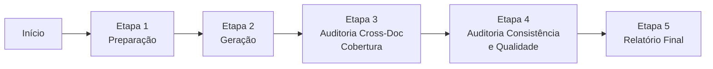
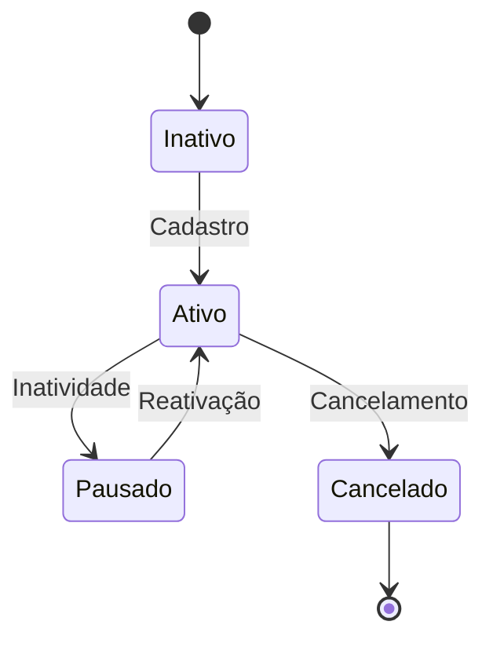
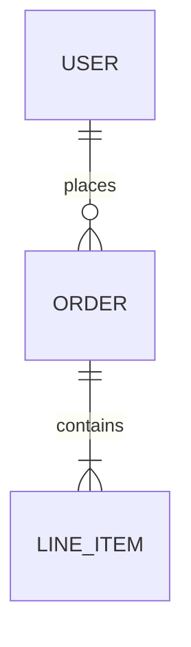
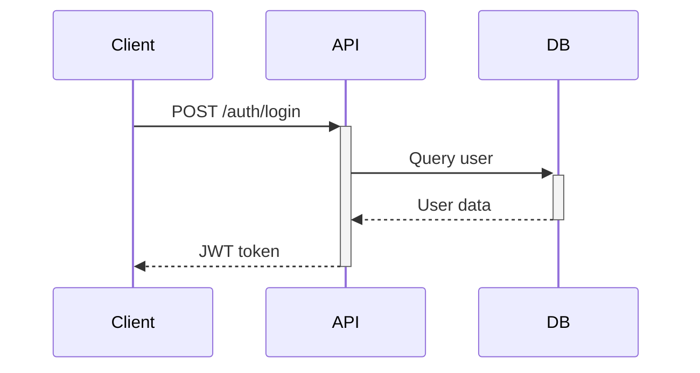

# Pipeline de Desenvolvimento — ShiftLabs v9.5

## Framework de Documentação Técnica com IA

---

| Campo | Valor |
| --- | --- |
| **Destinatário** | Ferramenta de IA (execução automatizada) + Time de engenharia da ShiftLabs (consumo dos docs) |
| **Escopo** | Orquestração completa de 29 documentos de desenvolvimento via ferramenta de IA 100% local (Docs 01-03 recebidos como input pré-existente, Docs 04-29 gerados nesta fase com auditorias inline após D05 e D06) |
| **Caráter** | **Normativo.** Este pipeline define a ordem, as dependências, os prompts e os critérios de qualidade para cada documento. Desvios exigem aprovação do Tech Lead. |
| **Versão** | v9.5 |
| **Responsável** | Fernando Calado |
| **Data** | 22/03/2026 00:00 (America/Fortaleza) |
| **Revisão** | A cada novo produto ou mudança significativa no framework |
| **Stack de referência** | Stacks Tecnológicas v4.0 (documento normativo oficial ShiftLabs). Se disponível no Notion, a ferramenta de IA deve ler o doc para extrair versões e regras específicas. |
| **Ambiente de execução** | Ferramenta de IA + sistema de arquivos local (100% local) |

---

## TL;DR

- **29 documentos** organizados em **7 blocos internos** sequenciais. **Docs 01-03 chegam prontos** (Regras de Negócio, Stacks, Brand Guide) — são input, não gerados aqui. **Docs 04-29 são gerados nesta fase** (26 docs). Pipeline 100% local — todos os outputs salvos em disco. Processo totalmente autônomo: um comando, zero interações.
- **Docs 01-03 como input:** Regras de Negócio (01.1-01.5), Stacks (02) e Brand Guide (03) são fornecidos já prontos em `docs/02 - Desenvolvimento/`. Esta fase os lê, valida e extrai artefatos de rastreabilidade.
- **Auditorias inline:** Após gerar D05 (PRD), executa automaticamente a auditoria B03 (PRD <> Regras de Negócio). Após gerar D06 (Mapa de Telas), executa B04 (UX <> Mapa de Telas). Isso garante qualidade antes de prosseguir.
- **Um comando só:** você diz "execute o pipeline de desenvolvimento para [produto]" e a ferramenta de IA lê este arquivo, lê os inputs do disco (`.md` locais) e gera tudo do início ao fim.
- **100% local:** inputs são arquivos `.md` locais, geração e auditorias 100% no disco. Todos os outputs salvos em `docs/02 - Desenvolvimento/`. Pipeline totalmente autônomo — zero intervenção manual durante a execução.
- **Estado via TodoWrite:** progresso rastreado via ferramenta TodoWrite — lista com os 26 docs a gerar + 2 auditorias inline, um `in_progress` por vez, marcados `completed` ao finalizar. Resumos JSON em `logs/resumos.json`, rastreabilidade em `logs/rastreabilidade.json`. Se a sessão cair, retoma a partir do estado do disco.
- **Paralelismo:** docs sem dependência cruzada são gerados em paralelo quando a ferramenta suportar.
- **Auditorias de fase:** Etapa 3 (Cross-Doc de Cobertura) verifica se cada doc filho cobre 100% dos pais. Etapa 4 (Consistência e Qualidade) verifica dados, terminologia e formato.
- **Rastreabilidade pré-computada:** `logs/rastreabilidade.json` criado na Etapa 1 a partir dos D01-D03, alimentado a cada doc gerado.
- **Fluxo:** Etapa 1 (leitura D01-D03 + geração D04 + geração D05 + auditoria B03 + geração D06 + auditoria B04 + geração D07) → Etapa 2 (geração D08-D29) → Etapa 3 (auditoria cross-doc) → Etapa 4 (auditoria de consistência) → Etapa 5 (relatório).
- **Tamanho total estimado**: 70.000 a 115.000 palavras. **Tempo estimado: ~14-18 horas**.
- **Fluxo de fases do framework completo:**
  - **Fase 1:** Documentação de Produto (16 docs de produto) → roda auditoria A01 no final
  - **Fase 2:** Documentação de Desenvolvimento (29 docs — este pipeline) → roda auditoria A02 no final
  - **Fase 3:** Documentação das Sprints → roda auditoria A03 no final
  - **Fase 4:** Desenvolvimento (Coding) → roda auditoria A04 no final

---

## 1. Visão Geral do Pipeline

### 1.1 Arquitetura de Fases

```
BLOCO 1 — FUNDAÇÃO (Docs 01-05)
│  Docs 01-03: INPUT PRÉ-EXISTENTE (chegam prontos, não gerados aqui)
│  Doc 04: GERADO nesta fase (Motion Spec)
│  Doc 05: GERADO nesta fase + AUDITORIA B03 (PRD <> Regras de Negócio) após geração
│
├── Doc 01: Regras de Negócio (5 partes: 01.1 a 01.5) ← INPUT
├── Doc 02: Stacks Tecnológicas ← INPUT
├── Doc 03: Brand Theme Guide ← INPUT
├── Doc 04: Motion Spec ← GERADO
└── Doc 05: PRD (5 partes: 05.1 a 05.5) ← GERADO → AUDITORIA B03
        │
BLOCO 2 — UI/UX (Docs 06-09)
│  Objetivo: Criar mapa de telas, wireframes e contratos de interface.
│  Doc 06: GERADO + AUDITORIA B04 (UX <> Mapa de Telas) após geração
│
├── Doc 06: Mapa de Telas ← GERADO → AUDITORIA B04
├── Doc 07: Wireframes ← GERADO
├── Doc 08: UX Writing ← GERADO
└── Doc 09: Contratos de UI por Tela ← GERADO
        │
BLOCO 3 — PRODUTO (Docs 10-11)
│  Objetivo: Consolidar terminologia e adaptar para plataforma mobile.
│  Saída: Glossário técnico e guia mobile.
│
├── Doc 10: Glossário Técnico ← GERADO
└── Doc 11: Mobile ← GERADO
        │
BLOCO 4 — ARQUITETURA (Docs 12-21)
│  Objetivo: Definir como o sistema é construído internamente.
│  Saída: ERD, schema Prisma, specs, arquitetura de pastas, API, integrações, OAuth, agentes IA, error handling e notificações.
│
├── Doc 12: Modelo de Dados (ERD / Schema) ← GERADO
├── Doc 13: Schema Prisma ← GERADO
├── Doc 14: Especificações Técnicas ← GERADO
├── Doc 15: Arquitetura de Pastas ← GERADO
├── Doc 16: Documentação de API ← GERADO
├── Doc 17: Integrações Externas ← GERADO
├── Doc 18: Fluxos de Autenticação OAuth ← GERADO
├── Doc 19: Criação de Agentes de IA ← GERADO
├── Doc 20: Error Handling ← GERADO
└── Doc 21: Notificações, Templates e Implementação ← GERADO
        │
BLOCO 5 — AMBIENTE E PROCESSO (Docs 22-24)
│  Objetivo: Garantir que o time pode trabalhar, contribuir e fazer deploy com qualidade.
│  Saída: Setup funcional, regras de contribuição e pipeline de deploy.
│
├── Doc 22: Guia de Ambiente, Setup Local e Secrets ← GERADO
├── Doc 23: Guia de Contribuição ← GERADO
└── Doc 24: Deploy, CI-CD e Versionamento ← GERADO
        │
BLOCO 6 — QUALIDADE (Docs 25-28)
│  Objetivo: Garantir observabilidade, resiliência operacional, cobertura de testes e qualidade.
│  Saída: Logs, runbook, plano de testes e checklist de qualidade.
│
├── Doc 25: Observabilidade e Logs ← GERADO
├── Doc 26: Runbook Operacional ← GERADO
├── Doc 27: Plano de Testes ← GERADO
└── Doc 28: Checklist de Qualidade ← GERADO
        │
BLOCO 7 — GO-LIVE (Doc 29)
│  Objetivo: Preparar o sistema para produção.
│  Saída: Playbook de go-live.
│
└── Doc 29: Go-Live Playbook ← GERADO
```

### 1.2 Grafo de Dependências

```
[Docs de Produto — 16 docs em docs/01 - Produto/]
        |
        v
Doc 01 (Regras de Negócio) ← Briefing, Pesquisa, Análise, Casos de Uso, Design Thinking, JTBD, Service Design, UX Writing
        |
        +--> Doc 02 (Stacks Tecnológicas) ← Doc 01 + Briefing
        |           |
        |           v
        |    Doc 04 (Motion Spec) ← Doc 02 + Doc 03
        |           |
        +--> Doc 05 (PRD) ← Doc 01 + Doc 02
        |           |
        v           v
Doc 03 (Brand Theme Guide) ← Manifesto, Essência, Tom de Voz, source code (se existir)
        |           |
        v           v
Doc 06 (Mapa de Telas) ← Doc 01 + Doc 03 + Doc 05
        |
        v
Doc 07 (Wireframes) ← Doc 06 + Doc 01 + Doc 03 + Doc 05

[Docs 01-03 input pré-existente, Docs 04-07 gerados — pipeline continua com Doc 08]

Doc 03 (Brand Theme Guide) ──────────────────→ Doc 08 (UX Writing)
Doc 06 (Mapa de Telas) ───────────────────────┘       │
Doc 07 (Wireframes) ──────────────────────────┘       │
                                                       │
Doc 01 (Regras) ──┐                                    │
Doc 03 (Brand) ───┤                                    │
Doc 06 (Mapa) ────┼──→ Doc 09 (Contratos de UI) ←─────┘
Doc 07 (Wireframes)┘          │
                               │
Doc 01 (Regras) ──┐            │
Doc 05 (PRD) ─────┴──→ Doc 10 (Glossário Técnico)
                               │
Doc 02 (Stacks) ──┐            │
Doc 06 (Mapa) ────┤            │
Doc 07 (Wireframes)┤           │
Doc 09 (Contratos)─┴──→ Doc 11 (Mobile)

Doc 01 (Regras) ──┐
Doc 02 (Stacks) ──┼──→ Doc 12 (Modelo de Dados / ERD)
Doc 05 (PRD) ─────┘          │
                              │
Doc 02 (Stacks) ──┐           ├──→ Doc 13 (Schema Prisma)
Doc 12 (ERD) ─────┘           │
                              │
Doc 02 (Stacks) ──┐           │
Doc 05 (PRD) ─────┤           │
Doc 06 (Mapa) ────┤           │
Doc 10 (Glossário)┤           │
Doc 11 (Mobile) ──┤           │
Doc 12 (ERD) ─────┴──→ Doc 14 (Especificações Técnicas)
                              │
Doc 02 (Stacks) ──┐           ├──→ Doc 15 (Arquitetura de Pastas) ←── Doc 09 (Contratos UI)
Doc 14 (Specs) ───┘           │
                              │
Doc 01 (Regras) ──┐           ├──→ Doc 16 (Documentação de API) ←── Doc 12 (ERD)
Doc 02 (Stacks) ──┘           │
                              │
Doc 01 (Regras) ──┐           ├──→ Doc 17 (Integrações Externas) ←── Doc 05 (PRD)
Doc 02 (Stacks) ──┤           │         │
Doc 05 (PRD) ─────┘           │         └──→ Doc 18 (OAuth) ←── 01, 02, 05
                              │
Doc 01 (Regras) ──┐           ├──→ Doc 19 (Agentes de IA) ←── 02, 05
Doc 14 (Specs) ───┘           │
                              │
Doc 08 (UX Writing) ──┐       ├──→ Doc 20 (Error Handling) ←── Doc 16 (API)
                       │      │
                       └──────┴──→ Doc 21 (Notificações) ←── Doc 11 (Mobile), Doc 16 (API)

Doc 02 (Stacks) ──┐
Doc 12 (ERD) ─────┼──→ Doc 22 (Setup Local e Secrets) ←── Doc 13 (Schema Prisma)
                   │          │
                   └──→ Doc 23 (Guia de Contribuição) ←── Doc 22

Doc 02 (Stacks) ──────────────→ Doc 24 (Deploy, CI-CD) ←── Doc 22, Doc 27 (Plano de Testes)

Doc 02 (Stacks) ──────────────→ Doc 25 (Observabilidade) ←── Doc 14 (Specs Técnicas)

Doc 14 (Specs) ───┐
Doc 24 (Deploy) ──┼──→ Doc 26 (Runbook Operacional) ←── Doc 25 (Observabilidade)

Doc 01 (Regras) ──┐
Doc 02 (Stacks) ──┤
Doc 05 (PRD) ─────┼──→ Doc 27 (Plano de Testes) ←── Doc 14 (Specs), Doc 16 (API)

Doc 02 (Stacks) ──┐
Doc 03 (Brand) ───┤
Doc 08 (UX Writing)┤
Doc 11 (Mobile) ──┼──→ Doc 28 (Checklist de Qualidade) ←── Doc 14 (Specs), Doc 25 (Observabilidade)

Doc 29 (Go-Live Playbook) ←── Todos os docs anteriores (01–28)
```

### 1.3 Regras Estruturais do Pipeline

**Regra 1 — Sequência obrigatória por dependência.** Cada doc depende dos anteriores indicados. Docs 01-03 são input pré-existente; Docs 04-07 são gerados primeiro (fundacionais). Não é possível gerar o Doc 13 sem os Docs 11 e 12 aprovados. Docs sem dependência cruzada podem ser gerados em paralelo (ver seção 4.10).

**Regra 2 — Resumo seletivo com hash.** A cada novo doc, a IA recebe apenas os resumos **das dependências diretas e de segundo nível** (200–300 palavras cada, com hash MD5 do conteúdo) + `rastreabilidade.json` (se aplicável, ver tabela seção 4.11) + o(s) doc(s) de dependência principal completo(s) do disco. **Exceção:** Doc 29 recebe todos os resumos (depende de tudo). No modo parcial, resumos com hash válido são reaproveitados sem reler o doc.

**Regra 4 — Rastreabilidade pré-computada.** O arquivo `rastreabilidade.json` é criado no Etapa 0 e atualizado a cada doc. Cada dado citado deve ter origem identificável (doc anterior, Stacks v4.0, Doc 01). Dados sem fonte são marcados `[DADO PENDENTE: descrição do dado faltante]`.

**Regra 5 — Consistência de formato.** Todos os docs seguem a mesma estrutura de Header, TL;DR, conteúdo, Changelog. Formatação Notion com callouts, tabelas e diagramas Mermaid quando aplicável.

**Regra 6 — Stack normativa.** Toda decisão técnica deve respeitar o Stacks Tecnológicas v4.0. Desvios exigem ADR documentado e aprovação do Tech Lead.

**Regra 7 — Glossário como fonte única.** A partir do Doc 12, toda terminologia usada nos docs subsequentes DEVE estar alinhada com o Glossário Técnico (Doc 10 — gerado após Docs 04–09). Termos novos que surgirem durante a geração do Doc 10 devem ser captados diretamente no processo de geração.

**Regra 8 — Versionamento em re-execução.** Quando um doc é regenerado (modo parcial), a versão no Header deve ser incrementada (v1.0 → v1.1) e o Changelog atualizado. Docs dependentes devem ser verificados — se houve mudança material, devem ser regenerados também.

### 1.4 Tabela Consolidada de Documentos

| Doc | Nome | Fase | Área | Tamanho-alvo | Status | Dependências |
| --- | --- | --- | --- | --- | --- | --- |
| 01 | Regras de Negócio (01.1–01.5) | 1 — Fundação | Produto | 5.000–10.000 | Input pré-existente | Docs de produto (Briefing, Pesquisa, Análise, Casos de Uso, Design Thinking, JTBD, Service Design, UX Writing) |
| 02 | Stacks Tecnológicas | 1 — Fundação | Tech | 2.000–4.000 | Input pré-existente | Doc 01 + Briefing |
| 03 | Brand Theme Guide | 1 — Fundação | Design | 2.000–4.000 | Input pré-existente | Manifesto, Essência, Tom de Voz + source code (se existir) |
| 04 | Motion Spec | 1 — Fundação | Design + Tech | 2.000–4.000 | Gerado | Doc 02 + Doc 03 |
| 05 | PRD (05.1–05.5) | 1 — Fundação | Produto | 5.000–10.000 | Gerado | Docs 01, 02, 03 |
| 06 | Mapa de Telas | 2 — UI/UX | UI/UX | 2.000–4.000 | Gerado | Docs 01, 02, 03, 04, 05 |
| 07 | Wireframes | 2 — UI/UX | UI/UX | 3.000–6.000 | Gerado | Docs 01, 03, 05, 06 |
| 08 | UX Writing | 2 — UI/UX | Design | 3.000–4.000 | Gerado | Docs 03, 06, 07 |
| 09 | Contratos de UI por Tela | 2 — UI/UX | Design + Tech | 3.000–5.000 | Gerado | Docs 01, 03, 06, 07, 08 |
| 10 | Glossário Técnico | 3 — Produto | Produto + Tech | 1.200–2.000 | Gerado | Docs 01, 05 |
| 11 | Mobile | 3 — Produto | Tech | 3.000–5.000 | Gerado | Docs 01, 02, 05, 06, 07, 09 |
| 12 | Modelo de Dados (ERD / Schema) | 4 — Arquitetura | Tech | 4.000–6.000 | Gerado | Docs 01, 02, 05 |
| 13 | Schema Prisma | 4 — Arquitetura | Tech | 2.000–4.000 | Gerado | Docs 01, 02, 05, 12 |
| 14 | Especificações Técnicas | 4 — Arquitetura | Tech | 4.000–6.000 | Gerado | Docs 01, 02, 05, 06, 10, 11, 12 |
| 15 | Arquitetura de Pastas | 4 — Arquitetura | Tech | 2.000–3.500 | Gerado | Docs 01, 02, 09, 13, 14 |
| 16 | Documentação de API | 4 — Arquitetura | Tech | 3.500–5.500 | Gerado | Docs 01, 02, 12, 14 |
| 17 | Integrações Externas | 4 — Arquitetura | Tech | 3.000–5.000 | Gerado | Docs 01, 02, 05, 14 |
| 18 | Fluxos de Autenticação OAuth | 4 — Arquitetura | Tech | 2.500–4.000 | Gerado | Docs 01, 02, 05, 14, 16, 17 |
| 19 | Criação de Agentes de IA | 4 — Arquitetura | Tech | 3.000–5.000 | Gerado | Docs 01, 02, 05, 14 |
| 20 | Error Handling | 4 — Arquitetura | Tech | 2.000–3.500 | Gerado | Docs 01, 08, 14, 16 |
| 21 | Notificações, Templates e Implementação | 4 — Arquitetura | Tech | 2.000–3.500 | Gerado | Docs 01, 08, 11, 14, 16, 17 |
| 22 | Guia de Ambiente, Setup Local e Secrets | 5 — Ambiente e Processo | Tech | 3.000–4.000 | Gerado | Docs 02, 12, 13, 17 |
| 23 | Guia de Contribuição | 5 — Ambiente e Processo | Tech | 3.000–4.000 | Gerado | Docs 02, 22 |
| 24 | Deploy, CI-CD e Versionamento | 5 — Ambiente e Processo | Tech | 3.000–5.000 | Gerado | Docs 02, 14, 22, 23 |
| 25 | Observabilidade e Logs | 6 — Qualidade | Tech | 3.000–4.000 | Gerado | Docs 02, 14, 16, 24 |
| 26 | Runbook Operacional | 6 — Qualidade | Tech | 3.000–5.000 | Gerado | Docs 05, 14, 20, 24, 25 |
| 27 | Plano de Testes | 6 — Qualidade | Tech | 3.000–5.000 | Gerado | Docs 01, 02, 05, 12, 14, 16 |
| 28 | Checklist de Qualidade | 6 — Qualidade | Tech | 2.000–3.000 | Gerado | Docs 02, 03, 06, 08, 09, 11, 12, 14, 16, 23, 25 |
| 29 | Go-Live Playbook | 7 — Go-Live | Tech | 5.000–8.000 | Gerado | Docs 14, 17, 24, 25, 26 (deps diretas). Conceptualmente depende de todos (01–28) + logs/rastreabilidade.json |

---

## 2. Padrão de Formatação (aplicável a todos os docs)

### 2.1 Header Padrão

Toda doc começa com tabela:

| Campo | Valor |
| --- | --- |
| Destinatário | [quem usa este doc] |
| Escopo | [o que cobre] |
| Versão | v1.0 |
| Responsável | [nome] |
| Data | DD/MM/AAAA HH:MM (America/Fortaleza) |

### 2.2 TL;DR

Callout 📌 `gray_bg` com máximo 7 bullets. Lido em 30 segundos, resume as decisões do doc.

### 2.3 Callouts por Tipo

| Ícone | Cor | Uso |
| --- | --- | --- |
| 🎯 | `blue_bg` | Decisões e definições |
| ✅ | `green_bg` | Recomendações e aprovações |
| 💡 | `purple_bg` | Insights e conexões |
| 🔴 | `red_bg` | Alertas e proibições |
| ⚙️ | `orange_bg` | Detalhes técnicos e padrões obrigatórios |
| 📌 | `gray_bg` | TL;DR e resumos |
| 👤 | `blue_bg` | Persona do doc |
| 🔗 | `gray_bg` | Dependências |
| 🚫 | `red_bg` | Anti-exemplos |
| 🎙️ | `blue_bg` | Tom de escrita |

### 2.4 Tabelas

Sempre com `fit-page-width="true"` e `header-row="true"`.

### 2.5 Changelog

Última seção de todo doc. Tabela: Data | Versão | Descrição.

---

### 2.6 Títulos das Páginas

Formato obrigatório: `XX - Nome do Doc`. Exemplo: `01 - Regras de Negócio`. Sem emoji, sem prefixo extra. Fase e Área ficam nas propriedades.

---

### 2.7 Ordem do Conteúdo (obrigatória em todos os docs)

Cada página segue esta ordem, sem exceção:

1. **Header** (tabela de metadados)
2. **TL;DR** (callout cinza com máx 7 bullets)
3. **Seções obrigatórias** (conforme prompt do doc)
4. **Changelog** (tabela de versão)

---

## 3. Pré-requisitos

### 3.1 Ambiente de execução

O pipeline roda na **ferramenta de IA** com acesso ao **sistema de arquivos local** (para leitura de inputs, geração, auditorias e persistência de estado). Pipeline 100% local — export para Notion feito manualmente pelo usuário após o pipeline.

### 3.2 Inputs

O pipeline requer os Docs 01-03 pré-existentes em `docs/02 - Desenvolvimento/` + docs de produto em `docs/01 - Produto/`. A Etapa 1 lê e valida automaticamente.

**Campos obrigatórios no Doc 01 (Regras de Negócio):**

1. Nome do produto (ou nome de trabalho)
2. Nome da empresa
3. Descrição do produto (o que é, para quem, que problema resolve)
4. Setor/mercado
5. Problema que resolve
6. Público-alvo inicial
7. Plataformas-alvo (Web, Mobile ou ambos)

**Campos recomendados:**

1. Modelo de negócio pretendido (SaaS, marketplace, comissão, etc.)
2. Stack técnica (referência: Stacks Tecnológicas v4.0 da ShiftLabs)
3. Concorrentes conhecidos
4. Diferenciais pretendidos
5. Restrições (orçamento, prazo, regulações, limitações técnicas)
6. Responsável e destinatário

> **Sem os inputs preenchidos, não há pipeline.** A IA não inventa o produto — ela documenta e estrutura.

---

## 4. Orquestração — Ferramenta de IA

Este pipeline é executado pela ferramenta de IA. Você não cola prompts. A ferramenta de IA lê este arquivo do disco, interpreta as instruções, e executa passo a passo.

**Princípios arquiteturais:**

1. **100% local.** A geração, validação e auditoria de todos os docs acontece **no disco local**. Os inputs (Doc 01, Doc 02, Doc 03 e docs de produto) são arquivos `.md` na pasta do projeto — lidos diretamente do disco. Todos os outputs ficam em `docs/02 - Desenvolvimento/`. Import para Notion feito manualmente pelo usuário após o pipeline.

2. **Paralelo onde possível, sequencial onde necessário.** Docs sem dependência cruzada dentro da mesma fase são gerados em paralelo (se a ferramenta suportar). A ordem de dependência é lei — o paralelismo acontece apenas entre docs cujas dependências já estão todas prontas.

3. **Rastreabilidade pré-computada.** Antes da geração, o Etapa 0 extrai todos os artefatos rastreáveis (RN-XXX, etc.) do Doc 01 e cria um esqueleto em `rastreabilidade.json`. Cada doc subsequente consulta esse arquivo ao invés de reinterpretar os docs anteriores. Isso reduz contexto e acelera a geração.

4. **Densidade sobre volume.** Docs operacionais (checklists, glossário) priorizam tabelas densas sobre prosa. Tamanhos-alvo são calibrados pelo valor informacional, não por contagem de palavras.

### 4.1 Idioma

Todos os documentos, resumos, mensagens de progresso e qualquer interação devem ser em **Português do Brasil**. Sem exceção. Termos técnicos consagrados (ex: middleware, endpoint, cache, rollback) e nomes próprios podem permanecer em inglês.

### 4.2 Inputs

**Inputs pré-existentes — Docs 01-03 (chegam prontos):**

| # | Input | Path | Status |
| --- | --- | --- | --- |
| 1 | **Docs de Produto** (16 docs da Fase 1) | `docs/01 - Produto/` | Input |
| 2 | **Doc 01 — Regras de Negócio** (01.1-01.5) | `docs/02 - Desenvolvimento/` | Input pré-existente |
| 3 | **Doc 02 — Stacks Tecnológicas** | `docs/02 - Desenvolvimento/` | Input pré-existente |
| 4 | **Doc 03 — Brand Theme Guide** | `docs/02 - Desenvolvimento/` | Input pré-existente |
| 5 | **Prompts dos Docs 04-29** | `02 - Prompts/02 - Desenvolvimento/` | Referência |
| 6 | **Prompts de Auditoria B03 e B04** | `02 - Prompts/03 - Auditorias/` | Referência |

**Inputs para Docs 04-29 — Docs gerados nesta fase:**

Os Docs 04-29 usam como input os docs de desenvolvimento já existentes (01-03 pré-existentes + subsequentes gerados) conforme o grafo de dependências (seção 1.2).

**Mapeamento de input para primeiros docs gerados (D04-D07):**

| Doc Gerado | Inputs (pré-existentes) | Auditoria após geração |
| --- | --- | --- |
| **04 - Motion Spec** | Doc 02 (Stacks), Doc 03 (Brand Guide) | — |
| **05 - PRD** | Doc 01 (Regras de Negócio), Doc 02 (Stacks) | B03 — PRD <> Regras de Negócio |
| **06 - Mapa de Telas** | Doc 01 (Regras), Doc 03 (Brand Theme), Doc 05 (PRD) | B04 — UX <> Mapa de Telas |
| **07 - Wireframes** | Doc 06 (Mapa de Telas), Doc 01 (Regras), Doc 03 (Brand Theme), Doc 05 (PRD) | — |

### 4.3 Como Executar

**Comando único:** O usuário diz algo como:

```
Execute o pipeline de desenvolvimento para [produto].
```

A ferramenta de IA deve:

1. Localizar este arquivo no disco (o pipeline md)
2. Ler as instruções de execução
3. Criar TodoWrite com os 26 docs a gerar (D04-D29) + 2 auditorias inline (B03, B04) como itens pendentes
4. Executar a Etapa 1 (validação D01-D03 + geração D04 + geração D05 + auditoria B03 + geração D06 + auditoria B04 + geração D07), Etapa 2 (geração D08-D29), Etapa 3 (auditoria cross-doc), Etapa 4 (auditoria de consistência), Etapa 5 (relatório final)
5. Gravar progresso no disco a cada doc gerado

**Parâmetros opcionais que o usuário pode passar:**

- **Modo:** "completo" (padrão, gera todos) ou "parcial" (regenera docs específicos, ex: "do Doc 10 ao 13")

Se o usuário não especificar o modo, assume completo.

**Progresso via TodoWrite:** No início da execução, criar uma lista TodoWrite com os 26 docs a gerar (D04-D29) + 2 auditorias inline (B03, B04) como itens. A cada doc sendo gerado, marcar como `in_progress`. Ao concluir, marcar como `completed`. **Regra: apenas um doc `in_progress` por vez.** Exemplo:
- `{ content: "Doc 04 — Motion Spec", status: "completed", activeForm: "Gerando Doc 04 — Motion Spec" }`
- `{ content: "Doc 05 — PRD", status: "completed", activeForm: "Gerando Doc 05 — PRD" }`
- `{ content: "Auditoria B03 — PRD <> Regras de Negócio", status: "completed", activeForm: "Executando Auditoria B03" }`
- `{ content: "Doc 08 — UX Writing", status: "in_progress", activeForm: "Gerando Doc 08 — UX Writing" }`
- `{ content: "Doc 09 — Contratos de UI", status: "pending", activeForm: "Gerando Doc 09 — Contratos de UI" }`

### 4.4 Estrutura de Arquivos no Disco

A ferramenta de IA deve criar e manter estes arquivos no diretório do projeto:

```
projeto/
├── pipeline-fase-2.md                               ← este arquivo (read-only)
├── 02 - Prompts/
│   └── 02 - Desenvolvimento/
│       ├── D01 - Regras de Negócio.md               ← prompt do Doc 01
│       ├── D02 - Stacks.md                          ← prompt do Doc 02
│       ├── D03 - Brand Guide.md                     ← prompt do Doc 03
│       ├── D04 - Motion Spec.md                      ← prompt do Doc 04
│       ├── D05 - PRD.md                             ← prompt do Doc 05
│       ├── D06 - Mapa de Telas.md                   ← prompt do Doc 06
│       └── D07 - Wireframes.md                      ← prompt do Doc 07
├── docs/
│   ├── 01 - Produto/                               ← 16 docs da Fase 1 (input para Docs 01-07)
│   └── 02 - Desenvolvimento/                       ← D01-D03 input pré-existente + D04-D29 gerados nesta fase
│       ├── 01.1 - Regras de Negócio.md             ← input pré-existente
│       ├── 01.2 - Regras de Negócio.md             ← input pré-existente
│       ├── 01.3 - Regras de Negócio.md             ← input pré-existente
│       ├── 01.4 - Regras de Negócio.md             ← input pré-existente
│       ├── 01.5 - Regras de Negócio.md             ← input pré-existente
│       ├── 02 - Stacks Tecnológicas.md             ← input pré-existente
│       ├── 03 - Brand Theme Guide.md               ← input pré-existente
│       ├── 04 - Motion Spec.md                     ← gerado (Bloco 1)
│       ├── 05.1 - PRD.md                           ← gerado (Bloco 1)
│       ├── 05.2 - PRD.md                           ← gerado (Bloco 1)
│       ├── 05.3 - PRD.md                           ← gerado (Bloco 1)
│       ├── 05.4 - PRD.md                           ← gerado (Bloco 1)
│       ├── 05.5 - PRD.md                           ← gerado (Bloco 1)
│       ├── 06 - Mapa de Telas.md                   ← gerado (Bloco 2)
│       ├── 07 - Wireframes.md                      ← gerado (Bloco 2)
│       ├── 08 - UX Writing.md                      ← gerado (Bloco 2)
│       ├── 09 - Contratos de UI por Tela.md        ← gerado (Bloco 2)
│       ├── 10 - Glossário Técnico.md               ← gerado (Bloco 3)
│       ├── 11 - Mobile.md                          ← gerado (Bloco 3)
│       ├── 12 - Modelo de Dados (ERD Schema).md    ← gerado (Bloco 4)
│       ├── 13 - Schema Prisma.md                   ← gerado (Bloco 4)
│       ├── 14 - Especificações Técnicas.md         ← gerado (Bloco 4)
│       ├── 15 - Arquitetura de Pastas.md           ← gerado (Bloco 4)
│       ├── 16 - Documentação de API.md             ← gerado (Bloco 4)
│       ├── 17 - Integrações Externas.md            ← gerado (Bloco 4)
│       ├── 18 - Fluxos de Autenticação OAuth.md    ← gerado (Bloco 4)
│       ├── 19 - Criação de Agentes de IA.md        ← gerado (Bloco 4)
│       ├── 20 - Error Handling.md                  ← gerado (Bloco 4)
│       ├── 21 - Notificações, Templates e Implementação.md ← gerado (Bloco 4)
│       ├── 22 - Guia de Ambiente, Setup Local e Secrets.md ← gerado (Bloco 5)
│       ├── 23 - Guia de Contribuição.md            ← gerado (Bloco 5)
│       ├── 24 - Deploy, CI-CD e Versionamento.md   ← gerado (Bloco 5)
│       ├── 25 - Observabilidade e Logs.md          ← gerado (Bloco 6)
│       ├── 26 - Runbook Operacional.md             ← gerado (Bloco 6)
│       ├── 27 - Plano de Testes.md                 ← gerado (Bloco 6)
│       ├── 28 - Checklist de Qualidade.md          ← gerado (Bloco 6)
│       └── 29 - Go-Live Playbook.md                ← gerado (Bloco 7)
└── logs/
    ├── rastreabilidade.json                        ← artefatos pré-computados (Etapa 1)
    ├── resumos.json                                ← resumos estruturados com hash
    ├── auditoria-cobertura.md                      ← resultado da Etapa 3 (cross-doc)
    ├── auditoria-unificada.md                      ← consistência + qualidade
    └── relatorio-final.md                          ← relatório de execução
```

**Diretório `docs/02 - Desenvolvimento/` — fonte de verdade local.** Docs 01-03 (input pré-existente) + Docs 04-29 (gerados nesta fase) ficam aqui como Markdown. As auditorias leem e editam esses arquivos diretamente.

**`logs/rastreabilidade.json` — esqueleto pré-computado.** Criado na Etapa 1, contém todos os artefatos extraídos do Doc 01 (RN-XXX) e a estrutura esperada da cadeia RN→RF→T→endpoint→teste. Atualizado incrementalmente à medida que cada doc adiciona seus artefatos. Backbone da Etapa 3 (Auditoria Cross-Doc de Cobertura) e entregue como output para a Fase 3 (Sprints).

### 4.5 Arquivo de Progresso — logs/progresso-pipeline.json

Criado na Etapa 1. Atualizado após cada doc gerado no disco. Lido no início de cada sessão para retomada automática.

```json
{
  "produto": "Nome do Produto",
  "empresa": "Nome da Empresa",
  "modo": "completo",
  "classificacao": {
    "plataformas": "Web + Mobile",
    "stakeholders": 3,
    "modelo": "B2B2C",
    "complexidade": "modular",
    "agentes_ia": true
  },
  "docs_na": [],
  "docs": {
    "01": { "status": "preexistente", "titulo": "01 — Regras de Negócio", "partes": ["01.1","01.2","01.3","01.4","01.5"], "resumo_hash": null },
    "02": { "status": "preexistente", "titulo": "02 — Stacks Tecnológicas", "arquivo_local": "docs/02 - Desenvolvimento/02 - Stacks Tecnológicas.md", "resumo_hash": null },
    "03": { "status": "preexistente", "titulo": "03 — Brand Theme Guide", "arquivo_local": "docs/02 - Desenvolvimento/03 - Brand Theme Guide.md", "resumo_hash": null },
    "04": { "status": "pendente", "titulo": "04 — Motion Spec", "arquivo_local": null, "resumo_hash": null },
    "05": { "status": "pendente", "titulo": "05 — PRD", "partes": ["05.1","05.2","05.3","05.4","05.5"], "resumo_hash": null },
    "06": { "status": "pendente", "titulo": "06 — Mapa de Telas", "arquivo_local": null, "resumo_hash": null },
    "07": { "status": "pendente", "titulo": "07 — Wireframes", "arquivo_local": null, "resumo_hash": null },
    "08": { "status": "pendente", "titulo": "08 — UX Writing", "arquivo_local": null, "resumo_hash": null },
    "09": { "status": "pendente", "titulo": "09 — Contratos de UI por Tela", "arquivo_local": null, "resumo_hash": null },
    "10": { "status": "pendente", "titulo": "10 — Glossário Técnico", "arquivo_local": null, "resumo_hash": null },
    "11": { "status": "pendente", "titulo": "11 — Mobile", "arquivo_local": null, "resumo_hash": null },
    "12": { "status": "pendente", "titulo": "12 — Modelo de Dados (ERD / Schema)", "arquivo_local": null, "resumo_hash": null },
    "13": { "status": "pendente", "titulo": "13 — Schema Prisma", "arquivo_local": null, "resumo_hash": null },
    "14": { "status": "pendente", "titulo": "14 — Especificações Técnicas", "arquivo_local": null, "resumo_hash": null },
    "15": { "status": "pendente", "titulo": "15 — Arquitetura de Pastas", "arquivo_local": null, "resumo_hash": null },
    "16": { "status": "pendente", "titulo": "16 — Documentação de API", "arquivo_local": null, "resumo_hash": null },
    "17": { "status": "pendente", "titulo": "17 — Integrações Externas", "arquivo_local": null, "resumo_hash": null },
    "18": { "status": "pendente", "titulo": "18 — Fluxos de Autenticação OAuth", "arquivo_local": null, "resumo_hash": null },
    "19": { "status": "pendente", "titulo": "19 — Criação de Agentes de IA", "arquivo_local": null, "resumo_hash": null },
    "20": { "status": "pendente", "titulo": "20 — Error Handling", "arquivo_local": null, "resumo_hash": null },
    "21": { "status": "pendente", "titulo": "21 — Notificações, Templates e Implementação", "arquivo_local": null, "resumo_hash": null },
    "22": { "status": "pendente", "titulo": "22 — Guia de Ambiente, Setup Local e Secrets", "arquivo_local": null, "resumo_hash": null },
    "23": { "status": "pendente", "titulo": "23 — Guia de Contribuição", "arquivo_local": null, "resumo_hash": null },
    "24": { "status": "pendente", "titulo": "24 — Deploy, CI-CD e Versionamento", "arquivo_local": null, "resumo_hash": null },
    "25": { "status": "pendente", "titulo": "25 — Observabilidade e Logs", "arquivo_local": null, "resumo_hash": null },
    "26": { "status": "pendente", "titulo": "26 — Runbook Operacional", "arquivo_local": null, "resumo_hash": null },
    "27": { "status": "pendente", "titulo": "27 — Plano de Testes", "arquivo_local": null, "resumo_hash": null },
    "28": { "status": "pendente", "titulo": "28 — Checklist de Qualidade", "arquivo_local": null, "resumo_hash": null },
    "29": { "status": "pendente", "titulo": "29 — Go-Live Playbook", "arquivo_local": null, "resumo_hash": null }
  },
  "etapa_atual": "doc-04",
  "auditorias": {
    "b03_prd_rn": "pendente",
    "b04_ux_mapa": "pendente",
    "cross_doc": "pendente",
    "unificada": "pendente"
  },
  "ultima_atualizacao": "2026-03-20T00:00:00-03:00"
}
```

**Campo `arquivo_local`:** Caminho do doc em `docs/02 - Desenvolvimento/`. Preenchido na Etapa 2 (geração). Permite que auditorias acessem o conteúdo diretamente do disco.

**Campo `resumo_hash`:** Hash MD5 do conteúdo do doc no momento em que o resumo foi gerado. No modo parcial, se o hash bate, o resumo é reaproveitado sem reler o doc — economiza tokens e tempo.

**Campo `auditorias`:** Auditoria unificada (passada única: consistência + qualidade + cobertura Doc 28) e resultado da verificação de cobertura.

**Regra de backup:** Copie `logs/progresso-pipeline.json` para `logs/progresso-pipeline.backup.json` apenas nos **pontos de transição de fase** (final da Fase 2, 3, 4, 5, 6, 7). Isso produz ~6 backups em vez de 29+. Se o arquivo principal corromper, o backup permite retomada do início da fase.

**Regra de retomada:** Ao iniciar, a ferramenta de IA SEMPRE verifica se `logs/progresso-pipeline.json` existe. Se existe, lê e continua de `etapa_atual`. Se não existe, executa a Etapa 1 do zero.

**Proteção de sobrescrita:** Docs com `status: "gerado"` são **pulados automaticamente**. Para forçar regeração, o usuário deve passar `--force`.

### 4.6 Etapa 1 — Validação dos Inputs (D01-D03), Geração D04-D07 e Auditorias Inline

> **Etapa 1 é 100% local.** Docs 01-03 são lidos do disco como input pré-existente. Docs 04-07 são gerados nesta etapa com auditorias inline após D05 e D06. Tempo estimado: ~4-6 horas.

#### 1.0 Valide a existência dos docs pré-existentes

Verifique que os seguintes arquivos existem em `docs/02 - Desenvolvimento/`:

| Arquivo | Obrigatório | Impacto se ausente |
| --- | --- | --- |
| 01.1 - Regras de Negócio.md a 01.5 - Regras de Negócio.md | Sim | **BLOQUEANTE** — stop |
| 02 - Stacks Tecnológicas.md | Sim | **BLOQUEANTE** — stop |
| 03 - Brand Theme Guide.md | Sim | **BLOQUEANTE** — stop |

**Threshold mínimo:** Se qualquer um dos Docs 01-03 não existir, interrompa: `Docs fundacionais (01-03) ausentes em docs/02 - Desenvolvimento/. Forneça os docs antes de prosseguir.`

Verifique também que os docs de produto existem em `docs/01 - Produto/` (16 docs da Fase 1). Se o Briefing (Doc 00) não existir, interrompa.

#### 1.0.1 Leia a spec de Markdown do Notion

Use a REFERÊNCIA DE SINTAXE incluída neste arquivo (seção 4.15). Sem chamada externa.

#### 1.0.2 Gere o Doc 04 (Motion Spec)

1. **Carregue o prompt** em `02 - Prompts/02 - Desenvolvimento/D04 - Motion Spec.md`.
2. **Carregue os inputs:** Doc 02 (Stacks, completo) + Doc 03 (Brand Guide, completo).
3. **Gere o doc** completo. Assuma a persona indicada no prompt.
4. **Valide Exit Criteria** do prompt. Se falhar, corrija silenciosamente (máx 1 tentativa).
5. **Grave no disco** em `docs/02 - Desenvolvimento/`.
6. **Gere resumo** e adicione a `logs/resumos.json`.
7. **Atualize TodoWrite** — marque D04 como `completed`.

#### 1.0.3 Gere o Doc 05 (PRD)

1. **Carregue o prompt** em `02 - Prompts/02 - Desenvolvimento/D05 - PRD.md`.
2. **Carregue os inputs:** Doc 01 (Regras de Negócio, completo) + Doc 02 (Stacks, completo).
3. **Gere o doc** completo (5 partes: 05.1 a 05.5). Assuma a persona indicada no prompt.
4. **Valide Exit Criteria** do prompt. Se falhar, corrija silenciosamente (máx 1 tentativa).
5. **Grave no disco** em `docs/02 - Desenvolvimento/`.
6. **Gere resumo** e adicione a `logs/resumos.json`.
7. **Atualize TodoWrite** — marque D05 como `completed`.

#### 1.0.4 Execute Auditoria B03 (PRD <> Regras de Negócio)

> 🔴 **Auditoria inline obrigatória.** Executa ANTES de gerar D06.

1. **Carregue o prompt** em `02 - Prompts/03 - Auditorias/B03 - PRD <> Regras de Negócio.md`.
2. **Inputs:** Doc 01 (Regras de Negócio) + Doc 05 (PRD recém-gerado).
3. **Execute a auditoria** conforme instruções do prompt.
4. **Aplique correções** no D05 se a auditoria identificar problemas.
5. **Grave relatório** em `docs/05 - Auditorias/AUDIT_PRD_RN.md`.
6. **Atualize TodoWrite** — marque "Auditoria B03" como `completed`.
7. **Atualize progresso:** `auditorias.b03_prd_rn = "concluida"`.

#### 1.0.5 Gere o Doc 06 (Mapa de Telas)

1. **Carregue o prompt** em `02 - Prompts/02 - Desenvolvimento/D06 - Mapa de Telas.md`.
2. **Carregue os inputs:** Doc 01 (Regras), Doc 03 (Brand Theme), Doc 05 (PRD, já auditado).
3. **Gere o doc** completo. Assuma a persona indicada no prompt.
4. **Valide Exit Criteria.** Grave no disco. Gere resumo.
5. **Atualize TodoWrite** — marque D06 como `completed`.

#### 1.0.6 Execute Auditoria B04 (UX <> Mapa de Telas)

> 🔴 **Auditoria inline obrigatória.** Executa ANTES de gerar D07.

1. **Carregue o prompt** em `02 - Prompts/03 - Auditorias/B04 - UX <> Mapa de Telas.md`.
2. **Inputs:** Doc 01 (Regras) + Doc 05 (PRD) + Doc 06 (Mapa de Telas recém-gerado).
3. **Execute a auditoria** conforme instruções do prompt.
4. **Aplique correções** no D06 se necessário.
5. **Grave relatório** em `docs/05 - Auditorias/AUDIT_UX_MT.md`.
6. **Atualize TodoWrite** — marque "Auditoria B04" como `completed`.
7. **Atualize progresso:** `auditorias.b04_ux_mapa = "concluida"`.

#### 1.0.7 Gere o Doc 07 (Wireframes)

1. **Carregue o prompt** em `02 - Prompts/02 - Desenvolvimento/D07 - Wireframes.md`.
2. **Carregue os inputs:** Doc 06 (Mapa de Telas, já auditado) + Doc 01 (Regras) + Doc 03 (Brand Theme) + Doc 05 (PRD).
3. **Gere o doc** completo. Assuma a persona indicada no prompt.
4. **Valide Exit Criteria.** Grave no disco. Gere resumo.
5. **Atualize TodoWrite** — marque D07 como `completed`.

Prossiga com os passos 1.2+ para extração de rastreabilidade.

#### 1.2 Leia o Doc 01 — Regras de Negócio (input pré-existente)

Leia os arquivos `.md` do Doc 01 (partes 01.1 a 01.5) de `docs/02 - Desenvolvimento/`. Extraia e valide:

**Campos obrigatórios (marque `[CAMPO OBRIGATÓRIO AUSENTE]` se faltar e prossiga):**

- Nome do produto
- Nome da empresa
- Descrição do produto
- Setor/mercado
- Problema que resolve
- Público-alvo inicial
- Plataformas-alvo (Web, Mobile ou ambos)

**Campos recomendados (prossiga marcando `[DADO PENDENTE: descrição do dado faltante]` se faltar):**

- Modelo de negócio pretendido
- Stack técnica (referência: Stacks v4.0)
- Concorrentes conhecidos
- Diferenciais pretendidos
- Restrições (orçamento, prazo, regulações)
- Responsável e destinatário

**Extração mecânica de RN-XXX — obrigatória:**

> 🔴 Esta extração é a base de toda a rastreabilidade do pipeline. Não interprete, não parafrase, não resuma. Extraia o ID literal de cada regra.

1. Leia cada parte (01.1 a 01.5) **integralmente**, linha a linha.
2. Para cada regra de negócio encontrada, registre o **ID exato** (ex: `RN-001`, `RN-047`) e a **descrição literal** como aparece no doc.
3. Ao terminar todas as 5 partes, **conte o total de RN-XXX extraídas**.
4. Releia o Doc 01 uma segunda vez passando pelos títulos e subtítulos. Se encontrar qualquer RN-XXX que não estava na primeira leitura, adicione. Corrija o count.
5. Grave o count em `logs/progresso-pipeline.json`: `"total_rn": [N]`.
6. **Gate obrigatório:** Se o count na segunda leitura for diferente da primeira, repita o processo até estabilizar. Só avance quando duas leituras consecutivas produzirem o mesmo total.

> ✅ **Confirmação:** "Doc 01 lido. Total de RN-XXX extraídas: [N]. IDs: RN-001, RN-002, ... RN-[N]. Avançando."

#### 1.2.1 Leia o Doc 02 — Stacks Tecnológicas (Input 2)

Leia o arquivo `.md` do Doc 02 diretamente de `docs/02 - Desenvolvimento/`. Gere um resumo de ~400 palavras e grave no `logs/resumos.json`.

#### 1.2.2 Leia o Doc 03 — Brand Theme Guide (Input 3)

Leia o arquivo `.md` do Doc 03 diretamente de `docs/02 - Desenvolvimento/`. Gere um resumo de ~400 palavras e grave no `logs/resumos.json`.

#### 1.2.3 Leia o Doc 05 — PRD (gerado no passo 1.0.3)

Leia os arquivos `.md` do Doc 05 (partes 05.1 a 05.5) diretamente de `docs/02 - Desenvolvimento/`. Gere um resumo de ~400 palavras e grave no `logs/resumos.json`.

**Extração mecânica de RF-XXX e RNF-XXX — obrigatória:**

> 🔴 Mesma lógica do Doc 01. ID literal. Sem paráfrase.

1. Leia cada parte (05.1 a 05.5) integralmente, linha a linha.
2. Extraia **cada RF-XXX** (requisito funcional) e **cada RNF-XXX** (requisito não-funcional) pelo ID exato e descrição literal.
3. Para cada RF-XXX, identifique qual RN-XXX do Doc 01 ele deriva — preencha o campo `rf` correspondente no `cadeia_rastreabilidade`.
4. Conte o total: `"total_rf": [N]`, `"total_rnf": [N]`. Grave em `logs/progresso-pipeline.json`.
5. **Gate obrigatório:** Todo RF-XXX deve estar ligado a pelo menos uma RN-XXX. Se encontrar RF-XXX sem RN correspondente, marque como `[RF SEM RN: RF-XXX]` e avance — não bloqueie, mas registre.

> ✅ **Confirmação:** "Doc 05 lido. Total de RF-XXX: [N]. Total de RNF-XXX: [N]. RF sem RN identificada: [X]. Avançando."

#### 1.2.4 Leia o Doc 06 — Mapa de Telas (Input 6)

Leia o arquivo `.md` do Doc 06 diretamente de `docs/02 - Desenvolvimento/`. Gere um resumo e grave no `logs/resumos.json`.

**Extração mecânica de T-XXX — obrigatória:**

1. Extraia cada tela pelo ID exato (ex: `T-001`) e nome literal.
2. Para cada T-XXX, identifique os RF-XXX que ela implementa.
3. Conte o total: `"total_telas": [N]`. Grave em `logs/progresso-pipeline.json`.

> ✅ **Confirmação:** "Doc 06 lido. Total de telas: [N]. Avançando."

#### 1.2.5 Leia o Doc 07 — Wireframes (Input 7)

Leia o arquivo `.md` do Doc 07 diretamente de `docs/02 - Desenvolvimento/`. Gere um resumo e grave no `logs/resumos.json`.

Registre os seis docs como `"status": "gerado"` no `logs/progresso-pipeline.json`.

#### 1.3 Analise o tipo de produto

Com base no Doc 01, classifique o produto:

- **Plataformas:** Web only, Mobile only, Web + Mobile?
- **Número de stakeholders:** 2 atores ou 3+ atores?
- **Modelo de interação:** B2B, B2C, B2B2C, marketplace?
- **Complexidade técnica:** Monolito, modular, micro-serviços?
- **Integrações:** Quantas e quais externas?
- **Agentes IA:** Sim/Não? PydanticAI ou LangChain?

Grave a classificação no `logs/progresso-pipeline.json`.

**Determine quais docs são N/A** conforme a tabela de Adaptações (seção 4.8) e registre em `docs_na`.

#### 1.3.1 Leia os docs de produto (Input adicional)

Leia os arquivos `.md` dos docs de produto diretamente de `docs/01 - Produto/` (gerados pela Fase 1).

#### 1.4 Pré-compute a rastreabilidade

> 🔴 **Este é o passo mais crítico do pipeline inteiro.** O `rastreabilidade.json` construído aqui é a **única fonte de verdade independente** da geração de conteúdo. Toda verificação posterior — Etapa 3, Fase 3 (Sprints) — depende da qualidade deste arquivo. **Se este passo for feito com preguiça, nenhuma camada de verificação posterior consegue compensar.**

**Princípio:** Extração mecânica, não criativa. Você não interpreta, não resume, não parafraseia. Você copia IDs literais e conta.

---

**1.4.1 Monte o JSON base**

Crie `logs/rastreabilidade.json` com a estrutura:

```json
{
  "produto": "Nome do Produto",
  "gerado_em": "2026-03-20T00:00:00-03:00",
  "totais": {
    "rn": 0,
    "rf": 0,
    "rnf": 0,
    "telas": 0,
    "componentes_ui": 0,
    "entidades_erd": 0,
    "endpoints_api": 0,
    "integracoes_externas": 0,
    "cenarios_teste": 0,
    "tarefas_sprint": 0
  },
  "artefatos": {
    "regras_negocio": [],
    "requisitos_funcionais": [],
    "requisitos_nao_funcionais": [],
    "telas": [],
    "componentes_ui": [],
    "entidades_erd": [],
    "endpoints_api": [],
    "integracoes_externas": [],
    "cenarios_teste": []
  },
  "cadeia_rastreabilidade": {},
  "cobertura": {
    "rn_cobertas": [],
    "rf_cobertos": [],
    "docs_cobertos": [],
    "percentual_rn": 0,
    "percentual_rf": 0
  }
}
```

---

**1.4.2 Popule RN-XXX (a partir do Doc 01 — já lido no passo 1.2)**

Use os IDs extraídos no passo 1.2. Para cada RN-XXX:

> ⚠️ **Formato real dos IDs:** Os IDs de regras de negócio usam prefixo de módulo — `RN-MODULE-NN` (ex: `RN-NAV-07`, `RN-DASH-01`, `RN-PIP-15`, `RN-ATV-44`). Nunca use formato genérico `RN-001`. Copie o ID **exatamente como aparece no Doc 01**.

```json
{
  "id": "RN-NAV-07",
  "descricao": "[descrição literal do doc]",
  "modulo": "NAV",
  "rf": [],
  "telas": [],
  "endpoints": [],
  "testes": [],
  "tarefas_sprint": []
}
```

Adicione em `artefatos.regras_negocio` e em `cadeia_rastreabilidade` com a chave `"RN-NAV-07"` (ID exato como chave).

Atualize `totais.rn` = count exato. **Gate:** o count aqui deve ser idêntico ao `total_rn` gravado no passo 1.2. Se divergir, releia o Doc 01 e corrija. Não avance com divergência.

---

**1.4.3 Popule RF-XXX e RNF-XXX (a partir do Doc 05 — já lido no passo 1.2.3)**

Para cada RF-XXX extraído:

> ⚠️ **Formato dos RF-XXX:** Os requisitos funcionais usam `RF-NNN` sequencial (ex: `RF-001`, `RF-178`). Atenção: o Doc 05 é dividido em 5 partes com ranges não-lineares (ex: Parte 1 cobre RF-178 a RF-217; Parte 2 cobre RF-001 a RF-047). Leia **todas as 5 partes** antes de confirmar o total. O campo `rn_origem` usa o ID real do Doc 01 (ex: `"RN-NAV-07"`, não `"RN-001"`).

```json
{
  "id": "RF-190",
  "descricao": "[descrição literal]",
  "rn_origem": ["RN-NAV-07"],
  "telas": [],
  "endpoints": [],
  "testes": [],
  "tarefas_sprint": []
}
```

Adicione em `artefatos.requisitos_funcionais`. Para cada RF-XXX, preencha o campo `rf` da(s) RN-XXX de origem em `cadeia_rastreabilidade`. Use o campo **"Origem"** de cada RF no Doc 05 — ele já aponta explicitamente para o RN correspondente.

Faça o mesmo para RNF-XXX em `artefatos.requisitos_nao_funcionais`.

Atualize `totais.rf` e `totais.rnf`. **Gate:** counts devem bater com `total_rf` e `total_rnf` do passo 1.2.3.

---

**1.4.4 Popule T-XXX (a partir do Doc 06 — já lido no passo 1.2.4)**

Para cada tela extraída:

> ⚠️ **Atenção:** O Doc 06 já traz cada T-XXX com a coluna **"RF"** preenchida — use essa ligação diretamente, não infira. Exemplo: T-006 já aponta para `RF-190, RF-191`.

```json
{
  "id": "T-006",
  "nome": "Busca Global Cmd+K (overlay)",
  "rfs": ["RF-190", "RF-191"],
  "componentes": []
}
```

Adicione em `artefatos.telas`. Para cada T-XXX, preencha o campo `telas` dos RF-XXX correspondentes.

Atualize `totais.telas`. **Gate:** count deve bater com `total_telas` do passo 1.2.4.

---

**1.4.5 Gate de integridade final**

Antes de encerrar a Etapa 1, execute esta verificação:

```
✅ Totais confirmados:
   RN-XXX:  [N] extraídas | [N] em cadeia_rastreabilidade | ✅ BATE / ❌ DIVERGE
             Módulos: RN-NAV([N]) RN-DASH([N]) RN-PIP([N]) RN-ATV([N])
                      RN-CLI([N]) RN-COM([N]) RN-MET([N]) RN-CFG([N]) RN-GER([N])
   RF-XXX:  [N] extraídos | [N] com rn_origem preenchida  | ✅ BATE / ❌ DIVERGE
             (5 partes lidas: Parte 1 RF-178–217 + Partes 2–5)
   RNF-XXX: [N] extraídos
   T-XXX:   [N] extraídas | [N] com rfs preenchidos       | ✅ BATE / ❌ DIVERGE

   RF-XXX sem RN de origem: [X] → [lista de IDs]
   RN-XXX sem nenhum RF:    [X] → [lista de IDs — possível gap no PRD]
```

**Se qualquer linha mostrar ❌ DIVERGE:** pare, releia o doc fonte correspondente, corrija e repita a verificação. Só avance quando todas as linhas críticas (RN e RF) mostrarem ✅ BATE.

> ✅ **Confirmação final da Etapa 1:** "rastreabilidade.json criado. RN: [N] | RF: [N] | RNF: [N] | Telas: [N]. Todos os gates passaram. Iniciando Etapa 2."

---

**Como o JSON evolui ao longo do pipeline:**

| Etapa | Quem preenche | O que é adicionado |
| --- | --- | --- |
| Etapa 1 | Passo 1.4 | RN-XXX, RF-XXX, RNF-XXX, T-XXX |
| Etapa 2 — Doc 12 | Claude | `entidades_erd` |
| Etapa 2 — Doc 16 | Claude | `endpoints_api` |
| Etapa 2 — Doc 17 | Claude | `integracoes_externas` |
| Etapa 2 — Doc 27 | Claude | `cenarios_teste` |
| Etapa 3 | Auditoria | Valida cobertura de cada par filho×pai |

**O `rastreabilidade.json` completo é entregue como output da Fase 2 para consumo na Fase 3 (Sprints).**

#### 1.5 Crie a estrutura de arquivos

Crie os diretórios `docs/02 - Desenvolvimento/` e `logs/` (se não existirem) e os arquivos:

- `logs/progresso-pipeline.json` com todos os dados coletados nos passos 1.2 a 1.4
- `logs/rastreabilidade.json` com os artefatos do Doc 01 e RF-XXX do Doc 05
- `logs/resumos.json` vazio com estrutura:

```json
{
  "produto": "[Nome do Produto]",
  "gerado_em": "[data]",
  "resumos": []
}
```

- Diretório `docs/02 - Desenvolvimento/`
- Diretório `logs/`

> **Fim da Etapa 1.** Toda geração e auditoria acontece no disco. A Etapa 1 inteira roda em ~5 minutos (leitura de arquivos locais). Inicie a Etapa 2 imediatamente.

### 4.7 Modo Parcial — Regeneração de Docs Específicos

Se o usuário disser algo como "regenere o Doc 10" ou "refaça do Doc 15 ao 17":

1. Leia `logs/progresso-pipeline.json` para recuperar o estado.
2. **Verifique hashes de resumos:** Para cada doc anterior ao intervalo, compare `resumo_hash` com o hash atual do arquivo em `docs/02 - Desenvolvimento/`. Se bate, reuse o resumo existente — não releia o doc. Se não bate (doc foi alterado externamente), releia e atualize o resumo.
3. Para docs dentro do intervalo: gere no disco normalmente.
4. Docs já publicados sendo regenerados: marque como `"status": "regenerado-pendente-publicacao"` no JSON.
5. Docs posteriores ao intervalo: não mexa.
6. Atualize `logs/progresso-pipeline.json`, `logs/resumos.json` e `logs/rastreabilidade.json`.
7. Execute publicação batch (Etapa 2) apenas para os docs regenerados — use `update-page` com `replace_content` para sobrescrever.

### 4.8 Adaptações por Tipo de Produto

A Etapa 1.3 classifica o produto. Essa classificação altera a geração:

| Classificação | Docs afetados | O que muda |
| --- | --- | --- |
| **Web only** | Doc 08, Doc 11, Doc 21 | Doc 08 ignora seções mobile. Doc 11 não é gerado (N/A). Doc 21 sem push mobile nativo. |
| **Mobile only** | Doc 08, Doc 09, Doc 27 | Doc 08 ignora seções web desktop. Doc 09 foca em mobile navigation. Doc 27 sem testes web E2E. |
| **Web + Mobile** | Todos | Geração completa. |
| **B2B (2 atores)** | Doc 01, Doc 05 | Matriz de permissões com 2 roles. Fluxos simplificados. |
| **B2B2C / Marketplace (3+ atores)** | Doc 01, Doc 05 | Matriz expandida. Fluxos separados por ator. |
| **Sem agentes IA** | Doc 19 | Não gerar (N/A). |
| **Com agentes IA (PydanticAI)** | Doc 19 | Focar PydanticAI. LangChain como referência secundária. |
| **Com agentes IA (LangChain/RAG)** | Doc 19 | Focar LangChain/RAG. PydanticAI como referência secundária. |
| **Micro-serviços** | Doc 14 | Expandir comunicação inter-serviços, service discovery, API gateway. |

Docs N/A: pular geração, auditorias ignoram.

### 4.9 Tamanhos-Alvo Otimizados

**Princípio: densidade sobre volume.** Docs operacionais (checklists, glossário) são primariamente tabelas — prosa envolta não adiciona valor. Os tamanhos abaixo substituem os da Tabela Consolidada (seção 1.4) para docs onde a redução não impacta qualidade.

| Doc | Nome | Tamanho original | Tamanho otimizado | Justificativa |
| --- | --- | --- | --- | --- |
| 10 | Glossário Técnico | 2.000–3.000 | **1.200–2.000** | Tabela alfabética + convenções cross-layer. Prosa mínima. |
| 28 | Checklist de Qualidade | 3.000–4.000 | **2.000–3.000** | Itens binários em tabela por área (FE, BE, Mobile, Segurança). Prosa mínima. |

**Todos os demais docs mantêm seus tamanhos-alvo originais.** A redução se aplica apenas a docs cuja forma natural é tabular.

**Impacto estimado:** ~3.000 palavras a menos no total do pipeline. Economia de ~30–45 minutos de geração.

### 4.10 Grafo de Paralelismo

**Regra:** Dois docs podem ser gerados em paralelo SE E SOMENTE SE nenhum depende do outro E todas as dependências de ambos já estão prontas (status "gerado" no disco).

```
Etapa 1+2 — Ordem de Geração com Paralelismo

[Docs de Produto — 16 docs em docs/01 - Produto/]
      │
      v
[BLOCO FUNDACIONAL — Etapa 1]
Doc 01 (Regras) → Doc 02 (Stacks) → Doc 03 (Brand Theme) → Doc 04 (Motion Spec) → Doc 05 (PRD) → Doc 06 (Mapa de Telas) → Doc 07 (Wireframes)
(Paralelismo possível: Doc 02 e Doc 03 podem rodar em paralelo após Doc 01)
      │
      v
[INÍCIO Etapa 2 — Docs 08-29]
      │
      ├──→ [PARALELO] Doc 08 (UX Writing) ← depende de 03, 06, 07
      ├──→ [PARALELO] Doc 10 (Glossário Técnico) ← depende de 01, 05
      └──→ [PARALELO] Doc 12 (Modelo de Dados) ← depende de 01, 02, 05

(Doc 08, 10 e 12 rodam simultaneamente — todos dependem só de Docs 01-07 já prontos: D01-D03 input pré-existente + D04-D07 gerados na Etapa 1)

Doc 08 ──→ [SEQUENCIAL] Doc 09 (Contratos de UI) ← depende de 01, 03, 06, 07, 08
Doc 09 ──→ [SEQUENCIAL] Doc 11 (Mobile) ← depende de 02, 06, 07, 09

Doc 12 ──→ [PARALELO] Doc 13 (Schema Prisma) ← depende de 02, 12
           [PARALELO] Doc 14 (Especificações Técnicas) ← depende de 02, 05, 06, 10, 11, 12

(Doc 13 e Doc 14 rodam em paralelo após Doc 12 e quando Doc 11 e Doc 10 estiverem prontos)

Doc 14 ──→ [PARALELO] Doc 15 (Arquitetura de Pastas) ← depende de 02, 09, 14
           [PARALELO] Doc 16 (Documentação de API) ← depende de 01, 02, 12, 14
           [PARALELO] Doc 17 (Integrações Externas) ← depende de 01, 02, 05
           [PARALELO] Doc 19 (Agentes de IA) ← depende de 01, 02, 05, 14
           [PARALELO] Doc 25 (Observabilidade) ← depende de 02, 14
           [PARALELO] Doc 22 (Setup Local) ← depende de 02, 12, 13

(Janela grande de paralelismo: 15, 16, 17, 19, 25, 22 rodam juntos)

Doc 16 ──→ [PARALELO] Doc 20 (Error Handling) ← depende de 08, 16
           [PARALELO] Doc 21 (Notificações) ← depende de 08, 11, 16

Doc 17 ──→ [SEQUENCIAL] Doc 18 (OAuth) ← depende de 01, 02, 05, 17

Doc 22 ──→ [SEQUENCIAL] Doc 23 (Guia de Contribuição) ← depende de 02, 22

Doc 01+02+05+14+16 ──→ Doc 27 (Plano de Testes)
Doc 02+22+27 ──→ Doc 24 (Deploy, CI-CD e Versionamento)
Doc 14+24+25 ──→ Doc 26 (Runbook Operacional)
Doc 02+03+08+11+14+25 ──→ Doc 28 (Checklist de Qualidade)

Doc 29 (Go-Live Playbook) ← todos (01–28)
```

**Janelas de paralelismo identificadas:**

| Janela | Docs paralelos | Economia estimada |
| --- | --- | --- |
| A | Doc 08 + Doc 10 + Doc 12 | ~90min (todos dependem só de Docs 01-07 já prontos: D01-D03 input pré-existente + D04-D07 gerados na Etapa 1) |
| B | Doc 13 + Doc 14 (após 10, 11, 12) | ~50min |
| C | Doc 15 + Doc 16 + Doc 17 + Doc 19 + Doc 25 + Doc 22 (após 14) | ~200min |
| D | Doc 20 + Doc 21 (após 16) | ~50min |
| E | Doc 27 + Doc 28 (qualidade) | ~60min |
| **Total economia** | | **~450min (~7.5 horas)** |

**Se a ferramenta não suportar paralelismo:** Gerar sequencialmente na mesma ordem. O paralelismo é otimização, não requisito. A ordem sequencial recomendada: `01 → 02 → 03 → 04 → 05 → 06 → 07 → 12 → 08 → 10 → 13 → 09 → 14 → 11 → 15 → 16 → 17 → 22 → 18 → 19 → 20 → 21 → 25 → 23 → 27 → 24 → 26 → 28 → 29`.

**Regra de merge de rastreabilidade:** Quando docs paralelos terminam, ambos atualizam `logs/rastreabilidade.json`. Para evitar conflitos, cada doc atualiza apenas a sua seção no JSON. Se dois docs escrevem na mesma seção (raro), o segundo faz merge incremental.

### 4.11 Gestão de Contexto — Leitura por Doc

**Regra fundamental:** A ferramenta de IA NÃO carrega os 30 prompts na memória ao mesmo tempo. **Threshold de contexto: ~150.000 tokens.** Se o contexto acumulado (resumos + dependências + prompt atual) ultrapassar esse limite, aplique a ordem de sacrifício abaixo antes de gerar.

**Mudança-chave:** As dependências são lidas do **disco local** (`docs/02 - Desenvolvimento/`), não do Notion. `rastreabilidade.json` substitui a releitura completa de docs anteriores para dados de rastreabilidade.

Para cada doc, a ferramenta de IA:

1. Lê `progresso-pipeline.json` do disco (estado atual)
2. Lê de `resumos.json` **apenas os resumos das dependências diretas e de segundo nível** (não todos). Exemplo: Doc 23 depende de 02, 03, 07, 08, 10, 12, 21 → carrega resumos dessas deps + seus pais diretos. **Exceção:** Doc 24 carrega todos os resumos.
3. Lê `rastreabilidade.json` do disco **apenas se o doc interage com rastreabilidade** (ver tabela abaixo)
4. Lê deste arquivo (seção 5) APENAS o prompt do doc atual. Não carregue prompts de outros docs.
5. Lê do disco (`docs/02 - Desenvolvimento/`) os docs de dependência completos (conforme tabela de dependências de cada doc)
6. Gera o conteúdo
7. **Executa validação inline de rastreabilidade** (se aplicável — ver tabela abaixo) antes de gravar
8. **Verifica Exit Criteria** do prompt (seção 5) — todos devem ser ✅
9. **Grava o doc no disco** em `docs/02 - Desenvolvimento/doc-[XX]-[nome-slug].md`
10. **Atualiza `rastreabilidade.json`** apenas se o doc adiciona artefatos (ver tabela abaixo)
11. Atualiza `progresso-pipeline.json` e `resumos.json` no disco

**Interação com `logs/rastreabilidade.json` por doc:**

| Docs que LEEM, ESCREVEM e VALIDAM INLINE | Docs que LEEM e ESCREVEM | Docs que apenas LEEM | Docs que NÃO interagem |
| --- | --- | --- | --- |
| 12 (entidades ✓), 14 (módulos ✓), 16 (endpoints ✓) | 17 (integrações), 27 (testes), 29 (cobertura) | 10, 19, 20, 28 | 04, 08, 09, 11, 13, 15, 18, 21, 22, 23, 24, 25, 26 |

> **Nota:** O Doc 05 (PRD) é gerado na Etapa 1 — na Etapa 1.4, leia-o e popule `artefatos.requisitos_funcionais` com os RF-XXX extraídos. O Doc 06 (Mapa de Telas) é gerado na Etapa 1 — leia-o e popule `artefatos.telas`.

**✓ = executa validação inline** (verifica arrays vazios em `logs/rastreabilidade.json` e corrige gaps antes de gravar o doc no disco). Duração: 2-5 min por doc.

**Docs na coluna "NÃO interagem" não carregam `logs/rastreabilidade.json`** — economiza contexto e tokens de raciocínio.

**Resumos JSON estruturados com hash:** Ao gravar um resumo em `logs/resumos.json`, calcular o hash MD5 do conteúdo do doc e gravar no `logs/progresso-pipeline.json` → `docs[XX].resumo_hash`. No modo parcial, se o hash bate, o resumo é reaproveitado sem reler o doc inteiro. Formato JSON permite filtragem direta por chave — sem parsing de Markdown.

**Formato do resumo com hash:**

```markdown
## Doc XX: [Nome]
<!-- hash: [MD5 do conteúdo do doc] -->

**Decisões-chave:** ...
**Dados principais:** ...
**Definições criadas:** ...
**Artefatos adicionados à rastreabilidade:** [lista de IDs]
**Conexões para próximos docs:** ...
```

**O que carregar por fase:**

**Docs 01-03 (Bloco 1 — Fundação):** Input pré-existente — chegam prontos em `docs/02 - Desenvolvimento/`, não são gerados nesta fase. **Docs 04-07 (Blocos 1-2 — Fundação e UI/UX):** Gerados na Etapa 1. D04 usa prompt de `02 - Prompts/02 - Desenvolvimento/` + Docs 02-03 como input. D05, D06 e D07 usam docs de produto + docs já gerados.

**Docs 08-11 (2–3 — UI/UX gerados e Produto):**
- **Doc 08 (UX Writing):** Doc 03 (Brand Theme Guide) completo + Doc 06 (Mapa de Telas) completo + Doc 07 (Wireframes) completo + resumos seletivos.
- **Doc 09 (Contratos de UI):** Docs 01, 03, 06, 07, 08 completos do disco + resumos seletivos.
- **Doc 10 (Glossário):** Doc 01 completo + Doc 05 completo + resumos seletivos.
- **Doc 11 (Mobile):** Docs 01, 02, 05, 06, 07, 09 completos do disco + resumos seletivos.

**Docs 12-21 (4 — Arquitetura):** Doc 01 resumido + Doc 02 (Stacks) expandido (800 palavras, para os que dependem dele) + `logs/rastreabilidade.json` + resumos seletivos (dependências diretas + segundo nível) + dependências completas do disco.

**Docs 22-29 (Blocos 5–7 — Ambiente, Qualidade, Go-Live):** Doc 01 resumido + resumos seletivos (dependências diretas + segundo nível) + dependências completas do disco. **Exceção:** Doc 29 carrega todos os resumos.

**Ordem de sacrifício se contexto apertar:**

1. Conteúdo completo de docs antigos (já estão nos resumos)
2. Detalhes do Doc 01 (usar resumido)
3. NUNCA sacrificar: `logs/rastreabilidade.json` + resumos do disco + dependências completas do disco

### 4.12 Web Search — Estratégia Bilíngue

Quando o doc exigir web search (Docs 17 e 18):

**Rodada 1 (pt-BR):** documentação oficial em português, exemplos brasileiros, regulações locais.

**Rodada 2 (en-US):** documentação oficial do provedor, best practices, exemplos de implementação.

**Prioridade de fontes:** Documentação oficial > GitHub/repos oficiais > Stack Overflow > Artigos técnicos > Blog posts.

**Se dados insuficientes:** marque `[SEÇÃO COM DADOS LIMITADOS]`. Nunca invente dados técnicos.

**Se web search estiver indisponível:** Use conhecimento do modelo como base, marque `[DADOS DE REFERÊNCIA — VERIFICAR COM DOC OFICIAL]` e prossiga. Não bloqueie o pipeline por falha de web search.

### 4.13 Checklist de Qualidade (validar antes de gravar cada doc no disco)

**Obrigatório sempre (rodar para todos os docs):**

- [ ]  Português do Brasil?
- [ ]  Ordem correta: Header > TL;DR > Seções > Changelog?
- [ ]  Header padronizado + TL;DR com máx 7 bullets?
- [ ]  Seções obrigatórias do prompt presentes?
- [ ]  Tamanho-alvo atingido (usar tamanhos otimizados da seção 4.9 para docs aplicáveis)?
- [ ]  Callouts corretos por tipo + tabelas com fit-page-width e header-row?
- [ ]  Mention-page com placeholder `{{URL_DOC_XX}}`?
- [ ]  Diagramas Mermaid válidos? (Sintaxe correta, nós com labels entre aspas se contiverem caracteres especiais, `\n` para quebras de linha, sem `\(` ou `\)` dentro de Mermaid)
- [ ]  Encoding UTF-8 nos code blocks? (Sem caracteres corrompidos, acentos preservados)
- [ ]  Changelog presente?
- [ ]  Arquivo `logs/resumos.json` atualizado no disco (JSON estruturado com hash)?
- [ ]  Arquivo `logs/progresso-pipeline.json` atualizado no disco?

**Condicional (rodar apenas quando aplicável):**

- [ ]  Terminologia consistente com Glossário (Doc 10)? → **Aplicável a todos os docs gerados após Doc 10 (11–29)**
- [ ]  Dados pesquisados ou marcados `[DADO PENDENTE: descrição]`? → **Aplicável apenas a Docs 17 e 18** (únicos com web search)
- [ ]  Rastreabilidade mantida (RN-XXX > RF-XXX > T-XXX)? → **Aplicável apenas a docs que interagem com `logs/rastreabilidade.json`** (ver tabela seção 4.11)
- [ ]  `logs/rastreabilidade.json` atualizado com novos artefatos? → **Aplicável apenas a docs na coluna "LEEM e ESCREVEM"** da tabela seção 4.11
- [ ]  Consistência com Stacks (Doc 02)? → **Aplicável a Docs 12+** (decisões técnicas)

**Nota sobre mention-page:** Durante a geração no disco, referências cruzadas usam o placeholder `{{URL_DOC_XX}}` (ex: `{{URL_DOC_09}}`). Esses placeholders permanecem no arquivo final — são resolvidos em caso de import futuro para ferramentas externas.

### 4.14 Tratamento de Erros

#### Web search insuficiente

1. Queries alternativas (mais específicas, em inglês, nomes de provedores).
2. Se insuficiente: gere com o que tem, marque `[SEÇÃO COM DADOS LIMITADOS]`.
3. Nunca invente dados técnicos.

#### Doc 01 incompleto

- Marque `[CAMPO OBRIGATÓRIO AUSENTE: nome]` e prossiga.
- Campos recomendados: prossiga marcando `[DADO PENDENTE: descrição do dado faltante]`.

#### Sessão interrompida

Se a sessão da ferramenta de IA cair, fechar, ou perder conexão:

1. Na próxima execução, a ferramenta de IA lê `logs/progresso-pipeline.json` do disco.
2. Identifica `etapa_atual` e verifica quais docs já existem em `docs/02 - Desenvolvimento/`.
3. **Verifica hashes:** Para docs existentes, compara `resumo_hash` — se bate, reusa contexto sem reprocessar.
4. Retoma exatamente de onde parou, sem regenerar docs já salvos no disco.
5. Informa ao usuário: "Retomando de [etapa_atual]. Docs 01 a [XX] já gerados no disco."

#### Perda de contexto

Se por qualquer razão a ferramenta de IA perder referência aos docs anteriores:

1. Leia `resumos.json` do disco.
2. Se insuficiente, leia os docs completos de `docs/02 - Desenvolvimento/`.
3. Se os docs locais não existirem (cenário raro), releia os inputs originais da pasta do projeto e regere as cópias locais.
4. Reconstrua o contexto e continue.

### 4.15 Referência de Sintaxe — Notion Markdown

Use esta referência para formatar todos os documentos gerados pelo pipeline. Os docs são gerados localmente mas seguem a sintaxe do Notion Markdown para importação direta.

**Nota importante:** Dentro de blocos de código, NÃO escape caracteres especiais. Escreva `[`, `]`, `>` literalmente. Escapes (`\[`, `\]`, `--\>`) só são necessários fora de blocos de código.

---

#### Header (H1 + H2 + Metadata)

Todo documento começa com H1 (título do produto/projeto) + H2 (título do doc) + bloco de metadados em tabela:

```
# Nome do Produto
## Doc XX — Nome do Documento

| Campo | Valor |
| --- | --- |
| **Destinatário** | [Quem vai usar este doc] |
| **Escopo** | [O que este doc cobre] |
| **Versão** | vX.X |
| **Responsável** | [Nome] |
| **Data** | DD/MM/AAAA HH:MM — America/Fortaleza |
```

---

#### TL;DR

Callout `📌 gray_bg` com 3–5 bullets de decisões críticas e números. **Opcional** para docs puramente técnicos (listas de endpoints, glossários):

```
::: callout {icon="📌" color="gray_bg"}
	- **Decisão 1:** [resumo em 1 linha]
	- **Decisão 2:** [resumo em 1 linha]
	- **Número chave:** [métrica com unidade]
:::
```

---

#### Hierarquia Numerada

Use numeração multinível. Nunca `1.a` — sempre `1.1`:

```
# 1 — Título Principal        (H1 — fonte grande)
## 1.1 Subtítulo              (H2 — fonte média)
### 1.1.1 Subseção            (H3 — fonte pequena)
#### 1.1.1.1 Detalhe          (H4 — tamanho normal, bold)
```

---

#### Callouts Temáticos

| Callout | Ícone | Cor | Uso |
| --- | --- | --- | --- |
| Objetivo | 🎯 | blue_bg | Metas, propósitos, north stars |
| Insight | 💡 | purple_bg | Descobertas, hipóteses, interpretações |
| Resultado | ✅ | green_bg | Conclusões, validações, entregas |
| Alerta crítico | 🔴 | red_bg | Riscos, bloqueadores, requisitos obrigatórios |
| Requisito técnico | ⚙️ | orange_bg | Dependências de sistema, performance, integrações |
| TL;DR | 📌 | gray_bg | Resumo executivo, decisões-chave |

Sintaxe:

```
::: callout {icon="🎯" color="blue_bg"}
	Conteúdo do callout. Use tab para indentar.
	- Bullets dentro do callout também indentados com tab.
:::
```

---

#### Tabelas

```
<table fit-page-width="true" header-row="true">
<tr>
<td>**Coluna 1**</td>
<td>**Coluna 2**</td>
</tr>
<tr>
<td>Dado 1</td>
<td>Dado 2</td>
</tr>
</table>
```

---

#### Blockquotes (perguntas de validação)

```
> Pergunta de validação ou hipótese a confirmar com o usuário.
```

---

#### Divider

Separe todas as seções principais com `---`:

```
---
```

---

#### Mermaid (flowchart)

````

````

---

#### Mermaid (stateDiagram)

````

````

---

#### Mermaid (erDiagram)

````

````

---

#### Mermaid (sequence)

````

````

---

#### Toggles

```
<details>
<summary>Título do toggle</summary>
	Conteúdo interno (indentado com tab).
</details>
```

---

#### Referências cruzadas

```
<mention-page url="https://www.notion.so/ID_DA_PAGINA>"/>
```

---

#### Elementos Tipográficos

```
**negrito** e *itálico*

- Item 1
- Item 2
	- Sub-item (indentado com tab)

1. Item 1
2. Item 2
	1. Sub-item (indentado com tab)
```

---

#### Regras Gerais

- **Espaçamento:** sempre uma linha em branco entre parágrafos. Nunca blocos de texto compactos.
- **Hierarquia:** use `1.1`, nunca `1.a`.
- **TL;DR:** obrigatório em todos os docs, exceto puramente técnicos (listas, glossários).
- **`⚙️ orange_bg`:** use para dependências de sistema, requisitos de performance, integrações técnicas.
- **Células vazias em tabelas:** preencha com "N/A" — nunca deixe vazio.
- **Separadores `---`:** entre todas as seções principais do documento.

---

### 4.16 Orçamento de Tempo

**Estimativa por etapa (v9.2 — 100% local):**

| Etapa | Tempo sequencial | Tempo com paralelismo |
| --- | --- | --- |
| **Etapa 1 — Preparação** | ~5min | **~5min** |
| **Etapa 2 — Geração + validações inline** | ~18-26h | **~12h** (caminho crítico) |
| **Etapa 3 — Auditoria Cross-Doc de Cobertura** | ~2-3h | **~1h** (verificação por par filho×pai) |
| **Etapa 4 — Auditoria de Consistência e Qualidade** | ~5-7h | **~1.5h** (passada única + tabulares rápidos) |
| **Etapa 5 — Relatório** | ~15min | **~15min** |
| **TOTAL** | **~26-37h** | **~15h** |

**Fatores da redução de tempo:**
- Docs 01–07 gerados na Etapa 1 com lógica da antiga Fase 1.5 absorvida
- Paralelismo (5 janelas, iniciando com Docs 08+10+12 em paralelo desde o início): ~7.5h economizadas
- Auditoria unificada (passada única vs. duas passadas): ~1-1.5h economizadas
- Validações inline substituindo cascatas: ~1.5-2.5h economizadas (~3min vs. ~20-30min por ponto)
- Inputs locais (Etapa 1 100% local, sem MCP): ~25min economizados
- Auditoria Cross-Doc separada (Etapa 3): garante cobertura antes da auditoria de qualidade
- Resumos seletivos (dependências diretas + 2º nível): ~30-45min economizados
- Rastreabilidade pré-computada na Etapa 1: ~2h economizadas
- Prompts modularizados (menos contexto, geração mais precisa): ~30min economizados em retrabalho

### 4.17 Etapa 2 — Geração dos Docs 08-29 no disco (com paralelismo)

Para CADA doc (08-29), respeitando o grafo de paralelismo (seção 4.10) e pulando docs marcados N/A em `logs/progresso-pipeline.json`:

> **IMPORTANTE:** Docs 01–07 já foram gerados na Etapa 1. A Etapa 2 começa nos Docs 08, 10 e 12 (em paralelo). Docs 01–07 já devem estar em `docs/02 - Desenvolvimento/` e com status `gerado` no JSON desde a Etapa 1.

**2.1.** Leia `logs/progresso-pipeline.json` do disco. Verifique `etapa_atual`. **Pule docs com status `gerado` (a menos que `--force`) ou `N/A`** — vá direto ao próximo.

**2.2.** Leia de `logs/resumos.json` **apenas os resumos das dependências diretas e de segundo nível** (não todos — exceção: Doc 29 carrega todos). **Verifique hashes:** se `resumo_hash` bate com o conteúdo atual do doc no disco, reuse o resumo sem reler.

**2.3.** Leia `logs/rastreabilidade.json` do disco **apenas se o doc interage com rastreabilidade** (ver tabela seção 4.11). Docs que NÃO interagem pulam este passo.

**2.4.** Leia deste arquivo (seção 5) APENAS o prompt do doc atual. Não carregue prompts de outros docs.

**2.5.** Leia do disco (`docs/02 - Desenvolvimento/`) o(s) doc(s) de dependência completo(s) (conforme campo "Dependências" do prompt).

**2.6.** Gere o conteúdo completo seguindo o prompt, a persona, os anti-exemplos e o tom de escrita.

**2.7.** **Validação inline de rastreabilidade** (apenas para Docs 12, 14, 16 — ver tabela seção 4.11): verifique `logs/rastreabilidade.json` por arrays vazios na cadeia relevante. Se encontrar gaps Críticos/Altos, corrija o conteúdo antes de gravar. ~2-5 min.

**2.8.** **Verifique Exit Criteria** do prompt (seção 5). Cada item deve ser ✅. Se algum falhar, corrija antes de gravar.

**2.9.** Grave o doc no disco em `docs/02 - Desenvolvimento/XX - Nome do Arquivo.md`.

**2.10.** Atualize `logs/rastreabilidade.json` com os novos artefatos criados neste doc.

**2.11.** Atualize `logs/progresso-pipeline.json` no disco:

- `docs[XX].status` = "gerado"
- `docs[XX].arquivo_local` = caminho do arquivo
- `etapa_atual` = próximo doc (ou próximo bloco paralelo)
- `ultima_atualizacao` = agora

**2.12.** Atualize `logs/resumos.json` no disco com o resumo do doc em formato JSON estruturado. **Regra: append-only** — nunca edite ou remova resumos anteriores:

```json
{
  "doc": "XX",
  "nome": "[Nome]",
  "hash": "[MD5 do conteúdo]",
  "decisoes_chave": ["...", "..."],
  "dados_principais": ["...", "..."],
  "definicoes_criadas": ["...", "..."],
  "artefatos_rastreabilidade": ["RF-001", "RF-002"],
  "conexoes_proximos_docs": ["...", "..."]
}
```

**2.13.** Atualize a lista TodoWrite — marque o doc atual como `completed` e o próximo como `in_progress`.

**2.14.** Passe para o próximo doc (ou inicie docs paralelos). Repita 2.1 a 2.13.

> **Paralelismo:** Se a ferramenta suportar, docs na mesma janela de paralelismo (seção 4.10) podem ser gerados simultaneamente. Caso contrário, seguir a **ordem sequencial ótima** da seção 5.

> **Após a Etapa 2:** Execute Etapa 3 (Auditoria Cross-Doc de Cobertura) conforme seção 4.18. Depois Etapa 4 (Auditoria de Consistência e Qualidade) conforme seção 4.19. Depois Etapa 5 (Relatório Final) conforme seção 4.20.

---

### 4.18 Etapa 3 — Auditoria Cross-Doc de Cobertura

> **Executar após a Etapa 2 (geração completa) e antes da Etapa 4 (qualidade).** Todas as operações leem e escrevem no disco. 100% local.

**Objetivo:** Garantir que cada doc filho cobre todos os artefatos rastreáveis dos seus docs pais — de forma que a Fase 3 (Sprints) consiga gerar tarefas para **100% das RN-XXX e de todos os docs do pipeline**.

**Princípio:** A Etapa 3 não verifica qualidade nem consistência de estilo — isso é Etapa 4. Aqui a única pergunta é: **"o doc filho cobre tudo que o doc pai exige?"**

---

**3.1 Matriz de cobertura por par filho×pai**

Para cada par, execute verificação estruturada:

| Doc filho | Docs pais verificados | Pergunta central |
| --- | --- | --- |
| Doc 12 (ERD) | Doc 01, Doc 05 | Toda entidade derivada de RN-XXX ou RF-XXX tem tabela/modelo? |
| Doc 14 (Specs) | Doc 05, Doc 12 | Todo RF-XXX tem decisão técnica documentada? |
| Doc 16 (API) | Doc 14, Doc 12 | Todo fluxo do Doc 14 tem endpoint correspondente? |
| Doc 20 (Error Handling) | Doc 16, Doc 08 | Todo endpoint tem códigos de erro + mensagem UX? |
| Doc 21 (Notificações) | Doc 16, Doc 08 | Toda notificação definida no Doc 05 tem template implementado? |
| Doc 25 (Observabilidade) | Doc 14, Doc 02 | Todo serviço crítico tem health check + alerta + log estruturado? |
| Doc 26 (Runbook) | Doc 24, Doc 25 | Todo alerta do Doc 25 tem procedimento de resposta no Runbook? |
| Doc 27 (Plano de Testes) | Doc 01, Doc 05, Doc 16 | Toda RN-XXX e todo endpoint têm cenário de teste? |
| Doc 28 (Checklist) | Doc 02, Doc 14, Doc 25 | Todo critério técnico crítico tem item verificável no checklist? |
| Doc 29 (Go-Live) | Todos (01–28) | Todos os módulos têm ordem de execução, critérios de aceite e rollback? |

---

**3.2 Procedimento por par**

Para cada par da tabela acima:

1. **Leia** o doc filho do disco + os docs pais relevantes (ou seus resumos de `logs/resumos.json` se disponíveis).
2. **Extraia** os artefatos rastreáveis do(s) pai(s): RN-XXX, RF-XXX, endpoints, fluxos, alertas, etc.
3. **Verifique** se cada artefato está coberto no doc filho. Use `logs/rastreabilidade.json` como fonte de artefatos já indexados.
4. **Classifique** gaps encontrados por severidade:
   - 🔴 **Crítico:** artefato completamente ausente (RN sem modelo, endpoint sem teste, alerta sem runbook)
   - 🟠 **Alto:** artefato parcialmente coberto (cenário de teste incompleto, alerta sem escalation)
   - 🟡 **Médio:** cobertura existente mas insuficiente para a Fase 3 (Sprints) gerar tarefa completa
   - 🟢 **Baixo:** cobertura OK, melhoria opcional
5. **Corrija** diretamente no arquivo do disco (cirurgicamente — não reescreva o doc inteiro). Máximo 1 iteração por gap.
6. **Atualize** `logs/rastreabilidade.json` com os artefatos agora cobertos.

> 🔴 **Regra de bloqueio:** Gaps Críticos em qualquer doc = correção obrigatória antes de avançar para o próximo par. Não acumule gaps críticos.

---

**3.3 Verificação final de cobertura**

Após auditar todos os pares, execute verificação consolidada:

1. Leia `logs/rastreabilidade.json` completo.
2. Verifique se **todos os campos estão preenchidos** para a cadeia: `artefatos.regras_negocio` → `artefatos.requisitos_funcionais` → `artefatos.telas` → `artefatos.endpoints` → `artefatos.testes`.
3. Para cada RN-XXX sem cobertura total → identifique qual doc da cadeia tem o gap → corrija esse doc.
4. Registre resultado: `RN cobertas: X/total | RF cobertas: X/total | Docs cobertos: X/29`.

> 🔴 **Regra de bloqueio:** Se cobertura de RN < 100% após 1 iteração de correção → sinalizar `[REVISÃO MANUAL OBRIGATÓRIA: listar RN descobertas]` no log e avançar. Nunca entre em loop infinito de correção.

---

**3.4 Registro**

Grave resultado em `logs/auditoria-cobertura.md`:

```
Auditoria Cross-Doc de Cobertura — [Nome do Produto]

Pares auditados: [X]/[total]
Gaps encontrados: [X] (🔴[X] 🟠[X] 🟡[X] 🟢[X])
Correções aplicadas: [X]
Gaps críticos pendentes: [X] (requer revisão manual)

Cobertura final:
- RN-XXX cobertas: [X]/[total] ([X]%)
- RF-XXX cobertas: [X]/[total] ([X]%)
- Docs com cobertura completa: [X]/29
- rastreabilidade.json: [completo / incompleto — campos vazios: listar]
```

Atualize `logs/progresso-pipeline.json`: `auditorias.cross_doc` = "concluida", `etapa_atual` = "auditoria-qualidade".

---

### 4.19 Etapa 4 — Auditoria de Consistência e Qualidade

> **Todas as operações leem e escrevem no disco** (`docs/02 - Desenvolvimento/`). 100% local.
> Executar apenas após a Etapa 3 (Auditoria Cross-Doc de Cobertura) estar concluída.

Releia todos os documentos **do disco** (`docs/02 - Desenvolvimento/`). **Uma passada, dois eixos por doc.** Não releia o doc duas vezes — ao abrir cada doc, avalie ambos os eixos simultaneamente.

**Para cada doc, verificar:**

**Eixo A — Consistência Factual:**

1. **Dados:** Números, métricas, datas, nomes idênticos entre este doc e seus dependentes.
2. **Terminologia:** Alinhada com Doc 10 — Glossário Técnico (gerado).
3. **Referências cruzadas:** Dados citados existem exatamente como descritos nos docs-fonte.
4. **Rastreabilidade:** Cadeia RN→RF→T→endpoint→teste intacta em `logs/rastreabilidade.json`.
5. **Clusters de consistência:** Stack (02, 14, 22, 24), Segurança (16, 20, 28), Design (03, 06, 08, 09, 11), Observabilidade (25, 26, 27, 28).

**Eixo B — Qualidade:**

**Docs narrativos** (04, 08, 09, 10, 11, 12, 13, 14, 15, 16, 17, 18, 19, 20, 21, 22, 23, 24, 25, 26, 27, 29) — 8 critérios (~10-15 min/doc com ambos os eixos):

1. Precisão cirúrgica (zero ambiguidade)
2. Profundidade analítica (decisões justificadas)
3. Exemplos concretos + anti-exemplos
4. Acionabilidade (dev/QA/PM trabalham sem perguntar)
5. Diferenciação (específico ao produto)
6. Dados e evidências (claims com números)
7. Experiência de leitura (callouts, tabelas, diagramas)
8. Diagramas Mermaid (completos e corretos)

**Docs tabulares** (28) — 3 critérios (~3-5 min/doc):

1. Completude (todos os itens relevantes)
2. Precisão (cada item verificável)
3. Diferenciação (específico ao produto)

**Ação:** Corrija TUDO nos arquivos locais. Melhore apenas onde identificar ganho real — não adicione prosa por obrigação.

**Scoring:** Cada doc recebe score único combinado (0-100%) com peso igual para consistência e qualidade. **Meta: ≥ 95% global.**

**Gestão de contexto:** Se o contexto apertar, divida em Bloco A (Docs 01-15) e Bloco B (Docs 16-29). Audite cada bloco separadamente.

Grave resultado em `logs/auditoria-unificada.md`.

Atualize `logs/progresso-pipeline.json`: `auditorias.unificada` = "concluida", `etapa_atual` = "relatorio-final".

### 4.20 Etapa 5 — Relatório Final

Grave em `logs/relatorio-final.md` e apresente ao usuário no terminal:

```
Pipeline de Desenvolvimento — [Nome do Produto] — Completo

Resumo:
- Docs gerados: [X]/29 (incluindo Docs 01-07 fundacionais)
- Docs N/A: [lista]
- Docs com pendências: [lista e motivo]
- Tempo total de execução: [X]h

Auditoria Cross-Doc de Cobertura (Etapa 3):
- Pares auditados: [X]
- Gaps de cobertura encontrados: [X]
- Correções aplicadas: [X]
- Cobertura: [X]% — RN cobertas: [X]/[total] | Docs cobertos: [X]/29

Auditoria de Consistência e Qualidade (Etapa 4):
- Correções aplicadas: [X]
- Score global: [X]%
- Top 3 docs com mais correções: [listar]
- Gaps resolvidos: [X]

Documentos (arquivos locais):
01. Doc 01 — Regras de Negócio → docs/02 - Desenvolvimento/01.1 - Regras de Negócio.md ... 01.5
02. Doc 02 — Stacks Tecnológicas → docs/02 - Desenvolvimento/02 - Stacks Tecnológicas.md
03. Doc 03 — Brand Theme Guide → docs/02 - Desenvolvimento/03 - Brand Theme Guide.md
04. Doc 04 — Motion Spec → docs/02 - Desenvolvimento/04 - Motion Spec.md
05. Doc 05 — PRD → docs/02 - Desenvolvimento/05.1 - PRD.md ... 05.5
06. Doc 06 — Mapa de Telas → docs/02 - Desenvolvimento/06 - Mapa de Telas.md
07. Doc 07 — Wireframes → docs/02 - Desenvolvimento/07 - Wireframes.md
08. Doc 08 — UX Writing → docs/02 - Desenvolvimento/08 - UX Writing.md
...
29. Doc 29 — Go-Live Playbook → docs/02 - Desenvolvimento/29 - Go-Live Playbook.md

Próximos passos:
1. Pipeline encerrado — todos os 29 docs gerados, auditados e salvos em `docs/02 - Desenvolvimento/`
2. Itens marcados `[REVISÃO MANUAL]` estão listados em `logs/relatorio-final.md` para consulta posterior
3. Executar Fase 3 — Documentação das Sprints (`pipeline-fase-3.md`)
4. Após Fase 3 → Fase 4 (Desenvolvimento/Coding)

Arquivos de controle:
- logs/progresso-pipeline.json
- logs/rastreabilidade.json
- logs/resumos.json
- logs/auditoria-unificada.md
- logs/relatorio-final.md
```

Atualize `logs/progresso-pipeline.json`: `etapa_atual` = "concluido".

### 4.21 Distribuição por Ferramenta de IA

Este pipeline é otimizado para Claude Code Desktop, mas os prompts individuais (seção 5) podem ser executados em qualquer ferramenta de IA:

| Prioridade | Tipo de doc | Ferramenta recomendada |
| --- | --- | --- |
| **Alta** (raciocínio complexo) | Docs 01, 05, 12, 14, 29 | Claude (Opus ou Sonnet) |
| **Média** (estruturação, análise) | Docs 04, 08, 09, 10, 11, 14, 23, 27, 28 | Claude Sonnet |
| **Operacional** (execução, formatação) | Docs 13, 15, 16, 17, 18, 19, 20, 21, 22, 24, 25, 26 | Qualquer ferramenta |

> **Importante:** Independente da ferramenta, o prompt é o mesmo. A qualidade depende do prompt e da validação, não da ferramenta.

### 4.22 Estimativa de Tempo

| Fase | Docs | Tempo estimado (sequencial) | Tempo estimado (com paralelismo) |
| --- | --- | --- | --- |
| Etapa 1 — Preparação + Docs 01-07 | 01-07 | ~6-10h | **~4-8h** |
| Bloco 1 — Fundação | 01, 02, 03, 04, 05 | (incluso na Etapa 1) | (incluso na Etapa 1) |
| Bloco 2 — UI/UX | 06, 07, 08, 09 | 3-4 horas | **2-3 horas** |
| 3 — Produto | 10, 11 | 1.5-2.5 horas | **1-1.5 horas** |
| 4 — Arquitetura | 12, 13, 14, 15, 16, 17, 18, 19, 20, 21 | 8-12 horas | **4-6 horas** |
| 5 — Ambiente e Processo | 22, 23, 24 | 3-4 horas | **1.5-2 horas** |
| 6 — Qualidade | 25, 26, 27, 28 | 4-5 horas | **2-3 horas** |
| Bloco 7 — Go-Live | 29 | 2-3 horas | **1-1.5 horas** |
| Auditoria Cross-Doc | Etapa 3 (cobertura) | 2-3 horas | **~1h** (verificação por par filho×pai) |
| Auditoria Consistência/Qualidade | Etapa 4 (passada única) | 5-7 horas | **~1.5h** (passada única + tabulares rápidos) |
| **Total** | | **~30-45 horas** | **~18-20 horas** |

> Com Claude Code Desktop em modo autônomo, a execução é contínua. Você inicia e retorna quando terminar.

---

## 5. Os 29 Documentos

> **Instrução para a IA:** Carregue APENAS o prompt do doc que está gerando no momento. Não leia todos os prompts de uma vez. Docs 01-03 são input pré-existente (não gerar). Prompts dos Docs 04-07 na tabela de mapeamento (seção 4.2), Docs 08-29 na tabela de referência (seção 5, BLOCO 3-7). Todos em `02 - Prompts/02 - Desenvolvimento/`. Cada prompt contém metadados, persona, anti-exemplos, tom de escrita, seções obrigatórias e **Exit Criteria** — checklist binário para verificar em <30s antes de prosseguir ao próximo doc.

**Ordem sequencial ótima (se a ferramenta NÃO suportar paralelismo):**

Validar Docs 01-03 (input pré-existente), gerar Docs 04-07 na Etapa 1 (com auditorias B03 e B04 inline), depois o caminho crítico para desbloquear dependentes:

```
[validar 01-03] → 04 → 05 → B03 → 06 → B04 → 07 → 12 → 08 → 10 → 13 → 09 → 14 → 11 → 15 → 16 → 17 → 22 → 18 → 19 → 20 → 21 → 25 → 23 → 27 → 24 → 26 → 28 → 29
```

**Lógica:** Docs 01-03 são input pré-existente. Docs 04-07 são gerados primeiro (com auditorias inline B03 e B04). Depois, Doc 12 (Modelo de Dados) vem primeiro no bloco 08-29 porque desbloqueia o branch técnico inteiro (13→14→16→17→18→19). Docs 08 e 10 rodam em paralelo logo em seguida, desbloqueando o branch visual (09→11) e de produto.

---

### BLOCO 1 — Fundação (Docs 01-05) — D01-D03 input pré-existente, D04-D05 gerados + auditoria B03

> **Docs 01-03 são input pré-existente** — chegam prontos em `docs/02 - Desenvolvimento/`. Esta fase os lê, valida e extrai artefatos de rastreabilidade. **Doc 04 (Motion Spec) é gerado nesta fase** usando o prompt em `02 - Prompts/02 - Desenvolvimento/D04 - Motion Spec.md`. **Doc 05 (PRD) é gerado nesta fase** usando o prompt em `02 - Prompts/02 - Desenvolvimento/D05 - PRD.md`. Após gerar D05, executa automaticamente a auditoria B03 (PRD <> Regras de Negócio).

---

#### Doc 01 — Regras de Negócio

| Campo | Valor |
| --- | --- |
| **Fase** | 1 — Fundação |
| **Dependências** | Docs de produto: Briefing, Pesquisa, Análise, Casos de Uso, Design Thinking, JTBD, Service Design, UX Writing |
| **Prompt** | `02 - Prompts/02 - Desenvolvimento/D01 - Regras de Negócio.md` |
| **Tamanho-alvo** | 5.000–10.000 palavras (5 partes: 01.1 a 01.5) |

**Propriedades:** Fase = 1 — Fundação | Área = Produto

<aside>
📌

**Este documento é input pré-existente** — chega pronto em `docs/02 - Desenvolvimento/` (5 partes: 01.1 a 01.5). Não é gerado nesta fase. Esta fase o lê, valida e extrai artefatos de rastreabilidade (RN-XXX). Ele é o documento-raiz que alimenta toda a cadeia de dependências.

</aside>

**Impacto no pipeline — quem usa este doc:**

- **Doc 05 (PRD):** Transforma cada RN-XXX em requisitos funcionais RF-XXX com critérios de aceite.
- **Doc 12 (Modelo de Dados):** Usa os estados e entidades aqui definidos para modelar tabelas e relacionamentos.
- **Doc 27 (Plano de Testes):** Usa os edge cases e regras de negócio como base para cenários de teste.
- Se uma regra não está documentada aqui com ID, ela **não existe** para o restante do pipeline.

---

#### Doc 02 — Stacks Tecnológicas

| Campo | Valor |
| --- | --- |
| **Fase** | 1 — Fundação |
| **Dependências** | Doc 01 (Regras de Negócio) + Briefing (doc de produto) |
| **Prompt** | `02 - Prompts/02 - Desenvolvimento/D02 - Stacks.md` |
| **Tamanho-alvo** | 2.000–4.000 palavras |

**Propriedades:** Fase = 1 — Fundação | Área = Tech

<aside>
📌

**Este documento é input pré-existente** — chega pronto em `docs/02 - Desenvolvimento/`. Não é gerado nesta fase. A referência técnica normativa para toda decisão de stack. Toda decisão técnica nos docs subsequentes DEVE respeitar este documento — desvios exigem ADR documentado.

</aside>

**Impacto no pipeline — quem usa este doc:**

- **Doc 04 (Motion Spec):** Usa a stack de frontend para definir padrões de animação e transições.
- **Doc 12 (Modelo de Dados):** Define o banco de dados e ORM a usar.
- **Doc 14 (Specs Técnicas):** Traduz requisitos em decisões de arquitetura alinhadas à stack.
- **Doc 19 (Agentes de IA):** Define o framework de IA a usar (PydanticAI ou LangChain).
- **Doc 22 (Setup Local):** Usa as versões e ferramentas exatas da stack para o guia de ambiente.
- **Doc 24 (Deploy):** Usa a stack de infra/cloud para definir pipelines e ambientes.
- Se uma tecnologia não está documentada aqui, ela **não pode ser usada** sem ADR aprovado.

---

#### Doc 03 — Brand Theme Guide

| Campo | Valor |
| --- | --- |
| **Fase** | 1 — Fundação |
| **Dependências** | Docs de produto (Manifesto, Essência, Tom de Voz) + source code (se existir) |
| **Prompt** | `02 - Prompts/02 - Desenvolvimento/D03 - Brand Guide.md` |
| **Tamanho-alvo** | 2.000–4.000 palavras |

**Propriedades:** Fase = 1 — Fundação | Área = Design

<aside>
📌

**Este documento é input pré-existente** — chega pronto em `docs/02 - Desenvolvimento/`. Não é gerado nesta fase. Contém tokens de design, cores, tipografia e identidade visual do produto.

</aside>

**Impacto no pipeline — quem usa este doc:**

- **Doc 04 (Motion Spec):** Usa a identidade visual e tokens de design para definir padrões de animação.
- **Doc 08 (UX Writing):** Usa o tom de voz e identidade de marca definidos aqui.
- **Doc 09 (Contratos de UI):** Aplica tokens de design às especificações de componentes.
- **Doc 11 (Mobile):** Aplica os padrões visuais ao contexto mobile nativo.
- **Doc 28 (Checklist de Qualidade):** Verifica conformidade de design e marca.
- Se um padrão visual não está documentado aqui, cada dev decide por conta — e surgem inconsistências.

---

#### Doc 04 — Motion Spec

| Campo | Valor |
| --- | --- |
| **Fase** | 1 — Fundação |
| **Dependências** | Doc 02 (Stacks) + Doc 03 (Brand Guide) |
| **Prompt** | `02 - Prompts/02 - Desenvolvimento/D04 - Motion Spec.md` |
| **Tamanho-alvo** | 2.000–4.000 palavras |

**Propriedades:** Fase = 1 — Fundação | Área = Design + Tech

<aside>
📌

**Este documento é gerado nesta fase** a partir do Doc 02 (Stacks) e Doc 03 (Brand Guide), ambos input pré-existente. Define padrões de animação, transições e micro-interações alinhados à identidade visual e à stack de frontend do produto.

</aside>

**Impacto no pipeline — quem usa este doc:**

- **Doc 08 (UX Writing):** Referência para timing e contexto de animações em mensagens de feedback.
- **Doc 09 (Contratos de UI):** Usa os padrões de motion para especificar transições por componente.
- **Doc 28 (Checklist de Qualidade):** Verifica conformidade de animações com os padrões definidos aqui.
- Se uma animação ou transição não está documentada aqui, cada dev implementa de forma inconsistente.

---

#### Doc 05 — PRD

| Campo | Valor |
| --- | --- |
| **Fase** | 1 — Fundação |
| **Dependências** | Doc 01 (Regras de Negócio) + Doc 02 (Stacks) + Doc 03 (Brand Theme Guide) |
| **Prompt** | `02 - Prompts/02 - Desenvolvimento/D05 - PRD.md` |
| **Tamanho-alvo** | 5.000–10.000 palavras (5 partes: 05.1 a 05.5) |

**Propriedades:** Fase = 1 — Fundação | Área = Produto

<aside>
📌

**Este documento é gerado nesta fase** a partir do Doc 01 (Regras de Negócio) e Doc 02 (Stacks), ambos input pré-existente. Gera 5 partes (05.1 a 05.5). **Após a geração, executa automaticamente a auditoria B03 (PRD <> Regras de Negócio).** Na Etapa 1.2.3, a IA lê o PRD do disco e popula `logs/rastreabilidade.json` com os RF-XXX e RNF-XXX extraídos.

</aside>

**Impacto no pipeline — quem usa este doc:**

- **Doc 10 (Glossário Técnico):** Usa os RF-XXX para consolidar terminologia canônica.
- **Doc 12 (Modelo de Dados):** Usa requisitos para modelar entidades e relacionamentos.
- **Doc 14 (Specs Técnicas):** Traduz requisitos não-funcionais em decisões de arquitetura.
- **Doc 27 (Plano de Testes):** Usa critérios de aceite Given/When/Then como cenários de teste.
- Se um requisito não tem RF-XXX aqui, ele **não será implementado** nem testado.

---

### BLOCO 2 — UI/UX (Docs 06-09)

---

#### Doc 06 — Mapa de Telas

| Campo | Valor |
| --- | --- |
| **Fase** | 2 — UI/UX |
| **Dependências** | Doc 01 (Regras), Doc 02 (Stacks), Doc 03 (Brand Theme), Doc 04 (Motion Spec), Doc 05 (PRD) |
| **Prompt** | `02 - Prompts/02 - Desenvolvimento/D06 - Mapa de Telas.md` |
| **Tamanho-alvo** | 2.000–4.000 palavras |

**Propriedades:** Fase = 2 — UI/UX | Área = UI/UX

<aside>
📌

**Este documento é gerado nesta fase** a partir dos Docs 01 (input pré-existente), 03 (input pré-existente) e 05 (gerado + auditado via B03). **Após a geração, executa automaticamente a auditoria B04 (UX <> Mapa de Telas).** Na Etapa 1.2.4, a IA lê o Mapa de Telas e popula `logs/rastreabilidade.json` com as T-XXX extraídas.

</aside>

**Impacto no pipeline — quem usa este doc:**

- **Doc 08 (UX Writing):** Usa os estados por tela para mapear todas as mensagens necessárias.
- **Doc 09 (Contratos de UI):** Usa as telas como base para definir contratos de interface.
- **Doc 11 (Mobile):** Usa as telas para adaptar o sistema de navegação mobile.
- **Doc 28 (Checklist de Qualidade):** Usa T-XXX como referência de cobertura de testes visuais.
- Se uma tela não tem T-XXX aqui, ela **não será implementada** nem testada.

---

#### Doc 07 — Wireframes

| Campo | Valor |
| --- | --- |
| **Fase** | 2 — UI/UX |
| **Dependências** | Doc 01 (Regras), Doc 03 (Brand Theme), Doc 05 (PRD), Doc 06 (Mapa de Telas) |
| **Prompt** | `02 - Prompts/02 - Desenvolvimento/D07 - Wireframes.md` |
| **Tamanho-alvo** | 3.000–6.000 palavras |

**Propriedades:** Fase = 2 — UI/UX | Área = UI/UX

<aside>
📌

**Este documento é gerado nesta fase** a partir do Doc 06 (Mapa de Telas) e docs fundacionais. Os wireframes servem como referência visual de baixa fidelidade para os docs gerados de UI/UX.

</aside>

**Impacto no pipeline — quem usa este doc:**

- **Doc 08 (UX Writing):** Usa os wireframes para entender o contexto de cada texto de interface.
- **Doc 09 (Contratos de UI):** Usa os wireframes como base para especificações de componentes.
- **Doc 11 (Mobile):** Referência para adaptação mobile das telas.
- Se um componente não aparece aqui como wireframe, a especificação de interface pode ficar incompleta.

---

### BLOCO 3-7 — Docs 08-29 (Prompts em arquivos externos)

> **Instrução para a IA:** Para cada doc de 08 a 29, leia o prompt completo do arquivo correspondente em `02 - Prompts/02 - Desenvolvimento/`. Assuma a persona indicada no prompt. Após gerar, volte à persona de orquestrador.

| Doc | Arquivo do Prompt | Dependências | Tamanho-alvo |
| --- | --- | --- | --- |
| 08 | `02 - Prompts/02 - Desenvolvimento/D08 - UX Writing.md` | Docs 03, 06, 07 | 3.000-4.000 |
| 09 | `02 - Prompts/02 - Desenvolvimento/D09 - Contratos de UI por Tela.md` | Docs 01, 03, 06, 07, 08 | 3.000-5.000 |
| 10 | `02 - Prompts/02 - Desenvolvimento/D10 - Glossário Técnico.md` | Docs 01, 05 | 1.200-2.000 |
| 11 | `02 - Prompts/02 - Desenvolvimento/D11 - Mobile.md` | Docs 01, 02, 05, 06, 07, 09 | 3.000-5.000 |
| 12 | `02 - Prompts/02 - Desenvolvimento/D12 - Modelo de Dados (ERD Schema).md` | Docs 01, 02, 05 | 4.000-6.000 |
| 13 | `02 - Prompts/02 - Desenvolvimento/D13 - Schema Prisma.md` | Docs 01, 02, 05, 12 | 2.000-4.000 |
| 14 | `02 - Prompts/02 - Desenvolvimento/D14 - Especificações Técnicas.md` | Docs 01, 02, 05, 06, 10, 11, 12 | 4.000-6.000 |
| 15 | `02 - Prompts/02 - Desenvolvimento/D15 - Arquitetura de Pastas.md` | Docs 01, 02, 09, 13, 14 | 2.000-3.500 |
| 16 | `02 - Prompts/02 - Desenvolvimento/D16 - Documentação de API.md` | Docs 01, 02, 12, 14 | 3.500-5.500 |
| 17 | `02 - Prompts/02 - Desenvolvimento/D17 - Integrações Externas.md` | Docs 01, 02, 05, 14 | 3.000-5.000 |
| 18 | `02 - Prompts/02 - Desenvolvimento/D18 - Fluxos de Autenticação OAuth.md` | Docs 01, 02, 05, 14, 16, 17 | 2.000-4.000 |
| 19 | `02 - Prompts/02 - Desenvolvimento/D19 - Criação de Agentes de IA.md` | Docs 01, 02, 05, 14 | 3.000-5.000 |
| 20 | `02 - Prompts/02 - Desenvolvimento/D20 - Error Handling.md` | Docs 01, 08, 14, 16 | 2.000-3.500 |
| 21 | `02 - Prompts/02 - Desenvolvimento/D21 - Notificações, Templates e Implementação.md` | Docs 01, 08, 11, 14, 16, 17 | 2.000-3.500 |
| 22 | `02 - Prompts/02 - Desenvolvimento/D22 - Guia de Ambiente, Setup Local e Secrets.md` | Docs 02, 12, 13, 17 | 3.000-4.000 |
| 23 | `02 - Prompts/02 - Desenvolvimento/D23 - Guia de Contribuição.md` | Docs 02, 22 | 3.000-4.000 |
| 24 | `02 - Prompts/02 - Desenvolvimento/D24 - Deploy, CI-CD e Versionamento.md` | Docs 02, 14, 22, 23 | 3.000-5.000 |
| 25 | `02 - Prompts/02 - Desenvolvimento/D25 - Observabilidade e Logs.md` | Docs 02, 14, 16, 24 | 3.000-4.000 |
| 26 | `02 - Prompts/02 - Desenvolvimento/D26 - Runbook Operacional.md` | Docs 05, 14, 20, 24, 25 | 4.000-6.000 |
| 27 | `02 - Prompts/02 - Desenvolvimento/D27 - Plano de Testes.md` | Docs 01, 02, 05, 12, 14, 16 | 3.000-5.000 |
| 28 | `02 - Prompts/02 - Desenvolvimento/D28 - Checklist de Qualidade.md` | Docs 02, 03, 06, 08, 09, 11, 12, 14, 16, 23, 25 | 4.000-6.000 |
| 29 | `02 - Prompts/02 - Desenvolvimento/D29 - Go-Live Playbook.md` | Docs 14, 17, 24, 25, 26 (deps diretas). Conceptualmente depende de todos (01–28) | 5.000-8.000 |

**Instrução de execução:** Para cada doc, a ferramenta de IA deve:
1. Ler o arquivo de prompt correspondente do disco
2. Carregar as dependências indicadas (docs completos para dependências diretas, resumos para os demais)
3. Assumir a persona indicada no prompt
4. Gerar o conteúdo seguindo as seções obrigatórias do prompt
5. Verificar os Exit Criteria do prompt antes de gravar
6. Gravar em `docs/02 - Desenvolvimento/`
7. Gerar resumo e adicionar a `logs/resumos.json`
8. Atualizar `logs/rastreabilidade.json` (se o doc produz artefatos rastreáveis)
9. Marcar como `completed` no TodoWrite
10. Voltar à persona de orquestrador

## 6. Referência Técnica: Stacks Tecnológicas v4.0

Este pipeline opera sobre a stack oficial da ShiftLabs. Quando os docs referenciam tecnologia, arquitetura ou padrões técnicos, as seguintes definições são normativas:

**Backend:** Node.js + Express.js + TypeScript + TypeORM + PostgreSQL. Redis para cache. RabbitMQ para filas. Pino para logs. Tudo em Docker.

**Frontend Web:** React 19 + Vite + CSS vanilla + variáveis CSS. Componentes construídos do zero (sem bibliotecas UI). Framer Motion para animações. Acessibilidade obrigatória (WCAG 2.1 AA).

**Mobile:** React Native + Expo + TypeScript. React Navigation. Reanimated + Gesture Handler. Zustand para estado. SecureStore para tokens.

**Comunicação:** API REST (JSON) com `fetch` nativo. JWT para autenticação. Padrão de resposta `{ success, data/error, meta }`.

**Segurança:** HTTPS obrigatório, sanitização de inputs, CORS configurado, rate limiting, Helmet.js, proteção CSRF, LGPD.

**Infraestrutura:** Docker + Docker Compose. GitHub Actions para CI/CD. EAS Build para mobile.

**Chatbots:** PydanticAI (contratos rígidos) ou LangChain (RAG). GPT-4o Mini como modelo padrão. Embeddings OpenAI.

**Automação:** n8n (legado em migração para Python). EvolutionAPI para WhatsApp.

> Para detalhes completos, consultar: **Stacks Tecnológicas v4.0** no Notion da ShiftLabs.
> 

---
## 7. Checklist Global de Qualidade

Antes de considerar o pipeline completo, verificar:

- [ ]  Todos os 29 docs presentes e validados (Docs 01-03 input pré-existente, Docs 04-29 gerados nesta fase)
- [ ]  Cada doc passa no seu próprio checklist de qualidade
- [ ]  Nenhum doc contém dados sem fonte (ou marcados `[DADO PENDENTE]`)
- [ ]  Consistência de entidades entre Docs 01, 08, 10, 16 (mesmo vocabulário)
- [ ]  Consistência de stack entre Docs 02, 14, 15, 24 (mesmas tecnologias e versões)
- [ ]  Consistência de segurança entre Docs 16, 18, 28 (mesmas regras)
- [ ]  Consistência visual entre Docs 03, 04, 06, 08, 09 (design system respeitado)
- [ ]  Consistência de observabilidade entre Docs 25, 26, 27, 28 (mesmos padrões de log e alertas)
- [ ]  Rastreabilidade RN-XXX → RF-XXX → T-XXX → endpoints → testes (validar via `logs/rastreabilidade.json`)
- [ ]  Todos os changelogs preenchidos
- [ ]  Docs 01–07 gerados a partir dos docs de produto (Fase 1)
- [ ]  `logs/rastreabilidade.json` completo com artefatos de todos os 29 docs
- [ ]  Auditoria Cross-Doc de Cobertura (Etapa 3) executada — todos os gaps corrigidos
- [ ]  Auditoria de Consistência e Qualidade (Etapa 4) executada — score ≥ 95%
- [ ]  Relatório final (Etapa 5) apresentado ao usuário
- [ ]  Arquivo `logs/resumos.json` gerado (com hashes)
- [ ]  Arquivo `logs/rastreabilidade.json` gerado e completo
- [ ]  Itens `[REVISÃO MANUAL]` coletados em `logs/relatorio-final.md`

---

## Etapa Final — Auditoria A02

Após gerar todos os 29 docs (com B03 e B04 inline), execute a auditoria externa A02:

1. Leia o prompt completo em `02 - Prompts/03 - Auditorias/A02 - Auditoria Fase 2 - Doc Desenvolvimento.md`
2. Execute os 5 eixos: PRD↔RN + UX↔Telas + Consistência cruzada + Rastreabilidade + Qualidade técnica
3. Aplique todas as correções nos docs (NUNCA corrigir D01 - Regras de Negócio)
4. Salve relatório em `docs/05 - Auditorias/AUDIT_FASE2_DESENVOLVIMENTO.md`

**GATE:** Zero findings P0/P1 e rastreabilidade ≥ 95% → aprovado para Fase 3.
Se reprovado → corrigir e re-auditar até aprovação.

## Handoff → Fase 3

Ao concluir todas as etapas (incluindo relatório final), execute o procedimento de handoff:

1. Confirme que todos os 29 docs estão gravados em `docs/02 - Desenvolvimento/`
2. Confirme que `logs/relatorio-final.md` está gerado
3. Execute:
   ```bash
   cp claude-fase-3.md CLAUDE.md
   ```
4. Exiba a mensagem de encerramento:
   ```
   Fase 2 concluída.
   Docs gerados: docs/02 - Desenvolvimento/ (01 a 29)
   CLAUDE.md atualizado para Fase 3.
   Para continuar: "Leia o CLAUDE.md e inicie a Fase 3 — Documentação das Sprints."
   ```

---

## 8. Changelog

| Data | Versão | Descrição |
| --- | --- | --- |
| 22/03/2026 | v9.5 | **Renomeação das auditorias inline para B03/B04.** (1) Auditorias inline (PRD <> Regras de Negócio e UX <> Mapa de Telas) renomeadas de A03/A04 para B03/B04 em todo o pipeline — A03 e A04 agora são reservados para as auditorias de fase (Fase 3 e Fase 4 respectivamente). (2) Referências a arquivos de prompt atualizadas: `A03 - PRD <> Regras de Negócio.md` → `B03 - PRD <> Regras de Negócio.md`, `A04 - UX <> Mapa de Telas.md` → `B04 - UX <> Mapa de Telas.md`. (3) Campos JSON atualizados: `auditorias.a03_prd_rn` → `auditorias.b03_prd_rn`, `auditorias.a04_ux_mapa` → `auditorias.b04_ux_mapa`. (4) `claude-fase-2.md` atualizado para v9.5. |
| 22/03/2026 | v9.4 | **Reestruturação para 4 fases.** (1) Framework reestruturado de 6 fases para 4 fases: Fase 1 (Produto), Fase 2 (Desenvolvimento), Fase 3 (Sprints), Fase 4 (Desenvolvimento/Coding). Fases antigas 4 (Auditoria Docs), 5 (Desenvolvimento) e 6 (Auditoria Dev) eliminadas — conteúdo absorvido. (2) Seção "Etapa Final — Auditoria A02" adicionada antes do handoff: executa auditoria externa A02 com gate de aprovação (zero P0/P1, rastreabilidade ≥ 95%). (3) Referências a Fase 4/5/6 antigas removidas ou atualizadas. (4) Diagrama de fases atualizado para 4 fases com auditorias integradas. |
| 21/03/2026 | v9.0 | **Absorção parcial da Fase 1.5 + remoção do Doc 29 + TodoWrite.** (1) Docs 04-06 passam de "preexistentes" para "gerados nesta fase" — lógica de geração da antiga Fase 1.5 absorvida na Etapa 1. Docs 01-03 permanecem como input pré-existente. (2) Doc 29 (Sprint) removido — movido para Fase 3 (Documentação das Sprints). Pipeline agora tem 28 docs (01-03 input + 04-28 gerados = 25 gerados). (3) Barra de progresso e JSON de progresso substituídos por TodoWrite — lista com 25 docs + 2 auditorias inline, um `in_progress` por vez. (4) Estrutura de fases do framework atualizada para 6 fases: Fase 1 (Produto), Fase 2 (Desenvolvimento), Fase 3 (Sprints), Fase 4 (Auditoria Docs), Fase 5 (Desenvolvimento), Fase 6 (Auditoria Dev). (5) Handoff atualizado para `cp claude-fase-3.md CLAUDE.md`. (6) Blocos internos renomeados de "Fases" para "Blocos" para evitar confusão com as fases do framework. |
| 22/03/2026 | v9.3 | **Correção de dependências em 22 docs.** (1) Dependências corrigidas nos Docs D05-D29 — adição de dependências implícitas que estavam faltando (ex.: D01/D05 em docs de arquitetura, D14 em docs de infra/deploy). (2) D29 (Go-Live Playbook) passa de "Todos (01-28)" para dependências diretas explícitas (Docs 14, 17, 24, 25, 26) + nota conceptual. (3) Tabela Consolidada (Seção 1.4) e Tabela de Referência (Seção 5) sincronizadas. |
| 22/03/2026 | v9.2 | **Inserção do D04 (Motion Spec).** (1) Novo Doc 04 — Motion Spec inserido entre D03 (Brand Guide) e D05 (PRD). Dependências: Doc 02 (Stacks) + Doc 03 (Brand Guide). (2) Todos os docs antigos D04-D28 renumerados para D05-D29. Pipeline passa de 28 para 29 docs (3 inputs + 26 gerados). (3) Auditorias inline A03 e A04 ajustadas: A03 roda após D05 (PRD), A04 roda após D06 (Mapa de Telas). (4) Etapa 1 reescrita: valida D01-D03, gera D04, gera D05, roda A03, gera D06, roda A04, gera D07. (5) Etapa 2 ajustada: geração D08-D29. (6) Todas as tabelas, grafos, referências cruzadas e contagens atualizadas. |
| 22/03/2026 | v9.1 | **D01-D03 como input + auditorias inline A03/A04.** (1) Docs 01-03 voltam a ser input pré-existente (não gerados). Geração começa no D04. (2) Auditoria A03 (PRD <> RN) executada inline após D04. Auditoria A04 (UX <> Mapa de Telas) executada inline após D05. (3) Contagens atualizadas: 25 docs gerados (D04-D28) + 3 inputs (D01-D03) + 2 auditorias inline. (4) Etapa 1 reescrita: valida D01-D03, gera D04, roda A03, gera D05, roda A04, gera D06. (5) Tempo estimado reduzido de 18-20h para 14-18h. |
| 20/03/2026 | v8.0 | **Reestruturação completa para 29 docs em 7 fases.** (1) Pipeline passa a receber 6 docs preexistentes (01.1–01.5 Regras de Negócio, 02 Stacks, 03 Brand Theme Guide, 04.1–04.5 PRD, 05 Mapa de Telas, 06 Wireframes) e gerar 23 docs (07–29). (2) Arquitetura de 7 fases: Fundação (01–04), UI/UX (05–08), Produto (09–10), Arquitetura (11–20), Ambiente e Processo (21–23), Qualidade (24–27), Go-Live (28–29). (3) Docs renumerados: Observabilidade→24, Runbook→25 (novo), Plano de Testes→26, Checklist→27, Go-Live Playbook→28, Sprint→29 (novo). (4) Doc 25 (Runbook Operacional) adicionado à seção 5 com prompt completo. (5) Doc 29 (Sprint) adicionado à seção 5 — meta-prompt que gera 5 sub-docs (29.1–29.5). (6) Etapas 6 (Qualidade) e 7 (Go-Live) adicionadas à seção 5. (7) Seção 7 (Checklist Global) atualizada para 29 docs. (8) Referências cruzadas internas corrigidas em Docs 24, 26, 27, 28. (9) `claude-fase-2.md` reescrito para v8.0. |
| 09/03/2026 | v6.0 | **Reestruturação para 23 docs (19 gerados + 4 pré-preenchidos).** (1) Pipeline reduzido de 25 para 23 docs — eliminação de redundâncias e consolidação de checklists. (2) Novo Doc 19 — Deploy, CI/CD e Versionamento (FASE 5 — Qualidade): pipeline CI/CD com Mermaid, ambientes, SemVer, rollback por camada, feature flags. (3) Docs 19 (Checklist Frontend), 20 (Checklist Backend), 21 (Checklist Mobile) e 23 (Checklist Segurança) do v5.0 consolidados em único Doc 22 — Checklist de Qualidade (4 seções: Frontend, Backend, Mobile, Segurança). (4) Docs 24 (Runbook) e 25 (Plano de Execução) do v5.0 consolidados em Doc 23 — Go-Live Playbook (Parte 1: Runbook + Parte 2: Plano de Execução). (5) FASE 6 — Go-Live criada: Docs 22–23. (6) Referências "Stacks v4.0" nos critérios de qualidade atualizados para "Stacks (Doc 03)". (7) Docs pré-preenchidos: 01 Regras de Negócio, 02 Styleguides, 03 Stacks Tecnológicas, 04 PRD. (8) Checklist Global (Seção 7) atualizado: contagens 25→23, referências cruzadas atualizadas, Cobertura Doc 25→Doc 23. (9) Observabilidade (Doc 20) e Plano de Testes (Doc 21) mantidos com numeração v6.0. (10) Ordem sequencial de geração: 05–23. |
| 08/03/2026 | v5.0 | **100% local + 4 docs pré-preenchidos.** (1) Todos os docs Notion MCP removidos — pipeline executa inteiramente no disco, import manual depois. (2) Glossário Técnico promovido de Doc 07 (gerado) para Doc 02 (pré-preenchido). (3) Total de 4 docs pré-preenchidos: 01 Regras de Negócio, 02 Glossário Técnico, 03 Styleguide, 04 PRD. (4) Docs gerados: 21 (05–25). (5) Passo 2 (Publicação Batch Notion) removido — pipeline encerra no Passo 3 (Relatório Final). (6) Regra 3 (validação humana) e modo interativo removidos — pipeline 100% autônomo. (7) Renumeração em cascata: antigo 04→05 (Mapa de Telas), 05→06 (Design System), 06→07 (UX Writing). (8) Proteção contra sobrescrita: docs com status "gerado" são pulados automaticamente (--force para sobrescrever). (9) Orçamento de tempo atualizado: sem MCP, ~14-15h com paralelismo. (10) Relatório final (Passo 3) atualizado: paths locais, Docs preenchidos: 4, próximo passo: import Notion. |
| 06/03/2026 | v4.3 | Doc 03 (PRD) passa a ser "já preenchido". Pipeline agora gera 22 docs (começa no Doc 04). Ordem sequencial atualizada. Validação inline atualizada (Docs 04, 09, 10, 11). |
| 04/03/2026 | v4.2 | **Correções e otimização adicional.** (1) Doc 01 e 02 como "já preenchidos" (não gerar). (2) Doc 25 corrigido: Claude Code 100% do desenvolvimento (removido GPT Codex/Google Antigravity). (3) Tamanhos-alvo reduzidos em 6 docs tabulares/esquemáticos (~11K palavras a menos). (4) Read-back amostral removido (~15-20min economia). (5) Mention-page simplificado (duas passadas). (6) Página-índice removida. Tempo estimado: ~10-11h (vs. ~13h na v4.0). |
| 03/03/2026 | v4.0 | **Otimização de velocidade e performance.** (1) Disk-first, Publish-batch: inputs `.md` locais, Notion MCP apenas para database de destino e publicação batch — ~87% menos operações MCP (~30 vs. ~230). (2) Paralelismo: 8 janelas, caminho crítico ~15 docs. (3) Rastreabilidade pré-computada: `rastreabilidade.json` no Passo 0, alimentado incrementalmente. (4) Validações inline substituem 5 cascatas (~3min vs. ~25min por ponto). (5) Auditoria unificada: passada única (consistência + qualidade + cobertura Doc 25) — 23 leituras vs. 46. (6) Exit Criteria binários em cada prompt — verificação <30s antes de prosseguir. (7) Resumos em JSON estruturado (`resumos.json`) — parsing instantâneo vs. Markdown. (8) Resumos seletivos: dependências diretas + 2º nível (não todos). (9) Doc 01 como resumo para Docs 05/06. (10) Ordem sequencial ótima explícita para ferramentas sem paralelismo. (11) Seção 6 absorvida pela seção 4 — zero redundância. (12) Inputs locais — Passo 0 cai de ~30min para ~5min. Fluxo: Passo 0 → Passo 1 → Passo 1.5 → Passo 2 → Passo 3. Tempo total estimado: ~13h (vs. ~35h na v3.9, ~63% mais rápido). |
| 01/03/2026 | v3.9 | Adição de Passo 4 (Auditoria de Cobertura do Doc 25), auditorias de cascata em 6 pontos críticos pós-geração, Doc 14 (Arquitetura N8N), adaptações por tipo de produto, leitura de docs de produto como input, encoding UTF-8 no checklist, mention-page com URLs reais, Doc 02 (Styleguides) como input obrigatório, read-back check pós-publicação. |
| 28/02/2026 | v3.5 | Padronização de versão: todas as referências "v3" sem minor atualizadas para "v3.5" — título H1, header (Versão + Data), filename. Bump formal de versão. |
| 27/02/2026 | v1.0 | Versão inicial. 23 documentos em 6 fases. Prompts completos, anti-exemplos, checklists de qualidade, grafo de dependências. Baseado nos Dev-Docs + Stacks v4.0. |
| 27/02/2026 | v2.0 | Alinhamento com pipeline-produtos v7. Adições: IDIOMA, Entrada, Passo 0 via Notion MCP, propriedades Fase + Área, publicação automática, gestão de contexto, resumos.json, web search bilíngue, checklist unificado, tratamento de erros, modo parcial, referência de sintaxe Notion, página-índice, três auditorias, relatório final, modo autônomo vs interativo. |
| 27/02/2026 | v2.1 | Reorganização estrutural. Seções de orquestração unificadas na Seção 4. TL;DR atualizado. Tabela de Adaptações por Tipo de Produto. Numeração corrigida. Duplicação removida. Emoji corrigido. |
| 27/02/2026 | v3.0 | Adaptação para Claude Code Desktop. Estado no disco via `progresso-pipeline.json` (retomada automática se sessão cair). Contexto por doc (carrega apenas prompt atual + resumos do disco + dependências do Notion). Estrutura de arquivos local (`pipeline-dev/`). Logs de auditoria gravados no disco. Tratamento de sessão interrompida. Execução via comando único. |
| 09/03/2026 | v6.1 | **Alinhamento com Fase 4.** Output path atualizado de `pipeline-dev/docs/` para `docs/02 - Desenvolvimento/`. Input de docs de produto atualizado de `docs/produto/` para `docs/01 - Produto/`. Logs movidos para `logs/fase-2/`. Diagrama de estrutura de arquivos reescrito para layout unificado `docs/`. Handoff atualizado: Fase 3 com input `docs/02 - Desenvolvimento/`. |
